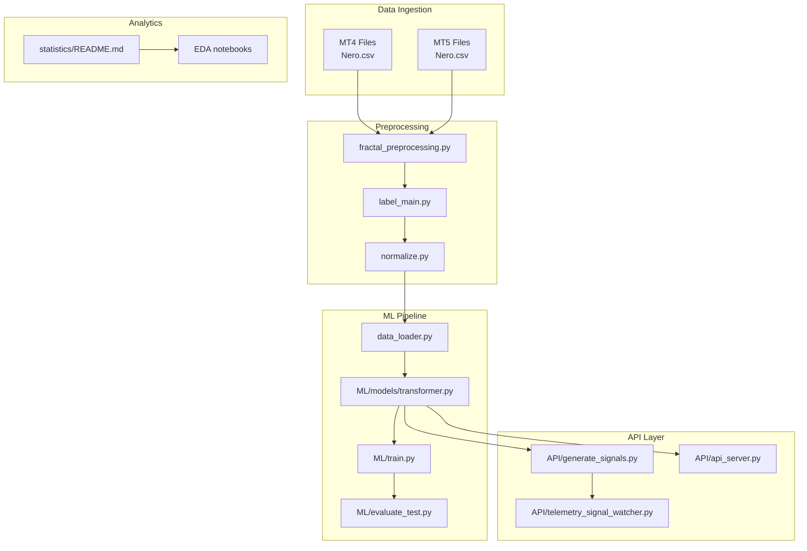
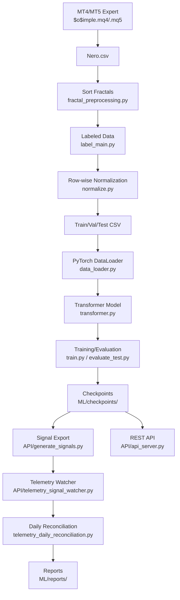
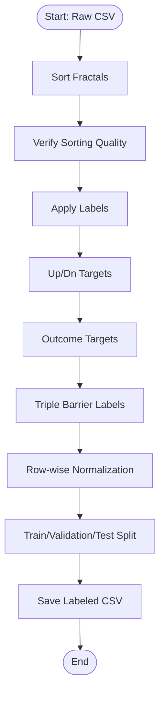
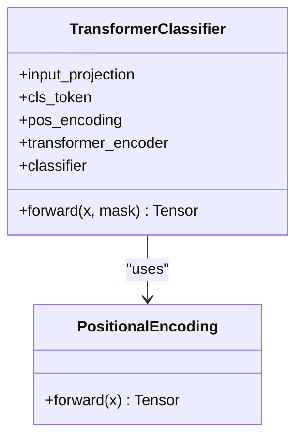
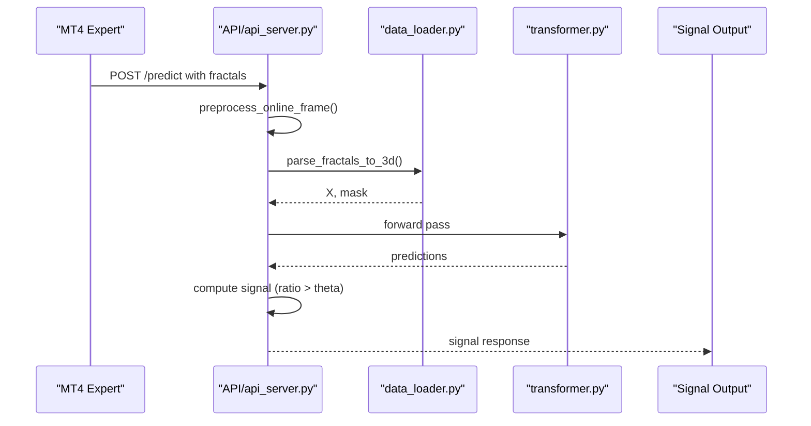
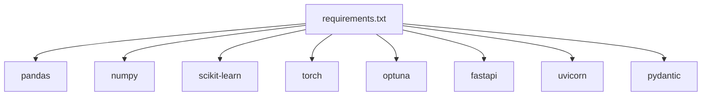

# Project Status and Roadmap

<cite>
**Referenced Files in This Document**
- [README.md](file://README.md)
- [docs/DATA_FLOW.md](file://docs/DATA_FLOW.md)
- [docs/superpowers/roadmap.md](file://docs/superpowers/roadmap.md)
- [ML/README.md](file://ML/README.md)
- [API/README.md](file://API/README.md)
- [requirements.txt](file://requirements.txt)
- [processing/label_main.py](file://processing/label_main.py)
- [processing/fractal_preprocessing.py](file://processing/fractal_preprocessing.py)
- [processing/normalize.py](file://processing/normalize.py)
- [API/api_server.py](file://API/api_server.py)
- [ML/models/transformer.py](file://ML/models/transformer.py)
- [docs/ML/neural_networks.md](file://docs/ML/neural_networks.md)
- [docs/ML/conformal_prediction.md](file://docs/ML/conformal_prediction.md)
- [docs/ML/live_safe_audit.py.md](file://docs/ML/live_safe_audit.py.md)
- [statistics/README.md](file://statistics/README.md)
</cite>

## Table of Contents
1. [Introduction](#introduction)
2. [Project Structure](#project-structure)
3. [Core Components](#core-components)
4. [Architecture Overview](#architecture-overview)
5. [Detailed Component Analysis](#detailed-component-analysis)
6. [Dependency Analysis](#dependency-analysis)
7. [Performance Considerations](#performance-considerations)
8. [Troubleshooting Guide](#troubleshooting-guide)
9. [Conclusion](#conclusion)
10. [Appendices](#appendices)

## Introduction
SoSimple is an active machine learning research project focused on trend reversal prediction for Forex (H1 timeframe) using MetaTrader 4/5. The project currently supports end-to-end data collection, preprocessing, exploratory data analysis (EDA), and machine learning model training and evaluation. It also provides APIs for generating ML-powered trading signals and a telemetry loop for online monitoring. The project is in active development with a clear roadmap emphasizing live-safe ML audits, feature-source audits, and robustness checks prior to production deployment.

Key capabilities validated in the current pipeline:
- Data ingestion from MetaTrader via the $o$imple expert and lib_PIC library
- Fractal sorting and labeling with multiple horizons and outcome targets
- Row-wise normalization and train/validation/test splitting
- Transformer-based neural networks for multi-target regression
- Signal generation and parity checks against MT4 tester logs
- Telemetry reconciliation and daily reconciliation reporting
- Conformal prediction integration and live-safe ML auditing

Current maturity and production readiness:
- The project demonstrates strong offline validation and parity with MT4 testing.
- A central inference service is under design to replace manual watchers.
- Live-safe ML audit reveals current FAIL verdicts for existing systems pending remediation.

**Section sources**
- [README.md:21-25](file://README.md#L21-L25)
- [docs/DATA_FLOW.md:6-75](file://docs/DATA_FLOW.md#L6-L75)

## Project Structure
The repository is organized into modular components supporting data processing, machine learning, API services, and documentation. The primary directories include:
- DATA: Generated datasets and artifacts from preprocessing
- processing/: Data ingestion, sorting, labeling, and normalization
- ML/: Model architectures, training, evaluation, and benchmarking scripts
- API/: Signal generation and REST API server for online inference
- statistics/: EDA, reconciliation, and diagnostics
- docs/: Comprehensive documentation for data flow, ML, and operational procedures
- MT/: MetaTrader 4/5 integration assets and testers

**Diagram sources**
- [docs/DATA_FLOW.md:6-75](file://docs/DATA_FLOW.md#L6-L75)
- [processing/fractal_preprocessing.py:65-86](file://processing/fractal_preprocessing.py#L65-L86)
- [processing/label_main.py:205-332](file://processing/label_main.py#L205-L332)
- [processing/normalize.py:284-511](file://processing/normalize.py#L284-L511)
- [ML/models/transformer.py:78-199](file://ML/models/transformer.py#L78-L199)
- [API/api_server.py:103-170](file://API/api_server.py#L103-L170)

**Section sources**
- [docs/DATA_FLOW.md:6-75](file://docs/DATA_FLOW.md#L6-L75)

## Core Components
This section outlines the core components that enable SoSimple’s current capabilities and ongoing development.

- Data Collection and Preprocessing
  - Fractal sorting and validation to ensure temporal ordering within rows
  - Labeling pipeline covering signal, predict, Up/Dn horizons, outcome-aligned targets, and triple barrier labels
  - Row-wise normalization with piecewise linear-log transforms and robust ATR scaling
  - Train/validation/test split preserving time-series order

- Machine Learning
  - Transformer-based encoder for sequence modeling of fractals
  - Multi-target regression (10 horizons) and classification tasks
  - Training, optimization, evaluation, and threshold analysis workflows
  - Baselines and conformal prediction integration

- API and Telemetry
  - Signal generation for MT4 tester and runtime exports
  - REST API for online inference with live-safe preprocessing
  - Telemetry watcher and daily reconciliation for operational monitoring

- Statistics and Diagnostics
  - EDA notebooks and statistical summaries
  - Trade-level reconciliation between ML predictions and MT4 logs

**Section sources**
- [processing/fractal_preprocessing.py:65-86](file://processing/fractal_preprocessing.py#L65-L86)
- [processing/label_main.py:205-332](file://processing/label_main.py#L205-L332)
- [processing/normalize.py:284-511](file://processing/normalize.py#L284-L511)
- [ML/README.md:19-67](file://ML/README.md#L19-L67)
- [API/README.md:9-22](file://API/README.md#L9-L22)
- [statistics/README.md:7-16](file://statistics/README.md#L7-L16)

## Architecture Overview
The SoSimple architecture integrates MetaTrader data ingestion with a robust preprocessing pipeline, ML training and evaluation, and operational APIs for signal generation and telemetry.

**Diagram sources**
- [docs/DATA_FLOW.md:6-75](file://docs/DATA_FLOW.md#L6-L75)
- [API/api_server.py:103-170](file://API/api_server.py#L103-L170)
- [ML/models/transformer.py:78-199](file://ML/models/transformer.py#L78-L199)

**Section sources**
- [docs/DATA_FLOW.md:6-75](file://docs/DATA_FLOW.md#L6-L75)

## Detailed Component Analysis

### Data Collection and Preprocessing
The preprocessing pipeline ensures data integrity and prepares features for ML training and inference.

- Fractal Sorting
  - Sorts fractals within each row by time in descending order to maintain temporal consistency
  - Validates sorting correctness and logs errors for inspection

- Labeling
  - Applies comprehensive labeling including signal, predict, Up/Dn horizons (3/6/12/24/48), outcome-aligned targets, and triple barrier labels
  - Ensures labels are computed before normalization to avoid leakage

- Normalization
  - Implements row-wise normalization with piecewise linear-log transforms for heavy-tailed features
  - Uses robust ATR scaling and preserves direction/strong indicators without transformation
  - Saves normalization statistics for denormalization during diagnostics

**Diagram sources**
- [processing/label_main.py:205-332](file://processing/label_main.py#L205-L332)
- [processing/fractal_preprocessing.py:65-86](file://processing/fractal_preprocessing.py#L65-L86)
- [processing/normalize.py:284-511](file://processing/normalize.py#L284-L511)

**Section sources**
- [processing/label_main.py:205-332](file://processing/label_main.py#L205-L332)
- [processing/fractal_preprocessing.py:65-86](file://processing/fractal_preprocessing.py#L65-L86)
- [processing/normalize.py:284-511](file://processing/normalize.py#L284-L511)

### Machine Learning Pipeline
The ML stack focuses on transformer-based models for multi-target regression and comparative benchmarking.

- Model Architecture
  - Transformer encoder with positional encoding and CLS token pooling
  - Input projection from 20 features per fractal to d_model
  - Padding masks to handle variable-length sequences

- Training and Evaluation
  - Supports classification, regression, and multi-target regression tasks
  - Uses Focal Loss for classification and directional asymmetric loss for regression
  - Employs Optuna for hyperparameter optimization and early stopping

- Reports and Artifacts
  - Training curves, confusion matrices, and residual plots
  - Threshold analysis reports for signal generation
  - Optuna best parameters and study histories

**Diagram sources**
- [ML/models/transformer.py:35-76](file://ML/models/transformer.py#L35-L76)
- [ML/models/transformer.py:78-199](file://ML/models/transformer.py#L78-L199)

**Section sources**
- [ML/README.md:19-67](file://ML/README.md#L19-L67)
- [docs/ML/neural_networks.md:162-174](file://docs/ML/neural_networks.md#L162-L174)
- [ML/models/transformer.py:78-199](file://ML/models/transformer.py#L78-L199)

### API and Telemetry
The API layer enables both offline and online signal generation with operational monitoring.

- Signal Generation
  - Generates CSV signals for MT4 tester and runtime exports
  - Supports legacy regression_updn and triple barrier tasks
  - Integrates conformal prediction for magnitude filtering

- REST API
  - FastAPI service for real-time inference from MT4
  - Live-safe preprocessing pipeline and model loading
  - Decision logic based on horizon-specific ratios

- Telemetry and Reconciliation
  - Watcher monitors Nero.csv and produces runtime signals
  - Daily reconciliation compares exported signals with MT4 logs
  - Metadata and parity reports for operational assurance

**Diagram sources**
- [API/api_server.py:103-170](file://API/api_server.py#L103-L170)
- [ML/models/transformer.py:150-199](file://ML/models/transformer.py#L150-L199)

**Section sources**
- [API/README.md:9-22](file://API/README.md#L9-L22)
- [API/api_server.py:103-170](file://API/api_server.py#L103-L170)
- [docs/ML/conformal_prediction.md:35-108](file://docs/ML/conformal_prediction.md#L35-L108)

### Statistics and Diagnostics
Statistical analysis and reconciliation ensure alignment between ML predictions and real-world execution.

- EDA and Statistical Summaries
  - Jupyter notebooks and automated reports for feature distributions and class balances
  - Welford streaming statistics and reservoir sampling for large datasets

- Trade-Level Reconciliation
  - Signal tracer for single and batch analysis
  - From-log reconciliation to compare trades with MT4 logs
  - Loss-only reporting for performance diagnostics

**Section sources**
- [statistics/README.md:7-16](file://statistics/README.md#L7-L16)
- [docs/DATA_FLOW.md:537-558](file://docs/DATA_FLOW.md#L537-L558)

## Dependency Analysis
The project relies on a curated set of Python libraries for data manipulation, ML, and web services.

- Core Dependencies
  - pandas, numpy, scipy, scikit-learn for data processing and ML
  - matplotlib, seaborn for visualization
  - torch, optuna for deep learning and optimization
  - fastapi, uvicorn, pydantic for REST API

- External Integration
  - MetaTrader 4/5 via $o$imple expert and lib_PIC for data export
  - Strategy Tester for parity checks and backtesting

**Diagram sources**
- [requirements.txt:1-17](file://requirements.txt#L1-L17)

**Section sources**
- [requirements.txt:1-17](file://requirements.txt#L1-L17)

## Performance Considerations
- Data Pipeline Efficiency
  - Row-wise normalization avoids data leakage and reduces overhead
  - Padding masks efficiently handle variable-length sequences in transformers
- Model Inference
  - Single-pass inference with minimal preprocessing for low-latency online decisions
  - GPU acceleration via CUDA for transformer inference
- Operational Monitoring
  - Telemetry watcher designed for periodic polling with heartbeat and runtime limits
  - Central inference service design aims to reduce operational risk and improve scalability

[No sources needed since this section provides general guidance]

## Troubleshooting Guide
Common issues and resolutions:

- Data Leakage Prevention
  - Ensure sorting is row-wise and labels are applied before normalization
  - Verify train/validation/test split is sequential and no shuffling occurs

- Live-Safe ML Audit Failures
  - Review feature sourcing and transformation timings
  - Apply leak-proof feature profiles and retrain models before online deployment

- Conformal Prediction Limitations
  - CP provides global intervals; consider adaptive or CQR approaches for dynamic thresholds
  - Adjust theta thresholds to balance signal volume and quality

- Telemetry and Parity Checks
  - Validate Nero.csv format and encoding; confirm column order matches expectations
  - Use daily reconciliation to detect mismatches between exports and MT4 logs

**Section sources**
- [docs/DATA_FLOW.md:525-535](file://docs/DATA_FLOW.md#L525-L535)
- [docs/ML/live_safe_audit.py.md:1-17](file://docs/ML/live_safe_audit.py.md#L1-L17)
- [docs/ML/conformal_prediction.md:68-92](file://docs/ML/conformal_prediction.md#L68-L92)

## Conclusion
SoSimple is actively developing a robust ML-driven trading system with validated offline performance and operational tooling. The current pipeline supports comprehensive preprocessing, multi-target modeling, and signal generation with telemetry reconciliation. The roadmap emphasizes live-safe audits, feature-source audits, and cross-instrument robustness to ensure reliable production deployment. While the project demonstrates strong capabilities, ongoing work is required to address current FAIL verdicts and operationalize the central inference service.

[No sources needed since this section summarizes without analyzing specific files]

## Appendices

### Roadmap Highlights
- Live-safe ML audit across five systems with immediate remediation needs
- lib_PIC feature-source audit to map inputs to model features
- Current feature importance diagnostics to guide input improvements
- Central inference service design for scalable online operations

**Section sources**
- [docs/superpowers/roadmap.md:15-39](file://docs/superpowers/roadmap.md#L15-L39)
- [docs/superpowers/roadmap.md:40-87](file://docs/superpowers/roadmap.md#L40-L87)
- [docs/superpowers/roadmap.md:120-136](file://docs/superpowers/roadmap.md#L120-L136)