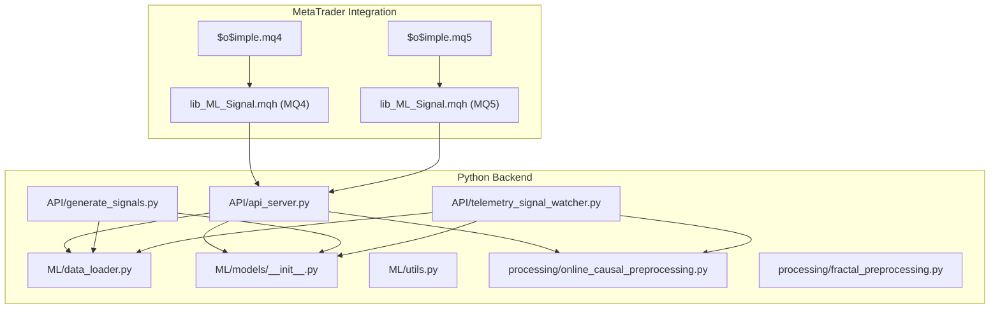
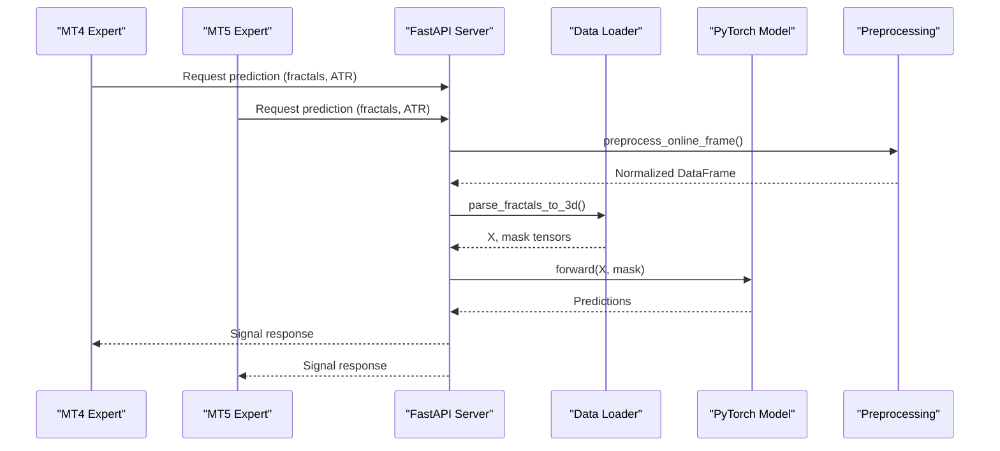
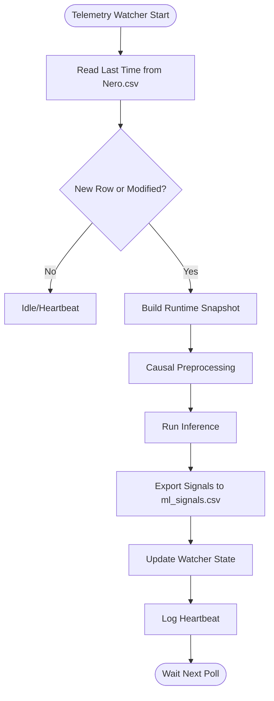
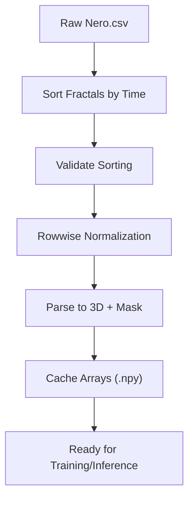
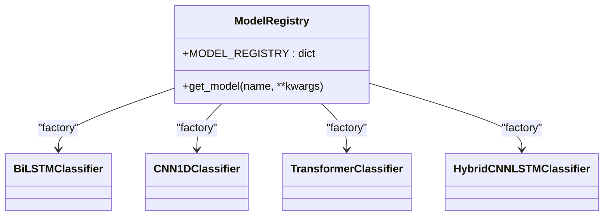
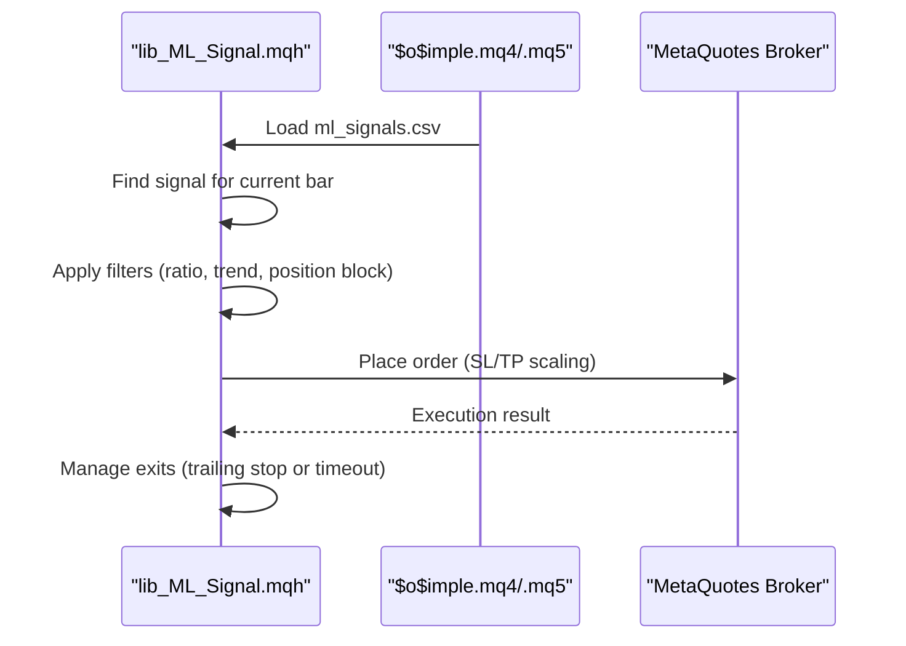
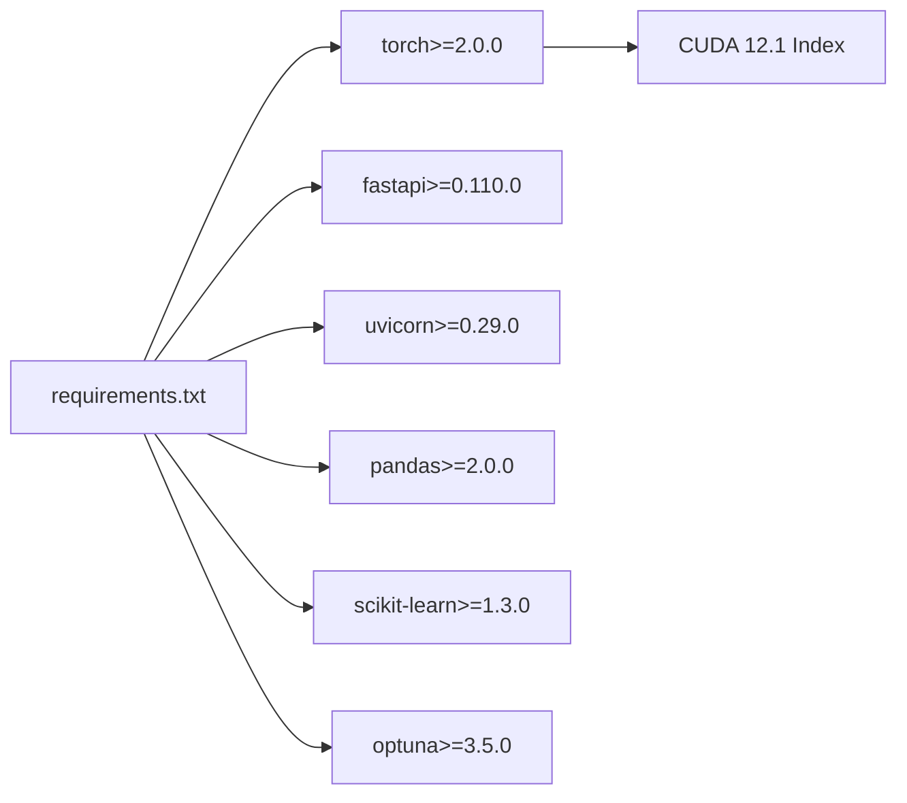

# Technology Stack and Architecture

<cite>
**Referenced Files in This Document**
- [README.md](file://README.md)
- [requirements.txt](file://requirements.txt)
- [API/api_server.py](file://API/api_server.py)
- [API/generate_signals.py](file://API/generate_signals.py)
- [API/telemetry_signal_watcher.py](file://API/telemetry_signal_watcher.py)
- [ML/models/__init__.py](file://ML/models/__init__.py)
- [ML/data_loader.py](file://ML/data_loader.py)
- [ML/utils.py](file://ML/utils.py)
- [processing/online_causal_preprocessing.py](file://processing/online_causal_preprocessing.py)
- [processing/fractal_preprocessing.py](file://processing/fractal_preprocessing.py)
- [MT/MQL4/Experts/$o$imple.mq4](file://MT/MQL4/Experts/$o$imple.mq4)
- [MT/MQL5/Experts/$o$imple.mq5](file://MT/MQL5/Experts/$o$imple.mq5)
- [MT/MQL4/Include/lib_ML_Signal.mqh](file://MT/MQL4/Include/lib_ML_Signal.mqh)
- [MT/MQL5/Include/lib_ML_Signal.mqh](file://MT/MQL5/Include/lib_ML_Signal.mqh)
</cite>

## Table of Contents
1. [Introduction](#introduction)
2. [Project Structure](#project-structure)
3. [Core Components](#core-components)
4. [Architecture Overview](#architecture-overview)
5. [Detailed Component Analysis](#detailed-component-analysis)
6. [Dependency Analysis](#dependency-analysis)
7. [Performance Considerations](#performance-considerations)
8. [Troubleshooting Guide](#troubleshooting-guide)
9. [Conclusion](#conclusion)

## Introduction
This document describes the technology stack and architecture of the SoSimple trading bot. The system integrates a Python-based machine learning pipeline with a MetaTrader 4/5 execution engine. It features a layered architecture:
- Data processing pipeline (preprocessing, feature engineering, and caching)
- Machine learning models (PyTorch-based)
- API services (FastAPI) for inference and signal generation
- Trading execution (MetaTrader experts and libraries)

The system emphasizes real-time processing and execution, with careful separation of concerns across layers and robust validation for live inference.

## Project Structure
The repository is organized into distinct functional areas:
- API: REST API server and signal generation utilities
- ML: Model registry, training/inference utilities, data loaders, and tasks
- processing: Online causal preprocessing and fractal sorting
- MT: MetaTrader 4/5 integration (experts, libraries, and tester configurations)
- DATA: Training/validation/test datasets
- statistics, tests, docs, and wiki: Research, testing, and documentation assets

**Diagram sources**
- [API/api_server.py:1-174](file://API/api_server.py#L1-L174)
- [API/generate_signals.py:1-745](file://API/generate_signals.py#L1-L745)
- [API/telemetry_signal_watcher.py:1-422](file://API/telemetry_signal_watcher.py#L1-L422)
- [ML/data_loader.py:1-1210](file://ML/data_loader.py#L1-L1210)
- [ML/models/__init__.py:1-49](file://ML/models/__init__.py#L1-L49)
- [ML/utils.py:1-340](file://ML/utils.py#L1-L340)
- [processing/online_causal_preprocessing.py:1-137](file://processing/online_causal_preprocessing.py#L1-L137)
- [processing/fractal_preprocessing.py:1-86](file://processing/fractal_preprocessing.py#L1-L86)
- [MT/MQL4/Experts/$o$imple.mq4:1-149](file://MT/MQL4/Experts/$o$imple.mq4#L1-L149)
- [MT/MQL5/Experts/$o$imple.mq5:1-157](file://MT/MQL5/Experts/$o$imple.mq5#L1-L157)
- [MT/MQL4/Include/lib_ML_Signal.mqh:1-951](file://MT/MQL4/Include/lib_ML_Signal.mqh#L1-L951)
- [MT/MQL5/Include/lib_ML_Signal.mqh:1-325](file://MT/MQL5/Include/lib_ML_Signal.mqh#L1-L325)

**Section sources**
- [README.md:1-25](file://README.md#L1-L25)
- [requirements.txt:1-17](file://requirements.txt#L1-L17)

## Core Components
- Python ecosystem
  - PyTorch: Neural network framework for model inference and training
  - FastAPI: REST API for serving ML predictions and generating signals
  - Pandas/NumPy: Data manipulation and numerical computing
  - Scikit-learn/Optuna: Model evaluation and hyperparameter optimization
- MetaTrader 4/5 integration
  - Experts ($o$imple.mq4/.mq5): Execution logic and parameterized strategies
  - Libraries (lib_ML_Signal.mqh): Signal ingestion and position management
- Development tools
  - uvicorn: ASGI server for FastAPI
  - Jupyter/IPython: Notebook environments for research and experimentation

Technology choices are justified by:
- Real-time inference needs (FastAPI + PyTorch)
- Structured data handling (Pandas/NumPy)
- Reproducible ML experiments (Scikit-learn/Optuna)
- Direct broker connectivity and execution control (MetaTrader)

**Section sources**
- [requirements.txt:1-17](file://requirements.txt#L1-L17)
- [API/api_server.py:1-174](file://API/api_server.py#L1-L174)
- [ML/utils.py:326-340](file://ML/utils.py#L326-L340)

## Architecture Overview
The SoSimple architecture follows a layered pattern:
- Data ingestion: MetaTrader writes Nero.csv snapshots
- Preprocessing: Online causal preprocessing ensures sorted and normalized fractals
- Inference: FastAPI loads trained models and produces signals
- Signal distribution: Signals exported to ml_signals.csv for MT4/5 consumption
- Execution: MT experts read ml_signals.csv and place orders with configurable exits

**Diagram sources**
- [API/api_server.py:103-169](file://API/api_server.py#L103-L169)
- [processing/online_causal_preprocessing.py:109-122](file://processing/online_causal_preprocessing.py#L109-L122)
- [ML/data_loader.py:331-424](file://ML/data_loader.py#L331-L424)
- [ML/models/__init__.py:31-49](file://ML/models/__init__.py#L31-L49)

## Detailed Component Analysis

### API Layer
- FastAPI REST service
  - Health check and prediction endpoint
  - Model loading via lifecycle manager
  - Online preprocessing and inference pipeline
- Signal generation utilities
  - Batch inference across train/validation/test splits
  - Export to ml_signals.csv for MT4/5
  - Optional conformal prediction filtering
- Telemetry watcher
  - Monitors Nero.csv for new rows
  - Builds runtime snapshots and runs online inference
  - Writes ml_signals.csv atomically for MT consumers

**Diagram sources**
- [API/telemetry_signal_watcher.py:260-327](file://API/telemetry_signal_watcher.py#L260-L327)
- [API/generate_signals.py:342-668](file://API/generate_signals.py#L342-L668)

**Section sources**
- [API/api_server.py:1-174](file://API/api_server.py#L1-L174)
- [API/generate_signals.py:1-745](file://API/generate_signals.py#L1-L745)
- [API/telemetry_signal_watcher.py:1-422](file://API/telemetry_signal_watcher.py#L1-L422)

### Data Processing Pipeline
- Fractal parsing and normalization
  - Parse 100 fractals per row into 3D tensors
  - Compute time features and ATR ratios
  - Build padding masks for sequence-aware models
- Online causal preprocessing
  - Sort fractals by time within each row
  - Validate ordering and rowwise normalization guards
  - Prevent double normalization and future leakage
- Feature engineering and caching
  - StandardScaler fit/transform for features
  - Cache preprocessed arrays to accelerate training/inference

**Diagram sources**
- [processing/fractal_preprocessing.py:65-85](file://processing/fractal_preprocessing.py#L65-L85)
- [processing/online_causal_preprocessing.py:109-122](file://processing/online_causal_preprocessing.py#L109-L122)
- [ML/data_loader.py:331-424](file://ML/data_loader.py#L331-L424)

**Section sources**
- [ML/data_loader.py:1-1210](file://ML/data_loader.py#L1-L1210)
- [processing/online_causal_preprocessing.py:1-137](file://processing/online_causal_preprocessing.py#L1-L137)
- [processing/fractal_preprocessing.py:1-86](file://processing/fractal_preprocessing.py#L1-L86)

### Machine Learning Models
- Model registry and selection
  - Centralized factory for BiLSTM, CNN1D, Transformer, Hybrid architectures
  - Consistent interface: forward(x, mask=None) -> logits
- Training/inference utilities
  - Seed fixation, metrics computation, parameter counting
  - Device detection (GPU/CPU)
- Tasks and targets
  - Multi-target regression (up/dn horizons)
  - Binary classification and triple barrier tasks
  - Entry path and trailing stop targets

**Diagram sources**
- [ML/models/__init__.py:1-49](file://ML/models/__init__.py#L1-L49)

**Section sources**
- [ML/models/__init__.py:1-49](file://ML/models/__init__.py#L1-L49)
- [ML/utils.py:1-340](file://ML/utils.py#L1-L340)

### MetaTrader Integration
- MT4/5 Experts
  - Parameterized strategies with risk management and trend filters
  - Support for multiple execution modes (timeout parity vs trailing stop)
- Signal libraries
  - Load ml_signals.csv and enforce timing/ratio filters
  - Manage exits, position sizing, and trailing stops
  - Track broker-closed orders and diagnostics

**Diagram sources**
- [MT/MQL4/Include/lib_ML_Signal.mqh:603-799](file://MT/MQL4/Include/lib_ML_Signal.mqh#L603-L799)
- [MT/MQL5/Include/lib_ML_Signal.mqh:161-299](file://MT/MQL5/Include/lib_ML_Signal.mqh#L161-L299)
- [MT/MQL4/Experts/$o$imple.mq4:123-147](file://MT/MQL4/Experts/$o$imple.mq4#L123-L147)
- [MT/MQL5/Experts/$o$imple.mq5:137-147](file://MT/MQL5/Experts/$o$imple.mq5#L137-L147)

**Section sources**
- [MT/MQL4/Include/lib_ML_Signal.mqh:1-951](file://MT/MQL4/Include/lib_ML_Signal.mqh#L1-L951)
- [MT/MQL5/Include/lib_ML_Signal.mqh:1-325](file://MT/MQL5/Include/lib_ML_Signal.mqh#L1-L325)
- [MT/MQL4/Experts/$o$imple.mq4:1-149](file://MT/MQL4/Experts/$o$imple.mq4#L1-L149)
- [MT/MQL5/Experts/$o$imple.mq5:1-157](file://MT/MQL5/Experts/$o$imple.mq5#L1-L157)

## Dependency Analysis
Key external dependencies and version requirements:
- Python packages: pandas>=2.0.0, numpy>=1.24.0, torch>=2.0.0, fastapi>=0.110.0, uvicorn>=0.29.0, scikit-learn>=1.3.0, optuna>=3.5.0, etc.
- GPU acceleration: PyTorch with CUDA 12.1 index URL
- ASGI server: uvicorn for production-grade FastAPI hosting

Compatibility considerations:
- Torch version pinned to ensure reproducible training/inference
- Optuna JSON integration for architecture parameters
- Pandas/NumPy versions support vectorized operations and categorical features
- FastAPI/pydantic for robust request/response validation

**Diagram sources**
- [requirements.txt:1-17](file://requirements.txt#L1-L17)

**Section sources**
- [requirements.txt:1-17](file://requirements.txt#L1-L17)

## Performance Considerations
- GPU utilization
  - Automatic device selection (GPU preferred) for inference acceleration
- Data pipeline efficiency
  - Caching of parsed arrays (.npy) reduces repeated preprocessing overhead
  - Vectorized parsing and normalization minimize Python loops
- Model inference
  - Batched inference with DataLoader for throughput
  - Masked sequences enable efficient Transformer processing
- Real-time constraints
  - FastAPI with uvicorn provides low-latency HTTP serving
  - Online watcher polls for new rows and rebuilds signals incrementally

[No sources needed since this section provides general guidance]

## Troubleshooting Guide
Common issues and resolutions:
- Model not found
  - Verify checkpoint path and task-specific suffixes
  - Ensure Optuna JSON parameters match model kwargs
- Preprocessing failures
  - Validate fractal sorting and rowwise normalization guards
  - Confirm expected CSV columns and field counts
- Signal generation errors
  - Check Optuna calibration and conformal prediction files
  - Ensure ml_signals.csv is written atomically and readable by MT
- Execution problems
  - Review broker-closed order logs and exit mode configuration
  - Confirm SL/TP scaling and position blocking conditions

**Section sources**
- [API/api_server.py:59-88](file://API/api_server.py#L59-L88)
- [processing/online_causal_preprocessing.py:57-82](file://processing/online_causal_preprocessing.py#L57-L82)
- [API/generate_signals.py:360-377](file://API/generate_signals.py#L360-L377)
- [MT/MQL4/Include/lib_ML_Signal.mqh:139-187](file://MT/MQL4/Include/lib_ML_Signal.mqh#L139-L187)

## Conclusion
SoSimple employs a robust, layered architecture combining Python’s scientific stack with MetaTrader’s execution capabilities. The system prioritizes real-time inference, reproducibility, and safety through online causal preprocessing and explicit contract guards. Dependencies are carefully managed to ensure compatibility across training, inference, and live operation.