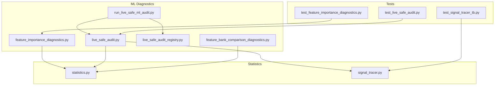
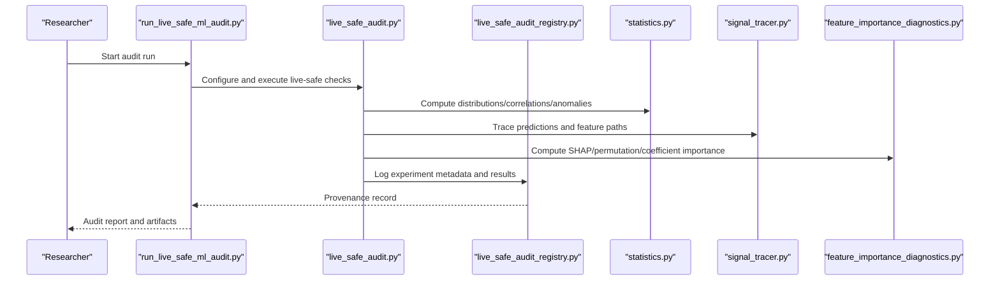
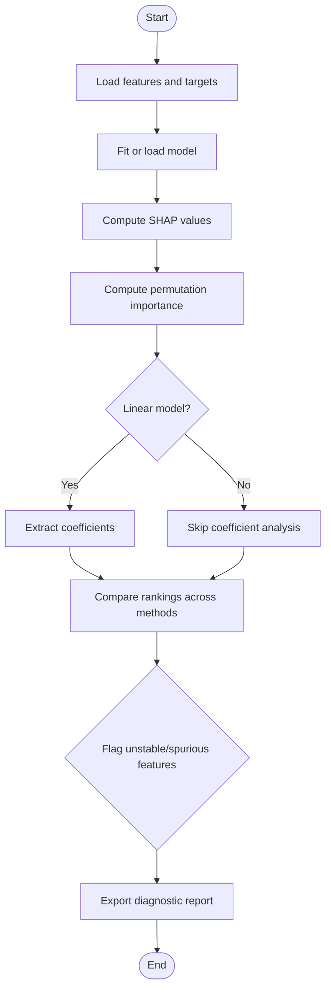
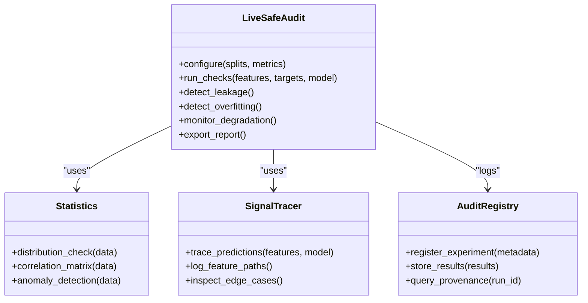
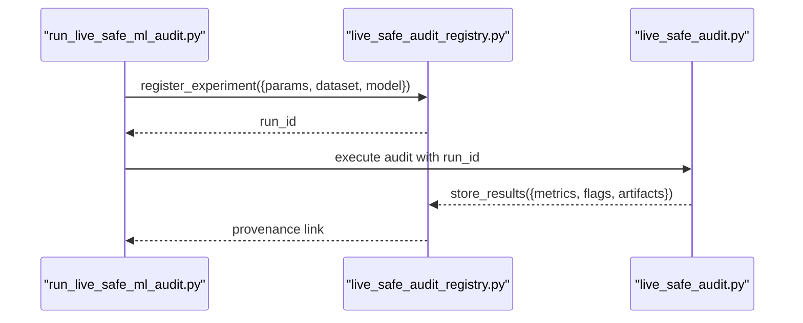
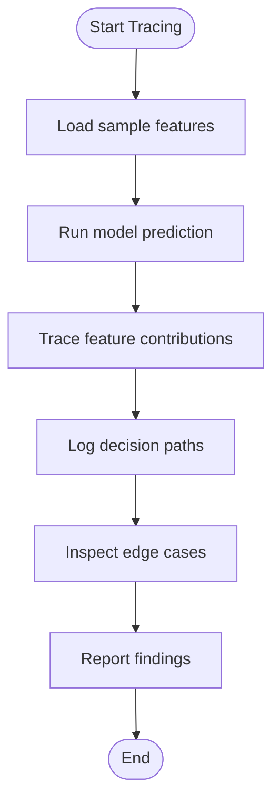
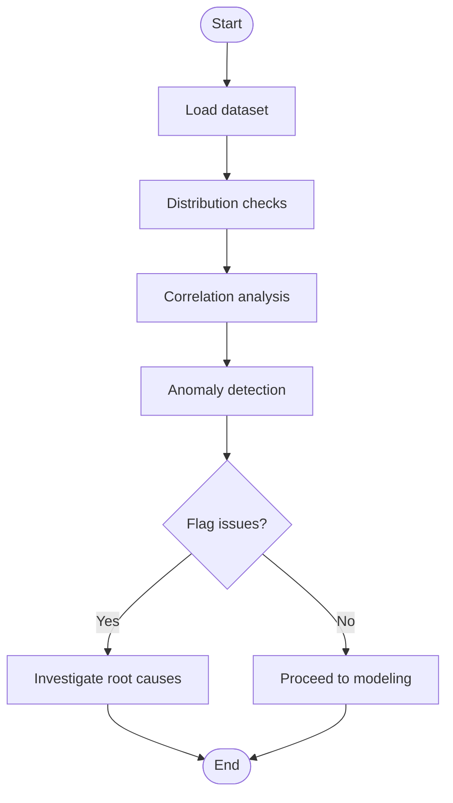
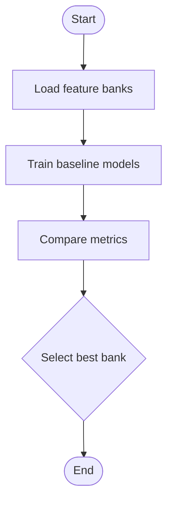
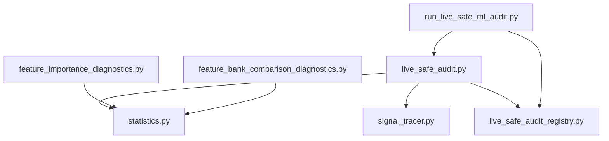

# Diagnostic Tools

<cite>
**Referenced Files in This Document**
- [feature_importance_diagnostics.py](file://ML/feature_importance_diagnostics.py)
- [live_safe_audit.py](file://ML/live_safe_audit.py)
- [live_safe_audit_registry.py](file://ML/live_safe_audit_registry.py)
- [signal_tracer.py](file://statistics/signal_tracer.py)
- [statistics.py](file://statistics/statistics.py)
- [run_live_safe_ml_audit.py](file://ML/run_live_safe_ml_audit.py)
- [feature_bank_comparison_diagnostics.py](file://ML/feature_bank_comparison_diagnostics.py)
- [test_feature_importance_diagnostics.py](file://tests/test_feature_importance_diagnostics.py)
- [test_live_safe_audit.py](file://tests/test_live_safe_audit.py)
- [test_signal_tracer_tb.py](file://tests/test_signal_tracer_tb.py)
</cite>

## Table of Contents
1. Introduction
2. Project Structure
3. Core Components
4. Architecture Overview
5. Detailed Component Analysis
6. Dependency Analysis
7. Performance Considerations
8. Troubleshooting Guide
9. Conclusion

## Introduction
This document explains the diagnostic tools used across SoSimple research to validate model behavior, ensure live safety, and maintain research integrity. It covers:
- Feature importance analysis (SHAP values, permutation importance, coefficient-based methods)
- Live-safe audit framework for detecting data leakage, overfitting, and performance degradation
- Signal tracing capabilities for debugging prediction logic and understanding model behavior
- Statistical analysis tools for distribution checks, correlation analysis, and anomaly detection
- The audit registry system for tracking experimental results and maintaining provenance
- Practical examples and troubleshooting workflows for research validation

## Project Structure
The diagnostic tooling is primarily implemented under ML and statistics modules, with tests validating behavior and usage patterns. Key entry points include:
- Feature importance diagnostics
- Live-safe audit runner and registry
- Signal tracer for execution-time inspection
- Statistical utilities for EDA and anomaly detection

**Diagram sources**
- [feature_importance_diagnostics.py](file://ML/feature_importance_diagnostics.py)
- [live_safe_audit.py](file://ML/live_safe_audit.py)
- [live_safe_audit_registry.py](file://ML/live_safe_audit_registry.py)
- [run_live_safe_ml_audit.py](file://ML/run_live_safe_ml_audit.py)
- [feature_bank_comparison_diagnostics.py](file://ML/feature_bank_comparison_diagnostics.py)
- [statistics.py](file://statistics/statistics.py)
- [signal_tracer.py](file://statistics/signal_tracer.py)
- [test_feature_importance_diagnostics.py](file://tests/test_feature_importance_diagnostics.py)
- [test_live_safe_audit.py](file://tests/test_live_safe_audit.py)
- [test_signal_tracer_tb.py](file://tests/test_signal_tracer_tb.py)

**Section sources**
- [feature_importance_diagnostics.py](file://ML/feature_importance_diagnostics.py)
- [live_safe_audit.py](file://ML/live_safe_audit.py)
- [live_safe_audit_registry.py](file://ML/live_safe_audit_registry.py)
- [run_live_safe_ml_audit.py](file://ML/run_live_safe_ml_audit.py)
- [feature_bank_comparison_diagnostics.py](file://ML/feature_bank_comparison_diagnostics.py)
- [statistics.py](file://statistics/statistics.py)
- [signal_tracer.py](file://statistics/signal_tracer.py)
- [test_feature_importance_diagnostics.py](file://tests/test_feature_importance_diagnostics.py)
- [test_live_safe_audit.py](file://tests/test_live_safe_audit.py)
- [test_signal_tracer_tb.py](file://tests/test_signal_tracer_tb.py)

## Core Components
- Feature Importance Diagnostics: Provides SHAP-based, permutation-based, and coefficient-driven analyses to quantify feature contributions and detect unstable or spurious signals.
- Live-Safe Audit: A framework to detect data leakage, overfitting, and performance degradation by comparing train/validation/out-of-sample metrics and running robustness checks.
- Audit Registry: Tracks experiments, parameters, and outcomes to ensure reproducibility and provenance.
- Signal Tracer: Inspects prediction logic at runtime to trace how features influence decisions and to debug edge cases.
- Statistical Utilities: Distribution checks, correlation matrices, and anomaly detection routines to validate data quality and stability.

**Section sources**
- [feature_importance_diagnostics.py](file://ML/feature_importance_diagnostics.py)
- [live_safe_audit.py](file://ML/live_safe_audit.py)
- [live_safe_audit_registry.py](file://ML/live_safe_audit_registry.py)
- [signal_tracer.py](file://statistics/signal_tracer.py)
- [statistics.py](file://statistics/statistics.py)

## Architecture Overview
The diagnostic pipeline integrates feature-level insights, live-safety checks, and statistical validations into a cohesive workflow. The runner orchestrates audits and registries, while tracers and statistics provide granular visibility.

**Diagram sources**
- [run_live_safe_ml_audit.py](file://ML/run_live_safe_ml_audit.py)
- [live_safe_audit.py](file://ML/live_safe_audit.py)
- [live_safe_audit_registry.py](file://ML/live_safe_audit_registry.py)
- [statistics.py](file://statistics/statistics.py)
- [signal_tracer.py](file://statistics/signal_tracer.py)
- [feature_importance_diagnostics.py](file://ML/feature_importance_diagnostics.py)

## Detailed Component Analysis

### Feature Importance Diagnostics
Purpose:
- Quantify feature contributions using multiple methods to cross-validate findings.
- Identify unstable or misleading features that may indicate leakage or overfitting.

Key capabilities:
- SHAP value computation for model-agnostic explanations
- Permutation importance to measure predictive impact
- Coefficient-based analysis for linear models

Typical workflow:
- Prepare feature matrix and target labels
- Fit or load model
- Compute SHAP values and permutation importances
- Compare rankings and flag inconsistencies
- Export reports for review

**Diagram sources**
- [feature_importance_diagnostics.py](file://ML/feature_importance_diagnostics.py)

Practical example:
- Use SHAP to confirm whether key price action features drive predictions consistently across folds.
- Cross-check with permutation importance to rule out correlated features inflating importance scores.
- For linear baselines, inspect coefficients to ensure sign consistency with domain expectations.

**Section sources**
- [feature_importance_diagnostics.py](file://ML/feature_importance_diagnostics.py)
- [test_feature_importance_diagnostics.py](file://tests/test_feature_importance_diagnostics.py)

### Live-Safe Audit Framework
Purpose:
- Detect data leakage, overfitting, and performance degradation before deployment.
- Ensure consistent behavior across train/validation/out-of-sample splits.

Core checks:
- Leakage detection via temporal ordering and future information guards
- Overfitting detection by comparing training vs validation metrics
- Degradation monitoring through rolling windows and stress tests
- Robustness checks across instruments and time periods

**Diagram sources**
- [live_safe_audit.py](file://ML/live_safe_audit.py)
- [statistics.py](file://statistics/statistics.py)
- [signal_tracer.py](file://statistics/signal_tracer.py)
- [live_safe_audit_registry.py](file://ML/live_safe_audit_registry.py)

Practical example:
- Run live-safe audit on a transformer model trained on entry-path features; verify no leakage from post-entry signals and stable validation metrics across time splits.
- If degradation is detected, use signal tracer to identify which features cause instability and retrain with corrected preprocessing.

**Section sources**
- [live_safe_audit.py](file://ML/live_safe_audit.py)
- [run_live_safe_ml_audit.py](file://ML/run_live_safe_ml_audit.py)
- [test_live_safe_audit.py](file://tests/test_live_safe_audit.py)

### Audit Registry System
Purpose:
- Track experimental runs, parameters, datasets, and outcomes.
- Maintain provenance for reproducibility and auditability.

Key functions:
- Register new experiments with metadata
- Store results and artifacts
- Query historical runs for comparison and replication

**Diagram sources**
- [run_live_safe_ml_audit.py](file://ML/run_live_safe_ml_audit.py)
- [live_safe_audit_registry.py](file://ML/live_safe_audit_registry.py)
- [live_safe_audit.py](file://ML/live_safe_audit.py)

Practical example:
- After each live-safe audit, the registry records the exact configuration and outputs, enabling later retrieval and comparison across iterations.

**Section sources**
- [live_safe_audit_registry.py](file://ML/live_safe_audit_registry.py)
- [run_live_safe_ml_audit.py](file://ML/run_live_safe_ml_audit.py)

### Signal Tracing Capabilities
Purpose:
- Debug prediction logic by tracing feature contributions during inference.
- Understand model behavior on edge cases and unusual market conditions.

Capabilities:
- Trace individual predictions back to input features
- Log feature paths and decision boundaries
- Inspect anomalies and outliers in real-time

**Diagram sources**
- [signal_tracer.py](file://statistics/signal_tracer.py)

Practical example:
- When a model misclassifies a rare pattern, use the tracer to see which features dominated the decision and whether they violate causal assumptions.

**Section sources**
- [signal_tracer.py](file://statistics/signal_tracer.py)
- [test_signal_tracer_tb.py](file://tests/test_signal_tracer_tb.py)

### Statistical Analysis Tools
Purpose:
- Validate data distributions, correlations, and anomalies to ensure robust modeling.

Tools:
- Distribution checks for feature stability over time
- Correlation matrices to detect multicollinearity
- Anomaly detection to flag outliers and regime shifts

**Diagram sources**
- [statistics.py](file://statistics/statistics.py)

Practical example:
- Before training, check feature distributions across time splits to ensure stationarity; if drift is detected, apply normalization or feature engineering.

**Section sources**
- [statistics.py](file://statistics/statistics.py)

### Feature Bank Comparison Diagnostics
Purpose:
- Compare different feature banks to select the most predictive and stable set.

Workflow:
- Load multiple feature sets
- Train baseline models
- Compare performance and stability metrics
- Select optimal feature bank based on diagnostics

**Diagram sources**
- [feature_bank_comparison_diagnostics.py](file://ML/feature_bank_comparison_diagnostics.py)

**Section sources**
- [feature_bank_comparison_diagnostics.py](file://ML/feature_bank_comparison_diagnostics.py)

## Dependency Analysis
The diagnostic components interact through well-defined interfaces:
- Live-safe audit depends on statistics and signal tracer for deep inspections
- Feature importance diagnostics rely on model abstractions and statistical utilities
- Audit registry provides persistent storage for experiment provenance

**Diagram sources**
- [live_safe_audit.py](file://ML/live_safe_audit.py)
- [statistics.py](file://statistics/statistics.py)
- [signal_tracer.py](file://statistics/signal_tracer.py)
- [live_safe_audit_registry.py](file://ML/live_safe_audit_registry.py)
- [feature_importance_diagnostics.py](file://ML/feature_importance_diagnostics.py)
- [run_live_safe_ml_audit.py](file://ML/run_live_safe_ml_audit.py)
- [feature_bank_comparison_diagnostics.py](file://ML/feature_bank_comparison_diagnostics.py)

**Section sources**
- [live_safe_audit.py](file://ML/live_safe_audit.py)
- [statistics.py](file://statistics/statistics.py)
- [signal_tracer.py](file://statistics/signal_tracer.py)
- [live_safe_audit_registry.py](file://ML/live_safe_audit_registry.py)
- [feature_importance_diagnostics.py](file://ML/feature_importance_diagnostics.py)
- [run_live_safe_ml_audit.py](file://ML/run_live_safe_ml_audit.py)
- [feature_bank_comparison_diagnostics.py](file://ML/feature_bank_comparison_diagnostics.py)

## Performance Considerations
- SHAP computations can be expensive; consider sampling or approximate methods for large datasets.
- Permutation importance scales with number of features; prioritize high-impact features first.
- Live-safe audits should be optimized with early stopping and parallel processing where possible.
- Statistical checks should be vectorized to handle large feature matrices efficiently.

[No sources needed since this section provides general guidance]

## Troubleshooting Guide
Common issues and resolutions:
- Inconsistent feature importance rankings: Check for correlated features and stabilize with regularization.
- Data leakage detected: Review temporal ordering and ensure no future information leaks into features.
- Performance degradation: Investigate distribution shifts and retrain with updated data.
- Signal tracing anomalies: Verify preprocessing steps and feature definitions.

**Section sources**
- [test_feature_importance_diagnostics.py](file://tests/test_feature_importance_diagnostics.py)
- [test_live_safe_audit.py](file://tests/test_live_safe_audit.py)
- [test_signal_tracer_tb.py](file://tests/test_signal_tracer_tb.py)

## Conclusion
The diagnostic toolkit in SoSimple provides comprehensive support for validating model behavior, ensuring live safety, and maintaining research integrity. By integrating feature importance analysis, live-safe audits, signal tracing, and statistical validations, researchers can confidently develop and deploy robust trading models. The audit registry ensures full provenance and reproducibility, enabling continuous improvement and accountability.

[No sources needed since this section summarizes without analyzing specific files]