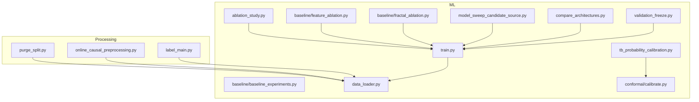
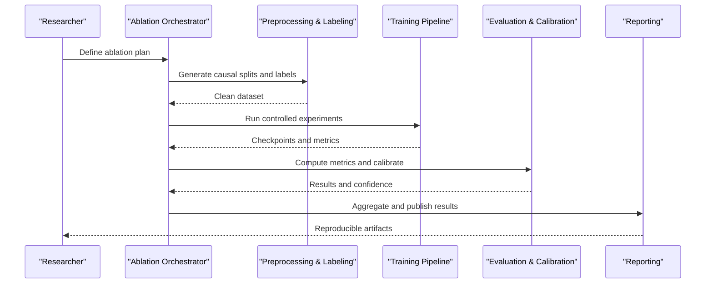
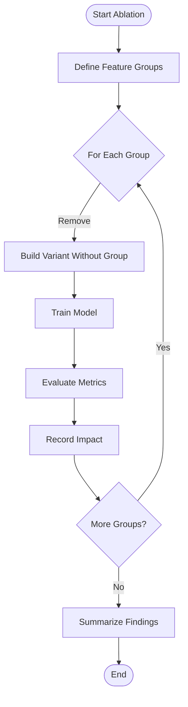
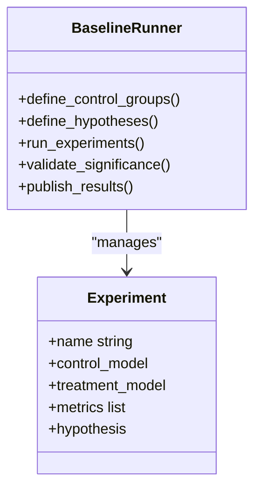
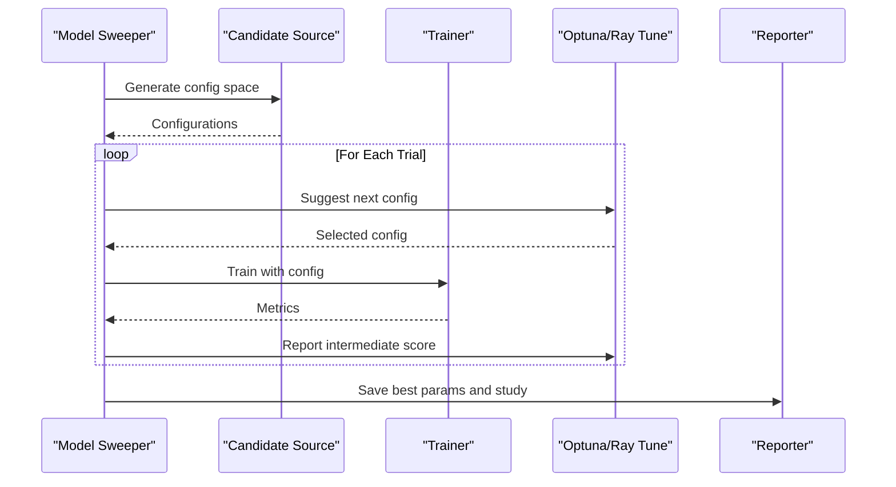
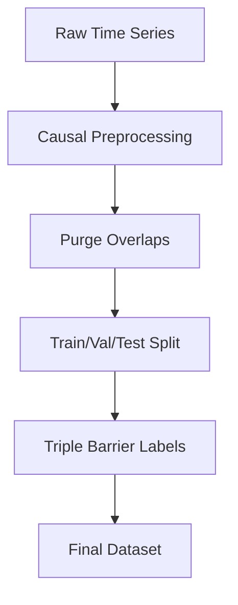
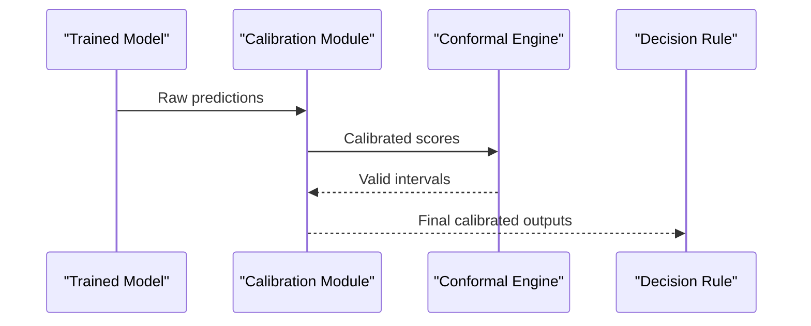
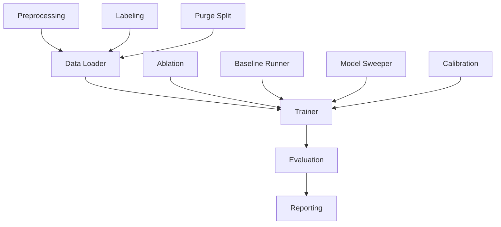

# Experimental Framework

<cite>
**Referenced Files in This Document**
- [ablation_study.py](file://ML/ablation_study.py)
- [baseline_experiments.py](file://ML/baseline/baseline_experiments.py)
- [feature_ablation.py](file://ML/baseline/feature_ablation.py)
- [fractal_ablation.py](file://ML/baseline/fractal_ablation.py)
- [model_sweep_candidate_source.py](file://ML/model_sweep_candidate_source.py)
- [compare_architectures.py](file://ML/compare_architectures.py)
- [train.py](file://ML/train.py)
- [data_loader.py](file://ML/data_loader.py)
- [validation_freeze.py](file://ML/validation_freeze.py)
- [tb_probability_calibration.py](file://ML/tb_probability_calibration.py)
- [conformal/calibrate.py](file://ML/conformal/calibrate.py)
- [purge_split.py](file://processing/purge_split.py)
- [online_causal_preprocessing.py](file://processing/online_causal_preprocessing.py)
- [label_main.py](file://processing/label_main.py)
- [benchmark_entry_path_signal_only_ablation.py](file://ML/benchmark_entry_path_signal_only_ablation.py)
- [benchmark_entry_based_updn_fractal_selection_ablation.py](file://ML/benchmark_entry_based_updn_fractal_selection_ablation.py)
- [rf_gridsearch.json](file://ML/reports/rf_gridsearch.json)
- [optuna_study_transformer_regression_updn_20260319_172657.json](file://ML/reports/optuna_study_transformer_regression_updn_20260319_172657.json)
- [architecture_comparison_classification.md](file://ML/reports/architecture_comparison_classification.md)
- [architecture_comparison_regression.md](file://ML/reports/architecture_comparison_regression.md)
- [reproducibility_report_12H.md](file://ML/reports/reproducibility_report_12H.md)
</cite>

## Table of Contents
1. [Introduction](#introduction)
2. [Project Structure](#project-structure)
3. [Core Components](#core-components)
4. [Architecture Overview](#architecture-overview)
5. [Detailed Component Analysis](#detailed-component-analysis)
6. [Dependency Analysis](#dependency-analysis)
7. [Performance Considerations](#performance-considerations)
8. [Troubleshooting Guide](#troubleshooting-guide)
9. [Conclusion](#conclusion)
10. [Appendices](#appendices)

## Introduction
This document describes the experimental framework used across SoSimple’s ML research and benchmarking workflows. It focuses on:
- Ablation study methodology: systematic feature removal, component isolation, and performance impact analysis
- Baseline experiment design: control groups, hypothesis testing, and statistical significance validation
- Model sweep procedures: hyperparameter optimization and architecture comparison
- Practical examples for designing controlled experiments, implementing ablations, and interpreting results
- Experimental tracking, result comparison tools, and reproducibility protocols
- Best practices for scientific rigor in quantitative finance research (data splitting, avoiding lookahead bias, maintaining integrity)

The goal is to provide a clear, actionable guide that enables reproducible, rigorous experimentation with minimal ambiguity.

## Project Structure
The experimental framework spans several directories:
- ML/: Core training, evaluation, ablation, sweeps, and reports
- processing/: Data preprocessing, labeling, causal splits, and online pipelines
- tests/: Automated tests validating benchmarks and components
- docs/methodology/: Methodological guidelines and checklists
- MT/: Execution environment parity checks and telemetry

Key entry points for experiments include:
- Ablation scripts under ML/ and ML/baseline/
- Baseline experiments under ML/baseline/
- Sweep and architecture comparison utilities under ML/
- Training and data loading under ML/
- Validation freeze and probability calibration under ML/ and ML/conformal/
- Causal preprocessing and purging under processing/

**Diagram sources**
- [ablation_study.py](file://ML/ablation_study.py)
- [baseline_experiments.py](file://ML/baseline/baseline_experiments.py)
- [feature_ablation.py](file://ML/baseline/feature_ablation.py)
- [fractal_ablation.py](file://ML/baseline/fractal_ablation.py)
- [model_sweep_candidate_source.py](file://ML/model_sweep_candidate_source.py)
- [compare_architectures.py](file://ML/compare_architectures.py)
- [train.py](file://ML/train.py)
- [data_loader.py](file://ML/data_loader.py)
- [validation_freeze.py](file://ML/validation_freeze.py)
- [tb_probability_calibration.py](file://ML/tb_probability_calibration.py)
- [conformal/calibrate.py](file://ML/conformal/calibrate.py)
- [purge_split.py](file://processing/purge_split.py)
- [online_causal_preprocessing.py](file://processing/online_causal_preprocessing.py)
- [label_main.py](file://processing/label_main.py)

**Section sources**
- [ablation_study.py](file://ML/ablation_study.py)
- [baseline_experiments.py](file://ML/baseline/baseline_experiments.py)
- [feature_ablation.py](file://ML/baseline/feature_ablation.py)
- [fractal_ablation.py](file://ML/baseline/fractal_ablation.py)
- [model_sweep_candidate_source.py](file://ML/model_sweep_candidate_source.py)
- [compare_architectures.py](file://ML/compare_architectures.py)
- [train.py](file://ML/train.py)
- [data_loader.py](file://ML/data_loader.py)
- [validation_freeze.py](file://ML/validation_freeze.py)
- [tb_probability_calibration.py](file://ML/tb_probability_calibration.py)
- [conformal/calibrate.py](file://ML/conformal/calibrate.py)
- [purge_split.py](file://processing/purge_split.py)
- [online_causal_preprocessing.py](file://processing/online_causal_preprocessing.py)
- [label_main.py](file://processing/label_main.py)

## Core Components
- Ablation Study Orchestrator: Coordinates systematic removal of features or components, runs controlled experiments, and aggregates metrics for impact analysis.
- Baseline Experiment Runner: Establishes control groups and baseline models, defines hypotheses, and validates statistical significance.
- Model Sweep Candidate Source: Generates candidate configurations for hyperparameter searches and architecture comparisons.
- Training Pipeline: Loads data, applies preprocessing, trains models, and produces checkpoints and metrics.
- Validation Freeze: Enforces strict temporal separation between development and test sets to prevent leakage.
- Probability Calibration: Calibrates model outputs using conformal methods and triple barrier labels.
- Data Preprocessing and Labeling: Implements causal preprocessing, purging, and label generation to ensure no lookahead bias.

These components work together to support rigorous, reproducible experiments across multiple tasks and datasets.

**Section sources**
- [ablation_study.py](file://ML/ablation_study.py)
- [baseline_experiments.py](file://ML/baseline/baseline_experiments.py)
- [model_sweep_candidate_source.py](file://ML/model_sweep_candidate_source.py)
- [train.py](file://ML/train.py)
- [data_loader.py](file://ML/data_loader.py)
- [validation_freeze.py](file://ML/validation_freeze.py)
- [tb_probability_calibration.py](file://ML/tb_probability_calibration.py)
- [conformal/calibrate.py](file://ML/conformal/calibrate.py)
- [purge_split.py](file://processing/purge_split.py)
- [online_causal_preprocessing.py](file://processing/online_causal_preprocessing.py)
- [label_main.py](file://processing/label_main.py)

## Architecture Overview
The experimental pipeline follows a modular flow:
- Data preparation: causal preprocessing, purging, labeling
- Feature engineering: optional ablation of feature subsets
- Model training: configurable architectures and hyperparameters
- Evaluation: metrics, calibration, and statistical tests
- Reporting: structured JSON artifacts and markdown summaries

**Diagram sources**
- [ablation_study.py](file://ML/ablation_study.py)
- [online_causal_preprocessing.py](file://processing/online_causal_preprocessing.py)
- [label_main.py](file://processing/label_main.py)
- [train.py](file://ML/train.py)
- [tb_probability_calibration.py](file://ML/tb_probability_calibration.py)
- [conformal/calibrate.py](file://ML/conformal/calibrate.py)

## Detailed Component Analysis

### Ablation Study Methodology
- Systematic feature removal: Iteratively disable feature groups to isolate contributions
- Component isolation: Remove entire modules (e.g., signal-only vs full feature set)
- Performance impact analysis: Compare metrics across ablated variants to quantify importance

Practical examples:
- Signal-only ablation: Benchmark against full-feature models to assess signal contribution
- Fractal selection ablation: Evaluate impact of fractal-based filters on performance

**Diagram sources**
- [ablation_study.py](file://ML/ablation_study.py)
- [benchmark_entry_path_signal_only_ablation.py](file://ML/benchmark_entry_path_signal_only_ablation.py)
- [benchmark_entry_based_updn_fractal_selection_ablation.py](file://ML/benchmark_entry_based_updn_fractal_selection_ablation.py)

**Section sources**
- [ablation_study.py](file://ML/ablation_study.py)
- [feature_ablation.py](file://ML/baseline/feature_ablation.py)
- [fractal_ablation.py](file://ML/baseline/fractal_ablation.py)
- [benchmark_entry_path_signal_only_ablation.py](file://ML/benchmark_entry_path_signal_only_ablation.py)
- [benchmark_entry_based_updn_fractal_selection_ablation.py](file://ML/benchmark_entry_based_updn_fractal_selection_ablation.py)

### Baseline Experiment Design
- Control groups: Establish baseline models (e.g., simple heuristics or prior versions)
- Hypothesis testing: Define null and alternative hypotheses for each experiment
- Statistical significance validation: Use appropriate tests to confirm improvements are not due to chance

Implementation highlights:
- Baseline runner orchestrates control and treatment groups
- Reports include p-values and effect sizes where applicable

**Diagram sources**
- [baseline_experiments.py](file://ML/baseline/baseline_experiments.py)

**Section sources**
- [baseline_experiments.py](file://ML/baseline/baseline_experiments.py)

### Model Sweep Procedures
- Hyperparameter optimization: Grid search and Bayesian optimization via Optuna
- Architecture comparison: Compare different model families (e.g., transformer vs CNN)
- Candidate source: Generates configuration space and tracks trials

Artifacts:
- JSON reports capturing best parameters and study progress
- Markdown summaries comparing architectures

**Diagram sources**
- [model_sweep_candidate_source.py](file://ML/model_sweep_candidate_source.py)
- [train.py](file://ML/train.py)
- [rf_gridsearch.json](file://ML/reports/rf_gridsearch.json)
- [optuna_study_transformer_regression_updn_20260319_172657.json](file://ML/reports/optuna_study_transformer_regression_updn_20260319_172657.json)

**Section sources**
- [model_sweep_candidate_source.py](file://ML/model_sweep_candidate_source.py)
- [compare_architectures.py](file://ML/compare_architectures.py)
- [rf_gridsearch.json](file://ML/reports/rf_gridsearch.json)
- [optuna_study_transformer_regression_updn_20260319_172657.json](file://ML/reports/optuna_study_transformer_regression_updn_20260319_172657.json)
- [architecture_comparison_classification.md](file://ML/reports/architecture_comparison_classification.md)
- [architecture_comparison_regression.md](file://ML/reports/architecture_comparison_regression.md)

### Experimental Tracking and Result Comparison
- Centralized reporting: JSON artifacts store metrics, parameters, and metadata
- Comparison tools: Scripts aggregate and compare results across runs
- Reproducibility: Versioned configs and seeds ensure replicability

Key artifacts:
- Optuna study JSON files
- RF grid search results
- Architecture comparison markdowns
- Reproducibility reports

**Section sources**
- [rf_gridsearch.json](file://ML/reports/rf_gridsearch.json)
- [optuna_study_transformer_regression_updn_20260319_172657.json](file://ML/reports/optuna_study_transformer_regression_updn_20260319_172657.json)
- [architecture_comparison_classification.md](file://ML/reports/architecture_comparison_classification.md)
- [architecture_comparison_regression.md](file://ML/reports/architecture_comparison_regression.md)
- [reproducibility_report_12H.md](file://ML/reports/reproducibility_report_12H.md)

### Data Splitting and Integrity
- Purged cross-validation: Ensures no leakage by removing overlapping periods
- Online causal preprocessing: Prevents lookahead bias by respecting temporal order
- Labeling: Triple barrier labels define outcomes consistently

Best practices:
- Strict time-based splits
- Purge windows around barriers
- Consistent labeling conventions

**Diagram sources**
- [purge_split.py](file://processing/purge_split.py)
- [online_causal_preprocessing.py](file://processing/online_causal_preprocessing.py)
- [label_main.py](file://processing/label_main.py)

**Section sources**
- [purge_split.py](file://processing/purge_split.py)
- [online_causal_preprocessing.py](file://processing/online_causal_preprocessing.py)
- [label_main.py](file://processing/label_main.py)

### Probability Calibration and Conformal Methods
- Calibration: Adjust predicted probabilities to match observed frequencies
- Conformal prediction: Provide valid uncertainty bounds
- Integration: Calibrated outputs feed into decision rules and risk management

**Diagram sources**
- [tb_probability_calibration.py](file://ML/tb_probability_calibration.py)
- [conformal/calibrate.py](file://ML/conformal/calibrate.py)

**Section sources**
- [tb_probability_calibration.py](file://ML/tb_probability_calibration.py)
- [conformal/calibrate.py](file://ML/conformal/calibrate.py)

## Dependency Analysis
The experimental framework exhibits clear modularity:
- Ablation depends on training and data loaders
- Baselines depend on training and evaluation
- Sweeps depend on candidate sources and trainers
- Calibration depends on trained models and conformal engines
- Data preprocessing feeds all downstream components

**Diagram sources**
- [data_loader.py](file://ML/data_loader.py)
- [train.py](file://ML/train.py)
- [ablation_study.py](file://ML/ablation_study.py)
- [baseline_experiments.py](file://ML/baseline/baseline_experiments.py)
- [model_sweep_candidate_source.py](file://ML/model_sweep_candidate_source.py)
- [tb_probability_calibration.py](file://ML/tb_probability_calibration.py)
- [online_causal_preprocessing.py](file://processing/online_causal_preprocessing.py)
- [label_main.py](file://processing/label_main.py)
- [purge_split.py](file://processing/purge_split.py)

**Section sources**
- [data_loader.py](file://ML/data_loader.py)
- [train.py](file://ML/train.py)
- [ablation_study.py](file://ML/ablation_study.py)
- [baseline_experiments.py](file://ML/baseline/baseline_experiments.py)
- [model_sweep_candidate_source.py](file://ML/model_sweep_candidate_source.py)
- [tb_probability_calibration.py](file://ML/tb_probability_calibration.py)
- [online_causal_preprocessing.py](file://processing/online_causal_preprocessing.py)
- [label_main.py](file://processing/label_main.py)
- [purge_split.py](file://processing/purge_split.py)

## Performance Considerations
- Efficient data loading: Use streaming and caching to reduce memory pressure
- Batch sizing: Balance throughput and GPU utilization
- Early stopping: Prevent overfitting and save compute
- Parallelization: Distribute sweeps and ablations across workers
- Calibration cost: Minimize overhead by batching calibration steps

[No sources needed since this section provides general guidance]

## Troubleshooting Guide
Common issues and resolutions:
- Data leakage: Verify purge windows and causal preprocessing
- Non-reproducible results: Lock seeds and version dependencies
- Calibration drift: Re-calibrate on recent data and monitor coverage
- Sweep failures: Validate config space and resource limits

Diagnostic tools:
- Validation freeze checks
- Probability calibration diagnostics
- Reproducibility reports

**Section sources**
- [validation_freeze.py](file://ML/validation_freeze.py)
- [tb_probability_calibration.py](file://ML/tb_probability_calibration.py)
- [reproducibility_report_12H.md](file://ML/reports/reproducibility_report_12H.md)

## Conclusion
The SoSimple experimental framework provides a robust foundation for rigorous quantitative finance research. By combining systematic ablations, well-designed baselines, comprehensive sweeps, and strong data integrity measures, it enables reliable discovery and validation of trading signals. Adhering to the documented best practices ensures scientific rigor, reproducibility, and actionable insights.

[No sources needed since this section summarizes without analyzing specific files]

## Appendices
- Methodology guides and checklists for experimental design
- Templates for ablation plans and sweep configurations
- Examples of result interpretation and reporting

[No sources needed since this section provides general guidance]