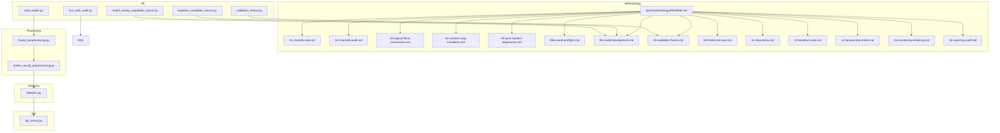
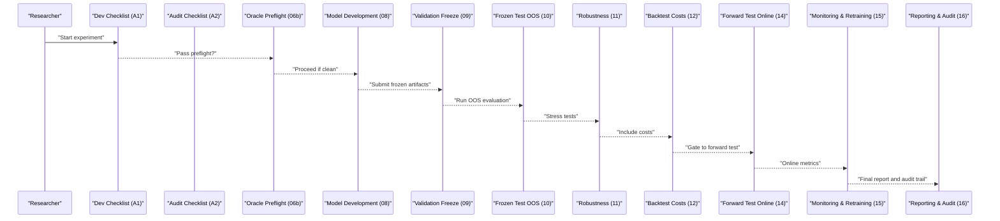
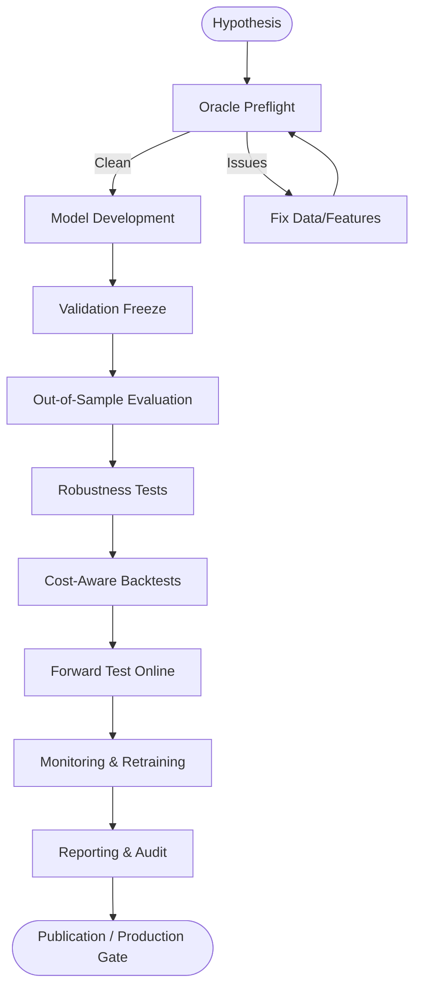
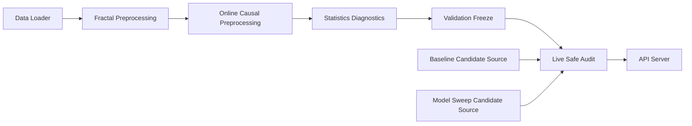

# Methodology Guidelines

<cite>
**Referenced Files in This Document**
- [README.md](file://README.md)
- [CONTEXT_HANDOFF.md](file://CONTEXT_HANDOFF.md)
- [MODULE_INDEX.md](file://MODULE_INDEX.md)
- [docs/methodology/README.md](file://docs/methodology/README.md)
- [docs/methodology/A1-checklist-dev.md](file://docs/methodology/A1-checklist-dev.md)
- [docs/methodology/A2-checklist-audit.md](file://docs/methodology/A2-checklist-audit.md)
- [docs/methodology/A3-typical-false-conclusions.md](file://docs/methodology/A3-typical-false-conclusions.md)
- [docs/methodology/A4-verdicts-stop-conditions.md](file://docs/methodology/A4-verdicts-stop-conditions.md)
- [docs/methodology/A5-post-mortem-diagnostics.md](file://docs/methodology/A5-post-mortem-diagnostics.md)
- [docs/methodology/06b-oracle-preflight.md](file://docs/methodology/06b-oracle-preflight.md)
- [docs/methodology/08-model-development.md](file://docs/methodology/08-model-development.md)
- [docs/methodology/09-validation-freeze.md](file://docs/methodology/09-validation-freeze.md)
- [docs/methodology/10-frozen-test-oos.md](file://docs/methodology/10-frozen-test-oos.md)
- [docs/methodology/11-robustness.md](file://docs/methodology/11-robustness.md)
- [docs/methodology/12-backtest-costs.md](file://docs/methodology/12-backtest-costs.md)
- [docs/methodology/14-forward-test-online.md](file://docs/methodology/14-forward-test-online.md)
- [docs/methodology/15-monitoring-retraining.md](file://docs/methodology/15-monitoring-retraining.md)
- [docs/methodology/16-reporting-audit.md](file://docs/methodology/16-reporting-audit.md)
- [ML/validation_freeze.py](file://ML/validation_freeze.py)
- [ML/live_safe_audit.py](file://ML/live_safe_audit.py)
- [ML/live_safe_audit_registry.py](file://ML/live_safe_audit_registry.py)
- [ML/baseline_candidate_source.py](file://ML/baseline_candidate_source.py)
- [ML/model_sweep_candidate_source.py](file://ML/model_sweep_candidate_source.py)
- [ML/data_loader.py](file://ML/data_loader.py)
- [processing/fractal_preprocessing.py](file://processing/fractal_preprocessing.py)
- [processing/online_causal_preprocessing.py](file://processing/online_causal_preprocessing.py)
- [statistics/statistics.py](file://statistics/statistics.py)
- [API/api_server.py](file://API/api_server.py)
</cite>

## Table of Contents
1. Introduction
2. Project Structure
3. Core Components
4. Architecture Overview
5. Detailed Component Analysis
6. Dependency Analysis
7. Performance Considerations
8. Troubleshooting Guide
9. Conclusion
10. Appendices

## Introduction
This document provides comprehensive methodology guidelines for research and development in SoSimple, covering the full research cycle from hypothesis generation through validation and publication. It codifies a checklist-driven approach for development and audit processes, including pre-flight checks, validation gates, and post-mortem analysis. It also documents common pitfalls and false conclusions in quantitative finance research with prevention strategies, data integrity requirements, time-series validation techniques, robustness testing procedures, reproducibility standards, interpretation criteria, and review processes for moving candidates to production.

The guidelines are grounded in the repository’s methodology documentation and supporting scripts that implement validation freezes, live-safe audits, candidate sourcing, preprocessing, and statistical diagnostics.

## Project Structure
SoSimple organizes research artifacts, experiments, and production-facing components across clearly separated directories:
- docs/methodology: The canonical methodology guides, checklists, and stage-specific protocols.
- ML: Experiment runners, model definitions, training utilities, and audit/regression tools.
- processing: Data preprocessing pipelines ensuring causal integrity and label construction.
- statistics: EDA, diagnostics, and statistical summaries used throughout the research lifecycle.
- API: Server-side services for signal generation and telemetry.
- tests: Automated tests validating behavior across modules.

**Diagram sources**
- [docs/methodology/README.md](file://docs/methodology/README.md)
- [docs/methodology/A1-checklist-dev.md](file://docs/methodology/A1-checklist-dev.md)
- [docs/methodology/A2-checklist-audit.md](file://docs/methodology/A2-checklist-audit.md)
- [docs/methodology/A3-typical-false-conclusions.md](file://docs/methodology/A3-typical-false-conclusions.md)
- [docs/methodology/A4-verdicts-stop-conditions.md](file://docs/methodology/A4-verdicts-stop-conditions.md)
- [docs/methodology/A5-post-mortem-diagnostics.md](file://docs/methodology/A5-post-mortem-diagnostics.md)
- [docs/methodology/06b-oracle-preflight.md](file://docs/methodology/06b-oracle-preflight.md)
- [docs/methodology/08-model-development.md](file://docs/methodology/08-model-development.md)
- [docs/methodology/09-validation-freeze.md](file://docs/methodology/09-validation-freeze.md)
- [docs/methodology/10-frozen-test-oos.md](file://docs/methodology/10-frozen-test-oos.md)
- [docs/methodology/11-robustness.md](file://docs/methodology/11-robustness.md)
- [docs/methodology/12-backtest-costs.md](file://docs/methodology/12-backtest-costs.md)
- [docs/methodology/14-forward-test-online.md](file://docs/methodology/14-forward-test-online.md)
- [docs/methodology/15-monitoring-retraining.md](file://docs/methodology/15-monitoring-retraining.md)
- [docs/methodology/16-reporting-audit.md](file://docs/methodology/16-reporting-audit.md)
- [ML/validation_freeze.py](file://ML/validation_freeze.py)
- [ML/live_safe_audit.py](file://ML/live_safe_audit.py)
- [ML/baseline_candidate_source.py](file://ML/baseline_candidate_source.py)
- [ML/model_sweep_candidate_source.py](file://ML/model_sweep_candidate_source.py)
- [ML/data_loader.py](file://ML/data_loader.py)
- [processing/fractal_preprocessing.py](file://processing/fractal_preprocessing.py)
- [processing/online_causal_preprocessing.py](file://processing/online_causal_preprocessing.py)
- [statistics/statistics.py](file://statistics/statistics.py)
- [API/api_server.py](file://API/api_server.py)

**Section sources**
- [README.md](file://README.md)
- [CONTEXT_HANDOFF.md](file://CONTEXT_HANDOFF.md)
- [MODULE_INDEX.md](file://MODULE_INDEX.md)
- [docs/methodology/README.md](file://docs/methodology/README.md)

## Core Components
The methodology is implemented through a combination of documented protocols and executable scripts:
- Checklists and verdicts: Development and audit checklists define mandatory steps and stop conditions.
- Pre-flight and oracle checks: Ensure data integrity and feature-target causality before modeling.
- Validation freeze and OOS: Freeze features and labels at a point in time; evaluate on out-of-sample windows.
- Robustness and costs: Stress test across perturbations and incorporate realistic trading costs.
- Forward testing and monitoring: Online evaluation and retraining policies under live constraints.
- Reporting and audit: Standardized reporting templates and audit trails for reproducibility.

Key implementation anchors:
- Validation freeze logic and gating.
- Live-safe audit registry and execution.
- Candidate source generators for baselines and sweeps.
- Causal preprocessing and online data handling.
- Statistical diagnostics and summaries.

**Section sources**
- [docs/methodology/A1-checklist-dev.md](file://docs/methodology/A1-checklist-dev.md)
- [docs/methodology/A2-checklist-audit.md](file://docs/methodology/A2-checklist-audit.md)
- [docs/methodology/06b-oracle-preflight.md](file://docs/methodology/06b-oracle-preflight.md)
- [docs/methodology/09-validation-freeze.md](file://docs/methodology/09-validation-freeze.md)
- [docs/methodology/10-frozen-test-oos.md](file://docs/methodology/10-frozen-test-oos.md)
- [docs/methodology/11-robustness.md](file://docs/methodology/11-robustness.md)
- [docs/methodology/12-backtest-costs.md](file://docs/methodology/12-backtest-costs.md)
- [docs/methodology/14-forward-test-online.md](file://docs/methodology/14-forward-test-online.md)
- [docs/methodology/15-monitoring-retraining.md](file://docs/methodology/15-monitoring-retraining.md)
- [docs/methodology/16-reporting-audit.md](file://docs/methodology/16-reporting-audit.md)
- [ML/validation_freeze.py](file://ML/validation_freeze.py)
- [ML/live_safe_audit.py](file://ML/live_safe_audit.py)
- [ML/live_safe_audit_registry.py](file://ML/live_safe_audit_registry.py)
- [ML/baseline_candidate_source.py](file://ML/baseline_candidate_source.py)
- [ML/model_sweep_candidate_source.py](file://ML/model_sweep_candidate_source.py)
- [processing/online_causal_preprocessing.py](file://processing/online_causal_preprocessing.py)
- [statistics/statistics.py](file://statistics/statistics.py)

## Architecture Overview
The research-to-production pipeline enforces strict temporal separation between information available at decision time and future leakage. It integrates preprocessing, modeling, validation, auditing, and deployment via standardized interfaces.

**Diagram sources**
- [docs/methodology/A1-checklist-dev.md](file://docs/methodology/A1-checklist-dev.md)
- [docs/methodology/A2-checklist-audit.md](file://docs/methodology/A2-checklist-audit.md)
- [docs/methodology/06b-oracle-preflight.md](file://docs/methodology/06b-oracle-preflight.md)
- [docs/methodology/08-model-development.md](file://docs/methodology/08-model-development.md)
- [docs/methodology/09-validation-freeze.md](file://docs/methodology/09-validation-freeze.md)
- [docs/methodology/10-frozen-test-oos.md](file://docs/methodology/10-frozen-test-oos.md)
- [docs/methodology/11-robustness.md](file://docs/methodology/11-robustness.md)
- [docs/methodology/12-backtest-costs.md](file://docs/methodology/12-backtest-costs.md)
- [docs/methodology/14-forward-test-online.md](file://docs/methodology/14-forward-test-online.md)
- [docs/methodology/15-monitoring-retraining.md](file://docs/methodology/15-monitoring-retraining.md)
- [docs/methodology/16-reporting-audit.md](file://docs/methodology/16-reporting-audit.md)

## Detailed Component Analysis

### Research Cycle: Hypothesis to Publication
- Hypothesis generation: Define clear, falsifiable hypotheses grounded in market mechanics or prior evidence.
- Pre-flight checks: Validate data contracts, timestamps, and absence of look-ahead bias using oracle preflight.
- Modeling: Develop models with explicit assumptions, feature selection rationale, and loss functions aligned with objectives.
- Validation freeze: Lock features and labels at a fixed timestamp; prevent any future information leakage.
- OOS evaluation: Evaluate on strictly out-of-sample periods; ensure no parameter tuning on OOS.
- Robustness: Perturb inputs, regimes, and parameters; assess stability across instruments and time windows.
- Cost-aware backtesting: Incorporate spreads, slippage, commissions, and liquidity constraints.
- Forward testing: Run online simulations with realistic latency and partial fills.
- Monitoring and retraining: Track drift, performance decay, and trigger retraining under governance rules.
- Reporting and audit: Produce standardized reports with full artifact lineage and audit trails.

**Diagram sources**
- [docs/methodology/06b-oracle-preflight.md](file://docs/methodology/06b-oracle-preflight.md)
- [docs/methodology/08-model-development.md](file://docs/methodology/08-model-development.md)
- [docs/methodology/09-validation-freeze.md](file://docs/methodology/09-validation-freeze.md)
- [docs/methodology/10-frozen-test-oos.md](file://docs/methodology/10-frozen-test-oos.md)
- [docs/methodology/11-robustness.md](file://docs/methodology/11-robustness.md)
- [docs/methodology/12-backtest-costs.md](file://docs/methodology/12-backtest-costs.md)
- [docs/methodology/14-forward-test-online.md](file://docs/methodology/14-forward-test-online.md)
- [docs/methodology/15-monitoring-retraining.md](file://docs/methodology/15-monitoring-retraining.md)
- [docs/methodology/16-reporting-audit.md](file://docs/methodology/16-reporting-audit.md)

**Section sources**
- [docs/methodology/06b-oracle-preflight.md](file://docs/methodology/06b-oracle-preflight.md)
- [docs/methodology/08-model-development.md](file://docs/methodology/08-model-development.md)
- [docs/methodology/09-validation-freeze.md](file://docs/methodology/09-validation-freeze.md)
- [docs/methodology/10-frozen-test-oos.md](file://docs/methodology/10-frozen-test-oos.md)
- [docs/methodology/11-robustness.md](file://docs/methodology/11-robustness.md)
- [docs/methodology/12-backtest-costs.md](file://docs/methodology/12-backtest-costs.md)
- [docs/methodology/14-forward-test-online.md](file://docs/methodology/14-forward-test-online.md)
- [docs/methodology/15-monitoring-retraining.md](file://docs/methodology/15-monitoring-retraining.md)
- [docs/methodology/16-reporting-audit.md](file://docs/methodology/16-reporting-audit.md)

### Checklist-Based Development and Audit Processes
- Development checklist (A1): Mandatory steps for experiment setup, data hygiene, labeling conventions, and initial sanity checks.
- Audit checklist (A2): Independent verification of code, data, and results; ensures reproducibility and compliance with methodology.
- Verdicts and stop conditions (A4): Clear go/no-go criteria at each gate; prevents progression when prerequisites fail.
- Post-mortem diagnostics (A5): Structured analysis after failures or unexpected outcomes to capture lessons learned.

Implementation anchors:
- Use A1 and A2 as entry/exit gates for all experiments.
- Enforce A4 verdicts at validation freeze and OOS stages.
- Conduct A5 post-mortems for any failed gates or significant deviations.

**Section sources**
- [docs/methodology/A1-checklist-dev.md](file://docs/methodology/A1-checklist-dev.md)
- [docs/methodology/A2-checklist-audit.md](file://docs/methodology/A2-checklist-audit.md)
- [docs/methodology/A4-verdicts-stop-conditions.md](file://docs/methodology/A4-verdicts-stop-conditions.md)
- [docs/methodology/A5-post-mortem-diagnostics.md](file://docs/methodology/A5-post-mortem-diagnostics.md)

### Common Pitfalls and False Conclusions in Quantitative Finance
- Look-ahead bias: Using future information in features or labels.
- Overfitting: Excessive complexity relative to sample size; unstable parameters.
- Data snooping: Repeatedly tuning on the same dataset without proper holdouts.
- Survivorship bias: Training only on currently surviving assets.
- Non-stationarity: Ignoring regime shifts and structural breaks.
- Misleading significance: Relying solely on p-values without practical significance.
- Transaction cost neglect: Underestimating costs leading to unrealistic profitability.

Prevention strategies:
- Enforce oracle preflight and causal preprocessing.
- Apply validation freeze and strict OOS evaluation.
- Use robustness tests across instruments, time windows, and perturbations.
- Include realistic costs and slippage in backtests.
- Combine statistical significance with economic/practical significance thresholds.

**Section sources**
- [docs/methodology/A3-typical-false-conclusions.md](file://docs/methodology/A3-typical-false-conclusions.md)
- [docs/methodology/06b-oracle-preflight.md](file://docs/methodology/06b-oracle-preflight.md)
- [docs/methodology/09-validation-freeze.md](file://docs/methodology/09-validation-freeze.md)
- [docs/methodology/10-frozen-test-oos.md](file://docs/methodology/10-frozen-test-oos.md)
- [docs/methodology/11-robustness.md](file://docs/methodology/11-robustness.md)
- [docs/methodology/12-backtest-costs.md](file://docs/methodology/12-backtest-costs.md)

### Data Integrity Requirements and Time-Series Validation
- Data contracts: Validate schemas, ranges, and completeness; enforce consistent timestamps and alignment.
- Causal preprocessing: Ensure features are computed strictly from past information; avoid leakage.
- Labeling conventions: Consistent, unambiguous labels reflecting actual trade outcomes.
- Time-series validation: Walk-forward or expanding window schemes; separate train/validation/test by time.
- Online causal preprocessing: Maintain real-time consistency and latency constraints.

Implementation anchors:
- Fractal preprocessing ensures consistent feature construction.
- Online causal preprocessing maintains strict temporal ordering.
- Statistics module provides diagnostic summaries and anomaly detection.

**Section sources**
- [processing/fractal_preprocessing.py](file://processing/fractal_preprocessing.py)
- [processing/online_causal_preprocessing.py](file://processing/online_causal_preprocessing.py)
- [statistics/statistics.py](file://statistics/statistics.py)
- [docs/methodology/06b-oracle-preflight.md](file://docs/methodology/06b-oracle-preflight.md)
- [docs/methodology/08-model-development.md](file://docs/methodology/08-model-development.md)

### Robustness Testing Procedures
- Cross-instrument robustness: Evaluate across diverse assets and market conditions.
- Regime stress tests: Perturb volatility, liquidity, and macro regimes.
- Parameter sensitivity: Sweep hyperparameters and assess stability.
- Feature ablation: Remove subsets of features to identify dependencies.
- Monte Carlo and bootstrapping: Assess confidence intervals and variance.

Implementation anchors:
- Baseline and sweep candidate sources enable systematic comparisons.
- Live-safe audit registry coordinates multi-scenario evaluations.

**Section sources**
- [ML/baseline_candidate_source.py](file://ML/baseline_candidate_source.py)
- [ML/model_sweep_candidate_source.py](file://ML/model_sweep_candidate_source.py)
- [ML/live_safe_audit_registry.py](file://ML/live_safe_audit_registry.py)
- [docs/methodology/11-robustness.md](file://docs/methodology/11-robustness.md)

### Reproducible Experiments and Documentation Standards
- Version control: Pin data versions, code commits, and environment specifications.
- Artifact lineage: Record feature sets, labels, model weights, and configurations.
- Assumption documentation: Explicitly state modeling assumptions and limitations.
- Reproducibility reports: Provide step-by-step instructions to replicate results.
- Audit trails: Maintain logs of all runs, decisions, and approvals.

Implementation anchors:
- Reporting and audit guidelines standardize outputs and traceability.
- Live-safe audits ensure consistent execution across environments.

**Section sources**
- [docs/methodology/16-reporting-audit.md](file://docs/methodology/16-reporting-audit.md)
- [ML/live_safe_audit.py](file://ML/live_safe_audit.py)

### Result Interpretation, Statistical Significance, and Practical Significance
- Statistical significance: Use appropriate tests considering autocorrelation and multiple comparisons.
- Practical significance: Evaluate economic impact, transaction costs, and risk-adjusted returns.
- Confidence intervals: Report uncertainty around estimates and forecasts.
- Decision thresholds: Set minimum performance bars for production readiness.

**Section sources**
- [statistics/statistics.py](file://statistics/statistics.py)
- [docs/methodology/12-backtest-costs.md](file://docs/methodology/12-backtest-costs.md)

### Review Process and Criteria for Moving to Production
- Independent audit: External verification of methodology, code, and results.
- Gate criteria: Pass all checklists, verdicts, and robustness tests.
- Forward test success: Stable online performance under realistic conditions.
- Governance approval: Formal sign-off based on documented evidence.

Implementation anchors:
- Validation freeze and OOS provide hard gates.
- Live-safe audit registry orchestrates final reviews.

**Section sources**
- [docs/methodology/A4-verdicts-stop-conditions.md](file://docs/methodology/A4-verdicts-stop-conditions.md)
- [ML/validation_freeze.py](file://ML/validation_freeze.py)
- [ML/live_safe_audit_registry.py](file://ML/live_safe_audit_registry.py)

## Dependency Analysis
The methodology relies on tightly coupled components that enforce temporal integrity and reproducibility:

**Diagram sources**
- [ML/data_loader.py](file://ML/data_loader.py)
- [processing/fractal_preprocessing.py](file://processing/fractal_preprocessing.py)
- [processing/online_causal_preprocessing.py](file://processing/online_causal_preprocessing.py)
- [statistics/statistics.py](file://statistics/statistics.py)
- [ML/validation_freeze.py](file://ML/validation_freeze.py)
- [ML/live_safe_audit.py](file://ML/live_safe_audit.py)
- [API/api_server.py](file://API/api_server.py)
- [ML/baseline_candidate_source.py](file://ML/baseline_candidate_source.py)
- [ML/model_sweep_candidate_source.py](file://ML/model_sweep_candidate_source.py)

**Section sources**
- [ML/data_loader.py](file://ML/data_loader.py)
- [processing/fractal_preprocessing.py](file://processing/fractal_preprocessing.py)
- [processing/online_causal_preprocessing.py](file://processing/online_causal_preprocessing.py)
- [statistics/statistics.py](file://statistics/statistics.py)
- [ML/validation_freeze.py](file://ML/validation_freeze.py)
- [ML/live_safe_audit.py](file://ML/live_safe_audit.py)
- [API/api_server.py](file://API/api_server.py)
- [ML/baseline_candidate_source.py](file://ML/baseline_candidate_source.py)
- [ML/model_sweep_candidate_source.py](file://ML/model_sweep_candidate_source.py)

## Performance Considerations
- Computational efficiency: Optimize data loading and preprocessing pipelines to reduce bottlenecks.
- Memory management: Stream large datasets and avoid unnecessary copies.
- Parallelization: Leverage multi-core and GPU resources where applicable.
- Latency constraints: Ensure online preprocessing meets real-time requirements.
- Scalability: Design pipelines to handle growing data volumes and additional instruments.

[No sources needed since this section provides general guidance]

## Troubleshooting Guide
Common issues and resolutions:
- Data contract violations: Validate schemas and fix missing or malformed fields.
- Leakage detected: Revisit feature computation and ensure strict past-only usage.
- OOS failure: Investigate overfitting and adjust regularization or simplify models.
- Robustness instability: Identify sensitive features or parameters; perform ablation studies.
- Online drift: Monitor feature distributions and trigger retraining per policy.

Diagnostic tools:
- Oracle preflight checks to catch early issues.
- Statistics diagnostics for anomalies and distribution shifts.
- Live-safe audit logs for end-to-end tracing.

**Section sources**
- [docs/methodology/06b-oracle-preflight.md](file://docs/methodology/06b-oracle-preflight.md)
- [statistics/statistics.py](file://statistics/statistics.py)
- [ML/live_safe_audit.py](file://ML/live_safe_audit.py)

## Conclusion
SoSimple’s methodology establishes a rigorous, checklist-driven research cycle that safeguards against common pitfalls in quantitative finance. By enforcing data integrity, causal preprocessing, validation freezes, robust testing, and cost-aware evaluation, it ensures that findings are statistically sound, economically meaningful, and production-ready. The integration of automated audits, standardized reporting, and continuous monitoring creates a reliable path from hypothesis to publication and deployment.

[No sources needed since this section summarizes without analyzing specific files]

## Appendices
- Appendix A: Checklist Templates (A1, A2)
- Appendix B: Verdicts and Stop Conditions (A4)
- Appendix C: Post-Mortem Template (A5)
- Appendix D: Reporting Standards (16)

[No sources needed since this section lists references without analyzing specific files]