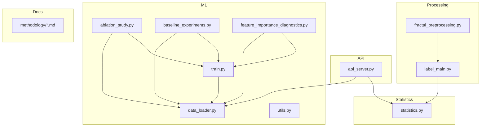
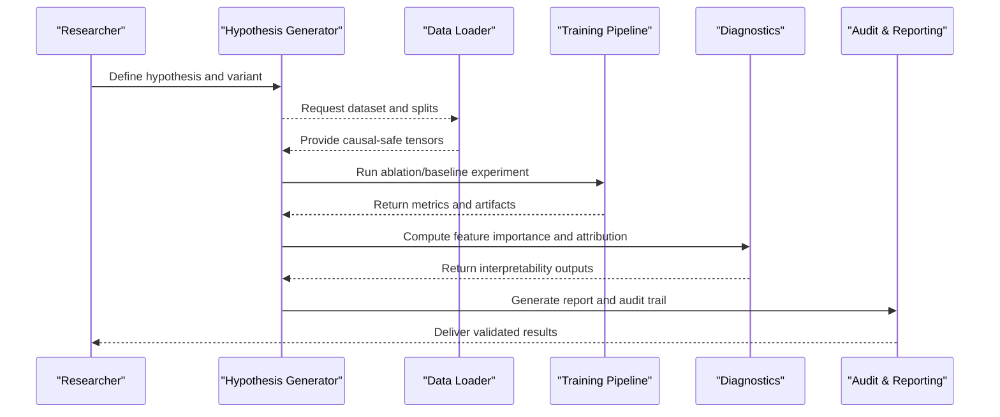
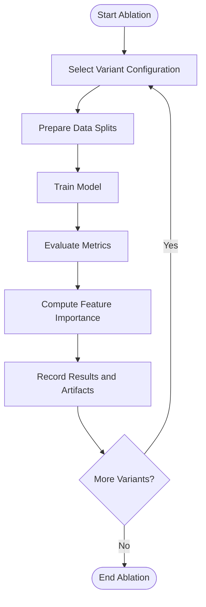
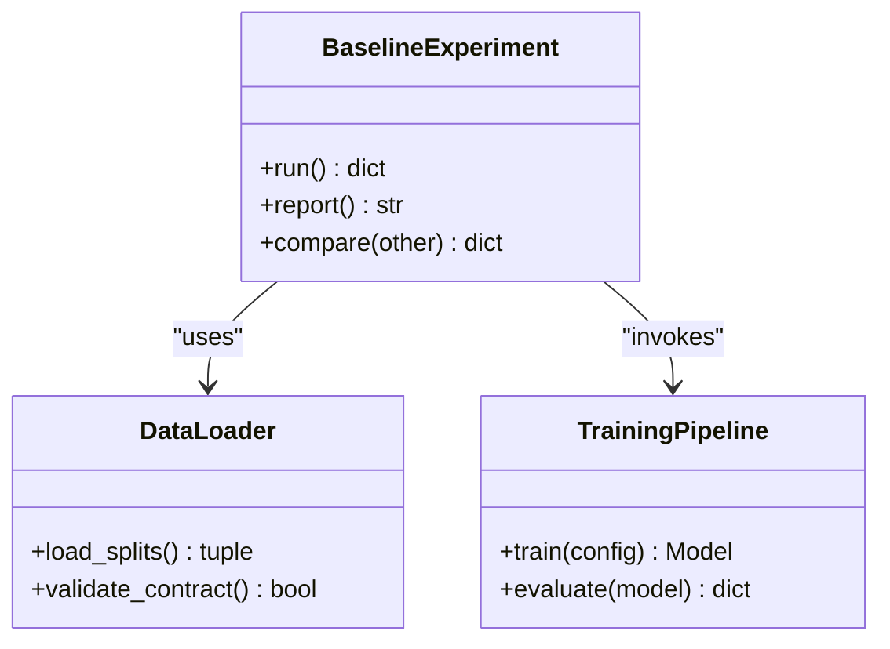
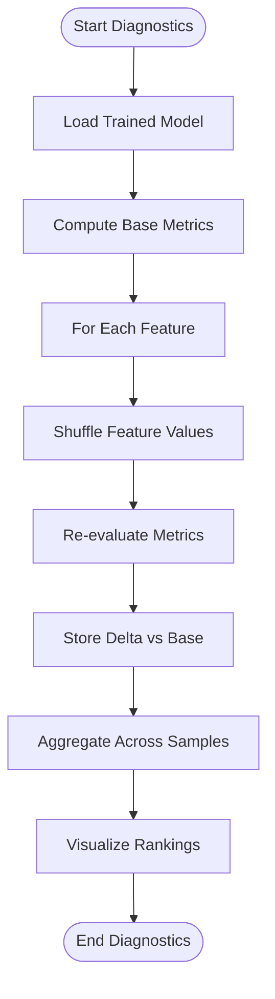
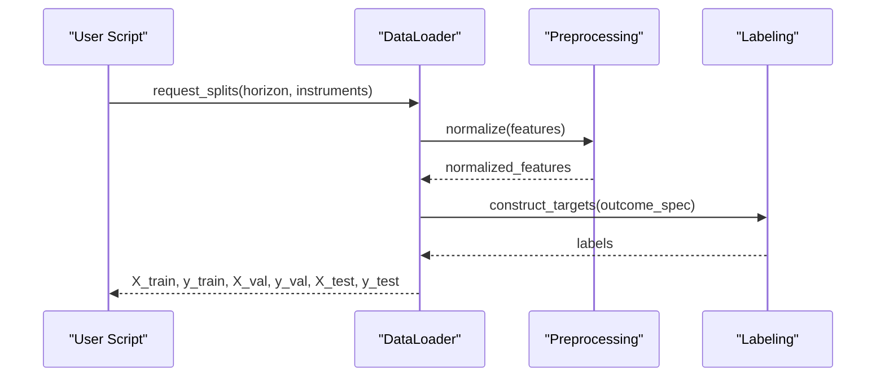
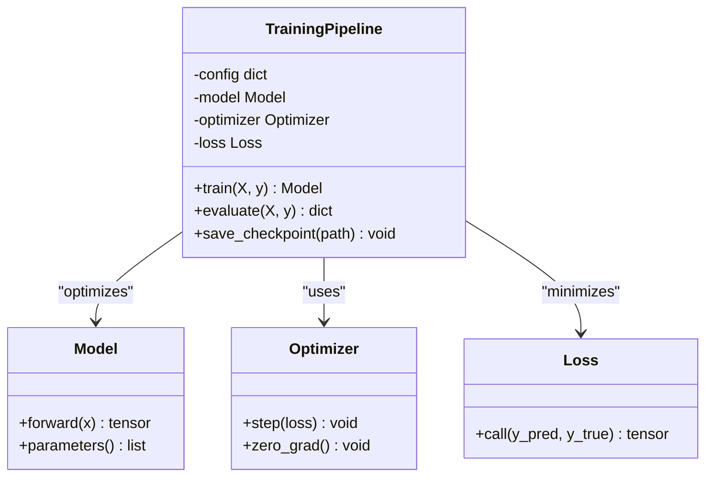
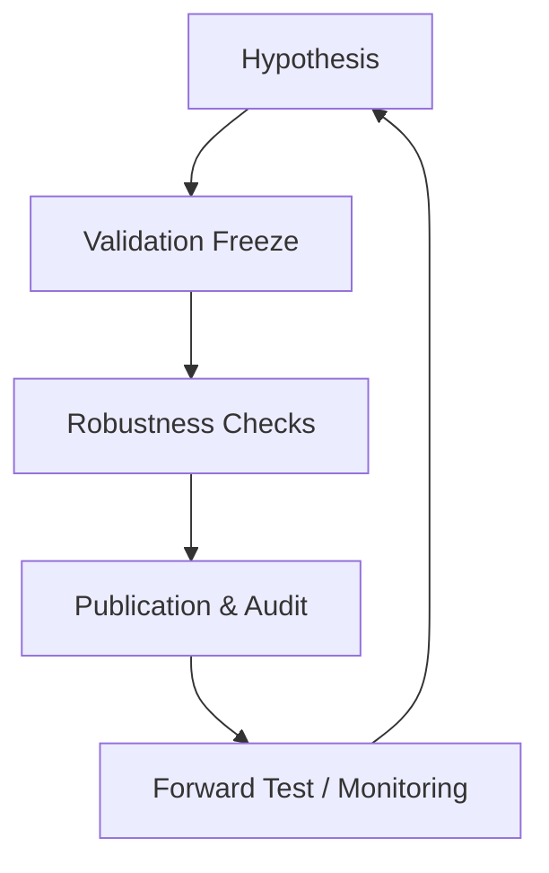
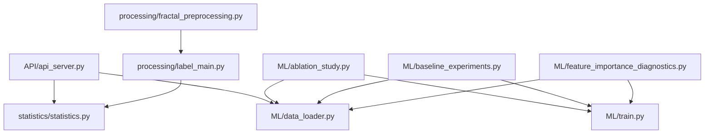

# Research & Development

<cite>
**Referenced Files in This Document**
- [README.md](file://README.md)
- [MODULE_INDEX.md](file://MODULE_INDEX.md)
- [CONTEXT_HANDOFF.md](file://CONTEXT_HANDOFF.md)
- [requirements.txt](file://requirements.txt)
- [ML/ablation_study.py](file://ML/ablation_study.py)
- [ML/baseline_experiments.py](file://ML/baseline_experiments.py)
- [ML/feature_importance_diagnostics.py](file://ML/feature_importance_diagnostics.py)
- [ML/data_loader.py](file://ML/data_loader.py)
- [ML/train.py](file://ML/train.py)
- [ML/utils.py](file://ML/utils.py)
- [processing/fractal_preprocessing.py](file://processing/fractal_preprocessing.py)
- [processing/label_main.py](file://processing/label_main.py)
- [statistics/statistics.py](file://statistics/statistics.py)
- [API/api_server.py](file://API/api_server.py)
- [docs/methodology/08-model-development.md](file://docs/methodology/08-model-development.md)
- [docs/methodology/09-validation-freeze.md](file://docs/methodology/09-validation-freeze.md)
- [docs/methodology/10-frozen-test-oos.md](file://docs/methodology/10-frozen-test-oos.md)
- [docs/methodology/11-robustness.md](file://docs/methodology/11-robustness.md)
- [docs/methodology/12-backtest-costs.md](file://docs/methodology/12-backtest-costs.md)
- [docs/methodology/14-forward-test-online.md](file://docs/methodology/14-forward-test-online.md)
- [docs/methodology/15-monitoring-retraining.md](file://docs/methodology/15-monitoring-retraining.md)
- [docs/methodology/16-reporting-audit.md](file://docs/methodology/16-reporting-audit.md)
- [docs/methodology/A1-checklist-dev.md](file://docs/methodology/A1-checklist-dev.md)
- [docs/methodology/A2-checklist-audit.md](file://docs/methodology/A2-checklist-audit.md)
- [docs/methodology/A3-typical-false-conclusions.md](file://docs/methodology/A3-typical-false-conclusions.md)
- [docs/methodology/A4-verdicts-stop-conditions.md](file://docs/methodology/A4-verdicts-stop-conditions.md)
- [docs/methodology/A5-post-mortem-diagnostics.md](file://docs/methodology/A5-post-mortem-diagnostics.md)
- [docs/methodology/A7-feature-distribution-audit.md](file://docs/methodology/A7-feature-distribution-audit.md)
- [docs/methodology/A8-feature-target-catalog.md](file://docs/methodology/A8-feature-target-catalog.md)
</cite>

## Table of Contents
1. [Introduction](#introduction)
2. [Project Structure](#project-structure)
3. [Core Components](#core-components)
4. [Architecture Overview](#architecture-overview)
5. [Detailed Component Analysis](#detailed-component-analysis)
6. [Dependency Analysis](#dependency-analysis)
7. [Performance Considerations](#performance-considerations)
8. [Troubleshooting Guide](#troubleshooting-guide)
9. [Conclusion](#conclusion)
10. [Appendices](#appendices)

## Introduction
This document provides comprehensive research and development documentation for the SoSimple system, focusing on its experimental framework, methodology cycle, diagnostic tools, and reproducibility practices. It explains how ablation studies, feature importance analysis, and baseline experiments are conducted; how hypotheses are generated, validated, and published; and how reporting standards and audit procedures ensure scientific rigor in quantitative finance research.

## Project Structure
The repository is organized into clear layers:
- API: HTTP services and signal generation utilities
- DATA: Market data partitions by spread levels
- ML: Models, training, diagnostics, baselines, and experiment scripts
- MT: MetaTrader MQL4/MQL5 code and tester artifacts
- docs: Methodology, reports, schemas, and audit notes
- processing: Data preprocessing, labeling, normalization, and splits
- statistics: EDA, statistics, plots, and summaries
- tests: Unit and integration tests across modules

**Diagram sources**
- [API/api_server.py](file://API/api_server.py)
- [ML/ablation_study.py](file://ML/ablation_study.py)
- [ML/baseline_experiments.py](file://ML/baseline_experiments.py)
- [ML/feature_importance_diagnostics.py](file://ML/feature_importance_diagnostics.py)
- [ML/data_loader.py](file://ML/data_loader.py)
- [ML/train.py](file://ML/train.py)
- [ML/utils.py](file://ML/utils.py)
- [processing/fractal_preprocessing.py](file://processing/fractal_preprocessing.py)
- [processing/label_main.py](file://processing/label_main.py)
- [statistics/statistics.py](file://statistics/statistics.py)

**Section sources**
- [README.md](file://README.md)
- [MODULE_INDEX.md](file://MODULE_INDEX.md)
- [CONTEXT_HANDOFF.md](file://CONTEXT_HANDOFF.md)

## Core Components
- Ablation Study Engine: Orchestrates controlled removal/addition of features or model components to quantify their impact on performance.
- Baseline Experiments: Establishes reference models and metrics for comparison across variants.
- Feature Importance Diagnostics: Computes and visualizes feature contributions using multiple techniques (e.g., permutation importance, SHAP-like methods).
- Data Loader: Provides causal-safe, time-aware data pipelines with train/validation/test splits and leakage prevention.
- Training Pipeline: Standardized training loop with loss functions, optimizers, and evaluation hooks.
- Utilities: Shared helpers for logging, seeding, IO, and metric computation.

Key responsibilities and interactions:
- The ablation engine composes experiments by selecting subsets of features or model heads and invoking the training pipeline.
- Baseline experiments define canonical configurations and serve as anchors for comparisons.
- Feature importance diagnostics run post-training to attribute performance to specific inputs.
- The data loader ensures temporal integrity and consistent feature/target contracts.

**Section sources**
- [ML/ablation_study.py](file://ML/ablation_study.py)
- [ML/baseline_experiments.py](file://ML/baseline_experiments.py)
- [ML/feature_importance_diagnostics.py](file://ML/feature_importance_diagnostics.py)
- [ML/data_loader.py](file://ML/data_loader.py)
- [ML/train.py](file://ML/train.py)
- [ML/utils.py](file://ML/utils.py)

## Architecture Overview
The research workflow follows a closed-loop methodology: hypothesis generation → data preparation → modeling → validation → robustness checks → publication.

**Diagram sources**
- [ML/ablation_study.py](file://ML/ablation_study.py)
- [ML/baseline_experiments.py](file://ML/baseline_experiments.py)
- [ML/feature_importance_diagnostics.py](file://ML/feature_importance_diagnostics.py)
- [ML/data_loader.py](file://ML/data_loader.py)
- [ML/train.py](file://ML/train.py)

## Detailed Component Analysis

### Ablation Studies
Ablation studies systematically remove or modify components to measure their contribution. Typical steps:
- Define candidate ablations (feature subsets, architecture changes, loss variants).
- For each variant, run the training pipeline with fixed seeds and identical data splits.
- Collect metrics and artifacts for comparison.
- Attribute performance differences to specific components.

**Diagram sources**
- [ML/ablation_study.py](file://ML/ablation_study.py)
- [ML/train.py](file://ML/train.py)
- [ML/feature_importance_diagnostics.py](file://ML/feature_importance_diagnostics.py)

**Section sources**
- [ML/ablation_study.py](file://ML/ablation_study.py)

### Baseline Experiments
Baseline experiments establish reference points:
- Implement canonical models (e.g., linear/logistic, tree-based, transformer variants).
- Use standardized preprocessing and labeling.
- Report consistent metrics across datasets and horizons.
- Serve as anchors for ablation and robustness comparisons.

**Diagram sources**
- [ML/baseline_experiments.py](file://ML/baseline_experiments.py)
- [ML/data_loader.py](file://ML/data_loader.py)
- [ML/train.py](file://ML/train.py)

**Section sources**
- [ML/baseline_experiments.py](file://ML/baseline_experiments.py)

### Feature Importance Diagnostics
Feature importance diagnostics quantify how much each input contributes to predictions:
- Permutation importance: measures drop in performance when shuffling a feature.
- Partial dependence: shows marginal effect of a feature on predictions.
- Attribution methods: approximate gradients or integrated gradients for neural models.
- Aggregation across samples and time windows to stabilize estimates.

**Diagram sources**
- [ML/feature_importance_diagnostics.py](file://ML/feature_importance_diagnostics.py)
- [ML/train.py](file://ML/train.py)

**Section sources**
- [ML/feature_importance_diagnostics.py](file://ML/feature_importance_diagnostics.py)

### Data Loading and Preprocessing
Causal-safe data loading prevents look-ahead bias:
- Time-aware splits ensuring no future leakage.
- Consistent feature scaling and normalization per split.
- Contract validation for features and targets.
- Integration with labeling pipeline for outcome construction.

**Diagram sources**
- [ML/data_loader.py](file://ML/data_loader.py)
- [processing/fractal_preprocessing.py](file://processing/fractal_preprocessing.py)
- [processing/label_main.py](file://processing/label_main.py)

**Section sources**
- [ML/data_loader.py](file://ML/data_loader.py)
- [processing/fractal_preprocessing.py](file://processing/fractal_preprocessing.py)
- [processing/label_main.py](file://processing/label_main.py)

### Training Pipeline
Standardized training ensures reproducibility:
- Configurable losses, optimizers, and schedulers.
- Early stopping and checkpointing.
- Metric tracking and artifact export.
- Seed control for deterministic runs.

**Diagram sources**
- [ML/train.py](file://ML/train.py)
- [ML/utils.py](file://ML/utils.py)

**Section sources**
- [ML/train.py](file://ML/train.py)
- [ML/utils.py](file://ML/utils.py)

### Conceptual Overview
The methodology cycle integrates hypothesis-driven experimentation with rigorous validation and auditing:
- Hypotheses are formalized as testable variants.
- Data pipelines enforce causality and contract consistency.
- Modeling uses standardized training and evaluation.
- Diagnostics provide interpretability and attribution.
- Audits ensure transparency and reproducibility.

[No sources needed since this diagram shows conceptual workflow, not actual code structure]

## Dependency Analysis
The core dependencies form a layered architecture:
- API depends on data loaders and statistics for real-time inference and telemetry.
- ML modules depend on data loaders, training pipeline, and utilities.
- Processing modules feed labeled data into ML workflows.
- Statistics module supports EDA and validation.

**Diagram sources**
- [API/api_server.py](file://API/api_server.py)
- [ML/data_loader.py](file://ML/data_loader.py)
- [ML/train.py](file://ML/train.py)
- [ML/ablation_study.py](file://ML/ablation_study.py)
- [ML/baseline_experiments.py](file://ML/baseline_experiments.py)
- [ML/feature_importance_diagnostics.py](file://ML/feature_importance_diagnostics.py)
- [processing/fractal_preprocessing.py](file://processing/fractal_preprocessing.py)
- [processing/label_main.py](file://processing/label_main.py)
- [statistics/statistics.py](file://statistics/statistics.py)

**Section sources**
- [requirements.txt](file://requirements.txt)

## Performance Considerations
- Use minimal data movement between CPU/GPU to reduce overhead.
- Cache normalized features per split to avoid recomputation.
- Parallelize ablation variants where possible while maintaining seed control.
- Monitor memory usage during feature importance computations.
- Employ early stopping and model pruning to limit overfitting.

[No sources needed since this section provides general guidance]

## Troubleshooting Guide
Common issues and resolutions:
- Data leakage: Ensure strict temporal splits and verify no future information leaks into features.
- Non-reproducible results: Fix random seeds across libraries and disable non-deterministic operations.
- Inconsistent contracts: Validate feature/target schemas before training.
- Slow diagnostics: Batch feature importance computations and use subsampling for large datasets.
- API failures: Check telemetry endpoints and ensure consistent preprocessing in online mode.

**Section sources**
- [ML/utils.py](file://ML/utils.py)
- [API/api_server.py](file://API/api_server.py)

## Conclusion
SoSimple provides a robust, auditable research framework for quantitative finance. Its modular design supports systematic ablation studies, baseline comparisons, and feature attribution while enforcing methodological rigor through validation freezes, robustness checks, and comprehensive reporting. By adhering to documented standards and best practices, researchers can produce reproducible, trustworthy results suitable for publication and deployment.

[No sources needed since this section summarizes without analyzing specific files]

## Appendices

### Methodology Cycle and Standards
- Model development guidelines and checkpoints
- Validation freeze procedures to prevent overfitting
- Frozen test out-of-sample protocols
- Robustness checks across instruments and regimes
- Backtesting cost considerations
- Forward testing and online monitoring
- Retraining triggers and maintenance
- Reporting and audit standards

**Section sources**
- [docs/methodology/08-model-development.md](file://docs/methodology/08-model-development.md)
- [docs/methodology/09-validation-freeze.md](file://docs/methodology/09-validation-freeze.md)
- [docs/methodology/10-frozen-test-oos.md](file://docs/methodology/10-frozen-test-oos.md)
- [docs/methodology/11-robustness.md](file://docs/methodology/11-robustness.md)
- [docs/methodology/12-backtest-costs.md](file://docs/methodology/12-backtest-costs.md)
- [docs/methodology/14-forward-test-online.md](file://docs/methodology/14-forward-test-online.md)
- [docs/methodology/15-monitoring-retraining.md](file://docs/methodology/15-monitoring-retraining.md)
- [docs/methodology/16-reporting-audit.md](file://docs/methodology/16-reporting-audit.md)

### Best Practices for Scientific Rigor
- Checklist for development and audits
- Common pitfalls and false conclusions
- Verdicts and stop conditions
- Post-mortem diagnostics
- Feature distribution audits and target catalogs

**Section sources**
- [docs/methodology/A1-checklist-dev.md](file://docs/methodology/A1-checklist-dev.md)
- [docs/methodology/A2-checklist-audit.md](file://docs/methodology/A2-checklist-audit.md)
- [docs/methodology/A3-typical-false-conclusions.md](file://docs/methodology/A3-typical-false-conclusions.md)
- [docs/methodology/A4-verdicts-stop-conditions.md](file://docs/methodology/A4-verdicts-stop-conditions.md)
- [docs/methodology/A5-post-mortem-diagnostics.md](file://docs/methodology/A5-post-mortem-diagnostics.md)
- [docs/methodology/A7-feature-distribution-audit.md](file://docs/methodology/A7-feature-distribution-audit.md)
- [docs/methodology/A8-feature-target-catalog.md](file://docs/methodology/A8-feature-target-catalog.md)