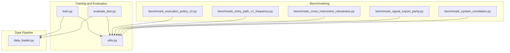
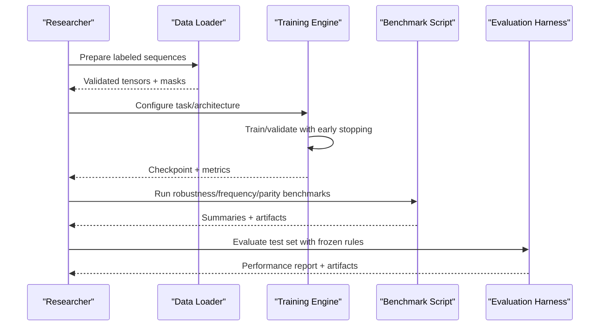
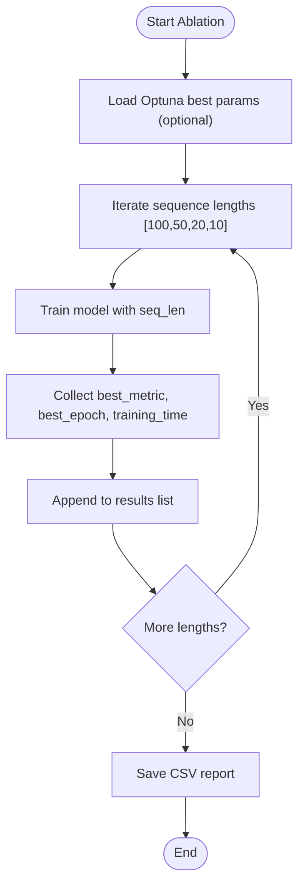
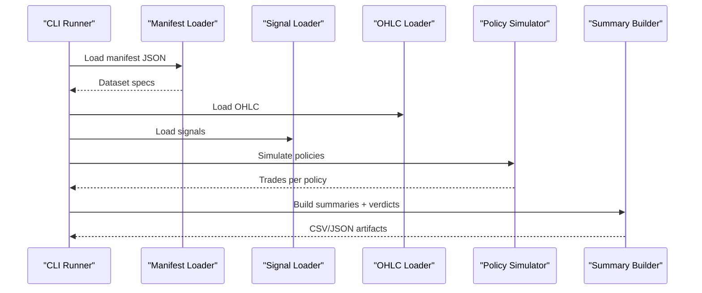
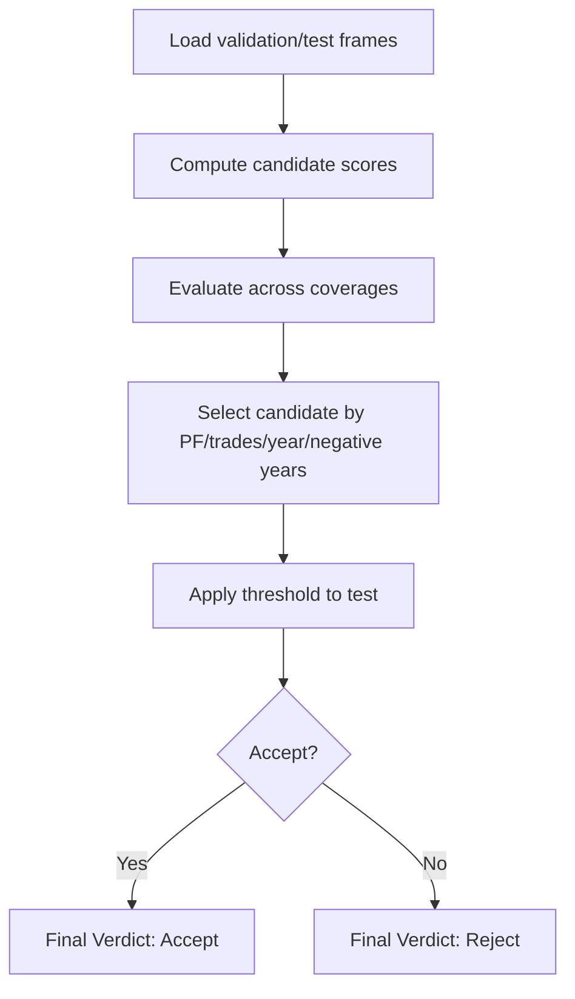
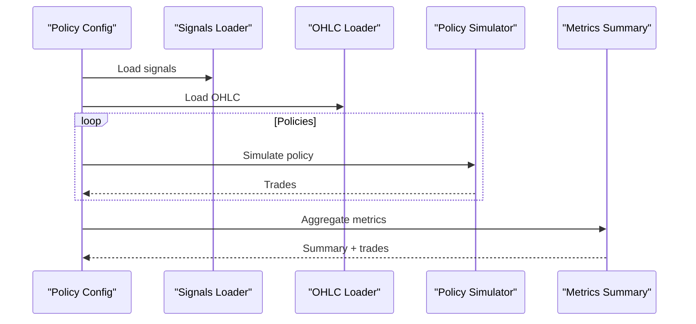
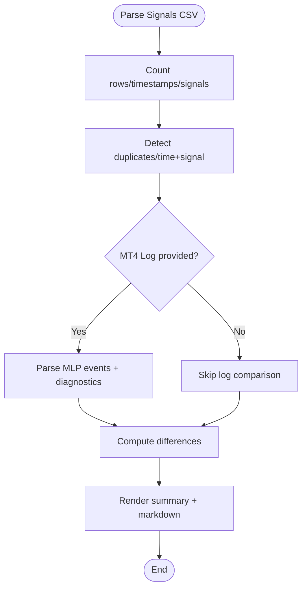
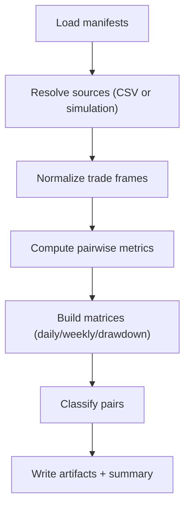
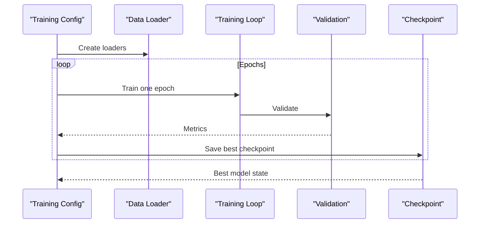
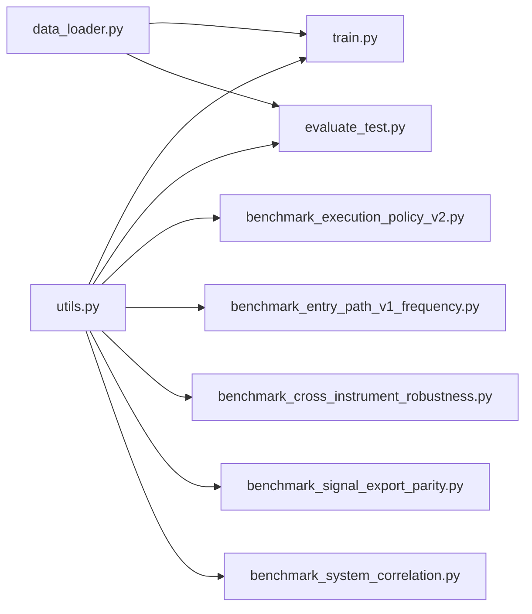

# Experimental Framework

<cite>
**Referenced Files in This Document**
- [ablation_study.py](file://ML/ablation_study.py)
- [benchmark_cross_instrument_robustness.py](file://ML/benchmark_cross_instrument_robustness.py)
- [benchmark_entry_path_v1_frequency.py](file://ML/benchmark_entry_path_v1_frequency.py)
- [benchmark_execution_policy_v2.py](file://ML/benchmark_execution_policy_v2.py)
- [benchmark_signal_export_parity.py](file://ML/benchmark_signal_export_parity.py)
- [benchmark_system_correlation.py](file://ML/benchmark_system_correlation.py)
- [data_loader.py](file://ML/data_loader.py)
- [evaluate_test.py](file://ML/evaluate_test.py)
- [train.py](file://ML/train.py)
- [utils.py](file://ML/utils.py)
</cite>

## Table of Contents
1. [Introduction](#introduction)
2. [Project Structure](#project-structure)
3. [Core Components](#core-components)
4. [Architecture Overview](#architecture-overview)
5. [Detailed Component Analysis](#detailed-component-analysis)
6. [Dependency Analysis](#dependency-analysis)
7. [Performance Considerations](#performance-considerations)
8. [Troubleshooting Guide](#troubleshooting-guide)
9. [Conclusion](#conclusion)
10. [Appendices](#appendices)

## Introduction
This document describes the SoSimple experimental framework, focusing on research methodology, hypothesis formulation, experimental design, and reproducibility. It documents the benchmarking infrastructure for cross-instrument robustness, frequency analysis, and parity validation, along with the ablation study framework for feature importance and model component evaluation. It also provides guidelines for designing controlled experiments, setting up validation protocols, interpreting statistical significance, and mitigating experimental bias.

## Project Structure
The experimental framework centers around a modular ML pipeline with dedicated benchmarking scripts and evaluation utilities:
- Training and evaluation: unified training and inference utilities
- Data loading and preprocessing: standardized dataset creation and caching
- Benchmarking: specialized scripts for robustness, frequency, execution policy, parity, and system correlation
- Utilities: reproducibility, metrics, and device selection

**Diagram sources**
- [train.py:1-2506](file://ML/train.py#L1-L2506)
- [evaluate_test.py:1-887](file://ML/evaluate_test.py#L1-L887)
- [data_loader.py:1-1210](file://ML/data_loader.py#L1-L1210)
- [benchmark_execution_policy_v2.py:1-424](file://ML/benchmark_execution_policy_v2.py#L1-L424)
- [benchmark_entry_path_v1_frequency.py:1-187](file://ML/benchmark_entry_path_v1_frequency.py#L1-L187)
- [benchmark_cross_instrument_robustness.py:1-342](file://ML/benchmark_cross_instrument_robustness.py#L1-L342)
- [benchmark_signal_export_parity.py:1-257](file://ML/benchmark_signal_export_parity.py#L1-L257)
- [benchmark_system_correlation.py:1-625](file://ML/benchmark_system_correlation.py#L1-L625)
- [utils.py:1-340](file://ML/utils.py#L1-L340)

**Section sources**
- [train.py:1-2506](file://ML/train.py#L1-L2506)
- [evaluate_test.py:1-887](file://ML/evaluate_test.py#L1-L887)
- [data_loader.py:1-1210](file://ML/data_loader.py#L1-L1210)
- [benchmark_execution_policy_v2.py:1-424](file://ML/benchmark_execution_policy_v2.py#L1-L424)
- [benchmark_entry_path_v1_frequency.py:1-187](file://ML/benchmark_entry_path_v1_frequency.py#L1-L187)
- [benchmark_cross_instrument_robustness.py:1-342](file://ML/benchmark_cross_instrument_robustness.py#L1-L342)
- [benchmark_signal_export_parity.py:1-257](file://ML/benchmark_signal_export_parity.py#L1-L257)
- [benchmark_system_correlation.py:1-625](file://ML/benchmark_system_correlation.py#L1-L625)
- [utils.py:1-340](file://ML/utils.py#L1-L340)

## Core Components
- Reproducibility utilities: deterministic seeding, device selection, parameter counting
- Training engine: unified training/validation/inference across tasks and architectures
- Data loader: standardized parsing, normalization, caching, and sequence truncation
- Benchmarking suite: robustness, frequency, execution policy, parity, and system correlation
- Evaluation harness: out-of-sample testing with task-specific reporting

Key responsibilities:
- Reproducibility: seed fixation, deterministic backends, device detection
- Training: task routing, loss computation, early stopping, logging
- Data: CSV validation, fractal parsing, time features, scaling, cache invalidation
- Benchmarking: policy simulation, cross-instrument transfer, parity diagnostics, correlation matrices
- Evaluation: test set inference, rule-based trading simulation, performance reporting

**Section sources**
- [utils.py:42-340](file://ML/utils.py#L42-L340)
- [train.py:1-2506](file://ML/train.py#L1-L2506)
- [data_loader.py:1-1210](file://ML/data_loader.py#L1-L1210)
- [evaluate_test.py:1-887](file://ML/evaluate_test.py#L1-L887)

## Architecture Overview
The framework follows a layered design:
- Data ingestion and validation feed standardized datasets to the training engine
- The training engine supports multiple tasks and architectures with consistent metrics and early stopping
- Benchmarking scripts consume preprocessed data and simulate trading scenarios
- Evaluation utilities run out-of-sample tests and produce structured reports

**Diagram sources**
- [data_loader.py:549-800](file://ML/data_loader.py#L549-L800)
- [train.py:176-800](file://ML/train.py#L176-L800)
- [benchmark_execution_policy_v2.py:344-424](file://ML/benchmark_execution_policy_v2.py#L344-L424)
- [evaluate_test.py:154-887](file://ML/evaluate_test.py#L154-L887)

## Detailed Component Analysis

### Ablation Study Framework (Feature Importance and Model Component Evaluation)
Purpose:
- Assess impact of sequence length on model performance for regression tasks
- Provide reproducible ablation runs with configurable epochs and batch size
- Save results to CSV for downstream analysis

Methodology:
- Iterates over predefined sequence lengths
- Loads best hyperparameters from Optuna JSON (optional)
- Trains with silent mode to reduce console noise
- Aggregates metrics (e.g., MAE, RMSE, directional accuracy) and training time
- Outputs timestamped CSV report

**Diagram sources**
- [ablation_study.py:26-107](file://ML/ablation_study.py#L26-L107)

**Section sources**
- [ablation_study.py:1-129](file://ML/ablation_study.py#L1-L129)

### Cross-Instrument Robustness Benchmark
Purpose:
- Validate provider drift stability and cross-instrument transfer performance
- Compare performance against baseline references and enforce verdict thresholds
- Align signal timestamps with OHLC coverage and detect mismatches

Methodology:
- Validates manifest containing datasets, OHLC paths, and signal CSVs
- Loads signals and OHLC, aligns timestamps, and asserts alignment
- Simulates policies and computes performance summaries
- Applies verdict thresholds to classify provider stability and transfer support
- Produces summary CSV/json, per-kind subsets, and metadata

**Diagram sources**
- [benchmark_cross_instrument_robustness.py:249-314](file://ML/benchmark_cross_instrument_robustness.py#L249-L314)

**Section sources**
- [benchmark_cross_instrument_robustness.py:1-342](file://ML/benchmark_cross_instrument_robustness.py#L1-L342)

### Frequency Analysis Benchmark (Entry Path v1)
Purpose:
- Select optimal scoring candidate for higher trade frequency while maintaining profitability
- Evaluate candidates across target coverages and rank by PF, trades/year, and negative year slices
- Validate on a held-out test set and produce a final verdict

Methodology:
- Loads prediction frames and computes candidate scores (return, edge, path probability)
- Evaluates grid across target coverages and selects candidate meeting thresholds
- Computes PF and yearly distribution on test set and applies acceptance criteria

**Diagram sources**
- [benchmark_entry_path_v1_frequency.py:101-158](file://ML/benchmark_entry_path_v1_frequency.py#L101-L158)

**Section sources**
- [benchmark_entry_path_v1_frequency.py:1-187](file://ML/benchmark_entry_path_v1_frequency.py#L1-L187)

### Execution Policy Benchmark (Policy Comparison)
Purpose:
- Compare exit policies on ready-made ML signals without retraining
- Compute performance metrics (PF, drawdown, concentration, streaks) and trade distributions

Methodology:
- Defines default and frequency-focused policy sets
- Loads signals and OHLC, simulates each policy, and aggregates metrics
- Produces summary CSV/json and consolidated trades

**Diagram sources**
- [benchmark_execution_policy_v2.py:344-424](file://ML/benchmark_execution_policy_v2.py#L344-L424)

**Section sources**
- [benchmark_execution_policy_v2.py:1-424](file://ML/benchmark_execution_policy_v2.py#L1-L424)

### Signal Export Parity Benchmark
Purpose:
- Diagnose parity between exported ML signals and MT4 tester logs
- Detect duplicates, opposite signals at same time, and timing mismatches

Methodology:
- Parses exported CSV and counts nonzero rows, unique timestamps, and duplicate groups
- Optionally parses MT4 log to extract MLP open events and diagnostics
- Builds comparison metrics and renders markdown summary

**Diagram sources**
- [benchmark_signal_export_parity.py:133-231](file://ML/benchmark_signal_export_parity.py#L133-L231)

**Section sources**
- [benchmark_signal_export_parity.py:1-257](file://ML/benchmark_signal_export_parity.py#L1-L257)

### System Correlation Benchmark
Purpose:
- Assess portfolio compatibility via pairwise system comparisons
- Compute trade overlaps, direction agreement, PnL correlations, drawdown overlap, and co-loss/staggered-gain ratios
- Classify pairs as redundant, complementary, partially overlapping, or unclear

Methodology:
- Validates manifest and loads trade frames (either from CSV or by simulating entry path signals)
- Computes pairwise metrics and builds correlation matrices
- Generates system summaries and metadata

**Diagram sources**
- [benchmark_system_correlation.py:531-601](file://ML/benchmark_system_correlation.py#L531-L601)

**Section sources**
- [benchmark_system_correlation.py:1-625](file://ML/benchmark_system_correlation.py#L1-L625)

### Training and Evaluation Pipeline
Purpose:
- Unified training across tasks and architectures with consistent early stopping and metrics
- Out-of-sample evaluation with task-specific reporting and frozen rule application

Methodology:
- Task routing: classification, regression, entry path, trailing stop, triple barrier
- Loss functions: focal loss, huber/asymmetric loss, multitask entry path losses
- Validation: task-appropriate metrics (classification, regression, binary, multitarget)
- Evaluation: test set inference, rule-based trading simulation, yearly stability checks

**Diagram sources**
- [train.py:176-800](file://ML/train.py#L176-L800)
- [data_loader.py:549-800](file://ML/data_loader.py#L549-L800)
- [evaluate_test.py:154-887](file://ML/evaluate_test.py#L154-L887)

**Section sources**
- [train.py:1-2506](file://ML/train.py#L1-L2506)
- [data_loader.py:1-1210](file://ML/data_loader.py#L1-L1210)
- [evaluate_test.py:1-887](file://ML/evaluate_test.py#L1-L887)
- [utils.py:1-340](file://ML/utils.py#L1-L340)

## Dependency Analysis
- Cohesion: Each benchmark script encapsulates a single experimental protocol
- Coupling: All benchmarks depend on shared utilities for reproducibility and metrics
- Data dependencies: Training and evaluation rely on standardized CSV formats and cached arrays
- External libraries: PyTorch, NumPy, Pandas, SciKit-learn, SciPy

**Diagram sources**
- [utils.py:1-340](file://ML/utils.py#L1-L340)
- [train.py:1-2506](file://ML/train.py#L1-L2506)
- [evaluate_test.py:1-887](file://ML/evaluate_test.py#L1-L887)
- [data_loader.py:1-1210](file://ML/data_loader.py#L1-L1210)
- [benchmark_execution_policy_v2.py:1-424](file://ML/benchmark_execution_policy_v2.py#L1-L424)
- [benchmark_entry_path_v1_frequency.py:1-187](file://ML/benchmark_entry_path_v1_frequency.py#L1-L187)
- [benchmark_cross_instrument_robustness.py:1-342](file://ML/benchmark_cross_instrument_robustness.py#L1-L342)
- [benchmark_signal_export_parity.py:1-257](file://ML/benchmark_signal_export_parity.py#L1-L257)
- [benchmark_system_correlation.py:1-625](file://ML/benchmark_system_correlation.py#L1-L625)

**Section sources**
- [utils.py:1-340](file://ML/utils.py#L1-L340)
- [train.py:1-2506](file://ML/train.py#L1-L2506)
- [evaluate_test.py:1-887](file://ML/evaluate_test.py#L1-L887)
- [data_loader.py:1-1210](file://ML/data_loader.py#L1-L1210)
- [benchmark_execution_policy_v2.py:1-424](file://ML/benchmark_execution_policy_v2.py#L1-L424)
- [benchmark_entry_path_v1_frequency.py:1-187](file://ML/benchmark_entry_path_v1_frequency.py#L1-L187)
- [benchmark_cross_instrument_robustness.py:1-342](file://ML/benchmark_cross_instrument_robustness.py#L1-L342)
- [benchmark_signal_export_parity.py:1-257](file://ML/benchmark_signal_export_parity.py#L1-L257)
- [benchmark_system_correlation.py:1-625](file://ML/benchmark_system_correlation.py#L1-L625)

## Performance Considerations
- Determinism: Seed fixation and deterministic backends ensure reproducible results across runs
- Device selection: Automatic GPU detection with fallback to CPU
- Early stopping: Task-specific stopping criteria minimize overfitting and training time
- Caching: Data loader caches parsed arrays to accelerate repeated runs
- Gradient clipping: Applied during training to stabilize optimization

[No sources needed since this section provides general guidance]

## Troubleshooting Guide
Common issues and resolutions:
- Data validation failures: Ensure CSV columns match expected schema and fractal format; check N_RAW_FEATURES and field indices
- Empty or invalid cache: Clear cache flag forces regeneration; verify cache file dates vs. CSV modification times
- Signal alignment mismatches: Verify timestamps in signals align with OHLC coverage; address missing timestamps
- Policy simulation gaps: Confirm policy parameters and OHLC availability for the signal time range
- Metric computation edge cases: Binary classification handles single-class scenarios gracefully; triple barrier excludes timeouts from AUC computation

**Section sources**
- [data_loader.py:248-327](file://ML/data_loader.py#L248-L327)
- [benchmark_cross_instrument_robustness.py:224-247](file://ML/benchmark_cross_instrument_robustness.py#L224-L247)
- [benchmark_execution_policy_v2.py:231-342](file://ML/benchmark_execution_policy_v2.py#L231-L342)
- [utils.py:195-262](file://ML/utils.py#L195-L262)

## Conclusion
The SoSimple experimental framework provides a cohesive, reproducible pipeline for training, benchmarking, and evaluating trading models. Its modular design enables rigorous research methodologies, robust validation across instruments and policies, and transparent reporting. By adhering to the documented protocols and using the provided templates, researchers can design controlled experiments, mitigate bias, and interpret statistical significance reliably.

## Appendices

### Guidelines for Controlled Experiments
- Define hypotheses clearly (e.g., “Increasing sequence length improves validation MAE”)
- Randomize seeds and use deterministic backends
- Split data into train/validation/test; avoid leakage
- Use early stopping and consistent metrics per task
- Document all hyperparameters and thresholds

### Validation Protocols
- Cross-instrument robustness: Use provider drift baselines and transfer verdict thresholds
- Execution policy: Compare multiple exit strategies and report PF, drawdown, and yearly stability
- Parity checks: Validate signal export alignment with MT4 logs
- System correlation: Assess portfolio redundancy/complementarity via pairwise metrics

### Statistical Significance and Bias Mitigation
- Use stratified sampling and time-aware splits
- Apply permutation or bootstrap tests for small samples
- Control for confounding variables (session filters, volatility regimes)
- Adjust for multiple comparisons when selecting candidates or policies

### Experiment Documentation Templates
- Research objective, hypotheses, and metrics
- Data sources, preprocessing steps, and feature engineering
- Model architecture, hyperparameters, and training schedule
- Validation methodology and thresholds
- Results summary, artifacts, and reproducibility checklist

### Result Tracking and Reproducibility Standards
- Store checkpoints, logs, and artifacts under versioned directories
- Record seed, device, and environment details
- Use manifests for benchmark inputs and outputs
- Provide CSV/json summaries with run metadata for audits

[No sources needed since this section summarizes without analyzing specific files]