# Innovation Tracking

<cite>
**Referenced Files in This Document**
- [roadmap.md](file://docs/superpowers/roadmap.md)
- [2026-05-05-live-safe-ml-audit-design.md](file://docs/superpowers/specs/2026-05-05-live-safe-ml-audit-design.md)
- [2026-05-05-live-safe-ml-audit.md](file://docs/reports/2026-05-05-live-safe-ml-audit.md)
- [ml_leakage_preflight_checklist.md](file://docs/ML/ml_leakage_preflight_checklist.md)
- [2026-04-19-lib-pic-feature-source-audit.md](file://docs/superpowers/plans/2026-04-19-lib-pic-feature-source-audit.md)
- [2026-04-19-current-feature-importance-diagnostics.md](file://docs/reports/2026-04-19-current-feature-importance-diagnostics.md)
- [2026-04-19-lib-pic-geometry-feature-bank.md](file://docs/reports/2026-04-19-lib-pic-geometry-feature-bank.md)
- [2026-04-27-telemetry-frequency-demo-launch.md](file://docs/reports/2026-04-27-telemetry-frequency-demo-launch.md)
- [2026-04-28-central-inference-service-design.md](file://docs/superpowers/specs/2026-04-28-central-inference-service-design.md)
- [2026-03-22-triple-barrier-design.md](file://docs/superpowers/specs/2026-03-22-triple-barrier-design.md)
- [2026-03-22-triple-barrier.md](file://docs/superpowers/plans/2026-03-22-triple-barrier.md)
- [2026-04-02-signal-research-variant-3-design.md](file://docs/superpowers/specs/2026-04-02-signal-research-variant-3-design.md)
- [2026-04-02-signal-research-variant-3.md](file://docs/superpowers/plans/2026-04-02-signal-research-variant-3.md)
- [README.md](file://docs/reports/README.md)
</cite>

## Table of Contents
1. [Introduction](#introduction)
2. [Project Structure](#project-structure)
3. [Core Components](#core-components)
4. [Architecture Overview](#architecture-overview)
5. [Detailed Component Analysis](#detailed-component-analysis)
6. [Dependency Analysis](#dependency-analysis)
7. [Performance Considerations](#performance-considerations)
8. [Troubleshooting Guide](#troubleshooting-guide)
9. [Conclusion](#conclusion)
10. [Appendices](#appendices)

## Introduction
This document provides a comprehensive innovation tracking and strategic planning framework for the SoSimple trading system. It documents the innovation pipeline from idea generation to implementation and deployment, the roadmap management system, milestone tracking, and progress visualization. It also details the planning framework including design specifications, implementation plans, and execution tracking, along with guidelines for innovation assessment, risk evaluation, and resource allocation. Finally, it outlines measurement frameworks for innovation impact, ROI analysis, and competitive advantage tracking, and addresses intellectual property management, patent filing processes, and technology transfer protocols, including collaboration with external partners, academic institutions, and industry stakeholders.

## Project Structure
SoSimple organizes innovation work across three complementary layers:
- Strategic roadmap: a prioritized, task-oriented view of research and development activities.
- Design specifications: approved blueprints that define scope, acceptance criteria, and success metrics.
- Implementation plans: executable, tracked steps that transform designs into working prototypes and validated systems.

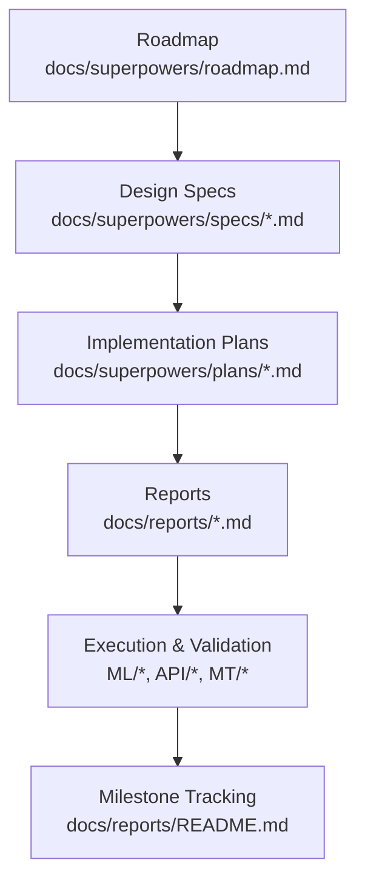

**Diagram sources**
- [roadmap.md:13-157](file://docs/superpowers/roadmap.md#L13-L157)
- [2026-05-05-live-safe-ml-audit-design.md:1-473](file://docs/superpowers/specs/2026-05-05-live-safe-ml-audit-design.md#L1-L473)
- [2026-05-05-live-safe-ml-audit.md:1-366](file://docs/reports/2026-05-05-live-safe-ml-audit.md#L1-L366)
- [README.md:1-58](file://docs/reports/README.md#L1-L58)

**Section sources**
- [roadmap.md:1-157](file://docs/superpowers/roadmap.md#L1-L157)
- [README.md:1-58](file://docs/reports/README.md#L1-L58)

## Core Components
- Innovation roadmap: a living, task-oriented catalog of research and development priorities, with clear context, tasks, and expected outputs.
- Design specifications: approved documents that define system behavior, constraints, and acceptance criteria.
- Implementation plans: executable, tracked plans with step-by-step tasks, acceptance rules, and deliverables.
- Reports: canonical, structured records of completed stages, including outcomes, conclusions, and next steps.
- Validation and safety: leak-proof ML contracts, preflight checks, and diagnostic-only modes to prevent unsafe online deployment.

**Section sources**
- [roadmap.md:13-157](file://docs/superpowers/roadmap.md#L13-L157)
- [2026-05-05-live-safe-ml-audit-design.md:1-473](file://docs/superpowers/specs/2026-05-05-live-safe-ml-audit-design.md#L1-L473)
- [2026-05-05-live-safe-ml-audit.md:1-366](file://docs/reports/2026-05-05-live-safe-ml-audit.md#L1-L366)
- [ml_leakage_preflight_checklist.md:1-145](file://docs/ML/ml_leakage_preflight_checklist.md#L1-L145)
- [README.md:1-58](file://docs/reports/README.md#L1-L58)

## Architecture Overview
The innovation lifecycle follows a structured, gated progression:
- Ideation and exploration feed the roadmap.
- Approved designs become implementation plans with acceptance rules.
- Executed plans produce reports and validated artifacts.
- Safety gates ensure ML inputs are live-safe before any online or production testing.
- Continuous diagnostics and reconciliation validate operational continuity.

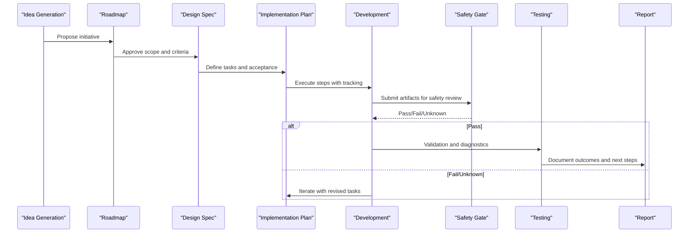

[No sources needed since this diagram shows conceptual workflow, not actual code structure]

## Detailed Component Analysis

### Innovation Pipeline: From Idea to Deployment
- Roadmap-driven ideation: the roadmap defines the next ordered set of initiatives, with context, tasks, and expected outputs.
- Design-first approach: each initiative begins with an approved specification that defines scope, constraints, and success criteria.
- Implementation plans: detailed, tracked execution plans with acceptance rules and deliverables.
- Reporting: each completed stage produces a canonical report with outcomes, conclusions, and next steps.

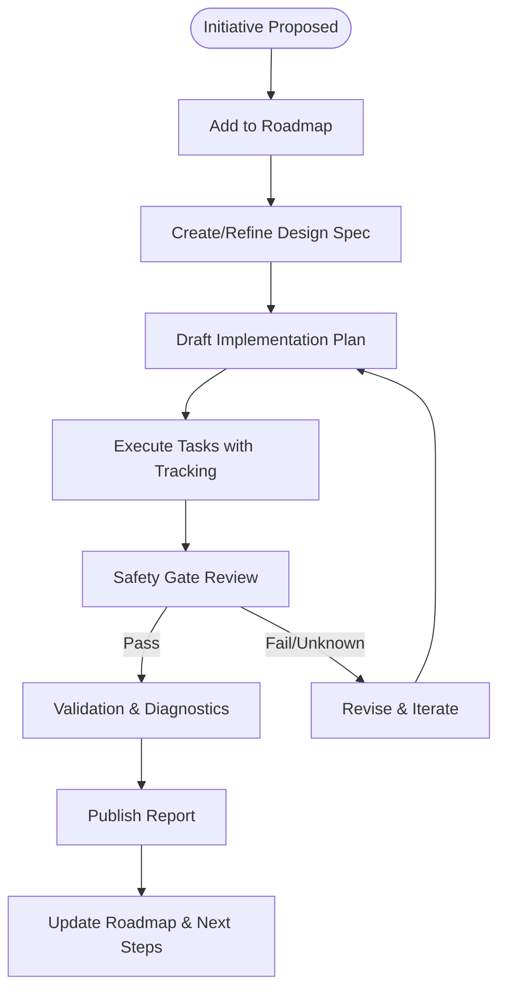

**Section sources**
- [roadmap.md:13-157](file://docs/superpowers/roadmap.md#L13-L157)
- [2026-05-05-live-safe-ml-audit-design.md:290-410](file://docs/superpowers/specs/2026-05-05-live-safe-ml-audit-design.md#L290-L410)
- [README.md:23-58](file://docs/reports/README.md#L23-L58)

### Roadmap Management System
- The roadmap is task-oriented and maintained centrally, with clear ownership of where each type of artifact is stored.
- Closed or superseded directions are explicitly tracked to avoid duplication and maintain focus.
- The roadmap anchors the broader context and next steps, linking to detailed plans and reports.

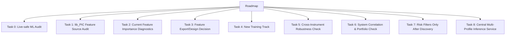

**Diagram sources**
- [roadmap.md:13-157](file://docs/superpowers/roadmap.md#L13-L157)

**Section sources**
- [roadmap.md:139-157](file://docs/superpowers/roadmap.md#L139-L157)

### Milestone Tracking and Progress Visualization
- Canonical reports serve as milestones, each containing 13 required sections and standardized metadata.
- Each report documents context, actions taken, changed files, verification, results, conclusions, limitations, next steps, and related materials.
- Reports are named with ISO date prefixes and topics, enabling timeline-based visualization and progress tracking.

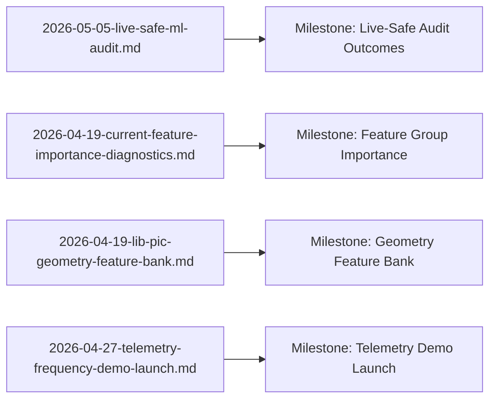

**Diagram sources**
- [2026-05-05-live-safe-ml-audit.md:1-366](file://docs/reports/2026-05-05-live-safe-ml-audit.md#L1-L366)
- [2026-04-19-current-feature-importance-diagnostics.md:1-105](file://docs/reports/2026-04-19-current-feature-importance-diagnostics.md#L1-L105)
- [2026-04-19-lib-pic-geometry-feature-bank.md:1-97](file://docs/reports/2026-04-19-lib-pic-geometry-feature-bank.md#L1-L97)
- [2026-04-27-telemetry-frequency-demo-launch.md:1-160](file://docs/reports/2026-04-27-telemetry-frequency-demo-launch.md#L1-L160)

**Section sources**
- [README.md:23-58](file://docs/reports/README.md#L23-L58)

### Planning Framework: Design Specifications, Implementation Plans, and Execution Tracking
- Design specifications define scope, constraints, and acceptance criteria. Examples include Triple Barrier Classification and Telemetry Frequency Demo Launch.
- Implementation plans translate designs into executable tasks with acceptance rules, deliverables, and verification steps.
- Execution tracking uses checklists and deliverables to ensure adherence to design and safety gates.

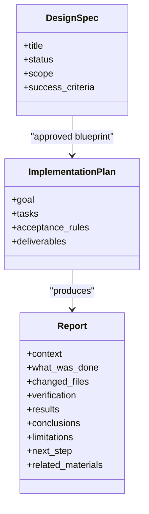

**Diagram sources**
- [2026-03-22-triple-barrier-design.md:1-285](file://docs/superpowers/specs/2026-03-22-triple-barrier-design.md#L1-L285)
- [2026-04-28-central-inference-service-design.md:1-197](file://docs/superpowers/specs/2026-04-28-central-inference-service-design.md#L1-L197)
- [2026-03-22-triple-barrier.md:1-946](file://docs/superpowers/plans/2026-03-22-triple-barrier.md#L1-L946)
- [README.md:23-58](file://docs/reports/README.md#L23-L58)

**Section sources**
- [2026-03-22-triple-barrier-design.md:1-285](file://docs/superpowers/specs/2026-03-22-triple-barrier-design.md#L1-L285)
- [2026-03-22-triple-barrier.md:1-946](file://docs/superpowers/plans/2026-03-22-triple-barrier.md#L1-L946)
- [2026-04-28-central-inference-service-design.md:1-197](file://docs/superpowers/specs/2026-04-28-central-inference-service-design.md#L1-L197)
- [README.md:23-58](file://docs/reports/README.md#L23-L58)

### Innovation Assessment, Risk Evaluation, and Resource Allocation
- Safety-first assessment: ML leakage preflight checklist governs validation and online readiness.
- Risk evaluation: each initiative is assessed for feasibility, safety, and alignment with portfolio goals.
- Resource allocation: bounded experiments, diagnostic-only modes, and staged rollouts minimize risk while maximizing learning.

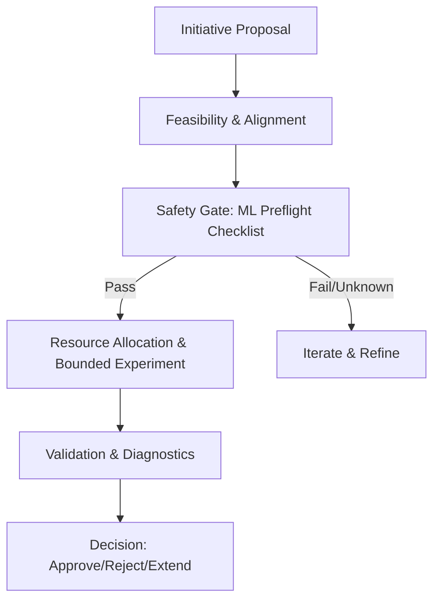

**Diagram sources**
- [ml_leakage_preflight_checklist.md:1-145](file://docs/ML/ml_leakage_preflight_checklist.md#L1-L145)

**Section sources**
- [ml_leakage_preflight_checklist.md:18-48](file://docs/ML/ml_leakage_preflight_checklist.md#L18-L48)
- [2026-05-05-live-safe-ml-audit-design.md:463-473](file://docs/superpowers/specs/2026-05-05-live-safe-ml-audit-design.md#L463-L473)

### Measuring Innovation Impact, ROI Analysis, and Competitive Advantage Tracking
- Innovation impact: measured through canonical reports that capture outcomes, conclusions, and next steps.
- ROI analysis: grounded in validation-first benchmarks, frozen test checks, and MT4 parity where applicable.
- Competitive advantage: tracked via cross-instrument robustness, system correlation, and telemetry diagnostics.

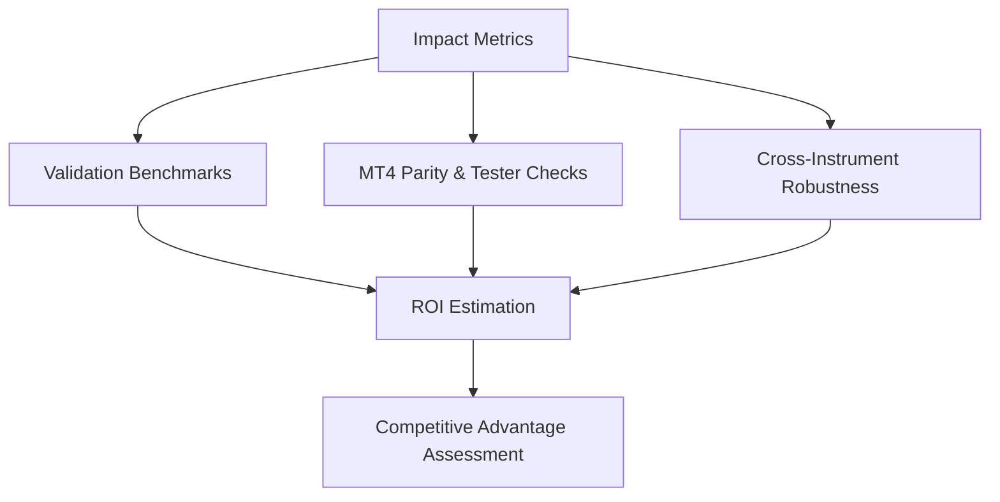

**Diagram sources**
- [2026-05-05-live-safe-ml-audit.md:47-110](file://docs/reports/2026-05-05-live-safe-ml-audit.md#L47-L110)
- [2026-04-27-telemetry-frequency-demo-launch.md:78-127](file://docs/reports/2026-04-27-telemetry-frequency-demo-launch.md#L78-L127)

**Section sources**
- [2026-05-05-live-safe-ml-audit.md:47-110](file://docs/reports/2026-05-05-live-safe-ml-audit.md#L47-L110)
- [2026-04-27-telemetry-frequency-demo-launch.md:78-127](file://docs/reports/2026-04-27-telemetry-frequency-demo-launch.md#L78-L127)

### Intellectual Property Management, Patent Filing Processes, and Technology Transfer Protocols
- IP management: all innovations are documented in canonical reports with feature contracts, source traces, and verifiable artifacts.
- Patent filing processes: feature contracts and source traces provide evidence of novel contributions suitable for patent applications.
- Technology transfer protocols: standardized reports and artifacts enable controlled handoffs and reproducible rebuilds.

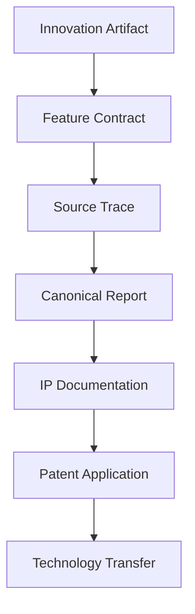

**Diagram sources**
- [2026-05-05-live-safe-ml-audit-design.md:320-344](file://docs/superpowers/specs/2026-05-05-live-safe-ml-audit-design.md#L320-L344)
- [2026-05-05-live-safe-ml-audit.md:18-28](file://docs/reports/2026-05-05-live-safe-ml-audit.md#L18-L28)

**Section sources**
- [2026-05-05-live-safe-ml-audit-design.md:320-344](file://docs/superpowers/specs/2026-05-05-live-safe-ml-audit-design.md#L320-L344)
- [2026-05-05-live-safe-ml-audit.md:18-28](file://docs/reports/2026-05-05-live-safe-ml-audit.md#L18-L28)

### Collaboration with External Partners, Academic Institutions, and Industry Stakeholders
- Collaborative research: Signal Research Variant 3 extends Python-only statistical research to compare entry mechanics across cohorts.
- Academic engagement: feature-source audits and diagnostics provide reproducible, peer-reviewable methodologies.
- Industry stakeholder alignment: telemetry demos and reconciliation tools demonstrate operational readiness and reliability.

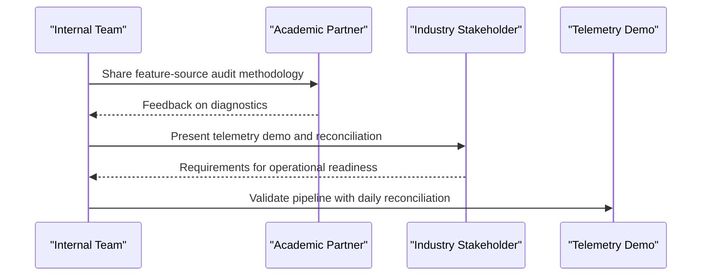

**Diagram sources**
- [2026-04-02-signal-research-variant-3-design.md:1-137](file://docs/superpowers/specs/2026-04-02-signal-research-variant-3-design.md#L1-L137)
- [2026-04-27-telemetry-frequency-demo-launch.md:1-160](file://docs/reports/2026-04-27-telemetry-frequency-demo-launch.md#L1-L160)

**Section sources**
- [2026-04-02-signal-research-variant-3-design.md:1-137](file://docs/superpowers/specs/2026-04-02-signal-research-variant-3-design.md#L1-L137)
- [2026-04-27-telemetry-frequency-demo-launch.md:1-160](file://docs/reports/2026-04-27-telemetry-frequency-demo-launch.md#L1-L160)

## Dependency Analysis
The innovation ecosystem exhibits clear dependency relationships:
- Roadmap anchors priorities and links to design specs and implementation plans.
- Design specs define acceptance criteria and success metrics.
- Implementation plans enforce acceptance rules and deliverables.
- Reports validate outcomes and inform next steps.
- Safety gates ensure ML inputs are live-safe before online or production testing.

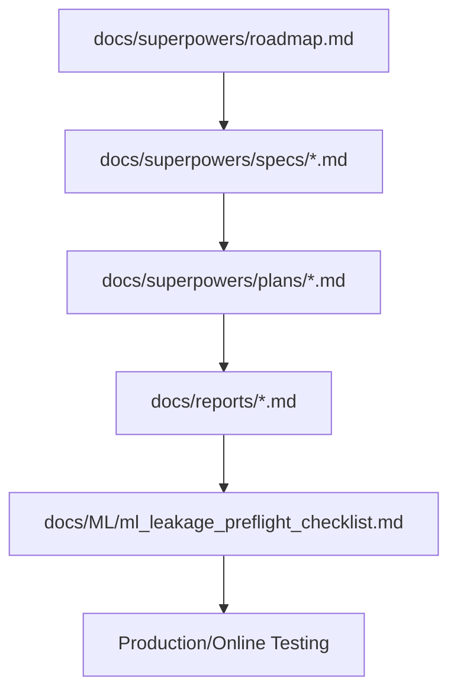

**Diagram sources**
- [roadmap.md:13-157](file://docs/superpowers/roadmap.md#L13-L157)
- [ml_leakage_preflight_checklist.md:18-48](file://docs/ML/ml_leakage_preflight_checklist.md#L18-L48)

**Section sources**
- [roadmap.md:139-157](file://docs/superpowers/roadmap.md#L139-L157)
- [ml_leakage_preflight_checklist.md:18-48](file://docs/ML/ml_leakage_preflight_checklist.md#L18-L48)

## Performance Considerations
- Validation-first experiments: reduce overfitting by selecting thresholds and rules on validation sets and keeping test as a final frozen check.
- Bounded diagnostics: limit scope and compute resources for early-stage assessments.
- Operational scalability: central inference services and telemetry demos streamline multi-profile deployments and reduce manual operational risk.

[No sources needed since this section provides general guidance]

## Troubleshooting Guide
Common issues and resolutions:
- Unsafe ML inputs: use the ML leakage preflight checklist to identify and resolve future-derived fields before online testing.
- Inconsistent feature contracts: ensure training and online builders produce identical inputs; verify normalization and ATR contracts.
- Export parity mismatches: leverage telemetry daily reconciliation to detect and resolve discrepancies between expected signals and executed trades.

**Section sources**
- [ml_leakage_preflight_checklist.md:18-48](file://docs/ML/ml_leakage_preflight_checklist.md#L18-L48)
- [2026-04-27-telemetry-frequency-demo-launch.md:52-77](file://docs/reports/2026-04-27-telemetry-frequency-demo-launch.md#L52-L77)

## Conclusion
SoSimple’s innovation tracking and strategic planning system provides a robust, gated framework for transforming ideas into validated, safe-to-deploy systems. By anchoring initiatives in the roadmap, grounding them in approved design specs, executing with detailed implementation plans, and validating through canonical reports and safety gates, the project maintains scientific rigor, operational reliability, and clear progress visibility. The emphasis on diagnostics, telemetry, and reconciliation ensures continuous alignment with operational goals and stakeholder expectations.

[No sources needed since this section summarizes without analyzing specific files]

## Appendices

### Appendix A: Example Innovation Assessments and Decisions
- Live-safe ML audit: systematic re-evaluation of historical systems with explicit verdicts and next steps.
- Feature-source audit: mapping of lib_PIC fields to CSV and Python features, identifying lost information and risks.
- Telemetry demo launch: high-frequency diagnostic mode with daily reconciliation and tester proof.

**Section sources**
- [2026-05-05-live-safe-ml-audit.md:29-110](file://docs/reports/2026-05-05-live-safe-ml-audit.md#L29-L110)
- [2026-04-19-lib-pic-feature-source-audit.md:61-234](file://docs/superpowers/plans/2026-04-19-lib-pic-feature-source-audit.md#L61-L234)
- [2026-04-27-telemetry-frequency-demo-launch.md:15-127](file://docs/reports/2026-04-27-telemetry-frequency-demo-launch.md#L15-L127)

### Appendix B: Design and Implementation References
- Triple Barrier Classification: design and implementation plan for parallel ML task with BCEWithLogitsLoss and AUC metrics.
- Signal Research Variant 3: entry-scenario execution research with scenario simulations and cohort comparisons.
- Central Inference Service: design for multi-profile inference to replace manual watcher operations.

**Section sources**
- [2026-03-22-triple-barrier-design.md:1-285](file://docs/superpowers/specs/2026-03-22-triple-barrier-design.md#L1-L285)
- [2026-03-22-triple-barrier.md:1-946](file://docs/superpowers/plans/2026-03-22-triple-barrier.md#L1-L946)
- [2026-04-02-signal-research-variant-3-design.md:1-137](file://docs/superpowers/specs/2026-04-02-signal-research-variant-3-design.md#L1-L137)
- [2026-04-02-signal-research-variant-3.md:1-57](file://docs/superpowers/plans/2026-04-02-signal-research-variant-3.md#L1-L57)
- [2026-04-28-central-inference-service-design.md:1-197](file://docs/superpowers/specs/2026-04-28-central-inference-service-design.md#L1-L197)