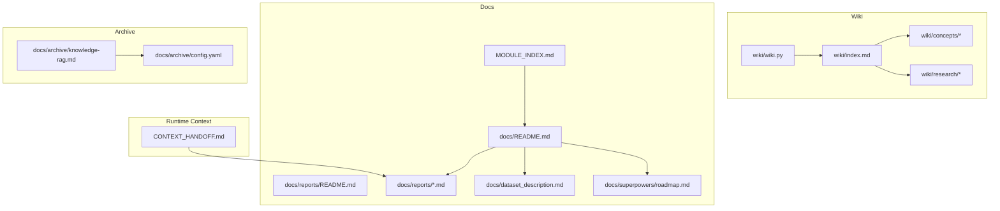
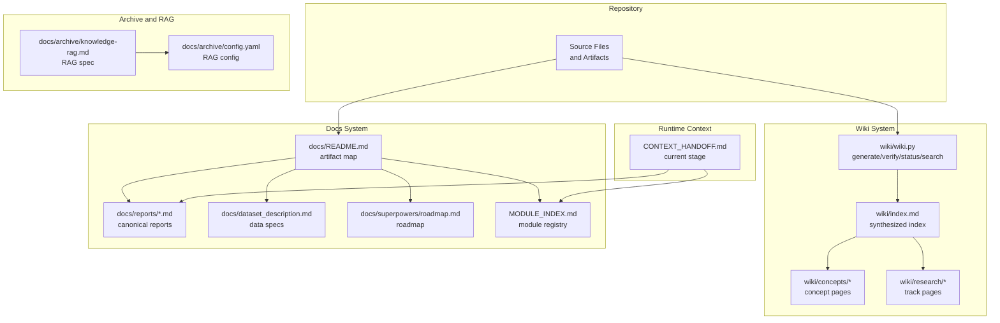
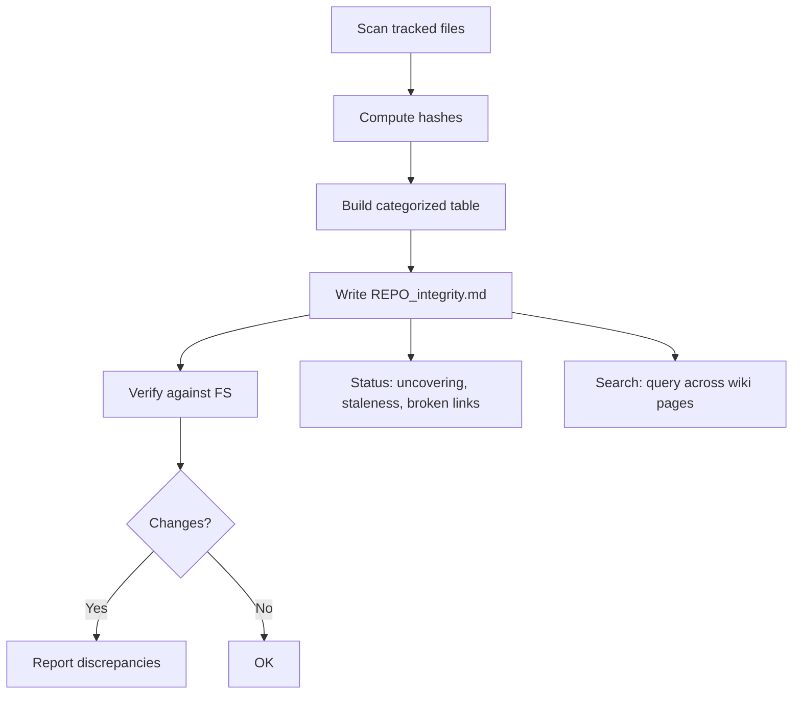
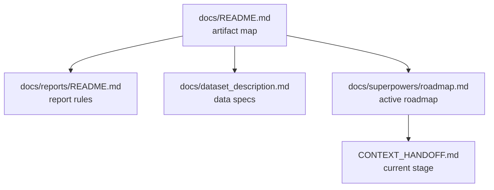
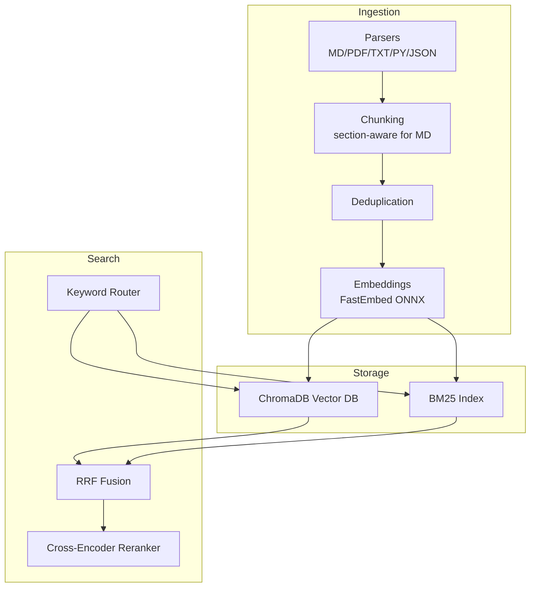
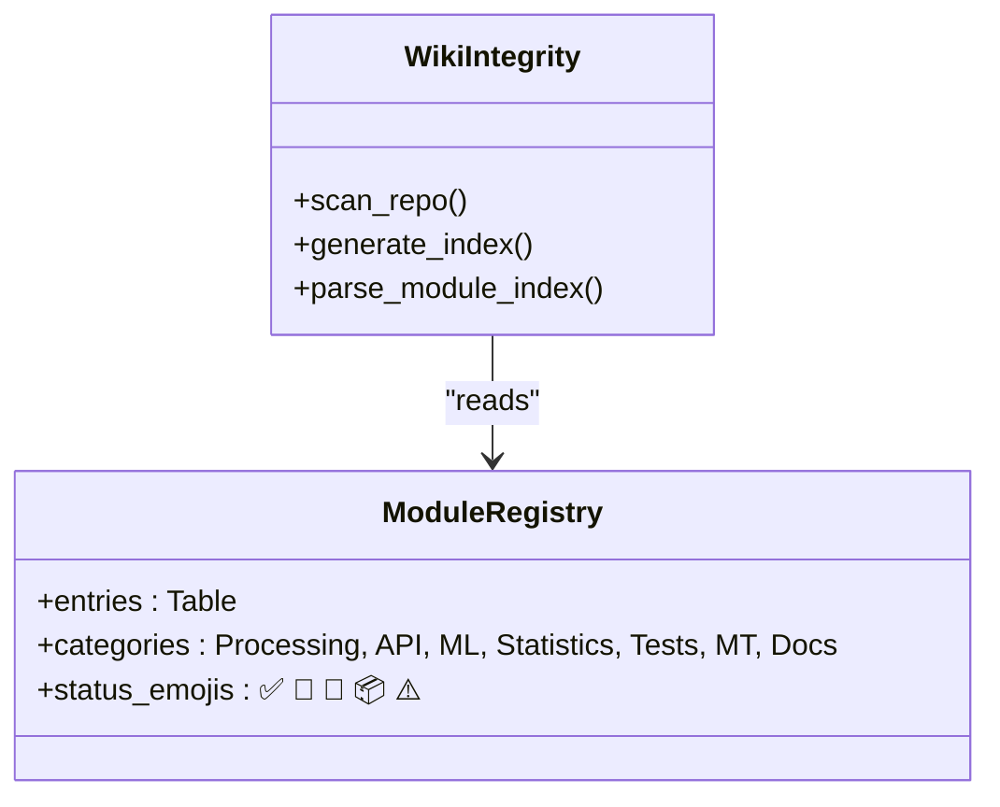
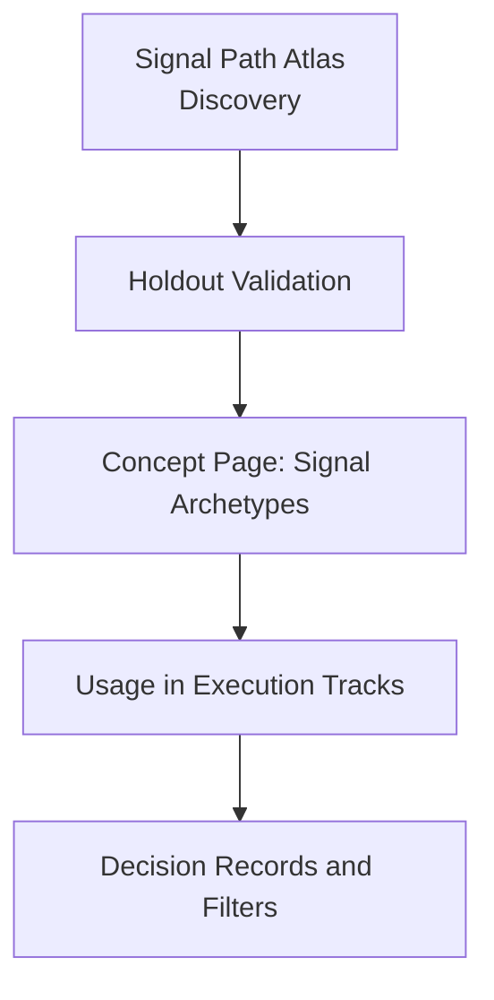
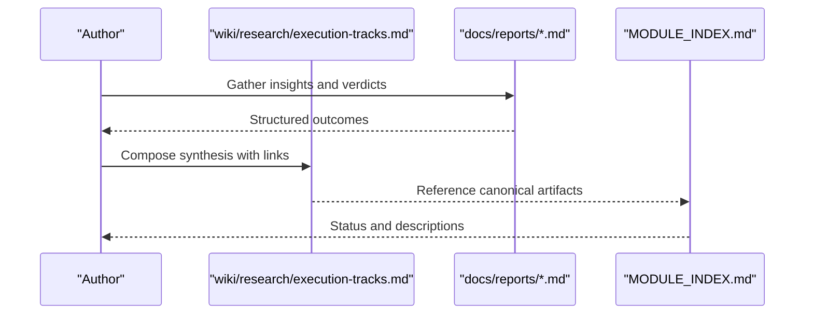
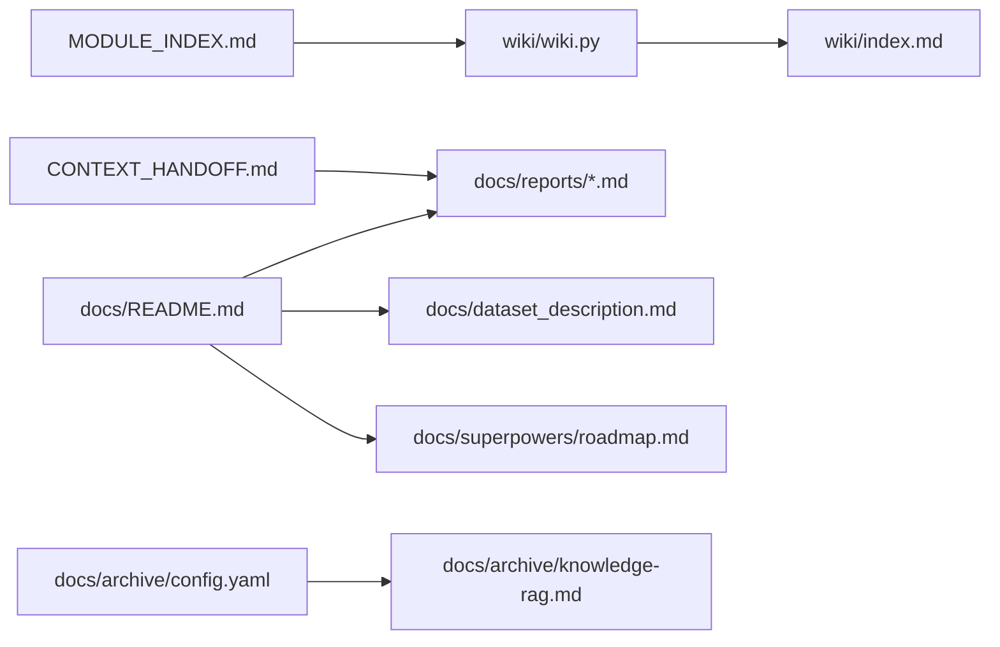

# Knowledge Management

<cite>
**Referenced Files in This Document**
- [wiki/index.md](file://wiki/index.md)
- [wiki/concepts/signal-archetypes.md](file://wiki/concepts/signal-archetypes.md)
- [wiki/research/execution-tracks.md](file://wiki/research/execution-tracks.md)
- [wiki/wiki.py](file://wiki/wiki.py)
- [docs/README.md](file://docs/README.md)
- [docs/reports/README.md](file://docs/reports/README.md)
- [docs/dataset_description.md](file://docs/dataset_description.md)
- [docs/superpowers/roadmap.md](file://docs/superpowers/roadmap.md)
- [docs/archive/knowledge-rag.md](file://docs/archive/knowledge-rag.md)
- [docs/archive/config.yaml](file://docs/archive/config.yaml)
- [MODULE_INDEX.md](file://MODULE_INDEX.md)
- [CONTEXT_HANDOFF.md](file://CONTEXT_HANDOFF.md)
</cite>

## Table of Contents
1. [Introduction](#introduction)
2. [Project Structure](#project-structure)
3. [Core Components](#core-components)
4. [Architecture Overview](#architecture-overview)
5. [Detailed Component Analysis](#detailed-component-analysis)
6. [Dependency Analysis](#dependency-analysis)
7. [Performance Considerations](#performance-considerations)
8. [Troubleshooting Guide](#troubleshooting-guide)
9. [Conclusion](#conclusion)
10. [Appendices](#appendices)

## Introduction
This document describes the SoSimple research ecosystem’s knowledge management framework. It explains how the wiki system organizes synthesized knowledge, how the documentation repository structures canonical artifacts, and how collaborative workflows are governed. It also details the knowledge base structure (concepts, research notes, decisions), the archival and discovery systems, and the integration with external knowledge sources and collaborative platforms.

## Project Structure
The knowledge ecosystem is organized around three pillars:
- Wiki: synthesized, human-readable knowledge for agents and researchers.
- Docs: canonical artifacts, standards, and module-level documentation.
- Archive: long-lived knowledge stores and integrations (including the local RAG).

**Diagram sources**
- [wiki/index.md:1-32](file://wiki/index.md#L1-L32)
- [wiki/wiki.py:250-308](file://wiki/wiki.py#L250-L308)
- [docs/README.md:1-24](file://docs/README.md#L1-L24)
- [docs/reports/README.md:1-58](file://docs/reports/README.md#L1-L58)
- [docs/dataset_description.md:1-149](file://docs/dataset_description.md#L1-L149)
- [docs/superpowers/roadmap.md:1-157](file://docs/superpowers/roadmap.md#L1-L157)
- [docs/archive/knowledge-rag.md:1-1235](file://docs/archive/knowledge-rag.md#L1-L1235)
- [docs/archive/config.yaml:1-96](file://docs/archive/config.yaml#L1-L96)
- [MODULE_INDEX.md:1-228](file://MODULE_INDEX.md#L1-L228)
- [CONTEXT_HANDOFF.md:1-155](file://CONTEXT_HANDOFF.md#L1-L155)

**Section sources**
- [wiki/index.md:1-32](file://wiki/index.md#L1-L32)
- [docs/README.md:1-24](file://docs/README.md#L1-L24)
- [docs/reports/README.md:1-58](file://docs/reports/README.md#L1-L58)
- [docs/dataset_description.md:1-149](file://docs/dataset_description.md#L1-L149)
- [docs/superpowers/roadmap.md:1-157](file://docs/superpowers/roadmap.md#L1-L157)
- [docs/archive/knowledge-rag.md:1-1235](file://docs/archive/knowledge-rag.md#L1-L1235)
- [docs/archive/config.yaml:1-96](file://docs/archive/config.yaml#L1-L96)
- [MODULE_INDEX.md:1-228](file://MODULE_INDEX.md#L1-L228)
- [CONTEXT_HANDOFF.md:1-155](file://CONTEXT_HANDOFF.md#L1-L155)

## Core Components
- Wiki index and integrity map: automated catalog of repository contents with hashes and statuses, maintained by a dedicated generator and verifier.
- Synthesized knowledge: curated pages for concepts and research tracks that distill multi-report insights.
- Docs repository: canonical artifacts (reports, datasets, roadmaps), with strict naming and structure rules.
- Archive and RAG: local knowledge retrieval system integrated with Claude via MCP for semantic search and cross-referencing.
- Module registry: MODULE_INDEX.md enumerates modules, roles, and statuses for navigation and contribution.

Key responsibilities:
- Wiki: entry points for synthesized knowledge; integrity checks; search and status reporting.
- Docs: artifact lifecycle, naming, and structure; module-level documentation; roadmap and context handoffs.
- Archive/RAG: persistent knowledge store with incremental indexing, query expansion, and reranking.

**Section sources**
- [wiki/wiki.py:1-534](file://wiki/wiki.py#L1-L534)
- [wiki/index.md:1-32](file://wiki/index.md#L1-L32)
- [docs/README.md:1-24](file://docs/README.md#L1-L24)
- [docs/reports/README.md:1-58](file://docs/reports/README.md#L1-L58)
- [docs/archive/knowledge-rag.md:1-1235](file://docs/archive/knowledge-rag.md#L1-L1235)
- [MODULE_INDEX.md:1-228](file://MODULE_INDEX.md#L1-L228)

## Architecture Overview
The knowledge management architecture connects repository content to agents and collaborators through:
- Automated indexing and integrity verification for wiki and docs.
- Canonical report structure and naming for traceability.
- Local RAG for semantic search and cross-referencing.
- Module registry for navigation and contribution.

**Diagram sources**
- [wiki/wiki.py:488-534](file://wiki/wiki.py#L488-L534)
- [wiki/index.md:1-32](file://wiki/index.md#L1-L32)
- [docs/README.md:1-24](file://docs/README.md#L1-L24)
- [docs/reports/README.md:1-58](file://docs/reports/README.md#L1-L58)
- [docs/dataset_description.md:1-149](file://docs/dataset_description.md#L1-L149)
- [docs/superpowers/roadmap.md:1-157](file://docs/superpowers/roadmap.md#L1-L157)
- [docs/archive/knowledge-rag.md:1-1235](file://docs/archive/knowledge-rag.md#L1-L1235)
- [docs/archive/config.yaml:1-96](file://docs/archive/config.yaml#L1-L96)
- [MODULE_INDEX.md:1-228](file://MODULE_INDEX.md#L1-L228)
- [CONTEXT_HANDOFF.md:1-155](file://CONTEXT_HANDOFF.md#L1-L155)

## Detailed Component Analysis

### Wiki System: Index, Integrity, and Synthesis
- Index generation: scans tracked files, computes hashes, and builds a categorized table with status where available.
- Integrity verification: compares stored hashes with current filesystem to detect changes, additions, or removals.
- Status reporting: identifies uncovered reports, changed files since last index, and broken links.
- Search: grep-based search across wiki pages and selected index files.
- Synthesized knowledge: curated concept and research pages distilled from multiple reports.

**Diagram sources**
- [wiki/wiki.py:211-308](file://wiki/wiki.py#L211-L308)
- [wiki/wiki.py:329-447](file://wiki/wiki.py#L329-L447)
- [wiki/wiki.py:452-486](file://wiki/wiki.py#L452-L486)

**Section sources**
- [wiki/wiki.py:1-534](file://wiki/wiki.py#L1-L534)
- [wiki/index.md:1-32](file://wiki/index.md#L1-L32)

### Docs Repository: Canonical Artifacts and Standards
- Artifact map: defines roles, update rules, and formats for docs/ artifacts.
- Report lifecycle: mandatory report creation for notable changes; standardized structure and metadata.
- Dataset specifications: detailed schema and normalization rules for input data.
- Roadmap and context: active research roadmap and current stage handoff for continuity.

**Diagram sources**
- [docs/README.md:1-24](file://docs/README.md#L1-L24)
- [docs/reports/README.md:1-58](file://docs/reports/README.md#L1-L58)
- [docs/dataset_description.md:1-149](file://docs/dataset_description.md#L1-L149)
- [docs/superpowers/roadmap.md:1-157](file://docs/superpowers/roadmap.md#L1-L157)
- [CONTEXT_HANDOFF.md:1-155](file://CONTEXT_HANDOFF.md#L1-L155)

**Section sources**
- [docs/README.md:1-24](file://docs/README.md#L1-L24)
- [docs/reports/README.md:1-58](file://docs/reports/README.md#L1-L58)
- [docs/dataset_description.md:1-149](file://docs/dataset_description.md#L1-L149)
- [docs/superpowers/roadmap.md:1-157](file://docs/superpowers/roadmap.md#L1-L157)
- [CONTEXT_HANDOFF.md:1-155](file://CONTEXT_HANDOFF.md#L1-L155)

### Archive and RAG: Local Knowledge Retrieval
- Knowledge RAG: hybrid search engine with semantic embeddings, BM25 keyword matching, cross-encoder reranking, markdown-aware chunking, and query expansion.
- Configuration: YAML-driven customization for paths, models, chunking, categories, keyword routing, and query expansions.
- Integration: MCP tools enable adding, updating, removing, and searching documents directly from Claude Code.

**Diagram sources**
- [docs/archive/knowledge-rag.md:86-222](file://docs/archive/knowledge-rag.md#L86-L222)
- [docs/archive/knowledge-rag.md:426-715](file://docs/archive/knowledge-rag.md#L426-L715)
- [docs/archive/config.yaml:1-96](file://docs/archive/config.yaml#L1-L96)

**Section sources**
- [docs/archive/knowledge-rag.md:1-1235](file://docs/archive/knowledge-rag.md#L1-L1235)
- [docs/archive/config.yaml:1-96](file://docs/archive/config.yaml#L1-L96)

### Module Registry: Navigation and Contribution
- MODULE_INDEX.md enumerates modules by category, purpose, inputs/outputs, documentation links, and status emojis.
- Used by wiki integrity generator to enrich index entries with status and descriptions.

**Diagram sources**
- [MODULE_INDEX.md:1-228](file://MODULE_INDEX.md#L1-L228)
- [wiki/wiki.py:114-139](file://wiki/wiki.py#L114-L139)
- [wiki/wiki.py:211-247](file://wiki/wiki.py#L211-L247)

**Section sources**
- [MODULE_INDEX.md:1-228](file://MODULE_INDEX.md#L1-L228)
- [wiki/wiki.py:114-139](file://wiki/wiki.py#L114-L139)
- [wiki/wiki.py:211-247](file://wiki/wiki.py#L211-L247)

### Concept Pages: Domain Knowledge Synthesis
- Example: signal archetypes page synthesizes multi-modal distribution insights, validation, and practical implications across related reports.

**Diagram sources**
- [wiki/concepts/signal-archetypes.md:1-53](file://wiki/concepts/signal-archetypes.md#L1-L53)
- [wiki/research/execution-tracks.md:1-800](file://wiki/research/execution-tracks.md#L1-L800)

**Section sources**
- [wiki/concepts/signal-archetypes.md:1-53](file://wiki/concepts/signal-archetypes.md#L1-L53)
- [wiki/research/execution-tracks.md:1-800](file://wiki/research/execution-tracks.md#L1-L800)

### Research Tracks: Cross-Report Synthesis
- Execution tracks page consolidates 32+ reports into a single narrative, linking to canonical reports and decision artifacts.

**Diagram sources**
- [wiki/research/execution-tracks.md:1-800](file://wiki/research/execution-tracks.md#L1-L800)
- [docs/reports/README.md:1-58](file://docs/reports/README.md#L1-L58)
- [MODULE_INDEX.md:1-228](file://MODULE_INDEX.md#L1-L228)

**Section sources**
- [wiki/research/execution-tracks.md:1-800](file://wiki/research/execution-tracks.md#L1-L800)
- [docs/reports/README.md:1-58](file://docs/reports/README.md#L1-L58)
- [MODULE_INDEX.md:1-228](file://MODULE_INDEX.md#L1-L228)

## Dependency Analysis
- Wiki integrity depends on MODULE_INDEX.md for status and descriptions.
- Docs reports depend on the artifact map and naming conventions for traceability.
- RAG configuration depends on repository paths and exclusion patterns to avoid indexing large binaries or logs.
- Runtime context informs which reports and artifacts are current and relevant.

**Diagram sources**
- [MODULE_INDEX.md:1-228](file://MODULE_INDEX.md#L1-L228)
- [wiki/wiki.py:114-139](file://wiki/wiki.py#L114-L139)
- [wiki/index.md:1-32](file://wiki/index.md#L1-L32)
- [docs/README.md:1-24](file://docs/README.md#L1-L24)
- [docs/reports/README.md:1-58](file://docs/reports/README.md#L1-L58)
- [docs/dataset_description.md:1-149](file://docs/dataset_description.md#L1-L149)
- [docs/superpowers/roadmap.md:1-157](file://docs/superpowers/roadmap.md#L1-L157)
- [docs/archive/config.yaml:1-96](file://docs/archive/config.yaml#L1-L96)
- [docs/archive/knowledge-rag.md:1-1235](file://docs/archive/knowledge-rag.md#L1-L1235)
- [CONTEXT_HANDOFF.md:1-155](file://CONTEXT_HANDOFF.md#L1-L155)

**Section sources**
- [MODULE_INDEX.md:1-228](file://MODULE_INDEX.md#L1-L228)
- [wiki/wiki.py:114-139](file://wiki/wiki.py#L114-L139)
- [wiki/index.md:1-32](file://wiki/index.md#L1-L32)
- [docs/README.md:1-24](file://docs/README.md#L1-L24)
- [docs/reports/README.md:1-58](file://docs/reports/README.md#L1-L58)
- [docs/dataset_description.md:1-149](file://docs/dataset_description.md#L1-L149)
- [docs/superpowers/roadmap.md:1-157](file://docs/superpowers/roadmap.md#L1-L157)
- [docs/archive/config.yaml:1-96](file://docs/archive/config.yaml#L1-L96)
- [docs/archive/knowledge-rag.md:1-1235](file://docs/archive/knowledge-rag.md#L1-L1235)
- [CONTEXT_HANDOFF.md:1-155](file://CONTEXT_HANDOFF.md#L1-L155)

## Performance Considerations
- Wiki integrity scanning: large repositories benefit from selective tracking and hashing thresholds to avoid expensive operations on big files.
- RAG indexing: chunk size and overlap impact recall and latency; cross-encoder reranking improves precision but adds compute cost.
- Docs report lifecycle: standardized naming and minimal metadata reduce overhead and improve searchability.

[No sources needed since this section provides general guidance]

## Troubleshooting Guide
Common issues and resolutions:
- Wiki integrity mismatches: run verification to identify changed, added, or removed files; regenerate index to refresh hashes.
- Broken wiki links: status command surfaces broken references; fix links or ensure referenced artifacts exist.
- RAG indexing failures: adjust chunking, reindex incrementally, or perform a full rebuild after model changes; verify configuration paths and exclusions.
- Report lifecycle violations: ensure reports follow naming conventions and include required sections; update artifact map and module registry accordingly.

**Section sources**
- [wiki/wiki.py:329-447](file://wiki/wiki.py#L329-L447)
- [docs/reports/README.md:1-58](file://docs/reports/README.md#L1-L58)
- [docs/archive/knowledge-rag.md:1-1235](file://docs/archive/knowledge-rag.md#L1-L1235)
- [docs/archive/config.yaml:1-96](file://docs/archive/config.yaml#L1-L96)

## Conclusion
SoSimple’s knowledge management combines automated integrity checks, curated synthesis, canonical artifact standards, and a local RAG system to support reproducible research and collaboration. The wiki serves as the entry point for synthesized insights, while docs maintain traceability and MODULE_INDEX.md provides navigation. The RAG enables efficient discovery across heterogeneous content, and runtime context ensures current relevance.

[No sources needed since this section summarizes without analyzing specific files]

## Appendices

### Knowledge Base Structure
- Concepts: domain knowledge distilled from experiments and validations.
- Research: consolidated narratives across multiple reports and tracks.
- Decisions: canonical reports with structured outcomes and artifacts.
- Data specifications: dataset schema and normalization rules.
- Roadmap: active research priorities and next steps.

**Section sources**
- [wiki/concepts/signal-archetypes.md:1-53](file://wiki/concepts/signal-archetypes.md#L1-L53)
- [wiki/research/execution-tracks.md:1-800](file://wiki/research/execution-tracks.md#L1-L800)
- [docs/reports/README.md:1-58](file://docs/reports/README.md#L1-L58)
- [docs/dataset_description.md:1-149](file://docs/dataset_description.md#L1-L149)
- [docs/superpowers/roadmap.md:1-157](file://docs/superpowers/roadmap.md#L1-L157)

### Collaboration and Integration Guidelines
- Use MODULE_INDEX.md for navigation and contribution.
- Follow docs artifact map and report rules for updates.
- Integrate with Claude via MCP tools for RAG operations.
- Keep CONTEXT_HANDOFF.md current to guide next steps.

**Section sources**
- [MODULE_INDEX.md:1-228](file://MODULE_INDEX.md#L1-L228)
- [docs/README.md:1-24](file://docs/README.md#L1-L24)
- [docs/archive/knowledge-rag.md:1-1235](file://docs/archive/knowledge-rag.md#L1-L1235)
- [CONTEXT_HANDOFF.md:1-155](file://CONTEXT_HANDOFF.md#L1-L155)