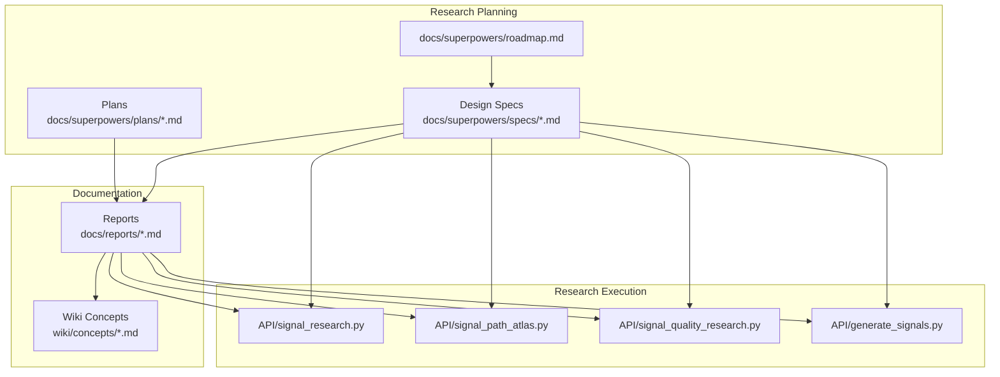
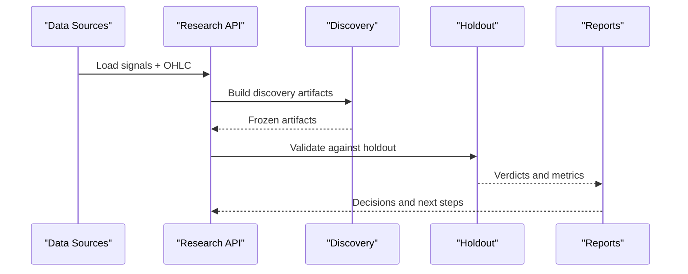
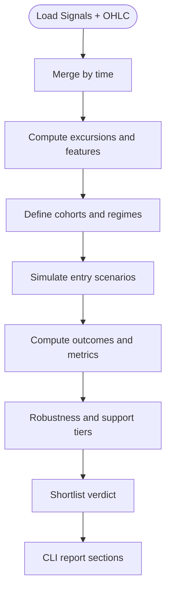
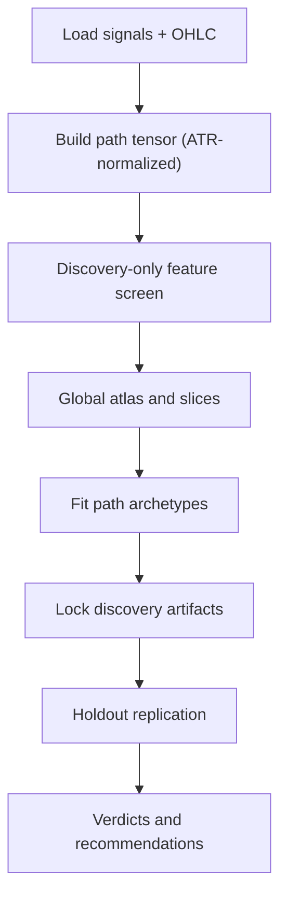
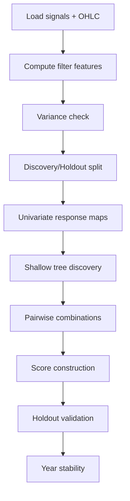
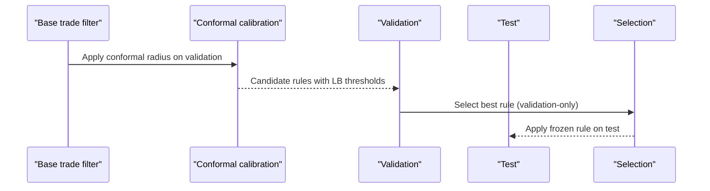
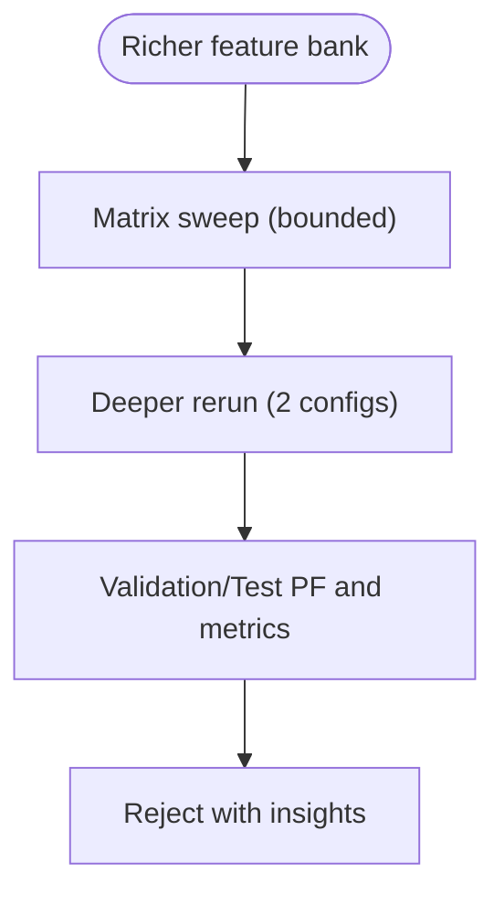
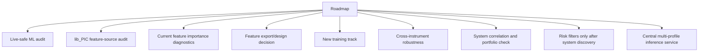
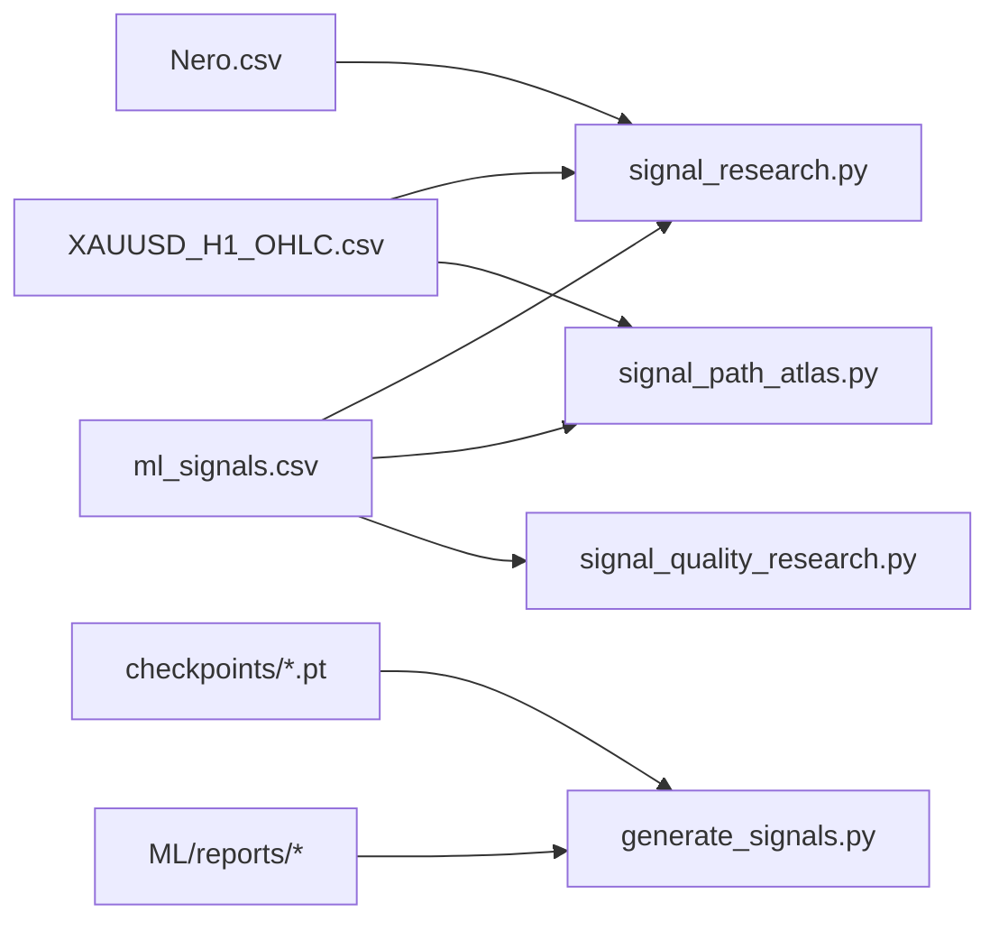

# Research Methodologies

<cite>
**Referenced Files in This Document**
- [README.md](file://README.md)
- [docs/superpowers/roadmap.md](file://docs/superpowers/roadmap.md)
- [docs/superpowers/specs/2026-04-02-signal-research-variant-3-design.md](file://docs/superpowers/specs/2026-04-02-signal-research-variant-3-design.md)
- [docs/reports/2026-04-02-signal-research-variant-3.md](file://docs/reports/2026-04-02-signal-research-variant-3.md)
- [docs/superpowers/specs/2026-04-03-signal-path-atlas-design.md](file://docs/superpowers/specs/2026-04-03-signal-path-atlas-design.md)
- [docs/reports/2026-04-03-signal-path-atlas.md](file://docs/reports/2026-04-03-signal-path-atlas.md)
- [docs/superpowers/specs/2026-04-09-entry-path-conformal-filter-design.md](file://docs/superpowers/specs/2026-04-09-entry-path-conformal-filter-design.md)
- [docs/reports/2026-04-13-quantile-fav-composition.md](file://docs/reports/2026-04-13-quantile-fav-composition.md)
- [docs/superpowers/specs/2026-04-13-fav-3-vs-12-standalone-design.md](file://docs/superpowers/specs/2026-04-13-fav-3-vs-12-standalone-design.md)
- [docs/reports/2026-04-13-fav-3-vs-12-standalone.md](file://docs/reports/2026-04-13-fav-3-vs-12-standalone.md)
- [docs/reports/2026-04-15-track-a-max-out.md](file://docs/reports/2026-04-15-track-a-max-out.md)
- [API/signal_research.py](file://API/signal_research.py)
- [API/signal_path_atlas.py](file://API/signal_path_atlas.py)
- [API/generate_signals.py](file://API/generate_signals.py)
- [API/signal_quality_research.py](file://API/signal_quality_research.py)
- [wiki/concepts/signal-archetypes.md](file://wiki/concepts/signal-archetypes.md)
- [wiki/research/execution-tracks.md](file://wiki/research/execution-tracks.md)
</cite>

## Table of Contents
1. [Introduction](#introduction)
2. [Project Structure](#project-structure)
3. [Core Components](#core-components)
4. [Architecture Overview](#architecture-overview)
5. [Detailed Component Analysis](#detailed-component-analysis)
6. [Dependency Analysis](#dependency-analysis)
7. [Performance Considerations](#performance-considerations)
8. [Troubleshooting Guide](#troubleshooting-guide)
9. [Conclusion](#conclusion)
10. [Appendices](#appendices)

## Introduction
This document presents the research methodologies employed in the SoSimple trading system. It explains systematic approaches to hypothesis generation, experimental design, and result validation, and documents the research planning framework including roadmap development, specification writing, and implementation tracking. Specialized methodologies such as signal archetyping, execution track analysis, and market regime identification are covered alongside guidelines for literature review, competitive analysis, and innovation assessment. The document also provides frameworks for research impact measurement, knowledge transfer, and collaborative research practices, and addresses ethical considerations and regulatory compliance requirements.

## Project Structure
The SoSimple project organizes research through a combination of:
- Research roadmaps and plans that define scope, milestones, and deliverables
- Design specifications that formalize research contracts and evaluation criteria
- Reports that document completed experiments and decisions
- API modules that implement research-grade tools for signal analysis, path atlases, and quality filtering
- ML components that support training, inference, and benchmarking

**Diagram sources**
- [docs/superpowers/roadmap.md:1-157](file://docs/superpowers/roadmap.md#L1-L157)
- [docs/superpowers/specs/2026-04-02-signal-research-variant-3-design.md:1-137](file://docs/superpowers/specs/2026-04-02-signal-research-variant-3-design.md#L1-L137)
- [docs/superpowers/specs/2026-04-03-signal-path-atlas-design.md:1-347](file://docs/superpowers/specs/2026-04-03-signal-path-atlas-design.md#L1-L347)
- [API/signal_research.py:1-800](file://API/signal_research.py#L1-L800)
- [API/signal_path_atlas.py:1-869](file://API/signal_path_atlas.py#L1-L869)
- [API/signal_quality_research.py:1-818](file://API/signal_quality_research.py#L1-L818)
- [API/generate_signals.py:1-745](file://API/generate_signals.py#L1-L745)

**Section sources**
- [README.md:1-25](file://README.md#L1-L25)
- [docs/superpowers/roadmap.md:1-157](file://docs/superpowers/roadmap.md#L1-L157)

## Core Components
This section outlines the core research components and their roles in hypothesis-driven experimentation.

- Signal Research (Variant 2/3/4): Implements comparative entry scenarios, barrier outcomes, and cohort analysis to guide execution decisions without modifying the EA.
- Signal Path Atlas: Builds a reproducible ATR-normalized path atlas with discovery/holdout validation to inform execution strategies.
- Signal Quality Filter Research: Explores multi-horizon prediction features as quality filters, validating with univariate maps, shallow trees, and holdout.
- Conformal Filtering: Adds a simple conformal layer atop existing trade filters to assess reliability without changing selection rules.
- Track A Max-Out: Bounded model sweep to exhaust current feature and model capacity before deciding next steps.

Key implementation references:
- [API/signal_research.py:1-800](file://API/signal_research.py#L1-L800)
- [API/signal_path_atlas.py:1-869](file://API/signal_path_atlas.py#L1-L869)
- [API/signal_quality_research.py:1-818](file://API/signal_quality_research.py#L1-L818)
- [docs/superpowers/specs/2026-04-09-entry-path-conformal-filter-design.md:1-284](file://docs/superpowers/specs/2026-04-09-entry-path-conformal-filter-design.md#L1-L284)
- [docs/reports/2026-04-15-track-a-max-out.md:1-185](file://docs/reports/2026-04-15-track-a-max-out.md#L1-L185)

**Section sources**
- [API/signal_research.py:1-800](file://API/signal_research.py#L1-L800)
- [API/signal_path_atlas.py:1-869](file://API/signal_path_atlas.py#L1-L869)
- [API/signal_quality_research.py:1-818](file://API/signal_quality_research.py#L1-L818)

## Architecture Overview
The research architecture follows a validation-first, reproducible workflow:
- Data ingestion and preprocessing feed research APIs
- Research APIs implement controlled experiments with explicit contracts
- Discovery artifacts are frozen prior to holdout validation
- Decisions are documented in reports and integrated into the roadmap

**Diagram sources**
- [API/signal_research.py:170-210](file://API/signal_research.py#L170-L210)
- [API/signal_path_atlas.py:623-760](file://API/signal_path_atlas.py#L623-L760)
- [docs/superpowers/specs/2026-04-03-signal-path-atlas-design.md:48-62](file://docs/superpowers/specs/2026-04-03-signal-path-atlas-design.md#L48-L62)

## Detailed Component Analysis

### Signal Research (Variant 2/3/4)
This component systematically compares entry scenarios and execution mechanics across cohorts, anchored to real fractal prices and standardized barriers.

**Diagram sources**
- [API/signal_research.py:170-210](file://API/signal_research.py#L170-L210)
- [API/signal_research.py:212-364](file://API/signal_research.py#L212-L364)
- [docs/superpowers/specs/2026-04-02-signal-research-variant-3-design.md:43-137](file://docs/superpowers/specs/2026-04-02-signal-research-variant-3-design.md#L43-L137)

Key design elements:
- Fixed baseline geometry and deadlines
- Raw pic price extraction from Nero fractals
- ATR-normalized pullback and cancel-window scenarios
- Support-tier robustness and negative controls

**Section sources**
- [docs/superpowers/specs/2026-04-02-signal-research-variant-3-design.md:1-137](file://docs/superpowers/specs/2026-04-02-signal-research-variant-3-design.md#L1-L137)
- [docs/reports/2026-04-02-signal-research-variant-3.md:1-191](file://docs/reports/2026-04-02-signal-research-variant-3.md#L1-L191)
- [API/signal_research.py:140-210](file://API/signal_research.py#L140-L210)

### Signal Path Atlas
This component builds a reproducible path atlas to describe post-signal price behavior and validate claims on holdout.

**Diagram sources**
- [API/signal_path_atlas.py:387-460](file://API/signal_path_atlas.py#L387-L460)
- [API/signal_path_atlas.py:164-266](file://API/signal_path_atlas.py#L164-L266)
- [API/signal_path_atlas.py:482-575](file://API/signal_path_atlas.py#L482-L575)
- [docs/superpowers/specs/2026-04-03-signal-path-atlas-design.md:48-62](file://docs/superpowers/specs/2026-04-03-signal-path-atlas-design.md#L48-L62)

Validation protocol:
- Discovery-only construction of bins, archetypes, and explanation rules
- Holdout replication with directional consistency checks
- Minimal selection pressure; no winner ranking by PF

**Section sources**
- [docs/superpowers/specs/2026-04-03-signal-path-atlas-design.md:1-347](file://docs/superpowers/specs/2026-04-03-signal-path-atlas-design.md#L1-L347)
- [docs/reports/2026-04-03-signal-path-atlas.md:1-123](file://docs/reports/2026-04-03-signal-path-atlas.md#L1-L123)
- [API/signal_path_atlas.py:623-760](file://API/signal_path_atlas.py#L623-L760)

### Signal Quality Filter Research
This component explores multi-horizon prediction features as quality filters, using univariate maps, shallow trees, and pairwise combinations.

**Diagram sources**
- [API/signal_quality_research.py:75-116](file://API/signal_quality_research.py#L75-L116)
- [API/signal_quality_research.py:120-169](file://API/signal_quality_research.py#L120-L169)
- [API/signal_quality_research.py:173-199](file://API/signal_quality_research.py#L173-L199)
- [API/signal_quality_research.py:213-242](file://API/signal_quality_research.py#L213-L242)

Validation and safeguards:
- Minimum support thresholds and trivial rule detection
- Negative control checks and year stability assessments
- Direct holdout application of discovered rules

**Section sources**
- [API/signal_quality_research.py:1-818](file://API/signal_quality_research.py#L1-L818)

### Conformal Filtering (Entry Path)
This component adds a simple conformal layer to refine existing trade filters without changing selection logic.

**Diagram sources**
- [docs/superpowers/specs/2026-04-09-entry-path-conformal-filter-design.md:103-188](file://docs/superpowers/specs/2026-04-09-entry-path-conformal-filter-design.md#L103-L188)

Key principles:
- Validation-first selection
- Lower-bound rule only (no per-trade width)
- Protection against false precision and sequential performance degradation

**Section sources**
- [docs/superpowers/specs/2026-04-09-entry-path-conformal-filter-design.md:1-284](file://docs/superpowers/specs/2026-04-09-entry-path-conformal-filter-design.md#L1-L284)

### Track A Max-Out
This component performs a bounded model sweep to exhaust current Track A capacity.

**Diagram sources**
- [docs/reports/2026-04-15-track-a-max-out.md:100-145](file://docs/reports/2026-04-15-track-a-max-out.md#L100-L145)

Outcome:
- Winner remains unchanged; validation PF ceiling below 1.0
- Concludes Track A is near exhaustion under current selection layer

**Section sources**
- [docs/reports/2026-04-15-track-a-max-out.md:1-185](file://docs/reports/2026-04-15-track-a-max-out.md#L1-L185)

### Research Planning Framework
The roadmap defines major research directions, gates, and deliverables. It emphasizes live-safe audits, feature-source audits, and cross-instrument robustness checks before production deployment.

**Diagram sources**
- [docs/superpowers/roadmap.md:15-136](file://docs/superpowers/roadmap.md#L15-L136)

**Section sources**
- [docs/superpowers/roadmap.md:1-157](file://docs/superpowers/roadmap.md#L1-L157)

## Dependency Analysis
Research components depend on shared data and modular APIs. The following diagram shows key dependencies among research modules and their data sources.

**Diagram sources**
- [API/signal_research.py:59-61](file://API/signal_research.py#L59-L61)
- [API/signal_path_atlas.py:784-789](file://API/signal_path_atlas.py#L784-L789)
- [API/signal_quality_research.py:52-53](file://API/signal_quality_research.py#L52-L53)
- [API/generate_signals.py:77-81](file://API/generate_signals.py#L77-L81)

**Section sources**
- [API/signal_research.py:1-800](file://API/signal_research.py#L1-L800)
- [API/signal_path_atlas.py:1-869](file://API/signal_path_atlas.py#L1-L869)
- [API/signal_quality_research.py:1-818](file://API/signal_quality_research.py#L1-L818)
- [API/generate_signals.py:1-745](file://API/generate_signals.py#L1-L745)

## Performance Considerations
- Computational efficiency: Research APIs use vectorized operations and efficient merges to handle large datasets.
- Memory footprint: Path atlas and quality research employ chunked processing and targeted feature selection to manage memory.
- Validation rigor: Holdout-only validation and replication verdicts prevent overfitting and selection bias.
- Scalability: Centralized inference service design reduces operational overhead for multiple runtime profiles.

[No sources needed since this section provides general guidance]

## Troubleshooting Guide
Common issues and resolutions:
- Data alignment problems: Ensure time-based merges and deduplication by time are applied consistently across research modules.
- Discovery/holdout leakage: Freeze artifact boundaries (e.g., ATR buckets) on discovery only; apply them to holdout without re-estimation.
- Small sample sizes: Enforce minimum support thresholds and robustness tiers to avoid spurious findings.
- Negative controls: Always include negative controls and composition checks to distinguish cohort-specific effects from general execution improvements.

**Section sources**
- [API/signal_research.py:140-210](file://API/signal_research.py#L140-L210)
- [API/signal_path_atlas.py:694-760](file://API/signal_path_atlas.py#L694-L760)
- [docs/reports/2026-04-13-quantile-fav-composition.md:1-183](file://docs/reports/2026-04-13-quantile-fav-composition.md#L1-L183)

## Conclusion
The SoSimple research methodology emphasizes reproducibility, validation-first design, and bounded experimentation. Through structured roadmaps, design specs, and research APIs, the project systematically explores signal archetypes, execution tracks, and regime-sensitive strategies while maintaining rigorous controls against leakage and selection bias. The documented frameworks enable transparent knowledge transfer and collaborative research practices, and the results guide decisions toward production-ready systems.

[No sources needed since this section summarizes without analyzing specific files]

## Appendices

### Specialized Methodologies
- Signal Archetypes: Clustering and labeling of post-signal path signatures to guide execution decisions.
  - [wiki/concepts/signal-archetypes.md](file://wiki/concepts/signal-archetypes.md)
- Execution Tracks: Comparative entry scenario analysis to select optimal execution mechanics.
  - [docs/superpowers/specs/2026-04-02-signal-research-variant-3-design.md:43-137](file://docs/superpowers/specs/2026-04-02-signal-research-variant-3-design.md#L43-L137)
  - [docs/reports/2026-04-02-signal-research-variant-3.md:1-191](file://docs/reports/2026-04-02-signal-research-variant-3.md#L1-L191)
- Market Regime Identification: Cohort-based segmentation using ratio and ATR buckets.
  - [API/signal_research.py:69-77](file://API/signal_research.py#L69-L77)
  - [API/signal_path_atlas.py:124-132](file://API/signal_path_atlas.py#L124-L132)

### Research Impact Measurement
- Metrics: PF, AvgPnL, fill rates, and replication verdicts.
- Gates: Validation PF thresholds, negative-year guards, and stability criteria.
- Reporting: Standardized report sections and artifact exports.

**Section sources**
- [docs/reports/2026-04-13-quantile-fav-composition.md:122-156](file://docs/reports/2026-04-13-quantile-fav-composition.md#L122-L156)
- [docs/reports/2026-04-13-fav-3-vs-12-standalone.md:62-81](file://docs/reports/2026-04-13-fav-3-vs-12-standalone.md#L62-L81)
- [API/signal_path_atlas.py:594-621](file://API/signal_path_atlas.py#L594-L621)

### Knowledge Transfer and Collaboration
- Canonical reporting: Use spec-driven designs and report templates to ensure reproducibility.
- Artifact freezing: Lock discovery artifacts before holdout to maintain integrity.
- Cross-team alignment: Align MT4 integration with research exports and central inference services.

**Section sources**
- [docs/superpowers/specs/2026-04-03-signal-path-atlas-design.md:230-241](file://docs/superpowers/specs/2026-04-03-signal-path-atlas-design.md#L230-L241)
- [API/generate_signals.py:342-352](file://API/generate_signals.py#L342-L352)

### Ethical and Regulatory Considerations
- Data integrity: Validate raw feature sourcing (e.g., pic price) and minimize leakage.
- Model safety: Perform live-safe audits and gate releases with explicit verdicts.
- Operational risk: Prefer centralized inference services to reduce manual operational risk.

**Section sources**
- [docs/superpowers/roadmap.md:15-38](file://docs/superpowers/roadmap.md#L15-L38)
- [docs/reports/2026-04-02-signal-research-variant-3.md:72-72](file://docs/reports/2026-04-02-signal-research-variant-3.md#L72-L72)