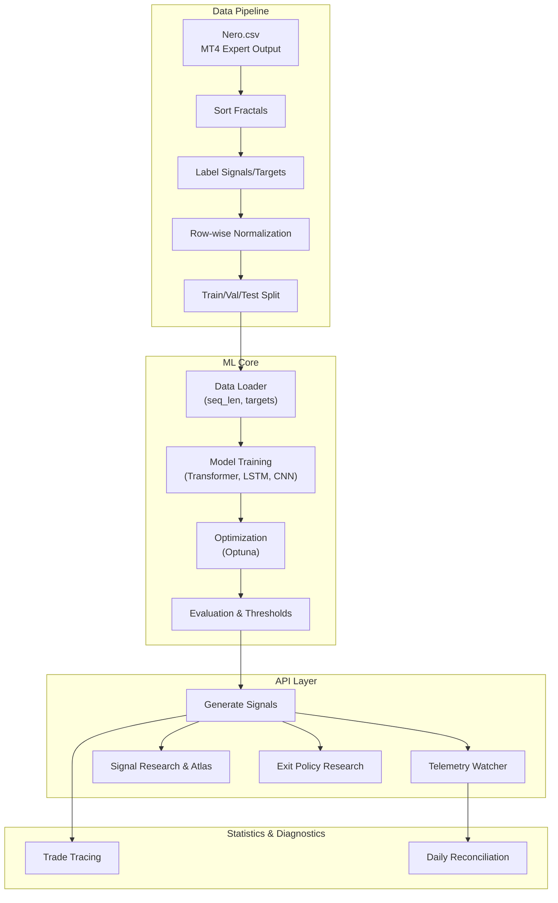
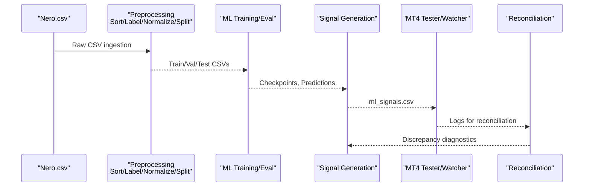
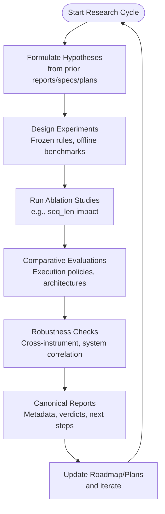
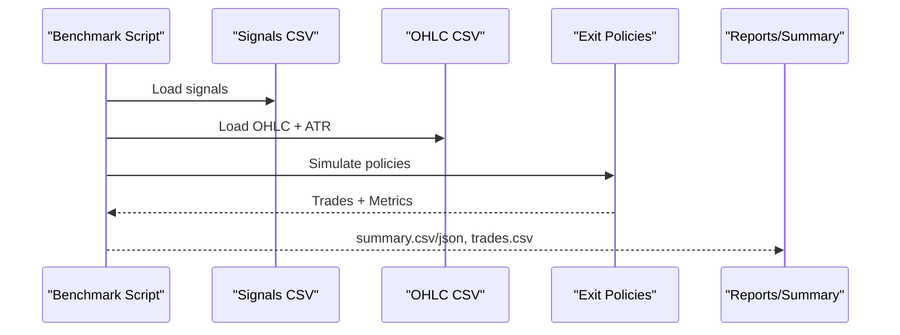
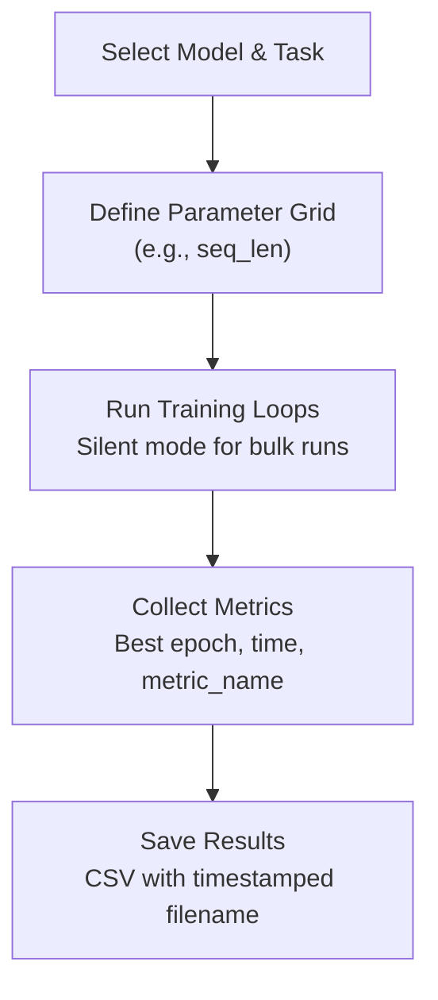
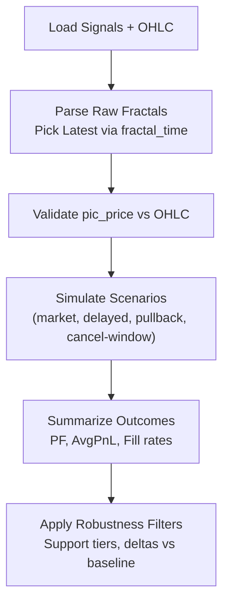
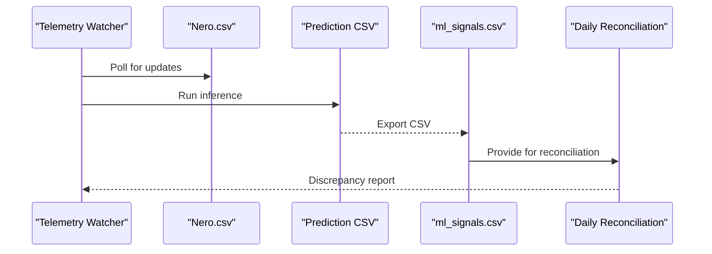
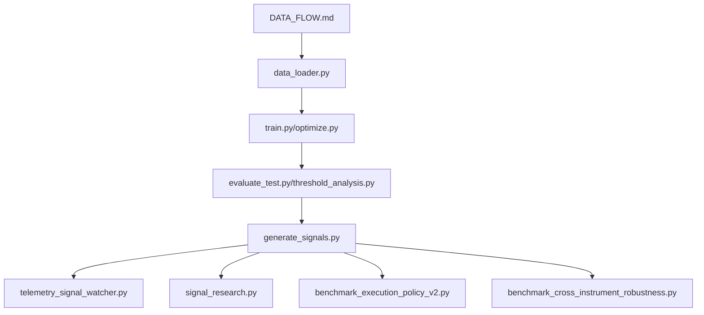

# Research and Development

<cite>
**Referenced Files in This Document**
- [README.md](file://README.md)
- [docs/README.md](file://docs/README.md)
- [docs/DATA_FLOW.md](file://docs/DATA_FLOW.md)
- [docs/ML/ml_leakage_preflight_checklist.md](file://docs/ML/ml_leakage_preflight_checklist.md)
- [docs/superpowers/roadmap.md](file://docs/superpowers/roadmap.md)
- [docs/superpowers/specs/2026-04-02-signal-research-variant-3-design.md](file://docs/superpowers/specs/2026-04-02-signal-research-variant-3-design.md)
- [docs/reports/2026-04-02-signal-research-variant-3.md](file://docs/reports/2026-04-02-signal-research-variant-3.md)
- [ML/README.md](file://ML/README.md)
- [ML/experiment_logger.py](file://ML/experiment_logger.py)
- [ML/ablation_study.py](file://ML/ablation_study.py)
- [ML/benchmark_entry_path_v1_frequency.py](file://ML/benchmark_entry_path_v1_frequency.py)
- [ML/benchmark_execution_policy_v2.py](file://ML/benchmark_execution_policy_v2.py)
- [ML/benchmark_cross_instrument_robustness.py](file://ML/benchmark_cross_instrument_robustness.py)
- [API/README.md](file://API/README.md)
- [API/generate_signals.py](file://API/generate_signals.py)
- [API/telemetry_signal_watcher.py](file://API/telemetry_signal_watcher.py)
- [API/signal_path_atlas.py](file://API/signal_path_atlas.py)
- [API/exit_policy_research.py](file://API/exit_policy_research.py)
</cite>

## Table of Contents
1. [Introduction](#introduction)
2. [Project Structure](#project-structure)
3. [Core Components](#core-components)
4. [Architecture Overview](#architecture-overview)
5. [Detailed Component Analysis](#detailed-component-analysis)
6. [Dependency Analysis](#dependency-analysis)
7. [Performance Considerations](#performance-considerations)
8. [Troubleshooting Guide](#troubleshooting-guide)
9. [Conclusion](#conclusion)
10. [Appendices](#appendices)

## Introduction
This document provides comprehensive research and development guidance for the SoSimple trading system. It explains the experimental framework, research methodologies, and innovation tracking processes used to develop and validate ML-driven trading signals and execution policies. It covers the research pipeline from hypothesis formulation to result documentation, including robustness studies, ablation analyses, and comparative evaluations. It also outlines knowledge management, collaborative research practices, and documentation standards aligned with the project’s data flow and ML leakage prevention guidelines.

## Project Structure
SoSimple organizes research and development across modular domains:
- Data and preprocessing pipeline: ingestion, sorting, labeling, normalization, and train/validation/test split
- Machine learning: training, optimization, evaluation, and reporting
- API: signal generation, telemetry, and research tools
- Statistics and diagnostics: reconciliation, path atlases, and trade tracing
- Documentation: roadmap, plans, specs, and canonical reports

**Diagram sources**
- [docs/DATA_FLOW.md:1-562](file://docs/DATA_FLOW.md#L1-L562)
- [ML/README.md:1-183](file://ML/README.md#L1-L183)
- [API/README.md:1-108](file://API/README.md#L1-L108)

**Section sources**
- [README.md:1-25](file://README.md#L1-L25)
- [docs/README.md:1-24](file://docs/README.md#L1-L24)
- [docs/DATA_FLOW.md:1-562](file://docs/DATA_FLOW.md#L1-L562)
- [ML/README.md:1-183](file://ML/README.md#L1-L183)
- [API/README.md:1-108](file://API/README.md#L1-L108)

## Core Components
- Data flow and leakage prevention: defines the canonical pipeline and strict invariants to avoid future-looking bias
- ML experimentation: unified logging, ablation studies, benchmark suites, and evaluation scripts
- API research tools: signal generation, telemetry, path atlases, and exit policy research
- Documentation framework: roadmap, plans/specs, and canonical reports for knowledge retention

Key capabilities:
- Validation-first research with frozen rules and offline benchmarks
- Cross-instrument robustness and system correlation checks
- Execution policy scanning and telemetry calibration
- Live-safe ML audit readiness and feature contract verification

**Section sources**
- [docs/DATA_FLOW.md:1-562](file://docs/DATA_FLOW.md#L1-L562)
- [docs/ML/ml_leakage_preflight_checklist.md:1-145](file://docs/ML/ml_leakage_preflight_checklist.md#L1-L145)
- [ML/experiment_logger.py:1-475](file://ML/experiment_logger.py#L1-L475)
- [ML/ablation_study.py:1-129](file://ML/ablation_study.py#L1-L129)
- [ML/benchmark_execution_policy_v2.py:1-424](file://ML/benchmark_execution_policy_v2.py#L1-L424)
- [ML/benchmark_cross_instrument_robustness.py:1-342](file://ML/benchmark_cross_instrument_robustness.py#L1-L342)
- [API/README.md:1-108](file://API/README.md#L1-L108)

## Architecture Overview
The research architecture integrates offline ML experimentation with online telemetry and MT4 parity checks. It enforces leakage prevention and standardized reporting to ensure reproducibility and trust in results.

**Diagram sources**
- [docs/DATA_FLOW.md:1-562](file://docs/DATA_FLOW.md#L1-L562)
- [API/generate_signals.py](file://API/generate_signals.py)
- [API/telemetry_signal_watcher.py](file://API/telemetry_signal_watcher.py)
- [ML/benchmark_execution_policy_v2.py:1-424](file://ML/benchmark_execution_policy_v2.py#L1-L424)

## Detailed Component Analysis

### Research Pipeline: Hypothesis to Documentation
The SoSimple research pipeline follows a structured cadence:
- Formulate hypotheses grounded in prior research (e.g., entry-scenario variants)
- Design experiments with frozen rules and offline benchmarks
- Conduct ablation and comparative evaluations
- Document results in canonical reports with metadata and related materials
- Iterate roadmap and plans based on findings

**Diagram sources**
- [docs/superpowers/roadmap.md:1-157](file://docs/superpowers/roadmap.md#L1-L157)
- [docs/superpowers/specs/2026-04-02-signal-research-variant-3-design.md:1-137](file://docs/superpowers/specs/2026-04-02-signal-research-variant-3-design.md#L1-L137)
- [docs/reports/2026-04-02-signal-research-variant-3.md:1-191](file://docs/reports/2026-04-02-signal-research-variant-3.md#L1-L191)
- [ML/ablation_study.py:1-129](file://ML/ablation_study.py#L1-L129)
- [ML/benchmark_execution_policy_v2.py:1-424](file://ML/benchmark_execution_policy_v2.py#L1-L424)
- [ML/benchmark_cross_instrument_robustness.py:1-342](file://ML/benchmark_cross_instrument_robustness.py#L1-L342)

**Section sources**
- [docs/superpowers/roadmap.md:1-157](file://docs/superpowers/roadmap.md#L1-L157)
- [docs/superpowers/specs/2026-04-02-signal-research-variant-3-design.md:1-137](file://docs/superpowers/specs/2026-04-02-signal-research-variant-3-design.md#L1-L137)
- [docs/reports/2026-04-02-signal-research-variant-3.md:1-191](file://docs/reports/2026-04-02-signal-research-variant-3.md#L1-L191)

### Experimental Framework: Validation-First and Offline Benchmarks
Validation-first research ensures offline verification before any MT4 or online deployment:
- Frozen rules and pre-selected thresholds prevent post-hoc selection bias
- Offline benchmarks compare execution policies, candidate selection strategies, and cross-instrument transfer
- Telemetry calibration and daily reconciliation validate parity between Python exports and MT4 logs

**Diagram sources**
- [ML/benchmark_execution_policy_v2.py:1-424](file://ML/benchmark_execution_policy_v2.py#L1-L424)
- [ML/benchmark_cross_instrument_robustness.py:1-342](file://ML/benchmark_cross_instrument_robustness.py#L1-L342)

**Section sources**
- [ML/benchmark_execution_policy_v2.py:1-424](file://ML/benchmark_execution_policy_v2.py#L1-L424)
- [ML/benchmark_cross_instrument_robustness.py:1-342](file://ML/benchmark_cross_instrument_robustness.py#L1-L342)

### Ablation Studies and Comparative Evaluations
Ablation studies isolate the impact of key factors (e.g., sequence length) while comparative evaluations assess alternatives (e.g., architectures, execution policies).

**Diagram sources**
- [ML/ablation_study.py:1-129](file://ML/ablation_study.py#L1-L129)

**Section sources**
- [ML/ablation_study.py:1-129](file://ML/ablation_study.py#L1-L129)
- [ML/README.md:1-183](file://ML/README.md#L1-L183)

### Signal Research and Execution Scenarios
Signal research extends beyond static thresholds to dynamic entry scenarios, validating robustness and practical viability under consistent geometric constraints.

**Diagram sources**
- [docs/superpowers/specs/2026-04-02-signal-research-variant-3-design.md:1-137](file://docs/superpowers/specs/2026-04-02-signal-research-variant-3-design.md#L1-L137)
- [docs/reports/2026-04-02-signal-research-variant-3.md:1-191](file://docs/reports/2026-04-02-signal-research-variant-3.md#L1-L191)

**Section sources**
- [docs/superpowers/specs/2026-04-02-signal-research-variant-3-design.md:1-137](file://docs/superpowers/specs/2026-04-02-signal-research-variant-3-design.md#L1-L137)
- [docs/reports/2026-04-02-signal-research-variant-3.md:1-191](file://docs/reports/2026-04-02-signal-research-variant-3.md#L1-L191)

### Telemetry, Parity, and Reconciliation
Telemetry enables continuous monitoring of ML signal exports against MT4 execution logs, ensuring parity and detecting drift early.

**Diagram sources**
- [API/telemetry_signal_watcher.py](file://API/telemetry_signal_watcher.py)
- [API/generate_signals.py](file://API/generate_signals.py)
- [ML/benchmark_execution_policy_v2.py:1-424](file://ML/benchmark_execution_policy_v2.py#L1-L424)

**Section sources**
- [API/README.md:1-108](file://API/README.md#L1-L108)
- [API/telemetry_signal_watcher.py](file://API/telemetry_signal_watcher.py)
- [API/generate_signals.py](file://API/generate_signals.py)

### Knowledge Management and Documentation Standards
SoSimple maintains a canonical documentation system:
- Roadmap drives priorities and tracks progress
- Plans/specs define executable tasks and acceptance criteria
- Reports capture completed stages with metadata and related materials
- Data flow and leakage checklist enforce integrity across experiments

**Diagram sources**
- [docs/superpowers/roadmap.md:1-157](file://docs/superpowers/roadmap.md#L1-L157)
- [docs/README.md:1-24](file://docs/README.md#L1-L24)
- [docs/DATA_FLOW.md:1-562](file://docs/DATA_FLOW.md#L1-L562)
- [ML/experiment_logger.py:1-475](file://ML/experiment_logger.py#L1-L475)

**Section sources**
- [docs/README.md:1-24](file://docs/README.md#L1-L24)
- [docs/DATA_FLOW.md:1-562](file://docs/DATA_FLOW.md#L1-L562)
- [docs/ML/ml_leakage_preflight_checklist.md:1-145](file://docs/ML/ml_leakage_preflight_checklist.md#L1-L145)
- [ML/experiment_logger.py:1-475](file://ML/experiment_logger.py#L1-L475)

## Dependency Analysis
The research stack exhibits clear separation of concerns with explicit dependencies:
- Preprocessing depends on MT4 expert outputs and adheres to strict leakage invariants
- ML training depends on labeled CSVs and standardized loaders
- API tools depend on ML checkpoints and frozen rules
- Diagnostics depend on OHLC and MT4 logs for reconciliation

**Diagram sources**
- [docs/DATA_FLOW.md:1-562](file://docs/DATA_FLOW.md#L1-L562)
- [ML/README.md:1-183](file://ML/README.md#L1-L183)
- [API/README.md:1-108](file://API/README.md#L1-L108)

**Section sources**
- [docs/DATA_FLOW.md:1-562](file://docs/DATA_FLOW.md#L1-L562)
- [ML/README.md:1-183](file://ML/README.md#L1-L183)
- [API/README.md:1-108](file://API/README.md#L1-L108)

## Performance Considerations
- Prefer offline benchmarks to reduce MT4 overhead and accelerate iteration
- Use frozen rules and pre-selected thresholds to avoid selection bias
- Apply robustness filters (support tiers, deltas vs baseline) to avoid overfitting to small samples
- Maintain consistent feature contracts across training and online inference to prevent silent regressions
- Leverage ablation studies to prune unnecessary complexity and reduce training time

[No sources needed since this section provides general guidance]

## Troubleshooting Guide
Common pitfalls and remedies:
- Data leakage risks: run the ML leakage preflight checklist before any test/MT4/online run
- Inconsistent feature contracts: verify input feature names, normalization, and ATR contract
- Rule selection bias: ensure thresholds and rules are fixed before test/validation
- Parity issues: reconcile telemetry exports with MT4 logs and validate signal counts and unique times
- Robustness failures: apply support-tier filters and year-split stability checks

**Section sources**
- [docs/ML/ml_leakage_preflight_checklist.md:1-145](file://docs/ML/ml_leakage_preflight_checklist.md#L1-L145)
- [docs/DATA_FLOW.md:1-562](file://docs/DATA_FLOW.md#L1-L562)
- [API/README.md:1-108](file://API/README.md#L1-L108)

## Conclusion
SoSimple’s research and development framework emphasizes validation-first experimentation, rigorous leakage prevention, and standardized documentation. By combining offline benchmarks, ablation studies, comparative evaluations, and robustness checks, the project sustains reproducible progress toward deployable trading systems. The roadmap, plans/specs, and canonical reports provide a collaborative foundation for iterative innovation.

[No sources needed since this section summarizes without analyzing specific files]

## Appendices

### Research Protocols and Procedures
- Hypothesis formulation: ground on prior reports/specs/plans; define measurable outcomes
- Experiment design: fix rules and thresholds; use offline benchmarks; apply robustness filters
- Data collection: adhere to data flow and leakage checklist; maintain consistent contracts
- Result interpretation: compare PF deltas, support tiers, and year-split stability; document metadata and related materials
- Knowledge management: update roadmap/plans/specs/reports; preserve experiment logs and artifacts

**Section sources**
- [docs/superpowers/roadmap.md:1-157](file://docs/superpowers/roadmap.md#L1-L157)
- [docs/superpowers/specs/2026-04-02-signal-research-variant-3-design.md:1-137](file://docs/superpowers/specs/2026-04-02-signal-research-variant-3-design.md#L1-L137)
- [docs/reports/2026-04-02-signal-research-variant-3.md:1-191](file://docs/reports/2026-04-02-signal-research-variant-3.md#L1-L191)
- [docs/DATA_FLOW.md:1-562](file://docs/DATA_FLOW.md#L1-L562)
- [ML/experiment_logger.py:1-475](file://ML/experiment_logger.py#L1-L475)