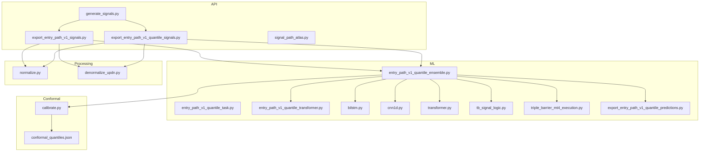
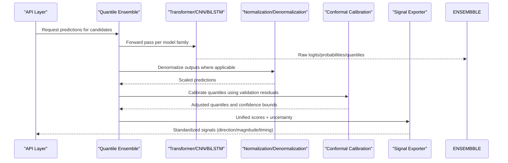
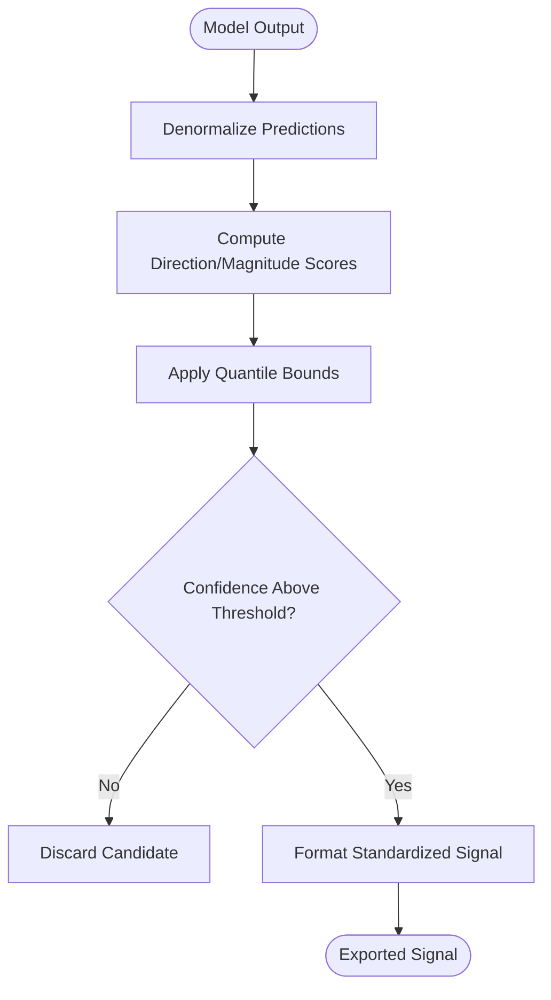
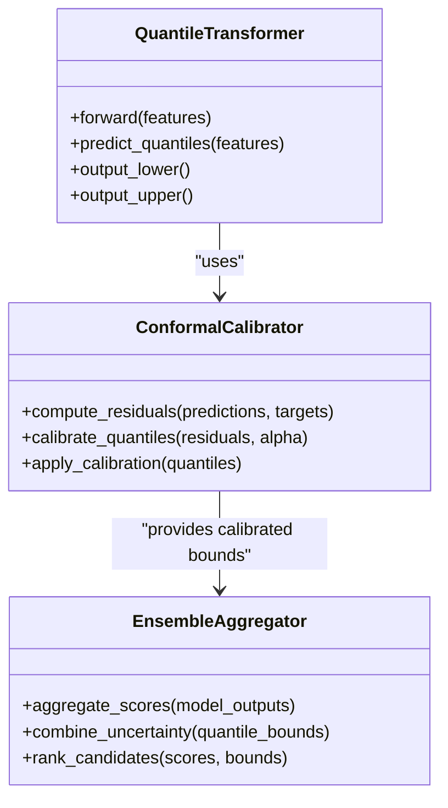
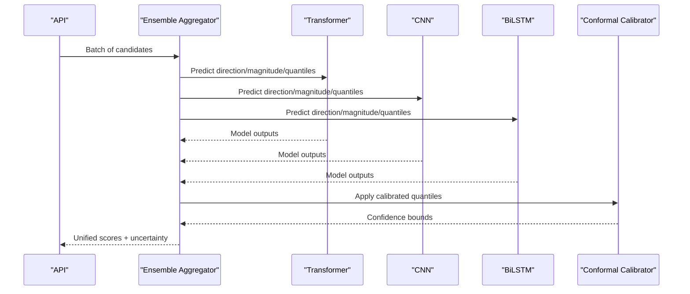
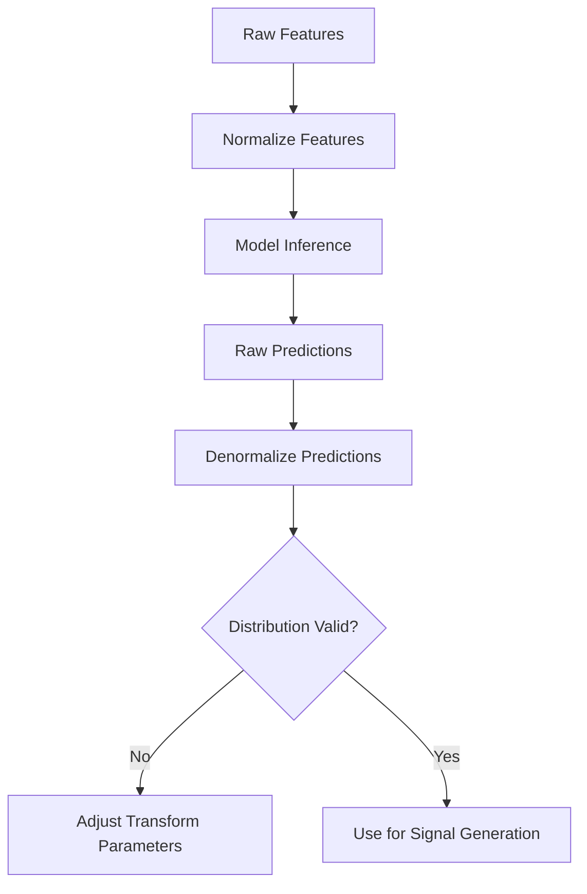
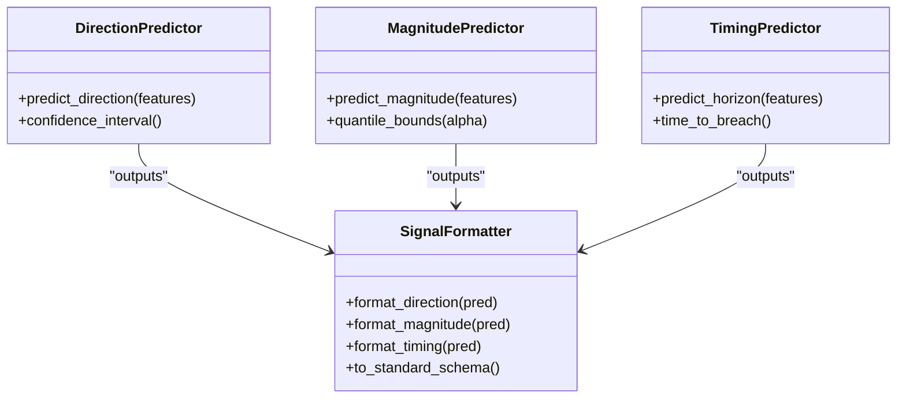
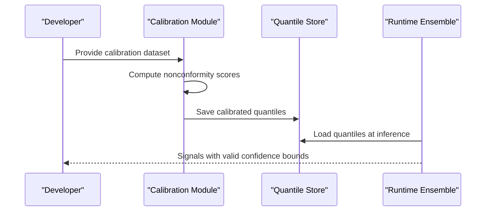
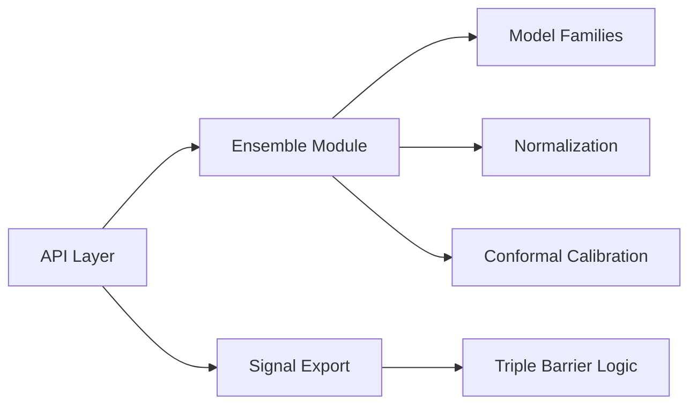

# Prediction Processing

<cite>
**Referenced Files in This Document**
- [export_entry_path_v1_quantile_signals.py](file://API/export_entry_path_v1_quantile_signals.py)
- [export_entry_path_v1_signals.py](file://API/export_entry_path_v1_signals.py)
- [generate_signals.py](file://API/generate_signals.py)
- [signal_path_atlas.py](file://API/signal_path_atlas.py)
- [calibrate.py](file://ML/conformal/calibrate.py)
- [conformal_quantiles.json](file://ML/conformal/conformal_quantiles.json)
- [entry_path_v1_quantile_ensemble.py](file://ML/entry_path_v1_quantile_ensemble.py)
- [entry_path_v1_quantile_task.py](file://ML/entry_path_v1_quantile_task.py)
- [entry_path_v1_quantile_transformer.py](file://ML/models/entry_path_v1_quantile_transformer.py)
- [bilstm.py](file://ML/models/bilstm.py)
- [cnn1d.py](file://ML/models/cnn1d.py)
- [transformer.py](file://ML/models/transformer.py)
- [normalize.py](file://processing/normalize.py)
- [denormalize_updn.py](file://processing/denormalize_updn.py)
- [tb_signal_logic.py](file://ML/tb_signal_logic.py)
- [triple_barrier_mt4_execution.py](file://ML/triple_barrier_mt4_execution.py)
- [export_entry_path_predictions.py](file://ML/export_entry_path_predictions.py)
- [export_entry_path_v1_quantile_predictions.py](file://ML/export_entry_path_v1_quantile_predictions.py)
</cite>

## Table of Contents
1. [Introduction](#introduction)
2. [Project Structure](#project-structure)
3. [Core Components](#core-components)
4. [Architecture Overview](#architecture-overview)
5. [Detailed Component Analysis](#detailed-component-analysis)
6. [Dependency Analysis](#dependency-analysis)
7. [Performance Considerations](#performance-considerations)
8. [Troubleshooting Guide](#troubleshooting-guide)
9. [Conclusion](#conclusion)

## Introduction
This document explains how raw model predictions are processed, normalized, and transformed into actionable trading signals within the SoSimple signal generation pipeline. It focuses on:
- Entry path methodology for converting neural network outputs into trading signals
- Quantile-based uncertainty estimation using conformal prediction
- Ensemble methods combining multiple model families (transformers, CNNs, BiLSTMs) into unified signal scores
- Handling different prediction types (direction, magnitude, timing) and conversion to standardized signal formats
- End-to-end workflows from model inference through normalization, calibration, and final signal export

## Project Structure
The prediction processing spans three main areas:
- API layer for exporting and generating signals
- ML layer for models, tasks, ensembles, and conformal calibration
- Processing utilities for normalization and denormalization

**Diagram sources**
- [generate_signals.py](file://API/generate_signals.py)
- [export_entry_path_v1_signals.py](file://API/export_entry_path_v1_signals.py)
- [export_entry_path_v1_quantile_signals.py](file://API/export_entry_path_v1_quantile_signals.py)
- [signal_path_atlas.py](file://API/signal_path_atlas.py)
- [entry_path_v1_quantile_ensemble.py](file://ML/entry_path_v1_quantile_ensemble.py)
- [entry_path_v1_quantile_task.py](file://ML/entry_path_v1_quantile_task.py)
- [entry_path_v1_quantile_transformer.py](file://ML/models/entry_path_v1_quantile_transformer.py)
- [bilstm.py](file://ML/models/bilstm.py)
- [cnn1d.py](file://ML/models/cnn1d.py)
- [transformer.py](file://ML/models/transformer.py)
- [tb_signal_logic.py](file://ML/tb_signal_logic.py)
- [triple_barrier_mt4_execution.py](file://ML/triple_barrier_mt4_execution.py)
- [export_entry_path_v1_quantile_predictions.py](file://ML/export_entry_path_v1_quantile_predictions.py)
- [normalize.py](file://processing/normalize.py)
- [denormalize_updn.py](file://processing/denormalize_updn.py)
- [calibrate.py](file://ML/conformal/calibrate.py)
- [conformal_quantiles.json](file://ML/conformal/conformal_quantiles.json)

**Section sources**
- [generate_signals.py](file://API/generate_signals.py)
- [export_entry_path_v1_signals.py](file://API/export_entry_path_v1_signals.py)
- [export_entry_path_v1_quantile_signals.py](file://API/export_entry_path_v1_quantile_signals.py)
- [entry_path_v1_quantile_ensemble.py](file://ML/entry_path_v1_quantile_ensemble.py)
- [normalize.py](file://processing/normalize.py)
- [denormalize_updn.py](file://processing/denormalize_updn.py)
- [calibrate.py](file://ML/conformal/calibrate.py)
- [conformal_quantiles.json](file://ML/conformal/conformal_quantiles.json)

## Core Components
- Signal exporters: Convert model outputs into standardized signal formats for downstream systems
- Ensemble module: Aggregates predictions across transformer, CNN, and BiLSTM models with quantile-aware scoring
- Conformal calibration: Produces confidence intervals and probability distributions via quantile regression
- Normalization utilities: Ensure consistent scaling and denormalization for stable inference and interpretation
- Triple barrier logic: Translates directional and magnitude predictions into entry/exit/timing decisions

Key responsibilities:
- Normalize features before inference and denormalize outputs to meaningful scales
- Combine multiple model heads or families into a single score per candidate
- Apply quantile thresholds to filter low-confidence predictions
- Map predictions to direction, magnitude, and timing attributes required by execution

**Section sources**
- [export_entry_path_v1_signals.py](file://API/export_entry_path_v1_signals.py)
- [export_entry_path_v1_quantile_signals.py](file://API/export_entry_path_v1_quantile_signals.py)
- [entry_path_v1_quantile_ensemble.py](file://ML/entry_path_v1_quantile_ensemble.py)
- [normalize.py](file://processing/normalize.py)
- [denormalize_updn.py](file://processing/denormalize_updn.py)
- [tb_signal_logic.py](file://ML/tb_signal_logic.py)

## Architecture Overview
The prediction processing pipeline follows a clear sequence:
1. Raw model predictions are produced by ensemble members (transformer, CNN, BiLSTM).
2. Predictions are normalized/denormalized as needed for consistency and interpretability.
3. Conformal calibration adjusts quantiles to produce valid confidence intervals.
4. Ensemble aggregation combines scores and uncertainties into unified signal metrics.
5. Signal exporters convert these metrics into standardized formats for MT4/MT5 consumption.

**Diagram sources**
- [export_entry_path_v1_quantile_signals.py](file://API/export_entry_path_v1_quantile_signals.py)
- [entry_path_v1_quantile_ensemble.py](file://ML/entry_path_v1_quantile_ensemble.py)
- [entry_path_v1_quantile_transformer.py](file://ML/models/entry_path_v1_quantile_transformer.py)
- [cnn1d.py](file://ML/models/cnn1d.py)
- [bilstm.py](file://ML/models/bilstm.py)
- [normalize.py](file://processing/normalize.py)
- [denormalize_updn.py](file://processing/denormalize_updn.py)
- [calibrate.py](file://ML/conformal/calibrate.py)

## Detailed Component Analysis

### Entry Path Methodology: From Neural Outputs to Trading Signals
- The entry path converts model outputs into actionable signals by:
  - Estimating direction (up/down), magnitude (expected move), and timing (horizon)
  - Applying thresholds based on predicted probabilities and quantile bounds
  - Mapping to standardized fields consumed by execution engines

**Diagram sources**
- [export_entry_path_v1_signals.py](file://API/export_entry_path_v1_signals.py)
- [export_entry_path_v1_quantile_signals.py](file://API/export_entry_path_v1_quantile_signals.py)
- [tb_signal_logic.py](file://ML/tb_signal_logic.py)

**Section sources**
- [export_entry_path_v1_signals.py](file://API/export_entry_path_v1_signals.py)
- [export_entry_path_v1_quantile_signals.py](file://API/export_entry_path_v1_quantile_signals.py)
- [tb_signal_logic.py](file://ML/tb_signal_logic.py)

### Quantile-Based Uncertainty Estimation and Conformal Prediction
- Quantile regression provides predictive intervals that capture uncertainty
- Conformal calibration ensures coverage guarantees by adjusting quantiles against validation residuals
- The workflow:
  - Train quantile models to output lower/upper bounds
  - Compute nonconformity scores on a calibration set
  - Derive calibrated quantiles stored for runtime use

**Diagram sources**
- [entry_path_v1_quantile_transformer.py](file://ML/models/entry_path_v1_quantile_transformer.py)
- [calibrate.py](file://ML/conformal/calibrate.py)
- [conformal_quantiles.json](file://ML/conformal/conformal_quantiles.json)
- [entry_path_v1_quantile_ensemble.py](file://ML/entry_path_v1_quantile_ensemble.py)

**Section sources**
- [entry_path_v1_quantile_transformer.py](file://ML/models/entry_path_v1_quantile_transformer.py)
- [calibrate.py](file://ML/conformal/calibrate.py)
- [conformal_quantiles.json](file://ML/conformal/conformal_quantiles.json)
- [entry_path_v1_quantile_ensemble.py](file://ML/entry_path_v1_quantile_ensemble.py)

### Ensemble Methods: Combining Transformers, CNNs, and BiLSTMs
- Multiple model families contribute complementary signals:
  - Transformer captures long-range dependencies and attention patterns
  - CNN extracts local temporal features
  - BiLSTM models bidirectional sequences for robust context
- Aggregation strategies:
  - Weighted averaging of scores based on validation performance
  - Quantile-aware fusion to preserve uncertainty information
  - Ranking and selection of top candidates for signal generation

**Diagram sources**
- [entry_path_v1_quantile_ensemble.py](file://ML/entry_path_v1_quantile_ensemble.py)
- [entry_path_v1_quantile_transformer.py](file://ML/models/entry_path_v1_quantile_transformer.py)
- [cnn1d.py](file://ML/models/cnn1d.py)
- [bilstm.py](file://ML/models/bilstm.py)
- [calibrate.py](file://ML/conformal/calibrate.py)

**Section sources**
- [entry_path_v1_quantile_ensemble.py](file://ML/entry_path_v1_quantile_ensemble.py)
- [entry_path_v1_quantile_transformer.py](file://ML/models/entry_path_v1_quantile_transformer.py)
- [cnn1d.py](file://ML/models/cnn1d.py)
- [bilstm.py](file://ML/models/bilstm.py)
- [calibrate.py](file://ML/conformal/calibrate.py)

### Prediction Preprocessing Workflows and Normalization Techniques
- Feature normalization ensures stable training and inference across time series
- Denormalization maps model outputs back to interpretable scales (e.g., price moves, probabilities)
- Typical steps:
  - Scale features using rolling statistics or global transforms
  - Apply inverse transforms to predictions for decision-making
  - Validate distributional properties post-d normalization

**Diagram sources**
- [normalize.py](file://processing/normalize.py)
- [denormalize_updn.py](file://processing/denormalize_updn.py)

**Section sources**
- [normalize.py](file://processing/normalize.py)
- [denormalize_updn.py](file://processing/denormalize_updn.py)

### Handling Different Prediction Types: Direction, Magnitude, Timing
- Direction: Binary or probabilistic classification of up/down movement
- Magnitude: Regression or quantile estimates of expected price change
- Timing: Horizon-specific predictions (e.g., next bar, multi-bar windows)
- Conversion to standardized signals involves:
  - Thresholding probabilities and quantile bounds
  - Aligning horizons with execution constraints
  - Formatting into consistent schemas for MT4/MT5 consumption

**Diagram sources**
- [tb_signal_logic.py](file://ML/tb_signal_logic.py)
- [triple_barrier_mt4_execution.py](file://ML/triple_barrier_mt4_execution.py)
- [export_entry_path_v1_signals.py](file://API/export_entry_path_v1_signals.py)

**Section sources**
- [tb_signal_logic.py](file://ML/tb_signal_logic.py)
- [triple_barrier_mt4_execution.py](file://ML/triple_barrier_mt4_execution.py)
- [export_entry_path_v1_signals.py](file://API/export_entry_path_v1_signals.py)

### Ensemble Weighting Strategies
- Weights can be derived from:
  - Validation performance metrics (AUC, RMSE, quantile loss)
  - Dynamic recalibration based on recent performance
  - Diversity measures to reduce correlated errors
- Implementation typically involves:
  - Computing per-model scores on holdout data
  - Normalizing weights to sum to one
  - Applying weighted average to combine predictions

**Section sources**
- [entry_path_v1_quantile_ensemble.py](file://ML/entry_path_v1_quantile_ensemble.py)

### Conformal Prediction Integration
- Conformal prediction ensures statistically valid confidence intervals
- Workflow:
  - Split data into training and calibration sets
  - Compute nonconformity scores on calibration set
  - Determine quantile thresholds for desired coverage level
  - Store calibrated quantiles for runtime inference

**Diagram sources**
- [calibrate.py](file://ML/conformal/calibrate.py)
- [conformal_quantiles.json](file://ML/conformal/conformal_quantiles.json)
- [entry_path_v1_quantile_ensemble.py](file://ML/entry_path_v1_quantile_ensemble.py)

**Section sources**
- [calibrate.py](file://ML/conformal/calibrate.py)
- [conformal_quantiles.json](file://ML/conformal/conformal_quantiles.json)
- [entry_path_v1_quantile_ensemble.py](file://ML/entry_path_v1_quantile_ensemble.py)

## Dependency Analysis
The prediction processing system exhibits clear separation of concerns:
- API layer depends on ML modules for inference and signal generation
- ML modules depend on processing utilities for normalization
- Conformal calibration is independent but used by ensemble aggregation
- Signal exporters depend on triple barrier logic for execution-ready formats

**Diagram sources**
- [generate_signals.py](file://API/generate_signals.py)
- [export_entry_path_v1_signals.py](file://API/export_entry_path_v1_signals.py)
- [export_entry_path_v1_quantile_signals.py](file://API/export_entry_path_v1_quantile_signals.py)
- [entry_path_v1_quantile_ensemble.py](file://ML/entry_path_v1_quantile_ensemble.py)
- [normalize.py](file://processing/normalize.py)
- [calibrate.py](file://ML/conformal/calibrate.py)
- [tb_signal_logic.py](file://ML/tb_signal_logic.py)

**Section sources**
- [generate_signals.py](file://API/generate_signals.py)
- [export_entry_path_v1_signals.py](file://API/export_entry_path_v1_signals.py)
- [export_entry_path_v1_quantile_signals.py](file://API/export_entry_path_v1_quantile_signals.py)
- [entry_path_v1_quantile_ensemble.py](file://ML/entry_path_v1_quantile_ensemble.py)
- [normalize.py](file://processing/normalize.py)
- [calibrate.py](file://ML/conformal/calibrate.py)
- [tb_signal_logic.py](file://ML/tb_signal_logic.py)

## Performance Considerations
- Batch processing of candidates improves throughput during inference
- Caching normalized features reduces redundant computation
- Efficient quantile lookup during calibration avoids repeated calculations
- Parallel model inference across CPU/GPU resources accelerates ensemble scoring
- Memory management for large time series datasets requires careful chunking

[No sources needed since this section provides general guidance]

## Troubleshooting Guide
Common issues and resolutions:
- Invalid confidence intervals: Verify calibration dataset quality and quantile computation
- Poor signal quality: Check feature normalization parameters and denormalization correctness
- Ensemble instability: Review weighting strategy and model diversity metrics
- Execution failures: Validate signal schema compliance and horizon alignment

Diagnostic tools:
- Prediction export utilities for inspecting intermediate outputs
- Signal tracer for tracking decision paths
- Statistical reports for monitoring performance drift

**Section sources**
- [export_entry_path_predictions.py](file://ML/export_entry_path_predictions.py)
- [export_entry_path_v1_quantile_predictions.py](file://ML/export_entry_path_v1_quantile_predictions.py)
- [signal_path_atlas.py](file://API/signal_path_atlas.py)

## Conclusion
The SoSimple prediction processing pipeline provides a robust framework for converting neural network outputs into actionable trading signals. Through quantile-based uncertainty estimation, conformal prediction integration, and ensemble methods combining multiple model families, the system delivers reliable signals with valid confidence bounds. The modular architecture enables flexibility in model selection, normalization techniques, and signal formatting while maintaining statistical rigor and operational efficiency.

[No sources needed since this section summarizes without analyzing specific files]