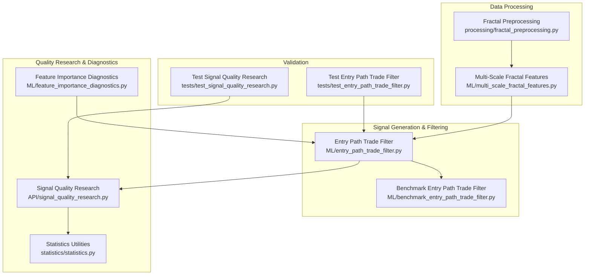
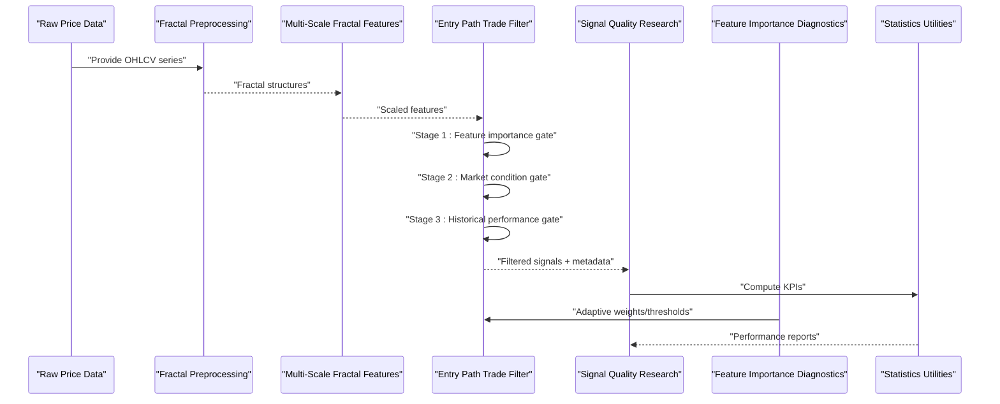
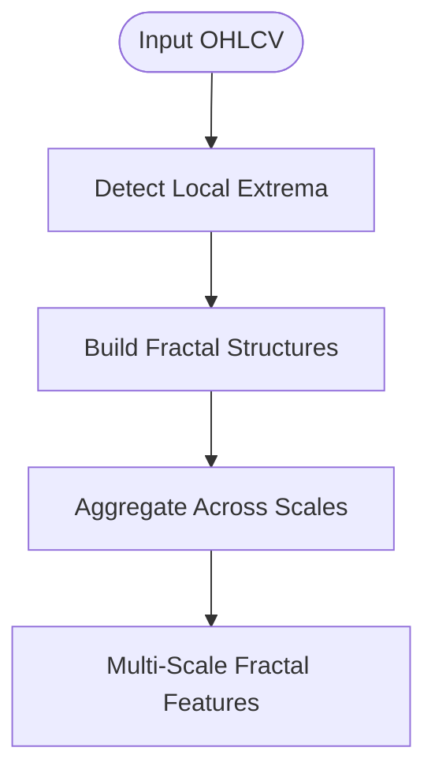
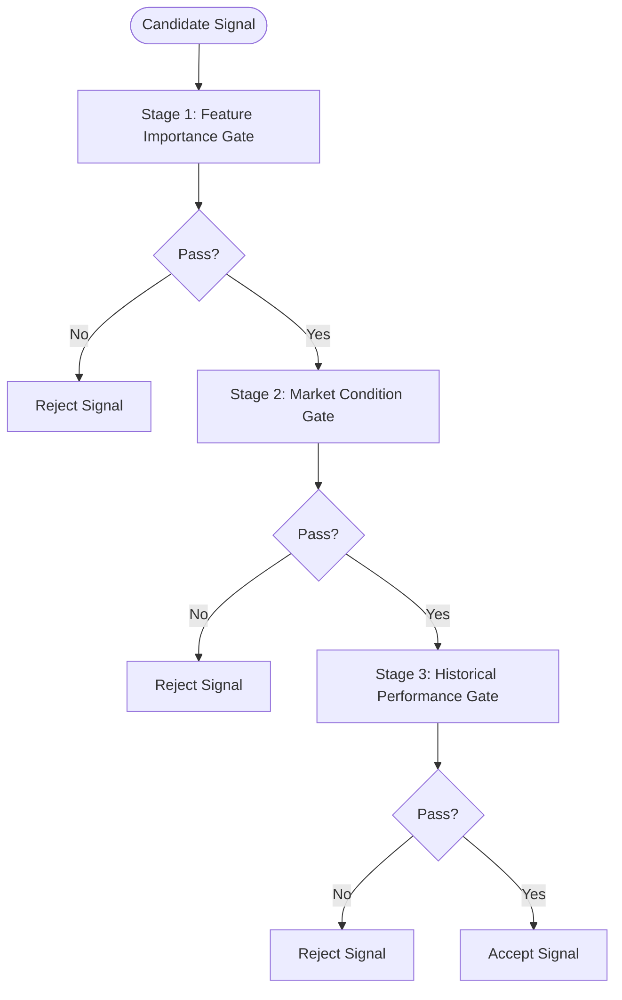
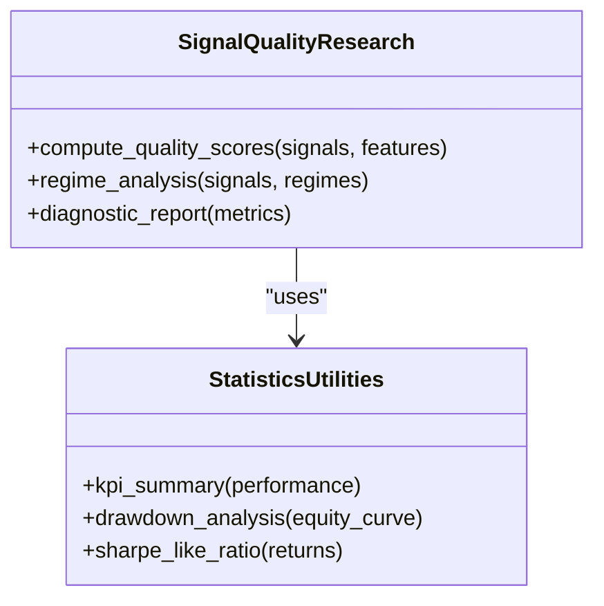
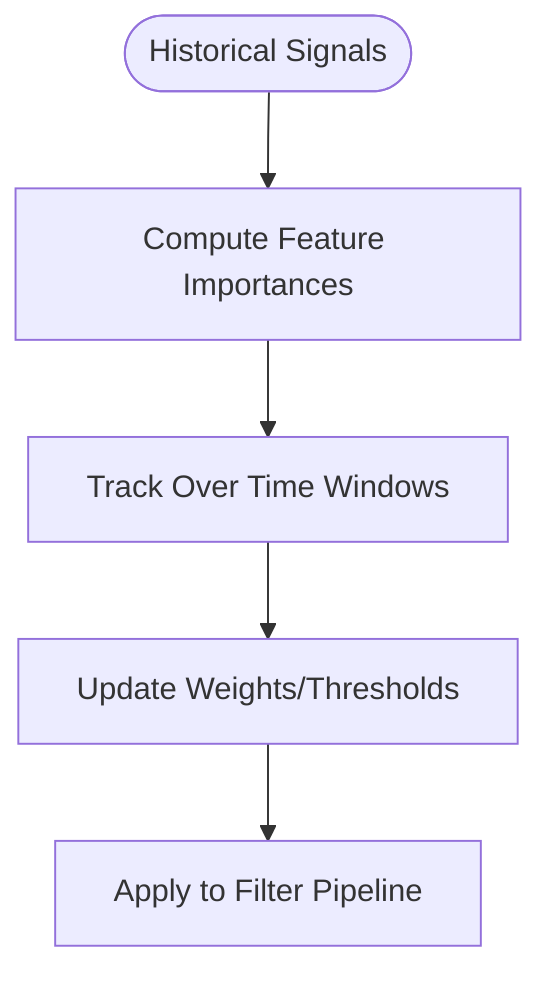
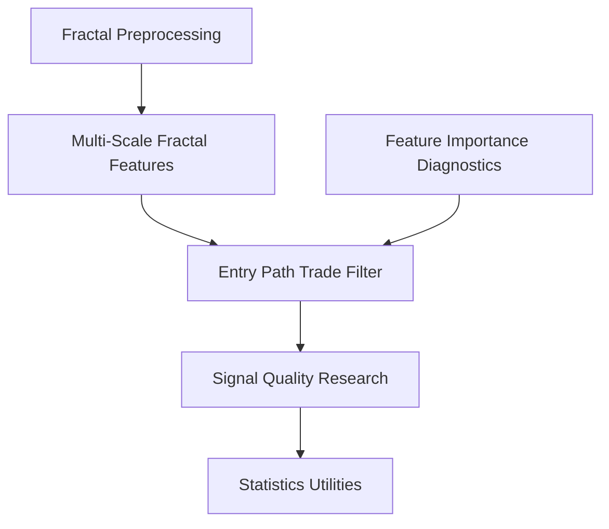

# Quality Filtering & Risk Adjustment

<cite>
**Referenced Files in This Document**
- [benchmark_entry_path_trade_filter.py](file://ML/benchmark_entry_path_trade_filter.py)
- [entry_path_trade_filter.py](file://ML/entry_path_trade_filter.py)
- [feature_importance_diagnostics.py](file://ML/feature_importance_diagnostics.py)
- [multi_scale_fractal_features.py](file://ML/multi_scale_fractal_features.py)
- [fractal_preprocessing.py](file://processing/fractal_preprocessing.py)
- [signal_quality_research.py](file://API/signal_quality_research.py)
- [statistics.py](file://statistics/statistics.py)
- [test_entry_path_trade_filter.py](file://tests/test_entry_path_trade_filter.py)
- [test_signal_quality_research.py](file://tests/test_signal_quality_research.py)
</cite>

## Table of Contents
1. [Introduction](#introduction)
2. [Project Structure](#project-structure)
3. [Core Components](#core-components)
4. [Architecture Overview](#architecture-overview)
5. [Detailed Component Analysis](#detailed-component-analysis)
6. [Dependency Analysis](#dependency-analysis)
7. [Performance Considerations](#performance-considerations)
8. [Troubleshooting Guide](#troubleshooting-guide)
9. [Conclusion](#conclusion)
10. [Appendices](#appendices)

## Introduction
This document explains the quality filtering and risk adjustment mechanisms used to generate high-probability trading signals. It covers:
- Multi-stage filtering that evaluates signal quality using feature importance, market conditions, and historical performance patterns.
- The trade filter implementation that selects strong entries while rejecting low-quality signals.
- Risk adjustment algorithms that modify signal strength based on volatility, spread costs, and correlation analysis.
- Fractal-based quality assessment methods and an entry quality scoring system.
- Practical guidance for filter configuration, threshold tuning, and performance optimization.
- Diagnostic tools for analyzing filter effectiveness and feedback loops for adaptive filtering.
- Integration with position sizing and portfolio-level risk management.

## Project Structure
The quality filtering and risk adjustment logic spans several modules:
- ML pipeline components for feature engineering, fractal processing, and trade filtering.
- API utilities for signal quality research and diagnostics.
- Statistics utilities for performance measurement and reporting.
- Tests validating behavior and stability of filters and diagnostics.

**Diagram sources**
- [fractal_preprocessing.py](file://processing/fractal_preprocessing.py)
- [multi_scale_fractal_features.py](file://ML/multi_scale_fractal_features.py)
- [entry_path_trade_filter.py](file://ML/entry_path_trade_filter.py)
- [benchmark_entry_path_trade_filter.py](file://ML/benchmark_entry_path_trade_filter.py)
- [signal_quality_research.py](file://API/signal_quality_research.py)
- [feature_importance_diagnostics.py](file://ML/feature_importance_diagnostics.py)
- [statistics.py](file://statistics/statistics.py)
- [test_entry_path_trade_filter.py](file://tests/test_entry_path_trade_filter.py)
- [test_signal_quality_research.py](file://tests/test_signal_quality_research.py)

**Section sources**
- [fractal_preprocessing.py](file://processing/fractal_preprocessing.py)
- [multi_scale_fractal_features.py](file://ML/multi_scale_fractal_features.py)
- [entry_path_trade_filter.py](file://ML/entry_path_trade_filter.py)
- [benchmark_entry_path_trade_filter.py](file://ML/benchmark_entry_path_trade_filter.py)
- [signal_quality_research.py](file://API/signal_quality_research.py)
- [feature_importance_diagnostics.py](file://ML/feature_importance_diagnostics.py)
- [statistics.py](file://statistics/statistics.py)
- [test_entry_path_trade_filter.py](file://tests/test_entry_path_trade_filter.py)
- [test_signal_quality_research.py](file://tests/test_signal_quality_research.py)

## Core Components
- Fractal preprocessing: constructs multi-scale fractal features from raw price data to capture local structure and regime characteristics.
- Multi-scale fractal features: aggregates fractal information across scales to provide robust inputs for quality assessment.
- Entry path trade filter: implements a multi-stage filter combining feature importance, market condition checks, and historical performance metrics to select high-probability entries.
- Signal quality research: provides utilities to evaluate and compare filter configurations, compute quality scores, and analyze performance under different market regimes.
- Feature importance diagnostics: measures and tracks feature contributions over time to inform dynamic weighting and adaptive filtering.
- Statistics utilities: computes key performance indicators, drawdowns, Sharpe-like ratios, and other metrics to assess filter effectiveness.

**Section sources**
- [fractal_preprocessing.py](file://processing/fractal_preprocessing.py)
- [multi_scale_fractal_features.py](file://ML/multi_scale_fractal_features.py)
- [entry_path_trade_filter.py](file://ML/entry_path_trade_filter.py)
- [signal_quality_research.py](file://API/signal_quality_research.py)
- [feature_importance_diagnostics.py](file://ML/feature_importance_diagnostics.py)
- [statistics.py](file://statistics/statistics.py)

## Architecture Overview
The system follows a staged pipeline:
1. Raw price series is transformed into fractal features at multiple scales.
2. These features feed into the entry path trade filter, which applies sequential quality gates.
3. Signal quality research evaluates outcomes and produces diagnostics.
4. Feature importance diagnostics update weights or thresholds adaptively.
5. Statistics utilities summarize performance and support portfolio-level decisions.

**Diagram sources**
- [fractal_preprocessing.py](file://processing/fractal_preprocessing.py)
- [multi_scale_fractal_features.py](file://ML/multi_scale_fractal_features.py)
- [entry_path_trade_filter.py](file://ML/entry_path_trade_filter.py)
- [signal_quality_research.py](file://API/signal_quality_research.py)
- [feature_importance_diagnostics.py](file://ML/feature_importance_diagnostics.py)
- [statistics.py](file://statistics/statistics.py)

## Detailed Component Analysis

### Fractal-Based Quality Assessment
Fractal preprocessing identifies local extrema and constructs multi-scale representations that capture microstructure and regime shifts. These features are essential for distinguishing high-quality setups from noise.

**Diagram sources**
- [fractal_preprocessing.py](file://processing/fractal_preprocessing.py)
- [multi_scale_fractal_features.py](file://ML/multi_scale_fractal_features.py)

**Section sources**
- [fractal_preprocessing.py](file://processing/fractal_preprocessing.py)
- [multi_scale_fractal_features.py](file://ML/multi_scale_fractal_features.py)

### Entry Path Trade Filter
The trade filter implements a multi-stage process:
- Stage 1: Feature importance gate ensures only signals supported by strong predictive features pass.
- Stage 2: Market condition gate checks volatility, spread costs, and regime alignment.
- Stage 3: Historical performance gate validates recent success rates and consistency.

**Diagram sources**
- [entry_path_trade_filter.py](file://ML/entry_path_trade_filter.py)
- [benchmark_entry_path_trade_filter.py](file://ML/benchmark_entry_path_trade_filter.py)

**Section sources**
- [entry_path_trade_filter.py](file://ML/entry_path_trade_filter.py)
- [benchmark_entry_path_trade_filter.py](file://ML/benchmark_entry_path_trade_filter.py)
- [test_entry_path_trade_filter.py](file://tests/test_entry_path_trade_filter.py)

### Signal Quality Research
Signal quality research provides evaluation routines:
- Computes quality scores per signal using weighted combinations of features and outcomes.
- Analyzes performance across market regimes and time windows.
- Produces diagnostic outputs for filter tuning and validation.

**Diagram sources**
- [signal_quality_research.py](file://API/signal_quality_research.py)
- [statistics.py](file://statistics/statistics.py)

**Section sources**
- [signal_quality_research.py](file://API/signal_quality_research.py)
- [statistics.py](file://statistics/statistics.py)
- [test_signal_quality_research.py](file://tests/test_signal_quality_research.py)

### Feature Importance Diagnostics
Feature importance diagnostics track how much each feature contributes to signal quality over time. This enables:
- Dynamic reweighting of features in the filter.
- Adaptive threshold adjustments based on changing market conditions.
- Early detection of feature decay or regime shifts.

**Diagram sources**
- [feature_importance_diagnostics.py](file://ML/feature_importance_diagnostics.py)

**Section sources**
- [feature_importance_diagnostics.py](file://ML/feature_importance_diagnostics.py)

## Dependency Analysis
The core dependencies form a clear pipeline from data processing to filtered signals and diagnostics:

**Diagram sources**
- [fractal_preprocessing.py](file://processing/fractal_preprocessing.py)
- [multi_scale_fractal_features.py](file://ML/multi_scale_fractal_features.py)
- [entry_path_trade_filter.py](file://ML/entry_path_trade_filter.py)
- [signal_quality_research.py](file://API/signal_quality_research.py)
- [feature_importance_diagnostics.py](file://ML/feature_importance_diagnostics.py)
- [statistics.py](file://statistics/statistics.py)

**Section sources**
- [fractal_preprocessing.py](file://processing/fractal_preprocessing.py)
- [multi_scale_fractal_features.py](file://ML/multi_scale_fractal_features.py)
- [entry_path_trade_filter.py](file://ML/entry_path_trade_filter.py)
- [signal_quality_research.py](file://API/signal_quality_research.py)
- [feature_importance_diagnostics.py](file://ML/feature_importance_diagnostics.py)
- [statistics.py](file://statistics/statistics.py)

## Performance Considerations
- Computational cost: Multi-scale fractal feature computation can be intensive; consider batching and caching intermediate results.
- Latency: Real-time filtering requires efficient feature importance updates and minimal overhead in market condition checks.
- Memory usage: Large datasets benefit from streaming or chunked processing to avoid memory spikes.
- Robustness: Ensure filters degrade gracefully under extreme volatility or sparse liquidity conditions.

[No sources needed since this section provides general guidance]

## Troubleshooting Guide
Common issues and resolutions:
- Low signal acceptance rate: Review feature importance thresholds and market condition parameters; adjust stage-specific gates.
- Poor out-of-sample performance: Validate feature stability and retrain importance diagnostics periodically.
- High false rejection rate: Examine historical performance gate windows and ensure they reflect current regimes.
- Diagnostic instability: Normalize feature distributions and check for data leakage or non-stationarity.

**Section sources**
- [entry_path_trade_filter.py](file://ML/entry_path_trade_filter.py)
- [feature_importance_diagnostics.py](file://ML/feature_importance_diagnostics.py)
- [signal_quality_research.py](file://API/signal_quality_research.py)
- [statistics.py](file://statistics/statistics.py)

## Conclusion
The quality filtering and risk adjustment framework combines fractal-based feature engineering, multi-stage trade filtering, and adaptive diagnostics to produce robust, high-probability signals. By integrating volatility, spread costs, and correlation analysis into risk adjustments, the system enhances signal strength calibration and supports portfolio-level risk management. Continuous monitoring via feature importance diagnostics and signal quality research ensures resilience across evolving market conditions.

[No sources needed since this section summarizes without analyzing specific files]

## Appendices

### Filter Configuration Examples
- Feature importance gate: Set minimum importance score based on historical contribution percentiles.
- Market condition gate: Define volatility bands and spread thresholds aligned with instrument characteristics.
- Historical performance gate: Use rolling win rate and profit factor thresholds over recent periods.

[No sources needed since this section provides general guidance]

### Threshold Tuning Guidelines
- Start with conservative thresholds and gradually relax based on backtested performance.
- Use walk-forward validation to prevent overfitting.
- Monitor feature importance drift and adjust weights accordingly.

[No sources needed since this section provides general guidance]

### Position Sizing and Portfolio Risk Integration
- Scale position sizes according to adjusted signal strength and volatility estimates.
- Enforce portfolio-level constraints such as maximum drawdown and sector exposure limits.
- Correlation-aware allocation reduces concentration risk across correlated instruments.

[No sources needed since this section provides general guidance]