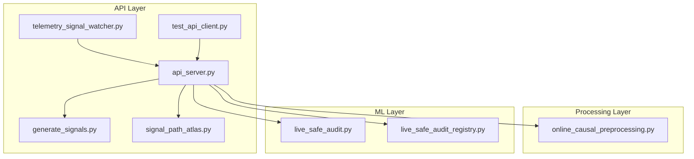
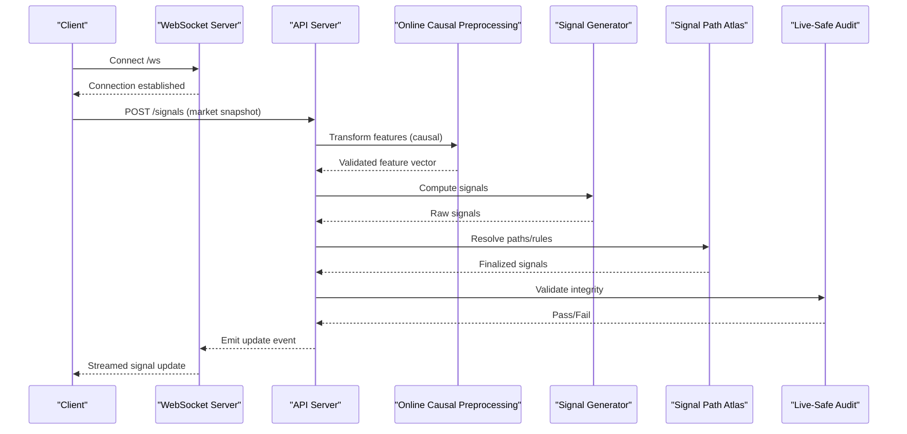
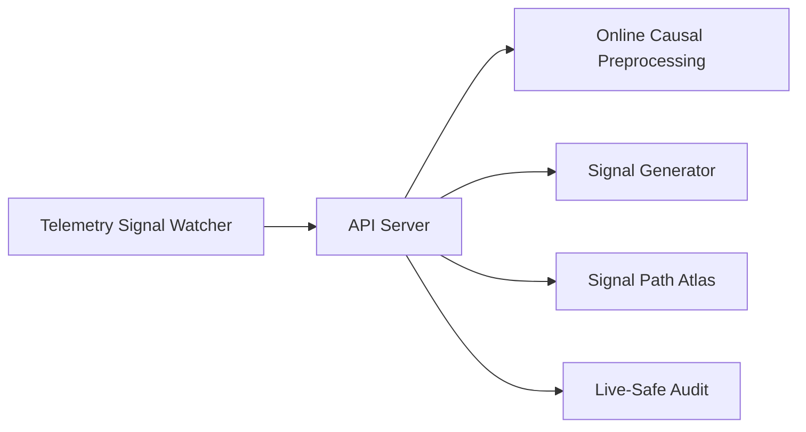

# Real-time Signal Generation

<cite>
**Referenced Files in This Document**
- [api_server.py](file://API/api_server.py)
- [telemetry_signal_watcher.py](file://API/telemetry_signal_watcher.py)
- [generate_signals.py](file://API/generate_signals.py)
- [signal_path_atlas.py](file://API/signal_path_atlas.py)
- [test_api_client.py](file://API/test_api_client.py)
- [online_causal_preprocessing.py](file://processing/online_causal_preprocessing.py)
- [live_safe_audit.py](file://ML/live_safe_audit.py)
- [live_safe_audit_registry.py](file://ML/live_safe_audit_registry.py)
- [README.md](file://API/README.md)
</cite>

## Table of Contents
1. [Introduction](#introduction)
2. [Project Structure](#project-structure)
3. [Core Components](#core-components)
4. [Architecture Overview](#architecture-overview)
5. [Detailed Component Analysis](#detailed-component-analysis)
6. [Dependency Analysis](#dependency-analysis)
7. [Performance Considerations](#performance-considerations)
8. [Troubleshooting Guide](#troubleshooting-guide)
9. [Conclusion](#conclusion)
10. [Appendices](#appendices)

## Introduction
This document explains the real-time signal generation capabilities of the SoSimple system with a focus on:
- The API server that ingests market data and produces signals in real time
- The telemetry signal watcher that monitors market conditions and triggers updates
- The online causal preprocessing pipeline ensuring no data leakage in live environments
- Live-safe audit mechanisms validating signal integrity during production operation
- API endpoints, WebSocket connections for real-time updates, and error handling strategies
- Performance considerations for low-latency signal generation, memory management, and resource optimization
- Monitoring and alerting for health and performance metrics

## Project Structure
The real-time signal generation spans three main areas:
- API layer: HTTP/WebSocket server, signal generation orchestration, and telemetry watcher
- Processing layer: Online causal preprocessing to ensure causality and prevent look-ahead bias
- ML layer: Live-safe audits and registries to validate signal integrity at runtime

**Diagram sources**
- [api_server.py](file://API/api_server.py)
- [generate_signals.py](file://API/generate_signals.py)
- [signal_path_atlas.py](file://API/signal_path_atlas.py)
- [telemetry_signal_watcher.py](file://API/telemetry_signal_watcher.py)
- [online_causal_preprocessing.py](file://processing/online_causal_preprocessing.py)
- [live_safe_audit.py](file://ML/live_safe_audit.py)
- [live_safe_audit_registry.py](file://ML/live_safe_audit_registry.py)

**Section sources**
- [README.md](file://API/README.md)

## Core Components
- API Server: Exposes HTTP endpoints for signal generation and WebSocket channels for streaming updates; orchestrates preprocessing, model inference, and auditing.
- Telemetry Signal Watcher: Subscribes to market telemetry, detects regime changes or thresholds, and triggers signal refreshes via the API server.
- Online Causal Preprocessing: Ensures features are computed strictly from past data to avoid leakage in live mode.
- Live-Safe Audit: Validates outputs and intermediate states against invariants and historical baselines during production runs.

Key responsibilities and interactions are detailed in subsequent sections.

**Section sources**
- [api_server.py](file://API/api_server.py)
- [telemetry_signal_watcher.py](file://API/telemetry_signal_watcher.py)
- [online_causal_preprocessing.py](file://processing/online_causal_preprocessing.py)
- [live_safe_audit.py](file://ML/live_safe_audit.py)
- [live_safe_audit_registry.py](file://ML/live_safe_audit_registry.py)

## Architecture Overview
The real-time pipeline is designed for low latency and strict causality:
- Market data arrives via HTTP requests or WebSocket events
- Online causal preprocessing transforms raw inputs into live-safe features
- Signal generation computes predictions and applies path-based logic
- Live-safe audits validate outputs before publishing
- Results are streamed back to clients over WebSocket

**Diagram sources**
- [api_server.py](file://API/api_server.py)
- [online_causal_preprocessing.py](file://processing/online_causal_preprocessing.py)
- [generate_signals.py](file://API/generate_signals.py)
- [signal_path_atlas.py](file://API/signal_path_atlas.py)
- [live_safe_audit.py](file://ML/live_safe_audit.py)

## Detailed Component Analysis

### API Server
Responsibilities:
- Serve HTTP endpoints for signal generation and configuration queries
- Manage WebSocket connections for real-time signal streaming
- Orchestrate preprocessing, signal computation, path resolution, and auditing
- Handle errors and return structured responses

Typical flow:
- Receive market snapshot
- Invoke causal preprocessing
- Generate signals and resolve paths
- Run live-safe audit
- Publish updates via WebSocket

Error handling:
- Input validation failures return explicit error codes and messages
- Preprocessing failures short-circuit with safe defaults or alerts
- Audit failures block signal publication and trigger diagnostics

**Section sources**
- [api_server.py](file://API/api_server.py)
- [test_api_client.py](file://API/test_api_client.py)

### Telemetry Signal Watcher
Responsibilities:
- Monitor market telemetry streams for regime shifts or threshold breaches
- Trigger signal refreshes by invoking the API server when conditions warrant
- Maintain state and debounce rapid updates to reduce load

Behavior highlights:
- Subscribes to telemetry topics/events
- Evaluates rules for triggering updates
- Calls API endpoints to request new signals
- Logs and reports status for observability

**Section sources**
- [telemetry_signal_watcher.py](file://API/telemetry_signal_watcher.py)

### Online Causal Preprocessing
Responsibilities:
- Ensure all features are computed using only past information
- Prevent look-ahead bias by enforcing strict temporal ordering
- Provide deterministic transformations suitable for live deployment

Key guarantees:
- No future data access
- Stable normalization parameters derived from pre-live windows
- Consistent feature schema across training and live modes

**Section sources**
- [online_causal_preprocessing.py](file://processing/online_causal_preprocessing.py)

### Signal Generation and Path Resolution
Responsibilities:
- Compute raw signals from features using models or rule engines
- Apply path-based logic to refine decisions and manage transitions
- Output standardized signal structures for downstream consumption

Design patterns:
- Modular generators allow swapping algorithms without changing the API
- Path atlas encapsulates decision trees and state transitions
- Clear separation between prediction and policy layers

**Section sources**
- [generate_signals.py](file://API/generate_signals.py)
- [signal_path_atlas.py](file://API/signal_path_atlas.py)

### Live-Safe Audit
Responsibilities:
- Validate signal outputs against invariants and expected distributions
- Compare live outputs to historical baselines to detect drift
- Enforce safety checks before signals are published

Mechanisms:
- Schema validation for output structure
- Statistical checks on signal properties
- Registry-driven policies for configurable checks

**Section sources**
- [live_safe_audit.py](file://ML/live_safe_audit.py)
- [live_safe_audit_registry.py](file://ML/live_safe_audit_registry.py)

## Dependency Analysis
The components interact through well-defined interfaces:
- API Server depends on preprocessing, signal generation, path atlas, and audit modules
- Telemetry Watcher depends on the API Server for triggering updates
- Online Causal Preprocessing is independent but required by the API Server
- Live-Safe Audit is invoked by the API Server prior to publishing

**Diagram sources**
- [api_server.py](file://API/api_server.py)
- [online_causal_preprocessing.py](file://processing/online_causal_preprocessing.py)
- [generate_signals.py](file://API/generate_signals.py)
- [signal_path_atlas.py](file://API/signal_path_atlas.py)
- [live_safe_audit.py](file://ML/live_safe_audit.py)
- [telemetry_signal_watcher.py](file://API/telemetry_signal_watcher.py)

**Section sources**
- [api_server.py](file://API/api_server.py)
- [telemetry_signal_watcher.py](file://API/telemetry_signal_watcher.py)
- [online_causal_preprocessing.py](file://processing/online_causal_preprocessing.py)
- [generate_signals.py](file://API/generate_signals.py)
- [signal_path_atlas.py](file://API/signal_path_atlas.py)
- [live_safe_audit.py](file://ML/live_safe_audit.py)
- [live_safe_audit_registry.py](file://ML/live_safe_audit_registry.py)

## Performance Considerations
- Low-latency design:
  - Minimize serialization overhead; use efficient binary formats where possible
  - Batch preprocessing operations to reduce per-request overhead
  - Cache stable normalization parameters and reusable computations
- Memory management:
  - Reuse buffers for incoming market snapshots
  - Avoid unnecessary object creation in hot paths
  - Implement ring buffers for recent history used by preprocessing
- Resource optimization:
  - Limit concurrent preprocessing tasks to bound CPU usage
  - Use asynchronous I/O for network calls and WebSocket broadcasting
  - Tune thread pools based on workload characteristics
- Observability:
  - Track latency percentiles for each pipeline stage
  - Monitor memory footprint and GC pressure
  - Alert on anomalies in preprocessing times or signal generation delays

[No sources needed since this section provides general guidance]

## Troubleshooting Guide
Common issues and resolutions:
- Input validation failures:
  - Check schema compliance and timestamp ordering
  - Ensure market data completeness and correct units
- Preprocessing errors:
  - Verify causal constraints and normalization parameter availability
  - Inspect feature distribution drift warnings
- Signal generation failures:
  - Confirm model availability and version parity
  - Review path atlas rules for conflicting conditions
- Audit failures:
  - Investigate statistical thresholds and baseline mismatches
  - Temporarily disable non-critical checks while diagnosing
- WebSocket connectivity:
  - Validate client subscriptions and reconnection logic
  - Monitor broker capacity and message backlog

Operational tips:
- Enable detailed logging for each pipeline stage
- Use test clients to reproduce issues deterministically
- Maintain rollback plans for model and rule updates

**Section sources**
- [api_server.py](file://API/api_server.py)
- [test_api_client.py](file://API/test_api_client.py)

## Conclusion
The SoSimple real-time signal generation system combines a robust API server, a telemetry-driven watcher, a causally sound preprocessing pipeline, and rigorous live-safe audits. This architecture ensures timely, accurate, and safe signal production in live environments while providing clear pathways for monitoring, troubleshooting, and performance tuning.

[No sources needed since this section summarizes without analyzing specific files]

## Appendices

### API Endpoints and WebSocket Usage
- HTTP endpoints:
  - Signal generation endpoint accepts market snapshots and returns finalized signals after preprocessing, generation, path resolution, and auditing
  - Configuration endpoints expose available models, rules, and audit policies
- WebSocket connections:
  - Clients connect to stream real-time signal updates
  - Events include signal deltas, status changes, and diagnostic messages
- Error responses:
  - Structured error payloads with codes and actionable messages
  - Retry guidelines and fallback behaviors documented per endpoint

**Section sources**
- [api_server.py](file://API/api_server.py)
- [test_api_client.py](file://API/test_api_client.py)

### Monitoring and Alerting
- Metrics to track:
  - End-to-end latency, preprocessing time, model inference time, audit duration
  - Throughput (requests per second), WebSocket message rate
  - Error rates by stage and failure type
- Alerts:
  - Latency SLO breaches
  - High error rates or audit failures
  - Memory and CPU saturation indicators
- Dashboards:
  - Pipeline stage timelines
  - Signal quality indicators and drift detection
  - System health overview

[No sources needed since this section provides general guidance]