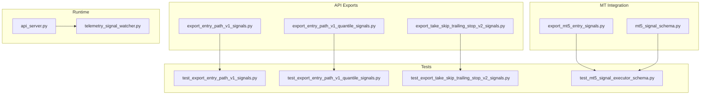
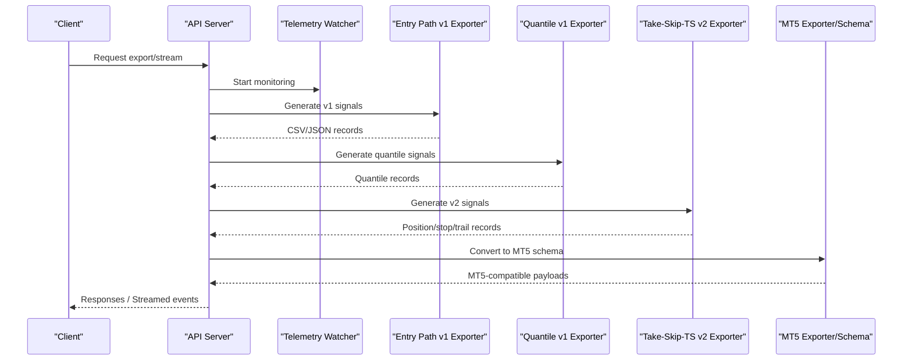
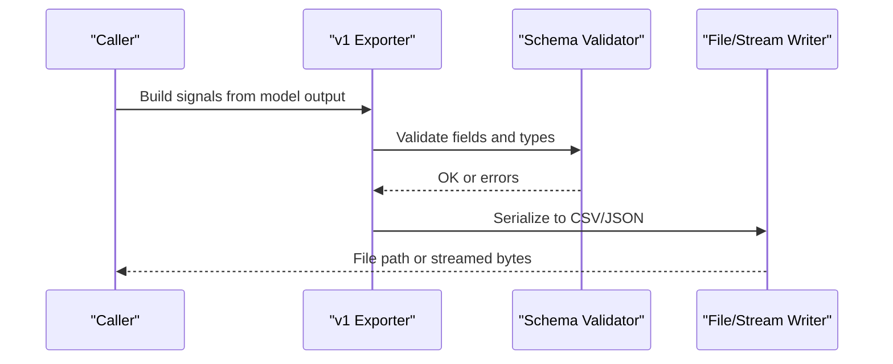
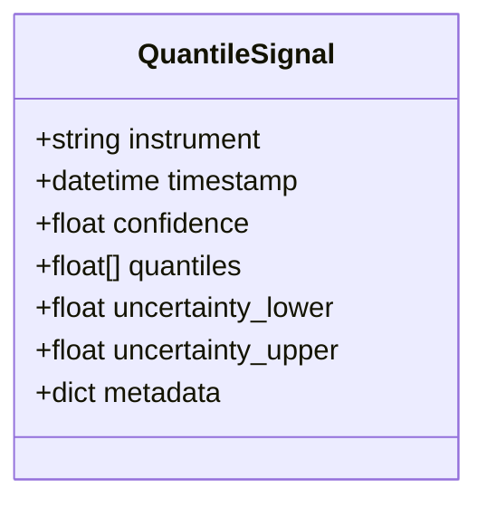
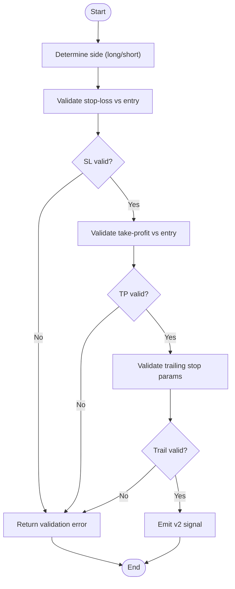
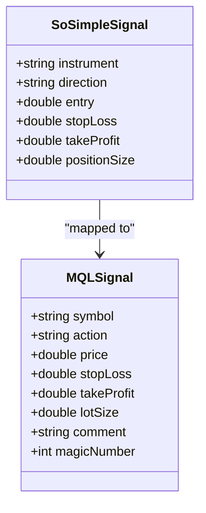
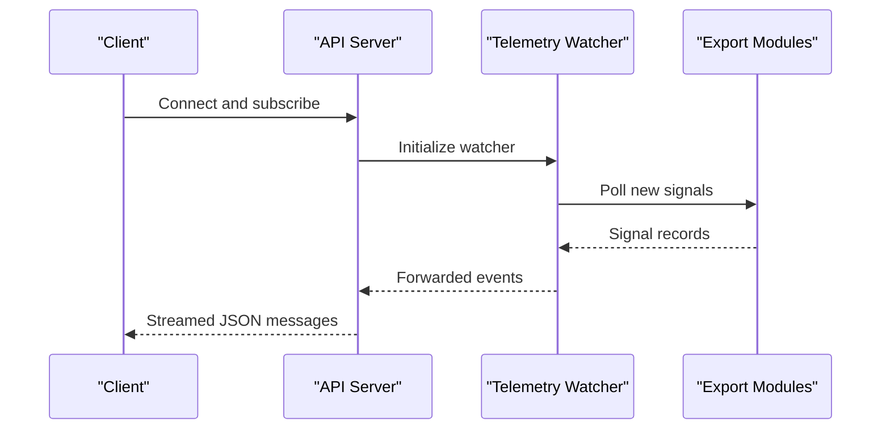
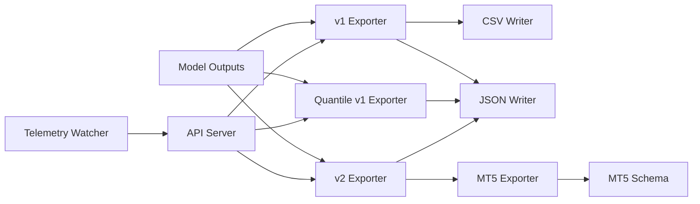

# Signal Export & Integration Formats

<cite>
**Referenced Files in This Document**
- [API/export_entry_path_v1_signals.py](file://API/export_entry_path_v1_signals.py)
- [API/export_entry_path_v1_quantile_signals.py](file://API/export_entry_path_v1_quantile_signals.py)
- [API/export_take_skip_trailing_stop_v2_signals.py](file://API/export_take_skip_trailing_stop_v2_signals.py)
- [ML/baseline/export_mt5_entry_signals.py](file://ML/baseline/export_mt5_entry_signals.py)
- [ML/baseline/mt5_signal_schema.py](file://ML/baseline/mt5_signal_schema.py)
- [tests/test_export_entry_path_v1_signals.py](file://tests/test_export_entry_path_v1_signals.py)
- [tests/test_export_entry_path_v1_quantile_signals.py](file://tests/test_export_entry_path_v1_quantile_signals.py)
- [tests/test_export_take_skip_trailing_stop_v2_signals.py](file://tests/test_export_take_skip_trailing_stop_v2_signals.py)
- [tests/test_mt5_signal_executor_schema.py](file://tests/test_mt5_signal_executor_schema.py)
- [API/api_server.py](file://API/api_server.py)
- [API/telemetry_signal_watcher.py](file://API/telemetry_signal_watcher.py)
</cite>

## Table of Contents
1. [Introduction](#introduction)
2. [Project Structure](#project-structure)
3. [Core Components](#core-components)
4. [Architecture Overview](#architecture-overview)
5. [Detailed Component Analysis](#detailed-component-analysis)
6. [Dependency Analysis](#dependency-analysis)
7. [Performance Considerations](#performance-considerations)
8. [Troubleshooting Guide](#troubleshooting-guide)
9. [Conclusion](#conclusion)
10. [Appendices](#appendices)

## Introduction
This document specifies the signal export and integration formats used by the SoSimple system. It covers:
- Entry path v1 signals (CSV, JSON), including field definitions, timestamp handling, and confidence scoring
- Take-skip-trailing-stop v2 signals (position sizing, stop-loss levels, trailing stops)
- Quantile-based signals with uncertainty bounds and probability distributions
- MT4/MT5 integration schemas and real-time streaming formats for live trading
- Examples, parsing utilities, validation procedures, versioning strategy, and backward compatibility considerations

## Project Structure
Signal exports are implemented as Python modules under API/, with corresponding tests under tests/. MT5-specific schema and export utilities are under ML/baseline/. Real-time streaming is exposed via an API server and a telemetry watcher.

**Diagram sources**
- [API/export_entry_path_v1_signals.py](file://API/export_entry_path_v1_signals.py)
- [API/export_entry_path_v1_quantile_signals.py](file://API/export_entry_path_v1_quantile_signals.py)
- [API/export_take_skip_trailing_stop_v2_signals.py](file://API/export_take_skip_trailing_stop_v2_signals.py)
- [ML/baseline/export_mt5_entry_signals.py](file://ML/baseline/export_mt5_entry_signals.py)
- [ML/baseline/mt5_signal_schema.py](file://ML/baseline/mt5_signal_schema.py)
- [API/api_server.py](file://API/api_server.py)
- [API/telemetry_signal_watcher.py](file://API/telemetry_signal_watcher.py)
- [tests/test_export_entry_path_v1_signals.py](file://tests/test_export_entry_path_v1_signals.py)
- [tests/test_export_entry_path_v1_quantile_signals.py](file://tests/test_export_entry_path_v1_quantile_signals.py)
- [tests/test_export_take_skip_trailing_stop_v2_signals.py](file://tests/test_export_take_skip_trailing_stop_v2_signals.py)
- [tests/test_mt5_signal_executor_schema.py](file://tests/test_mt5_signal_executor_schema.py)

**Section sources**
- [API/export_entry_path_v1_signals.py](file://API/export_entry_path_v1_signals.py)
- [API/export_entry_path_v1_quantile_signals.py](file://API/export_entry_path_v1_quantile_signals.py)
- [API/export_take_skip_trailing_stop_v2_signals.py](file://API/export_take_skip_trailing_stop_v2_signals.py)
- [ML/baseline/export_mt5_entry_signals.py](file://ML/baseline/export_mt5_entry_signals.py)
- [ML/baseline/mt5_signal_schema.py](file://ML/baseline/mt5_signal_schema.py)
- [API/api_server.py](file://API/api_server.py)
- [API/telemetry_signal_watcher.py](file://API/telemetry_signal_watcher.py)
- [tests/test_export_entry_path_v1_signals.py](file://tests/test_export_entry_path_v1_signals.py)
- [tests/test_export_entry_path_v1_quantile_signals.py](file://tests/test_export_entry_path_v1_quantile_signals.py)
- [tests/test_export_take_skip_trailing_stop_v2_signals.py](file://tests/test_export_take_skip_trailing_stop_v2_signals.py)
- [tests/test_mt5_signal_executor_schema.py](file://tests/test_mt5_signal_executor_schema.py)

## Core Components
- Entry Path v1 exporter: Produces CSV and JSON outputs for entry-path predictions with timestamps and confidence scores.
- Entry Path v1 Quantile exporter: Adds quantile-based uncertainty bounds and distributional outputs.
- Take-Skip-Trailing-Stop v2 exporter: Encodes position sizing, stop-loss, take-profit, and trailing stop parameters.
- MT5 signal exporter/schema: Maps SoSimple signals to MT5-compatible structures and validates schemas.
- API server and telemetry watcher: Provide endpoints and streaming for real-time signal consumption.

**Section sources**
- [API/export_entry_path_v1_signals.py](file://API/export_entry_path_v1_signals.py)
- [API/export_entry_path_v1_quantile_signals.py](file://API/export_entry_path_v1_quantile_signals.py)
- [API/export_take_skip_trailing_stop_v2_signals.py](file://API/export_take_skip_trailing_stop_v2_signals.py)
- [ML/baseline/export_mt5_entry_signals.py](file://ML/baseline/export_mt5_entry_signals.py)
- [ML/baseline/mt5_signal_schema.py](file://ML/baseline/mt5_signal_schema.py)
- [API/api_server.py](file://API/api_server.py)
- [API/telemetry_signal_watcher.py](file://API/telemetry_signal_watcher.py)

## Architecture Overview
The export pipeline transforms model outputs into standardized signal records, then serializes them to CSV/JSON or MT5-compatible structures. The API server exposes endpoints to trigger exports and stream signals; the telemetry watcher monitors and forwards signals for downstream consumers.

**Diagram sources**
- [API/api_server.py](file://API/api_server.py)
- [API/telemetry_signal_watcher.py](file://API/telemetry_signal_watcher.py)
- [API/export_entry_path_v1_signals.py](file://API/export_entry_path_v1_signals.py)
- [API/export_entry_path_v1_quantile_signals.py](file://API/export_entry_path_v1_quantile_signals.py)
- [API/export_take_skip_trailing_stop_v2_signals.py](file://API/export_take_skip_trailing_stop_v2_signals.py)
- [ML/baseline/export_mt5_entry_signals.py](file://ML/baseline/export_mt5_entry_signals.py)
- [ML/baseline/mt5_signal_schema.py](file://ML/baseline/mt5_signal_schema.py)

## Detailed Component Analysis

### Entry Path v1 Signals
- Output formats: CSV and JSON
- Key fields: instrument, timestamp, direction/side, confidence score, optional metadata
- Timestamp handling: ISO-like strings or epoch seconds; consistent timezone-aware serialization
- Confidence scoring: normalized probabilities or calibrated scores; thresholding rules applied downstream

Parsing and validation:
- CSV parser enforces required columns and types
- JSON validator checks schema completeness and value ranges
- Tests assert column presence, type correctness, and non-empty payloads

Example usage patterns:
- Batch export to file
- Streaming single-row events over HTTP/WebSocket

Backward compatibility:
- New optional fields appended without breaking existing parsers
- Version tag included when necessary

**Section sources**
- [API/export_entry_path_v1_signals.py](file://API/export_entry_path_v1_signals.py)
- [tests/test_export_entry_path_v1_signals.py](file://tests/test_export_entry_path_v1_signals.py)

#### Sequence Diagram: v1 Export Flow

**Diagram sources**
- [API/export_entry_path_v1_signals.py](file://API/export_entry_path_v1_signals.py)
- [tests/test_export_entry_path_v1_signals.py](file://tests/test_export_entry_path_v1_signals.py)

### Entry Path v1 Quantile Signals
- Output format: JSON (primary), CSV (optional)
- Fields: base signal fields plus quantiles (e.g., p10, p50, p90), uncertainty bounds, and distribution metadata
- Use cases: risk-aware execution, dynamic sizing based on uncertainty

Validation:
- Quantile ordering enforced (lower <= median <= higher)
- Bounds must be finite and within reasonable ranges

**Section sources**
- [API/export_entry_path_v1_quantile_signals.py](file://API/export_entry_path_v1_quantile_signals.py)
- [tests/test_export_entry_path_v1_quantile_signals.py](file://tests/test_export_entry_path_v1_quantile_signals.py)

#### Class Diagram: Quantile Signal Record

**Diagram sources**
- [API/export_entry_path_v1_quantile_signals.py](file://API/export_entry_path_v1_quantile_signals.py)

### Take-Skip-Trailing-Stop v2 Signals
- Purpose: Encode actionable trade parameters beyond direction
- Fields: position size, stop-loss level, take-profit level, trailing stop parameters, activation conditions
- Sizing: absolute units or fractional risk; supports per-instrument constraints

Validation:
- Stop-loss < entry < take-profit for long; reversed for short
- Trailing stop parameters must be positive and logically ordered

**Section sources**
- [API/export_take_skip_trailing_stop_v2_signals.py](file://API/export_take_skip_trailing_stop_v2_signals.py)
- [tests/test_export_take_skip_trailing_stop_v2_signals.py](file://tests/test_export_take_skip_trailing_stop_v2_signals.py)

#### Flowchart: v2 Validation Logic

**Diagram sources**
- [API/export_take_skip_trailing_stop_v2_signals.py](file://API/export_take_skip_trailing_stop_v2_signals.py)

### MT4/MT5 Integration Schemas
- Schema definition: Centralized schema for MT5-compatible payloads
- Export utility: Converts SoSimple signals to MT5 structures
- Field mapping: Ensures correct types and naming conventions for MT4/MT5 engines

Validation:
- Schema enforcement via tests
- Type checks and range validations for MT5 requirements

**Section sources**
- [ML/baseline/export_mt5_entry_signals.py](file://ML/baseline/export_mt5_entry_signals.py)
- [ML/baseline/mt5_signal_schema.py](file://ML/baseline/mt5_signal_schema.py)
- [tests/test_mt5_signal_executor_schema.py](file://tests/test_mt5_signal_executor_schema.py)

#### Class Diagram: MT5 Signal Mapping

**Diagram sources**
- [ML/baseline/export_mt5_entry_signals.py](file://ML/baseline/export_mt5_entry_signals.py)
- [ML/baseline/mt5_signal_schema.py](file://ML/baseline/mt5_signal_schema.py)

### Real-Time Streaming Formats
- API server exposes endpoints to trigger exports and stream signals
- Telemetry watcher monitors signal generation and forwards events
- Formats: JSON messages with consistent schema; optional CSV batch endpoints

Usage:
- Subscribe to streaming endpoint for live signals
- Parse JSON payloads and apply client-side validation

**Section sources**
- [API/api_server.py](file://API/api_server.py)
- [API/telemetry_signal_watcher.py](file://API/telemetry_signal_watcher.py)

#### Sequence Diagram: Live Streaming

**Diagram sources**
- [API/api_server.py](file://API/api_server.py)
- [API/telemetry_signal_watcher.py](file://API/telemetry_signal_watcher.py)

## Dependency Analysis
- Export modules depend on model outputs and shared validators
- MT5 exporter depends on schema definitions
- API server orchestrates exporters and watchers
- Tests validate each module’s contract and edge cases

**Diagram sources**
- [API/export_entry_path_v1_signals.py](file://API/export_entry_path_v1_signals.py)
- [API/export_entry_path_v1_quantile_signals.py](file://API/export_entry_path_v1_quantile_signals.py)
- [API/export_take_skip_trailing_stop_v2_signals.py](file://API/export_take_skip_trailing_stop_v2_signals.py)
- [ML/baseline/export_mt5_entry_signals.py](file://ML/baseline/export_mt5_entry_signals.py)
- [ML/baseline/mt5_signal_schema.py](file://ML/baseline/mt5_signal_schema.py)
- [API/api_server.py](file://API/api_server.py)
- [API/telemetry_signal_watcher.py](file://API/telemetry_signal_watcher.py)

**Section sources**
- [API/export_entry_path_v1_signals.py](file://API/export_entry_path_v1_signals.py)
- [API/export_entry_path_v1_quantile_signals.py](file://API/export_entry_path_v1_quantile_signals.py)
- [API/export_take_skip_trailing_stop_v2_signals.py](file://API/export_take_skip_trailing_stop_v2_signals.py)
- [ML/baseline/export_mt5_entry_signals.py](file://ML/baseline/export_mt5_entry_signals.py)
- [ML/baseline/mt5_signal_schema.py](file://ML/baseline/mt5_signal_schema.py)
- [API/api_server.py](file://API/api_server.py)
- [API/telemetry_signal_watcher.py](file://API/telemetry_signal_watcher.py)

## Performance Considerations
- Prefer streaming JSON for low-latency consumption; use CSV for batch processing
- Validate early to fail fast and reduce downstream overhead
- Cache schema definitions and avoid repeated parsing
- Limit payload size by filtering inactive signals and batching where appropriate

[No sources needed since this section provides general guidance]

## Troubleshooting Guide
Common issues and resolutions:
- Missing required fields: Ensure all mandatory columns exist in CSV and keys present in JSON
- Invalid timestamp formats: Normalize to ISO strings or epoch seconds consistently
- Quantile ordering violations: Enforce lower <= median <= upper before emitting
- MT5 schema mismatches: Verify type conversions and allowed value ranges
- Streaming interruptions: Reconnect clients and implement retry logic

Validation utilities:
- Use provided test suites to assert schema compliance and data integrity
- Log detailed error messages indicating failing fields and values

**Section sources**
- [tests/test_export_entry_path_v1_signals.py](file://tests/test_export_entry_path_v1_signals.py)
- [tests/test_export_entry_path_v1_quantile_signals.py](file://tests/test_export_entry_path_v1_quantile_signals.py)
- [tests/test_export_take_skip_trailing_stop_v2_signals.py](file://tests/test_export_take_skip_trailing_stop_v2_signals.py)
- [tests/test_mt5_signal_executor_schema.py](file://tests/test_mt5_signal_executor_schema.py)

## Conclusion
SoSimple’s signal export system provides robust, validated formats for entry path v1, quantile-based uncertainty, and take-skip-trailing-stop v2 strategies. MT5 integration ensures compatibility with MetaTrader engines, while the API server and telemetry watcher enable real-time streaming. Adhering to the documented schemas and validation procedures guarantees reliable downstream consumption and backward compatibility.

[No sources needed since this section summarizes without analyzing specific files]

## Appendices

### Versioning Strategy and Backward Compatibility
- Introduce new optional fields without breaking existing parsers
- Include version tags when schema changes are non-backward compatible
- Maintain deprecation timelines and migration guides for major updates
- Validate both old and new formats during transition periods

[No sources needed since this section provides general guidance]