# Signal Generation

<cite>
**Referenced Files in This Document**
- [API/generate_signals.py](file://API/generate_signals.py)
- [API/export_entry_path_v1_signals.py](file://API/export_entry_path_v1_signals.py)
- [API/export_entry_path_v1_quantile_signals.py](file://API/export_entry_path_v1_quantile_signals.py)
- [API/export_take_skip_trailing_stop_v2_signals.py](file://API/export_take_skip_trailing_stop_v2_signals.py)
- [API/signal_path_atlas.py](file://API/signal_path_atlas.py)
- [API/signal_quality_research.py](file://API/signal_quality_research.py)
- [ML/entry_path_trade_filter.py](file://ML/entry_path_trade_filter.py)
- [ML/tb_signal_logic.py](file://ML/tb_signal_logic.py)
- [ML/conformal/calibrate.py](file://ML/conformal/calibrate.py)
- [ML/conformal/conformal_quantiles.json](file://ML/conformal/conformal_quantiles.json)
- [ML/models/entry_path_transformer.py](file://ML/models/entry_path_transformer.py)
- [ML/models/entry_path_v1_quantile_transformer.py](file://ML/models/entry_path_v1_quantile_transformer.py)
- [ML/models/take_skip_dual_stream_transformer.py](file://ML/models/take_skip_dual_stream_transformer.py)
- [ML/models/trailing_stop_target_quantile_transformer.py](file://ML/models/trailing_stop_target_quantile_transformer.py)
- [ML/benchmark_entry_path_v1_quantile_n_boost.py](file://ML/benchmark_entry_path_v1_quantile_n_boost.py)
- [ML/benchmark_take_skip_trailing_stop_v2.py](file://ML/benchmark_take_skip_trailing_stop_v2.py)
- [processing/label_signals.py](file://processing/label_signals.py)
- [statistics/signal_tracer.py](file://statistics/signal_tracer.py)
</cite>

## Table of Contents
1. [Introduction](#introduction)
2. [Project Structure](#project-structure)
3. [Core Components](#core-components)
4. [Architecture Overview](#architecture-overview)
5. [Detailed Component Analysis](#detailed-component-analysis)
6. [Dependency Analysis](#dependency-analysis)
7. [Performance Considerations](#performance-considerations)
8. [Troubleshooting Guide](#troubleshooting-guide)
9. [Conclusion](#conclusion)
10. [Appendices](#appendices)

## Introduction
This document explains how SoSimple generates trading signals from model predictions through quality filtering, risk adjustment, and export for execution. It covers:
- The end-to-end signal creation pipeline from raw model outputs to ranked, filtered signals
- Entry path methodology for scoring and ranking with trade filters and confidence thresholds
- Take-skip-trailing-stop strategy implementation and its configuration
- Ensemble approaches combining multiple models and conformal prediction for uncertainty quantification
- Output formats, quality metrics, performance attribution, and debugging tools
- Real-time considerations and integration points with execution systems

## Project Structure
Signal generation spans the API layer (orchestration and exports), ML layer (models, tasks, filters, conformal calibration), processing (labels), and statistics (diagnostics). Key modules:
- API entry points for generating and exporting signals
- ML components for model inference, ensemble composition, and conformal calibration
- Processing utilities for labeling and feature preparation
- Statistics utilities for tracing and diagnostics

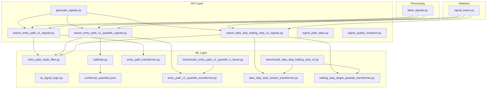

**Diagram sources**
- [API/generate_signals.py](file://API/generate_signals.py)
- [API/export_entry_path_v1_signals.py](file://API/export_entry_path_v1_signals.py)
- [API/export_entry_path_v1_quantile_signals.py](file://API/export_entry_path_v1_quantile_signals.py)
- [API/export_take_skip_trailing_stop_v2_signals.py](file://API/export_take_skip_trailing_stop_v2_signals.py)
- [API/signal_path_atlas.py](file://API/signal_path_atlas.py)
- [API/signal_quality_research.py](file://API/signal_quality_research.py)
- [ML/entry_path_trade_filter.py](file://ML/entry_path_trade_filter.py)
- [ML/tb_signal_logic.py](file://ML/tb_signal_logic.py)
- [ML/conformal/calibrate.py](file://ML/conformal/calibrate.py)
- [ML/conformal/conformal_quantiles.json](file://ML/conformal/conformal_quantiles.json)
- [ML/models/entry_path_transformer.py](file://ML/models/entry_path_transformer.py)
- [ML/models/entry_path_v1_quantile_transformer.py](file://ML/models/entry_path_v1_quantile_transformer.py)
- [ML/models/take_skip_dual_stream_transformer.py](file://ML/models/take_skip_dual_stream_transformer.py)
- [ML/models/trailing_stop_target_quantile_transformer.py](file://ML/models/trailing_stop_target_quantile_transformer.py)
- [ML/benchmark_entry_path_v1_quantile_n_boost.py](file://ML/benchmark_entry_path_v1_quantile_n_boost.py)
- [ML/benchmark_take_skip_trailing_stop_v2.py](file://ML/benchmark_take_skip_trailing_stop_v2.py)
- [processing/label_signals.py](file://processing/label_signals.py)
- [statistics/signal_tracer.py](file://statistics/signal_tracer.py)

**Section sources**
- [API/generate_signals.py](file://API/generate_signals.py)
- [API/export_entry_path_v1_signals.py](file://API/export_entry_path_v1_signals.py)
- [API/export_entry_path_v1_quantile_signals.py](file://API/export_entry_path_v1_quantile_signals.py)
- [API/export_take_skip_trailing_stop_v2_signals.py](file://API/export_take_skip_trailing_stop_v2_signals.py)
- [ML/entry_path_trade_filter.py](file://ML/entry_path_trade_filter.py)
- [ML/tb_signal_logic.py](file://ML/tb_signal_logic.py)
- [ML/conformal/calibrate.py](file://ML/conformal/calibrate.py)
- [ML/conformal/conformal_quantiles.json](file://ML/conformal/conformal_quantiles.json)
- [ML/models/entry_path_transformer.py](file://ML/models/entry_path_transformer.py)
- [ML/models/entry_path_v1_quantile_transformer.py](file://ML/models/entry_path_v1_quantile_transformer.py)
- [ML/models/take_skip_dual_stream_transformer.py](file://ML/models/take_skip_dual_stream_transformer.py)
- [ML/models/trailing_stop_target_quantile_transformer.py](file://ML/models/trailing_stop_target_quantile_transformer.py)
- [ML/benchmark_entry_path_v1_quantile_n_boost.py](file://ML/benchmark_entry_path_v1_quantile_n_boost.py)
- [ML/benchmark_take_skip_trailing_stop_v2.py](file://ML/benchmark_take_skip_trailing_stop_v2.py)
- [processing/label_signals.py](file://processing/label_signals.py)
- [statistics/signal_tracer.py](file://statistics/signal_tracer.py)

## Core Components
- Signal orchestration: Centralized entry point that coordinates model inference, filtering, and export.
- Entry path v1 signal exporter: Produces directional signals based on entry path models and applies trade filters.
- Entry path v1 quantile signal exporter: Extends v1 with quantile-based uncertainty and conformal calibration.
- Take-skip-trailing stop v2 exporter: Implements take-skip logic and trailing stop targets using dual-stream and quantile models.
- Trade filter: Applies quality gates and risk adjustments before finalizing signals.
- Triple barrier signal logic: Encodes exit conditions and target definitions used by exporters.
- Conformal calibration: Computes predictive intervals and quantiles for uncertainty-aware decisions.
- Labeling: Generates training labels and supports consistency checks for signal pipelines.
- Diagnostics: Traces and audits signals for debugging and performance attribution.

**Section sources**
- [API/generate_signals.py](file://API/generate_signals.py)
- [API/export_entry_path_v1_signals.py](file://API/export_entry_path_v1_signals.py)
- [API/export_entry_path_v1_quantile_signals.py](file://API/export_entry_path_v1_quantile_signals.py)
- [API/export_take_skip_trailing_stop_v2_signals.py](file://API/export_take_skip_trailing_stop_v2_signals.py)
- [ML/entry_path_trade_filter.py](file://ML/entry_path_trade_filter.py)
- [ML/tb_signal_logic.py](file://ML/tb_signal_logic.py)
- [ML/conformal/calibrate.py](file://ML/conformal/calibrate.py)
- [processing/label_signals.py](file://processing/label_signals.py)
- [statistics/signal_tracer.py](file://statistics/signal_tracer.py)

## Architecture Overview
The signal generation architecture follows a layered design:
- API layer orchestrates workflows and exports
- ML layer provides model inference, ensemble composition, and calibration
- Processing layer prepares labels and features
- Statistics layer provides diagnostics and tracing

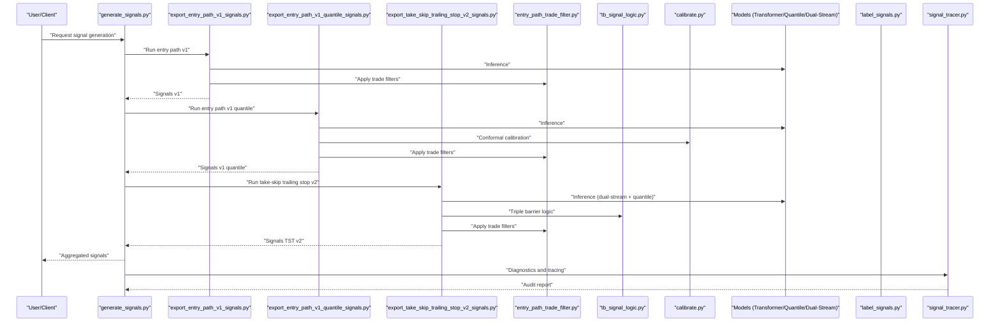

**Diagram sources**
- [API/generate_signals.py](file://API/generate_signals.py)
- [API/export_entry_path_v1_signals.py](file://API/export_entry_path_v1_signals.py)
- [API/export_entry_path_v1_quantile_signals.py](file://API/export_entry_path_v1_quantile_signals.py)
- [API/export_take_skip_trailing_stop_v2_signals.py](file://API/export_take_skip_trailing_stop_v2_signals.py)
- [ML/entry_path_trade_filter.py](file://ML/entry_path_trade_filter.py)
- [ML/tb_signal_logic.py](file://ML/tb_signal_logic.py)
- [ML/conformal/calibrate.py](file://ML/conformal/calibrate.py)
- [processing/label_signals.py](file://processing/label_signals.py)
- [statistics/signal_tracer.py](file://statistics/signal_tracer.py)

## Detailed Component Analysis

### Entry Path v1 Signal Exporter
- Purpose: Generate directional signals from entry path transformer models and apply trade filters.
- Workflow:
  - Load model and data
  - Run inference to obtain direction scores
  - Apply trade filters for quality and risk
  - Rank and export signals

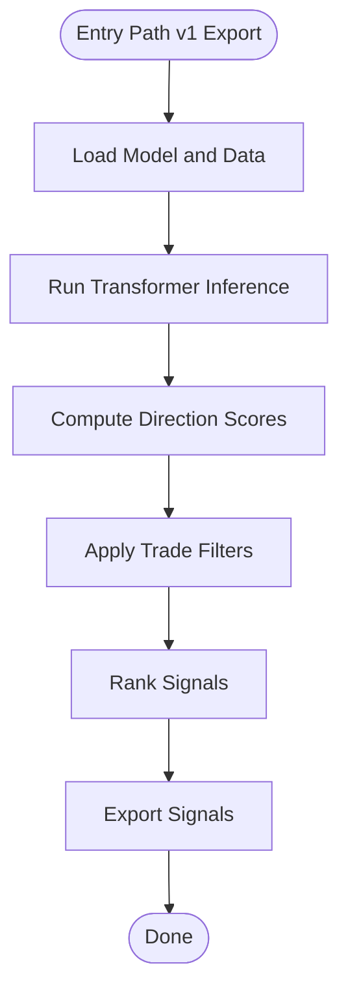

**Diagram sources**
- [API/export_entry_path_v1_signals.py](file://API/export_entry_path_v1_signals.py)
- [ML/models/entry_path_transformer.py](file://ML/models/entry_path_transformer.py)
- [ML/entry_path_trade_filter.py](file://ML/entry_path_trade_filter.py)

**Section sources**
- [API/export_entry_path_v1_signals.py](file://API/export_entry_path_v1_signals.py)
- [ML/models/entry_path_transformer.py](file://ML/models/entry_path_transformer.py)
- [ML/entry_path_trade_filter.py](file://ML/entry_path_trade_filter.py)

### Entry Path v1 Quantile Signal Exporter
- Purpose: Extend v1 with quantile-based uncertainty and conformal calibration.
- Workflow:
  - Run quantile transformer inference
  - Calibrate predictive intervals using conformal method
  - Apply trade filters with uncertainty-aware thresholds
  - Rank and export signals

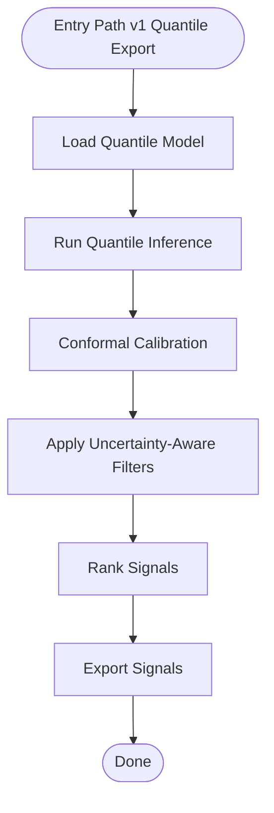

**Diagram sources**
- [API/export_entry_path_v1_quantile_signals.py](file://API/export_entry_path_v1_quantile_signals.py)
- [ML/models/entry_path_v1_quantile_transformer.py](file://ML/models/entry_path_v1_quantile_transformer.py)
- [ML/conformal/calibrate.py](file://ML/conformal/calibrate.py)
- [ML/conformal/conformal_quantiles.json](file://ML/conformal/conformal_quantiles.json)
- [ML/entry_path_trade_filter.py](file://ML/entry_path_trade_filter.py)

**Section sources**
- [API/export_entry_path_v1_quantile_signals.py](file://API/export_entry_path_v1_quantile_signals.py)
- [ML/models/entry_path_v1_quantile_transformer.py](file://ML/models/entry_path_v1_quantile_transformer.py)
- [ML/conformal/calibrate.py](file://ML/conformal/calibrate.py)
- [ML/conformal/conformal_quantiles.json](file://ML/conformal/conformal_quantiles.json)
- [ML/entry_path_trade_filter.py](file://ML/entry_path_trade_filter.py)

### Take-Skip-Trailing Stop v2 Exporter
- Purpose: Implement take-skip decision and trailing stop targets using dual-stream and quantile models.
- Workflow:
  - Run dual-stream transformer for take-skip classification
  - Run quantile model for trailing stop targets
  - Apply triple barrier logic for exits
  - Apply trade filters and rank signals

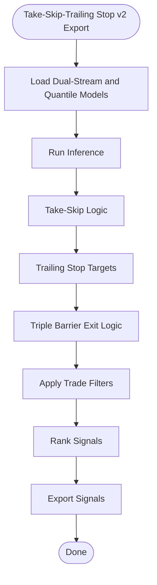

**Diagram sources**
- [API/export_take_skip_trailing_stop_v2_signals.py](file://API/export_take_skip_trailing_stop_v2_signals.py)
- [ML/models/take_skip_dual_stream_transformer.py](file://ML/models/take_skip_dual_stream_transformer.py)
- [ML/models/trailing_stop_target_quantile_transformer.py](file://ML/models/trailing_stop_target_quantile_transformer.py)
- [ML/tb_signal_logic.py](file://ML/tb_signal_logic.py)
- [ML/entry_path_trade_filter.py](file://ML/entry_path_trade_filter.py)

**Section sources**
- [API/export_take_skip_trailing_stop_v2_signals.py](file://API/export_take_skip_trailing_stop_v2_signals.py)
- [ML/models/take_skip_dual_stream_transformer.py](file://ML/models/take_skip_dual_stream_transformer.py)
- [ML/models/trailing_stop_target_quantile_transformer.py](file://ML/models/trailing_stop_target_quantile_transformer.py)
- [ML/tb_signal_logic.py](file://ML/tb_signal_logic.py)
- [ML/entry_path_trade_filter.py](file://ML/entry_path_trade_filter.py)

### Trade Filter Mechanisms
- Purpose: Apply quality gates and risk adjustments to ensure robust signals.
- Key aspects:
  - Confidence thresholds for model outputs
  - Feature-based quality checks
  - Risk parameters such as position sizing and stop levels
  - Ensemble weighting across multiple models

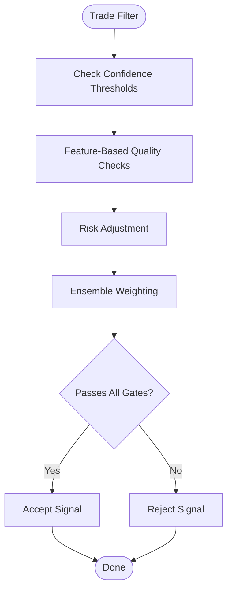

**Diagram sources**
- [ML/entry_path_trade_filter.py](file://ML/entry_path_trade_filter.py)

**Section sources**
- [ML/entry_path_trade_filter.py](file://ML/entry_path_trade_filter.py)

### Triple Barrier Signal Logic
- Purpose: Define exit conditions and target levels for take-skip and trailing stop strategies.
- Key aspects:
  - Time-based exits
  - Price-based take-profit and stop-loss
  - Dynamic trailing stops based on volatility

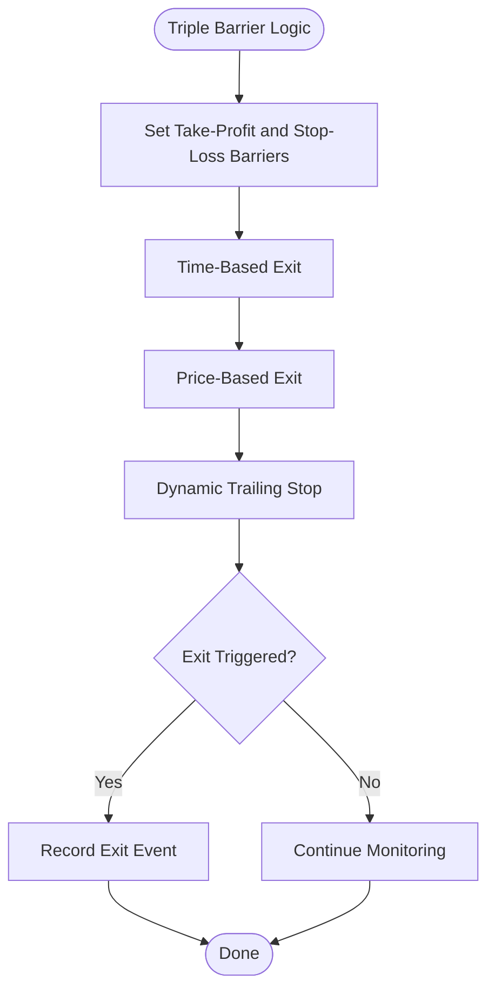

**Diagram sources**
- [ML/tb_signal_logic.py](file://ML/tb_signal_logic.py)

**Section sources**
- [ML/tb_signal_logic.py](file://ML/tb_signal_logic.py)

### Conformal Prediction Integration
- Purpose: Provide uncertainty quantification via predictive intervals and calibrated quantiles.
- Key aspects:
  - Calibration on validation sets
  - Quantile computation for confidence bands
  - Integration into signal filtering and ranking

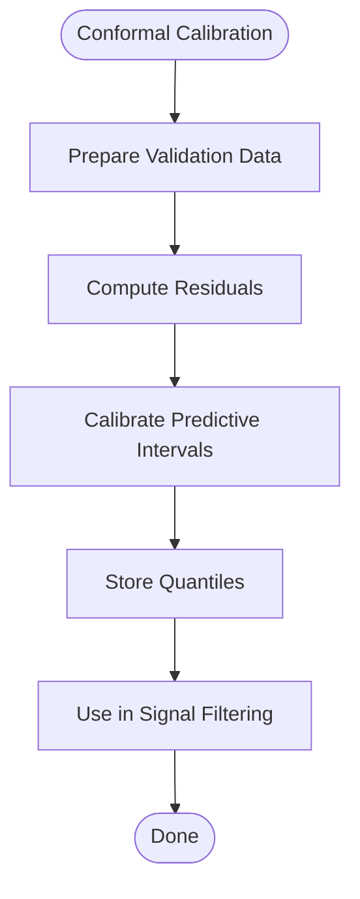

**Diagram sources**
- [ML/conformal/calibrate.py](file://ML/conformal/calibrate.py)
- [ML/conformal/conformal_quantiles.json](file://ML/conformal/conformal_quantiles.json)

**Section sources**
- [ML/conformal/calibrate.py](file://ML/conformal/calibrate.py)
- [ML/conformal/conformal_quantiles.json](file://ML/conformal/conformal_quantiles.json)

### Ensemble Approaches
- Purpose: Combine multiple model predictions to improve robustness and accuracy.
- Key aspects:
  - Weighted averaging or stacking of model outputs
  - N-boost techniques for quantile models
  - Benchmarking and evaluation of ensemble performance

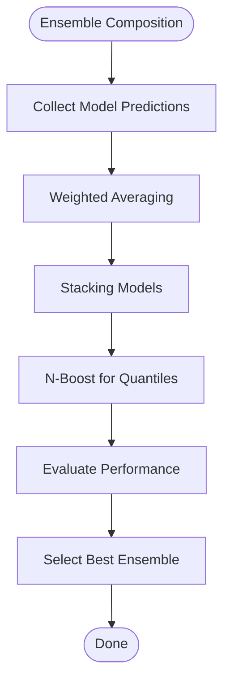

**Diagram sources**
- [ML/benchmark_entry_path_v1_quantile_n_boost.py](file://ML/benchmark_entry_path_v1_quantile_n_boost.py)
- [ML/benchmark_take_skip_trailing_stop_v2.py](file://ML/benchmark_take_skip_trailing_stop_v2.py)

**Section sources**
- [ML/benchmark_entry_path_v1_quantile_n_boost.py](file://ML/benchmark_entry_path_v1_quantile_n_boost.py)
- [ML/benchmark_take_skip_trailing_stop_v2.py](file://ML/benchmark_take_skip_trailing_stop_v2.py)

### Labeling and Consistency
- Purpose: Generate training labels and ensure consistency across signal pipelines.
- Key aspects:
  - Label generation for direction and outcomes
  - Consistency checks between labels and signals
  - Support for backtesting and forward testing

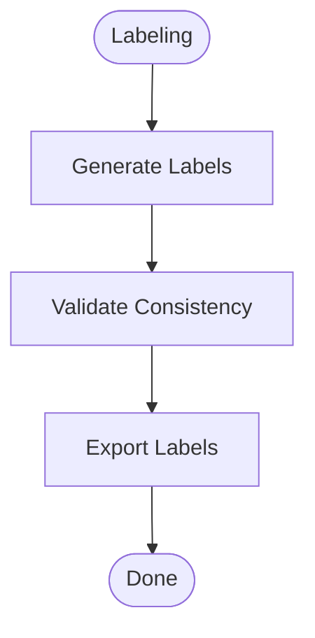

**Diagram sources**
- [processing/label_signals.py](file://processing/label_signals.py)

**Section sources**
- [processing/label_signals.py](file://processing/label_signals.py)

### Diagnostics and Tracing
- Purpose: Provide debugging tools and performance attribution for signals.
- Key aspects:
  - Signal tracing for audit trails
  - Performance metrics and attribution
  - Visualization and reporting

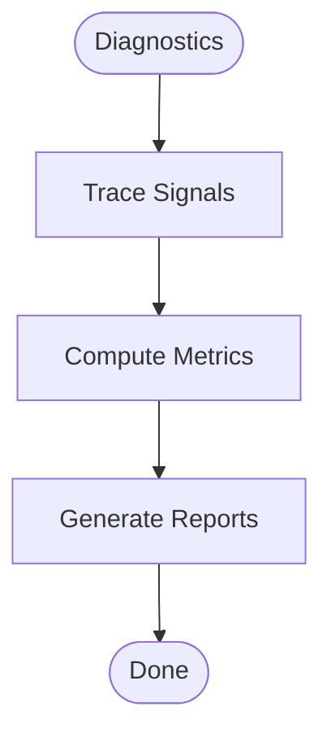

**Diagram sources**
- [statistics/signal_tracer.py](file://statistics/signal_tracer.py)

**Section sources**
- [statistics/signal_tracer.py](file://statistics/signal_tracer.py)

## Dependency Analysis
The signal generation system has clear dependencies between components:
- API layer depends on ML exporters and filters
- ML exporters depend on models and calibration
- Processing layer supports labeling and feature preparation
- Statistics layer provides diagnostics and tracing

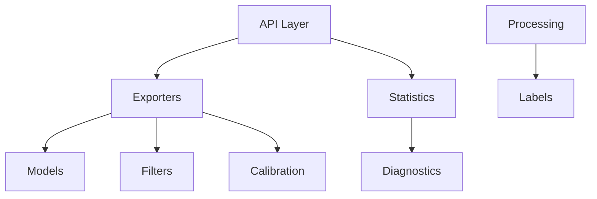

**Diagram sources**
- [API/generate_signals.py](file://API/generate_signals.py)
- [API/export_entry_path_v1_signals.py](file://API/export_entry_path_v1_signals.py)
- [API/export_entry_path_v1_quantile_signals.py](file://API/export_entry_path_v1_quantile_signals.py)
- [API/export_take_skip_trailing_stop_v2_signals.py](file://API/export_take_skip_trailing_stop_v2_signals.py)
- [ML/entry_path_trade_filter.py](file://ML/entry_path_trade_filter.py)
- [ML/conformal/calibrate.py](file://ML/conformal/calibrate.py)
- [processing/label_signals.py](file://processing/label_signals.py)
- [statistics/signal_tracer.py](file://statistics/signal_tracer.py)

**Section sources**
- [API/generate_signals.py](file://API/generate_signals.py)
- [API/export_entry_path_v1_signals.py](file://API/export_entry_path_v1_signals.py)
- [API/export_entry_path_v1_quantile_signals.py](file://API/export_entry_path_v1_quantile_signals.py)
- [API/export_take_skip_trailing_stop_v2_signals.py](file://API/export_take_skip_trailing_stop_v2_signals.py)
- [ML/entry_path_trade_filter.py](file://ML/entry_path_trade_filter.py)
- [ML/conformal/calibrate.py](file://ML/conformal/calibrate.py)
- [processing/label_signals.py](file://processing/label_signals.py)
- [statistics/signal_tracer.py](file://statistics/signal_tracer.py)

## Performance Considerations
- Model inference efficiency: Use batch processing and optimized model loading
- Filtering overhead: Minimize computational cost in trade filters
- Calibration latency: Precompute quantiles where possible
- Ensemble complexity: Balance model count with performance requirements
- Real-time constraints: Ensure low-latency signal generation for live trading

## Troubleshooting Guide
Common issues and solutions:
- Model loading errors: Verify model paths and versions
- Calibration failures: Check validation data and residual computation
- Filter rejections: Adjust confidence thresholds and quality gates
- Export format errors: Validate output schema and field types
- Diagnostics gaps: Ensure tracing is enabled and logs are captured

**Section sources**
- [statistics/signal_tracer.py](file://statistics/signal_tracer.py)
- [ML/conformal/calibrate.py](file://ML/conformal/calibrate.py)
- [ML/entry_path_trade_filter.py](file://ML/entry_path_trade_filter.py)

## Conclusion
SoSimple’s signal generation system provides a robust, modular pipeline for creating high-quality trading signals. It integrates advanced models, uncertainty quantification, and comprehensive diagnostics to support both research and production environments. The documented components and workflows enable users to configure, monitor, and optimize signal generation for diverse trading strategies.

## Appendices
- Configuration parameters for each exporter and filter
- Output format specifications for signals and reports
- Examples of signal generation workflows and use cases
- Integration guidelines for execution systems