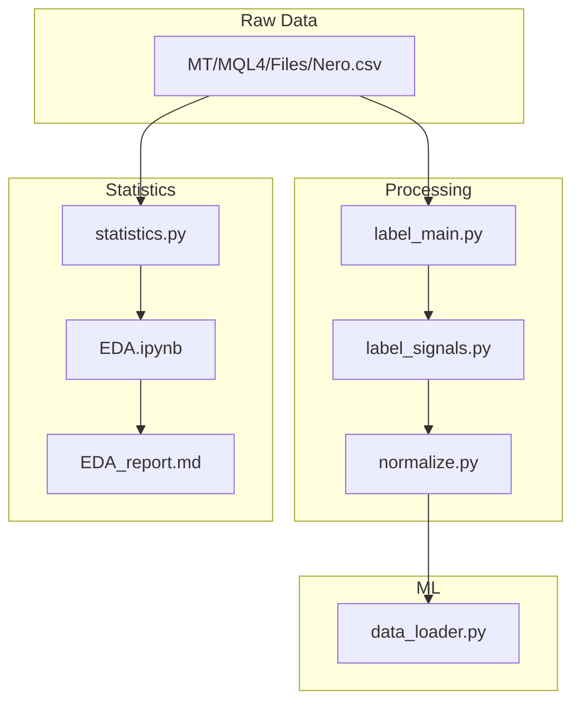
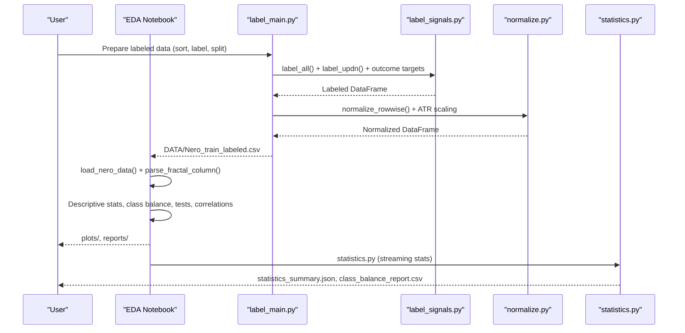
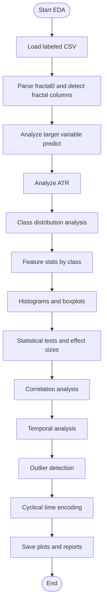
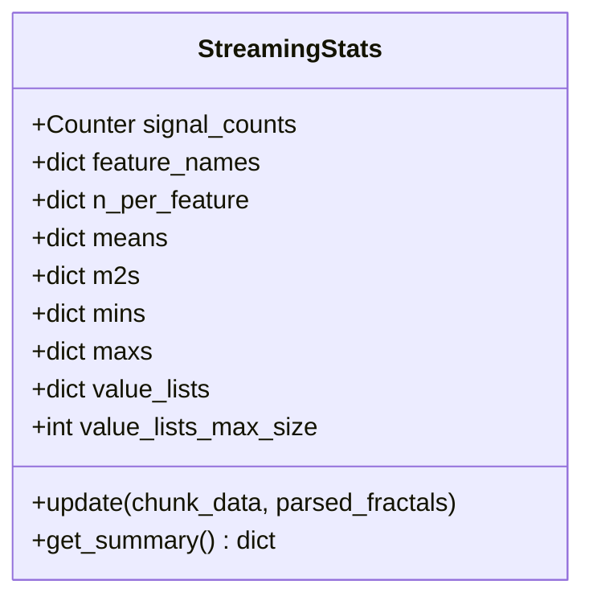
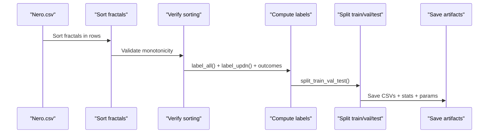
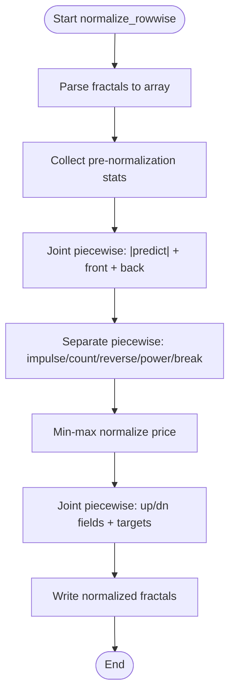
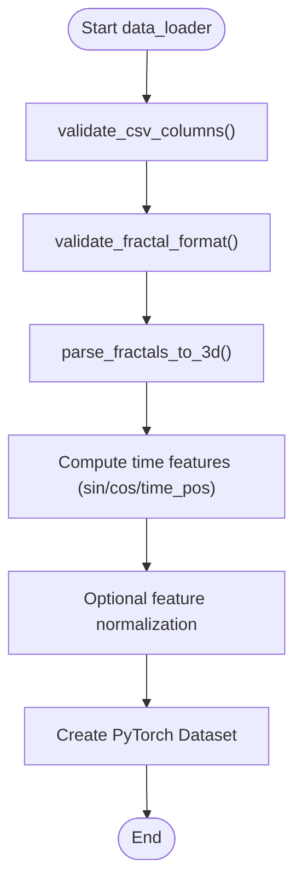
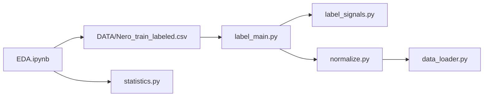

# Exploratory Data Analysis

<cite>
**Referenced Files in This Document**
- [EDA.ipynb](file://statistics/EDA.ipynb)
- [README.md](file://statistics/README.md)
- [EDA_report.md](file://statistics/reports/EDA_report.md)
- [statistics.py](file://statistics/statistics.py)
- [label_main.py](file://processing/label_main.py)
- [label_signals.py](file://processing/label_signals.py)
- [normalize.py](file://processing/normalize.py)
- [data_loader.py](file://ML/data_loader.py)
</cite>

## Table of Contents
1. [Introduction](#introduction)
2. [Project Structure](#project-structure)
3. [Core Components](#core-components)
4. [Architecture Overview](#architecture-overview)
5. [Detailed Component Analysis](#detailed-component-analysis)
6. [Dependency Analysis](#dependency-analysis)
7. [Performance Considerations](#performance-considerations)
8. [Troubleshooting Guide](#troubleshooting-guide)
9. [Conclusion](#conclusion)

## Introduction
This document provides a comprehensive guide to the SoSimple trading system's Exploratory Data Analysis (EDA) workflow. It covers the complete pipeline from raw market data to validated labeled datasets, statistical summaries, and visual diagnostics. The focus areas include data loading and parsing, validation procedures, statistical analysis methodologies for feature distributions, class balance assessment, correlation studies, and visualization techniques such as histograms, boxplots, and t-SNE embeddings. Practical guidance is included for running the EDA notebook, interpreting results, and identifying data quality issues. Statistical tests, normality assessments, and outlier detection methods are explained with concrete examples drawn from the repository.

## Project Structure
The EDA workflow spans several modules:
- Statistics: EDA notebook and scripts for streaming statistics and reporting
- Processing: Data preparation, labeling, and normalization
- ML: Data loaders and validators for downstream training
- Reports: Executed notebooks and markdown reports

**Diagram sources**
- [label_main.py:205-332](file://processing/label_main.py#L205-L332)
- [label_signals.py:147-325](file://processing/label_signals.py#L147-L325)
- [normalize.py:284-510](file://processing/normalize.py#L284-L510)
- [statistics.py:208-442](file://statistics/statistics.py#L208-L442)
- [EDA.ipynb:110-274](file://statistics/EDA.ipynb#L110-L274)
- [EDA_report.md:1-120](file://statistics/reports/EDA_report.md#L1-L120)
- [data_loader.py:549-800](file://ML/data_loader.py#L549-L800)

**Section sources**
- [README.md:1-49](file://statistics/README.md#L1-L49)
- [EDA.ipynb:1-110](file://statistics/EDA.ipynb#L1-L110)
- [EDA_report.md:1-120](file://statistics/reports/EDA_report.md#L1-L120)

## Core Components
- EDA notebook: Loads labeled training data, parses fractal features, performs descriptive statistics, class balance analysis, statistical tests, correlation analysis, temporal pattern exploration, and outlier detection. It generates plots and reports.
- Statistics module: Provides streaming statistics with Welford’s method and reservoir sampling, generating summary statistics, class balance reports, feature distributions, stratified samples, and class-specific statistics.
- Labeling pipeline: Prepares raw data by sorting fractals, validating order, computing labels (signal, predict, up/dn targets, outcome-aligned targets), and splitting into train/validation/test sets.
- Normalization: Applies row-wise piecewise linear-log transforms and robust scaling to prepare features for modeling while preserving directionality and avoiding data leakage.
- Data loader: Validates CSV structure, parses fractal sequences into 3D tensors, computes time features, and prepares PyTorch datasets with optional feature normalization.

**Section sources**
- [EDA.ipynb:110-274](file://statistics/EDA.ipynb#L110-L274)
- [statistics.py:51-167](file://statistics/statistics.py#L51-L167)
- [label_main.py:205-332](file://processing/label_main.py#L205-L332)
- [label_signals.py:147-325](file://processing/label_signals.py#L147-L325)
- [normalize.py:284-510](file://processing/normalize.py#L284-L510)
- [data_loader.py:248-327](file://ML/data_loader.py#L248-L327)

## Architecture Overview
The EDA workflow integrates preprocessing, labeling, normalization, and statistical analysis to produce diagnostic insights and artifacts for model development.

**Diagram sources**
- [label_main.py:205-332](file://processing/label_main.py#L205-L332)
- [label_signals.py:147-325](file://processing/label_signals.py#L147-L325)
- [normalize.py:284-510](file://processing/normalize.py#L284-L510)
- [EDA.ipynb:110-274](file://statistics/EDA.ipynb#L110-L274)
- [statistics.py:208-442](file://statistics/statistics.py#L208-L442)

## Detailed Component Analysis

### EDA Notebook Workflow
The EDA notebook orchestrates the end-to-end analysis:
- Data loading and parsing: Reads labeled CSV, detects fractal columns, and parses the first fractal column into structured features.
- Target variable analysis: Computes descriptive statistics for predict and visualizes distributions by signal class.
- ATR analysis: Summarizes ATR statistics, temporal dynamics, and correlations with volatility features.
- Class distribution: Visualizes absolute and percentage distributions, highlighting severe class imbalance.
- Feature statistics by class: Computes descriptive statistics for each feature across signal classes and saves results.
- Visualizations: Generates histograms and boxplots for feature distributions by class.
- Statistical tests: Performs pairwise comparisons between classes using appropriate tests and effect size estimation.
- Correlation analysis: Computes correlation matrices by class and cross-fractal correlations.
- Temporal analysis: Explores time ranges, seasonal patterns, inter-event intervals, and clustering.
- Outlier detection: Applies IQR and quantile-based methods, correlates outliers with volatility, and visualizes distributions.
- Time feature encoding: Demonstrates cyclical encoding for hours and days of week.

**Diagram sources**
- [EDA.ipynb:110-274](file://statistics/EDA.ipynb#L110-L274)
- [EDA.ipynb:288-372](file://statistics/EDA.ipynb#L288-L372)
- [EDA.ipynb:390-473](file://statistics/EDA.ipynb#L390-L473)
- [EDA.ipynb:491-545](file://statistics/EDA.ipynb#L491-L545)
- [EDA.ipynb:560-621](file://statistics/EDA.ipynb#L560-L621)
- [EDA_ipynb:632-755](file://statistics/EDA.ipynb#L632-L755)
- [EDA.ipynb:771-800](file://statistics/EDA.ipynb#L771-L800)

**Section sources**
- [EDA.ipynb:110-274](file://statistics/EDA.ipynb#L110-L274)
- [EDA.ipynb:288-372](file://statistics/EDA.ipynb#L288-L372)
- [EDA.ipynb:390-473](file://statistics/EDA.ipynb#L390-L473)
- [EDA.ipynb:491-545](file://statistics/EDA.ipynb#L491-L545)
- [EDA.ipynb:560-621](file://statistics/EDA.ipynb#L560-L621)
- [EDA.ipynb:632-755](file://statistics/EDA.ipynb#L632-L755)
- [EDA_report.md:110-210](file://statistics/reports/EDA_report.md#L110-L210)

### Streaming Statistics Module
The statistics module performs streaming analytics on large datasets:
- Uses Welford’s online algorithm for mean/variance computation per feature.
- Employs reservoir sampling to maintain representative quantile samples.
- Aggregates class distributions and feature statistics across chunks.
- Produces summary JSON, class balance CSV, feature distributions CSV, and a stratified sample CSV.

**Diagram sources**
- [statistics.py:51-167](file://statistics/statistics.py#L51-L167)

**Section sources**
- [statistics.py:51-167](file://statistics/statistics.py#L51-L167)
- [statistics.py:208-442](file://statistics/statistics.py#L208-L442)

### Labeling Pipeline
The labeling pipeline ensures data quality and consistency:
- Sorts fractals per row and validates ordering.
- Computes labels: signal (direction), predict (strength), up/dn horizons, outcome-aligned targets, and triple barrier targets.
- Splits data into train/validation/test sets while preserving temporal order.
- Saves normalized statistics and per-row parameters for denormalization.

**Diagram sources**
- [label_main.py:79-162](file://processing/label_main.py#L79-L162)
- [label_main.py:205-332](file://processing/label_main.py#L205-L332)
- [label_signals.py:147-325](file://processing/label_signals.py#L147-L325)

**Section sources**
- [label_main.py:79-162](file://processing/label_main.py#L79-L162)
- [label_main.py:205-332](file://processing/label_main.py#L205-L332)
- [label_signals.py:147-325](file://processing/label_signals.py#L147-L325)

### Normalization Module
Normalization preserves directionality and mitigates heavy tails:
- Applies row-wise piecewise linear-log transforms to front/back/predict and separate features.
- Uses min-max normalization for price.
- Maintains per-row parameters for up/dn normalization and potential denormalization.
- Provides robust ATR scaling with separate train/inference steps.

**Diagram sources**
- [normalize.py:284-510](file://processing/normalize.py#L284-L510)

**Section sources**
- [normalize.py:284-510](file://processing/normalize.py#L284-L510)
- [normalize.py:596-662](file://processing/normalize.py#L596-L662)

### Data Loader Validation
The data loader validates input contracts and parses sequences:
- Validates CSV columns and fractal field schemas.
- Parses 100 fractal columns into 3D tensors with time features and ATR ratios.
- Applies optional feature normalization and creates PyTorch datasets.

**Diagram sources**
- [data_loader.py:248-285](file://ML/data_loader.py#L248-L285)
- [data_loader.py:331-424](file://ML/data_loader.py#L331-L424)
- [data_loader.py:427-468](file://ML/data_loader.py#L427-L468)
- [data_loader.py:473-544](file://ML/data_loader.py#L473-L544)

**Section sources**
- [data_loader.py:248-285](file://ML/data_loader.py#L248-L285)
- [data_loader.py:331-424](file://ML/data_loader.py#L331-L424)
- [data_loader.py:427-468](file://ML/data_loader.py#L427-L468)
- [data_loader.py:473-544](file://ML/data_loader.py#L473-L544)

## Dependency Analysis
The EDA workflow depends on:
- Input data: labeled CSV produced by the preprocessing pipeline
- Internal dependencies: label_main, label_signals, normalize modules
- External libraries: pandas, numpy, matplotlib, seaborn, scipy, scikit-learn
- Downstream consumers: ML data loaders and training pipelines

**Diagram sources**
- [EDA.ipynb:110-274](file://statistics/EDA.ipynb#L110-L274)
- [label_main.py:205-332](file://processing/label_main.py#L205-L332)
- [label_signals.py:147-325](file://processing/label_signals.py#L147-L325)
- [normalize.py:284-510](file://processing/normalize.py#L284-L510)
- [statistics.py:208-442](file://statistics/statistics.py#L208-L442)
- [data_loader.py:549-800](file://ML/data_loader.py#L549-L800)

**Section sources**
- [EDA.ipynb:110-274](file://statistics/EDA.ipynb#L110-L274)
- [README.md:17-38](file://statistics/README.md#L17-L38)

## Performance Considerations
- Streaming statistics: Welford’s algorithm and reservoir sampling enable processing large CSV files without loading entire datasets into memory.
- Vectorized parsing: The data loader uses vectorized string splitting and numeric conversion for efficient fractal parsing.
- Memory footprint: EDA notebook loads a subset of features for initial analysis; full 3D tensor creation occurs in ML data loaders for training.
- Visualization efficiency: Batch generation of plots reduces repeated computations and leverages caching for executed notebooks.

[No sources needed since this section provides general guidance]

## Troubleshooting Guide
Common issues and resolutions:
- Missing or misaligned fractal columns: The data loader validates expected columns and fractal field schemas; ensure the CSV matches the expected contract.
- Empty or malformed fractal entries: The EDA parser returns None for invalid entries; verify input formatting and handle missing values appropriately.
- Severe class imbalance: The EDA highlights extreme imbalance in signal classes; consider resampling or cost-sensitive metrics during modeling.
- Outliers and extreme values: IQR and quantile-based methods identify outliers; investigate whether they represent data errors or genuine market events.
- Temporal inconsistencies: Sorting verification ensures fractal timestamps decrease monotonically within rows; fix any violations before proceeding.

**Section sources**
- [data_loader.py:248-285](file://ML/data_loader.py#L248-L285)
- [label_main.py:79-130](file://processing/label_main.py#L79-L130)
- [EDA_report.md:557-604](file://statistics/reports/EDA_report.md#L557-L604)

## Conclusion
The SoSimple EDA workflow provides a robust foundation for understanding the Nero dataset characteristics, validating data quality, and preparing labeled data for machine learning. By combining descriptive statistics, targeted visualizations, statistical tests, and rigorous validation, practitioners can identify data issues, assess feature relevance, and establish baselines for model development. The modular design ensures reproducibility and scalability across datasets and tasks.