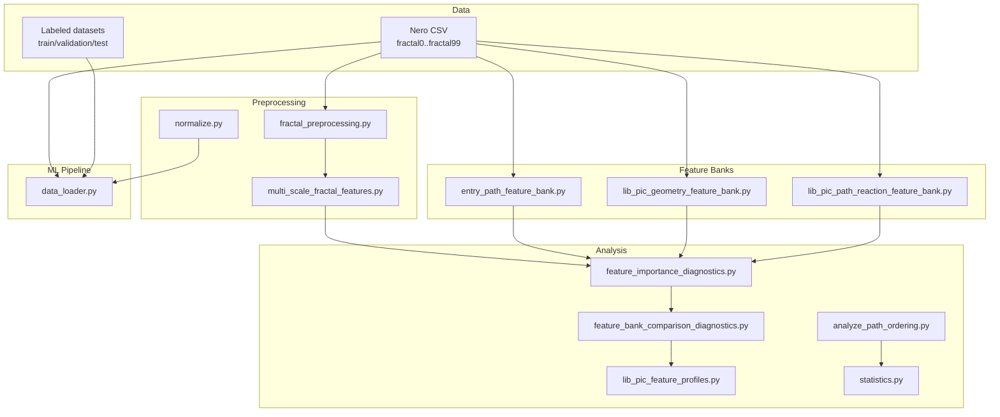
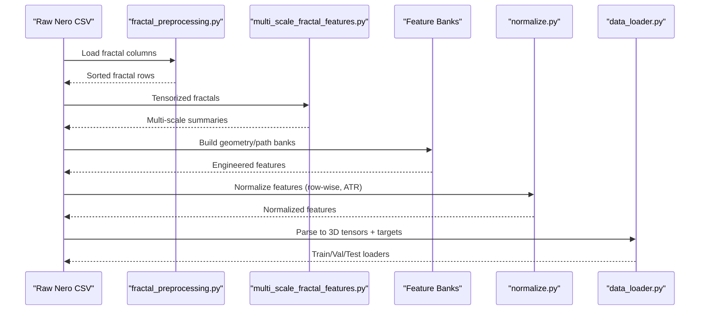
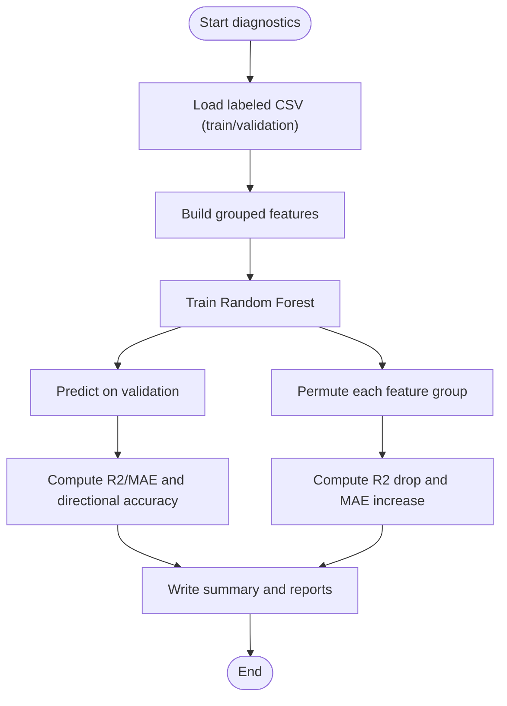
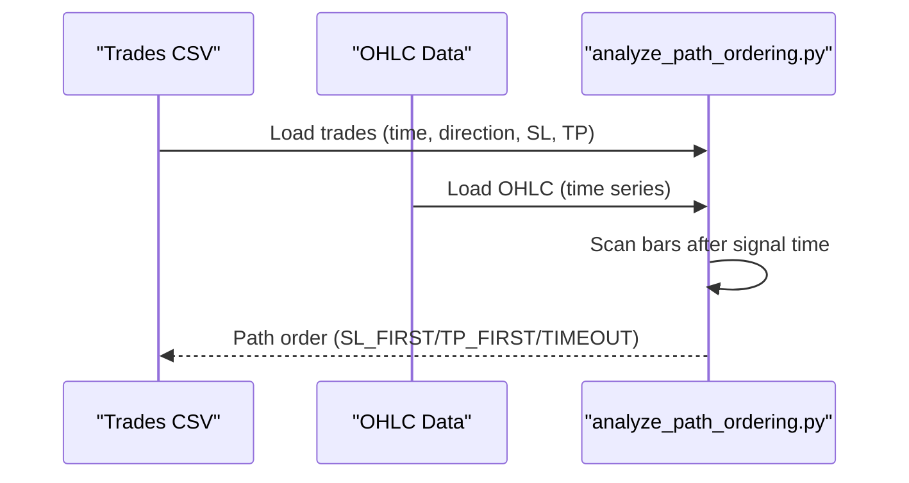
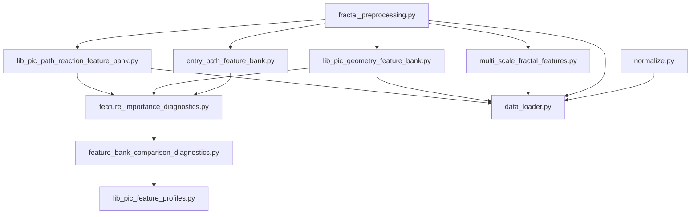

# Feature Engineering and Analysis

<cite>
**Referenced Files in This Document**
- [feature_catalog.json](file://statistics/feature_catalog.json)
- [fractal_preprocessing.py](file://processing/fractal_preprocessing.py)
- [multi_scale_fractal_features.py](file://ML/multi_scale_fractal_features.py)
- [entry_path_feature_bank.py](file://ML/entry_path_feature_bank.py)
- [lib_pic_geometry_feature_bank.py](file://ML/lib_pic_geometry_feature_bank.py)
- [lib_pic_path_reaction_feature_bank.py](file://ML/lib_pic_path_reaction_feature_bank.py)
- [analyze_path_ordering.py](file://statistics/analyze_path_ordering.py)
- [feature_importance_diagnostics.py](file://ML/feature_importance_diagnostics.py)
- [feature_bank_comparison_diagnostics.py](file://ML/feature_bank_comparison_diagnostics.py)
- [lib_pic_feature_profiles.py](file://ML/lib_pic_feature_profiles.py)
- [normalize.py](file://processing/normalize.py)
- [statistics.py](file://statistics/statistics.py)
- [data_loader.py](file://ML/data_loader.py)
- [test_feature_importance_diagnostics.py](file://tests/test_feature_importance_diagnostics.py)
- [test_feature_bank_comparison_diagnostics.py](file://tests/test_feature_bank_comparison_diagnostics.py)
</cite>

## Table of Contents
1. [Introduction](#introduction)
2. [Project Structure](#project-structure)
3. [Core Components](#core-components)
4. [Architecture Overview](#architecture-overview)
5. [Detailed Component Analysis](#detailed-component-analysis)
6. [Dependency Analysis](#dependency-analysis)
7. [Performance Considerations](#performance-considerations)
8. [Troubleshooting Guide](#troubleshooting-guide)
9. [Conclusion](#conclusion)

## Introduction
This document describes the feature engineering and analysis methodologies used in the SoSimple trading system. It covers the complete feature catalog structure, including fractal feature definitions, technical indicators, and derived metrics. It also explains feature importance analysis techniques, correlation studies, and dimensionality reduction approaches. The document details path ordering analysis methodology for understanding feature contribution sequences, and provides comprehensive coverage of statistical tests for feature significance, variance analysis, and multicollinearity detection. Practical examples of feature transformation, normalization techniques, and feature selection criteria are included, along with guidance on integrating technical indicators with machine learning models and validating feature engineering pipelines.

## Project Structure
The feature engineering pipeline spans several modules:
- Fractal preprocessing and multi-scale feature extraction
- Feature banks for geometry and path reaction
- Feature importance diagnostics and comparative analysis
- Normalization and data loading for ML training
- Statistical analysis and path ordering studies

**Diagram sources**
- [fractal_preprocessing.py:1-86](file://processing/fractal_preprocessing.py#L1-L86)
- [multi_scale_fractal_features.py:1-39](file://ML/multi_scale_fractal_features.py#L1-L39)
- [entry_path_feature_bank.py:1-109](file://ML/entry_path_feature_bank.py#L1-L109)
- [lib_pic_geometry_feature_bank.py:1-206](file://ML/lib_pic_geometry_feature_bank.py#L1-L206)
- [lib_pic_path_reaction_feature_bank.py:1-225](file://ML/lib_pic_path_reaction_feature_bank.py#L1-L225)
- [feature_importance_diagnostics.py:1-439](file://ML/feature_importance_diagnostics.py#L1-L439)
- [feature_bank_comparison_diagnostics.py:1-245](file://ML/feature_bank_comparison_diagnostics.py#L1-L245)
- [lib_pic_feature_profiles.py:1-102](file://ML/lib_pic_feature_profiles.py#L1-L102)
- [analyze_path_ordering.py:1-197](file://statistics/analyze_path_ordering.py#L1-L197)
- [statistics.py:1-477](file://statistics/statistics.py#L1-L477)
- [data_loader.py:1-1210](file://ML/data_loader.py#L1-L1210)

**Section sources**
- [fractal_preprocessing.py:1-86](file://processing/fractal_preprocessing.py#L1-L86)
- [multi_scale_fractal_features.py:1-39](file://ML/multi_scale_fractal_features.py#L1-L39)
- [entry_path_feature_bank.py:1-109](file://ML/entry_path_feature_bank.py#L1-L109)
- [lib_pic_geometry_feature_bank.py:1-206](file://ML/lib_pic_geometry_feature_bank.py#L1-L206)
- [lib_pic_path_reaction_feature_bank.py:1-225](file://ML/lib_pic_path_reaction_feature_bank.py#L1-L225)
- [feature_importance_diagnostics.py:1-439](file://ML/feature_importance_diagnostics.py#L1-L439)
- [feature_bank_comparison_diagnostics.py:1-245](file://ML/feature_bank_comparison_diagnostics.py#L1-L245)
- [lib_pic_feature_profiles.py:1-102](file://ML/lib_pic_feature_profiles.py#L1-L102)
- [analyze_path_ordering.py:1-197](file://statistics/analyze_path_ordering.py#L1-L197)
- [statistics.py:1-477](file://statistics/statistics.py#L1-L477)
- [data_loader.py:1-1210](file://ML/data_loader.py#L1-L1210)

## Core Components
This section documents the feature catalog structure and the primary feature engineering modules.

- Feature Catalog Structure
  - The feature catalog organizes features by type and includes metadata such as window sizes, base features, aggregations, and importance scores. See [feature_catalog.json:1-800](file://statistics/feature_catalog.json#L1-L800) for the complete catalog.
  - Example entries include rolling statistics (e.g., z-scores, percentiles), trend indicators (e.g., slopes), geometric ratios, and interaction features.

- Fractal Preprocessing
  - Sorts fractal columns by time suffix and ensures consistent ordering across rows. See [fractal_preprocessing.py:65-86](file://processing/fractal_preprocessing.py#L65-L86).

- Multi-Scale Fractal Features
  - Builds multi-scale window summaries from the fractal tensor, computing means, standard deviations, slopes, and ranges across sliding windows. See [multi_scale_fractal_features.py:18-39](file://ML/multi_scale_fractal_features.py#L18-L39).

- Entry Path Feature Bank
  - Computes row-wise statistics over recent fractals, including shares, direction balance, and impulse/power metrics across multiple windows. See [entry_path_feature_bank.py:84-109](file://ML/entry_path_feature_bank.py#L84-L109).

- Geometry Feature Bank
  - Derives geometry-based features from fractal fields (front/back/reverse), including ratios, balances, and size measures across windows. See [lib_pic_geometry_feature_bank.py:159-206](file://ML/lib_pic_geometry_feature_bank.py#L159-L206).

- Path Reaction Feature Bank
  - Computes historical reaction metrics (Up/Dn) across multiple horizons and derives derived quantities such as favorability, advancement, and slope differences. See [lib_pic_path_reaction_feature_bank.py:179-225](file://ML/lib_pic_path_reaction_feature_bank.py#L179-L225).

**Section sources**
- [feature_catalog.json:1-800](file://statistics/feature_catalog.json#L1-L800)
- [fractal_preprocessing.py:22-86](file://processing/fractal_preprocessing.py#L22-L86)
- [multi_scale_fractal_features.py:9-39](file://ML/multi_scale_fractal_features.py#L9-L39)
- [entry_path_feature_bank.py:30-109](file://ML/entry_path_feature_bank.py#L30-L109)
- [lib_pic_geometry_feature_bank.py:31-206](file://ML/lib_pic_geometry_feature_bank.py#L31-L206)
- [lib_pic_path_reaction_feature_bank.py:102-225](file://ML/lib_pic_path_reaction_feature_bank.py#L102-L225)

## Architecture Overview
The feature engineering pipeline integrates fractal parsing, feature derivation, normalization, and ML-ready data loading.

**Diagram sources**
- [fractal_preprocessing.py:65-86](file://processing/fractal_preprocessing.py#L65-L86)
- [multi_scale_fractal_features.py:18-39](file://ML/multi_scale_fractal_features.py#L18-L39)
- [lib_pic_geometry_feature_bank.py:159-206](file://ML/lib_pic_geometry_feature_bank.py#L159-L206)
- [lib_pic_path_reaction_feature_bank.py:179-225](file://ML/lib_pic_path_reaction_feature_bank.py#L179-L225)
- [normalize.py:284-511](file://processing/normalize.py#L284-L511)
- [data_loader.py:331-425](file://ML/data_loader.py#L331-L425)

## Detailed Component Analysis

### Feature Catalog and Types
- Organization
  - Features are categorized by type (e.g., relative_feature, trend_indicator, rolling_statistic, directional_pattern, interaction_feature, time_based).
  - Each entry includes window size, base feature, aggregation method, and importance metrics (rank, correlation, mutual information, score).
- Practical Use
  - Enables quick filtering by category and ranking by importance for downstream selection and diagnostics.

**Section sources**
- [feature_catalog.json:1-800](file://statistics/feature_catalog.json#L1-L800)

### Fractal Preprocessing
- Purpose
  - Ensures consistent temporal ordering of fractal fields across rows and cleans malformed entries.
- Implementation Highlights
  - Parses fractal strings, sorts by embedded time, and fills missing positions with empty strings.

**Section sources**
- [fractal_preprocessing.py:22-86](file://processing/fractal_preprocessing.py#L22-L86)

### Multi-Scale Fractal Features
- Purpose
  - Extracts robust summaries across multiple time horizons from the fractal tensor.
- Implementation Highlights
  - Sliding window extraction, per-window aggregation (mean, std, last minus mean, slope, range), and NaN-to-num conversion.

**Section sources**
- [multi_scale_fractal_features.py:9-39](file://ML/multi_scale_fractal_features.py#L9-L39)

### Entry Path Feature Bank
- Purpose
  - Produces row-level statistics over recent fractals for entry path modeling.
- Implementation Highlights
  - Parses fractal fields, computes rolling means/stds and directional shares across windows, and joins back to the original frame.

**Section sources**
- [entry_path_feature_bank.py:30-109](file://ML/entry_path_feature_bank.py#L30-L109)

### Geometry Feature Bank
- Purpose
  - Derives geometry-derived features from front/back/reverse fields and ATR, including ratios, balances, and size measures.
- Implementation Highlights
  - Windowed computation of means, stds, recent values, and derived metrics with safe handling of infinite/NaN values.

**Section sources**
- [lib_pic_geometry_feature_bank.py:105-206](file://ML/lib_pic_geometry_feature_bank.py#L105-L206)

### Path Reaction Feature Bank
- Purpose
  - Captures historical reaction of price after levels (Up/Dn) across multiple horizons and computes derived measures.
- Implementation Highlights
  - Aggregates favorability, advancement, and slope differences across horizons with robust normalization.

**Section sources**
- [lib_pic_path_reaction_feature_bank.py:136-225](file://ML/lib_pic_path_reaction_feature_bank.py#L136-L225)

### Feature Importance Diagnostics
- Purpose
  - Provides group-wise and individual feature importance using a tree-based model on grouped features derived from fractals.
- Methodology
  - Builds grouped features by semantic groups (price position, geometry, strength, path reactions, etc.), trains a Random Forest regressor, and evaluates using permutation-based importance and standard metrics.
- Outputs
  - Group importance CSV, individual feature importance CSV, summary JSON, and Markdown report.

**Diagram sources**
- [feature_importance_diagnostics.py:260-336](file://ML/feature_importance_diagnostics.py#L260-L336)

**Section sources**
- [feature_importance_diagnostics.py:1-439](file://ML/feature_importance_diagnostics.py#L1-L439)

### Feature Bank Comparison Diagnostics
- Purpose
  - Compares multiple feature profiles (baseline_full, baseline_clean, baseline_full_path, baseline_clean_path, baseline_clean_geometry_path) using a read-only evaluation.
- Methodology
  - Builds feature parts once (baseline, geometry, path), then assembles variants and evaluates with a Random Forest model.
- Outputs
  - Summary CSV/JSON/Markdown with validation R2 and directional accuracy for each variant.

**Section sources**
- [feature_bank_comparison_diagnostics.py:1-245](file://ML/feature_bank_comparison_diagnostics.py#L1-L245)
- [lib_pic_feature_profiles.py:57-102](file://ML/lib_pic_feature_profiles.py#L57-L102)

### Path Ordering Analysis
- Purpose
  - Determines whether Stop Loss or Take Profit is hit first during a trade by scanning OHLC bars after the signal time.
- Methodology
  - Loads OHLC and trades, scans a fixed number of bars post-signal, and compares distances to decide first barrier hit or timeout.

**Diagram sources**
- [analyze_path_ordering.py:43-75](file://statistics/analyze_path_ordering.py#L43-L75)

**Section sources**
- [analyze_path_ordering.py:1-197](file://statistics/analyze_path_ordering.py#L1-L197)

### Normalization Techniques
- Purpose
  - Applies row-wise normalization for fractal features and global normalization for ATR to reduce leakage and stabilize training.
- Methods
  - Piecewise linear-log normalization for heavy-tailed features (front, back, impulse, count, reverse, power, break, predict).
  - Min-Max normalization for price.
  - RobustScaler for ATR (global fit on train, transform on val/test).
- Implementation Details
  - Separate handling for joint normalization pools (predict + front + back) and Up/Dn targets.

**Section sources**
- [normalize.py:284-511](file://processing/normalize.py#L284-L511)
- [normalize.py:596-663](file://processing/normalize.py#L596-L663)

### Statistical Analysis and Variance
- Purpose
  - Performs streaming statistics over large CSV files, computes online means/variances, and generates distribution summaries and stratified samples.
- Methodology
  - Uses Welford’s online algorithm for numerical stability and reservoir sampling for quantile estimation.

**Section sources**
- [statistics.py:51-167](file://statistics/statistics.py#L51-L167)
- [statistics.py:208-477](file://statistics/statistics.py#L208-L477)

### Data Loading and Validation
- Purpose
  - Parses fractal CSV into 3D tensors, computes time-based features, applies optional StandardScaler, and validates data integrity.
- Methodology
  - Validates fractal format and CSV columns, constructs padding masks, and supports caching for fast reloads.

**Section sources**
- [data_loader.py:248-327](file://ML/data_loader.py#L248-L327)
- [data_loader.py:331-425](file://ML/data_loader.py#L331-L425)
- [data_loader.py:549-925](file://ML/data_loader.py#L549-L925)

## Dependency Analysis
This section maps dependencies among feature engineering components and their integration points.

**Diagram sources**
- [fractal_preprocessing.py:65-86](file://processing/fractal_preprocessing.py#L65-L86)
- [multi_scale_fractal_features.py:18-39](file://ML/multi_scale_fractal_features.py#L18-L39)
- [entry_path_feature_bank.py:84-109](file://ML/entry_path_feature_bank.py#L84-L109)
- [lib_pic_geometry_feature_bank.py:159-206](file://ML/lib_pic_geometry_feature_bank.py#L159-L206)
- [lib_pic_path_reaction_feature_bank.py:179-225](file://ML/lib_pic_path_reaction_feature_bank.py#L179-L225)
- [feature_importance_diagnostics.py:260-336](file://ML/feature_importance_diagnostics.py#L260-L336)
- [feature_bank_comparison_diagnostics.py:107-158](file://ML/feature_bank_comparison_diagnostics.py#L107-L158)
- [lib_pic_feature_profiles.py:78-102](file://ML/lib_pic_feature_profiles.py#L78-L102)
- [normalize.py:284-511](file://processing/normalize.py#L284-L511)
- [data_loader.py:331-425](file://ML/data_loader.py#L331-L425)

**Section sources**
- [fractal_preprocessing.py:1-86](file://processing/fractal_preprocessing.py#L1-L86)
- [multi_scale_fractal_features.py:1-39](file://ML/multi_scale_fractal_features.py#L1-L39)
- [entry_path_feature_bank.py:1-109](file://ML/entry_path_feature_bank.py#L1-L109)
- [lib_pic_geometry_feature_bank.py:1-206](file://ML/lib_pic_geometry_feature_bank.py#L1-L206)
- [lib_pic_path_reaction_feature_bank.py:1-225](file://ML/lib_pic_path_reaction_feature_bank.py#L1-L225)
- [feature_importance_diagnostics.py:1-439](file://ML/feature_importance_diagnostics.py#L1-L439)
- [feature_bank_comparison_diagnostics.py:1-245](file://ML/feature_bank_comparison_diagnostics.py#L1-L245)
- [lib_pic_feature_profiles.py:1-102](file://ML/lib_pic_feature_profiles.py#L1-L102)
- [normalize.py:1-669](file://processing/normalize.py#L1-L669)
- [data_loader.py:1-1210](file://ML/data_loader.py#L1-L1210)

## Performance Considerations
- Vectorized Operations
  - Fractal parsing and feature computations leverage vectorized pandas/numpy operations to minimize Python loops.
- Chunked Processing
  - Statistics and diagnostics support chunked reading for large CSVs to control memory usage.
- Caching
  - Data loaders cache parsed tensors and targets to speed up repeated runs.
- Numerical Stability
  - Online statistics and normalization routines use numerically stable algorithms (Welford, clip, safe division) to handle extreme values.

[No sources needed since this section provides general guidance]

## Troubleshooting Guide
- Fractal Format Validation
  - Use built-in validators to detect mismatches in field counts, types, or domain constraints. See [data_loader.py:248-285](file://ML/data_loader.py#L248-L285) and [statistics.py:170-207](file://statistics/statistics.py#L170-L207).
- Data Integrity Checks
  - Post-parse validation ensures sufficient valid fractals, non-zero variability, and correct ATR/price ranges. See [data_loader.py:300-327](file://ML/data_loader.py#L300-L327).
- Normalization Issues
  - If normalization fails, verify that required columns exist and that scaling parameters are consistent between train and inference. See [normalize.py:596-663](file://processing/normalize.py#L596-L663).
- Feature Bank Construction
  - Ensure fractal columns are properly ordered and that window sizes are valid. See [lib_pic_geometry_feature_bank.py:172-177](file://ML/lib_pic_geometry_feature_bank.py#L172-L177) and [lib_pic_path_reaction_feature_bank.py:192-197](file://ML/lib_pic_path_reaction_feature_bank.py#L192-L197).
- Diagnostics Failures
  - Confirm target presence and correct column names in CSVs. See [feature_importance_diagnostics.py:106-125](file://ML/feature_importance_diagnostics.py#L106-L125) and [feature_bank_comparison_diagnostics.py:121-127](file://ML/feature_bank_comparison_diagnostics.py#L121-L127).

**Section sources**
- [data_loader.py:248-327](file://ML/data_loader.py#L248-L327)
- [statistics.py:170-207](file://statistics/statistics.py#L170-L207)
- [normalize.py:596-663](file://processing/normalize.py#L596-L663)
- [lib_pic_geometry_feature_bank.py:172-177](file://ML/lib_pic_geometry_feature_bank.py#L172-L177)
- [lib_pic_path_reaction_feature_bank.py:192-197](file://ML/lib_pic_path_reaction_feature_bank.py#L192-L197)
- [feature_importance_diagnostics.py:106-125](file://ML/feature_importance_diagnostics.py#L106-L125)
- [feature_bank_comparison_diagnostics.py:121-127](file://ML/feature_bank_comparison_diagnostics.py#L121-L127)

## Conclusion
The SoSimple feature engineering pipeline combines robust fractal preprocessing, multi-scale feature extraction, and structured feature banks to produce reliable inputs for ML models. Diagnostics and comparative analyses enable principled feature selection and validation. Normalization and data loading modules ensure stable training and inference. Together, these components form a comprehensive framework for developing, analyzing, and deploying trading features.

[No sources needed since this section summarizes without analyzing specific files]