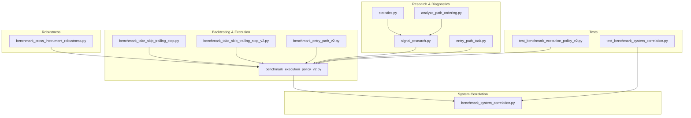
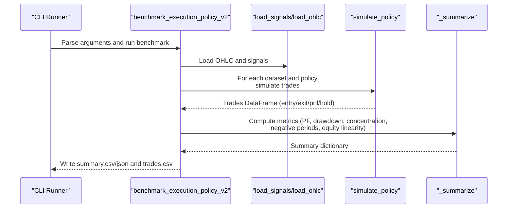
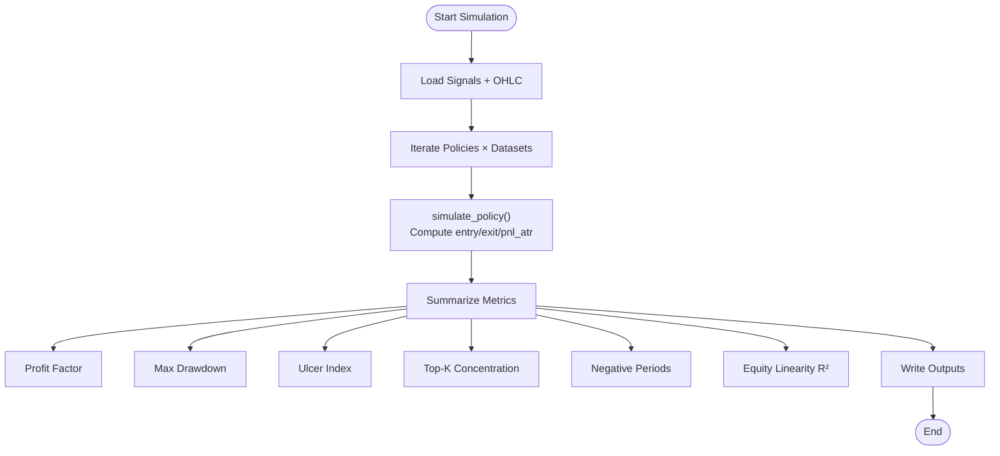
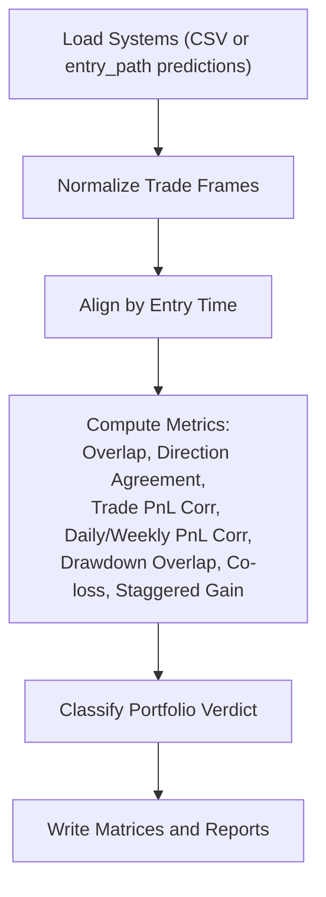
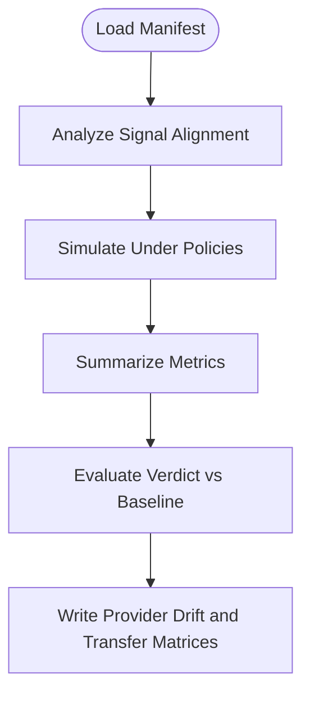
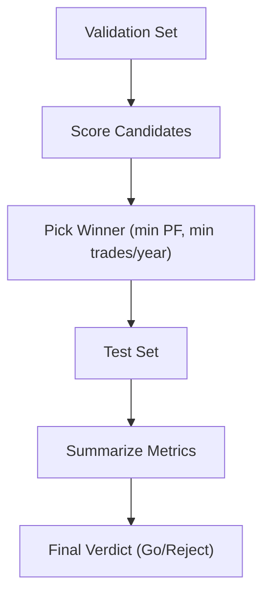
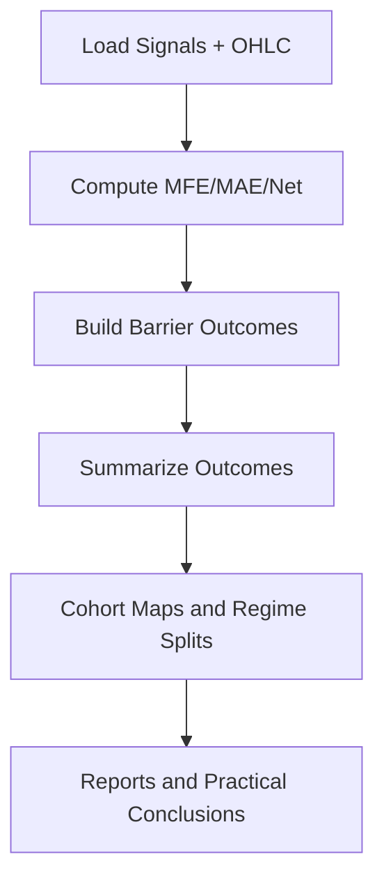
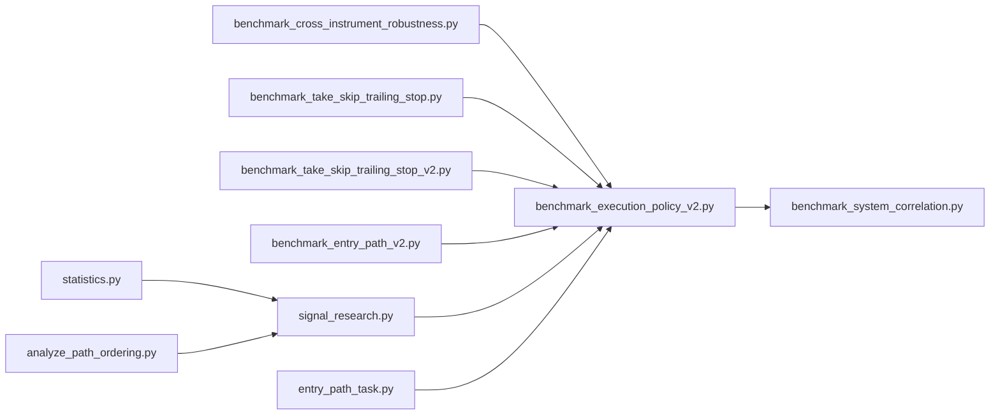

# Performance Metrics and Analysis

<cite>
**Referenced Files in This Document**
- [benchmark_execution_policy_v2.py](file://ML/benchmark_execution_policy_v2.py)
- [benchmark_system_correlation.py](file://ML/benchmark_system_correlation.py)
- [benchmark_cross_instrument_robustness.py](file://ML/benchmark_cross_instrument_robustness.py)
- [benchmark_take_skip_trailing_stop.py](file://ML/benchmark_take_skip_trailing_stop.py)
- [benchmark_take_skip_trailing_stop_v2.py](file://ML/benchmark_take_skip_trailing_stop_v2.py)
- [benchmark_entry_path_v2.py](file://ML/benchmark_entry_path_v2.py)
- [signal_research.py](file://API/signal_research.py)
- [entry_path_task.py](file://ML/entry_path_task.py)
- [statistics.py](file://statistics/statistics.py)
- [analyze_path_ordering.py](file://statistics/analyze_path_ordering.py)
- [test_benchmark_execution_policy_v2.py](file://tests/test_benchmark_execution_policy_v2.py)
- [test_benchmark_system_correlation.py](file://tests/test_benchmark_system_correlation.py)
</cite>

## Table of Contents
1. [Introduction](#introduction)
2. [Project Structure](#project-structure)
3. [Core Components](#core-components)
4. [Architecture Overview](#architecture-overview)
5. [Detailed Component Analysis](#detailed-component-analysis)
6. [Dependency Analysis](#dependency-analysis)
7. [Performance Considerations](#performance-considerations)
8. [Troubleshooting Guide](#troubleshooting-guide)
9. [Conclusion](#conclusion)

## Introduction
This document presents a comprehensive performance metrics toolkit for the SoSimple trading system. It explains how the repository computes trading performance, risk metrics, and statistical measures, and how these are integrated into backtesting, robustness testing, and comparative analysis. It also provides guidance on interpreting performance reports, identifying overfitting patterns, and validating model robustness, with practical examples for benchmarking against market baselines and peer systems.

## Project Structure
The performance analysis capability spans several modules:
- Backtesting and execution policy benchmarking: ML/benchmark_execution_policy_v2.py
- Cross-system correlation and portfolio diagnostics: ML/benchmark_system_correlation.py
- Cross-instrument robustness and provider drift: ML/benchmark_cross_instrument_robustness.py
- Candidate selection and validation-first benchmarking: ML/benchmark_*_trailing_stop*.py, ML/benchmark_entry_path_v2.py
- Signal quality and scenario research: API/signal_research.py
- Entry path performance diagnostics: ML/entry_path_task.py
- Statistical profiling and path ordering analysis: statistics/statistics.py, statistics/analyze_path_ordering.py
- Tests validating metrics and behavior: tests/test_benchmark_*.py

**Diagram sources**
- [benchmark_execution_policy_v2.py:1-424](file://ML/benchmark_execution_policy_v2.py#L1-L424)
- [benchmark_system_correlation.py:1-625](file://ML/benchmark_system_correlation.py#L1-L625)
- [benchmark_cross_instrument_robustness.py:1-342](file://ML/benchmark_cross_instrument_robustness.py#L1-L342)
- [benchmark_take_skip_trailing_stop.py:1-120](file://ML/benchmark_take_skip_trailing_stop.py#L1-L120)
- [benchmark_take_skip_trailing_stop_v2.py:1-160](file://ML/benchmark_take_skip_trailing_stop_v2.py#L1-L160)
- [benchmark_entry_path_v2.py:1-304](file://ML/benchmark_entry_path_v2.py#L1-L304)
- [signal_research.py:1-1855](file://API/signal_research.py#L1-L1855)
- [entry_path_task.py:227-245](file://ML/entry_path_task.py#L227-L245)
- [statistics.py:1-477](file://statistics/statistics.py#L1-L477)
- [analyze_path_ordering.py:1-197](file://statistics/analyze_path_ordering.py#L1-L197)
- [test_benchmark_execution_policy_v2.py:1-81](file://tests/test_benchmark_execution_policy_v2.py#L1-L81)
- [test_benchmark_system_correlation.py:1-286](file://tests/test_benchmark_system_correlation.py#L1-L286)

**Section sources**
- [benchmark_execution_policy_v2.py:1-424](file://ML/benchmark_execution_policy_v2.py#L1-L424)
- [benchmark_system_correlation.py:1-625](file://ML/benchmark_system_correlation.py#L1-L625)
- [benchmark_cross_instrument_robustness.py:1-342](file://ML/benchmark_cross_instrument_robustness.py#L1-L342)
- [benchmark_take_skip_trailing_stop.py:1-120](file://ML/benchmark_take_skip_trailing_stop.py#L1-L120)
- [benchmark_take_skip_trailing_stop_v2.py:1-160](file://ML/benchmark_take_skip_trailing_stop_v2.py#L1-L160)
- [benchmark_entry_path_v2.py:1-304](file://ML/benchmark_entry_path_v2.py#L1-L304)
- [signal_research.py:1-1855](file://API/signal_research.py#L1-L1855)
- [entry_path_task.py:227-245](file://ML/entry_path_task.py#L227-L245)
- [statistics.py:1-477](file://statistics/statistics.py#L1-L477)
- [analyze_path_ordering.py:1-197](file://statistics/analyze_path_ordering.py#L1-L197)
- [test_benchmark_execution_policy_v2.py:1-81](file://tests/test_benchmark_execution_policy_v2.py#L1-L81)
- [test_benchmark_system_correlation.py:1-286](file://tests/test_benchmark_system_correlation.py#L1-L286)

## Core Components
This section outlines the principal performance metrics computed across the system and where they are calculated.

- Profit metrics
  - Profit Factor (PF): gross profit divided by gross loss; computed via dedicated helpers in multiple modules.
  - Net Profit (ATR): sum of per-trade PnL expressed in ATR units.
  - Mean and Median PnL (ATR): central tendency of per-trade PnL in ATR terms.
  - Win Rate: proportion of profitable trades.

- Risk metrics
  - Maximum Drawdown (ATR): peak-to-trough decline along cumulative PnL.
  - Ulcer Index (ATR): square root of mean squared drawdown.
  - Worst and Best Trade (ATR): extreme per-trade PnL in ATR terms.
  - Equity Linearity R²: coefficient of determination for linear fit to cumulative PnL.

- Concentration and stability
  - Profit Concentration Top-K: share of top K winners in total gross profit.
  - Negative Periods: months/years with negative aggregated PnL.
  - Max Consecutive Wins/Losses and Sum of Consecutive PnL: streak analysis.

- Frequency and temporal coverage
  - Trades Per Year: trade count normalized by elapsed years.
  - Coverage Years: span of observed trade years.

- System correlation and portfolio diagnostics
  - Trade overlap ratio and Jaccard similarity of entry times.
  - Direction agreement ratio.
  - Trade PnL correlation and daily/weekly PnL correlation matrices.
  - Drawdown overlap ratio, co-loss ratio, and staggered gain ratio.
  - Portfolio verdict classification (redundant, complementary, partially overlapping, unclear).

- Signal research and scenario analysis
  - MFE/MAE/Net computations across horizons.
  - First-hit barrier outcomes (TP_FIRST/SL_FIRST/NEITHER) and associated PnL.
  - Cohort maps by direction, ratio bins, ATR quartiles, and predicted amplitude buckets.
  - Entry opportunity profile and regime splits.

**Section sources**
- [benchmark_execution_policy_v2.py:109-172](file://ML/benchmark_execution_policy_v2.py#L109-L172)
- [benchmark_system_correlation.py:382-500](file://ML/benchmark_system_correlation.py#L382-L500)
- [benchmark_cross_instrument_robustness.py:158-221](file://ML/benchmark_cross_instrument_robustness.py#L158-L221)
- [benchmark_take_skip_trailing_stop.py:44-82](file://ML/benchmark_take_skip_trailing_stop.py#L44-L82)
- [benchmark_entry_path_v2.py:110-138](file://ML/benchmark_entry_path_v2.py#L110-L138)
- [signal_research.py:1208-1274](file://API/signal_research.py#L1208-L1274)

## Architecture Overview
The performance toolkit orchestrates data loading, trade simulation, metric computation, and reporting across modules. The following sequence illustrates the typical flow for execution policy benchmarking:

**Diagram sources**
- [benchmark_execution_policy_v2.py:344-384](file://ML/benchmark_execution_policy_v2.py#L344-L384)
- [benchmark_execution_policy_v2.py:190-228](file://ML/benchmark_execution_policy_v2.py#L190-L228)

**Section sources**
- [benchmark_execution_policy_v2.py:344-384](file://ML/benchmark_execution_policy_v2.py#L344-L384)
- [benchmark_execution_policy_v2.py:190-228](file://ML/benchmark_execution_policy_v2.py#L190-L228)

## Detailed Component Analysis

### Execution Policy Benchmarking (Profitability, Risk, Stability)
This module simulates exits under various policies and computes a comprehensive set of performance metrics.

Key calculations:
- Profit Factor: gross profit over gross loss; handles zero loss edge cases.
- Maximum Drawdown and Ulcer Index from cumulative PnL.
- Equity Linearity R² measuring straight-line trend fit to equity curve.
- Profit concentration at top-1, top-3, and top-10 winners.
- Negative periods by month/year; consecutive wins/losses and sums.
- Trades Per Year from trade timestamps.

**Diagram sources**
- [benchmark_execution_policy_v2.py:190-228](file://ML/benchmark_execution_policy_v2.py#L190-L228)
- [benchmark_execution_policy_v2.py:109-172](file://ML/benchmark_execution_policy_v2.py#L109-L172)

Interpretation guidance:
- PF > 1 indicates profitability; higher is generally preferred.
- Drawdown and Ulcer Index quantify downside risk; lower is better.
- Equity Linearity R² near 1 suggests a trending equity curve; below 0.5 indicates high volatility.
- Profit concentration reveals whether a small number of trades dominate PnL.
- Negative periods indicate persistent underperformance in certain regimes.

**Section sources**
- [benchmark_execution_policy_v2.py:109-172](file://ML/benchmark_execution_policy_v2.py#L109-L172)
- [benchmark_execution_policy_v2.py:190-228](file://ML/benchmark_execution_policy_v2.py#L190-L228)
- [test_benchmark_execution_policy_v2.py:8-28](file://tests/test_benchmark_execution_policy_v2.py#L8-L28)

### Cross-System Correlation and Portfolio Diagnostics
This module compares multiple systems by aligning trades on common entry times and computing correlation and overlap metrics.

Key computations:
- Trade overlap ratio and Jaccard similarity of entry timestamps.
- Direction agreement ratio.
- Trade PnL correlation and daily/weekly PnL correlation matrices.
- Drawdown overlap ratio, co-loss ratio, and staggered gain ratio.
- Portfolio verdict classification based on thresholds.

**Diagram sources**
- [benchmark_system_correlation.py:266-317](file://ML/benchmark_system_correlation.py#L266-L317)
- [benchmark_system_correlation.py:382-500](file://ML/benchmark_system_correlation.py#L382-L500)

Interpretation guidance:
- Redundant portfolios show high overlap and correlation; consider diversification.
- Complementary portfolios show low overlap and opposite-direction episodes; potential hedge.
- Partially overlapping or unclear classifications require deeper regime analysis.

**Section sources**
- [benchmark_system_correlation.py:382-500](file://ML/benchmark_system_correlation.py#L382-L500)
- [test_benchmark_system_correlation.py:147-234](file://tests/test_benchmark_system_correlation.py#L147-L234)

### Cross-Instrument Robustness and Provider Drift
This module evaluates stability when switching providers or transferring to new instruments while keeping rules frozen.

Key components:
- Signal alignment diagnostics (time coverage checks).
- Benchmarking under default policies and evaluating verdicts against baseline thresholds.
- Metrics include PF, trades ratio, drawdown ratio, and top-1 profit increase.

**Diagram sources**
- [benchmark_cross_instrument_robustness.py:249-314](file://ML/benchmark_cross_instrument_robustness.py#L249-L314)
- [benchmark_cross_instrument_robustness.py:158-221](file://ML/benchmark_cross_instrument_robustness.py#L158-L221)

Interpretation guidance:
- Provider-stable verdict indicates acceptable drift; degraded or failed suggest retraining or stricter controls.
- Transfer-supported indicates successful adaptation; inconclusive suggests further validation.

**Section sources**
- [benchmark_cross_instrument_robustness.py:158-221](file://ML/benchmark_cross_instrument_robustness.py#L158-L221)
- [benchmark_cross_instrument_robustness.py:249-314](file://ML/benchmark_cross_instrument_robustness.py#L249-L314)

### Candidate Selection and Validation-First Benchmarking
These modules select optimal candidates from validation sets and confirm on test sets, ensuring robustness before deployment.

Key steps:
- Validation grid scoring and selection criteria (e.g., minimum PF, trades per year).
- Final test summarization with the same metrics used in validation.

**Diagram sources**
- [benchmark_entry_path_v2.py:270-276](file://ML/benchmark_entry_path_v2.py#L270-L276)
- [benchmark_take_skip_trailing_stop_v2.py:121-135](file://ML/benchmark_take_skip_trailing_stop_v2.py#L121-L135)

**Section sources**
- [benchmark_entry_path_v2.py:270-276](file://ML/benchmark_entry_path_v2.py#L270-L276)
- [benchmark_take_skip_trailing_stop_v2.py:121-135](file://ML/benchmark_take_skip_trailing_stop_v2.py#L121-L135)

### Signal Research and Scenario Analysis
This module computes forward-looking excursions and evaluates barrier outcomes to inform entry and exit decisions.

Key computations:
- MFE/MAE/Net across multiple horizons.
- First-hit barrier outcomes (TP_FIRST/SL_FIRST/NEITHER) and associated PnL.
- Cohort maps by direction, ratio bins, ATR buckets, and predicted amplitude buckets.
- Entry opportunity profile and regime splits.

**Diagram sources**
- [signal_research.py:212-363](file://API/signal_research.py#L212-L363)
- [signal_research.py:394-481](file://API/signal_research.py#L394-L481)
- [signal_research.py:1247-1274](file://API/signal_research.py#L1247-L1274)

**Section sources**
- [signal_research.py:212-363](file://API/signal_research.py#L212-L363)
- [signal_research.py:394-481](file://API/signal_research.py#L394-L481)
- [signal_research.py:1247-1274](file://API/signal_research.py#L1247-L1274)

### Entry Path Performance Diagnostics
Entry path modules compute trade summaries with PF, profit concentration, and negative year slices.

**Section sources**
- [entry_path_task.py:227-245](file://ML/entry_path_task.py#L227-L245)

### Statistical Profiling and Path Ordering
- Statistics module performs streaming analytics on fractal features and generates distributions and class balances.
- Path ordering analysis determines whether SL or TP hits first for realized trades.

**Section sources**
- [statistics.py:51-167](file://statistics/statistics.py#L51-L167)
- [analyze_path_ordering.py:43-74](file://statistics/analyze_path_ordering.py#L43-L74)

## Dependency Analysis
The modules exhibit clear separation of concerns:
- Execution policy benchmarking depends on OHLC and signal loaders and produces standardized metrics consumed by downstream analyses.
- System correlation builds on normalized trade frames and computes pairwise metrics.
- Robustness benchmarking reuses execution policy infrastructure and adds alignment and verdict logic.
- Signal research is independent but feeds into scenario-based validations.

**Diagram sources**
- [benchmark_execution_policy_v2.py:344-384](file://ML/benchmark_execution_policy_v2.py#L344-L384)
- [benchmark_system_correlation.py:266-317](file://ML/benchmark_system_correlation.py#L266-L317)
- [benchmark_cross_instrument_robustness.py:249-314](file://ML/benchmark_cross_instrument_robustness.py#L249-L314)
- [benchmark_take_skip_trailing_stop.py:1-120](file://ML/benchmark_take_skip_trailing_stop.py#L1-L120)
- [benchmark_take_skip_trailing_stop_v2.py:1-160](file://ML/benchmark_take_skip_trailing_stop_v2.py#L1-L160)
- [benchmark_entry_path_v2.py:1-304](file://ML/benchmark_entry_path_v2.py#L1-L304)
- [signal_research.py:1-1855](file://API/signal_research.py#L1-L1855)
- [entry_path_task.py:227-245](file://ML/entry_path_task.py#L227-L245)
- [statistics.py:1-477](file://statistics/statistics.py#L1-L477)
- [analyze_path_ordering.py:1-197](file://statistics/analyze_path_ordering.py#L1-L197)

**Section sources**
- [benchmark_execution_policy_v2.py:344-384](file://ML/benchmark_execution_policy_v2.py#L344-L384)
- [benchmark_system_correlation.py:266-317](file://ML/benchmark_system_correlation.py#L266-L317)
- [benchmark_cross_instrument_robustness.py:249-314](file://ML/benchmark_cross_instrument_robustness.py#L249-L314)
- [benchmark_take_skip_trailing_stop.py:1-120](file://ML/benchmark_take_skip_trailing_stop.py#L1-L120)
- [benchmark_take_skip_trailing_stop_v2.py:1-160](file://ML/benchmark_take_skip_trailing_stop_v2.py#L1-L160)
- [benchmark_entry_path_v2.py:1-304](file://ML/benchmark_entry_path_v2.py#L1-L304)
- [signal_research.py:1-1855](file://API/signal_research.py#L1-L1855)
- [entry_path_task.py:227-245](file://ML/entry_path_task.py#L227-L245)
- [statistics.py:1-477](file://statistics/statistics.py#L1-L477)
- [analyze_path_ordering.py:1-197](file://statistics/analyze_path_ordering.py#L1-L197)

## Performance Considerations
- Metric stability: Use annualized metrics (Trades Per Year) to compare across datasets with different durations.
- Drawdown sensitivity: Max Drawdown and Ulcer Index are sensitive to outliers; complement with Value-at-Risk approximations if needed.
- Concentration thresholds: Top-K concentration helps detect over-reliance on a few trades; monitor for degradation across time.
- Correlation matrices: Daily/weekly PnL correlations reveal regime persistence; use for portfolio construction.
- Scenario analysis: Cohort maps and regime splits guide parameter tuning and reduce overfitting to specific market conditions.

[No sources needed since this section provides general guidance]

## Troubleshooting Guide
Common issues and resolutions:
- Missing or misaligned timestamps: Ensure signal timestamps exist in OHLC coverage; otherwise, simulations will skip trades.
- Zero or constant PnL series: Some metrics (e.g., correlation, R²) are undefined; handle with safe fallbacks.
- Empty or inconsistent trade frames: Validate required columns and non-null timestamps before computing metrics.
- Verdict failures in robustness tests: Reassess thresholds or retrain models to improve stability.

Validation references:
- Execution policy metrics coverage and edge cases.
- System correlation matrix generation and classification thresholds.

**Section sources**
- [test_benchmark_execution_policy_v2.py:8-28](file://tests/test_benchmark_execution_policy_v2.py#L8-L28)
- [test_benchmark_system_correlation.py:100-114](file://tests/test_benchmark_system_correlation.py#L100-L114)
- [test_benchmark_system_correlation.py:237-285](file://tests/test_benchmark_system_correlation.py#L237-L285)

## Conclusion
The SoSimple repository provides a robust, modular framework for trading performance analysis. By combining execution policy benchmarking, cross-system correlation, robustness testing, and scenario-driven signal research, teams can construct reliable performance reports, identify overfitting patterns, and validate model robustness. The included metrics—Profit Factor, Drawdown, Ulcer Index, concentration, and correlation matrices—enable informed decisions for strategy evaluation and risk management.