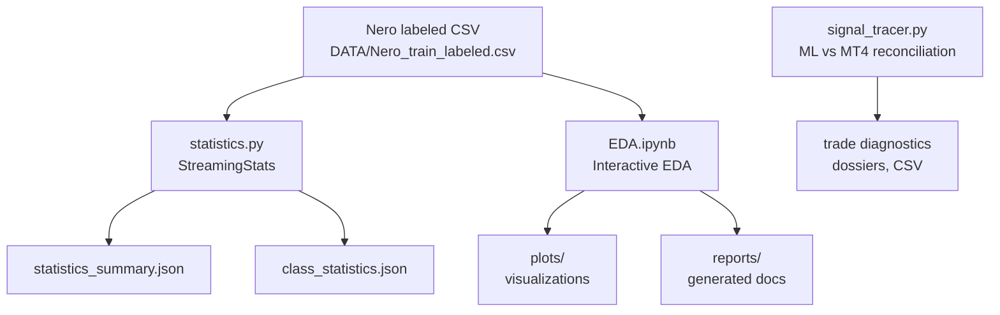
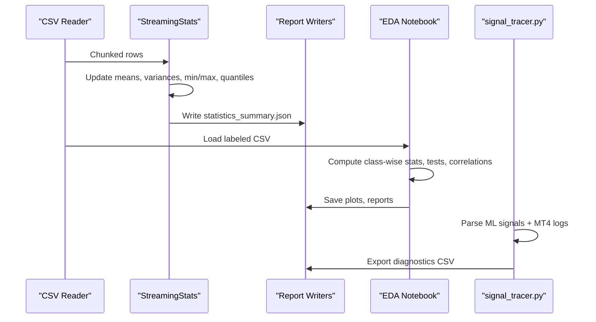
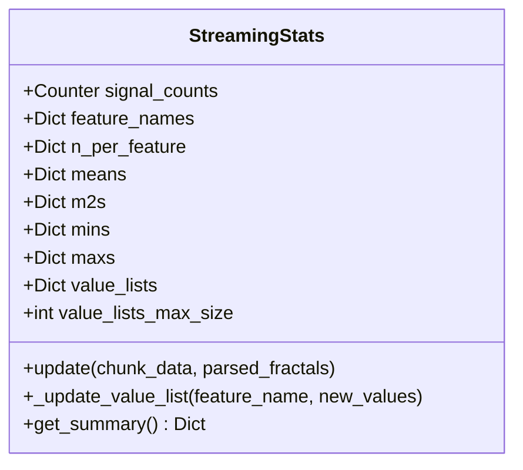
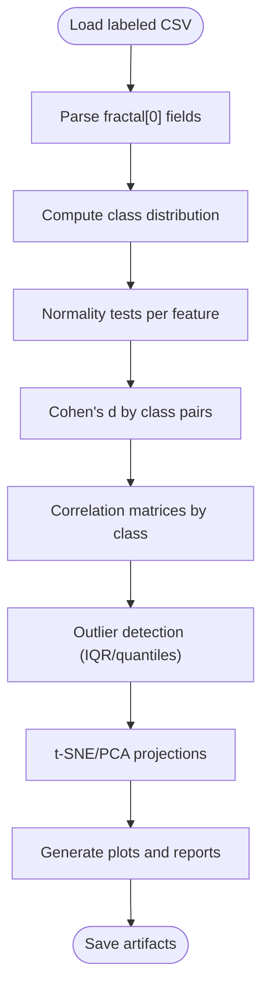
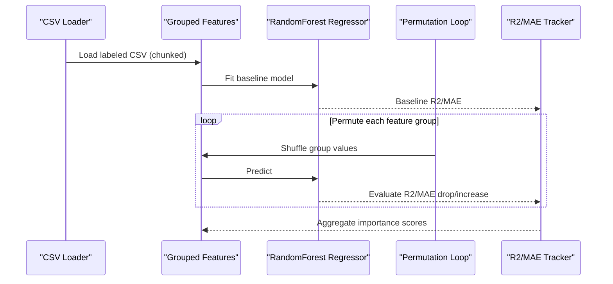
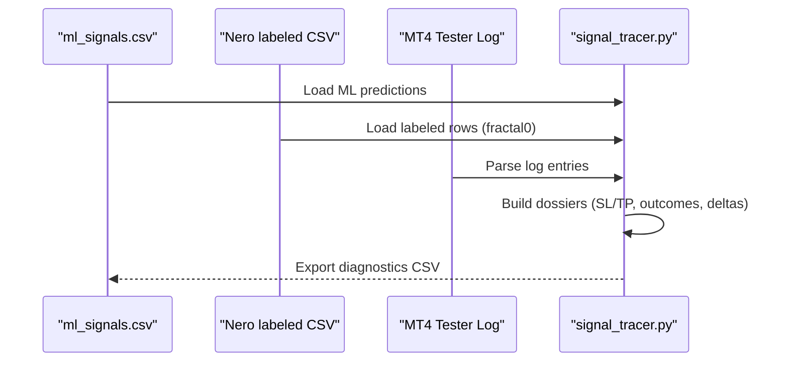
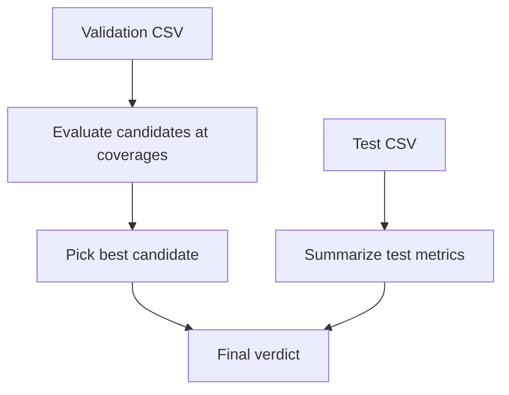
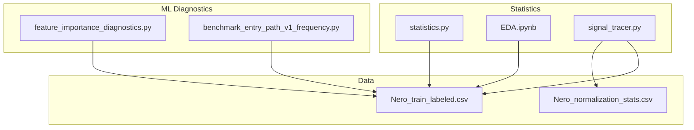

# Statistical Analysis and EDA

<cite>
**Referenced Files in This Document**
- [statistics.py](file://statistics/statistics.py)
- [EDA.ipynb](file://statistics/EDA.ipynb)
- [README.md](file://statistics/README.md)
- [signal_tracer.py](file://statistics/signal_tracer.py)
- [statistics_summary.json](file://statistics/statistics_summary.json)
- [class_statistics.json](file://statistics/class_statistics.json)
- [EDA.ipynb.md](file://docs/statistics/EDA.ipynb.md)
- [statistics.py.md](file://docs/statistics/statistics.py.md)
- [benchmark_entry_path_v1_frequency.py](file://ML/benchmark_entry_path_v1_frequency.py)
- [feature_importance_diagnostics.py](file://ML/feature_importance_diagnostics.py)
- [report.md](file://ML/reports/current_feature_importance/report.md)
</cite>

## Table of Contents
1. [Introduction](#introduction)
2. [Project Structure](#project-structure)
3. [Core Components](#core-components)
4. [Architecture Overview](#architecture-overview)
5. [Detailed Component Analysis](#detailed-component-analysis)
6. [Dependency Analysis](#dependency-analysis)
7. [Performance Considerations](#performance-considerations)
8. [Troubleshooting Guide](#troubleshooting-guide)
9. [Conclusion](#conclusion)
10. [Appendices](#appendices)

## Introduction
This document presents comprehensive statistical analysis documentation for the SoSimple trading system. It covers exploratory data analysis (EDA), feature engineering, performance metrics computation, and statistical inference applied to the Nero labeled dataset. The focus areas include:
- EDA workflows and statistical tests
- Feature importance assessment via permutation diagnostics
- Performance benchmarking and backtesting result analysis
- Risk metrics and statistical significance testing
- Visualization techniques and reporting artifacts

## Project Structure
The statistical analysis pipeline centers around three primary components:
- Streaming statistics engine for large-scale CSV processing
- Interactive EDA notebook for distribution analysis, hypothesis testing, and visualization
- Trade-level reconciliation script for ML vs MT4 parity checks

**Diagram sources**
- [statistics.py:208-442](file://statistics/statistics.py#L208-L442)
- [EDA.ipynb:1-120](file://statistics/EDA.ipynb#L1-L120)
- [signal_tracer.py:1-120](file://statistics/signal_tracer.py#L1-L120)

**Section sources**
- [README.md:1-49](file://statistics/README.md#L1-L49)

## Core Components
- Streaming statistics engine: Implements Welford’s online mean/variance and reservoir sampling to compute robust summaries over large CSV files without full in-memory loading.
- EDA notebook: Provides distribution analysis, class-wise statistics, statistical tests, correlation analysis, outlier detection, dimensionality reduction, and sequence feature engineering.
- Trade-level reconciliation: Bridges ML predictions and MT4 execution to diagnose discrepancies in SL/TP distances, outcomes, and lag bias.

Key outputs:
- statistics_summary.json: Global feature distributions, class percentages, and target statistics.
- class_statistics.json: First-fractal feature statistics by class.
- EDA-generated plots and reports for interpretability and model guidance.

**Section sources**
- [statistics.py:51-167](file://statistics/statistics.py#L51-L167)
- [statistics.py.md:1-138](file://docs/statistics/statistics.py.md#L1-L138)
- [EDA.ipynb.md:1-274](file://docs/statistics/EDA.ipynb.md#L1-L274)
- [statistics_summary.json:1-251](file://statistics/statistics_summary.json#L1-L251)
- [class_statistics.json:1-344](file://statistics/class_statistics.json#L1-L344)

## Architecture Overview
The statistical analysis architecture integrates data ingestion, streaming computation, interactive exploration, and diagnostics.

**Diagram sources**
- [statistics.py:208-442](file://statistics/statistics.py#L208-L442)
- [EDA.ipynb:1-120](file://statistics/EDA.ipynb#L1-L120)
- [signal_tracer.py:608-690](file://statistics/signal_tracer.py#L608-L690)

## Detailed Component Analysis

### Streaming Statistics Engine (statistics.py)
The StreamingStats class performs:
- Online mean and variance updates per feature using Welford’s algorithm
- Reservoir sampling for unbiased quantile estimation
- Stratified sampling of rare events for quick diagnostics
- Aggregation of class distributions and derived statistics

**Diagram sources**
- [statistics.py:51-167](file://statistics/statistics.py#L51-L167)

Implementation highlights:
- Welford’s algorithm ensures numerical stability and constant memory usage.
- Reservoir sampling guarantees representative quantile samples without storing entire datasets.
- Stratified sampling preserves minority classes for targeted analysis.

Practical usage:
- Run from command line to generate JSON and CSV reports.
- Use the stratified sample for rapid EDA without full dataset loading.

**Section sources**
- [statistics.py:51-167](file://statistics/statistics.py#L51-L167)
- [statistics.py:208-442](file://statistics/statistics.py#L208-L442)
- [statistics.py.md:35-138](file://docs/statistics/statistics.py.md#L35-L138)

### EDA Workflow and Statistical Tests (EDA.ipynb)
The EDA notebook implements:
- Data loading and fractal parsing
- Class distribution analysis and imbalance diagnostics
- Descriptive statistics by class
- Normality checks (Shapiro–Wilk / D’Agostino–Pearson)
- Effect size estimation (Cohen’s d) for pairwise comparisons
- Correlation analysis by class and cross-fractal
- Outlier detection via IQR and quantile thresholds
- Dimensionality reduction (t-SNE, PCA)
- Sequence feature engineering for temporal patterns

**Diagram sources**
- [EDA.ipynb:150-275](file://statistics/EDA.ipynb#L150-L275)
- [EDA.ipynb.md:148-218](file://docs/statistics/EDA.ipynb.md#L148-L218)

Statistical tests and interpretation:
- Normality: Choose Shapiro–Wilk for n<5000 or D’Agostino–Pearson for larger samples.
- Effect size: Cohen’s d thresholds guide practical significance (large ≈ 0.8).
- Correlations: Inspect class-specific matrices to avoid spurious associations.

**Section sources**
- [EDA.ipynb.md:23-56](file://docs/statistics/EDA.ipynb.md#L23-L56)
- [EDA.ipynb.md:187-217](file://docs/statistics/EDA.ipynb.md#L187-L217)

### Feature Importance Diagnostics (ML/feature_importance_diagnostics.py)
This module computes permutation-based feature importance:
- Builds grouped features from fractal sequences and row-level context
- Uses a RandomForest regressor to estimate baseline performance
- Measures importance by permuting each feature group and observing metric degradation

**Diagram sources**
- [feature_importance_diagnostics.py:160-200](file://ML/feature_importance_diagnostics.py#L160-L200)
- [report.md:22-71](file://ML/reports/current_feature_importance/report.md#L22-L71)

Interpretation rules:
- r2_drop indicates how much validation R2 decreases when a group is shuffled.
- mae_increase shows increased error under permutation.
- These are not trading verdicts but reflect input usefulness for the chosen target.

**Section sources**
- [feature_importance_diagnostics.py:1-200](file://ML/feature_importance_diagnostics.py#L1-L200)
- [report.md:1-71](file://ML/reports/current_feature_importance/report.md#L1-L71)

### Trade-Level Reconciliation (signal_tracer.py)
The reconciliation script aligns ML predictions with MT4 execution:
- Parses ML signals and MT4 logs
- Computes SL/TP distances and outcomes
- Denormalizes up/dn targets using per-row parameters
- Produces diagnostic dossiers and CSV exports

**Diagram sources**
- [signal_tracer.py:608-690](file://statistics/signal_tracer.py#L608-L690)
- [signal_tracer.py:240-385](file://statistics/signal_tracer.py#L240-L385)

**Section sources**
- [signal_tracer.py:1-120](file://statistics/signal_tracer.py#L1-L120)
- [signal_tracer.py:240-385](file://statistics/signal_tracer.py#L240-L385)

### Benchmarking and Backtesting Result Analysis
The benchmark module evaluates candidate filters for higher trade frequency while maintaining profitability:
- Loads prediction frames for validation and test sets
- Computes thresholds via quantile coverage
- Summarizes performance metrics: PF, trades/year, profit concentration, negative year slices
- Picks a candidate based on PF threshold and target trades/year

**Diagram sources**
- [benchmark_entry_path_v1_frequency.py:101-158](file://ML/benchmark_entry_path_v1_frequency.py#L101-L158)

**Section sources**
- [benchmark_entry_path_v1_frequency.py:1-187](file://ML/benchmark_entry_path_v1_frequency.py#L1-L187)

## Dependency Analysis
The statistical analysis components depend on:
- pandas, numpy for tabular and numerical operations
- scipy.stats for normality and rank-based tests
- scikit-learn for dimensionality reduction and model diagnostics
- Internal preprocessing and labeling scripts for dataset creation

**Diagram sources**
- [statistics.py:31-38](file://statistics/statistics.py#L31-L38)
- [EDA.ipynb:116-130](file://statistics/EDA.ipynb#L116-L130)
- [feature_importance_diagnostics.py:28-31](file://ML/feature_importance_diagnostics.py#L28-L31)
- [benchmark_entry_path_v1_frequency.py:7-11](file://ML/benchmark_entry_path_v1_frequency.py#L7-L11)

**Section sources**
- [EDA.ipynb.md:126-146](file://docs/statistics/EDA.ipynb.md#L126-L146)

## Performance Considerations
- Streaming statistics: Constant memory footprint and efficient throughput for large CSVs.
- Chunked processing: Enables handling datasets larger than RAM.
- Reservoir sampling: Efficient quantile approximation without full sorting.
- Permutation importance: Computationally intensive; tune tree counts and sample sizes judiciously.
- Visualization: Generate plots selectively to reduce I/O overhead.

[No sources needed since this section provides general guidance]

## Troubleshooting Guide
Common issues and resolutions:
- Missing columns in labeled CSV: Ensure required columns (time, signal, predict, ATR, fractal0..) are present; otherwise, parsing will fail.
- Empty or skewed class distributions: Use stratified sampling and adjust class weights during modeling.
- Numerical instability: Welford’s algorithm mitigates precision loss; verify data types and handle NaNs before aggregation.
- MT4 log parsing mismatches: Confirm bar timestamps and order identifiers match between ML signals and tester logs.

**Section sources**
- [statistics.py:208-271](file://statistics/statistics.py#L208-L271)
- [signal_tracer.py:691-800](file://statistics/signal_tracer.py#L691-L800)

## Conclusion
The SoSimple statistical analysis framework combines robust streaming computations, interactive EDA, and diagnostics to support reliable feature engineering and model evaluation. By leveraging Welford’s algorithm, permutation importance, and MT4 reconciliation, practitioners can assess data quality, feature relevance, and backtesting performance with confidence.

[No sources needed since this section summarizes without analyzing specific files]

## Appendices

### Statistical Tools and Techniques Summary
- Descriptive statistics: Mean, std, min, max, quartiles
- Normality tests: Shapiro–Wilk, D’Agostino–Pearson
- Effect size: Cohen’s d
- Nonparametric tests: Mann–Whitney U
- Correlation: Pearson/Spearman by class
- Outlier detection: IQR and quantile-based methods
- Dimensionality reduction: t-SNE, PCA
- Feature importance: Permutation-based importance

**Section sources**
- [EDA.ipynb.md:34-56](file://docs/statistics/EDA.ipynb.md#L34-L56)

### Practical Implementation References
- Running streaming statistics: [statistics.py:449-477](file://statistics/statistics.py#L449-L477)
- Executing EDA notebook: [README.md:25-28](file://statistics/README.md#L25-L28)
- Trade reconciliation: [signal_tracer.py:20-32](file://statistics/signal_tracer.py#L20-L32)
- Feature importance diagnostics: [feature_importance_diagnostics.py:1-18](file://ML/feature_importance_diagnostics.py#L1-L18)
- Benchmarking candidates: [benchmark_entry_path_v1_frequency.py:161-187](file://ML/benchmark_entry_path_v1_frequency.py#L161-L187)