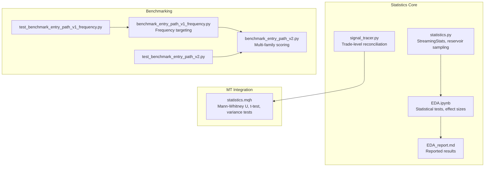
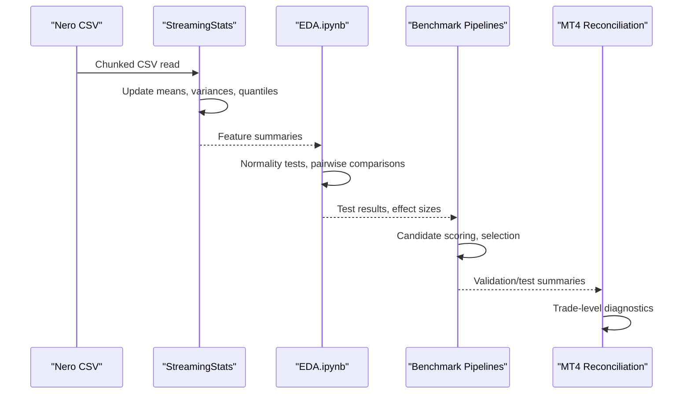
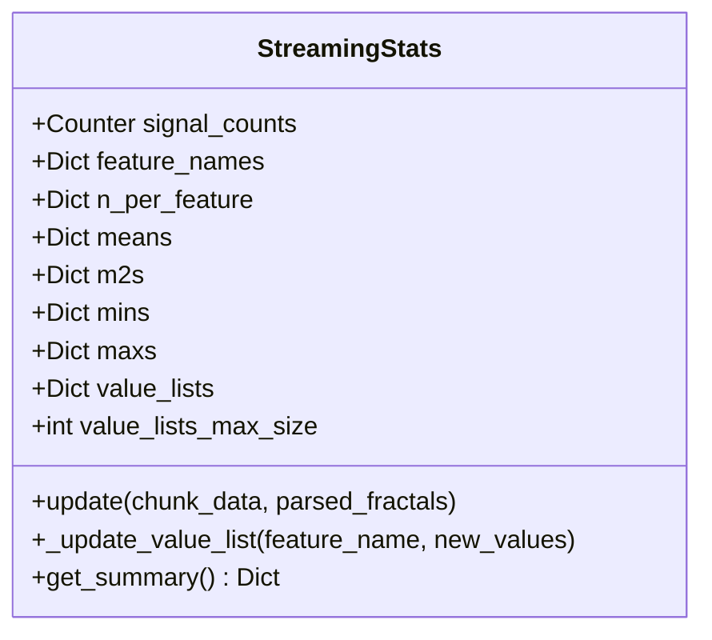
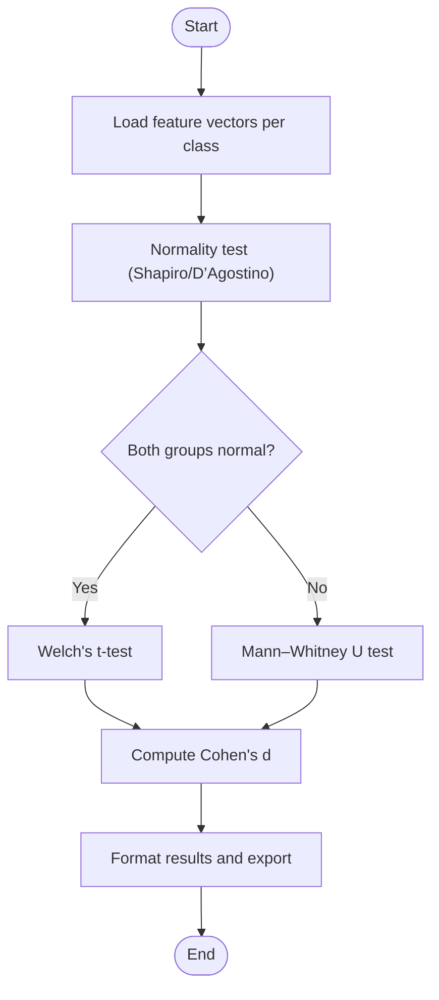
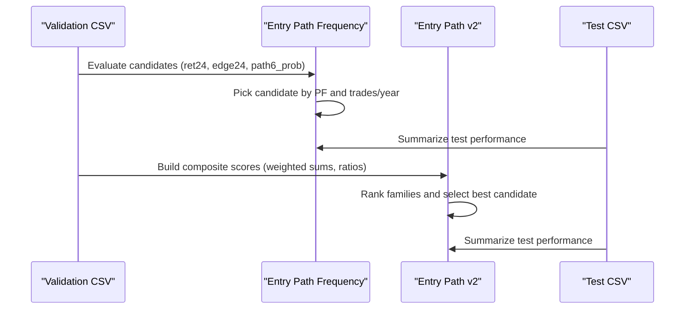
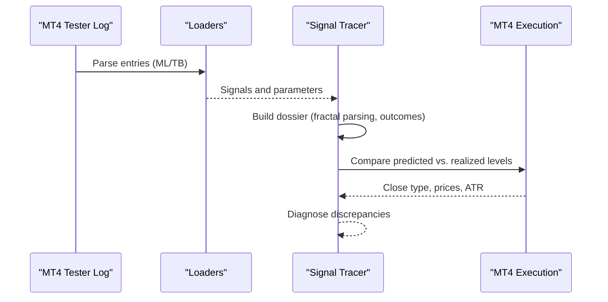
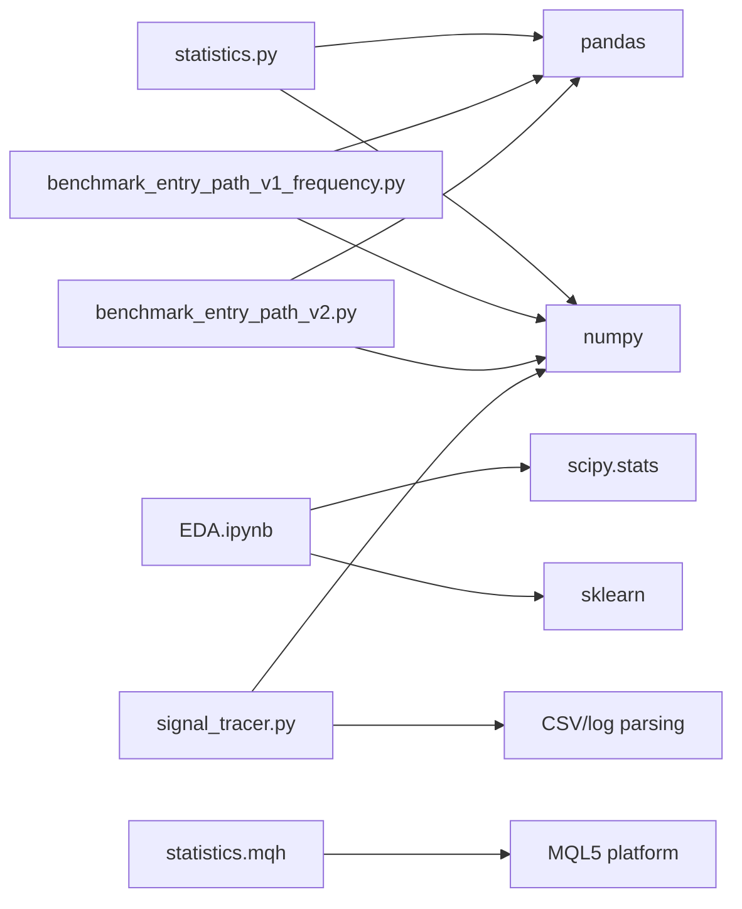

# Statistical Significance Testing

<cite>
**Referenced Files in This Document**
- [statistics.py](file://statistics/statistics.py)
- [signal_tracer.py](file://statistics/signal_tracer.py)
- [EDA.ipynb](file://statistics/EDA.ipynb)
- [EDA_report.md](file://statistics/reports/EDA_report.md)
- [benchmark_entry_path_v1_frequency.py](file://ML/benchmark_entry_path_v1_frequency.py)
- [benchmark_entry_path_v2.py](file://ML/benchmark_entry_path_v2.py)
- [test_benchmark_entry_path_v1_frequency.py](file://tests/test_benchmark_entry_path_v1_frequency.py)
- [test_benchmark_entry_path_v2.py](file://tests/test_benchmark_entry_path_v2.py)
- [statistics.mqh](file://MT/MQL5/Include/Math/Alglib/statistics.mqh)
</cite>

## Table of Contents
1. [Introduction](#introduction)
2. [Project Structure](#project-structure)
3. [Core Components](#core-components)
4. [Architecture Overview](#architecture-overview)
5. [Detailed Component Analysis](#detailed-component-analysis)
6. [Dependency Analysis](#dependency-analysis)
7. [Performance Considerations](#performance-considerations)
8. [Troubleshooting Guide](#troubleshooting-guide)
9. [Conclusion](#conclusion)

## Introduction
This document presents the statistical significance testing framework used in the SoSimple trading system. It covers hypothesis testing, p-value computation, confidence interval estimation, effect size metrics, and practical applications for feature significance, model performance comparisons, and strategy robustness. The framework integrates exploratory data analysis, statistical inference, and performance benchmarking across multiple trading strategies and datasets.

## Project Structure
The statistical testing infrastructure spans three primary areas:
- Exploratory Data Analysis (EDA) and statistical inference for feature analysis
- Benchmarking pipelines for strategy evaluation and selection
- Trade-level reconciliation and diagnostics for performance validation

**Diagram sources**
- [statistics.py:1-477](file://statistics/statistics.py#L1-L477)
- [signal_tracer.py:1-800](file://statistics/signal_tracer.py#L1-L800)
- [EDA.ipynb:1-200](file://statistics/EDA.ipynb#L1-L200)
- [EDA_report.md:313-436](file://statistics/reports/EDA_report.md#L313-L436)
- [benchmark_entry_path_v1_frequency.py:1-187](file://ML/benchmark_entry_path_v1_frequency.py#L1-L187)
- [benchmark_entry_path_v2.py:1-305](file://ML/benchmark_entry_path_v2.py#L1-L305)
- [test_benchmark_entry_path_v1_frequency.py:1-22](file://tests/test_benchmark_entry_path_v1_frequency.py#L1-L22)
- [test_benchmark_entry_path_v2.py:1-91](file://tests/test_benchmark_entry_path_v2.py#L1-L91)
- [statistics.mqh:4361-8948](file://MT/MQL5/Include/Math/Alglib/statistics.mqh#L4361-L8948)

**Section sources**
- [statistics.py:1-477](file://statistics/statistics.py#L1-L477)
- [EDA.ipynb:1-200](file://statistics/EDA.ipynb#L1-L200)
- [benchmark_entry_path_v1_frequency.py:1-187](file://ML/benchmark_entry_path_v1_frequency.py#L1-L187)
- [benchmark_entry_path_v2.py:1-305](file://ML/benchmark_entry_path_v2.py#L1-L305)
- [statistics.mqh:4361-8948](file://MT/MQL5/Include/Math/Alglib/statistics.mqh#L4361-L8948)

## Core Components
- Streaming statistics and reservoir sampling for feature distributions and quantiles
- Nonparametric and parametric statistical tests for feature significance
- Effect size computation (Cohen’s d) and interpretation guidelines
- Benchmarking pipelines for strategy selection and performance validation
- Trade-level reconciliation and diagnostics for MT4 parity checks

Key capabilities:
- Online mean/variance estimation via Welford’s algorithm
- Reservoir sampling for unbiased quantile estimation
- Automatic normality testing and test selection (Shapiro-Wilk or D’Agostino-Pearson)
- Parametric t-test (Welch’s) and nonparametric Mann-Whitney U tests
- Effect size interpretation thresholds and reporting

**Section sources**
- [statistics.py:51-167](file://statistics/statistics.py#L51-L167)
- [EDA.ipynb:777-860](file://statistics/EDA.ipynb#L777-L860)
- [EDA.ipynb:804-933](file://statistics/EDA.ipynb#L804-L933)
- [EDA_report.md:313-436](file://statistics/reports/EDA_report.md#L313-L436)

## Architecture Overview
The statistical testing pipeline connects data ingestion, feature analysis, inference, and strategy benchmarking:

**Diagram sources**
- [statistics.py:208-442](file://statistics/statistics.py#L208-L442)
- [EDA.ipynb:856-933](file://statistics/EDA.ipynb#L856-L933)
- [benchmark_entry_path_v2.py:105-198](file://ML/benchmark_entry_path_v2.py#L105-L198)
- [signal_tracer.py:242-497](file://statistics/signal_tracer.py#L242-L497)

## Detailed Component Analysis

### Streaming Statistics and Reservoir Sampling
The streaming module computes online descriptive statistics and maintains a reservoir sample for quantile estimation.

Key features:
- Welford’s online mean/variance updates per feature
- Reservoir sampling for unbiased quantile estimation
- Aggregation across chunks for large CSV files

**Diagram sources**
- [statistics.py:51-167](file://statistics/statistics.py#L51-L167)

**Section sources**
- [statistics.py:51-167](file://statistics/statistics.py#L51-L167)
- [statistics.py:208-442](file://statistics/statistics.py#L208-L442)

### Statistical Tests for Feature Significance
The EDA notebook performs automatic normality testing and selects appropriate tests:
- Normality test: Shapiro–Wilk for n < 5000, D’Agostino–Pearson otherwise
- Parametric: Welch’s t-test for normal distributions
- Nonparametric: Mann–Whitney U for non-normal distributions
- Effect size: Cohen’s d with interpretation thresholds

**Diagram sources**
- [EDA.ipynb:777-860](file://statistics/EDA.ipynb#L777-L860)
- [EDA.ipynb:856-933](file://statistics/EDA.ipynb#L856-L933)
- [EDA_report.md:313-436](file://statistics/reports/EDA_report.md#L313-L436)

**Section sources**
- [EDA.ipynb:777-860](file://statistics/EDA.ipynb#L777-L860)
- [EDA.ipynb:804-933](file://statistics/EDA.ipynb#L804-L933)
- [EDA_report.md:313-436](file://statistics/reports/EDA_report.md#L313-L436)

### Effect Size and Practical Significance
Cohen’s d is computed and interpreted using conventional thresholds:
- Negligible: < 0.2
- Small: < 0.5
- Medium: < 0.8
- Large: ≥ 0.8

Interpretation guidance emphasizes effect size over p-values, especially for small minority classes.

**Section sources**
- [EDA.ipynb:804-854](file://statistics/EDA.ipynb#L804-L854)
- [EDA_report.md:313-355](file://statistics/reports/EDA_report.md#L313-L355)

### Benchmarking Strategies and Performance Evaluation
Two benchmarking pipelines evaluate trading strategies using performance metrics and candidate selection:

Metrics used:
- Profit Factor (PF)
- Trades per year
- Negative year slices
- Profit concentration (top 10%)
- Equity smoothness (ulcer index, max drawdown)

**Diagram sources**
- [benchmark_entry_path_v1_frequency.py:55-99](file://ML/benchmark_entry_path_v1_frequency.py#L55-L99)
- [benchmark_entry_path_v2.py:141-198](file://ML/benchmark_entry_path_v2.py#L141-L198)

**Section sources**
- [benchmark_entry_path_v1_frequency.py:19-52](file://ML/benchmark_entry_path_v1_frequency.py#L19-L52)
- [benchmark_entry_path_v1_frequency.py:82-158](file://ML/benchmark_entry_path_v1_frequency.py#L82-L158)
- [benchmark_entry_path_v2.py:19-41](file://ML/benchmark_entry_path_v2.py#L19-L41)
- [benchmark_entry_path_v2.py:105-198](file://ML/benchmark_entry_path_v2.py#L105-L198)

### Trade-Level Reconciliation and MT Integration
The signal tracer reconciles Python predictions with MT4 execution logs, enabling statistical diagnostics:
- Parse EA logs and labeled CSVs
- Denormalize up/dn targets and compute outcomes
- Compare predicted vs. realized SL/TP distances and ATR
- Classify outcomes (TP clear, SL clear, both hit, timeout)

**Diagram sources**
- [signal_tracer.py:691-800](file://statistics/signal_tracer.py#L691-L800)
- [signal_tracer.py:242-497](file://statistics/signal_tracer.py#L242-L497)

**Section sources**
- [signal_tracer.py:46-111](file://statistics/signal_tracer.py#L46-L111)
- [signal_tracer.py:149-167](file://statistics/signal_tracer.py#L149-L167)
- [signal_tracer.py:242-497](file://statistics/signal_tracer.py#L242-L497)

### MT Statistical Functions for Significance Testing
The MQL5 Alglib statistics library provides built-in functions for:
- Mann–Whitney U test (medians equality)
- One-sample sign test
- Variance tests (F-test)
- t-test for mean vs. assumed value

These functions support automated significance testing within the trading platform.

**Section sources**
- [statistics.mqh:4361-4380](file://MT/MQL5/Include/Math/Alglib/statistics.mqh#L4361-L4380)
- [statistics.mqh:8247-8391](file://MT/MQL5/Include/Math/Alglib/statistics.mqh#L8247-L8391)
- [statistics.mqh:8678-8709](file://MT/MQL5/Include/Math/Alglib/statistics.mqh#L8678-L8709)
- [statistics.mqh:8908-8927](file://MT/MQL5/Include/Math/Alglib/statistics.mqh#L8908-L8927)

## Dependency Analysis
The statistical framework exhibits modular dependencies:
- statistics.py depends on pandas, numpy, json, pathlib
- EDA.ipynb depends on scipy.stats, sklearn.manifold, matplotlib/seaborn
- Benchmarking modules depend on pandas, numpy, and internal performance utilities
- signal_tracer.py depends on numpy and CSV/log parsing
- MT integration relies on Alglib statistics functions

**Diagram sources**
- [statistics.py:31-38](file://statistics/statistics.py#L31-L38)
- [EDA.ipynb:116-130](file://statistics/EDA.ipynb#L116-L130)
- [benchmark_entry_path_v1_frequency.py:7-10](file://ML/benchmark_entry_path_v1_frequency.py#L7-L10)
- [benchmark_entry_path_v2.py:7-10](file://ML/benchmark_entry_path_v2.py#L7-L10)
- [signal_tracer.py:33-39](file://statistics/signal_tracer.py#L33-L39)
- [statistics.mqh:4361-4380](file://MT/MQL5/Include/Math/Alglib/statistics.mqh#L4361-L4380)

**Section sources**
- [statistics.py:31-38](file://statistics/statistics.py#L31-L38)
- [EDA.ipynb:116-130](file://statistics/EDA.ipynb#L116-L130)
- [benchmark_entry_path_v1_frequency.py:7-10](file://ML/benchmark_entry_path_v1_frequency.py#L7-L10)
- [benchmark_entry_path_v2.py:7-10](file://ML/benchmark_entry_path_v2.py#L7-L10)
- [signal_tracer.py:33-39](file://statistics/signal_tracer.py#L33-L39)
- [statistics.mqh:4361-4380](file://MT/MQL5/Include/Math/Alglib/statistics.mqh#L4361-L4380)

## Performance Considerations
- Streaming statistics enable processing of large CSV files without loading entire datasets into memory.
- Reservoir sampling ensures unbiased quantile estimates with bounded memory.
- Automatic normality testing avoids incorrect test assumptions.
- Benchmarking pipelines use quantile-based thresholds to maintain stable coverage across datasets.

[No sources needed since this section provides general guidance]

## Troubleshooting Guide
Common issues and resolutions:
- Small sample sizes in minority classes reduce test power; rely on effect size interpretation.
- Non-normal distributions require nonparametric tests; verify normality assumptions.
- Memory constraints: use streaming statistics and chunked processing.
- MT4 parity mismatches: validate SL/TP formulas and ATR conversions.

**Section sources**
- [EDA_report.md:313-321](file://statistics/reports/EDA_report.md#L313-L321)
- [signal_tracer.py:149-167](file://statistics/signal_tracer.py#L149-L167)

## Conclusion
The SoSimple statistical framework combines robust exploratory analysis, automated significance testing, and performance benchmarking to support reliable feature selection, model comparison, and strategy validation. By emphasizing effect sizes, nonparametric tests, and MT4 reconciliation, the system provides practical, finance-aware statistical inference suitable for trading applications.