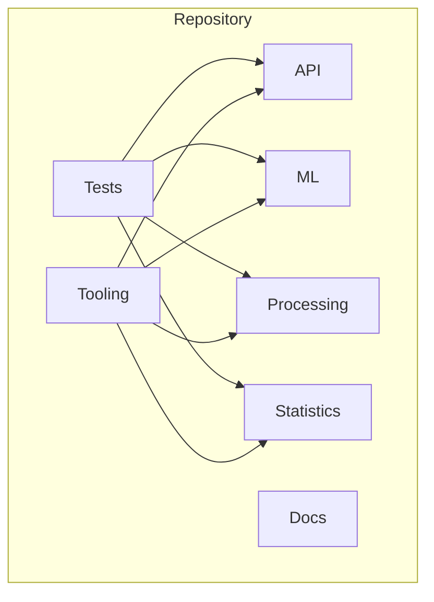
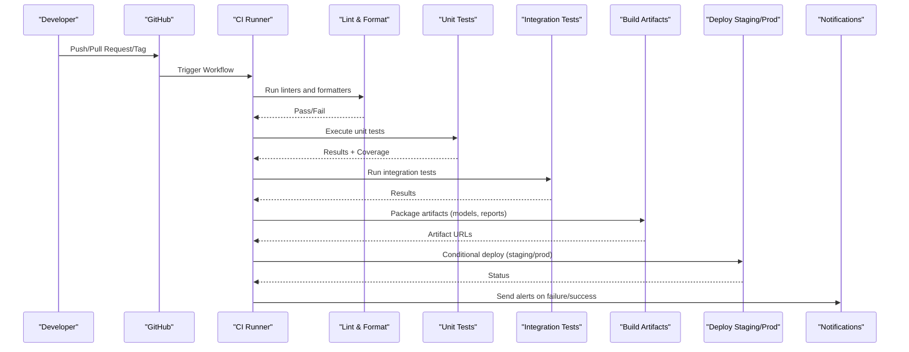
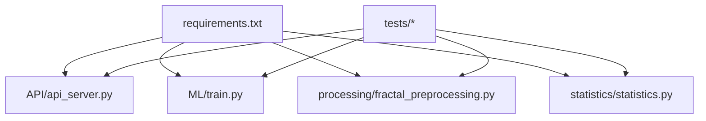

# Continuous Integration

<cite>
**Referenced Files in This Document**
- [README.md](file://README.md)
- [requirements.txt](file://requirements.txt)
- [.github/copilot-instructions.md](file://.github/copilot-instructions.md)
- [.claude/settings.json](file://.claude/settings.json)
- [.kilocode/mcp.json](file://.kilocode/mcp.json)
- [.opencode/opencode.json](file://.opencode/opencode.json)
- [.codex/hooks.json](file://.codex/hooks.json)
- [tests/README.md](file://tests/README.md)
- [API/api_server.py](file://API/api_server.py)
- [ML/train.py](file://ML/train.py)
- [processing/fractal_preprocessing.py](file://processing/fractal_preprocessing.py)
- [statistics/statistics.py](file://statistics/statistics.py)
</cite>

## Table of Contents
1. Introduction
2. Project Structure
3. Core Components
4. Architecture Overview
5. Detailed Component Analysis
6. Dependency Analysis
7. Performance Considerations
8. Troubleshooting Guide
9. Conclusion
10. Appendices

## Introduction
This document defines the continuous integration (CI) strategy for the SoSimple system. It covers automated testing, build processes, artifact generation, code quality checks, and deployment automation. It also documents how AI assistants and development tools are integrated to assist with code review and testing, and provides guidance for local environments that mirror CI conditions. Configuration management across environments and secret handling strategies are included, along with monitoring and alerting for failed builds and test failures. Finally, it outlines the release process and version management procedures.

## Project Structure
SoSimple is a multi-component repository containing Python-based ML models, data processing scripts, an API server, MQL components for trading platforms, tests, and documentation. The CI pipeline should be aware of these distinct areas:
- API layer: HTTP server and telemetry utilities
- ML layer: model training, benchmarks, and experiments
- Processing layer: feature engineering and labeling
- Statistics layer: EDA and reporting
- Tests: unit and integration tests covering all layers
- Tooling: AI assistant configurations and hooks

[No sources needed since this diagram shows conceptual structure]

**Section sources**
- [README.md](file://README.md)

## Core Components
The CI pipeline orchestrates several core components:
- Code quality checks: linting, formatting, static analysis
- Automated testing: unit tests, integration tests, and domain-specific validations
- Build artifacts: model checkpoints, reports, and packaged distributions
- Deployment automation: staging and production releases with environment-specific configuration
- AI-assisted workflows: automated code review and testing assistance via configured agents

Key files that influence CI behavior:
- requirements.txt: Python dependencies for reproducible environments
- .github/copilot-instructions.md: GitHub Copilot instructions used during PR reviews
- .claude/settings.json: Claude settings influencing agent behavior
- .kilocode/mcp.json: KiloCode MCP configuration for tool integrations
- .opencode/opencode.json: Opencode plugin and agent configuration
- .codex/hooks.json: Codex hooks for pre/post actions in development workflows
- tests/README.md: Test execution conventions and coverage expectations

**Section sources**
- [requirements.txt](file://requirements.txt)
- [.github/copilot-instructions.md](file://.github/copilot-instructions.md)
- [.claude/settings.json](file://.claude/settings.json)
- [.kilocode/mcp.json](file://.kilocode/mcp.json)
- [.opencode/opencode.json](file://.opencode/opencode.json)
- [.codex/hooks.json](file://.codex/hooks.json)
- [tests/README.md](file://tests/README.md)

## Architecture Overview
The CI architecture integrates multiple stages triggered by repository events (pushes, pull requests, tags). Each stage runs in isolated containers or virtual environments to ensure reproducibility.

[No sources needed since this diagram shows conceptual workflow]

## Detailed Component Analysis

### Code Quality Checks
- Linting and formatting: Enforce consistent style using Python linters and formatters configured via project tooling.
- Static analysis: Use type checking and security scanning where applicable.
- AI-assisted review: GitHub Copilot instructions guide automated suggestions during PRs; Claude and other agents can provide contextual feedback based on repository rules.

Recommended steps:
- Install dependencies from requirements.txt
- Run linters and formatters
- Report violations as errors to fail the build

**Section sources**
- [.github/copilot-instructions.md](file://.github/copilot-instructions.md)
- [.claude/settings.json](file://.claude/settings.json)
- [.kilocode/mcp.json](file://.kilocode/mcp.json)
- [.opencode/opencode.json](file://.opencode/opencode.json)

### Automated Testing Execution
- Unit tests: Located under tests/, validate core logic across API, ML, processing, and statistics modules.
- Integration tests: Validate cross-module interactions and external dependencies.
- Coverage thresholds: Enforce minimum coverage to maintain reliability.

Execution flow:
- Prepare environment using requirements.txt
- Discover and run tests recursively
- Generate coverage reports
- Fail on threshold breaches or failing assertions

**Section sources**
- [tests/README.md](file://tests/README.md)
- [requirements.txt](file://requirements.txt)

### Build Processes and Artifact Generation
- Model artifacts: Save trained models and associated metadata to versioned directories.
- Reports: Generate statistical and benchmark reports for traceability.
- Packaging: Create distribution packages for API services and reusable libraries.

Artifacts typically include:
- Model checkpoints and configs
- Benchmark results and plots
- API server distributions
- Documentation outputs

**Section sources**
- [ML/train.py](file://ML/train.py)
- [statistics/statistics.py](file://statistics/statistics.py)

### Deployment Automation
- Staging deployments: Triggered on merge to main or specific branches after passing all checks.
- Production deployments: Triggered on tagged releases with explicit approval gates.
- Environment configuration: Use environment variables and secret managers to inject per-environment settings.

Deployment considerations:
- Idempotent rollouts
- Rollback strategies
- Health checks post-deploy

**Section sources**
- [API/api_server.py](file://API/api_server.py)

### AI Assistants and Development Tools Integration
- GitHub Copilot: Instructions define review guidelines and suggested fixes.
- Claude: Settings influence agent behavior for code analysis and suggestions.
- KiloCode MCP: Configures tool integrations for enhanced developer experience.
- Opencode: Plugins and agents automate repetitive tasks and augment workflows.
- Codex hooks: Pre/post actions streamline development and CI interactions.

Best practices:
- Keep agent configurations minimal and auditable
- Avoid embedding secrets in agent configs
- Use prompts and rules to enforce standards

**Section sources**
- [.github/copilot-instructions.md](file://.github/copilot-instructions.md)
- [.claude/settings.json](file://.claude/settings.json)
- [.kilocode/mcp.json](file://.kilocode/mcp.json)
- [.opencode/opencode.json](file://.opencode/opencode.json)
- [.codex/hooks.json](file://.codex/hooks.json)

### Local Development Environment Mirroring CI
To replicate CI conditions locally:
- Install dependencies from requirements.txt
- Configure environment variables matching CI values
- Run linters, formatters, and tests as defined in CI
- Use the same Python version and OS constraints as CI runners

Steps:
- Set up virtual environment
- Install pinned dependencies
- Execute test suites and coverage checks
- Validate artifacts generation paths

**Section sources**
- [requirements.txt](file://requirements.txt)
- [tests/README.md](file://tests/README.md)

### Configuration Management Across Environments
- Development: Minimal secrets, relaxed validation, verbose logging
- Staging: Near-production settings, synthetic data, stricter checks
- Production: Full secrets, hardened settings, performance tuning

Secret management strategies:
- Use environment variables injected by CI/CD
- Store sensitive values in secure vaults
- Rotate secrets regularly and audit access

**Section sources**
- [API/api_server.py](file://API/api_server.py)

### Monitoring and Alerting for Failed Builds and Test Failures
- Notifications: Slack, email, or issue creation on CI failures
- Dashboards: Track build success rates, test flakiness, and coverage trends
- Alerts: Escalate critical failures to on-call engineers

Recommendations:
- Centralize logs and metrics
- Define clear severity levels
- Automate remediation where possible

[No sources needed since this section provides general guidance]

### Release Process and Version Management
- Versioning: Semantic versioning for releases
- Tags: Annotated tags trigger production deployments
- Changelogs: Auto-generated from commit messages and PR descriptions
- Approval gates: Required reviews before merging and releasing

Release checklist:
- All tests pass
- Coverage meets thresholds
- Security scans clean
- Artifacts validated
- Stakeholders notified

**Section sources**
- [ML/train.py](file://ML/train.py)
- [statistics/statistics.py](file://statistics/statistics.py)

## Dependency Analysis
The CI pipeline depends on well-defined Python packages and tooling configurations. Ensuring dependency stability is crucial for reproducibility.

**Diagram sources**
- [requirements.txt](file://requirements.txt)
- [API/api_server.py](file://API/api_server.py)
- [ML/train.py](file://ML/train.py)
- [processing/fractal_preprocessing.py](file://processing/fractal_preprocessing.py)
- [statistics/statistics.py](file://statistics/statistics.py)

**Section sources**
- [requirements.txt](file://requirements.txt)

## Performance Considerations
- Cache dependencies to speed up CI runs
- Parallelize independent test suites
- Use incremental builds for large datasets or model training
- Optimize resource allocation for GPU/CPU-bound tasks

[No sources needed since this section provides general guidance]

## Troubleshooting Guide
Common issues and resolutions:
- Dependency conflicts: Pin versions and use lockfiles
- Test timeouts: Increase limits or optimize slow tests
- Missing secrets: Verify injection in CI environment
- Flaky tests: Isolate and stabilize nondeterministic cases

Debugging steps:
- Reproduce locally with CI environment variables
- Inspect logs and artifacts
- Reduce scope to identify root cause

**Section sources**
- [tests/README.md](file://tests/README.md)

## Conclusion
This CI strategy ensures reliable, repeatable, and secure delivery of SoSimple’s components. By integrating code quality checks, automated testing, artifact generation, and deployment automation, the team can maintain high standards while leveraging AI assistants to enhance productivity. Proper configuration management, secret handling, and monitoring further strengthen the pipeline’s resilience.

[No sources needed since this section summarizes without analyzing specific files]

## Appendices

### Appendix A: Local Setup Checklist
- Install Python version specified in CI
- Create virtual environment and install requirements
- Configure environment variables
- Run linters, tests, and generate artifacts
- Validate against CI behavior

**Section sources**
- [requirements.txt](file://requirements.txt)
- [tests/README.md](file://tests/README.md)

### Appendix B: Secret Management Best Practices
- Never commit secrets to version control
- Use CI/CD secret stores
- Rotate secrets periodically
- Audit access logs

[No sources needed since this section provides general guidance]