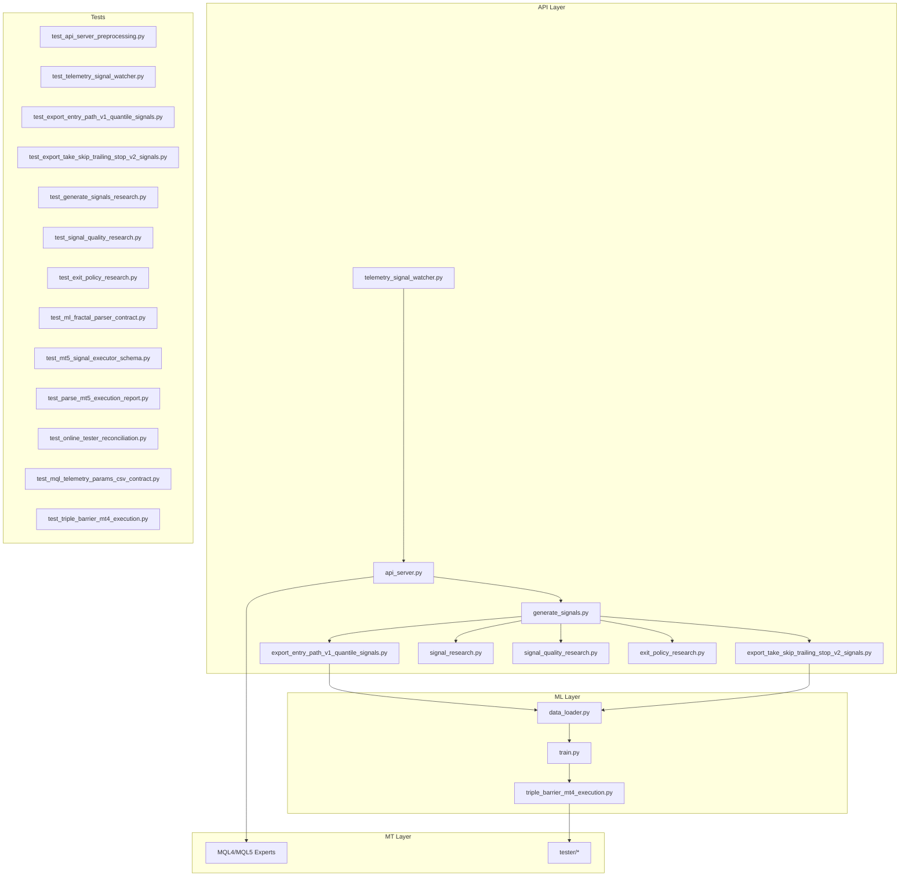
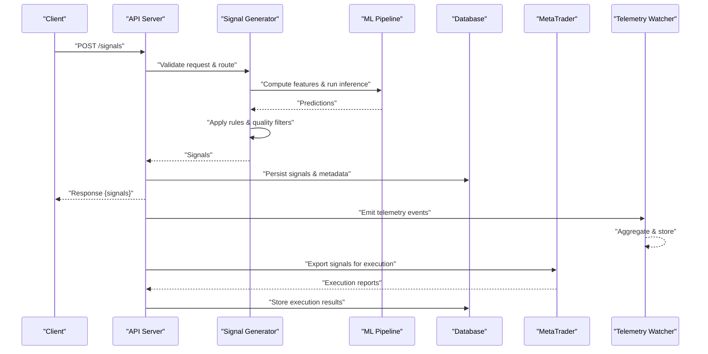
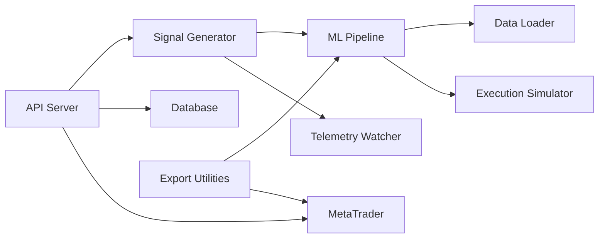

# Integration Testing

<cite>
**Referenced Files in This Document**
- [api_server.py](file://API/api_server.py)
- [test_api_client.py](file://API/test_api_client.py)
- [telemetry_signal_watcher.py](file://API/telemetry_signal_watcher.py)
- [generate_signals.py](file://API/generate_signals.py)
- [data_loader.py](file://ML/data_loader.py)
- [train.py](file://ML/train.py)
- [triple_barrier_mt4_execution.py](file://ML/triple_barrier_mt4_execution.py)
- [export_entry_path_v1_quantile_signals.py](file://API/export_entry_path_v1_quantile_signals.py)
- [export_take_skip_trailing_stop_v2_signals.py](file://API/export_take_skip_trailing_stop_v2_signals.py)
- [signal_research.py](file://API/signal_research.py)
- [signal_quality_research.py](file://API/signal_quality_research.py)
- [exit_policy_research.py](file://API/exit_policy_research.py)
- [test_api_server_preprocessing.py](file://tests/test_api_server_preprocessing.py)
- [test_telemetry_signal_watcher.py](file://tests/test_telemetry_signal_watcher.py)
- [test_export_entry_path_v1_quantile_signals.py](file://tests/test_export_entry_path_v1_quantile_signals.py)
- [test_export_take_skip_trailing_stop_v2_signals.py](file://tests/test_export_take_skip_trailing_stop_v2_signals.py)
- [test_generate_signals_research.py](file://tests/test_generate_signals_research.py)
- [test_signal_quality_research.py](file://tests/test_signal_quality_research.py)
- [test_exit_policy_research.py](file://tests/test_exit_policy_research.py)
- [test_ml_fractal_parser_contract.py](file://tests/test_ml_fractal_parser_contract.py)
- [test_mt5_signal_executor_schema.py](file://tests/test_mt5_signal_executor_schema.py)
- [test_parse_mt5_execution_report.py](file://tests/test_parse_mt5_execution_report.py)
- [test_online_tester_reconciliation.py](file://tests/test_online_tester_reconciliation.py)
- [test_mql_telemetry_params_csv_contract.py](file://tests/test_mql_telemetry_params_csv_contract.py)
- [test_triple_barrier_mt4_execution.py](file://tests/test_triple_barrier_mt4_execution.py)
- [README.md](file://README.md)
- [requirements.txt](file://requirements.txt)
</cite>

## Table of Contents
1. [Introduction](#introduction)
2. [Project Structure](#project-structure)
3. [Core Components](#core-components)
4. [Architecture Overview](#architecture-overview)
5. [Detailed Component Analysis](#detailed-component-analysis)
6. [Dependency Analysis](#dependency-analysis)
7. [Performance Considerations](#performance-considerations)
8. [Troubleshooting Guide](#troubleshooting-guide)
9. [Conclusion](#conclusion)
10. [Appendices](#appendices)

## Introduction
This document provides a comprehensive integration testing strategy for the SoSimple system, focusing on end-to-end validation across the ML pipeline, API server, and MetaTrader execution layers. It explains how to test data flow from raw market data through feature engineering, model inference, signal generation, API contracts, database interactions, and external service integrations (MetaTrader). It also covers strategies for asynchronous operations, real-time data feeds, telemetry collection, and robust mocking of external dependencies.

## Project Structure
SoSimple is organized into distinct layers:
- API layer: HTTP endpoints, signal export utilities, telemetry watchers, and research scripts.
- ML layer: Data loading, training, feature pipelines, and execution simulation.
- MT layer: MetaTrader MQL code and tester artifacts used for execution parity and telemetry.
- Tests: Unit and integration tests covering API contracts, ML schemas, and execution flows.

**Diagram sources**
- [api_server.py](file://API/api_server.py)
- [generate_signals.py](file://API/generate_signals.py)
- [export_entry_path_v1_quantile_signals.py](file://API/export_entry_path_v1_quantile_signals.py)
- [export_take_skip_trailing_stop_v2_signals.py](file://API/export_take_skip_trailing_stop_v2_signals.py)
- [telemetry_signal_watcher.py](file://API/telemetry_signal_watcher.py)
- [signal_research.py](file://API/signal_research.py)
- [signal_quality_research.py](file://API/signal_quality_research.py)
- [exit_policy_research.py](file://API/exit_policy_research.py)
- [data_loader.py](file://ML/data_loader.py)
- [train.py](file://ML/train.py)
- [triple_barrier_mt4_execution.py](file://ML/triple_barrier_mt4_execution.py)

**Section sources**
- [README.md](file://README.md)
- [requirements.txt](file://requirements.txt)

## Core Components
The integration test strategy centers around these core components:
- API Server: Exposes endpoints for signal generation and telemetry ingestion; validates request/response contracts.
- Signal Generation Pipeline: Orchestrates feature computation, model inference, and rule-based filtering to produce trading signals.
- Export Utilities: Generate quantile and trailing stop signals for downstream consumption by MT systems.
- Telemetry Watcher: Monitors and aggregates telemetry streams for observability and reconciliation.
- ML Data Loader and Training: Loads market data, prepares features, trains models, and ensures reproducibility.
- Execution Simulation: Simulates MT4/MT5 execution logic to validate signal behavior under realistic constraints.

Key integration points:
- API to ML: Request payloads validated against schema; responses include structured signals with timestamps and metadata.
- API to Telemetry: Ingestion of event logs; watcher verifies ordering, deduplication, and aggregation correctness.
- ML to MT: Exported signals conform to MT-compatible formats; execution simulation ensures parity with MT behavior.

**Section sources**
- [api_server.py](file://API/api_server.py)
- [generate_signals.py](file://API/generate_signals.py)
- [export_entry_path_v1_quantile_signals.py](file://API/export_entry_path_v1_quantile_signals.py)
- [export_take_skip_trailing_stop_v2_signals.py](file://API/export_take_skip_trailing_stop_v2_signals.py)
- [telemetry_signal_watcher.py](file://API/telemetry_signal_watcher.py)
- [data_loader.py](file://ML/data_loader.py)
- [train.py](file://ML/train.py)
- [triple_barrier_mt4_execution.py](file://ML/triple_barrier_mt4_execution.py)

## Architecture Overview
The end-to-end processing pipeline transforms raw market data into executable trading signals via the following stages:
1. Data Ingestion: Raw OHLCV and tick data loaded via ML data loader.
2. Feature Engineering: Causal preprocessing and fractal feature extraction ensure no look-ahead bias.
3. Model Inference: Trained models predict direction, entry path, or outcome targets.
4. Signal Generation: Rule-based filters and quality checks convert predictions into actionable signals.
5. API Exposure: Signals are exposed via HTTP endpoints with strict contracts and versioning.
6. Export and Execution: Quantile and trailing stop signals exported for MT consumption; execution simulated for validation.
7. Telemetry: Events captured and aggregated for monitoring and post-trade analysis.

**Diagram sources**
- [api_server.py](file://API/api_server.py)
- [generate_signals.py](file://API/generate_signals.py)
- [data_loader.py](file://ML/data_loader.py)
- [triple_barrier_mt4_execution.py](file://ML/triple_barrier_mt4_execution.py)
- [telemetry_signal_watcher.py](file://API/telemetry_signal_watcher.py)

## Detailed Component Analysis

### API Server Integration Tests
Focus areas:
- Endpoint contract validation: request schema, response structure, status codes.
- Error handling: malformed requests, missing fields, invalid timestamps.
- Concurrency: concurrent requests and resource contention.
- Telemetry ingestion: event ordering, deduplication, aggregation accuracy.

Recommended tests:
- Validate POST /signals with valid payload returns structured signals.
- Assert error responses for invalid inputs (e.g., missing symbol, bad timestamp format).
- Test concurrent requests to ensure thread safety and consistent state.
- Verify telemetry events are emitted and stored correctly.

**Section sources**
- [api_server.py](file://API/api_server.py)
- [test_api_client.py](file://API/test_api_client.py)
- [test_api_server_preprocessing.py](file://tests/test_api_server_preprocessing.py)
- [test_telemetry_signal_watcher.py](file://tests/test_telemetry_signal_watcher.py)

### Signal Generation Pipeline Integration Tests
Focus areas:
- Feature computation correctness and causality.
- Model inference stability and reproducibility.
- Rule-based filtering and quality checks.
- End-to-end signal validity (timestamps, symbols, confidence scores).

Recommended tests:
- Feed synthetic OHLCV data through feature pipeline and assert expected outputs.
- Load trained models and verify prediction shapes and ranges.
- Apply rule filters and confirm signal eligibility criteria.
- Validate exported signals conform to MT-compatible schemas.

**Section sources**
- [generate_signals.py](file://API/generate_signals.py)
- [data_loader.py](file://ML/data_loader.py)
- [train.py](file://ML/train.py)
- [test_generate_signals_research.py](file://tests/test_generate_signals_research.py)
- [test_signal_quality_research.py](file://tests/test_signal_quality_research.py)
- [test_exit_policy_research.py](file://tests/test_exit_policy_research.py)

### Export Utilities Integration Tests
Focus areas:
- Quantile signal export format and content integrity.
- Trailing stop signal export parameters and boundary conditions.
- Compatibility with MT consumption patterns.

Recommended tests:
- Generate quantile signals and assert field presence, types, and value ranges.
- Export trailing stop signals and verify stop levels, take profits, and slippage handling.
- Cross-check exported files with MT parser expectations.

**Section sources**
- [export_entry_path_v1_quantile_signals.py](file://API/export_entry_path_v1_quantile_signals.py)
- [export_take_skip_trailing_stop_v2_signals.py](file://API/export_take_skip_trailing_stop_v2_signals.py)
- [test_export_entry_path_v1_quantile_signals.py](file://tests/test_export_entry_path_v1_quantile_signals.py)
- [test_export_take_skip_trailing_stop_v2_signals.py](file://tests/test_export_take_skip_trailing_stop_v2_signals.py)

### Telemetry Watcher Integration Tests
Focus areas:
- Event ingestion rate and backpressure handling.
- Aggregation windows and metric calculations.
- Persistence and retrieval consistency.

Recommended tests:
- Inject high-volume telemetry events and verify throughput and latency.
- Assert aggregated metrics match expected values over time windows.
- Validate persistence layer writes and reads are consistent.

**Section sources**
- [telemetry_signal_watcher.py](file://API/telemetry_signal_watcher.py)
- [test_telemetry_signal_watcher.py](file://tests/test_telemetry_signal_watcher.py)

### ML Data Loader and Training Integration Tests
Focus areas:
- Data loading correctness and schema validation.
- Training reproducibility and checkpoint integrity.
- Feature normalization and scaling stability.

Recommended tests:
- Load datasets and assert shape, dtype, and missing value handling.
- Train models with fixed seeds and compare checkpoints for equality.
- Validate normalization parameters and inverse transformations.

**Section sources**
- [data_loader.py](file://ML/data_loader.py)
- [train.py](file://ML/train.py)
- [test_ml_fractal_parser_contract.py](file://tests/test_ml_fractal_parser_contract.py)

### Execution Simulation Integration Tests
Focus areas:
- Parity between Python execution simulation and MT behavior.
- Order lifecycle management (entry, exit, slippage, fees).
- Reconciliation with online tester results.

Recommended tests:
- Run triple barrier execution simulation and compare with MT tester outputs.
- Validate order states and PnL calculations under various market conditions.
- Reconcile online tester results with simulation outputs.

**Section sources**
- [triple_barrier_mt4_execution.py](file://ML/triple_barrier_mt4_execution.py)
- [test_triple_barrier_mt4_execution.py](file://tests/test_triple_barrier_mt4_execution.py)
- [test_online_tester_reconciliation.py](file://tests/test_online_tester_reconciliation.py)

## Dependency Analysis
Integration tests must account for dependencies across layers:
- API depends on signal generation and telemetry modules.
- Signal generation depends on ML data loader and trained models.
- Export utilities depend on ML outputs and MT schema definitions.
- Execution simulation depends on MT tester artifacts and historical data.

**Diagram sources**
- [api_server.py](file://API/api_server.py)
- [generate_signals.py](file://API/generate_signals.py)
- [data_loader.py](file://ML/data_loader.py)
- [triple_barrier_mt4_execution.py](file://ML/triple_barrier_mt4_execution.py)
- [export_entry_path_v1_quantile_signals.py](file://API/export_entry_path_v1_quantile_signals.py)
- [export_take_skip_trailing_stop_v2_signals.py](file://API/export_take_skip_trailing_stop_v2_signals.py)
- [telemetry_signal_watcher.py](file://API/telemetry_signal_watcher.py)

**Section sources**
- [api_server.py](file://API/api_server.py)
- [generate_signals.py](file://API/generate_signals.py)
- [data_loader.py](file://ML/data_loader.py)
- [triple_barrier_mt4_execution.py](file://ML/triple_barrier_mt4_execution.py)
- [export_entry_path_v1_quantile_signals.py](file://API/export_entry_path_v1_quantile_signals.py)
- [export_take_skip_trailing_stop_v2_signals.py](file://API/export_take_skip_trailing_stop_v2_signals.py)
- [telemetry_signal_watcher.py](file://API/telemetry_signal_watcher.py)

## Performance Considerations
- Batch processing: Use batched data loaders to reduce I/O overhead during integration tests.
- Asynchronous operations: Mock external services and use async queues to simulate real-time feeds without blocking tests.
- Resource isolation: Isolate database and file system access using in-memory stores or temporary directories.
- Concurrency limits: Enforce request rate limits and monitor thread pool utilization in API server tests.
- Determinism: Fix random seeds and use deterministic data fixtures to ensure reproducible test outcomes.

[No sources needed since this section provides general guidance]

## Troubleshooting Guide
Common issues and resolutions:
- Schema mismatches: Validate request/response structures against defined contracts; update parsers if needed.
- Data leakage: Ensure causal preprocessing prevents look-ahead bias; audit feature construction.
- Telemetry gaps: Check event emission points and aggregation windows; verify persistence layer connectivity.
- Execution drift: Compare simulation outputs with MT tester logs; adjust slippage and fee models.
- Concurrency errors: Inspect thread safety in shared resources; add locks or use message queues.

**Section sources**
- [test_ml_fractal_parser_contract.py](file://tests/test_ml_fractal_parser_contract.py)
- [test_mt5_signal_executor_schema.py](file://tests/test_mt5_signal_executor_schema.py)
- [test_parse_mt5_execution_report.py](file://tests/test_parse_mt5_execution_report.py)
- [test_mql_telemetry_params_csv_contract.py](file://tests/test_mql_telemetry_params_csv_contract.py)

## Conclusion
The integration testing strategy for SoSimple ensures robust validation across the ML pipeline, API server, and MetaTrader execution layers. By focusing on component interactions, data flow integrity, and external service mocks, teams can confidently deploy changes while maintaining system reliability and performance. Continuous testing, coupled with clear contracts and observability, forms the backbone of a resilient trading system.

[No sources needed since this section summarizes without analyzing specific files]

## Appendices

### Test Environment Setup
- Install dependencies from requirements.txt.
- Prepare synthetic market data fixtures for deterministic testing.
- Configure in-memory databases and temporary storage for telemetry and exports.
- Set up mock servers for external APIs and MetaTrader simulators.

**Section sources**
- [requirements.txt](file://requirements.txt)

### Mock Strategies
- External APIs: Use HTTP stubs to return predefined responses and simulate failures.
- MetaTrader: Employ MQL tester artifacts and CSV-based telemetry mocks.
- Database: Utilize SQLite in-memory or transactional rollback for clean test states.
- File System: Isolate writes to temporary directories and assert file contents.

**Section sources**
- [test_mt5_signal_executor_schema.py](file://tests/test_mt5_signal_executor_schema.py)
- [test_mql_telemetry_params_csv_contract.py](file://tests/test_mql_telemetry_params_csv_contract.py)

### Real-Time Data Feeds and Asynchronous Operations
- Simulate streaming data using generators and async queues.
- Validate event ordering and deduplication under high load.
- Monitor latency and throughput metrics during integration tests.

**Section sources**
- [telemetry_signal_watcher.py](file://API/telemetry_signal_watcher.py)
- [test_telemetry_signal_watcher.py](file://tests/test_telemetry_signal_watcher.py)