# Performance Benchmarking

<cite>
**Referenced Files in This Document**
- [baseline_experiments.py](file://ML/baseline/baseline_experiments.py)
- [feature_ablation.py](file://ML/baseline/feature_ablation.py)
- [compare_architectures.py](file://ML/compare_architectures.py)
- [ablation_study.py](file://ML/ablation_study.py)
- [train.py](file://ML/train.py)
- [data_loader.py](file://ML/data_loader.py)
- [utils.py](file://ML/utils.py)
- [losses.py](file://ML/losses.py)
- [entry_path_v1_quantile_transformer.py](file://ML/models/entry_path_v1_quantile_transformer.py)
- [transformer.py](file://ML/models/transformer.py)
- [cnn1d.py](file://ML/models/cnn1d.py)
- [bilstm.py](file://ML/models/bilstm.py)
- [benchmark_entry_path_v2.py](file://ML/benchmark_entry_path_v2.py)
- [benchmark_cross_instrument_robustness.py](file://ML/benchmark_cross_instrument_robustness.py)
- [benchmark_execution_policy_v2.py](file://ML/benchmark_execution_policy_v2.py)
- [benchmark_signal_export_parity.py](file://ML/benchmark_signal_export_parity.py)
- [benchmark_telemetry_frequency_calibration.py](file://ML/benchmark_telemetry_frequency_calibration.py)
- [test_benchmark_entry_path_v2.py](file://tests/test_benchmark_entry_path_v2.py)
- [test_benchmark_cross_instrument_robustness.py](file://tests/test_benchmark_cross_instrument_robustness.py)
- [test_benchmark_execution_policy_v2.py](file://tests/test_benchmark_execution_policy_v2.py)
- [test_benchmark_signal_export_parity.py](file://tests/test_benchmark_signal_export_parity.py)
- [test_benchmark_telemetry_frequency_calibration.py](file://tests/test_benchmark_telemetry_frequency_calibration.py)
- [api_server.py](file://API/api_server.py)
- [generate_signals.py](file://API/generate_signals.py)
- [fractal_preprocessing.py](file://processing/fractal_preprocessing.py)
- [online_causal_preprocessing.py](file://processing/online_causal_preprocessing.py)
- [normalize.py](file://processing/normalize.py)
- [label_main.py](file://processing/label_main.py)
</cite>

## Table of Contents
1. [Introduction](#introduction)
2. [Project Structure](#project-structure)
3. [Core Components](#core-components)
4. [Architecture Overview](#architecture-overview)
5. [Detailed Component Analysis](#detailed-component-analysis)
6. [Dependency Analysis](#dependency-analysis)
7. [Performance Considerations](#performance-considerations)
8. [Troubleshooting Guide](#troubleshooting-guide)
9. [Conclusion](#conclusion)
10. [Appendices](#appendices)

## Introduction
This document provides a comprehensive performance benchmarking guide for the SoSimple system. It focuses on measuring model inference speed, memory usage, and computational efficiency; conducting ablation studies to evaluate feature importance and component contributions; profiling data preprocessing pipelines and signal generation processes; comparing model architectures and hyperparameter configurations; establishing baselines for new features or updates; and testing under production-like load conditions and resource constraints.

The guidance is grounded in the repository’s existing benchmarking scripts, training utilities, model implementations, preprocessing modules, and API server components.

## Project Structure
SoSimple organizes benchmarking, modeling, preprocessing, and API layers across dedicated directories:
- ML: Contains models, training, evaluation, ablation, and benchmark scripts.
- API: Provides an HTTP interface for signal generation and telemetry.
- processing: Implements causal preprocessing, labeling, normalization, and fractal preprocessing.
- tests: Validates benchmark behaviors and ensures reproducibility.

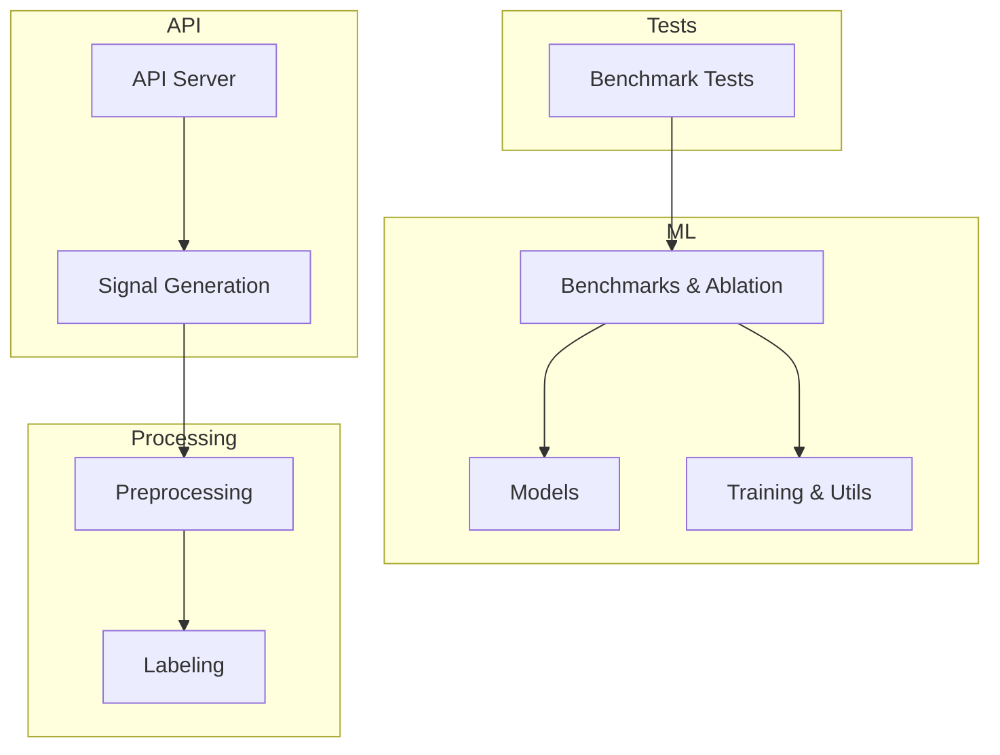

[No sources needed since this diagram shows conceptual workflow, not actual code structure]

## Core Components
- Baseline experiments framework: Centralized entry points to establish reproducible baselines for tasks and datasets.
- Ablation study utilities: Systematic removal or modification of features/components to quantify their impact.
- Model implementations: Transformer-based, CNN1D, BiLSTM, and specialized variants (e.g., quantile transformer).
- Training and utilities: Common training loops, metrics, and helper functions used by benchmarks.
- Data loader and preprocessing: Efficient loading and transformation pipelines for time-series and fractal features.
- API server and signal generation: Endpoints that serve predictions and generate signals under realistic loads.
- Test harness: Automated validation of benchmark scripts and expected behaviors.

**Section sources**
- [baseline_experiments.py](file://ML/baseline/baseline_experiments.py)
- [feature_ablation.py](file://ML/baseline/feature_ablation.py)
- [ablation_study.py](file://ML/ablation_study.py)
- [train.py](file://ML/train.py)
- [data_loader.py](file://ML/data_loader.py)
- [utils.py](file://ML/utils.py)
- [losses.py](file://ML/losses.py)
- [api_server.py](file://API/api_server.py)
- [generate_signals.py](file://API/generate_signals.py)
- [fractal_preprocessing.py](file://processing/fractal_preprocessing.py)
- [online_causal_preprocessing.py](file://processing/online_causal_preprocessing.py)
- [normalize.py](file://processing/normalize.py)
- [label_main.py](file://processing/label_main.py)

## Architecture Overview
The benchmarking architecture integrates data ingestion, preprocessing, model inference, and reporting into a cohesive pipeline. Benchmarks orchestrate runs across datasets, models, and configurations while capturing latency, throughput, memory, and accuracy metrics.

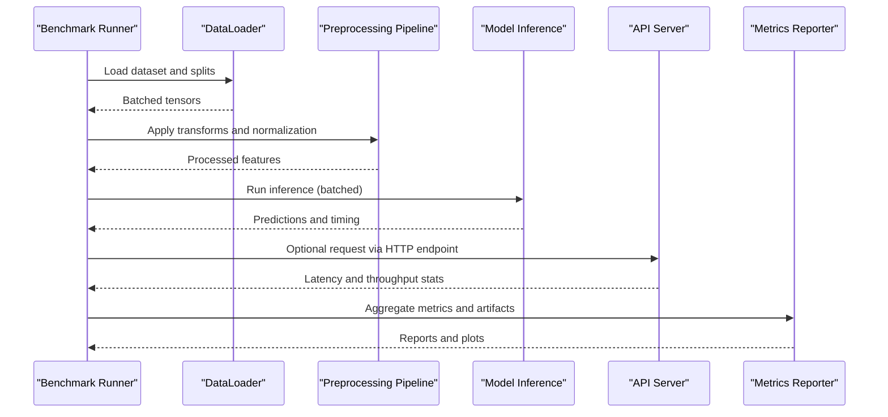

**Diagram sources**
- [data_loader.py](file://ML/data_loader.py)
- [fractal_preprocessing.py](file://processing/fractal_preprocessing.py)
- [online_causal_preprocessing.py](file://processing/online_causal_preprocessing.py)
- [normalize.py](file://processing/normalize.py)
- [train.py](file://ML/train.py)
- [api_server.py](file://API/api_server.py)
- [generate_signals.py](file://API/generate_signals.py)

## Detailed Component Analysis

### Baseline Experiments Framework
Purpose: Establish consistent baselines for model performance across tasks, datasets, and configurations. The baseline framework standardizes data splits, preprocessing steps, model initialization, and evaluation metrics.

Key responsibilities:
- Define experiment configurations and seeds.
- Orchestrate training and evaluation routines.
- Record metrics and artifacts for reproducibility.

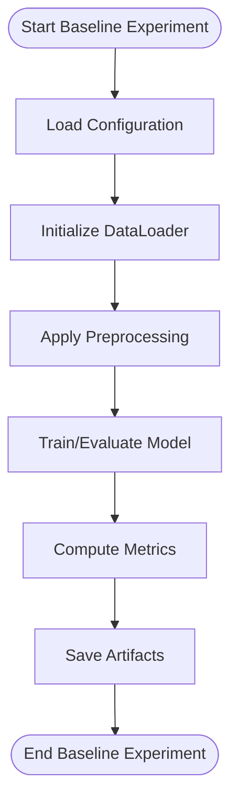

**Diagram sources**
- [baseline_experiments.py](file://ML/baseline/baseline_experiments.py)
- [data_loader.py](file://ML/data_loader.py)
- [train.py](file://ML/train.py)

**Section sources**
- [baseline_experiments.py](file://ML/baseline/baseline_experiments.py)

### Ablation Study Utilities
Purpose: Quantify the contribution of individual features or model components through systematic removal or modification.

Key responsibilities:
- Generate ablation configurations (feature subsets, component toggles).
- Re-run baseline experiments with modified inputs.
- Compare performance deltas and report significance.

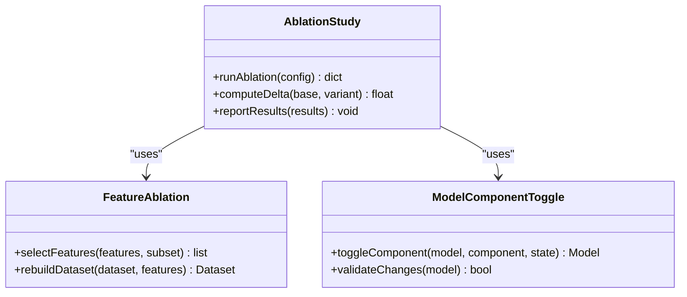

**Diagram sources**
- [feature_ablation.py](file://ML/baseline/feature_ablation.py)
- [ablation_study.py](file://ML/ablation_study.py)

**Section sources**
- [feature_ablation.py](file://ML/baseline/feature_ablation.py)
- [ablation_study.py](file://ML/ablation_study.py)

### Model Implementations
Purpose: Provide diverse architectures for benchmarking inference speed, memory footprint, and accuracy.

Key models:
- Transformer-based models (including quantile variants).
- CNN1D for sequence modeling.
- BiLSTM for recurrent sequence modeling.

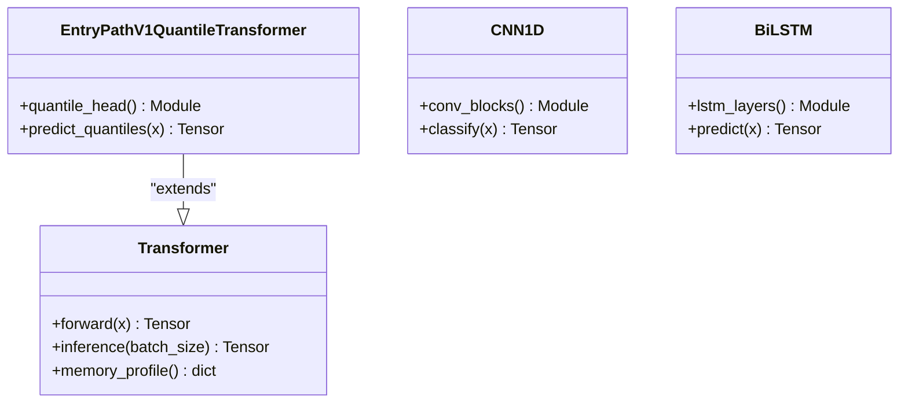

**Diagram sources**
- [transformer.py](file://ML/models/transformer.py)
- [entry_path_v1_quantile_transformer.py](file://ML/models/entry_path_v1_quantile_transformer.py)
- [cnn1d.py](file://ML/models/cnn1d.py)
- [bilstm.py](file://ML/models/bilstm.py)

**Section sources**
- [transformer.py](file://ML/models/transformer.py)
- [entry_path_v1_quantile_transformer.py](file://ML/models/entry_path_v1_quantile_transformer.py)
- [cnn1d.py](file://ML/models/cnn1d.py)
- [bilstm.py](file://ML/models/bilstm.py)

### Training and Utilities
Purpose: Provide common training loops, loss functions, and utility helpers used across benchmarks.

Key responsibilities:
- Standardize training procedures and evaluation metrics.
- Offer helper functions for logging, checkpointing, and profiling.

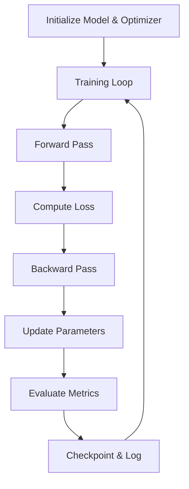

**Diagram sources**
- [train.py](file://ML/train.py)
- [losses.py](file://ML/losses.py)
- [utils.py](file://ML/utils.py)

**Section sources**
- [train.py](file://ML/train.py)
- [losses.py](file://ML/losses.py)
- [utils.py](file://ML/utils.py)

### Data Loader and Preprocessing
Purpose: Efficiently load and preprocess time-series and fractal features for model input.

Key responsibilities:
- Manage dataset splits and batching.
- Apply causal transformations and normalization.
- Ensure temporal integrity and avoid leakage.

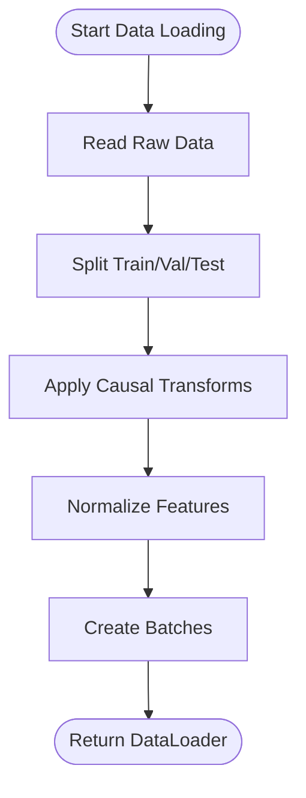

**Diagram sources**
- [data_loader.py](file://ML/data_loader.py)
- [fractal_preprocessing.py](file://processing/fractal_preprocessing.py)
- [online_causal_preprocessing.py](file://processing/online_causal_preprocessing.py)
- [normalize.py](file://processing/normalize.py)

**Section sources**
- [data_loader.py](file://ML/data_loader.py)
- [fractal_preprocessing.py](file://processing/fractal_preprocessing.py)
- [online_causal_preprocessing.py](file://processing/online_causal_preprocessing.py)
- [normalize.py](file://processing/normalize.py)

### API Server and Signal Generation
Purpose: Serve model predictions via HTTP endpoints and generate trading signals under realistic loads.

Key responsibilities:
- Handle incoming requests and batch processing.
- Measure latency and throughput for inference.
- Integrate with preprocessing and model inference.

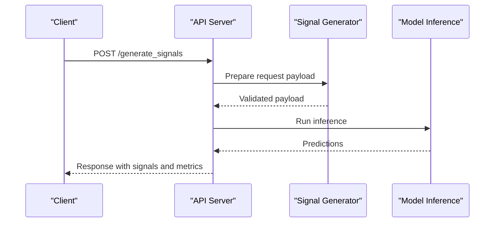

**Diagram sources**
- [api_server.py](file://API/api_server.py)
- [generate_signals.py](file://API/generate_signals.py)

**Section sources**
- [api_server.py](file://API/api_server.py)
- [generate_signals.py](file://API/generate_signals.py)

### Benchmark Scripts
Purpose: Execute specific benchmark scenarios such as cross-instrument robustness, execution policy comparisons, signal export parity, and telemetry frequency calibration.

Key responsibilities:
- Configure datasets, models, and hyperparameters.
- Run inference and collect performance metrics.
- Validate results against expected thresholds.

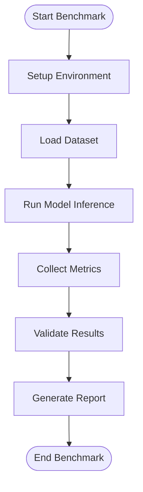

**Diagram sources**
- [benchmark_entry_path_v2.py](file://ML/benchmark_entry_path_v2.py)
- [benchmark_cross_instrument_robustness.py](file://ML/benchmark_cross_instrument_robustness.py)
- [benchmark_execution_policy_v2.py](file://ML/benchmark_execution_policy_v2.py)
- [benchmark_signal_export_parity.py](file://ML/benchmark_signal_export_parity.py)
- [benchmark_telemetry_frequency_calibration.py](file://ML/benchmark_telemetry_frequency_calibration.py)

**Section sources**
- [benchmark_entry_path_v2.py](file://ML/benchmark_entry_path_v2.py)
- [benchmark_cross_instrument_robustness.py](file://ML/benchmark_cross_instrument_robustness.py)
- [benchmark_execution_policy_v2.py](file://ML/benchmark_execution_policy_v2.py)
- [benchmark_signal_export_parity.py](file://ML/benchmark_signal_export_parity.py)
- [benchmark_telemetry_frequency_calibration.py](file://ML/benchmark_telemetry_frequency_calibration.py)

### Test Harness
Purpose: Ensure benchmark scripts behave as expected and maintain reproducibility.

Key responsibilities:
- Run unit tests for benchmark logic.
- Validate output formats and metric calculations.
- Guard against regressions in preprocessing and inference.

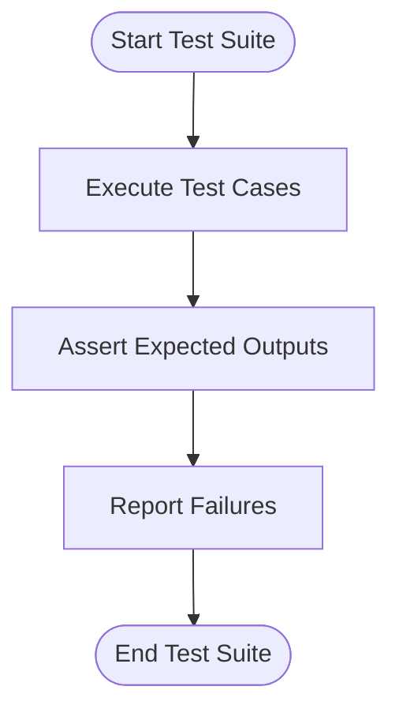

**Diagram sources**
- [test_benchmark_entry_path_v2.py](file://tests/test_benchmark_entry_path_v2.py)
- [test_benchmark_cross_instrument_robustness.py](file://tests/test_benchmark_cross_instrument_robustness.py)
- [test_benchmark_execution_policy_v2.py](file://tests/test_benchmark_execution_policy_v2.py)
- [test_benchmark_signal_export_parity.py](file://tests/test_benchmark_signal_export_parity.py)
- [test_benchmark_telemetry_frequency_calibration.py](file://tests/test_benchmark_telemetry_frequency_calibration.py)

**Section sources**
- [test_benchmark_entry_path_v2.py](file://tests/test_benchmark_entry_path_v2.py)
- [test_benchmark_cross_instrument_robustness.py](file://tests/test_benchmark_cross_instrument_robustness.py)
- [test_benchmark_execution_policy_v2.py](file://tests/test_benchmark_execution_policy_v2.py)
- [test_benchmark_signal_export_parity.py](file://tests/test_benchmark_signal_export_parity.py)
- [test_benchmark_telemetry_frequency_calibration.py](file://tests/test_benchmark_telemetry_frequency_calibration.py)

## Dependency Analysis
The benchmarking ecosystem depends on core ML components, preprocessing modules, and API services. Understanding these dependencies helps identify bottlenecks and optimization opportunities.

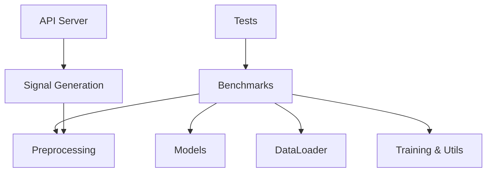

**Diagram sources**
- [benchmark_entry_path_v2.py](file://ML/benchmark_entry_path_v2.py)
- [data_loader.py](file://ML/data_loader.py)
- [fractal_preprocessing.py](file://processing/fractal_preprocessing.py)
- [train.py](file://ML/train.py)
- [api_server.py](file://API/api_server.py)
- [generate_signals.py](file://API/generate_signals.py)
- [test_benchmark_entry_path_v2.py](file://tests/test_benchmark_entry_path_v2.py)

**Section sources**
- [benchmark_entry_path_v2.py](file://ML/benchmark_entry_path_v2.py)
- [data_loader.py](file://ML/data_loader.py)
- [fractal_preprocessing.py](file://processing/fractal_preprocessing.py)
- [train.py](file://ML/train.py)
- [api_server.py](file://API/api_server.py)
- [generate_signals.py](file://API/generate_signals.py)
- [test_benchmark_entry_path_v2.py](file://tests/test_benchmark_entry_path_v2.py)

## Performance Considerations
- Inference Speed: Use batched inference and minimize Python overhead in hot paths. Profile GPU/CPU utilization to identify bottlenecks.
- Memory Usage: Monitor peak memory during preprocessing and inference. Optimize tensor shapes and avoid unnecessary copies.
- Computational Efficiency: Leverage vectorized operations and efficient data loaders. Consider mixed precision where supported.
- Load Conditions: Simulate production traffic patterns using the API server to measure latency and throughput under realistic loads.
- Resource Constraints: Test under CPU-only, limited GPU memory, and constrained I/O environments to ensure robustness.

[No sources needed since this section provides general guidance]

## Troubleshooting Guide
Common issues and resolutions:
- Data Loading Bottlenecks: Increase worker processes, optimize file formats, and precompute heavy transformations.
- Memory OOM Errors: Reduce batch size, enable gradient checkpointing (if applicable), and monitor memory usage.
- API Latency Spikes: Profile request handling, optimize model inference, and consider caching strategies.
- Benchmark Reproducibility: Fix random seeds, pin dependencies, and validate preprocessing steps.

**Section sources**
- [data_loader.py](file://ML/data_loader.py)
- [api_server.py](file://API/api_server.py)
- [train.py](file://ML/train.py)

## Conclusion
The SoSimple benchmarking framework provides a robust foundation for evaluating model inference speed, memory usage, and computational efficiency. By leveraging ablation studies, standardized baselines, and production-like load testing, teams can confidently compare architectures, tune hyperparameters, and validate new features or updates. Adhering to the outlined procedures ensures reproducibility, scalability, and reliability in both development and production environments.

[No sources needed since this section summarizes without analyzing specific files]

## Appendices
- Appendix A: Benchmark Execution Checklist
- Appendix B: Profiling Tools and Commands
- Appendix C: Example Metric Dashboards
- Appendix D: Load Testing Scenarios

[No sources needed since this section provides general guidance]