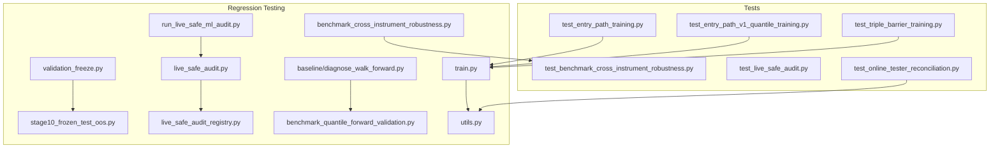
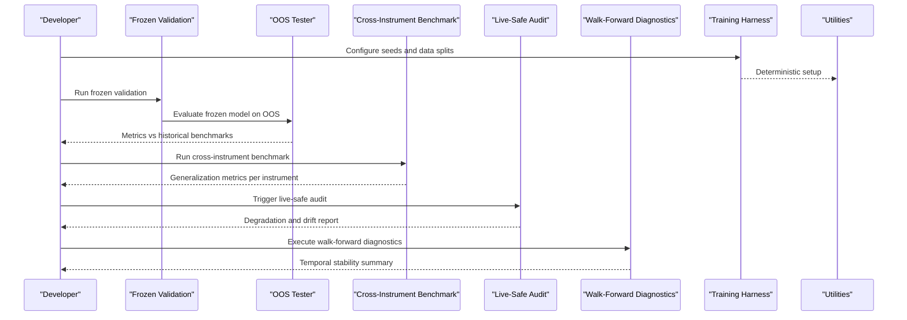
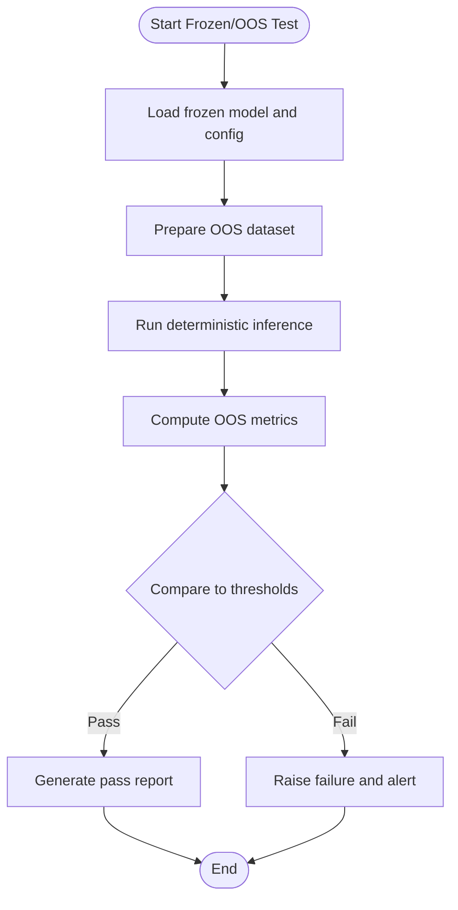
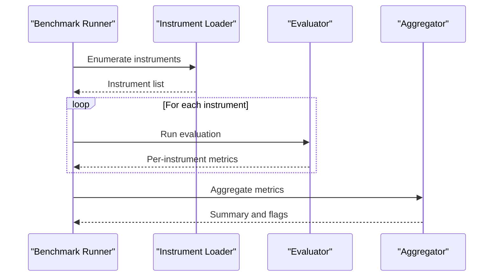
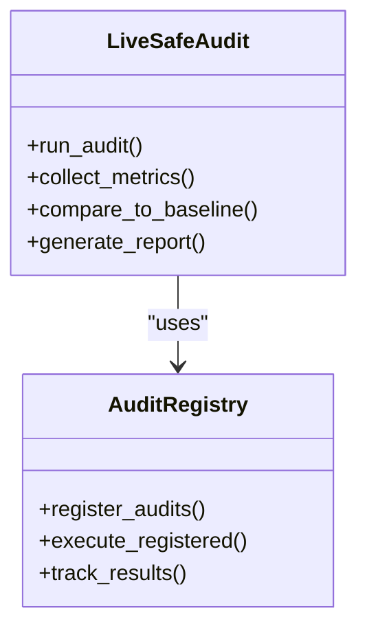
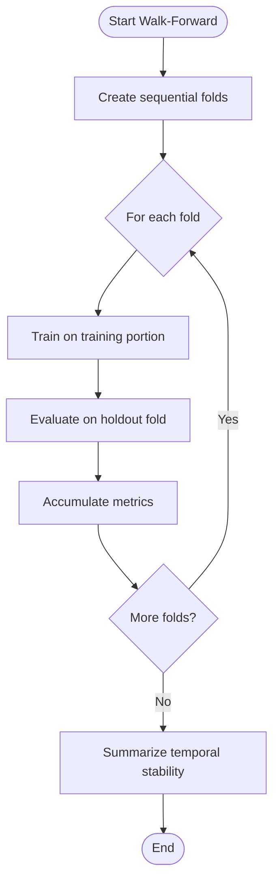
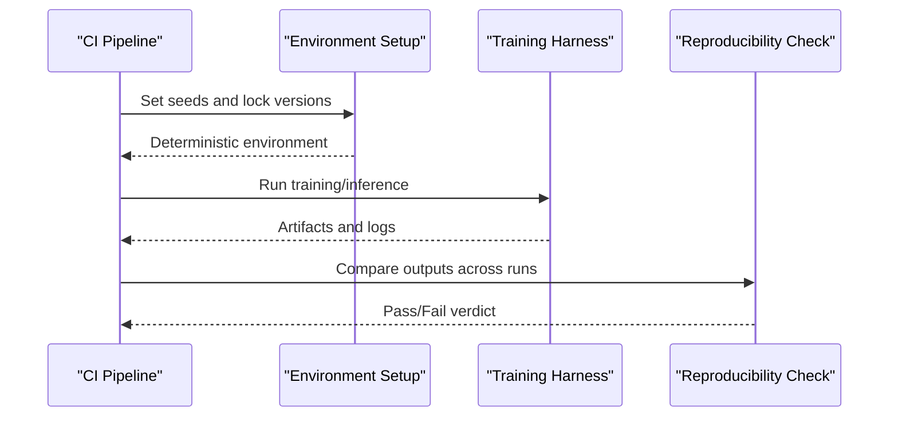
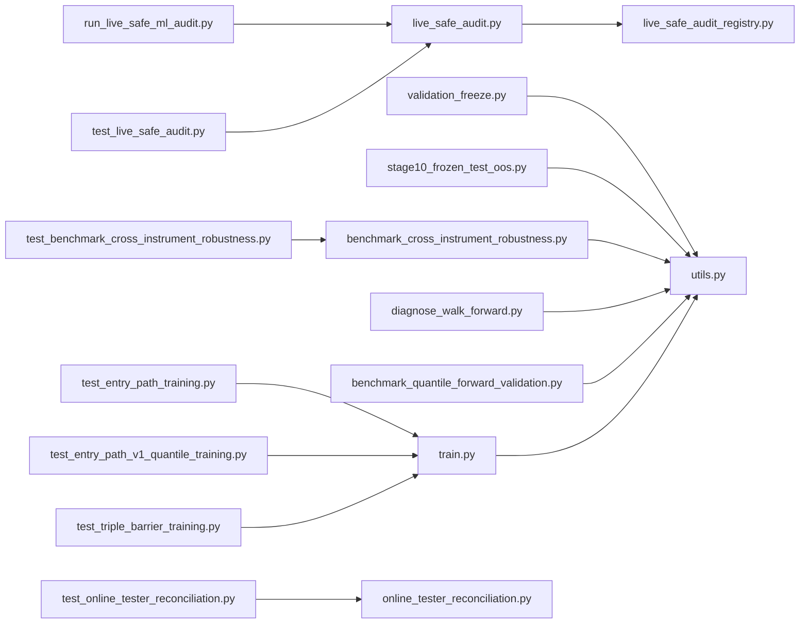

# Regression Testing

<cite>
**Referenced Files in This Document**
- [ML/validation_freeze.py](file://ML/validation_freeze.py)
- [ML/stage10_frozen_test_oos.py](file://ML/stage10_frozen_test_oos.py)
- [ML/benchmark_cross_instrument_robustness.py](file://ML/benchmark_cross_instrument_robustness.py)
- [ML/live_safe_audit.py](file://ML/live_safe_audit.py)
- [ML/live_safe_audit_registry.py](file://ML/live_safe_audit_registry.py)
- [ML/run_live_safe_ml_audit.py](file://ML/run_live_safe_ml_audit.py)
- [ML/diagnose_walk_forward.py](file://ML/baseline/diagnose_walk_forward.py)
- [ML/benchmark_quantile_forward_validation.py](file://ML/benchmark_quantile_forward_validation.py)
- [tests/test_benchmark_cross_instrument_robustness.py](file://tests/test_benchmark_cross_instrument_robustness.py)
- [tests/test_live_safe_audit.py](file://tests/test_live_safe_audit.py)
- [tests/test_diagnose_stage4_3.py](file://tests/test_diagnose_stage4_3.py)
- [tests/test_diagnose_stage4_4.py](file://tests/test_diagnose_stage4_4.py)
- [tests/test_entry_path_training.py](file://tests/test_entry_path_training.py)
- [tests/test_entry_path_v1_quantile_training.py](file://tests/test_entry_path_v1_quantile_training.py)
- [tests/test_triple_barrier_training.py](file://tests/test_triple_barrier_training.py)
- [tests/test_online_tester_reconciliation.py](file://tests/test_online_tester_reconciliation.py)
- [ML/online_tester_reconciliation.py](file://ML/online_tester_reconciliation.py)
- [ML/train.py](file://ML/train.py)
- [ML/utils.py](file://ML/utils.py)
</cite>

## Table of Contents
1. [Introduction](#introduction)
2. [Project Structure](#project-structure)
3. [Core Components](#core-components)
4. [Architecture Overview](#architecture-overview)
5. [Detailed Component Analysis](#detailed-component-analysis)
6. [Dependency Analysis](#dependency-analysis)
7. [Performance Considerations](#performance-considerations)
8. [Troubleshooting Guide](#troubleshooting-guide)
9. [Conclusion](#conclusion)
10. [Appendices](#appendices)

## Introduction
This document describes the regression testing framework for the SoSimple system with a focus on model stability, frozen tests, cross-instrument robustness, walk-forward validation, out-of-sample verification, live-safe auditing, drift detection, and reproducibility across hardware and software versions. It synthesizes the repository’s testing utilities, benchmarks, audits, and test suites into a cohesive guide that is accessible to both technical and non-technical readers.

## Project Structure
The regression testing capabilities are primarily implemented under ML/, baseline/, reports/, and tests/. Key areas include:
- Frozen validation and OOS testing utilities
- Cross-instrument robustness benchmarking
- Live-safe audit orchestration and registry
- Walk-forward diagnostics and forward validation
- Training harness and utilities used by tests
- Test suite covering core training, reconciliation, and benchmark behaviors

**Diagram sources**
- [ML/validation_freeze.py](file://ML/validation_freeze.py)
- [ML/stage10_frozen_test_oos.py](file://ML/stage10_frozen_test_oos.py)
- [ML/benchmark_cross_instrument_robustness.py](file://ML/benchmark_cross_instrument_robustness.py)
- [ML/live_safe_audit.py](file://ML/live_safe_audit.py)
- [ML/live_safe_audit_registry.py](file://ML/live_safe_audit_registry.py)
- [ML/run_live_safe_ml_audit.py](file://ML/run_live_safe_ml_audit.py)
- [ML/baseline/diagnose_walk_forward.py](file://ML/baseline/diagnose_walk_forward.py)
- [ML/benchmark_quantile_forward_validation.py](file://ML/benchmark_quantile_forward_validation.py)
- [ML/train.py](file://ML/train.py)
- [ML/utils.py](file://ML/utils.py)
- [tests/test_benchmark_cross_instrument_robustness.py](file://tests/test_benchmark_cross_instrument_robustness.py)
- [tests/test_live_safe_audit.py](file://tests/test_live_safe_audit.py)
- [tests/test_entry_path_training.py](file://tests/test_entry_path_training.py)
- [tests/test_entry_path_v1_quantile_training.py](file://tests/test_entry_path_v1_quantile_training.py)
- [tests/test_triple_barrier_training.py](file://tests/test_triple_barrier_training.py)
- [tests/test_online_tester_reconciliation.py](file://tests/test_online_tester_reconciliation.py)

**Section sources**
- [ML/validation_freeze.py](file://ML/validation_freeze.py)
- [ML/stage10_frozen_test_oos.py](file://ML/stage10_frozen_test_oos.py)
- [ML/benchmark_cross_instrument_robustness.py](file://ML/benchmark_cross_instrument_robustness.py)
- [ML/live_safe_audit.py](file://ML/live_safe_audit.py)
- [ML/live_safe_audit_registry.py](file://ML/live_safe_audit_registry.py)
- [ML/run_live_safe_ml_audit.py](file://ML/run_live_safe_ml_audit.py)
- [ML/baseline/diagnose_walk_forward.py](file://ML/baseline/diagnose_walk_forward.py)
- [ML/benchmark_quantile_forward_validation.py](file://ML/benchmark_quantile_forward_validation.py)
- [ML/train.py](file://ML/train.py)
- [ML/utils.py](file://ML/utils.py)
- [tests/test_benchmark_cross_instrument_robustness.py](file://tests/test_benchmark_cross_instrument_robustness.py)
- [tests/test_live_safe_audit.py](file://tests/test_live_safe_audit.py)
- [tests/test_entry_path_training.py](file://tests/test_entry_path_training.py)
- [tests/test_entry_path_v1_quantile_training.py](file://tests/test_entry_path_v1_quantile_training.py)
- [tests/test_triple_barrier_training.py](file://tests/test_triple_barrier_training.py)
- [tests/test_online_tester_reconciliation.py](file://tests/test_online_tester_reconciliation.py)

## Core Components
- Frozen Validation and OOS Testing: Utilities to freeze model behavior against historical baselines and validate out-of-sample performance without retraining.
- Cross-Instrument Robustness Benchmark: Evaluates generalization across different financial instruments to ensure stable performance.
- Live-Safe Audit: Orchestrates periodic audits to detect degradation and drift in live or near-live environments.
- Walk-Forward Diagnostics and Forward Validation: Implements rolling window evaluation and quantile-based forward validation to assess temporal stability.
- Training Harness and Utilities: Provides deterministic training flows and shared utilities leveraged by tests and audits.

**Section sources**
- [ML/validation_freeze.py](file://ML/validation_freeze.py)
- [ML/stage10_frozen_test_oos.py](file://ML/stage10_frozen_test_oos.py)
- [ML/benchmark_cross_instrument_robustness.py](file://ML/benchmark_cross_instrument_robustness.py)
- [ML/live_safe_audit.py](file://ML/live_safe_audit.py)
- [ML/live_safe_audit_registry.py](file://ML/live_safe_audit_registry.py)
- [ML/run_live_safe_ml_audit.py](file://ML/run_live_safe_ml_audit.py)
- [ML/baseline/diagnose_walk_forward.py](file://ML/baseline/diagnose_walk_forward.py)
- [ML/benchmark_quantile_forward_validation.py](file://ML/benchmark_quantile_forward_validation.py)
- [ML/train.py](file://ML/train.py)
- [ML/utils.py](file://ML/utils.py)

## Architecture Overview
The regression testing architecture integrates frozen validation, cross-instrument checks, live-safe audits, and walk-forward evaluations around a common training and utility layer. Tests assert expected behaviors and guardrails.

**Diagram sources**
- [ML/validation_freeze.py](file://ML/validation_freeze.py)
- [ML/stage10_frozen_test_oos.py](file://ML/stage10_frozen_test_oos.py)
- [ML/benchmark_cross_instrument_robustness.py](file://ML/benchmark_cross_instrument_robustness.py)
- [ML/live_safe_audit.py](file://ML/live_safe_audit.py)
- [ML/baseline/diagnose_walk_forward.py](file://ML/baseline/diagnose_walk_forward.py)
- [ML/train.py](file://ML/train.py)
- [ML/utils.py](file://ML/utils.py)

## Detailed Component Analysis

### Frozen Validation and Out-of-Sample Testing
- Purpose: Ensure models do not regress after updates by comparing new runs against frozen historical benchmarks.
- Workflow:
  - Load frozen artifacts and configuration.
  - Reproduce inference pipeline deterministically.
  - Compute metrics on OOS sets and compare to thresholds.
  - Fail fast if performance drops beyond acceptable bounds.

**Diagram sources**
- [ML/validation_freeze.py](file://ML/validation_freeze.py)
- [ML/stage10_frozen_test_oos.py](file://ML/stage10_frozen_test_oos.py)

**Section sources**
- [ML/validation_freeze.py](file://ML/validation_freeze.py)
- [ML/stage10_frozen_test_oos.py](file://ML/stage10_frozen_test_oos.py)

### Cross-Instrument Robustness Testing
- Purpose: Validate model generalization across multiple instruments to avoid overfitting to a single asset.
- Procedure:
  - Iterate over instrument subsets.
  - Apply consistent feature pipelines and evaluation metrics.
  - Aggregate results and flag instruments with significant deviations.

**Diagram sources**
- [ML/benchmark_cross_instrument_robustness.py](file://ML/benchmark_cross_instrument_robustness.py)

**Section sources**
- [ML/benchmark_cross_instrument_robustness.py](file://ML/benchmark_cross_instrument_robustness.py)
- [tests/test_benchmark_cross_instrument_robustness.py](file://tests/test_benchmark_cross_instrument_robustness.py)

### Live-Safe Audit Process
- Purpose: Continuously monitor model behavior in production-like settings to detect degradation and drift.
- Mechanisms:
  - Registry-driven audit tasks with configurable schedules.
  - Metric collection and comparison against baselines.
  - Alerts and reports when thresholds are breached.

**Diagram sources**
- [ML/live_safe_audit.py](file://ML/live_safe_audit.py)
- [ML/live_safe_audit_registry.py](file://ML/live_safe_audit_registry.py)

**Section sources**
- [ML/live_safe_audit.py](file://ML/live_safe_audit.py)
- [ML/live_safe_audit_registry.py](file://ML/live_safe_audit_registry.py)
- [ML/run_live_safe_ml_audit.py](file://ML/run_live_safe_ml_audit.py)
- [tests/test_live_safe_audit.py](file://tests/test_live_safe_audit.py)

### Walk-Forward Validation and Quantile Forward Validation
- Purpose: Assess temporal stability using rolling windows and quantile-based forward checks.
- Approach:
  - Split data into sequential folds.
  - Train on earlier folds, evaluate on next fold.
  - Aggregate performance across folds; check for monotonicity or acceptable variance.

**Diagram sources**
- [ML/baseline/diagnose_walk_forward.py](file://ML/baseline/diagnose_walk_forward.py)
- [ML/benchmark_quantile_forward_validation.py](file://ML/benchmark_quantile_forward_validation.py)

**Section sources**
- [ML/baseline/diagnose_walk_forward.py](file://ML/baseline/diagnose_walk_forward.py)
- [ML/benchmark_quantile_forward_validation.py](file://ML/benchmark_quantile_forward_validation.py)

### Reproducibility Across Hardware and Software Versions
- Strategy:
  - Fix random seeds and environment variables for determinism.
  - Use consistent data preprocessing and normalization routines.
  - Validate parity between CPU and GPU outputs where applicable.
  - Pin dependencies and record version metadata in reports.

**Diagram sources**
- [ML/train.py](file://ML/train.py)
- [ML/utils.py](file://ML/utils.py)

**Section sources**
- [ML/train.py](file://ML/train.py)
- [ML/utils.py](file://ML/utils.py)
- [tests/test_entry_path_training.py](file://tests/test_entry_path_training.py)
- [tests/test_entry_path_v1_quantile_training.py](file://tests/test_entry_path_v1_quantile_training.py)
- [tests/test_triple_barrier_training.py](file://tests/test_triple_barrier_training.py)

## Dependency Analysis
The regression testing components depend on shared training and utility modules, while tests assert expected behaviors and guardrails.

**Diagram sources**
- [ML/validation_freeze.py](file://ML/validation_freeze.py)
- [ML/stage10_frozen_test_oos.py](file://ML/stage10_frozen_test_oos.py)
- [ML/benchmark_cross_instrument_robustness.py](file://ML/benchmark_cross_instrument_robustness.py)
- [ML/live_safe_audit.py](file://ML/live_safe_audit.py)
- [ML/live_safe_audit_registry.py](file://ML/live_safe_audit_registry.py)
- [ML/run_live_safe_ml_audit.py](file://ML/run_live_safe_ml_audit.py)
- [ML/baseline/diagnose_walk_forward.py](file://ML/baseline/diagnose_walk_forward.py)
- [ML/benchmark_quantile_forward_validation.py](file://ML/benchmark_quantile_forward_validation.py)
- [ML/train.py](file://ML/train.py)
- [ML/utils.py](file://ML/utils.py)
- [tests/test_benchmark_cross_instrument_robustness.py](file://tests/test_benchmark_cross_instrument_robustness.py)
- [tests/test_live_safe_audit.py](file://tests/test_live_safe_audit.py)
- [tests/test_entry_path_training.py](file://tests/test_entry_path_training.py)
- [tests/test_entry_path_v1_quantile_training.py](file://tests/test_entry_path_v1_quantile_training.py)
- [tests/test_triple_barrier_training.py](file://tests/test_triple_barrier_training.py)
- [tests/test_online_tester_reconciliation.py](file://tests/test_online_tester_reconciliation.py)
- [ML/online_tester_reconciliation.py](file://ML/online_tester_reconciliation.py)

**Section sources**
- [ML/validation_freeze.py](file://ML/validation_freeze.py)
- [ML/stage10_frozen_test_oos.py](file://ML/stage10_frozen_test_oos.py)
- [ML/benchmark_cross_instrument_robustness.py](file://ML/benchmark_cross_instrument_robustness.py)
- [ML/live_safe_audit.py](file://ML/live_safe_audit.py)
- [ML/live_safe_audit_registry.py](file://ML/live_safe_audit_registry.py)
- [ML/run_live_safe_ml_audit.py](file://ML/run_live_safe_ml_audit.py)
- [ML/baseline/diagnose_walk_forward.py](file://ML/baseline/diagnose_walk_forward.py)
- [ML/benchmark_quantile_forward_validation.py](file://ML/benchmark_quantile_forward_validation.py)
- [ML/train.py](file://ML/train.py)
- [ML/utils.py](file://ML/utils.py)
- [tests/test_benchmark_cross_instrument_robustness.py](file://tests/test_benchmark_cross_instrument_robustness.py)
- [tests/test_live_safe_audit.py](file://tests/test_live_safe_audit.py)
- [tests/test_entry_path_training.py](file://tests/test_entry_path_training.py)
- [tests/test_entry_path_v1_quantile_training.py](file://tests/test_entry_path_v1_quantile_training.py)
- [tests/test_triple_barrier_training.py](file://tests/test_triple_barrier_training.py)
- [tests/test_online_tester_reconciliation.py](file://tests/test_online_tester_reconciliation.py)
- [ML/online_tester_reconciliation.py](file://ML/online_tester_reconciliation.py)

## Performance Considerations
- Deterministic execution: Fix seeds and disable nondeterministic operations where possible to reduce variance across runs.
- Efficient data loading: Use batched I/O and caching to minimize overhead during frozen and walk-forward evaluations.
- Parallelization: Leverage multi-processing for cross-instrument benchmarks while ensuring thread safety.
- Memory management: Monitor memory usage during large OOS datasets and consider chunked processing.

[No sources needed since this section provides general guidance]

## Troubleshooting Guide
Common issues and resolutions:
- Non-deterministic results:
  - Ensure seeds are set consistently across training and inference.
  - Pin library versions and verify environment parity.
- Cross-instrument failures:
  - Inspect per-instrument metrics for outliers and data quality issues.
  - Validate feature pipelines for instrument-specific edge cases.
- Live-safe audit alerts:
  - Review metric drifts and threshold breaches.
  - Re-run audits with expanded baselines or adjusted thresholds if necessary.
- Walk-forward instability:
  - Check fold boundaries for leakage and ensure causal ordering.
  - Normalize features consistently across folds.

**Section sources**
- [tests/test_diagnose_stage4_3.py](file://tests/test_diagnose_stage4_3.py)
- [tests/test_diagnose_stage4_4.py](file://tests/test_diagnose_stage4_4.py)
- [tests/test_online_tester_reconciliation.py](file://tests/test_online_tester_reconciliation.py)
- [ML/online_tester_reconciliation.py](file://ML/online_tester_reconciliation.py)

## Conclusion
The SoSimple regression testing framework combines frozen validation, cross-instrument robustness checks, live-safe audits, and walk-forward diagnostics to ensure model stability and generalization. By adhering to deterministic practices and leveraging the provided utilities and tests, teams can confidently maintain performance consistency across updates and deployments.

[No sources needed since this section summarizes without analyzing specific files]

## Appendices
- Recommended run order:
  - Run frozen validation and OOS tests first to catch immediate regressions.
  - Execute cross-instrument benchmarks to validate generalization.
  - Perform walk-forward diagnostics to assess temporal stability.
  - Schedule live-safe audits periodically for ongoing monitoring.

[No sources needed since this section provides general guidance]