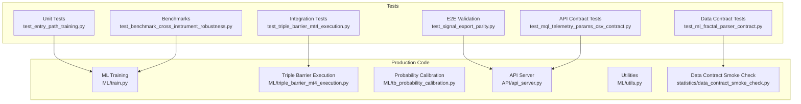
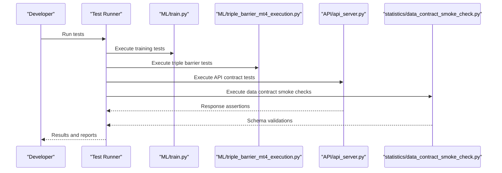
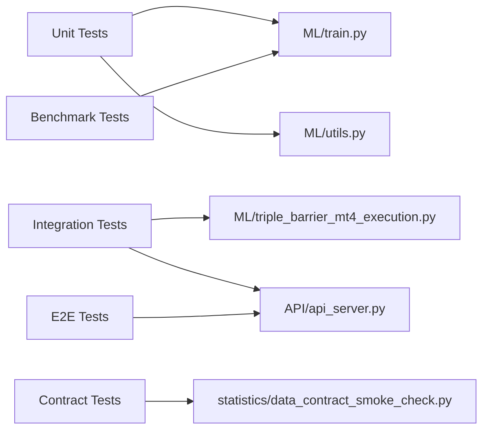

# Testing & Quality Assurance

<cite>
**Referenced Files in This Document**
- [tests/README.md](file://tests/README.md)
- [test_api_server_preprocessing.py](file://tests/test_api_server_preprocessing.py)
- [test_benchmark_cross_instrument_robustness.py](file://tests/test_benchmark_cross_instrument_robustness.py)
- [test_entry_path_training.py](file://tests/test_entry_path_training.py)
- [test_triple_barrier_mt4_execution.py](file://tests/test_triple_barrier_mt4_execution.py)
- [test_telemetry_signal_watcher.py](file://tests/test_telemetry_signal_watcher.py)
- [test_export_entry_path_v1_signals.py](file://tests/test_export_entry_path_v1_signals.py)
- [test_ml_fractal_parser_contract.py](file://tests/test_ml_fractal_parser_contract.py)
- [test_mql_telemetry_params_csv_contract.py](file://tests/test_mql_telemetry_params_csv_contract.py)
- [test_mt5_signal_executor_schema.py](file://tests/test_mt5_signal_executor_schema.py)
- [test_online_tester_reconciliation.py](file://tests/test_online_tester_reconciliation.py)
- [test_signal_export_parity.py](file://tests/test_signal_export_parity.py)
- [test_triple_barrier_calibration.py](file://tests/test_triple_barrier_calibration.py)
- [test_triple_barrier_first_touch.py](file://tests/test_triple_barrier_first_touch.py)
- [test_triple_barrier_training.py](file://tests/test_triple_barrier_training.py)
- [API/api_server.py](file://API/api_server.py)
- [ML/train.py](file://ML/train.py)
- [ML/triple_barrier_mt4_execution.py](file://ML/triple_barrier_mt4_execution.py)
- [ML/tb_probability_calibration.py](file://ML/tb_probability_calibration.py)
- [ML/utils.py](file://ML/utils.py)
- [statistics/data_contract_smoke_check.py](file://statistics/data_contract_smoke_check.py)
- [requirements.txt](file://requirements.txt)
</cite>

## Table of Contents
1. [Introduction](#introduction)
2. [Project Structure](#project-structure)
3. [Core Components](#core-components)
4. [Architecture Overview](#architecture-overview)
5. [Detailed Component Analysis](#detailed-component-analysis)
6. [Dependency Analysis](#dependency-analysis)
7. [Performance Considerations](#performance-considerations)
8. [Troubleshooting Guide](#troubleshooting-guide)
9. [Conclusion](#conclusion)
10. [Appendices](#appendices)

## Introduction
This document provides comprehensive testing and quality assurance guidance for the SoSimple system, covering unit tests, integration tests, end-to-end validation, regression testing, data validation, API contract testing, performance benchmarking, and continuous integration practices. It also addresses financial-specific challenges such as data freshness, market conditions, and reproducibility requirements. The goal is to enable developers and QA engineers to write effective tests, execute them reliably, and maintain model stability and performance consistency across ML components, financial calculations, and trading logic.

## Project Structure
The repository organizes tests under a dedicated tests directory with clear naming conventions that mirror production modules. Tests are grouped by feature area (e.g., entry path, triple barrier, telemetry, benchmarks). Supporting documentation exists within tests/README.md to guide test execution and organization.

**Diagram sources**
- [test_entry_path_training.py](file://tests/test_entry_path_training.py)
- [test_triple_barrier_mt4_execution.py](file://tests/test_triple_barrier_mt4_execution.py)
- [test_signal_export_parity.py](file://tests/test_signal_export_parity.py)
- [test_ml_fractal_parser_contract.py](file://tests/test_ml_fractal_parser_contract.py)
- [test_mql_telemetry_params_csv_contract.py](file://tests/test_mql_telemetry_params_csv_contract.py)
- [test_benchmark_cross_instrument_robustness.py](file://tests/test_benchmark_cross_instrument_robustness.py)
- [ML/train.py](file://ML/train.py)
- [ML/triple_barrier_mt4_execution.py](file://ML/triple_barrier_mt4_execution.py)
- [ML/tb_probability_calibration.py](file://ML/tb_probability_calibration.py)
- [API/api_server.py](file://API/api_server.py)
- [ML/utils.py](file://ML/utils.py)
- [statistics/data_contract_smoke_check.py](file://statistics/data_contract_smoke_check.py)

**Section sources**
- [tests/README.md](file://tests/README.md)

## Core Components
SoSimple’s testing strategy spans multiple layers:
- Unit tests validate core ML training routines, label generation, and utility functions.
- Integration tests verify interactions between ML pipelines and MT4/MT5 execution components.
- End-to-end validation ensures signal export parity and API behavior match expected contracts.
- Data contract tests enforce schema compliance for ML inputs and telemetry outputs.
- Benchmark tests measure robustness and performance across instruments and configurations.

Key test files and their responsibilities:
- Entry path training tests ensure model training workflows remain stable.
- Triple barrier tests cover execution, calibration, first-touch logic, and training loops.
- Telemetry and signal watcher tests validate real-time monitoring and data ingestion.
- Export and parity tests confirm consistent signal generation across runs and environments.
- Contract tests protect against breaking changes in data schemas and CSV formats.

**Section sources**
- [test_entry_path_training.py](file://tests/test_entry_path_training.py)
- [test_triple_barrier_mt4_execution.py](file://tests/test_triple_barrier_mt4_execution.py)
- [test_triple_barrier_calibration.py](file://tests/test_triple_barrier_calibration.py)
- [test_triple_barrier_first_touch.py](file://tests/test_triple_barrier_first_touch.py)
- [test_triple_barrier_training.py](file://tests/test_triple_barrier_training.py)
- [test_telemetry_signal_watcher.py](file://tests/test_telemetry_signal_watcher.py)
- [test_export_entry_path_v1_signals.py](file://tests/test_export_entry_path_v1_signals.py)
- [test_signal_export_parity.py](file://tests/test_signal_export_parity.py)
- [test_ml_fractal_parser_contract.py](file://tests/test_ml_fractal_parser_contract.py)
- [test_mql_telemetry_params_csv_contract.py](file://tests/test_mql_telemetry_params_csv_contract.py)
- [test_mt5_signal_executor_schema.py](file://tests/test_mt5_signal_executor_schema.py)
- [test_online_tester_reconciliation.py](file://tests/test_online_tester_reconciliation.py)
- [test_benchmark_cross_instrument_robustness.py](file://tests/test_benchmark_cross_instrument_robustness.py)

## Architecture Overview
The testing architecture aligns with production modules, ensuring each layer has corresponding tests:
- ML training and calibration are validated through unit and integration tests.
- API server endpoints are covered by contract and E2E tests.
- Data processing and telemetry are verified via contract and reconciliation tests.
- Benchmarks provide performance baselines and robustness checks.

**Diagram sources**
- [ML/train.py](file://ML/train.py)
- [ML/triple_barrier_mt4_execution.py](file://ML/triple_barrier_mt4_execution.py)
- [API/api_server.py](file://API/api_server.py)
- [statistics/data_contract_smoke_check.py](file://statistics/data_contract_smoke_check.py)

## Detailed Component Analysis

### Unit Testing Strategy
Unit tests focus on isolated functionality:
- Model training routines: Validate data loading, preprocessing, and training loops.
- Label generation: Ensure triple barrier labels and targets are computed correctly.
- Utility functions: Verify mathematical operations and transformations used across ML pipelines.

Best practices:
- Use deterministic seeds for reproducibility.
- Mock external dependencies where necessary.
- Assert numerical tolerances appropriate for floating-point comparisons.

**Section sources**
- [test_entry_path_training.py](file://tests/test_entry_path_training.py)
- [test_triple_barrier_training.py](file://tests/test_triple_barrier_training.py)
- [ML/train.py](file://ML/train.py)

### Integration Testing Strategy
Integration tests verify component interactions:
- Triple barrier execution: Ensure seamless communication between ML predictions and MT4/MT5 execution.
- Signal export: Validate end-to-end signal generation from features to exported artifacts.
- Online tester reconciliation: Confirm consistency between backtesting and live execution results.

Execution procedures:
- Set up minimal datasets for fast feedback.
- Use environment variables to toggle between simulation and real data.
- Capture logs and artifacts for debugging.

**Section sources**
- [test_triple_barrier_mt4_execution.py](file://tests/test_triple_barrier_mt4_execution.py)
- [test_export_entry_path_v1_signals.py](file://tests/test_export_entry_path_v1_signals.py)
- [test_online_tester_reconciliation.py](file://tests/test_online_tester_reconciliation.py)
- [ML/triple_barrier_mt4_execution.py](file://ML/triple_barrier_mt4_execution.py)

### End-to-End Validation Strategy
E2E tests simulate full system workflows:
- Signal export parity: Compare generated signals across different runs and environments.
- API contract validation: Ensure API responses conform to expected schemas.
- Telemetry monitoring: Verify real-time data ingestion and processing.

Validation criteria:
- Output artifacts must match expected formats and content ranges.
- API endpoints must return correct status codes and payloads.
- Telemetry data must be complete and timely.

**Section sources**
- [test_signal_export_parity.py](file://tests/test_signal_export_parity.py)
- [test_telemetry_signal_watcher.py](file://tests/test_telemetry_signal_watcher.py)
- [API/api_server.py](file://API/api_server.py)

### Data Validation and Contract Testing
Data contract tests protect against schema drift:
- ML fractal parser: Validate input data structures for ML models.
- MQL telemetry parameters: Ensure CSV formats comply with MT4/MT5 expectations.
- MT5 signal executor schema: Verify signal payloads match required specifications.

Implementation guidelines:
- Define strict schemas for all data interfaces.
- Use automated schema validation in CI pipelines.
- Fail fast on contract violations to prevent downstream issues.

**Section sources**
- [test_ml_fractal_parser_contract.py](file://tests/test_ml_fractal_parser_contract.py)
- [test_mql_telemetry_params_csv_contract.py](file://tests/test_mql_telemetry_params_csv_contract.py)
- [test_mt5_signal_executor_schema.py](file://tests/test_mt5_signal_executor_schema.py)
- [statistics/data_contract_smoke_check.py](file://statistics/data_contract_smoke_check.py)

### Performance Benchmarking
Benchmark tests establish performance baselines:
- Cross-instrument robustness: Measure model performance across different financial instruments.
- Calibration accuracy: Validate probability calibration metrics.
- First-touch detection: Assess precision and recall of early exit signals.

Benchmarking approach:
- Use fixed datasets for reproducible results.
- Track key metrics over time to detect regressions.
- Automate benchmark execution in CI pipelines.

**Section sources**
- [test_benchmark_cross_instrument_robustness.py](file://tests/test_benchmark_cross_instrument_robustness.py)
- [test_triple_barrier_calibration.py](file://tests/test_triple_barrier_calibration.py)
- [test_triple_barrier_first_touch.py](file://tests/test_triple_barrier_first_touch.py)
- [ML/tb_probability_calibration.py](file://ML/tb_probability_calibration.py)

### Regression Testing Framework
Regression testing ensures model stability:
- Frozen test suites: Validate models against frozen datasets to detect performance drift.
- Walk-forward validation: Simulate real-world trading conditions with rolling windows.
- Robustness audits: Stress-test models under various market scenarios.

Framework components:
- Deterministic data loaders for consistent inputs.
- Metric thresholds for pass/fail decisions.
- Automated reporting for trend analysis.

**Section sources**
- [test_entry_path_training.py](file://tests/test_entry_path_training.py)
- [test_benchmark_cross_instrument_robustness.py](file://tests/test_benchmark_cross_instrument_robustness.py)

## Dependency Analysis
Testing dependencies map directly to production modules:
- ML training tests depend on core training utilities and data loaders.
- Integration tests rely on execution engines and API servers.
- Contract tests enforce boundaries between Python and MQL components.

**Diagram sources**
- [test_entry_path_training.py](file://tests/test_entry_path_training.py)
- [test_triple_barrier_mt4_execution.py](file://tests/test_triple_barrier_mt4_execution.py)
- [test_ml_fractal_parser_contract.py](file://tests/test_ml_fractal_parser_contract.py)
- [test_signal_export_parity.py](file://tests/test_signal_export_parity.py)
- [test_benchmark_cross_instrument_robustness.py](file://tests/test_benchmark_cross_instrument_robustness.py)
- [ML/train.py](file://ML/train.py)
- [ML/triple_barrier_mt4_execution.py](file://ML/triple_barrier_mt4_execution.py)
- [API/api_server.py](file://API/api_server.py)
- [ML/utils.py](file://ML/utils.py)
- [statistics/data_contract_smoke_check.py](file://statistics/data_contract_smoke_check.py)

**Section sources**
- [requirements.txt](file://requirements.txt)

## Performance Considerations
Optimize test execution through:
- Parallel test execution for independent test suites.
- Caching mechanisms for expensive computations.
- Selective test runs based on code changes.

Memory management:
- Use generators for large datasets.
- Clean up temporary files after test execution.
- Monitor memory usage during long-running benchmarks.

**Section sources**
- [test_benchmark_cross_instrument_robustness.py](file://tests/test_benchmark_cross_instrument_robustness.py)

## Troubleshooting Guide
Common issues and resolutions:
- Data freshness errors: Ensure datasets are updated before running tests.
- Market condition mismatches: Use historical data snapshots for consistent results.
- Reproducibility failures: Fix random seeds and environment configurations.

Debugging strategies:
- Enable verbose logging in test runs.
- Isolate failing tests with minimal reproduction cases.
- Compare outputs against known good baselines.

**Section sources**
- [test_online_tester_reconciliation.py](file://tests/test_online_tester_reconciliation.py)

## Conclusion
The SoSimple testing framework provides comprehensive coverage across unit, integration, and end-to-end levels. By following the outlined strategies and best practices, teams can maintain high-quality standards, ensure model stability, and deliver reliable trading systems. Continuous integration and automated testing pipelines further strengthen the development workflow by catching issues early and maintaining performance consistency.

## Appendices

### Test Execution Procedures
- Run all tests: Execute the complete test suite using standard test runners.
- Run specific categories: Filter tests by type (unit, integration, E2E).
- Generate reports: Produce detailed test reports for analysis.

### Writing Effective Tests
- ML components: Focus on numerical accuracy and convergence properties.
- Financial calculations: Validate edge cases and boundary conditions.
- Trading logic: Ensure proper state transitions and risk controls.

### Continuous Integration Setup
- Automated test execution on code changes.
- Quality gates for passing tests and benchmarks.
- Artifact storage for test results and logs.