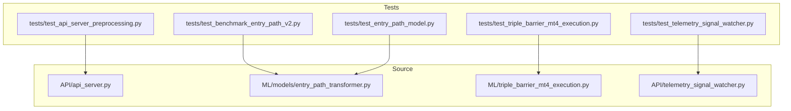
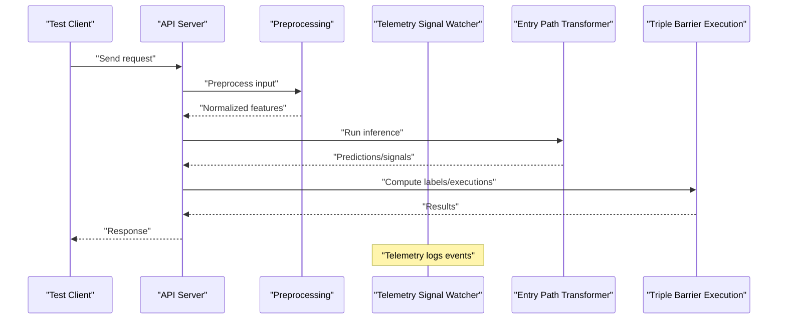
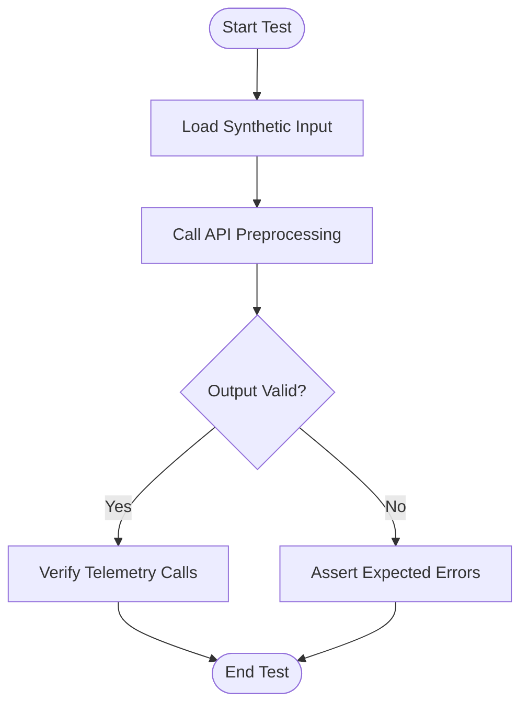
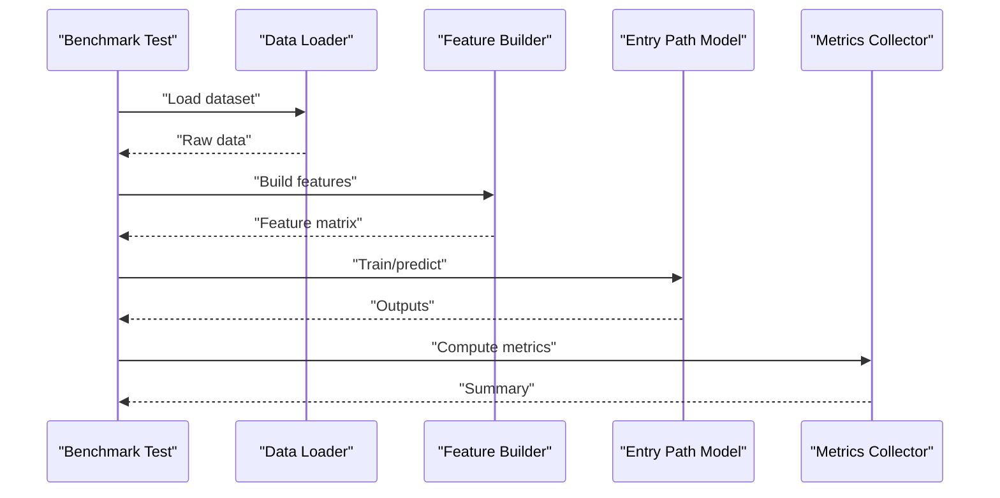
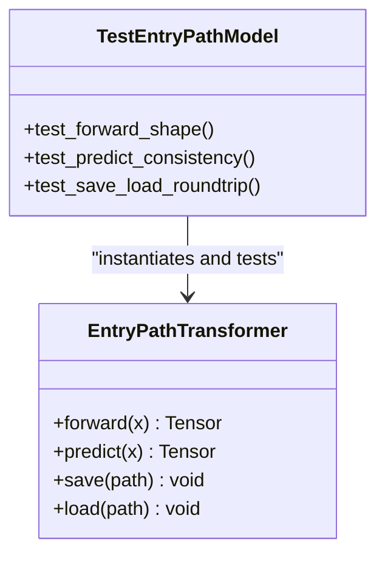
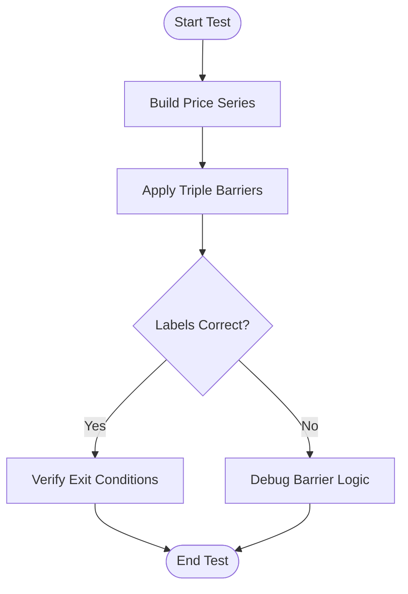
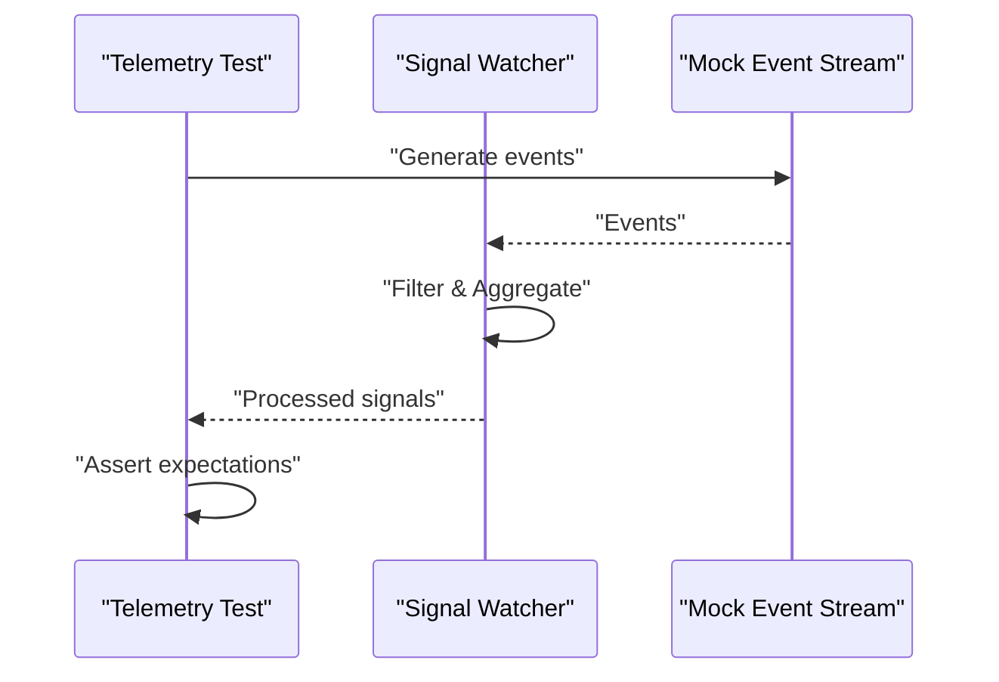
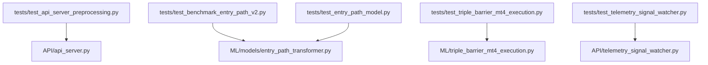

# Unit Testing

<cite>
**Referenced Files in This Document**
- [README.md](file://tests/README.md)
- [test_api_server_preprocessing.py](file://tests/test_api_server_preprocessing.py)
- [test_benchmark_entry_path_v2.py](file://tests/test_benchmark_entry_path_v2.py)
- [test_entry_path_model.py](file://tests/test_entry_path_model.py)
- [test_triple_barrier_mt4_execution.py](file://tests/test_triple_barrier_mt4_execution.py)
- [test_telemetry_signal_watcher.py](file://tests/test_telemetry_signal_watcher.py)
- [api_server.py](file://API/api_server.py)
- [entry_path_transformer.py](file://ML/models/entry_path_transformer.py)
- [triple_barrier_mt4_execution.py](file://ML/triple_barrier_mt4_execution.py)
- [telemetry_signal_watcher.py](file://API/telemetry_signal_watcher.py)
</cite>

## Table of Contents
1. [Introduction](#introduction)
2. [Project Structure](#project-structure)
3. [Core Components](#core-components)
4. [Architecture Overview](#architecture-overview)
5. [Detailed Component Analysis](#detailed-component-analysis)
6. [Dependency Analysis](#dependency-analysis)
7. [Performance Considerations](#performance-considerations)
8. [Troubleshooting Guide](#troubleshooting-guide)
9. [Conclusion](#conclusion)

## Introduction
This document explains how unit testing is organized and practiced in the SoSimple system. It covers the testing framework setup, test organization patterns, naming conventions, and practical guidance for writing effective tests across ML models, financial calculations, data preprocessing functions, and API endpoints. It also includes strategies for mocking external dependencies (such as MetaTrader connections and market data feeds), ensuring test isolation, managing fixtures, and applying parameterized testing. Special attention is given to floating-point comparisons in financial calculations, handling time-series data, and addressing challenges specific to neural networks and stochastic processes.

## Project Structure
The SoSimple repository follows a clear separation between source code and tests:
- Tests are located under the tests directory with a flat structure that mirrors key modules and features.
- Each major feature or module has one or more dedicated test files named with the test_ prefix.
- The tests README provides additional context on running and organizing tests.

**Diagram sources**
- [test_api_server_preprocessing.py](file://tests/test_api_server_preprocessing.py)
- [test_benchmark_entry_path_v2.py](file://tests/test_benchmark_entry_path_v2.py)
- [test_entry_path_model.py](file://tests/test_entry_path_model.py)
- [test_triple_barrier_mt4_execution.py](file://tests/test_triple_barrier_mt4_execution.py)
- [test_telemetry_signal_watcher.py](file://tests/test_telemetry_signal_watcher.py)
- [api_server.py](file://API/api_server.py)
- [entry_path_transformer.py](file://ML/models/entry_path_transformer.py)
- [triple_barrier_mt4_execution.py](file://ML/triple_barrier_mt4_execution.py)
- [telemetry_signal_watcher.py](file://API/telemetry_signal_watcher.py)

**Section sources**
- [README.md](file://tests/README.md)

## Core Components
SoSimple’s testing approach centers around:
- PyTest-driven test discovery and execution with standard naming conventions (test_*.py).
- Isolated test cases per feature, often mapping 1:1 to source modules.
- Mocking of external systems (e.g., MT5, market data APIs) to ensure deterministic runs.
- Parameterized tests for scenarios like different instruments, horizons, and thresholds.
- Robust assertions for numerical outputs using tolerance-based comparisons for floating-point values.

Key areas covered by tests include:
- API server preprocessing and telemetry signal watching.
- Benchmark utilities and model training pipelines.
- Neural network components such as transformer-based entry path models.
- Financial logic including triple barrier labeling and MT4 execution simulation.

**Section sources**
- [test_api_server_preprocessing.py](file://tests/test_api_server_preprocessing.py)
- [test_benchmark_entry_path_v2.py](file://tests/test_benchmark_entry_path_v2.py)
- [test_entry_path_model.py](file://tests/test_entry_path_model.py)
- [test_triple_barrier_mt4_execution.py](file://tests/test_triple_barrier_mt4_execution.py)
- [test_telemetry_signal_watcher.py](file://tests/test_telemetry_signal_watcher.py)

## Architecture Overview
At a high level, tests exercise core modules through controlled inputs and mocked dependencies:
- API endpoints receive requests, preprocess data, and interact with telemetry services.
- ML models consume preprocessed features and produce predictions or signals.
- Financial logic computes labels and simulates execution behavior.

[No diagram sources needed since this diagram shows conceptual workflow, not actual code structure]

## Detailed Component Analysis

### API Server Preprocessing Tests
Focus areas:
- Input validation and normalization.
- Error handling for malformed payloads.
- Integration with telemetry logging.

Recommended practices:
- Use small synthetic datasets to validate preprocessing steps deterministically.
- Assert output shapes and value ranges within tolerances.
- Mock telemetry calls to avoid side effects.

**Section sources**
- [test_api_server_preprocessing.py](file://tests/test_api_server_preprocessing.py)
- [api_server.py](file://API/api_server.py)
- [telemetry_signal_watcher.py](file://API/telemetry_signal_watcher.py)

### Benchmark Entry Path V2 Tests
Focus areas:
- Data pipeline correctness.
- Feature engineering consistency.
- Reproducibility across runs.

Recommended practices:
- Fix random seeds for deterministic results.
- Compare outputs against golden references when available.
- Use parameterized tests for different configurations.

**Section sources**
- [test_benchmark_entry_path_v2.py](file://tests/test_benchmark_entry_path_v2.py)

### Entry Path Model Tests
Focus areas:
- Model architecture integrity.
- Forward pass correctness.
- Gradient checks where applicable.

Recommended practices:
- Use minimal batch sizes for fast iteration.
- Validate tensor shapes and dtype consistency.
- Employ numerical tolerance for float comparisons.

**Diagram sources**
- [entry_path_transformer.py](file://ML/models/entry_path_transformer.py)
- [test_entry_path_model.py](file://tests/test_entry_path_model.py)

**Section sources**
- [test_entry_path_model.py](file://tests/test_entry_path_model.py)
- [entry_path_transformer.py](file://ML/models/entry_path_transformer.py)

### Triple Barrier MT4 Execution Tests
Focus areas:
- Label generation logic.
- Stop/take profit boundary conditions.
- Time-based exits and slippage modeling.

Recommended practices:
- Construct edge-case time series to verify barrier breaches.
- Mock MT4 execution calls to isolate logic.
- Assert label sequences match expected outcomes.

**Section sources**
- [test_triple_barrier_mt4_execution.py](file://tests/test_triple_barrier_mt4_execution.py)
- [triple_barrier_mt4_execution.py](file://ML/triple_barrier_mt4_execution.py)

### Telemetry Signal Watcher Tests
Focus areas:
- Event ingestion and parsing.
- Filtering and aggregation rules.
- Logging and error resilience.

Recommended practices:
- Inject mock event streams.
- Assert correct filtering and aggregation outcomes.
- Validate log messages for debugging.

**Section sources**
- [test_telemetry_signal_watcher.py](file://tests/test_telemetry_signal_watcher.py)
- [telemetry_signal_watcher.py](file://API/telemetry_signal_watcher.py)

## Dependency Analysis
Tests depend on source modules and may rely on third-party libraries for numerical computations and HTTP clients. To maintain stability:
- Mock external dependencies (MT5, market data APIs, HTTP clients).
- Pin versions of critical libraries in requirements.
- Use environment variables for configuration toggles during testing.

**Diagram sources**
- [test_api_server_preprocessing.py](file://tests/test_api_server_preprocessing.py)
- [test_benchmark_entry_path_v2.py](file://tests/test_benchmark_entry_path_v2.py)
- [test_entry_path_model.py](file://tests/test_entry_path_model.py)
- [test_triple_barrier_mt4_execution.py](file://tests/test_triple_barrier_mt4_execution.py)
- [test_telemetry_signal_watcher.py](file://tests/test_telemetry_signal_watcher.py)
- [api_server.py](file://API/api_server.py)
- [entry_path_transformer.py](file://ML/models/entry_path_transformer.py)
- [triple_barrier_mt4_execution.py](file://ML/triple_barrier_mt4_execution.py)
- [telemetry_signal_watcher.py](file://API/telemetry_signal_watcher.py)

**Section sources**
- [requirements.txt](file://requirements.txt)

## Performance Considerations
- Keep test datasets small to reduce runtime.
- Use fixtures for reusable data and mocks.
- Parallelize independent tests where possible.
- Avoid heavy I/O; prefer in-memory structures.
- Profile slow tests and optimize bottlenecks.

[No sources needed since this section provides general guidance]

## Troubleshooting Guide
Common issues and resolutions:
- Flaky tests due to randomness: fix seeds and use deterministic inputs.
- Network timeouts: mock HTTP clients and external APIs.
- Floating-point mismatches: assert with relative/absolute tolerances.
- Missing fixtures: ensure data files exist or generate them in setup.
- MT5 connectivity: simulate responses via mocks and local files.

Best practices:
- Log detailed context on failures.
- Use descriptive test names indicating scenario and expectation.
- Separate setup, execution, and assertion phases clearly.

[No sources needed since this section provides general guidance]

## Conclusion
SoSimple’s unit testing strategy emphasizes isolation, determinism, and clarity. By following established patterns—parameterized tests, robust mocking, tolerance-based assertions, and focused fixtures—you can maintain confidence in ML models, financial logic, preprocessing pipelines, and API integrations. Adhering to these practices ensures reliable development cycles and smooth integration into CI/CD pipelines.

[No sources needed since this section summarizes without analyzing specific files]