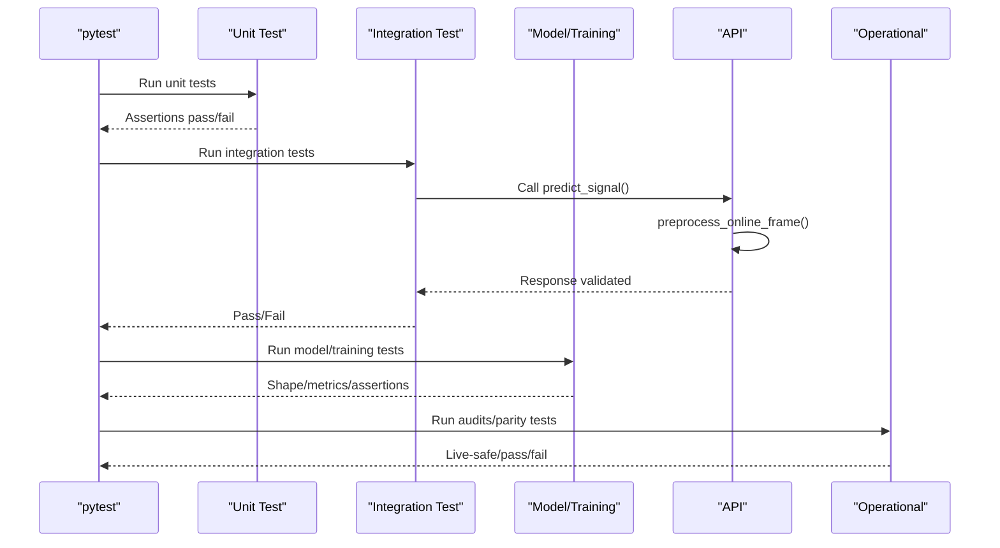
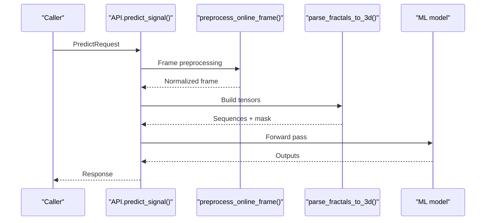
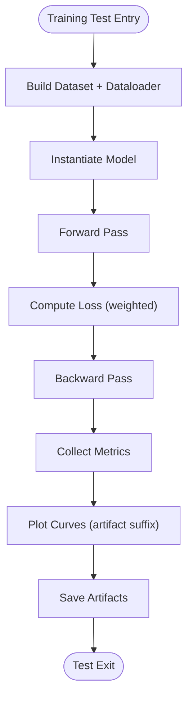
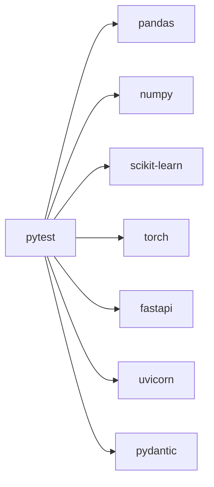

# Testing and Validation

<cite>
**Referenced Files in This Document**
- [tests/README.md](file://tests/README.md)
- [tests/test_label_updn.py](file://tests/test_label_updn.py)
- [tests/test_online_causal_preprocessing.py](file://tests/test_online_causal_preprocessing.py)
- [tests/test_api_server_preprocessing.py](file://tests/test_api_server_preprocessing.py)
- [tests/test_signal_research.py](file://tests/test_signal_research.py)
- [tests/test_benchmark_entry_path_v1_frequency.py](file://tests/test_benchmark_entry_path_v1_frequency.py)
- [tests/test_entry_path_model.py](file://tests/test_entry_path_model.py)
- [tests/test_entry_path_training.py](file://tests/test_entry_path_training.py)
- [tests/test_triple_barrier_training.py](file://tests/test_triple_barrier_training.py)
- [tests/test_live_safe_audit.py](file://tests/test_live_safe_audit.py)
- [tests/test_signal_export_parity.py](file://tests/test_signal_export_parity.py)
- [requirements.txt](file://requirements.txt)
</cite>

## Table of Contents
1. [Introduction](#introduction)
2. [Project Structure](#project-structure)
3. [Core Components](#core-components)
4. [Architecture Overview](#architecture-overview)
5. [Detailed Component Analysis](#detailed-component-analysis)
6. [Dependency Analysis](#dependency-analysis)
7. [Performance Considerations](#performance-considerations)
8. [Troubleshooting Guide](#troubleshooting-guide)
9. [Conclusion](#conclusion)
10. [Appendices](#appendices)

## Introduction
This document describes the testing and validation approach for the SoSimple trading system. It covers the test suite organization, unit and integration testing strategies, validation methodologies, and automated processes. The goal is to help developers and QA practitioners run tests, interpret results, maintain coverage, and ensure robustness across data processing, model inference, research tooling, and production integration.

## Project Structure
The repository organizes tests under the tests/ directory alongside the broader codebase. Tests are grouped by functional area and module, enabling focused validation of preprocessing, ML models, research APIs, and operational artifacts. The test runner is pytest, with minimal external dependencies declared in requirements.txt.

```mermaid
graph TB
subgraph "Tests"
T1["tests/test_label_updn.py"]
T2["tests/test_online_causal_preprocessing.py"]
T3["tests/test_api_server_preprocessing.py"]
T4["tests/test_signal_research.py"]
T5["tests/test_benchmark_entry_path_v1_frequency.py"]
T6["tests/test_entry_path_model.py"]
T7["tests/test_entry_path_training.py"]
T8["tests/test_triple_barrier_training.py"]
T9["tests/test_live_safe_audit.py"]
T10["tests/test_signal_export_parity.py"]
end
subgraph "Core Modules"
P1["processing/label_signals.py"]
P2["processing/online_causal_preprocessing.py"]
A1["API/api_server.py"]
R1["API/signal_research.py"]
M1["ML/models/entry_path_transformer.py"]
TR1["ML/train.py"]
LSA["ML/live_safe_audit*.py"]
SP["ML/benchmark_signal_export_parity.py"]
end
T1 --> P1
T2 --> P2
T3 --> A1
T4 --> R1
T6 --> M1
T7 --> TR1
T8 --> TR1
T9 --> LSA
T10 --> SP
```

**Diagram sources**
- [tests/test_label_updn.py:1-101](file://tests/test_label_updn.py#L1-L101)
- [tests/test_online_causal_preprocessing.py:1-218](file://tests/test_online_causal_preprocessing.py#L1-L218)
- [tests/test_api_server_preprocessing.py:1-77](file://tests/test_api_server_preprocessing.py#L1-L77)
- [tests/test_signal_research.py:1-800](file://tests/test_signal_research.py#L1-L800)
- [tests/test_entry_path_model.py:1-121](file://tests/test_entry_path_model.py#L1-L121)
- [tests/test_entry_path_training.py:1-242](file://tests/test_entry_path_training.py#L1-L242)
- [tests/test_triple_barrier_training.py:1-45](file://tests/test_triple_barrier_training.py#L1-L45)
- [tests/test_live_safe_audit.py:1-148](file://tests/test_live_safe_audit.py#L1-L148)
- [tests/test_signal_export_parity.py:1-106](file://tests/test_signal_export_parity.py#L1-L106)

**Section sources**
- [tests/README.md:1-40](file://tests/README.md#L1-L40)
- [requirements.txt:1-17](file://requirements.txt#L1-L17)

## Core Components
- Test runner and invocation: pytest with concise command-line usage for running all tests or individual files.
- Test categories:
  - Unit tests for core logic (e.g., fractal parsing, causal preprocessing).
  - Integration tests validating shared preprocessing paths and API endpoints.
  - Research tooling tests enforcing statistical contracts and report smoke checks.
  - ML model shape and training pipeline tests.
  - Operational audits and parity validations for production safety and export consistency.

Key characteristics:
- Synthetic fixtures replace real data to keep tests deterministic and fast.
- Monkeypatching and mocks isolate external dependencies during integration tests.
- Coverage is maintained across preprocessing, modeling, research, and operational artifacts.

**Section sources**
- [tests/README.md:5-13](file://tests/README.md#L5-L13)
- [tests/README.md:15-40](file://tests/README.md#L15-L40)

## Architecture Overview
The testing architecture emphasizes layered validation:
- Data layer: preprocessing correctness and idempotence.
- Model layer: shape assertions, masked backward support, and head separation.
- Training layer: CLI plumbing, weighted sampling, and metrics computation.
- API layer: shared preprocessing integration and endpoint behavior.
- Operational layer: live-safe audits and signal export parity.

**Diagram sources**
- [tests/test_api_server_preprocessing.py:48-77](file://tests/test_api_server_preprocessing.py#L48-L77)
- [tests/test_entry_path_model.py:10-121](file://tests/test_entry_path_model.py#L10-L121)
- [tests/test_entry_path_training.py:53-119](file://tests/test_entry_path_training.py#L53-L119)
- [tests/test_live_safe_audit.py:13-148](file://tests/test_live_safe_audit.py#L13-L148)

## Detailed Component Analysis

### Unit Testing Strategies
- Deterministic fixtures: synthetic inputs (strings, DataFrames) ensure repeatable tests.
- Edge-case coverage: empty frames, missing fields, legacy formats, and equal timestamps.
- Precision checks: approximate comparisons for floating-point outputs.

Examples:
- Fractal parsing and labeling logic validation.
- Online causal preprocessing sorting, normalization, and idempotency.
- Statistical research computations and report smoke checks.

**Section sources**
- [tests/test_label_updn.py:31-101](file://tests/test_label_updn.py#L31-L101)
- [tests/test_online_causal_preprocessing.py:67-218](file://tests/test_online_causal_preprocessing.py#L67-L218)
- [tests/test_signal_research.py:60-379](file://tests/test_signal_research.py#L60-L379)

### Integration Testing Procedures
- Shared preprocessing path: API predict_signal relies on the same online preprocessing used by research and batch pipelines.
- Mocked dependencies: patch preprocessing and model calls to validate request/response flow without external hardware.
- Contract enforcement: verify that preprocessing preserves expected fields and order.

**Diagram sources**
- [tests/test_api_server_preprocessing.py:48-77](file://tests/test_api_server_preprocessing.py#L48-L77)

**Section sources**
- [tests/test_api_server_preprocessing.py:15-77](file://tests/test_api_server_preprocessing.py#L15-L77)

### Model Validation and Training Pipelines
- Shape assertions: confirm head outputs meet expected shapes for regression/classification tasks.
- Masked backward compatibility: ensure gradients propagate through masked sequences.
- Training harness: CLI plumbing, plotting artifacts, and weighted metrics.

**Diagram sources**
- [tests/test_entry_path_training.py:141-242](file://tests/test_entry_path_training.py#L141-L242)
- [tests/test_entry_path_model.py:10-121](file://tests/test_entry_path_model.py#L10-L121)

**Section sources**
- [tests/test_entry_path_model.py:10-121](file://tests/test_entry_path_model.py#L10-L121)
- [tests/test_entry_path_training.py:53-119](file://tests/test_entry_path_training.py#L53-L119)
- [tests/test_triple_barrier_training.py:25-45](file://tests/test_triple_barrier_training.py#L25-L45)

### Data Processing Verification
- Sorting and validation: enforce strict ordering of fractals and reject unsorted inputs.
- Legacy support: handle older field counts while normalizing to internal representation.
- Idempotency and silence: repeated preprocessing yields identical results and suppresses noise by default.

**Section sources**
- [tests/test_online_causal_preprocessing.py:67-218](file://tests/test_online_causal_preprocessing.py#L67-L218)

### System Integration Testing
- Benchmark selection: candidate selection based on performance and trade frequency criteria.
- Signal export parity: reconcile ML exports with MT4 tester logs and compute diagnostics.

**Section sources**
- [tests/test_benchmark_entry_path_v1_frequency.py:10-22](file://tests/test_benchmark_entry_path_v1_frequency.py#L10-L22)
- [tests/test_signal_export_parity.py:14-106](file://tests/test_signal_export_parity.py#L14-L106)

### Operational Audits and Production Safety
- Live-safe classification: flag unknown or future-derived features; enforce PASS/FAIL/UNKNOWN statuses.
- Artifact inventory and legacy reproduction: verify checkpoint and rule presence; summarize signal CSV counts.
- System registry: validate audited systems and their required fields.

**Section sources**
- [tests/test_live_safe_audit.py:13-148](file://tests/test_live_safe_audit.py#L13-L148)

## Dependency Analysis
The test suite depends on:
- Core libraries: pandas, numpy, matplotlib, scikit-learn, scipy, seaborn.
- ML frameworks: torch, optuna, lightgbm, xgboost.
- Web stack: fastapi, uvicorn, pydantic.
- Testing: pytest.

These dependencies are declared in requirements.txt and enable unit, integration, and research validations.

**Diagram sources**
- [requirements.txt:1-17](file://requirements.txt#L1-L17)

**Section sources**
- [requirements.txt:1-17](file://requirements.txt#L1-L17)

## Performance Considerations
- Keep fixtures small and synthetic to minimize I/O and computation overhead.
- Prefer CPU-based devices for deterministic tests; avoid GPU-heavy assertions unless necessary.
- Use capsys judiciously for stdout checks; prefer structured assertions for numerical outputs.
- Cache and artifact suffixes in training tests reduce redundant plotting and improve CI speed.

## Troubleshooting Guide
Common issues and resolutions:
- Import path errors: ensure sys.path insertion or PYTHONPATH includes repository root for module imports in tests.
- Missing dependencies: install pytest and packages from requirements.txt.
- Monkeypatch failures: verify patched attributes exist on the target module and are applied before imports.
- CSV parsing mismatches: confirm separator and column names align with expected schemas (e.g., semicolon-separated files).

Interpreting results:
- Unit tests: focus on assertion messages indicating expected vs actual values.
- Integration tests: validate end-to-end flows by asserting response fields and preprocessing side effects.
- Training tests: inspect saved artifacts and plotted curves for convergence diagnostics.

**Section sources**
- [tests/README.md:35-40](file://tests/README.md#L35-L40)

## Conclusion
The SoSimple test suite combines targeted unit tests, integration validations, and operational audits to ensure correctness across preprocessing, modeling, research, and production safety. By leveraging synthetic fixtures, mocks, and deterministic artifacts, the suite supports rapid feedback and regression prevention. Adopting the recommended practices here will help sustain high-quality releases and reliable trading system behavior.

## Appendices

### Running Tests
- Run all tests: execute the pytest command from the repository root as documented in the test README.
- Run a single test file: use the pytest path to a specific test file.

**Section sources**
- [tests/README.md:7-13](file://tests/README.md#L7-L13)

### Test Case Design Patterns
- Fixture-driven: construct inputs programmatically to cover normal and edge cases.
- Approximate equality: use tolerance-based comparisons for floating-point outputs.
- Monkeypatching: replace external functions or modules to isolate behavior under test.
- Artifact verification: assert on saved plots and JSON summaries for training and parity runs.

**Section sources**
- [tests/test_entry_path_training.py:121-139](file://tests/test_entry_path_training.py#L121-L139)
- [tests/test_signal_export_parity.py:74-106](file://tests/test_signal_export_parity.py#L74-L106)

### Continuous Integration Practices
- Regression testing: include unit and integration suites in CI pipelines to catch breaking changes.
- Coverage maintenance: periodically review missing branches and expand fixtures to cover new logic.
- Operational checks: run live-safe audits and parity benchmarks as pre-release gates.

[No sources needed since this section provides general guidance]