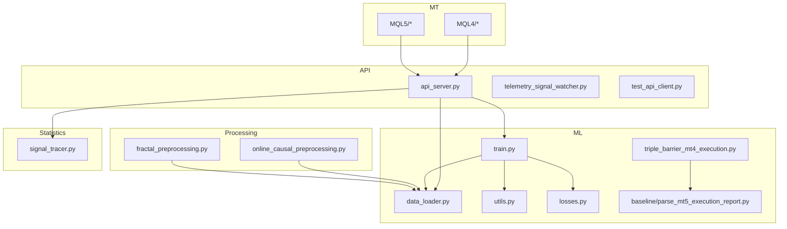
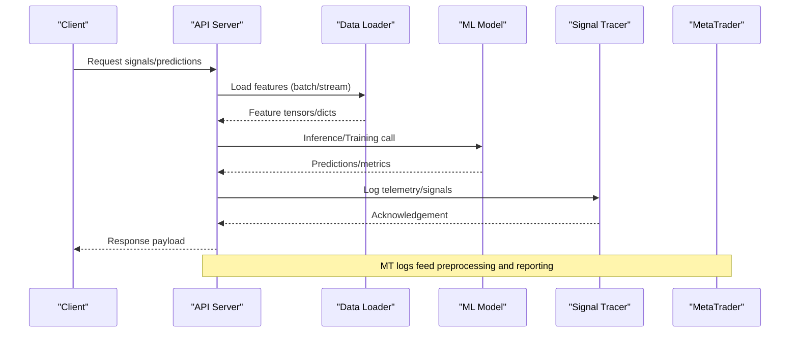
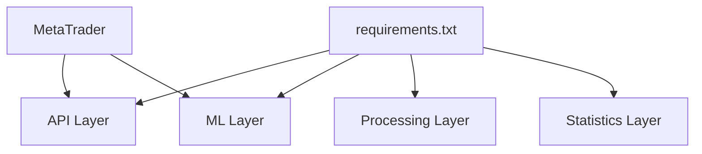

# Troubleshooting & FAQ

<cite>
**Referenced Files in This Document**
- [README.md](file://README.md)
- [requirements.txt](file://requirements.txt)
- [api_server.py](file://API/api_server.py)
- [test_api_client.py](file://API/test_api_client.py)
- [data_loader.py](file://ML/data_loader.py)
- [train.py](file://ML/train.py)
- [utils.py](file://ML/utils.py)
- [losses.py](file://ML/losses.py)
- [online_causal_preprocessing.py](file://processing/online_causal_preprocessing.py)
- [fractal_preprocessing.py](file://processing/fractal_preprocessing.py)
- [signal_tracer.py](file://statistics/signal_tracer.py)
- [telemetry_signal_watcher.py](file://API/telemetry_signal_watcher.py)
- [triple_barrier_mt4_execution.py](file://ML/triple_barrier_mt4_execution.py)
- [parse_mt5_execution_report.py](file://ML/baseline/parse_mt5_execution_report.py)
- [prepare_entry_path_mt4_parity.py](file://ML/prepare_entry_path_mt4_parity.py)
- [run_live_safe_ml_audit.py](file://ML/run_live_safe_ml_audit.py)
- [live_safe_audit.py](file://ML/live_safe_audit.py)
- [validate_freeze.py](file://ML/validation_freeze.py)
- [CLAUDE.md](file://CLAUDE.md)
- [MODULE_INDEX.md](file://MODULE_INDEX.md)
</cite>

## Table of Contents
1. [Introduction](#introduction)
2. [Project Structure](#project-structure)
3. [Core Components](#core-components)
4. [Architecture Overview](#architecture-overview)
5. [Detailed Component Analysis](#detailed-component-analysis)
6. [Dependency Analysis](#dependency-analysis)
7. [Performance Considerations](#performance-considerations)
8. [Troubleshooting Guide](#troubleshooting-guide)
9. [Conclusion](#conclusion)
10. [Appendices](#appendices)

## Introduction
This document provides comprehensive troubleshooting and frequently asked questions for the SoSimple system across setup, development, and production operation. It focuses on diagnosing issues with ML model training/inference, API services, and MetaTrader integration, along with performance tuning, error interpretation, log analysis, platform-specific guidance, and step-by-step resolution procedures.

## Project Structure
SoSimple is organized into distinct layers:
- API layer: HTTP server, telemetry, and signal export utilities
- ML layer: data loading, model definitions, training, evaluation, and experiments
- Processing layer: preprocessing, labeling, normalization, and online causal pipelines
- Statistics layer: EDA, diagnostics, and signal tracing
- MT layer: MQL4/MQL5 code for execution and telemetry
- Tests and documentation: unit tests, benchmarks, and methodology reports

**Diagram sources**
- [api_server.py](file://API/api_server.py)
- [telemetry_signal_watcher.py](file://API/telemetry_signal_watcher.py)
- [data_loader.py](file://ML/data_loader.py)
- [train.py](file://ML/train.py)
- [utils.py](file://ML/utils.py)
- [losses.py](file://ML/losses.py)
- [online_causal_preprocessing.py](file://processing/online_causal_preprocessing.py)
- [fractal_preprocessing.py](file://processing/fractal_preprocessing.py)
- [signal_tracer.py](file://statistics/signal_tracer.py)
- [triple_barrier_mt4_execution.py](file://ML/triple_barrier_mt4_execution.py)
- [parse_mt5_execution_report.py](file://ML/baseline/parse_mt5_execution_report.py)

**Section sources**
- [README.md](file://README.md)
- [MODULE_INDEX.md](file://MODULE_INDEX.md)

## Core Components
- API Server: Exposes endpoints for signal generation, telemetry, and exports; integrates with ML inference and statistics modules.
- Data Loader: Manages dataset ingestion, feature contracts, and batched access patterns for training and inference.
- Training Pipeline: Orchestrates model initialization, loss computation, optimization, and checkpointing.
- Preprocessing: Online causal preprocessing and fractal-based feature construction ensure time-consistent features.
- Statistics and Tracing: Signal tracing and telemetry watchers help monitor live behavior and reconcile outputs.
- MT Integration: Execution logic and report parsing bridge Python models to MetaTrader environments.

Key responsibilities and interactions are mapped in the architecture diagram above.

**Section sources**
- [api_server.py](file://API/api_server.py)
- [data_loader.py](file://ML/data_loader.py)
- [train.py](file://ML/train.py)
- [online_causal_preprocessing.py](file://processing/online_causal_preprocessing.py)
- [fractal_preprocessing.py](file://processing/fractal_preprocessing.py)
- [signal_tracer.py](file://statistics/signal_tracer.py)
- [triple_barrier_mt4_execution.py](file://ML/triple_barrier_mt4_execution.py)
- [parse_mt5_execution_report.py](file://ML/baseline/parse_mt5_execution_report.py)

## Architecture Overview
The system follows a modular pipeline:
- Data flows from MT logs or datasets through preprocessing into the data loader.
- The API server consumes preprocessed data and invokes ML inference or training routines.
- Telemetry and signal tracing provide observability for live systems.
- MT execution components parse reports and coordinate with Python services.

**Diagram sources**
- [api_server.py](file://API/api_server.py)
- [data_loader.py](file://ML/data_loader.py)
- [train.py](file://ML/train.py)
- [signal_tracer.py](file://statistics/signal_tracer.py)
- [triple_barrier_mt4_execution.py](file://ML/triple_barrier_mt4_execution.py)
- [parse_mt5_execution_report.py](file://ML/baseline/parse_mt5_execution_report.py)

## Detailed Component Analysis

### API Server Troubleshooting
Common issues:
- Port conflicts or binding failures
- Missing dependencies or environment variables
- Request timeouts due to heavy inference
- Serialization errors for large payloads

Resolution steps:
- Verify port availability and firewall rules
- Ensure all required packages listed in requirements are installed
- Check environment configuration for API keys and paths
- Increase timeout settings if inference is slow
- Validate request/response schemas using test client

Debugging techniques:
- Enable verbose logging in the API server
- Use the test client to reproduce failures locally
- Inspect telemetry logs for dropped signals or latency spikes

**Section sources**
- [api_server.py](file://API/api_server.py)
- [test_api_client.py](file://API/test_api_client.py)
- [requirements.txt](file://requirements.txt)

### Data Loader Issues
Symptoms:
- FileNotFoundError or missing dataset paths
- Shape mismatches between batches and model input
- Memory exhaustion during large batch loads

Resolutions:
- Confirm dataset directory structure and permissions
- Validate feature contracts and column ordering
- Reduce batch size or enable streaming/chunked loading
- Monitor memory usage and adjust worker processes

Diagnostics:
- Print sample shapes and dtypes before feeding to models
- Use sanity checks in preprocessing to catch inconsistencies early

**Section sources**
- [data_loader.py](file://ML/data_loader.py)
- [online_causal_preprocessing.py](file://processing/online_causal_preprocessing.py)
- [fractal_preprocessing.py](file://processing/fractal_preprocessing.py)

### Training Pipeline Problems
Typical problems:
- NaN losses or divergent gradients
- Overfitting or underfitting indicators
- Checkpoint corruption or version mismatch

Fixes:
- Normalize inputs and check label distributions
- Adjust learning rate and regularization parameters
- Validate checkpoint integrity and model architecture consistency
- Use validation freezes to prevent data leakage

Monitoring:
- Track loss curves and metric drift
- Log gradient norms and parameter updates
- Compare train vs validation performance trends

**Section sources**
- [train.py](file://ML/train.py)
- [losses.py](file://ML/losses.py)
- [validation_freeze.py](file://ML/validation_freeze.py)

### Preprocessing Pitfalls
Common errors:
- Time leakage via non-causal transforms
- Incorrect handling of missing values or outliers
- Inconsistent scaling across splits

Mitigations:
- Enforce causal windows in online preprocessing
- Apply robust scalers and imputers consistently
- Audit feature distributions per split to detect drift

Tools:
- Use signal tracer to verify feature timelines
- Rebuild features with explicit causal flags

**Section sources**
- [online_causal_preprocessing.py](file://processing/online_causal_preprocessing.py)
- [fractal_preprocessing.py](file://processing/fractal_preprocessing.py)
- [signal_tracer.py](file://statistics/signal_tracer.py)

### MetaTrader Integration Challenges
Issues:
- MQL compilation errors or runtime exceptions
- Misaligned timestamps between MT logs and Python processing
- Report parsing failures due to schema changes

Solutions:
- Validate MQL code versions and compiler settings
- Align timezone and bar alignment rules
- Update parsers when MT report formats evolve

Verification:
- Run parity checks between MT4 and Python outputs
- Parse sample reports to confirm field mappings

**Section sources**
- [triple_barrier_mt4_execution.py](file://ML/triple_barrier_mt4_execution.py)
- [parse_mt5_execution_report.py](file://ML/baseline/parse_mt5_execution_report.py)
- [prepare_entry_path_mt4_parity.py](file://ML/prepare_entry_path_mt4_parity.py)

### Telemetry and Observability
Use cases:
- Detect dropped signals or latency anomalies
- Correlate API requests with model inference times
- Monitor live audit metrics and drift

Actions:
- Configure telemetry watcher thresholds
- Export logs to centralized storage
- Build dashboards for key KPIs

**Section sources**
- [telemetry_signal_watcher.py](file://API/telemetry_signal_watcher.py)
- [signal_tracer.py](file://statistics/signal_tracer.py)

## Dependency Analysis
External dependencies include PyTorch, pandas, numpy, and MetaTrader libraries. Ensure consistent versions across environments.

**Diagram sources**
- [requirements.txt](file://requirements.txt)
- [api_server.py](file://API/api_server.py)
- [data_loader.py](file://ML/data_loader.py)
- [online_causal_preprocessing.py](file://processing/online_causal_preprocessing.py)
- [signal_tracer.py](file://statistics/signal_tracer.py)

**Section sources**
- [requirements.txt](file://requirements.txt)

## Performance Considerations
- Batch sizing: Tune batch sizes to balance throughput and memory constraints
- GPU utilization: Monitor VRAM usage and enable mixed precision where supported
- I/O bottlenecks: Use async loaders and caching for frequent reads
- Model inference: Profile hot paths and consider quantization or pruning
- MT communication: Minimize polling frequency and batch report parsing

[No sources needed since this section provides general guidance]

## Troubleshooting Guide

### Setup and Environment
- Symptom: ImportError or missing module
  - Action: Install dependencies from requirements.txt; verify Python version compatibility
- Symptom: Path errors for datasets or checkpoints
  - Action: Confirm absolute paths and file permissions; validate directory structure

**Section sources**
- [requirements.txt](file://requirements.txt)
- [README.md](file://README.md)

### API Service
- Symptom: Connection refused or timeout
  - Action: Check server logs; increase timeouts; validate network/firewall settings
- Symptom: Invalid request payload
  - Action: Use test client to generate valid examples; inspect schema definitions

**Section sources**
- [api_server.py](file://API/api_server.py)
- [test_api_client.py](file://API/test_api_client.py)

### ML Models
- Symptom: NaN loss or unstable training
  - Action: Normalize inputs; reduce learning rate; add gradient clipping
- Symptom: Poor generalization
  - Action: Apply validation freeze; perform ablation studies; tune regularization

**Section sources**
- [train.py](file://ML/train.py)
- [losses.py](file://ML/losses.py)
- [validation_freeze.py](file://ML/validation_freeze.py)

### Data Loading
- Symptom: Memory overflow
  - Action: Reduce batch size; enable chunked loading; profile memory usage
- Symptom: Shape mismatch
  - Action: Print tensor shapes; align feature contracts; validate preprocessing outputs

**Section sources**
- [data_loader.py](file://ML/data_loader.py)
- [online_causal_preprocessing.py](file://processing/online_causal_preprocessing.py)

### MetaTrader Integration
- Symptom: MQL runtime errors
  - Action: Review MT logs; validate symbol and timeframe settings; recompile experts
- Symptom: Parsing failures
  - Action: Update parser schemas; validate CSV headers; handle missing fields gracefully

**Section sources**
- [triple_barrier_mt4_execution.py](file://ML/triple_barrier_mt4_execution.py)
- [parse_mt5_execution_report.py](file://ML/baseline/parse_mt5_execution_report.py)

### Logs and Diagnostics
- Use telemetry watcher to capture signal events and latencies
- Employ signal tracer to verify feature timelines and label correctness
- Run live safe audits to detect drift and performance degradation

**Section sources**
- [telemetry_signal_watcher.py](file://API/telemetry_signal_watcher.py)
- [signal_tracer.py](file://statistics/signal_tracer.py)
- [run_live_safe_ml_audit.py](file://ML/run_live_safe_ml_audit.py)
- [live_safe_audit.py](file://ML/live_safe_audit.py)

### Platform-Specific Notes
- Windows: Ensure correct DLL paths for MT and CUDA drivers
- Linux: Set LD_LIBRARY_PATH for shared libraries; use virtual environments
- macOS: Handle Homebrew Python path conflicts; verify Xcode command line tools

[No sources needed since this section provides general guidance]

### Escalation Paths
- For persistent API failures: Collect server logs, request traces, and environment details
- For model instability: Provide training configs, loss curves, and validation metrics
- For MT integration issues: Share MQL logs, report samples, and parser versions

[No sources needed since this section provides general guidance]

## Conclusion
This guide consolidates common issues and resolutions across SoSimple’s API, ML, preprocessing, and MT integration layers. By following the diagnostic steps, leveraging telemetry and tracing tools, and adhering to best practices for performance and stability, teams can efficiently resolve problems and maintain reliable operations.

[No sources needed since this section summarizes without analyzing specific files]

## Appendices

### Frequently Asked Questions
- Q: How do I verify my dataset paths?
  - A: Confirm directories exist and contain expected files; run data loader sanity checks
- Q: Why is my training unstable?
  - A: Check normalization, learning rate, and loss functions; monitor gradient norms
- Q: How can I debug MT parsing errors?
  - A: Inspect report headers and field types; update parsers to match current schemas
- Q: What logs should I collect for API issues?
  - A: Capture server logs, request payloads, and telemetry watcher outputs

[No sources needed since this section provides general guidance]