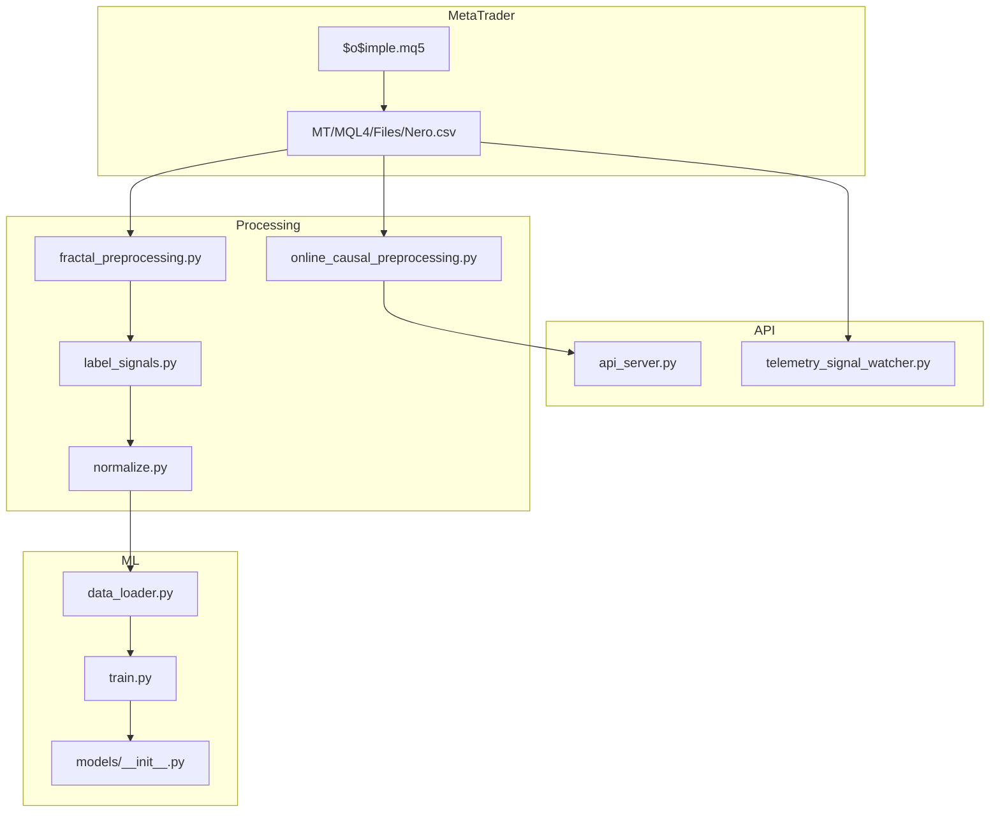
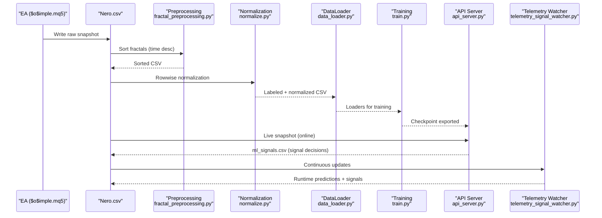
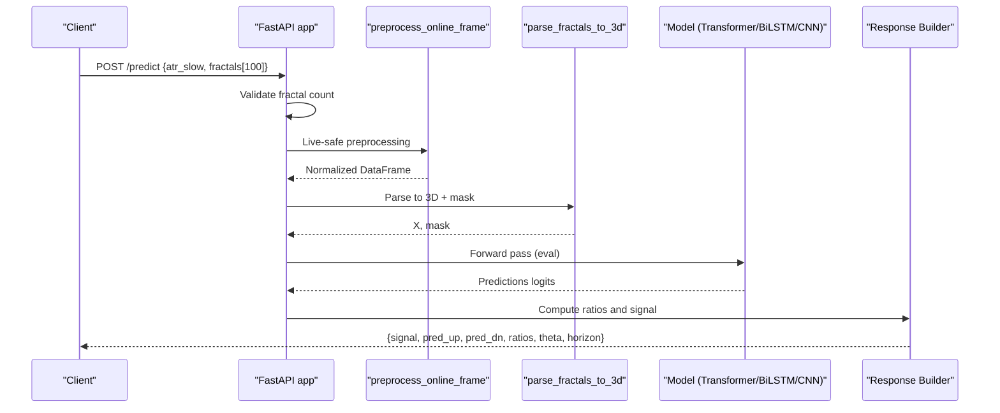
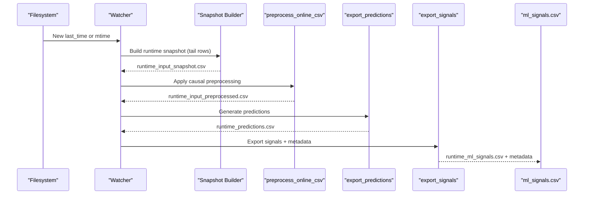
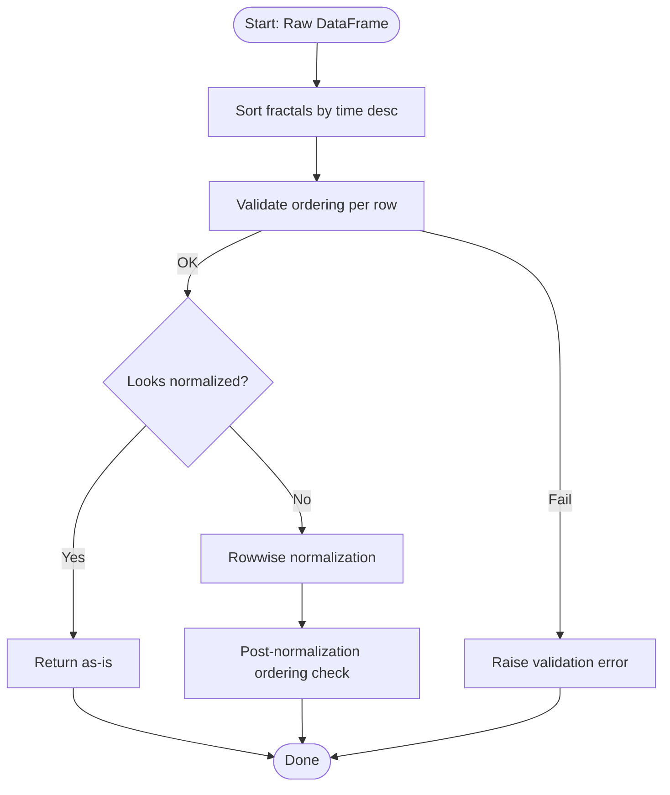
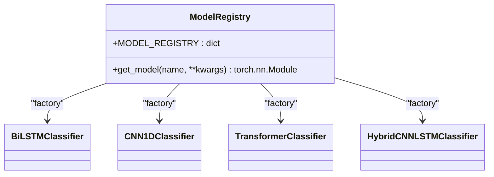
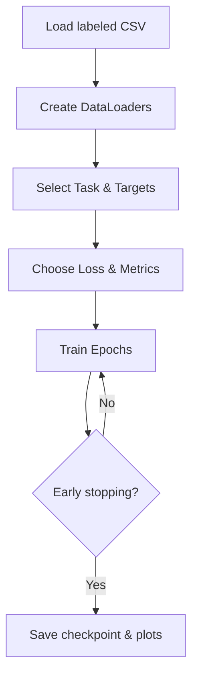
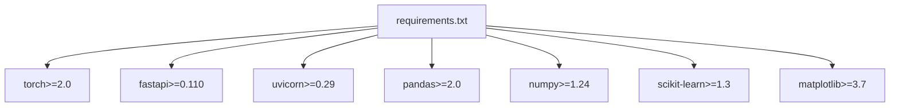

# Troubleshooting and Maintenance

<cite>
**Referenced Files in This Document**
- [README.md](file://README.md)
- [DATA_FLOW.md](file://docs/DATA_FLOW.md)
- [requirements.txt](file://requirements.txt)
- [API/api_server.py](file://API/api_server.py)
- [API/telemetry_signal_watcher.py](file://API/telemetry_signal_watcher.py)
- [processing/online_causal_preprocessing.py](file://processing/online_causal_preprocessing.py)
- [processing/fractal_preprocessing.py](file://processing/fractal_preprocessing.py)
- [ML/data_loader.py](file://ML/data_loader.py)
- [ML/models/__init__.py](file://ML/models/__init__.py)
- [ML/train.py](file://ML/train.py)
- [MT/MQL5/Experts/$o$imple.mq5](file://MT/MQL5/Experts/$o$imple.mq5)
- [tests/test_api_server_preprocessing.py](file://tests/test_api_server_preprocessing.py)
- [tests/test_entry_path_model.py](file://tests/test_entry_path_model.py)
- [tests/test_triple_barrier_training.py](file://tests/test_triple_barrier_training.py)
</cite>

## Table of Contents
1. [Introduction](#introduction)
2. [Project Structure](#project-structure)
3. [Core Components](#core-components)
4. [Architecture Overview](#architecture-overview)
5. [Detailed Component Analysis](#detailed-component-analysis)
6. [Dependency Analysis](#dependency-analysis)
7. [Performance Considerations](#performance-considerations)
8. [Troubleshooting Guide](#troubleshooting-guide)
9. [Conclusion](#conclusion)
10. [Appendices](#appendices)

## Introduction
This document provides comprehensive troubleshooting and maintenance guidance for the SoSimple trading system. It covers data processing, model training, API services, and MetaTrader integration. You will find diagnostic procedures, performance optimization techniques, maintenance best practices, and practical examples for resolving common issues. Topics include data integrity, model performance, API connectivity, and trading system malfunctions. Monitoring, alerting, and operational resilience are addressed to keep the system robust and reliable.

## Project Structure
SoSimple is organized into modules that handle data ingestion and preprocessing, machine learning training and inference, API services, and MetaTrader integration. The pipeline is documented in detail, including CSV contracts, leakage prevention, and telemetry workflows.

**Diagram sources**
- [DATA_FLOW.md:1-562](file://docs/DATA_FLOW.md#L1-L562)
- [processing/fractal_preprocessing.py:1-86](file://processing/fractal_preprocessing.py#L1-L86)
- [processing/online_causal_preprocessing.py:1-137](file://processing/online_causal_preprocessing.py#L1-L137)
- [ML/data_loader.py:1-200](file://ML/data_loader.py#L1-L200)
- [ML/train.py:1-800](file://ML/train.py#L1-L800)
- [ML/models/__init__.py:1-49](file://ML/models/__init__.py#L1-L49)
- [API/api_server.py:1-174](file://API/api_server.py#L1-L174)
- [API/telemetry_signal_watcher.py:1-422](file://API/telemetry_signal_watcher.py#L1-L422)
- [MT/MQL5/Experts/$o$imple.mq5:1-157](file://MT/MQL5/Experts/$o$imple.mq5#L1-L157)

**Section sources**
- [README.md:1-25](file://README.md#L1-L25)
- [DATA_FLOW.md:1-562](file://docs/DATA_FLOW.md#L1-L562)

## Core Components
- Data ingestion and preprocessing: Ensures CSV integrity, sorts fractals, labels signals, normalizes features, and splits datasets.
- Machine learning: Loads labeled data, builds datasets, trains models, and evaluates performance.
- API services: Exposes REST endpoints for real-time inference and telemetry watchers for continuous online validation.
- MetaTrader integration: Expert Advisor writes raw CSV snapshots consumed by the pipeline.

Key responsibilities:
- Prevent data leakage via causal preprocessing and sequential splitting.
- Maintain strict CSV contracts and validation at each stage.
- Provide robust inference with device-aware model loading and consistent sequence lengths.
- Monitor and alert via telemetry watchers and heartbeat logs.

**Section sources**
- [DATA_FLOW.md:1-562](file://docs/DATA_FLOW.md#L1-L562)
- [processing/online_causal_preprocessing.py:1-137](file://processing/online_causal_preprocessing.py#L1-L137)
- [ML/data_loader.py:1-200](file://ML/data_loader.py#L1-L200)
- [API/api_server.py:1-174](file://API/api_server.py#L1-L174)
- [API/telemetry_signal_watcher.py:1-422](file://API/telemetry_signal_watcher.py#L1-L422)
- [MT/MQL5/Experts/$o$imple.mq5:1-157](file://MT/MQL5/Experts/$o$imple.mq5#L1-L157)

## Architecture Overview
The system follows a strict pipeline to avoid leakage and ensure parity between offline evaluation and online execution.

**Diagram sources**
- [DATA_FLOW.md:1-562](file://docs/DATA_FLOW.md#L1-L562)
- [processing/fractal_preprocessing.py:1-86](file://processing/fractal_preprocessing.py#L1-L86)
- [processing/online_causal_preprocessing.py:1-137](file://processing/online_causal_preprocessing.py#L1-L137)
- [ML/data_loader.py:1-200](file://ML/data_loader.py#L1-L200)
- [ML/train.py:1-800](file://ML/train.py#L1-L800)
- [API/api_server.py:1-174](file://API/api_server.py#L1-L174)
- [API/telemetry_signal_watcher.py:1-422](file://API/telemetry_signal_watcher.py#L1-L422)

## Detailed Component Analysis

### API Service: Inference Pipeline
The API server loads a trained model, validates inputs, applies live-safe preprocessing, parses fractals into tensors, runs inference, and returns a trading signal with confidence ratios.

**Diagram sources**
- [API/api_server.py:103-169](file://API/api_server.py#L103-L169)
- [processing/online_causal_preprocessing.py:109-122](file://processing/online_causal_preprocessing.py#L109-L122)
- [ML/data_loader.py:1-200](file://ML/data_loader.py#L1-L200)

**Section sources**
- [API/api_server.py:1-174](file://API/api_server.py#L1-L174)
- [tests/test_api_server_preprocessing.py:1-77](file://tests/test_api_server_preprocessing.py#L1-L77)

### Telemetry Watcher: Continuous Online Validation
The telemetry watcher monitors the raw CSV, builds runtime snapshots, applies causal preprocessing, exports predictions, and produces ml_signals.csv for MT4 execution.

**Diagram sources**
- [API/telemetry_signal_watcher.py:203-257](file://API/telemetry_signal_watcher.py#L203-L257)
- [processing/online_causal_preprocessing.py:125-136](file://processing/online_causal_preprocessing.py#L125-L136)

**Section sources**
- [API/telemetry_signal_watcher.py:1-422](file://API/telemetry_signal_watcher.py#L1-L422)

### Data Preprocessing: Sorting and Normalization
Live-safe preprocessing ensures fractals are sorted by time (descending), validates ordering, and applies rowwise normalization without leakage.

**Diagram sources**
- [processing/online_causal_preprocessing.py:109-122](file://processing/online_causal_preprocessing.py#L109-L122)
- [processing/fractal_preprocessing.py:65-85](file://processing/fractal_preprocessing.py#L65-L85)

**Section sources**
- [processing/online_causal_preprocessing.py:1-137](file://processing/online_causal_preprocessing.py#L1-L137)
- [processing/fractal_preprocessing.py:1-86](file://processing/fractal_preprocessing.py#L1-L86)

### Model Registry and Loading
The model registry centralizes model instantiation and loading, ensuring consistent architecture selection and device placement.

**Diagram sources**
- [ML/models/__init__.py:1-49](file://ML/models/__init__.py#L1-L49)

**Section sources**
- [ML/models/__init__.py:1-49](file://ML/models/__init__.py#L1-L49)

### Training Pipeline: DataLoaders, Losses, and Metrics
Training uses standardized loaders, appropriate losses, and early stopping criteria. It supports multiple tasks and architectures.

**Diagram sources**
- [ML/data_loader.py:1-200](file://ML/data_loader.py#L1-L200)
- [ML/train.py:176-240](file://ML/train.py#L176-L240)

**Section sources**
- [ML/data_loader.py:1-200](file://ML/data_loader.py#L1-L200)
- [ML/train.py:1-800](file://ML/train.py#L1-L800)

## Dependency Analysis
External dependencies are pinned in requirements. The system relies on PyTorch for inference and training, FastAPI/Uvicorn for serving, and standard scientific libraries for data processing.

**Diagram sources**
- [requirements.txt:1-17](file://requirements.txt#L1-L17)

**Section sources**
- [requirements.txt:1-17](file://requirements.txt#L1-L17)

## Performance Considerations
- Inference performance:
  - Ensure GPU availability and correct device selection for model inference.
  - Use appropriate batch sizes and sequence lengths aligned with checkpoints.
  - Validate tensor shapes and masks to prevent unnecessary overhead.
- Training performance:
  - Use gradient clipping and proper schedulers to stabilize training.
  - Prefer early stopping and pruning when using Optuna.
  - Cache heavy preprocessing artifacts to speed up repeated runs.
- Operational performance:
  - Monitor API latency and throughput; scale horizontally if needed.
  - Use heartbeat logs and state persistence in telemetry watchers for observability.

[No sources needed since this section provides general guidance]

## Troubleshooting Guide

### Data Integrity Issues
Symptoms:
- Fractal ordering errors during inference.
- Normalization anomalies causing out-of-range values.
- Missing or malformed CSV headers.

Diagnosis steps:
- Verify CSV header and separator; confirm the expected columns and semicolon delimiter.
- Confirm fractal sorting validation passes before inference.
- Check that normalization was applied only once to avoid double normalization.

Resolution strategies:
- Re-run preprocessing to sort fractals and apply rowwise normalization.
- Validate inputs using the shared preprocessing function used by the API.
- Ensure telemetry watcher does not process empty snapshots.

Preventive maintenance:
- Add unit tests for preprocessing functions.
- Enforce CSV contract checks in CI.

**Section sources**
- [DATA_FLOW.md:78-144](file://docs/DATA_FLOW.md#L78-L144)
- [processing/online_causal_preprocessing.py:57-122](file://processing/online_causal_preprocessing.py#L57-L122)
- [tests/test_api_server_preprocessing.py:48-77](file://tests/test_api_server_preprocessing.py#L48-L77)

### Model Performance Problems
Symptoms:
- Poor correlation on test sets.
- Overfitting or underfitting.
- Incorrect sequence length or architecture mismatch.

Diagnosis steps:
- Compare task-specific metrics and loss curves.
- Validate sequence length consistency with the loaded checkpoint.
- Inspect model kwargs and Optuna best params.

Resolution strategies:
- Retrain with corrected sequence length and hyperparameters.
- Use transfer learning when applicable (e.g., triple barrier).
- Adjust early stopping patience and scheduler factors.

Preventive maintenance:
- Maintain Optuna best params JSONs and load them at inference time.
- Run ablation studies to select optimal seq_len.

**Section sources**
- [ML/train.py:176-240](file://ML/train.py#L176-L240)
- [ML/data_loader.py:153-159](file://ML/data_loader.py#L153-L159)

### API Connectivity Issues
Symptoms:
- 400 Bad Request due to incorrect fractal count.
- 500 Internal Server Error due to missing checkpoint.
- Slow inference or timeouts.

Diagnosis steps:
- Check request payload: exactly 100 fractals and valid ATR slow value.
- Verify checkpoint existence and loadability.
- Confirm device availability and model loading logs.

Resolution strategies:
- Align client-side generation with N_FRACTALS.
- Place checkpoints in the expected directory and ensure readable permissions.
- Scale Uvicorn workers and monitor resource usage.

Preventive maintenance:
- Add health-check endpoints and readiness probes.
- Instrument API with structured logs and metrics.

**Section sources**
- [API/api_server.py:109-113](file://API/api_server.py#L109-L113)
- [API/api_server.py:59-60](file://API/api_server.py#L59-L60)
- [API/api_server.py:171-174](file://API/api_server.py#L171-L174)

### Trading System Malfunctions
Symptoms:
- EA not writing CSV or writing malformed rows.
- Signals not appearing in ml_signals.csv.
- Discrepancies between online predictions and MT4 execution.

Diagnosis steps:
- Confirm EA compilation and inclusion of required libraries.
- Validate telemetry watcher state and heartbeat logs.
- Cross-check prediction CSV and signal export metadata.

Resolution strategies:
- Rebuild EA with required includes and ensure correct iSignal selection.
- Run watcher in verbose mode and inspect runtime snapshots.
- Align signal export rules with telemetry frequency calibration.

Preventive maintenance:
- Automate watcher startup in tmux with heartbeat logging.
- Establish parity checks between offline and online outputs.

**Section sources**
- [MT/MQL5/Experts/$o$imple.mq5:117-128](file://MT/MQL5/Experts/$o$imple.mq5#L117-L128)
- [API/telemetry_signal_watcher.py:114-126](file://API/telemetry_signal_watcher.py#L114-L126)
- [DATA_FLOW.md:437-498](file://docs/DATA_FLOW.md#L437-L498)

### System Monitoring and Alerting
- API: Use health-check endpoints and instrument request/response timing.
- Telemetry: Enable heartbeat logs and persistent state files for watcher status.
- Training: Track metrics and checkpoints; alert on convergence stalls or divergent losses.

Operational resilience:
- Implement retry policies for transient failures.
- Use idempotent signal exports to avoid duplicate entries.
- Maintain rollback checkpoints for quick recovery.

**Section sources**
- [API/api_server.py:98-101](file://API/api_server.py#L98-L101)
- [API/telemetry_signal_watcher.py:114-126](file://API/telemetry_signal_watcher.py#L114-L126)
- [API/telemetry_signal_watcher.py:410-417](file://API/telemetry_signal_watcher.py#L410-L417)

## Conclusion
By following the diagnostic procedures and maintenance practices outlined here, you can keep the SoSimple system reliable and performant. Focus on preserving data integrity, validating model contracts, and maintaining robust API and telemetry operations. Regular testing, monitoring, and adherence to the documented pipeline will minimize downtime and improve trading outcomes.

[No sources needed since this section summarizes without analyzing specific files]

## Appendices

### Practical Examples

- Example: Diagnosing preprocessing failures
  - Steps: Validate CSV header, run fractal sorting, check normalization bounds, re-run preprocessing.
  - Reference: [processing/online_causal_preprocessing.py:57-122](file://processing/online_causal_preprocessing.py#L57-L122)

- Example: Resolving API input errors
  - Steps: Ensure 100 fractals, correct payload structure, and valid ATR slow value.
  - Reference: [API/api_server.py:109-113](file://API/api_server.py#L109-L113)

- Example: Verifying model loading
  - Steps: Confirm checkpoint exists, architecture matches, and Optuna params are loaded.
  - Reference: [API/api_server.py:59-87](file://API/api_server.py#L59-L87)

- Example: Running telemetry watcher
  - Steps: Start watcher with heartbeat, inspect logs, validate runtime snapshots and signals.
  - Reference: [API/telemetry_signal_watcher.py:360-418](file://API/telemetry_signal_watcher.py#L360-L418)

**Section sources**
- [processing/online_causal_preprocessing.py:57-122](file://processing/online_causal_preprocessing.py#L57-L122)
- [API/api_server.py:59-113](file://API/api_server.py#L59-L113)
- [API/telemetry_signal_watcher.py:360-418](file://API/telemetry_signal_watcher.py#L360-L418)