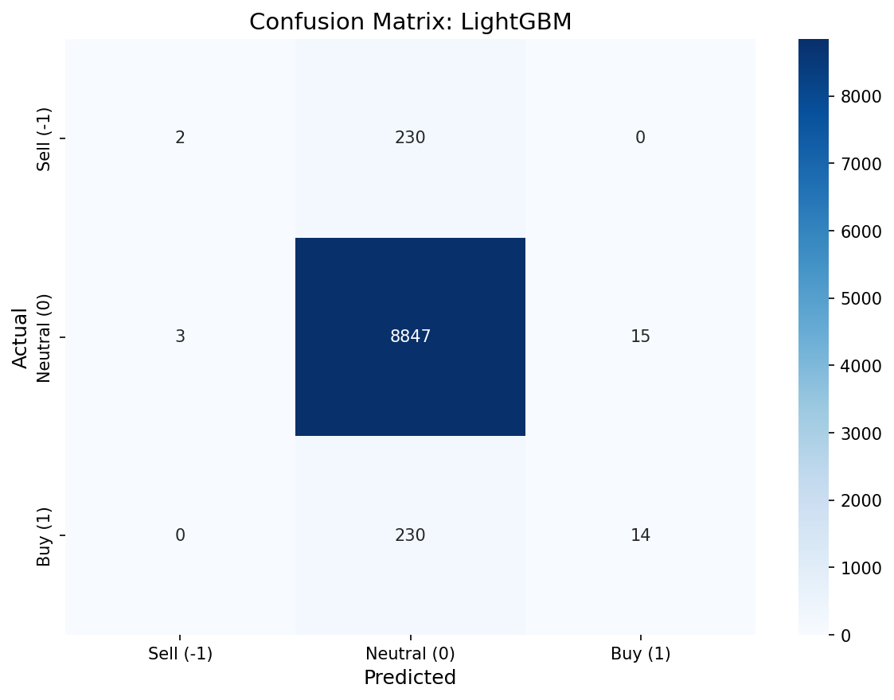

# Baseline Models Report

**Дата**: 2026-02-18 17:41
**Задача**: Классификация signal ∈ {-1, 0, 1}
**Основная метрика**: Macro F1-score

---

## 1. Данные

| Параметр | Train | Validation |
|----------|-------|------------|
| Строк | 43593 | 9341 |
| Класс -1 | 1084 (2.5%) | 232 (2.5%) |
| Класс 0 | 41390 (94.9%) | 8865 (94.9%) |
| Класс 1 | 1119 (2.6%) | 244 (2.6%) |

---

## 2. Сравнение моделей

| Модель | Features | Macro F1 | Accuracy | ROC-AUC |
|--------|----------|----------|----------|---------|
| Dummy (stratified) | flat (15) | **0.3295** | 0.9035 | 0.4957 |
| Logistic Regression | flat (15) | **0.4389** | 0.7168 | 0.9164 |
| Random Forest ⭐ | flat (15) | **0.5563** | 0.8674 | 0.9363 |
| XGBoost | engineered (223) | **0.4156** | 0.9457 | 0.9227 |
| LightGBM | engineered (223) | **0.3644** | 0.9488 | 0.9297 |

---

## 3. Classification Reports

### Dummy (stratified)
```
precision    recall  f1-score   support

   Sell (-1)       0.02      0.02      0.02       232
 Neutral (0)       0.95      0.95      0.95      8865
     Buy (1)       0.02      0.02      0.02       244

    accuracy                           0.90      9341
   macro avg       0.33      0.33      0.33      9341
weighted avg       0.90      0.90      0.90      9341
```

### Logistic Regression
```
precision    recall  f1-score   support

   Sell (-1)       0.15      0.91      0.26       232
 Neutral (0)       0.99      0.71      0.83      8865
     Buy (1)       0.13      0.89      0.23       244

    accuracy                           0.72      9341
   macro avg       0.43      0.83      0.44      9341
weighted avg       0.95      0.72      0.80      9341
```

### Random Forest
```
precision    recall  f1-score   support

   Sell (-1)       0.26      0.79      0.39       232
 Neutral (0)       0.99      0.87      0.93      8865
     Buy (1)       0.23      0.75      0.35       244

    accuracy                           0.87      9341
   macro avg       0.49      0.80      0.56      9341
weighted avg       0.95      0.87      0.90      9341
```

### XGBoost
```
precision    recall  f1-score   support

   Sell (-1)       0.36      0.12      0.18       232
 Neutral (0)       0.95      0.99      0.97      8865
     Buy (1)       0.38      0.06      0.10       244

    accuracy                           0.95      9341
   macro avg       0.56      0.39      0.42      9341
weighted avg       0.92      0.95      0.93      9341
```

### LightGBM
```
precision    recall  f1-score   support

   Sell (-1)       0.40      0.01      0.02       232
 Neutral (0)       0.95      1.00      0.97      8865
     Buy (1)       0.48      0.06      0.10       244

    accuracy                           0.95      9341
   macro avg       0.61      0.35      0.36      9341
weighted avg       0.92      0.95      0.93      9341
```

---

## 4. Confusion Matrices

### Dummy (stratified)


### Logistic Regression


### Random Forest


### XGBoost


### LightGBM


---

## 5. Выводы

✅ **Предиктивный сигнал обнаружен.** Лучшая модель (Random Forest) достигает macro F1 = 0.5563, что на 68.8% выше Dummy baseline (F1 = 0.3295).

### Наблюдения

- **Лучшая модель**: Random Forest (macro F1 = 0.5563)
- **Dummy baseline**: macro F1 = 0.3295
- **Дисбаланс**: класс 0 доминирует (~95%)
- **Feature-based vs Sequence**: gradient boosting модели работают на полном наборе engineered features (engineered (223))

### Рекомендации

1. Перейти к нейросетевым архитектурам (LSTM, Transformer) для использования последовательной структуры
2. Попробовать hyperparameter tuning для лучших baseline-моделей
3. Рассмотреть feature selection на основе importance из gradient boosting
