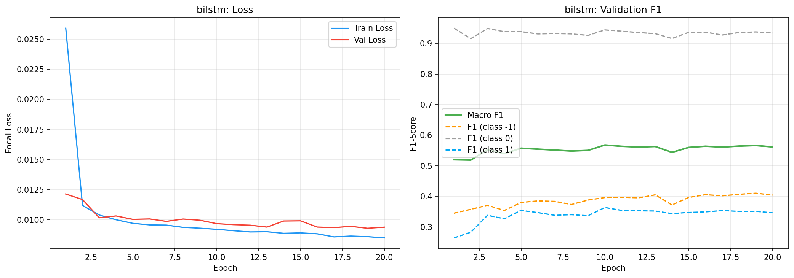
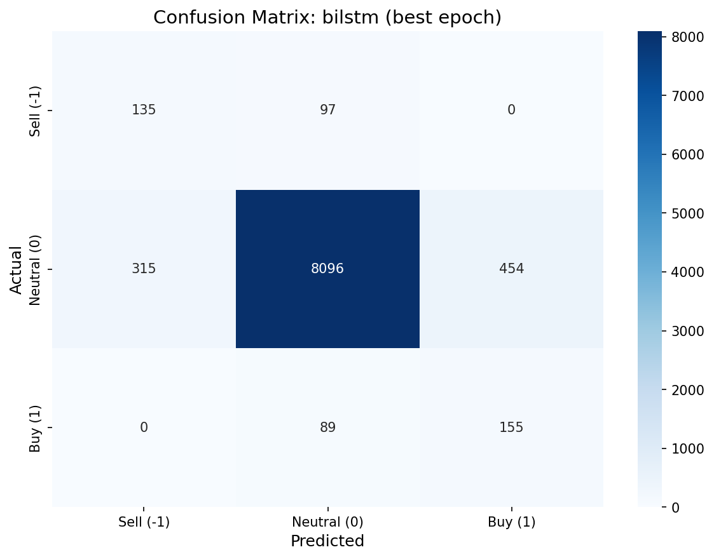
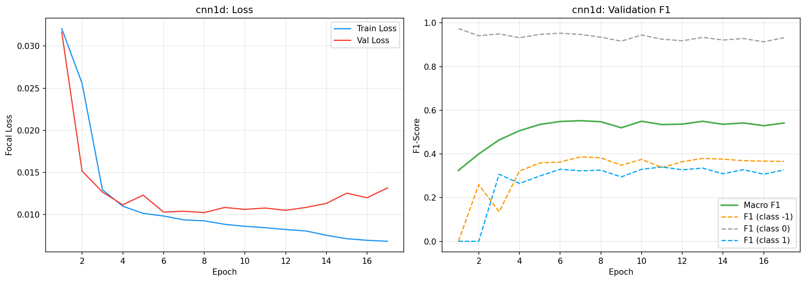
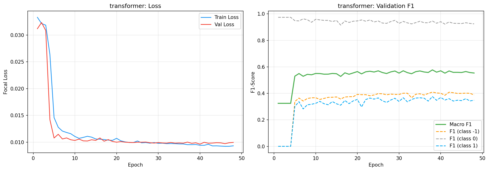
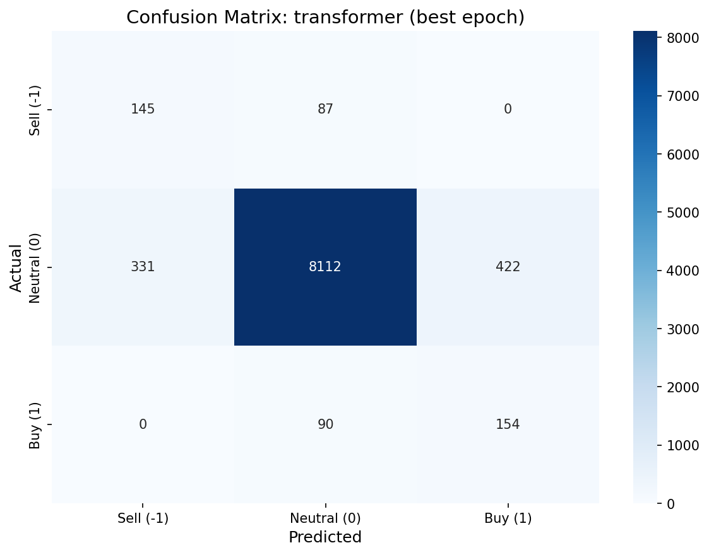
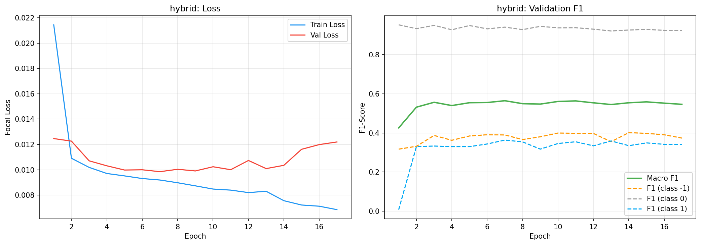
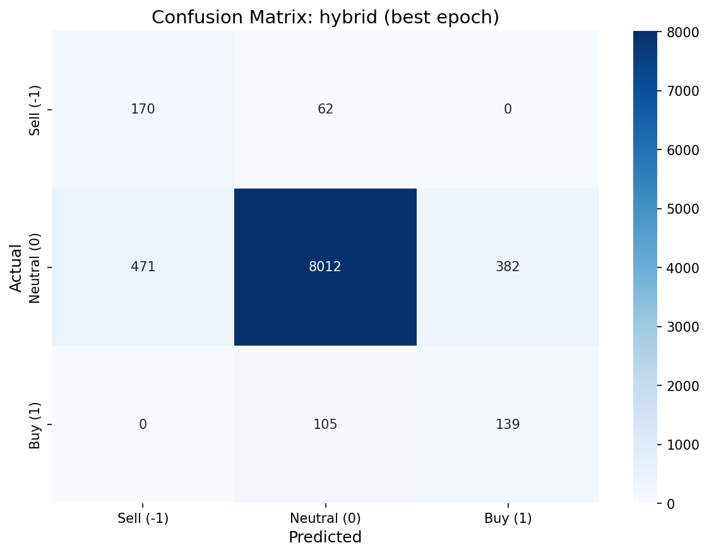

# Architecture Comparison Report (CLASSIFICATION)

**Дата**: 2026-02-24 18:05
**Задача**: Классификация signal ∈ {-1, 0, 1}
**Loss**: Focal Loss (gamma=2, alpha=[0.45, 0.10, 0.45])
**Early stopping**: на val macro F1 (patience=10)
**Фреймворк**: PyTorch
**Optimizer**: AdamW (lr=1e-3, weight_decay=1e-4)

---

## 1. Сводная таблица

| Модель | Val Macro F1 | F1(-1) | F1(0) | F1(1) | Параметры | Время (с) | Best Epoch |
|--------|-------------|--------|-------|-------|-----------|-----------|------------|
| bilstm | **0.5679** | 0.3959 | 0.9443 | 0.3634 | 147,203 | 230.6 | 10 |
| cnn1d | **0.5522** | 0.3869 | 0.9472 | 0.3226 | 41,603 | 79.4 | 7 |
| transformer ⭐ | **0.5770** | 0.4096 | 0.9458 | 0.3756 | 69,955 | 1630.9 | 38 |
| hybrid | **0.5643** | 0.3895 | 0.9402 | 0.3634 | 83,203 | 87.2 | 7 |

---

## 2. Classification Reports

### bilstm
```
precision    recall  f1-score   support

   Sell (-1)       0.30      0.58      0.40       232
 Neutral (0)       0.98      0.91      0.94      8865
     Buy (1)       0.25      0.64      0.36       244

    accuracy                           0.90      9341
   macro avg       0.51      0.71      0.57      9341
weighted avg       0.94      0.90      0.92      9341
```

### cnn1d
```
precision    recall  f1-score   support

   Sell (-1)       0.28      0.61      0.39       232
 Neutral (0)       0.97      0.92      0.95      8865
     Buy (1)       0.25      0.45      0.32       244

    accuracy                           0.90      9341
   macro avg       0.50      0.66      0.55      9341
weighted avg       0.94      0.90      0.92      9341
```

### transformer
```
precision    recall  f1-score   support

   Sell (-1)       0.30      0.62      0.41       232
 Neutral (0)       0.98      0.92      0.95      8865
     Buy (1)       0.27      0.63      0.38       244

    accuracy                           0.90      9341
   macro avg       0.52      0.72      0.58      9341
weighted avg       0.94      0.90      0.92      9341
```

### hybrid
```
precision    recall  f1-score   support

   Sell (-1)       0.27      0.73      0.39       232
 Neutral (0)       0.98      0.90      0.94      8865
     Buy (1)       0.27      0.57      0.36       244

    accuracy                           0.89      9341
   macro avg       0.50      0.74      0.56      9341
weighted avg       0.94      0.89      0.91      9341
```

---

## 2. Visualizations

### bilstm



### cnn1d



### transformer



### hybrid



---

## 3. Сводное сравнение


---

## 4. Выводы

**Лучшая модель**: transformer (Macro F1 = 0.5770)
