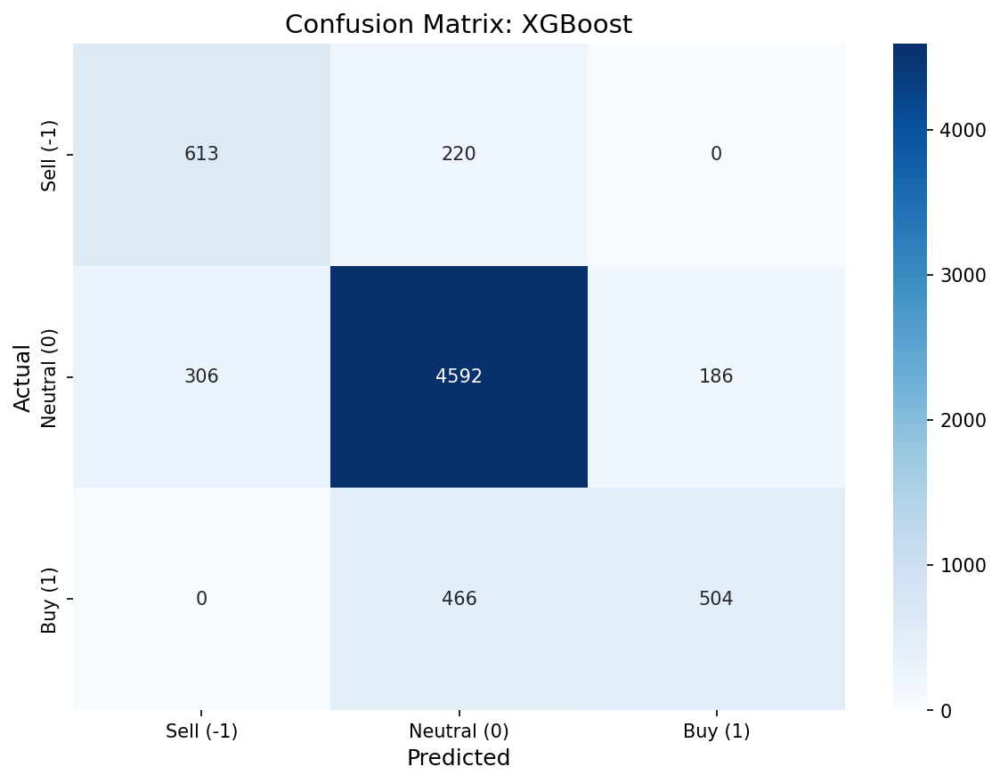

# Baseline Models Report

**Дата**: 2026-02-18 10:49
**Задача**: Классификация signal ∈ {-1, 0, 1}
**Основная метрика**: Macro F1-score

---

## 1. Данные

| Параметр | Train | Validation |
|----------|-------|------------|
| Строк | 32136 | 6887 |
| Класс -1 | 3983 (12.4%) | 833 (12.1%) |
| Класс 0 | 23869 (74.3%) | 5084 (73.8%) |
| Класс 1 | 4284 (13.3%) | 970 (14.1%) |

---

## 2. Сравнение моделей

| Модель | Features | Macro F1 | Accuracy | ROC-AUC |
|--------|----------|----------|----------|---------|
| Dummy (stratified) | flat (15) | **0.3206** | 0.5772 | 0.4911 |
| Logistic Regression | flat (15) | **0.6187** | 0.6546 | 0.8839 |
| Random Forest ⭐ | flat (15) | **0.7537** | 0.8003 | 0.9523 |
| XGBoost | engineered (223) | **0.7311** | 0.8290 | 0.9349 |
| LightGBM | engineered (223) | **0.5924** | 0.8001 | 0.9360 |

---

## 3. Classification Reports

### Dummy (stratified)
```
precision    recall  f1-score   support

   Sell (-1)       0.10      0.10      0.10       833
 Neutral (0)       0.73      0.74      0.74      5084
     Buy (1)       0.13      0.12      0.13       970

    accuracy                           0.58      6887
   macro avg       0.32      0.32      0.32      6887
weighted avg       0.57      0.58      0.57      6887
```

### Logistic Regression
```
precision    recall  f1-score   support

   Sell (-1)       0.41      0.90      0.57       833
 Neutral (0)       0.93      0.57      0.71      5084
     Buy (1)       0.43      0.88      0.58       970

    accuracy                           0.65      6887
   macro avg       0.59      0.78      0.62      6887
weighted avg       0.80      0.65      0.67      6887
```

### Random Forest
```
precision    recall  f1-score   support

   Sell (-1)       0.55      0.93      0.69       833
 Neutral (0)       0.96      0.76      0.85      5084
     Buy (1)       0.59      0.91      0.72       970

    accuracy                           0.80      6887
   macro avg       0.70      0.87      0.75      6887
weighted avg       0.86      0.80      0.81      6887
```

### XGBoost
```
precision    recall  f1-score   support

   Sell (-1)       0.67      0.74      0.70       833
 Neutral (0)       0.87      0.90      0.89      5084
     Buy (1)       0.73      0.52      0.61       970

    accuracy                           0.83      6887
   macro avg       0.76      0.72      0.73      6887
weighted avg       0.83      0.83      0.82      6887
```

### LightGBM
```
precision    recall  f1-score   support

   Sell (-1)       0.79      0.38      0.52       833
 Neutral (0)       0.80      0.97      0.88      5084
     Buy (1)       0.82      0.25      0.38       970

    accuracy                           0.80      6887
   macro avg       0.81      0.54      0.59      6887
weighted avg       0.80      0.80      0.76      6887
```

---

## 4. Confusion Matrices

### Dummy (stratified)


### Logistic Regression


### Random Forest


### XGBoost


### LightGBM


---

## 5. Выводы

✅ **Предиктивный сигнал обнаружен.** Лучшая модель (Random Forest) достигает macro F1 = 0.7537, что на 135.1% выше Dummy baseline (F1 = 0.3206).

### Наблюдения

- **Лучшая модель**: Random Forest (macro F1 = 0.7537)
- **Dummy baseline**: macro F1 = 0.3206
- **Дисбаланс**: класс 0 доминирует (~74%)
- **Feature-based vs Sequence**: gradient boosting модели работают на полном наборе engineered features (engineered (223))

### Рекомендации

1. Перейти к нейросетевым архитектурам (LSTM, Transformer) для использования последовательной структуры
2. Попробовать hyperparameter tuning для лучших baseline-моделей
3. Рассмотреть feature selection на основе importance из gradient boosting
