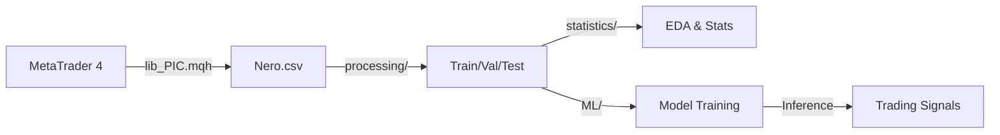

# SoSimple

Торговый алгоритм на базе машинного обучения для анализа рыночных паттернов и прогнозирования разворотов тренда (Forex, H1).

## Обзор проекта

Проект **SoSimple** направлен на создание автоматической торговой системы, на базе нейронных сетей для выявления статистически значимых паттернов в поведении фракталов. 

## Основные возможности

- **Фрактальный анализ**: Обработка последовательностей из 100 фракталов для получения глубокого контекста рынка.
- **ML Pipeline**: Полный цикл предобработки, включая нормализацию (RobustScaler), маркировку и разделение на выборки с учетом временной причинности.
- **Статистический контроль**: Тщательный EDA и статистические тесты (t-test, Mann-Whitney) для валидации признаков.
- **Интеграция с MT4**: Сбор данных напрямую из терминала MetaTrader 4.

## Структура проекта

- [`MT/`](file:///home/hohla/git/SoSimple/MT/) — Код на MQL4 для терминала MetaTrader 4.
  - `MQL4/Include/lib_PIC.mqh` — Библиотека формирования датасета.
- [`processing/`](file:///home/hohla/git/SoSimple/processing/) — Скрипты предобработки данных (Python).
- [`statistics/`](file:///home/hohla/git/SoSimple/statistics/) — Модули статистического анализа и EDA (Jupyter/Python).
- [`ML/`](file:///home/hohla/git/SoSimple/ML/) — Обучение и архитектуры моделей (в разработке).
- [`docs/`](file:///home/hohla/git/SoSimple/docs/) — Детальная документация проекта.
  - [`architecture.md`](file:///home/hohla/git/SoSimple/docs/architecture.md) — Описание архитектуры и пайплайна.
  - [`dataset_description.md`](file:///home/hohla/git/SoSimple/docs/dataset_description.md) — Структура входных данных.

## Конвейер данных (Pipeline)

## Технологический стек

- **Языки**: Python 3.11+, MQL4.
- **Библиотеки**: Pandas, NumPy, Scikit-learn, Scipy, Matplotlib, Seaborn.
- **Инфраструктура**: PyTorch (планируется), Docker (планируется).

## Документирование и правила

Проект следует строгим стандартам документирования, описанным в [`.ai/rules/000-documentation.md`](file:///home/hohla/git/SoSimple/.ai/rules/000-documentation.md).

- **Язык**: Русский для документации и комментариев, английский для кода.
- **Заголовки**: Все скрипты должны иметь стандартизированные File Headers.

## Статус разработки

Проект находится на стадии активной разработки (🔄). Основные компоненты сбора и предобработки данных готовы, ведется работа над архитектурами моделей машинного обучения.
