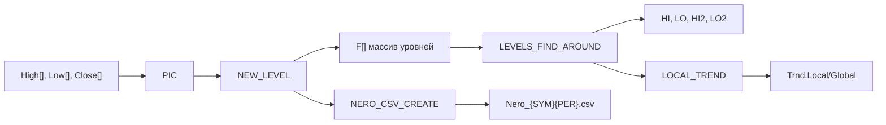

# lib_PIC.mqh

**Файл**: `lib_PIC.mqh`
**Назначение**: Библиотека анализа ценовых уровней (Price Item Calculator) для обнаружения фракталов, классификации уровней и экспорта данных для нейросетевого обучения.

---

## Ключевые функции/классы

### Класс EXPERT (методы)

| Метод | Описание |
|-------|----------|
| `INIT()` | Инициализация модуля: проверка ATR, настройка констант, создание CSV |
| `PIC()` | Основной цикл: обновление ATR, поиск фракталов, определение тренда |
| `NEW_LEVEL()` | Формирование нового уровня и удаление слабых |
| `LEVELS_FIND_AROUND()` | Поиск ближайших уровней HI/LO/HI2/LO2; попутно накапливает Up[5]/Dn[5] для всех фракталов |
| `LOCAL_TREND()` | Определение локального тренда по пробитым уровням |
| `LEV_TOUCH()` | Проверка касания уровня |
| `LEV_BREAK()` | Проверка пробоя уровня (баром или фракталом) |
| `LEV_CHECK()` | Комплексная проверка статуса уровня |
| `SET_BROKEN()` | Установка статуса пробитого уровня |
| `MID_LEV()` | Поиск уровня серединки в диапазоне |
| `PIC_PWR()` | Расчёт силы пика по 6 типам критериев |
| `TARGET_COUNT()` | Расчёт целевых уровней по измеренным движениям |
| `POC_SIMPLE()` | Определение точки контроля (POC) |
| `NERO_CSV_CREATE()` | Запись данных уровней в CSV для нейросети |

### Вспомогательные функции

| Функция | Описание |
|-------|----------|
| `NORMALIZE_MINMAX()` | Min-Max нормализация в [0, 1] |
| `CALCULATE_PERCENTILE()` | Вычисление перцентиля с линейной интерполяцией |
| `PiecewiseNormalize()` | Piecewise нормализация с логарифмическим сжатием хвоста |
| `S_NORM()` | Форматирование числа с 8 знаками для CSV |

---

## Поток данных



- **Вход**: Массивы `High[]`, `Low[]`, `Close[]`, `Time[]` (MT4 built-in), структура `Atr` из lib_ATR.mqh
- **Обработка**: Обнаружение фракталов → расчёт характеристик → классификация уровней → определение тренда
- **Выход**: 
  - Массив уровней `F[]` с индексами `HI`, `LO`, `HI2`, `LO2`
  - CSV файл `Nero_{SYMBOL}{PERIOD}.csv` в `MQL4/Files/`

---

## Зависимости

### Внутренние
- `lib_ATR.mqh` — расчёт ATR-индикаторов (Fast, Slow, Lim, Max)
- `lib_Flat.mqh` — детекция флэтов и ложных пробоев
- *(опционально)* `lib_TRG.mqh` — треугольные формации (отключено)

### Внешние
- MetaTrader 4 API (массивы цен, файловые операции)

---

## Структура уровня F[]

```cpp
struct FRACTAL {
    float P;           // Цена уровня
    datetime T;        // Время формирования
    char Dir;          // Направление: +1 вершина, -1 впадина
    float FrntVal;     // Амплитуда переднего фронта
    float BackVal;     // Амплитуда заднего фронта
    float Pwr;         // Сила = MIN(FrntVal, BackVal)
    float Imp;         // Импульс из пика
    float Atr;         // Atr.Fast в момент формирования фрактала
    char Brk;          // Статус: CLEAR(0), TOUCH(1), MIRROR(2), BROKEN(3+)
    char Cnt;          // Количество совпадений с уровнями
    float PwrSum;      // Сумма сил совпадающих пиков
    float Rev;         // Разворотный пик (Pwr предыдущего)
    bool Strong;       // Признак "первого" уровня
    bool StrongImp;    // Признак сильного импульса
    float Up[5];       // max(High-P) за H12/H24/H48/H3/H6 баров (накапливается в LEVELS_FIND_AROUND)
    float Dn[5];       // max(P-Low) за H12/H24/H48/H3/H6 баров
    // ... и другие поля
};
```

---

## Конфигурация

| Параметр | Тип | Описание |
|----------|-----|----------|
| `NORMALIZATION_PERCENTILE` | double | Перцентиль для piecewise нормализации (по умолч. 0.95) |
| `USE_NORMALIZED_OUTPUT` | bool | Вывод нормализованных/сырых значений в CSV |
| `PicPer` | int | Период обнаружения пиков |
| `PicPwr` | float | Порог силы для "сильного" уровня |
| `PicImp` | float | Порог импульса |
| `Days` | int | Глубина анализа (>0 ближние, <0 дальние, 0 вся история) |

---

## Формат CSV для нейросети

**Заголовки**: `time;signal;predict;ATR;fractal0;fractal1;...`
- `ATR` = `Atr.Slow` (долгосрочная волатильность текущего бара; знаменатель для ATR_ratio в Python)

**Формат фрактала** (22 поля):
```
T:Price:Dir:FrntVal:BackVal:Strong:Brk:Rev:PwrSum:Cnt:Imp:Up12:Dn12:Up24:Dn24:Up48:Dn48:Up3:Dn3:Up6:Dn6:FractalAtr
```
- Поля 0–10: классические признаки уровня
- Поля 11–16: Up/Dn за горизонты H12/H24/H48 (накоплены в `LEVELS_FIND_AROUND`)
- Поля 17–20: Up/Dn за короткие горизонты H3/H6
- Поле 21: `FractalAtr` = `F[f].Atr` (Atr.Fast в момент формирования; числитель ATR_ratio)

Индексы:

| idx | Поле | Назначение |
|-----|------|------------|
| 0 | `T` | время формирования фрактала |
| 1 | `Price` | цена уровня |
| 2 | `Dir` | направление уровня |
| 3 | `FrntVal` | амплитуда переднего движения |
| 4 | `BackVal` | амплитуда заднего движения |
| 5 | `Strong` | признак сильного/первого уровня |
| 6 | `Brk` | статус пробоя/касания |
| 7 | `Rev` | разворотная сила предыдущего пика |
| 8 | `PwrSum` | суммарная сила совпадающих уровней |
| 9 | `Cnt` | количество совпадений |
| 10 | `Imp` | импульс из пика |
| 11–16 | `Up12`...`Dn48` | длинные горизонты движения цены |
| 17–20 | `Up3`...`Dn6` | короткие горизонты движения цены |
| 21 | `FractalAtr` | ATR в момент формирования фрактала |

**Нормализация (опционально, USE_NORMALIZED_OUTPUT)**:
- `Price`, `Brk` — Min-Max [0, 1]
- `FrntVal`, `BackVal`, `PwrSum`, `Rev`, `Imp`, `Cnt` — Piecewise (линейная до 95-го перцентиля, логарифмическое сжатие хвоста)
- `Up*/Dn*`, `FractalAtr` — всегда сырые (нормализуются в Python)
- В `ML/data_loader.py` поля `Up3/Dn3/Up6/Dn6` используются как целевые/служебные значения и не подаются в модель как входные признаки.

---

## Расположение

`docs/MT/lib_PIC.mqh.md`
