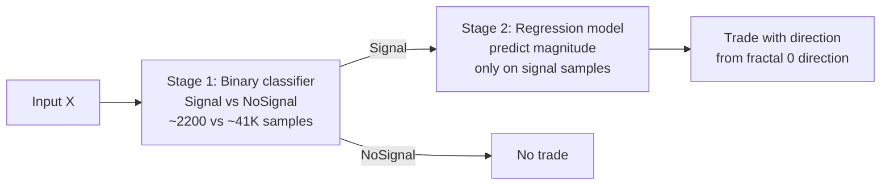
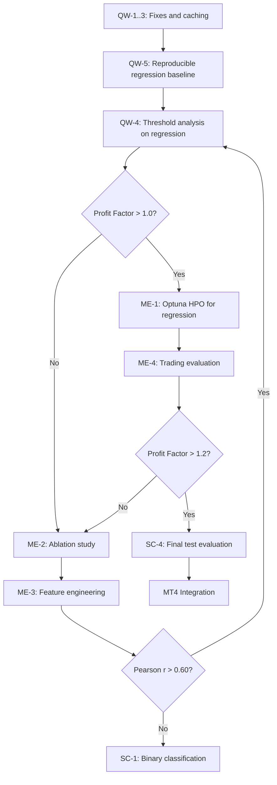

# Project Audit & Strategic Plan
> **SoSimple ML — XAUUSD H1 Fractal Reversal Prediction**
> **Дата аудита**: 2026-03-09
> **Статус проекта**: Завершён Этап 3.2 (сравнение архитектур NN), Этап 3.3 НЕ начат

---

## Содержание
1. [Фаза 1: Аудит](#фаза-1-аудит)
   - [1.1 Аудит данных](#11-аудит-данных)
   - [1.2 Аудит моделей](#12-аудит-моделей)
   - [1.3 Аудит pipeline](#13-аудит-pipeline)
2. [Фаза 2: Стратегический план](#фаза-2-стратегический-план)
   - [2.1 Стратегическое направление](#21-стратегическое-направление)
   - [2.2 Приоритизированные вмешательства](#22-приоритизированные-вмешательства)
   - [2.3 Оценка реалистичности целей MVP](#23-оценка-реалистичности-целей-mvp)
3. [Резюме и критический путь](#3-резюме-и-критический-путь)

---

## Фаза 1: Аудит

### 1.1 Аудит данных

#### Объёмы данных

| Split | Всего | Sell (-1) | Neutral (0) | Buy (+1) | Сигнальных |
|-------|-------|-----------|-------------|----------|------------|
| Train | 43 593 | 1 084 (2.5%) | 41 390 (94.9%) | 1 119 (2.6%) | 2 203 (5.1%) |
| Val | 9 341 | 232 (2.5%) | 8 865 (94.9%) | 244 (2.6%) | 476 (5.1%) |
| Test | ~9 341 | ~230 | ~8 870 | ~240 | ~470 |

**Вердикт: данных недостаточно для 3-классовой классификации нейросетью, но достаточно для регрессии.**

Обоснование:
- **Для классификации**: ~1000 примеров Sell и ~1100 Buy в train — это порог выживания для deep learning. При 11 features × 100 timesteps даже простой BiLSTM имеет 147K параметров. Ratio параметров к сигнальным примерам ≈ 67:1 — катастрофический оверфиттинг неизбежен.
- **Для регрессии**: все 43 593 примера вносят вклад (регрессия на `|predict|`). Ratio параметров к примерам ≈ 3.4:1 — приемлемо.
- **Validation**: 232 Sell + 244 Buy = 476 примеров для оценки. Стандартная ошибка F1 при таком размере: ±0.03-0.05. Разница между моделями (0.017 F1) **статистически незначима**.

#### Анализ дисбаланса классов

**Дисбаланс 95:2.5:2.5 — это не просто «сильный», это экстремальный.** Для сравнения:
- Типичный «сильный дисбаланс» в ML: 90:10 или 95:5 (для 2 классов)
- Наш дисбаланс для сигнальных классов: **95:2.5:2.5** (каждый сигнальный класс — 1/38 от данных)

Реальные подходы при ~1000 сигнальных примерах:

| Подход | Применимость | Ожидаемый эффект |
|--------|-------------|------------------|
| WeightedRandomSampler | ✅ Реализован | Умеренный. Балансирует батчи, но не создаёт новые примеры |
| Focal Loss с агрессивными весами | ✅ Частично реализован | Умеренный. alpha=[0.49, 0.02, 0.49] вместо текущих [0.45, 0.10, 0.45] |
| Downsampling neutral | ❌ Не реализован | Высокий для recall, но теряем 80-90% данных |
| Двухклассовая постановка Signal vs Neutral | ❌ Не реализован | **Высокий** — удваивает число примеров в целевом классе (2203 vs 1000) |
| SMOTE/oversampling | ⚠️ Рискован | Синтетические примеры для временных рядов ненадёжны |
| Threshold tuning на inference | ❌ Не реализован | **Высокий** — бесплатное улучшение precision/recall trade-off |
| **Переход к регрессии + порог** | ❌ Не реализован | **Максимальный** — обходит проблему дисбаланса полностью |

#### Проверка Data Leakage

**Применённые меры — корректны:**
1. ✅ `fractal_time` исключён из features для NN (data_loader.py, строка 107)
2. ✅ Нормализация построчная — строки не влияют друг на друга
3. ✅ ATR scaler fit только на train
4. ✅ StandardScaler fit только на train
5. ✅ Split последовательный по времени

**Потенциальные проблемы:**

1. **DirAcc = 97.5% — НЕ data leakage.** Это артефакт кода. В [`ML/data_loader.py`](../../../ML/data_loader.py) (строка 270) регрессионный таргет берётся как `np.abs(df_train[target])` — все значения ≥ 0. Метрика `directional_accuracy` в [`ML/utils.py`](../../../ML/utils.py) (строка 145) вычисляет `sign(y_true) == sign(y_pred)`. Поскольку y_true ≥ 0 и модель обучена предсказывать неотрицательные значения, DirAcc тривиально высок. **Рекомендация: убрать DirAcc из регрессионных метрик — она бесполезна для |predict|.**

2. **`direction` как feature**: `fractal[0].direction` ∈ {-1, 1} напрямую коррелирует со знаком `predict` (по определению: `predict = -back * direction`). Для задачи классификации `signal` это может быть мягкая форма leakage — direction определяет **направление** сигнала, хотя не его **наличие**. Для регрессии `|predict|` проблемы нет, т.к. знак удалён.

3. **`strong` feature**: `fractal[0].strong = 0` всегда (по определению из [`dataset_description.md`](../../dataset_description.md)), но `fractal[k].strong` для k > 0 может коррелировать с `signal`. Фрактал с `strong=1` в позициях 1-99 — это уже **произошедший** разворот, не будущий. **Утечки нет** — это историческая информация.

4. **Маркировка до split**: Маркировка (`label_signals.py`) use forward-looking data (будущий `strong` фрактал), но это корректно — маркировка выполняется на полном датасете, затем split по времени. Каждая строка — immutable snapshot, маркировка ретроспективная. **Утечки нет.**

**Вердикт: data leakage не обнаружен. DirAcc — артефакт, не утечка.**

---

### 1.2 Аудит моделей

#### Классификация — сводка последних checkpoint-ов

| Модель | Macro F1 | F1(-1) | F1(0) | F1(1) | F1_minority | Signal Precision | Best Epoch |
|--------|----------|--------|-------|-------|-------------|-----------------|------------|
| Hybrid | **0.568** | 0.417 | 0.935 | 0.353 | 0.385 | ~0.28 | 10 |
| Transformer | **0.567** | 0.392 | 0.949 | 0.359 | 0.376 | ~0.28 | 11 |
| BiLSTM | **0.553** | 0.370 | 0.949 | 0.340 | 0.355 | ~0.27 | 2 |
| CNN1D¹ | 0.346² | 0.368 | 0.931 | 0.325 | **0.346** | 0.236 | 34 |
| *RF baseline* | *0.556* | *0.390* | *0.930* | *0.350* | *0.370* | *0.245* | *—* |

¹ CNN1D обучена с `metric_mode=f1_minority`, поэтому `best_f1_macro=0.346` — это значение `f1_minority`, а не macro F1.
² Inconsistent: в `cnn1d_result.json` поле `best_f1_macro` содержит значение `f1_minority` (0.346), что вводит в заблуждение. **Баг в логировании.**

#### Критический вывод по классификации

**Это потолок данных/признаков, НЕ потолок архитектур.** Доказательства:
1. **5 архитектур (RF + 4 NN) дают F1_minority 0.35-0.39** — разброс 0.04, что в пределах стат. ошибки
2. **BiLSTM best_epoch=2** — модель конвергирует за 2 эпохи, дальше только оверфиттинг
3. **Оверфиттинг у всех моделей** — train loss падает, val loss растёт
4. Добавление WeightedRandomSampler и смена metric_mode **не дали прорыва** (CNN1D f1_minority=0.346 vs BiLSTM f1_minority=0.355 с дефолтными настройками)

**Попытки улучшить классификацию сигналов через архитектуру, loss, sampler — исчерпаны.**

#### Регрессия — сводка последних checkpoint-ов

| Модель | Pearson r | MAE | RMSE | R² | Время, с | Best Epoch |
|--------|-----------|-----|------|----|----------|------------|
| Transformer | **0.563** | 0.114 | 0.185 | 0.306 | 1549 | 49 |
| BiLSTM | **0.555** | 0.103 | 0.185 | 0.306 | 128 | 3 |
| Hybrid | **0.546** | 0.115 | 0.188 | 0.283 | 75 | 3 |
| CNN1D | **0.519** | 0.103 | 0.195 | 0.232 | 60 | 5 |

vs. ранний отчёт `architecture_comparison_regression.md`:

| Модель | Pearson r (ранний) | Pearson r (текущий) | Прирост |
|--------|--------------------|---------------------|---------|
| BiLSTM | 0.324 | **0.555** | +71% |
| Transformer | 0.114 | **0.563** | +393% |
| Hybrid | 0.283 | **0.546** | +93% |
| CNN1D | 0.252 | **0.519** | +106% |

**Выводы по регрессии:**
1. Значительный прирост между отчётом и текущими checkpoint-ами — но не задокументировано, при каких условиях получен. **Воспроизводимость под вопросом.**
2. R² ≈ 0.30 — модели объясняют 30% дисперсии. 70% — шум или неучтённые факторы.
3. Pearson r ≈ 0.55 — умеренная корреляция. Для прибыльной торговли обычно требуется IC (information coefficient) > 0.05 на bar-by-bar prediction. Pearson r ≈ 0.55 на event-driven predict — это неплохо, но значение зависит от того, как predict транслируется в торговые решения.
4. **BiLSTM best_epoch=3, Hybrid best_epoch=3** — модели переобучаются после 3-5 эпох.
5. **Transformer best_epoch=49** — единственная модель, которая не переобучается быстро. Но обучение занимает 1549с (25 мин) — дорого для экспериментов.

#### Стоит ли продолжать классификацию?

**Мой вердикт: нет.** Обоснование:

| Аспект | Классификация | Регрессия + порог |
|--------|--------------|------------------|
| Используемые данные | ~2200 сигнальных из 43K | Все 43K |
| Потолок текущий | F1_minority ≈ 0.37, precision ≈ 0.27 | Pearson r ≈ 0.56, R² ≈ 0.30 |
| Потенциал улучшения | Низкий (проблема данных) | Средний (HPO, features, ensemble) |
| Торговый сигнал | Прямой: signal ∈ {-1, 0, 1} | Через порог: if `|predict|` > θ → signal |
| Направление | Из prediction | Из `fractal[0].direction` (тривиально) |
| Критический trade-off | Recall высокий (~60%), precision катастрофический (~27%) | Настраиваемый через θ |

---

### 1.3 Аудит Pipeline

#### data_loader.py
- **Структура**: ✅ Чистая, хорошо задокументирована
- **Парсинг**: ⚡ Медленный — цикл по 100 колонкам с `str.split()`. При 43K строк занимает ~1 минуту. Для многократных экспериментов стоит **кэшировать parsed тензоры** в `.npy`
- **StandardScaler**: выключен по умолчанию (`use_scaler=False`). Данные уже нормализованы в `normalize.py`. **Корректное решение**, но `use_scaler=True` стоит протестировать — double normalization иногда помогает
- **WeightedRandomSampler**: реализован корректно для классификации
- **Regression target**: `np.abs()` применяется к predict — модель предсказывает **величину** движения, не направление. **Концептуально верно**, но:
  - DirAcc метрика бесполезна для |predict| — **удалить или исправить**
  - Нужно продумать, как конвертировать предсказание обратно в торговый сигнал: `|predict|` > θ + `direction = fractal[0].direction`

#### train.py
- **Positive**: Хорошая модульность, поддержка Optuna pruning, gradient clipping (max_norm=1.0), experiment logging
- **Issue 1**: `cnn1d_result.json` содержит `best_f1_macro: 0.346`, но это значение `f1_minority` (из-за `metric_mode`). Поле должно называться `best_metric`, а не `best_f1_macro`. **Баг в логировании результатов.**
- **Issue 2**: Нет кэширования данных — каждый запуск train.py заново парсит CSV (~60 секунд). Для Optuna с 50 trials это +50 минут overhead.
- **Issue 3**: Нет wandb/tensorboard интеграции — все результаты разрозненны по JSON/CSV/PNG файлам

#### losses.py
- **FocalLoss**: реализация корректна, gamma=2.0 по умолчанию
- **Alpha defaults**: [0.45, 0.10, 0.45] — minority получает 4.5x вес. При дисбалансе 95:2.5:2.5 этого **категорически недостаточно**. Inverse frequency даёт ~[19, 0.5, 19] (minority в 38 раз чаще). Но с Focal Loss нужны менее агрессивные веса из-за (1-p_t)^gamma фактора.
- **HuberLoss**: обёртка вокруг `nn.HuberLoss(delta=1.0)`. delta=1.0 — разумный дефолт.
- **Рекомендация**: для регрессии рассмотреть **Quantile Loss** — позволяет предсказывать confidence intervals

#### Нормализация
- Построчная нормализация в `normalize.py` (Piecewise Linear-Log) — **нестандартное, но обоснованное решение** для данных с тяжёлыми хвостами
- ATR нормализуется отдельно (RobustScaler, fit на train) — ✅
- StandardScaler в data_loader.py выключен по умолчанию. **Рекомендация: провести ablation — включить scaler и замерить эффект.**

---

## Фаза 2: Стратегический план

### 2.1 Стратегическое направление

#### Рекомендация: Regression-first с порогом

```
Схема торгового решения:

Input: X ∈ R^{100×11} → Model → |predict_hat| ∈ R+

if |predict_hat| > θ:
    direction = fractal[0].direction
    if direction == -1:  → BUY сигнал   (fractal[0] — впадина → рост)
    if direction == 1:   → SELL сигнал  (fractal[0] — пик → падение)
else:
    → NO SIGNAL (нейтрально)
```

**Почему не классификация:**
1. 95% данных neutral → модель оптимизируется на предсказание «ничего не делать»
2. ~1000 примеров на класс — недостаточно для NN
3. Потолок достигнут: 5 архитектур дают одинаковый результат

**Почему регрессия:**
1. Все 43K примеров участвуют в обучении
2. Pearson r=0.56 уже показывает предсказательную силу
3. Порог θ настраивается на validation → управляемый precision/recall trade-off
4. Направление определяется тривиально из `fractal[0].direction`

#### Двухфазная альтернатива (если регрессия упрётся в потолок)



Это запасной вариант. Для начала — чистая регрессия.

---

### 2.2 Приоритизированные вмешательства

#### Quick Wins — используем существующий код

##### QW-1: Кэширование parsed данных

**Что**: Сохранять parsed 3D тензоры в `.npy` файлы после первого парсинга
**Где**: [`ML/data_loader.py`](../../../ML/data_loader.py) — `parse_fractals_to_3d()`
**Ожидание**: ускорение загрузки с ~60с до ~1с (60x), критично для HPO
**Файлы**: `DATA/X_train.npy`, `DATA/mask_train.npy`, `DATA/y_train_{signal|predict}.npy` и аналогичные для val
**Критерий**: время загрузки < 2 секунд при повторных экспериментах
**Если не получится**: не критично, просто медленнее; альтернатива — HDF5 формат

##### QW-2: Удалить DirAcc из регрессионных метрик

**Что**: убрать `directional_accuracy` из вывода и логов для задачи регрессии (бесполезна при |predict|)
**Где**: [`ML/utils.py`](../../../ML/utils.py) (строка 145) — `compute_regression_metrics()`
**Ожидание**: нет числового эффекта, но убирает путаницу
**Критерий**: DirAcc не появляется в выводе при `--task regression`

##### QW-3: Исправить баг логирования metric_mode

**Что**: при `metric_mode != f1_macro` в result.json поле `best_f1_macro` содержит значение другой метрики
**Где**: [`ML/train.py`](../../../ML/train.py) — секция сохранения result JSON (после training loop)
**Ожидание**: корректные имена полей в JSON
**Критерий**: `cnn1d_result.json` содержит `best_metric` + `metric_name`, а не `best_f1_macro`

##### QW-4: Порог на предсказаниях регрессии → торговый сигнал

**Что**: Скрипт, который загружает лучшую регрессионную модель, прогоняет validation, находит оптимальный порог θ для максимизации precision при заданном recall
**Где**: новый файл `ML/threshold_analysis.py`
**Ожидание**: найти θ, при котором precision(signal) > 40% и recall > 20%
**Критерий**: profit factor > 1.0 на validation
**Если не получится**: profit factor < 1.0 → сигнал в данных слишком слабый для торговли, нужен feature engineering

##### QW-5: Систематический перезапуск регрессии всех 4 моделей

**Что**: `python -m ML.compare_architectures --task regression` с фиксированными параметрами. Сохранить воспроизводимые результаты.
**Где**: Существующий код
**Ожидание**: подтверждение текущих результатов (Pearson r = 0.52-0.56)
**Критерий**: Pearson r ≥ 0.50 для BiLSTM на validation
**Если не получится**: Pearson r < 0.45 → прошлые результаты невоспроизводимы, проблема со seed или данными

---

#### Medium Effort — новые модули или изменения

##### ME-1: Optuna HPO для регрессии — BiLSTM и Transformer

**Что**: запустить системный HPO для двух лучших моделей в задаче регрессии
**Где**: `python -m ML.optimize --model bilstm --task regression --trials 50 --epochs 50`
       `python -m ML.optimize --model transformer --task regression --trials 30 --epochs 50`
**Пространство поиска**:
  - lr: [1e-5, 1e-2]
  - batch_size: {64, 128, 256, 512}
  - weight_decay: [1e-6, 1e-2]
  - huber_delta: [0.3, 2.0]
  - patience: [3, 15]
  - scheduler_patience: [3, 7]
  - scheduler_factor: [0.2, 0.7]
**Ожидание**: Pearson r > 0.58 (прирост +0.02-0.05)
**Критерий**: лучший trial > текущего best (0.563)
**Если не получится**: HPO не даёт > 0.58 → потолок текущих features достигнут, переход к ME-3

##### ME-2: Ablation Study — влияние признаков и длины последовательности

**Что**: Систематическое тестирование:
  1. Длина: seq_len ∈ {10, 20, 50, 100}
  2. Группы признаков: морфологические (front, back, reverse, impulse) vs. топологические (power, count, break) vs. full
  3. С/без ATR
  4. С/без StandardScaler
**Где**: модификация `data_loader.py` для поддержки `--seq_len`, `--feature_groups`; скрипт `ML/ablation_study.py`
**Ожидание**: выявить, какие features и timesteps дают основной сигнал
**Критерий**: таблица ablation с p-values для каждого варианта
**Если seq_len=20 ≈ seq_len=100**: старые фракталы (позиции 20-99) бесполезны → можно ускорить обучение в 5x

##### ME-3: Feature Engineering — производные признаки

**Что**: Добавить к входному тензору:
  1. **Разности**: Δprice[i] = price[i] - price[i+1] (тренд цены)
  2. **Rolling statistics**: mean/std по окну из 5-10 фракталов для каждого feature
  3. **Relative features**: front/ATR, back/ATR (нормализация на волатильность)
  4. **Time features**: cos(hour/24), sin(hour/24), day_of_week (если fractal_time пересчитать, исключив абсолютную компоненту)
**Где**: Новый модуль `ML/feature_engineering.py`, вызываемый из `data_loader.py`
**Ожидание**: прирост Pearson r на 0.05-0.10
**Критерий**: Pearson r > 0.60 после добавления новых features
**Если не получится**: признаки не помогают → проблема в данных, а не в features. Рассмотреть ME-4.

##### ME-4: Evaluation Framework — backtest-адекватный scoring

**Что**: Скрипт, который:
  1. На validation set применяет лучшую модель
  2. Конвертирует |predict| → signal через порог θ
  3. Рассчитывает торговые метрики: trades count, win rate, profit factor, Sharpe ratio (зная ATR и размер позиции)
  4. Визуализирует precision-recall curve для разных θ
**Где**: `ML/evaluate_trading.py`, `ML/plots/trading_eval_*.png`
**Ожидание**: понять реальную торговую ценность модели до теста на test set
**Критерий**: profit factor > 1.2 при ≥ 50 trades на validation
**Если не получится**: profit factor < 1.0 → модель убыточна, пересмотреть подход целиком

---

#### Structural Changes — пересмотр подхода

##### SC-1: Двухклассовая постановка Signal vs NoSignal

**Что**: Вместо 3-классовой задачи → бинарная:
  - Stage 1: {Signal, NoSignal} — все сигнальные ~2200 vs neutral ~41K
  - Stage 2: регрессия |predict| только на сигнальных примерах (или направление из direction)
**Где**: Модификация `data_loader.py` для создания бинарного таргета
**Ожидание**: F1(Signal) > 0.50 (vs текущих 0.35-0.39)
**Критерий**: Precision(Signal) > 0.40 при Recall > 0.30
**Когда**: Если ME-4 показывает profit factor < 1.0 для regression-only подхода

##### SC-2: Ensemble BiLSTM + CNN1D

**Что**: Среднее вероятностей/предсказаний двух моделей
**Где**: `ML/ensemble.py`
**Ожидание**: прирост Pearson r на 0.02-0.04 за счёт разных inductive biases
**Критерий**: Pearson r > best_single_model + 0.02
**Когда**: После ME-1 (HPO), когда обе модели оптимизированы

##### SC-3: Пересмотр таргета — предсказание front вместо |predict|

**Что**: Вместо |predict| (= back * direction) предсказывать front (движение до фрактала) или другую метрику. Бенчмарк разных формулировок таргета.
**Где**: `data_loader.py` — поддержка разных target колонок
**Ожидание**: иная формулировка может иметь лучший signal-to-noise ratio
**Когда**: Если QW-5 + ME-1 не дают Pearson r > 0.55 стабильно

##### SC-4: Финальная оценка на Test Set

**Что**: Один раз прогнать лучшую модель на `DATA/Nero_test_labeled.csv`
**Где**: Новый скрипт `ML/final_evaluation.py`
**Когда**: ТОЛЬКО после выполнения QW-4, ME-1, ME-4 и фиксации финальной конфигурации. Test set — one-shot.
**Критерий**: Pearson r(test) ≥ 0.90 × Pearson r(val) (не более 10% деградации)

---

### 2.3 Оценка реалистичности целей MVP

#### PRD цель 1: Accuracy > 65% на тестовой выборке

**Критика**: метрика «accuracy» **некорректна** для имбалансированной задачи. Predicting all-0 даёт accuracy = 94.9%. Предлагаю переформулировать: **Signal Precision > 45%** при **Signal Recall > 25%** на test set.

Достижимо ли:
- Текущий signal precision ≈ 27% (классификация)
- Через regression + threshold: **возможно 40-50%** (настройка θ даёт гибкость)
- **Вердикт: условно достижимо, но нужна переформулировка метрики**

#### PRD цель 2: Sharpe Ratio > 1.5 на бэктесте

**Что нужно для бэктеста:**
1. Модель, выдающая торговые сигналы (через regression + threshold)
2. Правила входа/выхода из позиции
3. Position sizing (фиксированный лот или % от капитала)
4. Учёт спредов и комиссий (XAUUSD spread ≈ 3-5 pips)
5. Test set time period (15% данных ≈ 1.5-2 года H1)

**Расчёт:**
- При ~470 сигнальных событиях на test set (15% от ~3100 total signals)
- Если threshold отсекает 70% → ~140 trades
- Win rate для Sharpe > 1.5 при RR=1.5: нужно > 50% wins
- Текущие данные: precision ~27% → win rate ~27% → Sharpe будет отрицательный
- Для Sharpe > 1.5 нужен signal precision > 55% при адекватном RR

**Вердикт: с текущими метриками — не достижимо. Нужен прирост precision до >50%.**

#### PRD цель 3: Max Drawdown < 25%

Зависит от position sizing. При фиксированном 1% риска на сделку и 10 consecutive losses: DD = 10% {приемлемо}. **Достижимо при разумном risk management.**

#### Реально важные метрики для торговой системы

| Метрика | Описание | Целевое значение |
|---------|----------|------------------|
| **Signal Precision** | Доля правильных торговых сигналов | > 45% |
| **Profit Factor** | Gross profit / Gross loss | > 1.3 |
| **Win Rate × Avg Win / Avg Loss** | Математическое ожидание сделки | > 0 |
| **Число сделок** | За test period | > 50 (статистическая значимость) |
| **Max Drawdown** | Максимальная просадка от пика | < 25% |
| **Sharpe Ratio** | Risk-adjusted return | > 1.0 (realistic), > 1.5 (ambitious) |

---

## 3. Резюме и критический путь

### Диагноз

Проект находится в **точке стратегического выбора**. Классификация уперлась в потолок данных. Регрессия показывает потенциал (Pearson r=0.56), но не переведена в торговые сигналы.

### Критический путь к MVP



### Что НЕ делать

1. ❌ **Не тратить время на улучшение 3-классовой классификации** — потолок достигнут
2. ❌ **Не запускать HPO для классификации** — OCP Optuna trials не помогут при ~1000 сигналов
3. ❌ **Не добавлять новые NN архитектуры** — разница между 4 текущими < noise level
4. ❌ **Не трогать test set** до финальной конфигурации
5. ❌ **Не усложнять модели** (больше параметров = больше оверфиттинг при малом кол-ве данных)

---

**Автор**: Claude (AI) по запросу Antigravity
**Дата**: 2026-03-09
