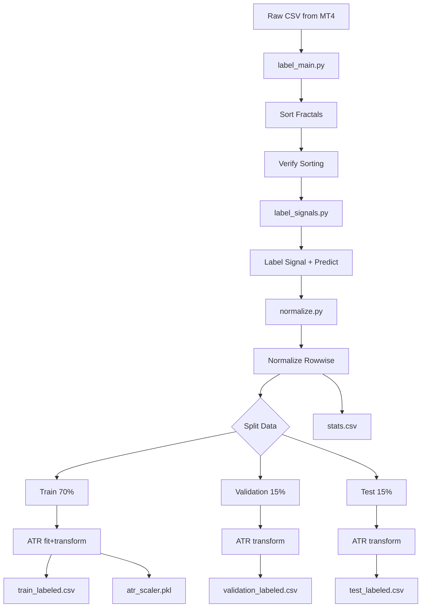

# Резюме документации

**Файлы**: `label_main.py`, `label_signals.py`, `normalize.py`
**Назначение**: Комплекс скриптов для предобработки, маркировки и нормализации исторических данных фракталов для обучения нейросети.

---

## Ключевые функции

### `label_main.py` (CLI / Оркестратор)

| Функция | Описание |
|---------|----------|
| `main()` | Точка входа CLI: загрузка CSV, сортировка, маркировка, нормализация, разделение |
| `process_row_fractals()` | Парсинг и обратная сортировка фракталов в одной строке (новые → первые) |
| `sort_fractals_in_dataframe()` | Применение сортировки ко всему DataFrame |
| `verify_sorting_quality()` | Валидация хронологического порядка фракталов (время убывает слева направо) |
| `split_train_val_test()` | Разделение данных на Train (70%) / Validation (15%) / Test (15%) |
| `save_datasets()` | Сохранение train/val/test датасетов в CSV файлы |

### `label_signals.py` (Логика маркировки)

| Функция | Описание |
|---------|----------|
| `label_all()` | Основная функция маркировки (`signal` + `predict`) |
| `parse_fractal()` | Парсинг строки фрактала в словарь параметров |
| `find_fractal_by_time()` | Поиск конкретного фрактала в "будущих" строках (Forward-looking) |
| `label_signals()` | Wrapper для маркировки только сигналов |
| `label_predict_only()` | Wrapper для маркировки только предсказаний |

### `normalize.py` (Нормализация признаков)

| Функция | Описание |
|---------|----------|
| `normalize_rowwise()` | Главная функция построчной нормализации (до split) |
| `normalize_atr_train()` | RobustScaler для ATR: fit + transform на train |
| `normalize_atr_inference()` | RobustScaler для ATR: только transform на val/test |
| `piecewise_linear_log_transform()` | Базовая трансформация [0,1] с логарифмическим хвостом |
| `minmax_normalize()` | Min-Max нормализация для price |
| `parse_fractals_to_array()` | Парсинг фракталов в numpy array (n_rows, 100, 11) |
| `array_to_fractal_strings()` | Сборка numpy array обратно в строки фракталов |
| `collect_statistics()` | Сбор статистики признаков до нормализации |

---

## Поток данных



- **Вход**: CSV файл из MetaTrader (разделитель `;`), содержащий колонки `time`, `signal`, `predict`, `ATR`, `fractal0`...`fractal99`
- **Обработка**: 
  1. Сортировка фракталов по времени (descending).
  2. Маркировка ВСЕГО датасета (signal + predict).
  3. **Построчная нормализация** (до split — нет data leakage).
  4. Разделение на Train/Validation/Test (70/15/15%).
  5. **ATR нормализация** (fit на train, transform на val/test).
- **Выход**: 
  - `*_train_labeled.csv` — обучающая выборка с нормализацией
  - `*_validation_labeled.csv` — валидационная выборка с нормализацией
  - `*_test_labeled.csv` — тестовая выборка с нормализацией
  - `*_atr_scaler.pkl` — обученный RobustScaler для ATR (для inference)
  - `*_normalization_stats.csv` — статистика признаков до нормализации

---

## Нормализация признаков

### Методы нормализации

| Метод | Признаки | Диапазон | Особенности |
|-------|----------|----------|-------------|
| Piecewise Linear-Log (совместно) | `predict`, `front`, `back` | [0, 1] | Общие min/brk/cap для группы (201 значение на строку) |
| Piecewise Linear-Log (раздельно) | `impulse`, `count`, `reverse`, `power`, `break` | [0, 1] | Индивидуальные параметры для каждого признака |
| Min-Max | `price` | [0, 1] | Классическая нормализация в диапазон |
| RobustScaler | `ATR` | без ограничений | Глобальная, fit только на train |
| Без изменений | `direction`, `strong` | {-1, 0, 1} | Уже категориальные |
| Исключён | `fractal_time` | — | Служебное поле |

### Piecewise Linear-Log трансформация

Функция для данных с тяжёлыми хвостами:
- **Линейная часть**: `[min, p85]` → `[0, 0.85]`
- **Логарифмическая часть**: `(p85, p99]` → `(0.85, 1.0]`

Параметры по умолчанию:
```python
q_break = 0.85      # точка перехода (85-й перцентиль)
q_cap = 0.99        # cap для хвоста (99-й перцентиль)
linear_max = 0.85   # верх линейной части
tail_strength = 9.0 # сила логарифмического сжатия
```

### Почему построчная нормализация до split безопасна?

Каждая строка нормализуется **независимо** от других строк:
- min/percentiles вычисляются только из значений текущей строки
- Нет "заглядывания" в данные других строк
- **Data leakage отсутствует**

ATR нормализуется **после split**, потому что RobustScaler использует глобальные статистики (median, IQR) по всем строкам.

---

## Зависимости

### Внутренние
- `label_signals.py` — маркировка данных
- `normalize.py` — нормализация признаков

### Внешние
- `pandas>=2.0.0` — обработка табличных данных
- `numpy>=1.24.0` — численные операции
- `scikit-learn>=1.3.0` — RobustScaler для ATR
- `argparse` — интерфейс командной строки

---

## Конфигурация запуска

| Параметр CLI | По умолчанию | Описание |
|--------------|--------------|----------|
| `--input`, `-i` | `Nero.csv` | Путь к входному файлу |
| `--debug`, `-d` | `False` | Включить подробный вывод (примеры до/после нормализации) |
| `--no-normalize` | `False` | Пропустить этап нормализации |

### Примеры запуска

```bash
# Полный pipeline с нормализацией
python label_main.py -i Nero.csv

# С отладочным выводом
python label_main.py -i Nero.csv --debug

# Без нормализации (как раньше)
python label_main.py -i Nero.csv --no-normalize
```

---

## Формат данных фрактала

Строка вида: `time:price:direction:front:back:strong:break:reverse:power:count:impulse`

| Индекс | Поле | Описание | Нормализация |
|--------|------|----------|--------------|
| 0 | `time` | Абсолютное время фрактала (ключ для поиска) | — |
| 1 | `price` | Значение цены пика фрактала | Min-Max [0,1] |
| 2 | `direction` | Направление (+1 пик, -1 впадина) | — |
| 3 | `front` | Величина ценового движения до фрактала | PLL [0,1] |
| 4 | `back` | Величина ценового движения после фрактала | PLL [0,1] |
| 5 | `strong` | Признак разворота тренда (1 = да, 0 = нет) | — |
| 6 | `break` | Счетчик пробоев последующими движениями | PLL [0,1] |
| 7 | `reverse` | Сила пробитого этим фракталом уровня | PLL [0,1] |
| 8 | `power` | Сумма сил всех фракталов, совпадающих по уровню | PLL [0,1] |
| 9 | `count` | Количество совпадений по цене с другими фракталами | PLL [0,1] |
| 10 | `impulse` | Импульс цены (скорость разворота) | PLL [0,1] |

*PLL = Piecewise Linear-Log*

---

## Выходные артефакты

| Файл | Описание |
|------|----------|
| `{base}_train_labeled.csv` | Обучающая выборка (70%) |
| `{base}_validation_labeled.csv` | Валидационная выборка (15%) |
| `{base}_test_labeled.csv` | Тестовая выборка (15%) |
| `{base}_atr_scaler.pkl` | RobustScaler для ATR (использовать в inference) |
| `{base}_normalization_stats.csv` | Статистика признаков до нормализации |

---

## Предлагаемое расположение

`docs/data_preprocessing/data_labeling.md`
