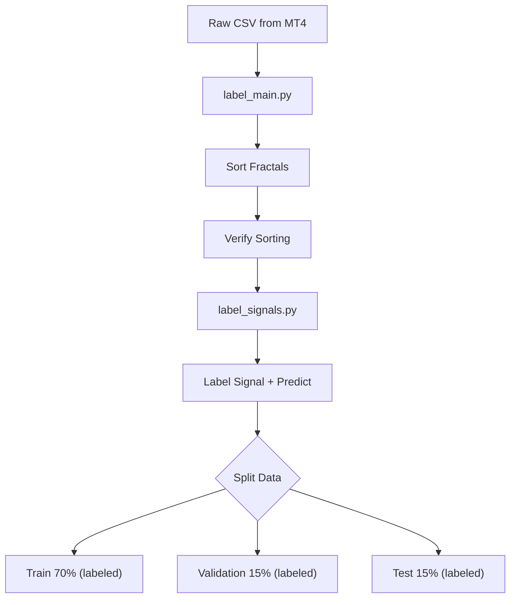

# Резюме документации

**Файлы**: `label_main.py`, `label_signals.py`
**Назначение**: Комплекс скриптов для предобработки (сортировка, разделение) и маркировки (labeling) исторических данных фракталов для обучения нейросети.

---

## Ключевые функции

### `label_main.py` (CLI / Оркестратор)

| Функция | Описание |
|---------|----------|
| `main()` | Точка входа CLI: загрузка CSV, вызов сортировки, маркировки и разделения |
| `process_row_fractals()` | Парсинг и обратная сортировка фракталов в одной строке (новые → первые) |
| `sort_fractals_in_dataframe()` | Применение сортировки ко всему DataFrame |
| `verify_sorting_quality()` | Валидация хронологического порядка фракталов (время убывает слева направо) |
| `split_train_val_test()` | Разделение промаркированных данных на Train (70%) / Validation (15%) / Test (15%) |

### `label_signals.py` (Логика маркировки)

| Функция | Описание |
|---------|----------|
| `label_all()` | Основная функция маркировки (`signal` + `predict`) |
| `parse_fractal()` | Парсинг строки фрактала в словарь параметров |
| `find_fractal_by_time()` | Поиск конкретного фрактала в "будущих" строках (Forward-looking) |
| `label_signals()` | Wrapper для маркировки только сигналов |
| `label_predict_only()` | Wrapper для маркировки только предсказаний |

---

## Поток данных



- **Вход**: CSV файл из MetaTrader (разделитель `;`), содержащий колонки `fractal0`, `fractal1`...
- **Обработка**: 
  1. Сортировка фракталов по времени (descending).
  2. **Маркировка ВСЕГО датасета** (signal + predict).
  3. Разделение на Train/Validation/Test (70/15/15%).
- **Выход** (все файлы содержат метки): 
  - `*_train_labeled.csv` (для обучения)
  - `*_validation_labeled.csv` (для оценки во время обучения)
  - `*_test_labeled.csv` (для финальной оценки модели)

---

## Зависимости

### Внутренние
- `label_signals.py` используется внутри `label_main.py`.

### Внешние
- `pandas` — обработка табличных данных.
- `argparse` — интерфейс командной строки.

---

## Конфигурация запуска

| Параметр CLI | По умолчанию | Описание |
|--------------|--------------|----------|
| `--input`, `-i` | `Nero.csv` | Путь к входному файлу |
| `--output`, `-o` | `Nero_labeled.csv` | Базовое имя выходного файла (фактически используется префикс) |
| `--debug`, `-d` | `False` | Включить подробный вывод логов процесса |

### Пример запуска
```bash
python label_main.py
python label_main.py --input data/EURUSD_H1.csv --debug
```

---

## Формат данных фрактала

Строка вида: `time:price:direction:front:back:strong:break:reverse:power:count:impulse`

| Индекс | Поле | Описание |
|--------|------|----------|
| 0 | `time` | Абсолютное время фрактала (ключ для поиска) |
| 1 | `price` | Значение цены пика фрактала |
| 2 | `direction` | Направление (+1 пик, -1 впадина) |
| 3 | `front` | Величина ценового движения до фрактала |
| 4 | `back` | Величина ценового движения после фрактала |
| 5 | `strong` | Признак разворота тренда (1 = да, 0 = нет) |
| 6 | `break` | Счетчик пробоев последующими движениями |
| 7 | `reverse` | Сила пробитого этим фракталом уровня (если ничего не пробил = 0) |
| 8 | `power` | Сумма сил всех фракталов, совпадающих по уровню |
| 9 | `count` | Количество совпадений по цене с другими фракталами |
| 10 | `impulse` | Импульс цены (скорость разворота), заданный этим фракталом |

---

## Предлагаемое расположение .md файла

`docs/python/labeling_scripts.md`
