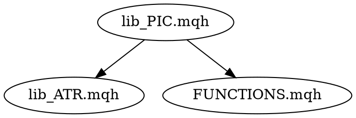

# План: Конвертация Rules → Skills

> **Для агента:** Используй `executing-plans` для реализации этого плана пошагово.

**Цель:** Преобразовать многошаговые workflows из rules в полноценные skills для автоматизации и лучшего UX.

**Архитектура:** Создать 2 новых skills + обновить 1 существующий. Упростить rules, удалив дублирование.

**Технологический стек:** YAML frontmatter, Markdown, Kilo Code Skills API

---

## Task 1: Создать skill `refactor-agents-md`

**Файлы:**
- Создать: `.kilocode/skills/refactor-agents-md/SKILL.md`

**Шаг 1: Создать структуру директории**
```bash
mkdir -p .kilocode/skills/refactor-agents-md
```

**Шаг 2: Написать SKILL.md**

```markdown
---
name: refactor-agents-md
description: Use when AGENTS.md exceeds 200 lines, needs restructuring, or when refactoring project documentation architecture
triggers:
  - refactor agents.md
  - сократи agents
  - split agents.md
alwaysApply: false
---

# Рефакторинг AGENTS.md

## Overview

AGENTS.md > 200 lines — проблема: загружается на КАЖДЫЙ запрос, тратит токены.

**Core principle:** Модульная архитектура: Foundation → Component → Feature.

## When to Use

- AGENTS.md > 200 lines
- Появился task-specific контент (ML, MQL4, deploy)
- Дублирование между AGENTS.md и другими документами
- Нужно добавить новый компонент в проект

## The Process

### Phase 1: Audit (Обязательно!)

**Шаг 1.1: Подсчитать строки**
```bash
wc -l AGENTS.md
wc -l .kilocode/rules/*.md
```

**Шаг 1.2: Найти task-specific контент**
Разметить каждую секцию AGENTS.md:
| Секция | Тип | Действие |
|--------|-----|----------|
| Quick start | Foundation | Оставить |
| ML pipeline details | Component | Вынести в rules/ml.md |
| MQL4 encoding | Component | Вынести в rules/mql4.md |
| Deployment | Feature | Вынести в docs/deploy.md |

**Шаг 1.3: Найти дублирование**
Сравнить с:
- README.md
- docs/DATA_FLOW.md
- MODULE_INDEX.md

### Phase 2: Extract (Вынести компоненты)

**Шаг 2.1: Создать component rules**

Для каждого task-specific раздела:
```bash
# Пример: ML компонент
cat > .kilocode/rules/ml.md << 'EOF'
---
name: ml-pipeline
description: ML pipeline specific rules for SoSimple project
globs:
  - "ML/**/*.py"
  - "ML/**/*.ipynb"
alwaysApply: false
---

# ML Pipeline Rules

## Model Training
- Все модели наследуются от BaseModel
- Сохраняй чекпоинты в ML/checkpoints/
- Используй ExperimentLogger для логирования

## Data Loading
- Используй data_loader.DataLoader
- Нормализация через normalize.py
EOF
```

**Шаг 2.2: Создать feature docs**
```bash
mkdir -p docs/ml
cat > docs/ml/training_guide.md << 'EOF'
# ML Training Guide

@AGENTS.md:45  # Ссылка на архитектуру

## Quick Start
...
EOF
```

**Шаг 2.3: Обновить AGENTS.md**
- Удалить вынесенные секции
- Добавить ссылки:
```markdown
## ML Pipeline
Детали: [.kilocode/rules/ml.md](.kilocode/rules/ml.md)  
Руководство: [docs/ml/training_guide.md](docs/ml/training_guide.md)
```

### Phase 3: Validate (Проверить)

**Шаг 3.1: Проверить размеры**
```bash
wc -l AGENTS.md  # Должно быть < 200
wc -l .kilocode/rules/*.md  # Каждый < 500
```

**Шаг 3.2: Проверить ссылки**
```bash
# Проверить все markdown ссылки
grep -r '\[.*\](.*\.md)' AGENTS.md .kilocode/rules/ | head -20
```

**Шаг 3.3: Проверить @ ссылки**
Убедиться, что используются `@file` вместо копирования.

### Phase 4: Commit

**Шаг 4.1: Создать коммит**
```bash
git add AGENTS.md .kilocode/rules/ docs/
git commit -m "refactor: split AGENTS.md into modular rules

- Extract ML rules to .kilocode/rules/ml.md
- Extract MQL4 rules to .kilocode/rules/mql4.md
- Reduce AGENTS.md from XXX to < 200 lines
- Add cross-references with @ syntax"
```

## Red Flags

| НЕ делай | Почему |
|----------|--------|
| Оставить task-specific в AGENTS.md | Будет грузиться всегда, трата токенов |
| Дублировать контент | Нарушение 002-compact-and-no-duplication |
| Забыть globs в новых rules | Будут грузиться для всех файлов |

## Examples

### ✅ Before (AGENTS.md > 300 lines)
```markdown
# SoSimple

## Quick Start  (10 строк)
## Architecture (20 строк)
## ML Pipeline  (80 строк!) ← Сюда
## MQL4 Details (60 строк!) ← И сюда
## Data Flow    (40 строк) ← И сюда
```

### ✅ After (AGENTS.md < 100 lines)
```markdown
# SoSimple

## Quick Start
## Architecture
## Modular Docs
- ML: @.kilocode/rules/ml.md, @docs/ml/
- MQL4: @.kilocode/rules/mql4.md
- Data: @docs/DATA_FLOW.md
```
```

---

## Task 2: Создать skill `mql4-processing`

**Файлы:**
- Создать: `.kilocode/skills/mql4-processing/SKILL.md`
- Обновить: удалить дублирование из `.kilocode/rules/004-mql4-specifics.md` и `.kilocode/rules/100-file-handling.md`

**Шаг 1: Создать структуру**
```bash
mkdir -p .kilocode/skills/mql4-processing
```

**Шаг 2: Написать SKILL.md**

```markdown
---
name: mql4-processing
description: Use when working with MetaTrader 4 MQL4 files (.mq4, .mqh) - reading, modifying, analyzing, or documenting MQL4 code
triggers:
  - read mql4
  - mql4 file
  - .mqh file
  - .mq4 file
  - modify mql4
  - analyze mql4
  - метатрейдер
  - мкл4
  - кодировка mql4
applies_to:
  - "**/*.mq4"
  - "**/*.mqh"
alwaysApply: false
---

# Работа с MQL4 файлами

## Overview

MQL4 файлы имеют особенности:
- **Кодировка**: UTF-16LE (НЕ UTF-8)
- **Синтаксис**: C-подобный, специфичные конструкции
- **Тестирование**: Только в MetaTrader 4 Strategy Tester

## The Workflow

### Phase 1: Read (Чтение)

**Шаг 1.1: Проверить кодировку**
```bash
file MT/MQL4/Include/lib_PIC.mqh
# Ожидаемо: UTF-16 Little Endian
```

**Шаг 1.2: Прочитать с правильной кодировкой**
```python
with open('MT/MQL4/Include/lib_PIC.mqh', 'r', encoding='utf-16-le') as f:
    content = f.read()
```

**Шаг 1.3: Проверить структуру**
- Найти file header (//+--...--+)
- Найти основные функции (int OnInit(), void OnTick())
- Найти #include directives

### Phase 2: Analyze (Анализ)

**Шаг 2.1: Извлечь метаданные**
- Имя файла
- Зависимости (#include)
- Входные параметры (input double, input int)
- Глобальные переменные

**Шаг 2.2: Построить dependency graph**


### Phase 3: Document (Документирование)

**Шаг 3.1: Создать markdown doc**
```bash
# Путь: docs/mql4/[filename].md
cat > docs/mql4/lib_PIC.mqh.md << 'EOF'
# lib_PIC.mqh

**Файл**: `MT/MQL4/Include/lib_PIC.mqh`  
**Назначение**: Алгоритм PIC (Price Inversion Channel)

## Зависимости
- @MT/MQL4/Include/lib_ATR.mqh
- @MT/MQL4/Include/FUNCTIONS.mqh

## Основные функции
- `CalculatePIC()` — расчёт канала
- `GetSignal()` — генерация сигнала
EOF
```

**Шаг 3.2: Обновить MODULE_INDEX.md**
Добавить запись по шаблону 001-module-index.md.

### Phase 4: Modify (Модификация)

**Шаг 4.1: Подготовить file header (если отсутствует)**
```cpp
//+------------------------------------------------------------------+
//| Файл: lib_PIC.mqh
//| Назначение: Алгоритм PIC для определения разворотов
//| Язык: MQL4
//| Обновлён: 2026-03-05
//| Зависимости:
//|   - lib_ATR.mqh
//|   - FUNCTIONS.mqh
//+------------------------------------------------------------------+
```

**Шаг 4.2: Записать с правильной кодировкой**
```python
with open('MT/MQL4/Include/lib_PIC.mqh', 'w', encoding='utf-16-le') as f:
    f.write(modified_content)
```

## Common Operations

### ✅ Read MQL4 file
```python
with open('file.mqh', 'r', encoding='utf-16-le') as f:
    content = f.read()
```

### ✅ Write MQL4 file
```python
with open('file.mqh', 'w', encoding='utf-16-le') as f:
    f.write(content)
```

### ✅ Check dependencies
```bash
grep -r "#include" MT/MQL4/Include/
```

## Red Flags

| НЕ делай | Почему |
|----------|--------|
| Открывать без encoding='utf-16-le' | Будут кракозябры |
| Пытаться запустить MQL4 в Python | MQL4 только в MetaTrader |
| Забывать file header | Нарушение 000-documentation.md |

## Integration with Other Skills

- После работы: использовать `add-new-module` для обновления MODULE_INDEX.md
- Перед commit: использовать `verification-before-completion` для проверки
```

**Шаг 3: Упростить rules**

Обновить `.kilocode/rules/004-mql4-specifics.md`:
```markdown
---
name: mql4-specifics
description: MQL4 file constraints (UTF-16LE encoding)
globs:
  - "**/*.mq4"
  - "**/*.mqh"
alwaysApply: true
---

**Кодировка**: UTF-16LE (НЕ UTF-8). Используй skill `mql4-processing` для работы с MQL4 файлами.
```

Обновить `.kilocode/rules/100-file-handling.md`:
```markdown
---
name: file-handling
description: General file handling guidelines
globs:
  - "**/*.csv"
  - "**/*.parquet"
alwaysApply: false
---

## CSV files
Use sampling (nrows=100) for exploration. Never load full CSV into context.

## MQL4 files
See [.kilocode/skills/mql4-processing/](.kilocode/skills/mql4-processing/)
```

---

## Task 3: Обновить skill `add-new-module`

**Файлы:**
- Обновить: `.kilocode/skills/add-new-module/SKILL.md`
- Ссылка на: `.kilocode/rules/001-module-index.md` (будет удалён после обновления skill)

**Шаг 1: Прочитать текущий skill**
Проверить существующий `.kilocode/skills/add-new-module/SKILL.md`

**Шаг 2: Добавить интеграцию с rules**

В раздел «Режим 1: Создание нового модуля» добавить:

```markdown
### Шаг 0: Проверить правила

Перед созданием модуля загрузить соответствующие rules:
- Для .py: @.kilocode/rules/000-documentation.md
- Для .mqh/.mq4: @.kilocode/rules/004-mql4-specifics.md, @.kilocode/skills/mql4-processing/
- Для .ipynb: @.kilocode/rules/005-jupyter-hygiene.md

### Шаг 1: Определить параметры
(существующий контент)

### Шаг 2: Создать file header
Использовать точный шаблон из 000-documentation.md:
- Для Python: `# ====` рамка
- Для MQL4: `//+--+` рамка (UTF-16LE!)
- Для Jupyter: Markdown ячейка

### Шаг 3: Создать документацию
Создать `docs/[category]/[filename].md` по шаблону из 000-documentation.md.

### Шаг 4: Обновить индексы
- Добавить в MODULE_INDEX.md по шаблону 001-module-index.md
- Обновить DATA_FLOW.md если участвует в pipeline
- Обновить AGENTS.md если критичный компонент

### Шаг 5: Валидация
- Проверить file header: все поля заполнены?
- Проверить кодировку (особенно для MQL4)
- Проверить ссылки в документации
```

**Шаг 3: Добавить русские триггеры**

```yaml
triggers:
  - create module [name]
  - new script [name]
  - doc this [file]
  - document [file]
  - создай модуль [name]
  - новый скрипт [name]
  - задокументируй [file]
  - документация [file]
```

---

## Task 4: Упростить существующие rules

**Файлы:**
- Обновить: `.kilocode/rules/001-module-index.md`
- Удалить дублирование после создания skills

**Шаг 1: Обновить 001-module-index.md**
```markdown
---
name: module-index
description: Module indexing reminder - use add-new-module skill for automated indexing
globs:
  - "*.py"
  - "*.mqh"
  - "*.ipynb"
alwaysApply: true
---

При создании модуля используй skill: `create module [name]`

Этот skill автоматически:
1. Добавит file header по стандарту 000-documentation.md
2. Добавит запись в MODULE_INDEX.md
3. Обновит DATA_FLOW.md при необходимости
```

**Шаг 2: Обновить 006-skill-before-manual.md**
```markdown
---
name: skill-before-manual
description: Check for available skills before manual work
globs: []
alwaysApply: true
---

Перед выполнением задачи проверь доступные skills:

| Команда | Назначение |
|---------|------------|
| `sync docs` | Синхронизация документации |
| `doc this [file]` | Документирование файла |
| `check docs` | Проверка актуальности |
| `create module [name]` | Создание нового модуля |
| `check data impact [file]` | Анализ зависимостей данных |
| `refactor agents.md` | Рефакторинг AGENTS.md |
| `mql4-processing [file]` | Работа с MQL4 файлами |
```

---

## Task 5: Проверить итоговую структуру

**Шаг 1: Проверить все skills**
```bash
ls -la .kilocode/skills/
# Должно быть:
# add-new-module/
# brainstorm/
# ... (существующие)
# refactor-agents-md/   ← новый
# mql4-processing/     ← новый
```

**Шаг 2: Проверить все rules**
```bash
ls -la .kilocode/rules/
# Должно быть:
# 000-documentation.md      (standards)
# 001-module-index.md       (reminder)
# 002-compact-and-no-duplication.md  (standards)
# 004-mql4-specifics.md     (minimized - ссылка на skill)
# 005-jupyter-hygiene.md      (можно оставить или тоже сделать skill)
# 006-skill-before-manual.md  (updated)
# 007-no-csv-context.md       (critical constraint)
# 100-file-handling.md        (minimized)
# agents-md-writer.md         (можно удалить - заменён skill)
```

**Шаг 3: Проверить интеграцию**
- Создать тестовый модуль через `create module test_module`
- Проверить, что используется skill и создаются все артефакты

---

## Execution Order

```
Task 2 (mql4-processing) → Task 3 (обновить add-new-module) → Task 1 (refactor-agents-md) → Task 4 (упростить rules) → Task 5 (проверка)
```

Почему такой порядок:
1. `mql4-processing` — фундаментальный skill для MQL4
2. `add-new-module` — использует work-with-mql4 и другие rules
3. `refactor-agents-md` — использует add-new-module для создания новых правил
4. Упрощение rules — после создания всех skills
5. Проверка — финальная валидация
