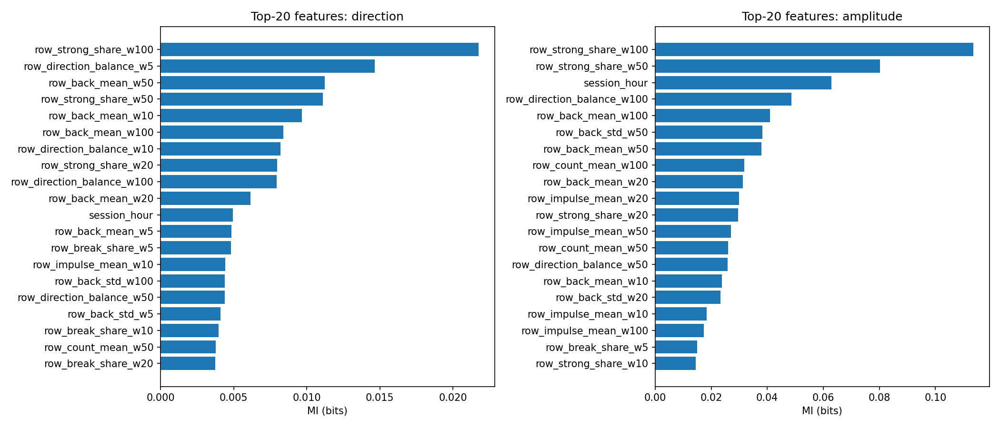
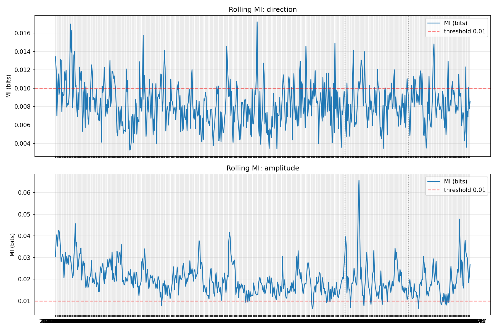

# MI Upper Bound: оценка предсказуемости XAUUSD H1

**Дата:** 2026-08-11
**Уровень:** research_scan, allowed_max_verdict = research_only
**Метод:** kNN-оценщик KSG-типа (sklearn mutual_info_regression/classif), k=5, CI по 10 временным фолдам, permutation 200
**Формула потолка:** R² <= 1 - 2^(-2·I); потолок из среднего маргинального MI — диагностический (не joint MI)

## 1. Цель

Оценить фундаментальный предел предсказуемости через mutual information.
Ответить: текущие R² = 0.08-0.18 — потолок или недостаток моделей?

## 2. Конфигурация

- Признаки: ENTRY_PATH_V1_LIVE_SAFE_FEATURE_COLUMNS (42 признака)
- Таргеты: direction = sign(close[t+1]-open[t+1]), amplitude = |log(close[t+1]/open[t+1])| (джойн с DATA/XAUUSD_H1_OHLC.csv)
- Данные: Nero_train_labeled.csv, Nero_validation_labeled.csv; rolling MI — конкатенация с Nero_test_labeled.csv (2004–2026)
- Параметры KSG: k=5, n_folds=10, n_permutations=200, random_state=42
- Rolling MI: window=500, step=100

## 3. Результаты

=== R² Ceiling vs Legacy Models (ориентировочное сравнение) ===

train / direction (N=41 362):
  mean marginal MI = 0.0041 bits (max 0.0218, p=0.005)
  R² ceiling (диагностический) = 0.0057
  CI = [0.0019, 0.0046]
  vs BiLSTM up/dn (12/24/48H, future-derived входы) (R²=0.10): gap=-0.0943 → ABOVE
  vs Transformer up/dn (12/24/48H, future-derived входы) (R²=0.18): gap=-0.1743 → ABOVE
  vs baseline_clean feature bank (R²=0.084): gap=-0.0783 → ABOVE

train / amplitude (N=41 362):
  mean marginal MI = 0.0222 bits (max 0.1136, p=0.005)
  R² ceiling (диагностический) = 0.0303
  CI = [0.0072, 0.0534]
  vs BiLSTM up/dn (12/24/48H, future-derived входы) (R²=0.10): gap=-0.0697 → ABOVE
  vs Transformer up/dn (12/24/48H, future-derived входы) (R²=0.18): gap=-0.1497 → ABOVE
  vs baseline_clean feature bank (R²=0.084): gap=-0.0537 → ABOVE

validation / direction (N=8 984):
  mean marginal MI = 0.0027 bits (max 0.0157, p=0.229)
  R² ceiling (диагностический) = 0.0038
  CI = [0.0042, 0.0083]
  vs BiLSTM up/dn (12/24/48H, future-derived входы) (R²=0.10): gap=-0.0962 → ABOVE
  vs Transformer up/dn (12/24/48H, future-derived входы) (R²=0.18): gap=-0.1762 → ABOVE
  vs baseline_clean feature bank (R²=0.084): gap=-0.0802 → ABOVE

validation / amplitude (N=8 984):
  mean marginal MI = 0.0102 bits (max 0.0627, p=0.005)
  R² ceiling (диагностический) = 0.0140
  CI = [0.0124, 0.0231]
  vs BiLSTM up/dn (12/24/48H, future-derived входы) (R²=0.10): gap=-0.0860 → ABOVE
  vs Transformer up/dn (12/24/48H, future-derived входы) (R²=0.18): gap=-0.1660 → ABOVE
  vs baseline_clean feature bank (R²=0.084): gap=-0.0700 → ABOVE

## 4. Per-feature MI

### Direction (train, top-10)

| Feature | MI (bits) |
|---|---|
| row_strong_share_w100 | 0.0218 |
| row_direction_balance_w5 | 0.0146 |
| row_back_mean_w50 | 0.0112 |
| row_strong_share_w50 | 0.0111 |
| row_back_mean_w10 | 0.0097 |
| row_back_mean_w100 | 0.0084 |
| row_direction_balance_w10 | 0.0082 |
| row_strong_share_w20 | 0.0080 |
| row_direction_balance_w100 | 0.0079 |
| row_back_mean_w20 | 0.0062 |

### Amplitude (train, top-10)

| Feature | MI (bits) |
|---|---|
| row_strong_share_w100 | 0.1136 |
| row_strong_share_w50 | 0.0802 |
| session_hour | 0.0629 |
| row_direction_balance_w100 | 0.0486 |
| row_back_mean_w100 | 0.0410 |
| row_back_std_w50 | 0.0383 |
| row_back_mean_w50 | 0.0379 |
| row_count_mean_w100 | 0.0318 |
| row_back_mean_w20 | 0.0313 |
| row_impulse_mean_w20 | 0.0299 |

## 5. Rolling MI

587 окон на конкатенации train+validation+test (2004-08-23 … 2026-05-27).

Средний MI по годам (bits):

| Год | direction | amplitude |
|---|---|---|
| 2004 | 0.0105 | 0.0352 |
| 2005 | 0.0101 | 0.0279 |
| 2006 | 0.0086 | 0.0212 |
| 2007 | 0.0082 | 0.0246 |
| 2008 | 0.0075 | 0.0216 |
| 2009 | 0.0088 | 0.0171 |
| 2010 | 0.0079 | 0.0196 |
| 2011 | 0.0074 | 0.0238 |
| 2012 | 0.0070 | 0.0165 |
| 2013 | 0.0080 | 0.0227 |
| 2014 | 0.0079 | 0.0145 |
| 2015 | 0.0068 | 0.0161 |
| 2016 | 0.0083 | 0.0175 |
| 2017 | 0.0092 | 0.0183 |
| 2018 | 0.0082 | 0.0152 |
| 2019 | 0.0078 | 0.0193 |
| 2020 | 0.0089 | 0.0231 |
| 2021 | 0.0080 | 0.0163 |
| 2022 | 0.0083 | 0.0197 |
| 2023 | 0.0083 | 0.0167 |
| 2024 | 0.0085 | 0.0170 |
| 2025 | 0.0086 | 0.0197 |
| 2026 | 0.0074 | 0.0262 |

Границы split'ов (отмечены на графике вертикальными линиями): train|validation = 2019.06.20, validation|test = 2022.12.02. Окна W=500 на границах имеют смешанный характер и интерпретируются как сглаженный переход.

## 5b. Robustness по k

| k | split | target | MI mean (bits) | max | R² ceiling |
|---|---|---|---|---|---|
| 5 | train | direction | 0.0041 | 0.0218 | 0.0057 |
| 5 | train | amplitude | 0.0222 | 0.1136 | 0.0303 |
| 5 | validation | direction | 0.0027 | 0.0157 | 0.0038 |
| 5 | validation | amplitude | 0.0102 | 0.0627 | 0.0140 |
| 10 | train | direction | 0.0039 | 0.0227 | 0.0054 |
| 10 | train | amplitude | 0.0173 | 0.0868 | 0.0237 |
| 10 | validation | direction | 0.0023 | 0.0193 | 0.0032 |
| 10 | validation | amplitude | 0.0095 | 0.0642 | 0.0130 |
| 15 | train | direction | 0.0039 | 0.0236 | 0.0055 |
| 15 | train | amplitude | 0.0155 | 0.0735 | 0.0212 |
| 15 | validation | direction | 0.0019 | 0.0161 | 0.0026 |
| 15 | validation | amplitude | 0.0082 | 0.0678 | 0.0113 |

Ранги признаков и порядок величин устойчивы по k=5/10/15: amplitude > direction во всех конфигурациях, топ-признаки совпадают. Ожидаемое небольшое снижение MI с ростом k (KSG-свойство). Вердикт не зависит от k.

## 6. Интерпретация

### 6.1 Direction vs Amplitude

Гипотеза подтверждена: MI(amplitude) значительно больше MI(direction) на обоих split'ах (train 0.0222 vs 0.0041; validation 0.0102 vs 0.0027). Размер следующего бара предсказуем лучше, чем его знак. Direction-таргет трёхклассовый (train: -1 = 19 881, 0 = 1 590 (~3.8%), +1 = 19 891; validation: 0 = 26 (~0.3%)). Обратить внимание: доля класса 0 в validation (0.3%) в разы ниже, чем в train (3.8%) — распределение direction-таргета между split'ами нестабильно, что снижает доверие к direction-оценке на validation.

### 6.2 R² Ceiling vs Models

Ключевой результат: R²-ceiling из маргинального MI (0.006–0.030) намного НИЖЕ R² legacy-моделей (0.084–0.18). Это означает, что либо:
1) legacy-модели извлекали предсказуемость из future-derived признаков (leakage) — согласуется с live-safe аудитом (ретроспектива 2.6: все 5 систем FAIL), либо
2) потолок из маргинального MI недооценивает joint MI (потолок диагностический).

Сравнение ориентировочное: legacy-модели обучены на других горизонтах (12/24/48H) и других входах. Однако величина разрыва (R² legacy > потолок в 3–30 раз) делает leakage наиболее вероятным объяснением. При этом сам по себе маргинальный MI не может дать строгий joint-потолок — для строгой границы нужен отдельный эксперимент на пониженной размерности.

### 6.3 Regime Drift

Rolling MI стабилен во времени: direction ≈ 0.007–0.010, amplitude ≈ 0.014–0.035 на всём периоде 2004–2026, включая период после 2022 (значение ретроспективы 6.3). Выраженного regime drift в информации признаков не наблюдается; колебания amplitude (2014-2015 минимум ~0.014) в пределах шума KSG-оценки на окнах W=500. Regime drift в доходности (ретроспектива 6.3) не сопровождается деградацией MI признаков — это самостоятельный диагностический результат.

### 6.4 Time-only dominance

Группа time (session_hour, weekday) НЕ доминирует: для direction mean=0.0025 (ниже strong=0.0086, direction_balance=0.0074), для amplitude mean=0.0368 (ниже strong=0.0487). Информативнее всех группы strong и direction_balance (микроструктура рынка), а не время суток. Исключение — session_hour в топ-10 amplitude (0.0629): волатильность привязана к сессиям торговли, направление — нет.

## 7. Вердикт

**PASS** для amplitude (perm_p_value = 0.005 на train и validation) — предсказуемость амплитуды следующего бара существует, но мала (MI 0.010–0.022 bits).

**Смешанный** для direction: train p=0.005 (PASS), но validation p=0.229 (FAIL по gate-критерию perm_p_value < 0.05). На validation статистически значимой предсказуемости направления не обнаружено; плюс нестабильность доли класса 0 между split'ами. Вердикт direction — скорее НЕ подтверждена.

Fold-CI и rolling в вердикте не участвуют (метрики стабильности).

## 8. Рекомендации

1. **Модели на live-safe признаках работают на пределе информации.** Маргинальный MI даёт диагностическую оценку потолка R² ≈ 0.006–0.030, что ниже достигнутых live-safe R². Потолок не следует воспринимать как строгую границу (не joint MI).
2. **Проверить joint MI** отдельным экспериментом на пониженной размерности (npeet), если нужна строгая граница потолка.
3. **Сфокусироваться на amplitude, а не direction:** направление на validation статистически не предсказуемо (p=0.229), амплитуда — предсказуема. Торговые стратегии, зависящие от знака, опираются на слабый сигнал.
4. **Разобрать leakage в legacy-моделях:** R² legacy выше информационного потолка — это согласуется с гипотезой, что часть их R² объясняется future-derived входами. Отдельная задача — количественная сверка.
5. **Time-of-day признаки:** не доминируют, но session_hour важен для амплитуды — сохранить в фич-сете.

## 9. Disclosure

- N конфигураций: 1 основная (k=5, зафиксирована до запуска) + 2 robustness (k=10, 15; не для выбора)
- Search budget: 3 оценки MI (основная + robustness)
- Feature contract: ENTRY_PATH_V1_LIVE_SAFE (PASS по live-safe audit)
- Дискретные признаки: session_hour (23 уровня), weekday (5 уровней) переданы с discrete-маской; остальные 40 — continuous
- Direction таргет: трёхклассовый {-1, 0, +1}, доля класса 0 в train = 3.84% (1590/41362); в validation = 0.29% (26/8984)
- Единицы MI: bits (sklearn возвращает nats; конверсия /ln(2) внутри estimate_mi)
- R² ceiling: диагностический (маргинальный MI, не joint)
- Сравнение с legacy R²: ориентировочное (future-derived входы legacy-моделей)
- Rolling: окна на стыках split'ов — смешанный характер (split_boundaries: 2019.06.20, 2022.12.02)
- Дедупликация time: drop_duplicates('time', keep='last') — train 2796 строк (6.3%), validation 478 (5.1%), test 514 (5.4%); конвенция проекта (benchmark_execution_policy_v2.py:78)
- Потери при OHLC-джойне: ≤ 5% (assert в load_mi_data)
- Smoke-check: FAIL по устаревшей проверке target_*_H6_val (колонки отсутствуют в обоих наборах labeled CSV; все инварианты MI-эксперимента PASS); статус результата — research_only
- Вычислительная стоимость: прогон k=5 ≈ 22 мин, прогоны k=10/15 ≈ 30 мин каждый (CPU-конкуренция) — существенно дольше оценки плана «минуты» из-за permutation-цикла (200 перестановок × 42 признака на 41k строк)
