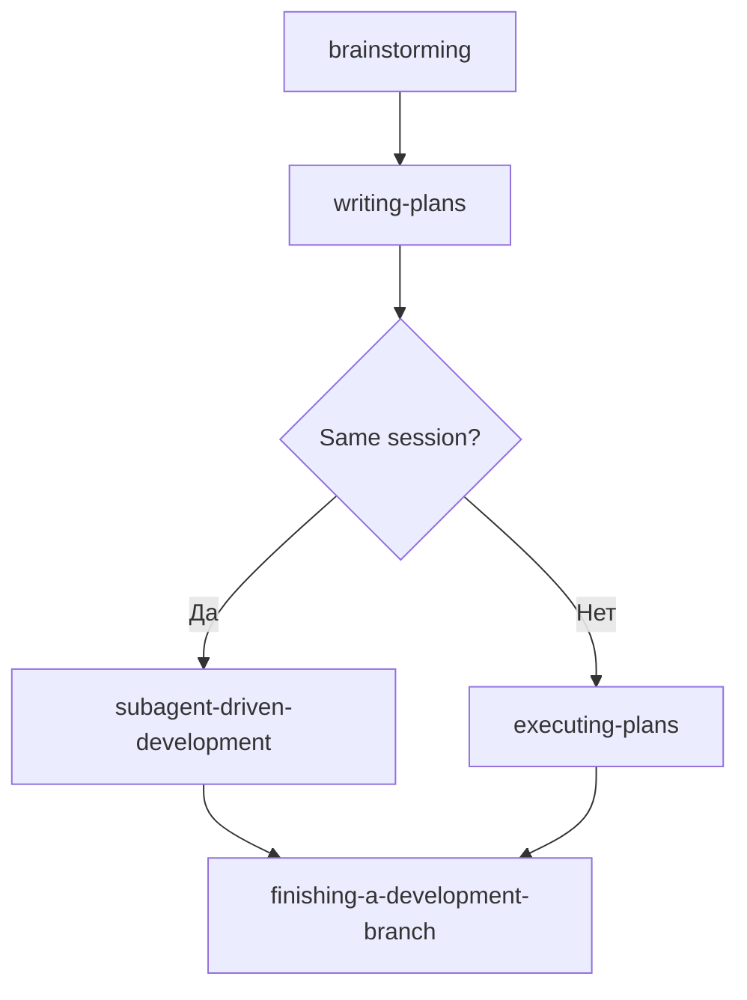

# Анализ скиллов .kilocode/skills

## Обзор

Проанализировано **26 скиллов** в директории `.kilocode/skills/`. Анализ проведён по трём направлениям:
1. Функциональное дублирование между скиллами
2. Соответствие правилам `writing-skills/SKILL.md`
3. Выявленные несоответствия и рекомендации

---

## 1. Функциональное дублирование между скиллами

### 1.1 Высокое дублирование (Критично)

#### A. Workflow/Execution Pipeline (4 скилла)

| Скилл | Описание | Пересечение |
|-------|----------|-------------|
| `brainstorming` | Дизайн перед реализацией | Является входной точкой для writing-plans |
| `writing-plans` | Создание плана реализации | Дублирует часть brainstorming; планирует работу для executing-plans/subagent-driven-development |
| `executing-plans` | Выполнение плана в параллельной сессии | Альтернатива subagent-driven-development; оба выполняют план |
| `subagent-driven-development` | Выполнение плана с subagent'ами | Альтернатива executing-plans; оба выполняют план |
| `finishing-a-development-branch` | Завершение работы | Общий финальный шаг для обоих execution-скиллов |

**Проблема:** Пользователю неочевидно, когда использовать `executing-plans` vs `subagent-driven-development`. Оба скилла:
- Принимают план как вход
- Выполняют задачи из плана
- Используют subagent'ов
- Заканчиваются вызовом `finishing-a-development-branch`

**Различия минимальны:**
- `executing-plans`: review между batch'ами (3 задачи)
- `subagent-driven-development`: review после КАЖДОЙ задачи, двухступенчатый review

**Рекомендация:** Объединить в один скилл с опциями, или сделать различия более явными.

---

#### B. Дисциплинарные скиллы (3 скилла) - Концептуальное дублирование

| Скилл | Core Principle | Структура |
|-------|---------------|-----------|
| `test-driven-development` | "NO PRODUCTION CODE WITHOUT FAILING TEST" | RED-GREEN-REFACTOR цикл |
| `systematic-debugging` | "NO FIXES WITHOUT ROOT CAUSE" | 4 фазы investigation |
| `verification-before-completion` | "NO COMPLETION CLAIMS WITHOUT VERIFICATION" | Gate function |

**Проблема:** Все три скилла используют **одинаковый паттерн**:
1. Iron Law / абсолютное правило
2. Rationalization Prevention таблица
3. Red Flags секция
4. "Violating the letter is violating the spirit"

**Рекомендация:** Это не дублирование функционала, а дублирование *шаблона*. Возможно, стоит создать общий "discipline-enforcing" шаблон.

---

#### C. Code Review скиллы (2 скилла)

| Скилл | Когда использовать |
|-------|-------------------|
| `requesting-code-review` | После завершения задачи |
| `receiving-code-review` | При получении feedback |

**Проблема:** Логически связанные, но разделённые. Нет явной связи между ними в описаниях.

**Рекомендация:** Можно объединить в один скилл "code-review-workflow" с двумя фазами.

---

### 1.2 Среднее дублирование

#### D. Skill Creation скиллы (2 скилла)

| Скилл | Источник | Подход |
|-------|----------|--------|
| `writing-skills` | Internal (Kilocode) | TDD-подход к созданию скиллов |
| `skill-creator` | External (Composio) | Template-based подход |

**Проблема:** Два разных подхода к созданию скиллов:
- `writing-skills`: RED-GREEN-REFACTOR с pressure testing
- `skill-creator`: Progressive disclosure, anatomy of a skill

**Различия значительны** — оба подхода валидны, но могут путать пользователя.

**Рекомендация:** Явно разделить: `writing-skills` для дисциплинарных скиллов, `skill-creator` для reference/tool скиллов.

---

#### E. Documentation скиллы (4 скилла)

| Скилл | Функция |
|-------|---------|
| `add-new-module` | Добавить модуль с документацией |
| `generate-module-index` | Регенерировать MODULE_INDEX.md |
| `update-docs-on-code-change` | Синхронизировать документацию |
| `refactor-agents-md` | Рефакторинг AGENTS.md |

**Проблема:** Все 4 скилла связаны с документацией, но:
- Нет явной связи между ними
- Неясно, когда какой использовать
- `update-docs-on-code-change` перекрывается с `add-new-module`

**Рекомендация:** Создать общий раздел "Documentation Workflow" с последовательностью.

---

### 1.3 Низкое/Нет дублирования ✅

Скиллы без значимого дублирования:
- `using-superpowers` — мета-скилл, уникален
- `using-git-worktrees` — специфичная git-операция
- `csv-processing` — data processing
- `mql4-processing` — специфичный домен (MT4)
- `jupyter-processing` — Jupyter-специфично
- `create-eda-report` — проект-специфично (SoSimple)
- `check-data-impact` — проект-специфично
- `explain-pipeline-step` — проект-специфично
- `dispatching-parallel-agents` — debugging workflow
- `gh-issues` — GitHub CLI интеграция

---

## 2. Соответствие правилам writing-skills

### 2.1 Правила из writing-skills/SKILL.md

#### Frontmatter требования:
| Правило | Требование | Статус в скиллах |
|---------|------------|------------------|
| Поля | Только `name` и `description` | ❌ Нарушение: многие имеют `tags`, `triggers`, `applies_to` |
| name | Letters, numbers, hyphens | ✅ Соблюдается |
| description | Start with "Use when...", third-person | ⚠️ Частично: не все начинают с "Use when" |
| description | Max 1024 chars total | ✅ Соблюдается |
| description | НЕ описывать workflow | ⚠️ Частично: некоторые описывают процесс |

#### Структура SKILL.md:
| Правило | Требование | Статус |
|---------|------------|--------|
| Overview | 1-2 предложения | ⚠️ Не все скиллы имеют |
| When to Use | Symptoms and contexts | ⚠️ Не все скиллы имеют явный раздел |
| Quick Reference | Table or bullets | ❌ Многие не имеют |
| Common Mistakes | What goes wrong | ❌ Многие не имеют |
| Token Efficiency | <500 words | ⚠️ Некоторые слишком длинные |

---

### 2.2 Проверка каждого скилла

| # | Скилл | Frontmatter | Структура | CSO | Общая оценка |
|---|-------|-------------|-----------|-----|--------------|
| 1 | `using-superpowers` | ✅ | ⚠️ Нет When to Use | ⚠️ | Хорошо |
| 2 | `brainstorming` | ✅ | ✅ | ✅ | Отлично |
| 3 | `writing-plans` | ✅ | ✅ | ✅ | Отлично |
| 4 | `executing-plans` | ✅ | ✅ | ✅ | Отлично |
| 5 | `subagent-driven-development` | ✅ | ✅ | ✅ | Отлично |
| 6 | `finishing-a-development-branch` | ✅ | ✅ | ✅ | Отлично |
| 7 | `test-driven-development` | ✅ | ✅ | ✅ | Отлично |
| 8 | `systematic-debugging` | ✅ | ✅ | ✅ | Отлично |
| 9 | `verification-before-completion` | ✅ | ✅ | ✅ | Отлично |
| 10 | `requesting-code-review` | ✅ | ✅ | ✅ | Отлично |
| 11 | `receiving-code-review` | ✅ | ✅ | ✅ | Отлично |
| 12 | `writing-skills` | ✅ | ✅ | ✅ | Отлично (эталон) |
| 13 | `skill-creator` | ⚠️ Есть `license`, `metadata` | ✅ | ✅ | Хорошо |
| 14 | `add-new-module` | ❌ Есть `tags`, `triggers`, `applies_to` | ⚠️ | ⚠️ | Требует правки |
| 15 | `generate-module-index` | ❌ Есть `tags`, `triggers` | ⚠️ | ⚠️ | Требует правки |
| 16 | `update-docs-on-code-change` | ❌ Есть `tags`, `triggers`, `applies_to` | ⚠️ | ⚠️ | Требует правки |
| 17 | `refactor-agents-md` | ❌ Есть `triggers` | ⚠️ | ⚠️ | Требует правки |
| 18 | `csv-processing` | ❌ Есть `triggers`, `applies_to` | ✅ | ⚠️ | Требует правки |
| 19 | `mql4-processing` | ❌ Есть `triggers`, `applies_to` | ✅ | ⚠️ | Требует правки |
| 20 | `jupyter-processing` | ❌ Есть `triggers`, `applies_to` | ✅ | ⚠️ | Требует правки |
| 21 | `create-eda-report` | ❌ Есть `tags`, `triggers`, `applies_to` | ⚠️ | ⚠️ | Требует правки |
| 22 | `check-data-impact` | ❌ Есть `tags`, `triggers`, `applies_to` | ⚠️ | ⚠️ | Требует правки |
| 23 | `explain-pipeline-step` | ❌ Есть `tags`, `triggers` | ⚠️ | ⚠️ | Требует правки |
| 24 | `using-git-worktrees` | ✅ | ✅ | ✅ | Отлично |
| 25 | `dispatching-parallel-agents` | ✅ | ✅ | ✅ | Отлично |
| 26 | `gh-issues` | ✅ | ✅ | ✅ | Отлично |

---

## 3. Найденные несоответствия

### 3.1 Критичные несоответствия (Требуют немедленного исправления)

#### 3.1.1 Неверный frontmatter (9 скиллов)

**Проблема:** Скиллы используют дополнительные поля в YAML frontmatter:
- `tags`
- `triggers`  
- `applies_to`
- `alwaysApply`
- `metadata`
- `license`

**Нарушает:** writing-skills/SKILL.md строки 95-97:
> "Only two fields supported: `name` and `description`"

**Список скиллов с проблемой:**
1. `add-new-module` — `tags`, `triggers`, `applies_to`, `alwaysApply`
2. `check-data-impact` — `tags`, `triggers`, `applies_to`, `alwaysApply`
3. `create-eda-report` — `tags`, `triggers`, `applies_to`, `alwaysApply`
4. `csv-processing` — `triggers`, `applies_to`, `alwaysApply`
5. `explain-pipeline-step` — `tags`, `triggers`, `alwaysApply`
6. `generate-module-index` — `tags`, `triggers`, `alwaysApply`
7. `jupyter-processing` — `triggers`, `applies_to`, `alwaysApply`
8. `mql4-processing` — `triggers`, `applies_to`, `alwaysApply`
9. `refactor-agents-md` — `triggers`, `alwaysApply`
10. `skill-creator` — `license`, `metadata`
11. `update-docs-on-code-change` — `tags`, `triggers`, `applies_to`, `alwaysApply`

**Рекомендация:** Перенести дополнительные метаданные в раздел "Quick Reference" или создать отдельный файл metadata.json.

---

#### 3.1.2 Описание описывает workflow (Claude Search Optimization нарушение)

**Проблема:** Некоторые описания содержат детали процесса вместо triggering conditions.

**Нарушает:** writing-skills/SKILL.md строки 150-159:
> "CRITICAL: Description = When to Use, NOT What the Skill Does"

**Примеры нарушений:**

| Скилл | Текущее описание | Проблема |
|-------|------------------|----------|
| `add-new-module` | "Create a new module or add documentation... Includes file header, markdown docs..." | Описывает ЧТО делает, не КОГДА использовать |
| `brainstorming` | "You MUST use this before any creative work... Explores user intent..." | ✅ Хорошо — начинается с when |
| `subagent-driven-development` | "Use when executing implementation plans with independent tasks in the current session" | ✅ Отлично — только when |
| `writing-skills` | "Use when creating new skills, editing existing skills, or verifying skills work before deployment" | ✅ Отлично — только when |

**Рекомендация:** Переписать описания для:
- `add-new-module`
- `check-data-impact`
- `create-eda-report`
- `generate-module-index`
- `explain-pipeline-step`

---

#### 3.1.3 Отсутствие Overview (3 скилла)

**Нарушает:** writing-skills/SKILL.md строки 113-115:
> "## Overview - What is this? Core principle in 1-2 sentences."

**Скиллы без Overview:**
1. `using-superpowers` — начинается сразу с "How to Access Skills"
2. `csv-processing` — начинается с "# Работа с CSV файлами"
3. `mql4-processing` — начинается с "# Работа с MQL4 файлами"
4. `jupyter-processing` — начинается с "# Работа с Jupyter Notebooks"

---

#### 3.1.4 Отсутствие Common Mistakes (20+ скиллов)

**Нарушает:** writing-skills/SKILL.md строки 132-134:
> "## Common Mistakes - What goes wrong + fixes"

**Только эти скиллы имеют Common Mistakes:**
- `writing-skills` (подробная таблица)
- `test-driven-development` (через Good/Bad examples)
- `systematic-debugging` (через Rationalization Prevention)

**Остальные скиллы не имеют этого раздела.**

---

### 3.2 Средние несоответствия (Рекомендуется исправить)

#### 3.2.1 Несоответствие naming convention

**Правило:** writing-skills/SKILL.md строки 269-276:
> "Name by what you DO or core insight... Gerunds (-ing) work well"

**Несоответствия:**

| Скилл | Текущее имя | Рекомендуемое |
|-------|-------------|---------------|
| `add-new-module` | Действие, но не gerund | ✅ Acceptable |
| `brainstorming` | ✅ Gerund | ✅ Correct |
| `check-data-impact` | Действие | ✅ Acceptable |
| `create-eda-report` | Действие | ✅ Acceptable |
| `csv-processing` | Noun phrase | `processing-csv-files` |
| `executing-plans` | ✅ Gerund | ✅ Correct |
| `mql4-processing` | Noun phrase | `processing-mql4-files` |
| `jupyter-processing` | Noun phrase | `processing-jupyter-notebooks` |

---

#### 3.2.2 Отсутствие Quick Reference (15+ скиллов)

**Нарушает:** writing-skills/SKILL.md строки 125-127:
> "## Quick Reference - Table or bullets for scanning common operations"

**Скиллы с Quick Reference:**
- `gh-issues` (отличная таблица)
- `writing-skills` (TDD mapping table)
- `test-driven-development` (через примеры)

**Скиллы без Quick Reference:**
Все остальные (23 скилла)

---

#### 3.2.3 Mixed languages (Rus/Eng)

**Проблема:** Некоторые скиллы на русском языке, некоторые на английском.

**Русские скиллы:**
- `add-new-module` — смешанный
- `csv-processing` — русский
- `mql4-processing` — русский
- `jupyter-processing` — русский
- `create-eda-report` — русский
- `check-data-impact` — русский
- `generate-module-index` — русский
- `explain-pipeline-step` — русский
- `update-docs-on-code-change` — русский
- `refactor-agents-md` — русский

**Английские скиллы:**
- `using-superpowers`
- `brainstorming`
- `writing-plans`
- `executing-plans`
- `subagent-driven-development`
- `finishing-a-development-branch`
- `test-driven-development`
- `systematic-debugging`
- `verification-before-completion`
- `requesting-code-review`
- `receiving-code-review`
- `writing-skills`
- `skill-creator`
- `using-git-worktrees`
- `dispatching-parallel-agents`
- `gh-issues`

**Рекомендация:** Выровнять язык — предпочтительно английский для consistency.

---

#### 3.2.4 Отсутствие When to Use / When NOT to Use

**Нарушает:** writing-skills/SKILL.md строки 116-121:
> "## When to Use - Bullet list with SYMPTOMS and use cases. When NOT to use"

**Многие скиллы не имеют явного раздела When to Use.**

---

### 3.3 Незначительные несоответствия

#### 3.3.1 Flowcharts без semantic meaning

**Правило:** writing-skills/SKILL.md строки 310-315:
> "Never use flowcharts for: Labels without semantic meaning (step1, helper2)"

**Проверка:** Все flowcharts используют semantic labels — ✅ соблюдается.

---

#### 3.3.2 Cross-reference формат

**Правило:** writing-skills/SKILL.md строки 280-289:
> "Use skill name only, with explicit requirement markers"

**Примеры:**
- ✅ `superpowers:finishing-a-development-branch` (в `executing-plans`)
- ✅ `superpowers:test-driven-development` (в `writing-skills`)
- ❌ Иногда используются @ ссылки (например, в `writing-skills` строка 316)

---

## 4. Итоговые рекомендации

### Приоритет 1 (Критично)

1. **Унифицировать frontmatter** — убрать `tags`, `triggers`, `applies_to` из 11 скиллов
2. **Исправить описания** — убрать workflow summaries, оставить только triggering conditions
3. **Добавить Overview** — в `csv-processing`, `mql4-processing`, `jupyter-processing`

### Приоритет 2 (Важно)

4. **Добавить Common Mistakes** — во все discipline-enforcing скиллы
5. **Добавить Quick Reference** — во все technique/reference скиллы
6. **Выровнять язык** — перевести русские скиллы на английский

### Приоритет 3 (Желательно)

7. **Объединить execution скиллы** — `executing-plans` + `subagent-driven-development`
8. **Объединить code review скиллы** — `requesting-code-review` + `receiving-code-review`
9. **Создать documentation workflow** — связать `add-new-module`, `generate-module-index`, `update-docs-on-code-change`

---

## 5. Статистика

| Метрика | Значение |
|---------|----------|
| Всего скиллов | 26 |
| Отлично соответствуют writing-skills | 16 (61.5%) |
| Требуют минорных правок | 3 (11.5%) |
| Требуют серьёзных правок | 7 (27%) |
| С дублирующимся функционалом | 5 групп |
| Русскоязычные | 9 (34.6%) |
| Англоязычные | 17 (65.4%) |

---

*Анализ проведён: 2026-03-05*
*На основе: writing-skills/SKILL.md, anthropic-best-practices.md*
