# Файл: EDA.ipynb

**Назначение:** Разведочный анализ данных (Exploratory Data Analysis) датасета Nero для прогнозирования разворотов тренда на Forex (таймфрейм H1)

**Язык:** Jupyter Notebook (Python 3.x)

**Обновлён:** 2026-02-07

---

## Зависимости

### Входные данные:
- `DATA/Nero_train_labeled.csv` — размеченный датасет (путь по умолчанию, можно переопределить аргументом) с фрактальными признаками (формат CSV, разделитель `;`)
- Структура: `time, signal, predict, ATR, fractal0, fractal1, ..., fractal{n-1}`

### Выходные данные:
- `statistics/plots/*.png` — графики визуализации (гистограммы, boxplot, корреляционные матрицы, t-SNE)

### Внешние зависимости:
```
pandas>=2.0
numpy>=1.24
matplotlib>=3.7
seaborn>=0.12
scipy>=1.10
scikit-learn>=1.2
```

---

## Конфигурация

| Параметр | Значение | Описание |
|----------|----------|----------|
| `PLOTS_DIR` | `'plots/'` | Директория для сохранения графиков |
| `CLASS_COLORS` | `{-1: red, 0: blue, 1: green}` | Цветовая схема классов |

---

## Использование

1. Убедитесь, что файл данных доступен (по умолчанию `../DATA/Nero_train_labeled.csv`)
2. Запустите все ячейки последовательно (Run All)
3. Графики будут сохранены в `statistics/plots/`

---

## Примечания

- **Дисбаланс классов:** Датасет имеет экстремальный дисбаланс в целевой переменной `signal` (-1, 0, 1)
- **Формула predict:** `predict = -back * direction` (положительные = Buy, отрицательные = Sell)
- **11 признаков фрактала:** fractal_time, price, direction, front, back, strong, break, reverse, power, count, impulse

## Резюме документации

> Полная документация: [`docs/data_analysis/EDA.md`](../docs/data_analysis/EDA.md)

### Ключевые функции

| Функция | Описание |
|---------|----------|
| `parse_fractal_column()` | Парсинг строки фрактала в словарь с 11 признаками |
| `load_nero_data()` | Загрузка и валидация CSV-датасета Nero |
| `perform_statistical_tests()` | Попарные статистические тесты между классами |
| `parse_full_sequence()` | Преобразование данных в 3D тензор для нейросети |

### Поток данных

```
Вход: Nero.csv → [Парсинг] → [Анализ] → [Визуализация] → Выход: plots/*.png
```

### Основные выводы

1. **Дисбаланс классов**: Класс 0 доминирует (~95%), классы -1 и 1 редки
2. **Ключевые признаки**: `back`, `front`, `power` — наибольший размер эффекта
3. **t-SNE**: Частичное разделение классов в пространстве сниженной размерности

# Exploratory Data Analysis: Nero Dataset

**Цель:** Анализ данных для прогнозирования разворотов тренда на Forex (H1)

**Структура данных:**
- X ∈ R^{k×n×11} — входной тензор (k выборок, n фракталов, 11 признаков)
- signal ∈ {-1, 0, 1} — дискретная целевая переменная (экстремальный дисбаланс классов)
- predict ∈ R — непрерывная целевая метка (predict = -back * direction)
- ATR — Average True Range (показатель волатильности)
- 11 признаков фрактала: fractal_time, price, direction, front, back, strong, break, reverse, power, count, impulse

**Порядок столбцов:** time, signal, predict, ATR, fractal0, fractal1, ..., fractal{n-1}

    Библиотеки загружены успешно!


## 1. Загрузка и парсинг данных

    Loading data from: ../DATA/Nero_train_labeled.csv
    Loading data from: ../DATA/Nero_train_labeled.csv


    Found 100 fractal columns, time column: time
    Parsing fractal0 for detailed analysis...


    Parsed 32136 valid fractal entries.
    Defined FEATURE_NAMES: ['fractal_time', 'price', 'direction', 'front', 'back', 'strong', 'break', 'reverse', 'power', 'count', 'impulse']


## 1.1 Анализ целевой переменной predict

Столбец `predict` содержит непрерывные значения целевой метки, рассчитанные как `predict = -back * direction`.
- Положительные значения: сигнал Buy (direction=-1, впадина)
- Отрицательные значения: сигнал Sell (direction=1, пик)

    ================================================================================
    АНАЛИЗ ЦЕЛЕВОЙ ПЕРЕМЕННОЙ PREDICT
    ================================================================================
    
    📊 Базовая статистика predict:
      Mean:   0.0093
      Median: -0.0034
      Std:    0.2464
      Min:    -1.0000
      Max:    1.0000
      Skew:   0.6335
      Kurt:   6.8839
    
    📊 Статистика predict по классам signal:
                mean    median       std       min  max  count
    signal                                                    
    -1      0.287291  0.141871  0.305332  0.000000  1.0   3983
     0      0.003593 -0.002437  0.182691 -0.992307  1.0  23869
     1     -0.217720 -0.119249  0.243269 -1.000000 -0.0   4284


    
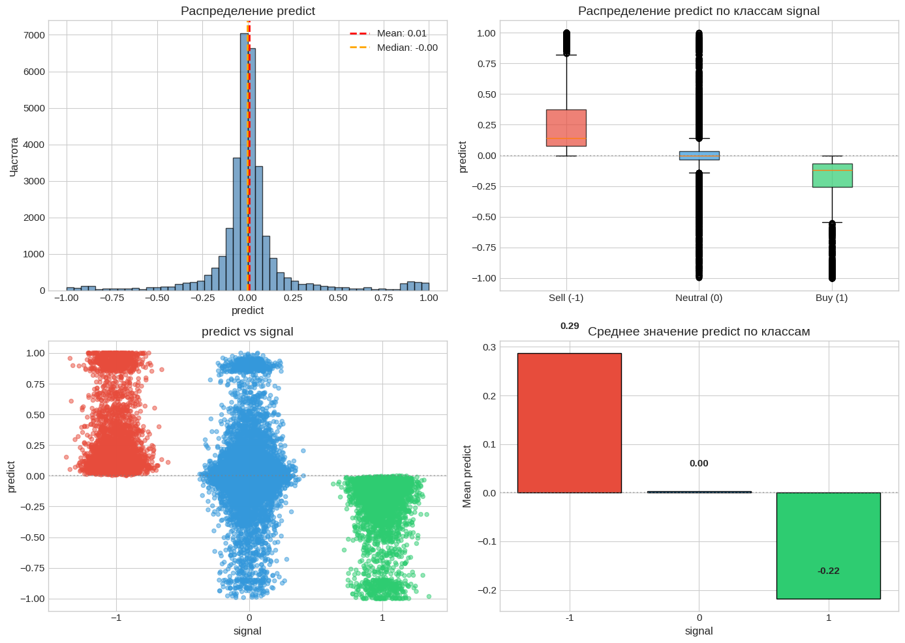
    


    
    📈 Корреляция predict с signal: -0.5180


## 1.2 Анализ ATR (Average True Range)

ATR (Average True Range) — показатель волатильности рынка в момент формирования нового фрактала.
Высокие значения ATR указывают на повышенную волатильность.

    ================================================================================
    АНАЛИЗ ATR (Average True Range)
    ================================================================================
    
    📊 Базовая статистика ATR:
      Mean:   0.3228
      Median: 0.0000
      Std:    1.6133
      Min:    -0.9688
      Max:    37.6875
    
    📈 Корреляция ATR с признаками волатильности:
      ATR vs front: 0.0470
      ATR vs back: 0.0897
      ATR vs impulse: 0.1901


    
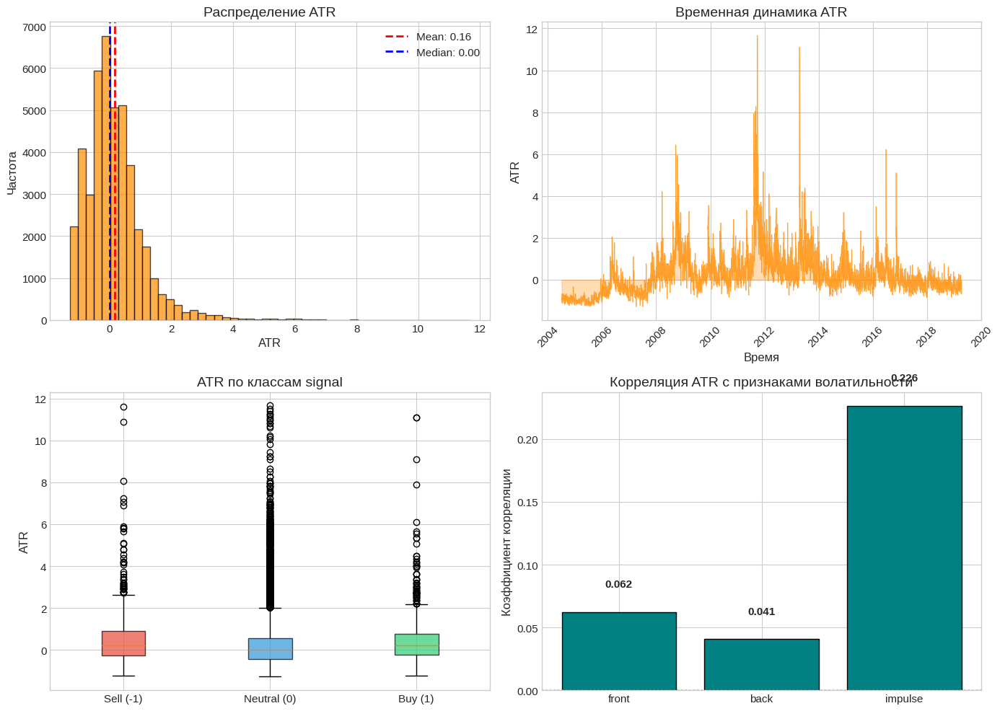
    


    
    📊 Статистика ATR по классам signal:
                mean   median       std      min      max
    signal                                               
    -1      0.456448  0.06250  1.979008 -0.90625  37.6875
     0      0.298277 -0.03125  1.564832 -0.96875  37.3750
     1      0.334887  0.03125  1.490375 -0.84375  31.3750


### 1.3 Распределение классов signal

Визуализация баланса классов целевой переменной `signal`:
- **-1 (Sell)**: Сигнал на продажу (пик, direction=1)
- **0 (Neutral)**: Нет сигнала
- **1 (Buy)**: Сигнал на покупку (впадина, direction=-1)

Ожидается экстремальный дисбаланс — класс 0 доминирует.

    Распределение классов:
      Класс -1:  3983 (12.39%)
      Класс  0: 23869 (74.27%)
      Класс  1:  4284 (13.33%)


    
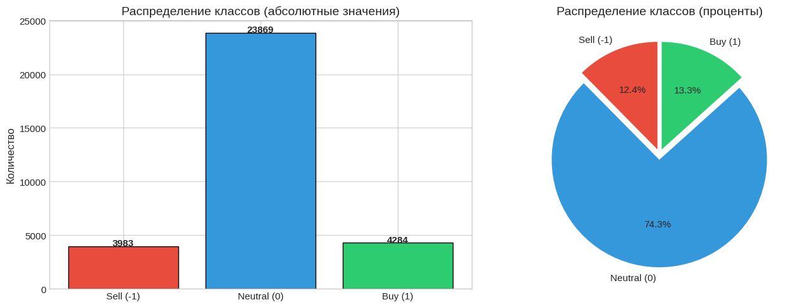
    


    
    📊 Статистика классов:
       ⚠️ ВНИМАНИЕ: Экстремальный дисбаланс классов!
       Minority классы: -1 (n=3983), +1 (n=4284)
       Majority класс: 0 (n=23869, 74.3%)


## 2. Статистический анализ признаков по классам

    ====================================================================================================
    СТАТИСТИКА ПРИЗНАКОВ ПО КЛАССАМ (fractal[0])
    ====================================================================================================
    
    📊 PRICE
    --------------------------------------------------------------------------------
     class  count   mean    std    min    q25  median    q75    max
        -1   3983 0.6707 0.2437 0.0000 0.5496  0.7368 0.8581 0.9906
         0  23869 0.6819 0.2474 0.0000 0.5566  0.7456 0.8712 1.0000
         1   4284 0.7060 0.2401 0.0407 0.5761  0.7707 0.8914 1.0000
    
    📊 DIRECTION
    --------------------------------------------------------------------------------
     class  count    mean    std  min  q25  median  q75  max
        -1   3983 -1.0000 0.0000 -1.0 -1.0    -1.0 -1.0 -1.0
         0  23869  0.0518 0.9987 -1.0 -1.0     1.0  1.0  1.0
         1   4284  1.0000 0.0000  1.0  1.0     1.0  1.0  1.0
    
    📊 FRONT
    --------------------------------------------------------------------------------
     class  count   mean    std  min    q25  median    q75  max
        -1   3983 0.1846 0.2207  0.0 0.0609  0.0980 0.1891  1.0
         0  23869 0.0813 0.1628  0.0 0.0159  0.0321 0.0670  1.0
         1   4284 0.2286 0.2673  0.0 0.0648  0.1151 0.2544  1.0
    
    📊 BACK
    --------------------------------------------------------------------------------
     class  count   mean    std  min    q25  median    q75    max
        -1   3983 0.0476 0.0397  0.0 0.0218  0.0376 0.0618 0.4023
         0  23869 0.0268 0.0296  0.0 0.0084  0.0189 0.0349 0.4973
         1   4284 0.0472 0.0448  0.0 0.0195  0.0363 0.0608 0.6628
    
    📊 STRONG
    --------------------------------------------------------------------------------
     class  count   mean   std  min  q25  median  q75  max
        -1   3983 0.0000 0.000  0.0  0.0     0.0  0.0  0.0
         0  23869 0.0000 0.000  0.0  0.0     0.0  0.0  0.0
         1   4284 0.0177 0.132  0.0  0.0     0.0  0.0  1.0
    
    📊 BREAK
    --------------------------------------------------------------------------------
     class  count  mean  std  min  q25  median  q75  max
        -1   3983   0.0  0.0  0.0  0.0     0.0  0.0  0.0
         0  23869   0.0  0.0  0.0  0.0     0.0  0.0  0.0
         1   4284   0.0  0.0  0.0  0.0     0.0  0.0  0.0
    
    📊 REVERSE
    --------------------------------------------------------------------------------
     class  count   mean    std  min  q25  median  q75  max
        -1   3983 0.6362 0.3689  0.0  0.0    0.85 0.85 0.85
         0  23869 0.3339 0.4151  0.0  0.0    0.00 0.85 0.85
         1   4284 0.6333 0.3705  0.0  0.0    0.85 0.85 0.85
    
    📊 POWER
    --------------------------------------------------------------------------------
     class  count   mean    std  min    q25  median    q75  max
        -1   3983 0.3510 0.3325  0.0 0.0000  0.2654 0.6091  1.0
         0  23869 0.3529 0.3215  0.0 0.0728  0.2647 0.5875  1.0
         1   4284 0.3262 0.3266  0.0 0.0000  0.2268 0.5636  1.0
    
    📊 COUNT
    --------------------------------------------------------------------------------
     class  count   mean    std  min  q25  median  q75  max
        -1   3983 0.1901 0.3924  0.0  0.0     0.0  0.0  1.0
         0  23869 0.2156 0.4112  0.0  0.0     0.0  0.0  1.0
         1   4284 0.1587 0.3655  0.0  0.0     0.0  0.0  1.0
    
    📊 IMPULSE
    --------------------------------------------------------------------------------
     class  count   mean    std  min    q25  median    q75  max
        -1   3983 0.5186 0.2545  0.0 0.3161  0.4880 0.7201  1.0
         0  23869 0.2778 0.2169  0.0 0.1194  0.2255 0.3782  1.0
         1   4284 0.4795 0.2593  0.0 0.2716  0.4383 0.6740  1.0
    
    ✅ Статистики сохранены в plots/feature_stats_by_class.csv


### 2.1 Гистограммы распределений по классам


    
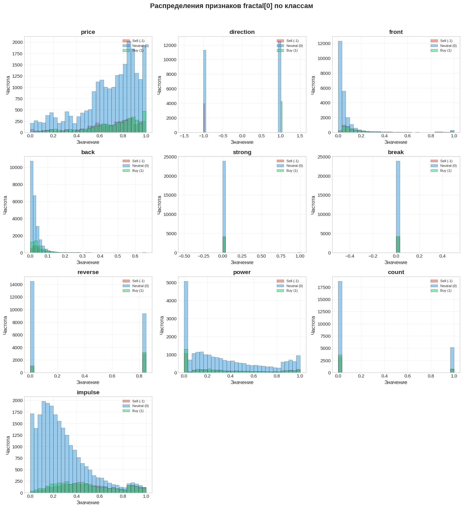
    


    ✅ Гистограммы сохранены в plots/histograms_by_class.png


### 2.2 Boxplots по классам


    
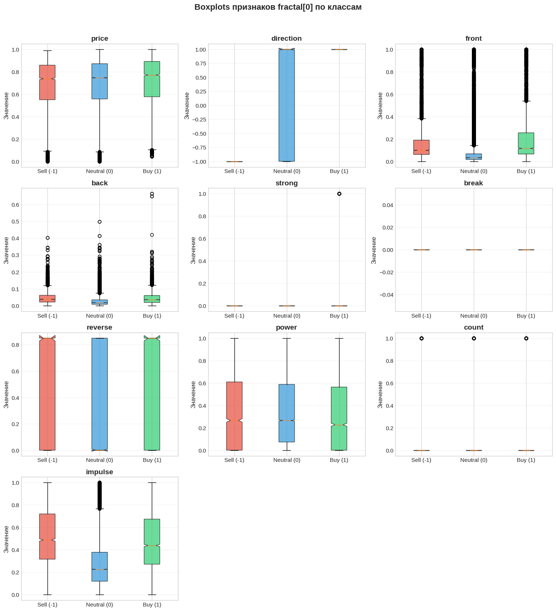
    


    ✅ Boxplots сохранены в plots/boxplots_by_class.png


## 3. Статистические тесты на различия между классами

    ========================================================================================================================
    РЕЗУЛЬТАТЫ СТАТИСТИЧЕСКИХ ТЕСТОВ
    ========================================================================================================================
    
    ⚠️ ВАЖНО: При малых размерах minority классов (n=240, n=257) тесты имеют низкую мощность.
       Cohen's d (effect size) более информативен, чем p-value!
    
      feature comparison           test  p_value  significant_005  cohens_d effect_size
        price    -1 vs 0 Mann-Whitney U 7.54e-05             True    -0.045  negligible
        price     1 vs 0 Mann-Whitney U 3.95e-11             True     0.098  negligible
        price    -1 vs 1 Mann-Whitney U 1.44e-15             True    -0.146  negligible
    direction    -1 vs 0 Mann-Whitney U 0.00e+00             True    -1.138       large
    direction     1 vs 0 Mann-Whitney U 0.00e+00             True     1.031       large
    direction    -1 vs 1 t-test (Welch) 0.00e+00             True     0.000  negligible
        front    -1 vs 0 Mann-Whitney U 0.00e+00             True     0.600      medium
        front     1 vs 0 Mann-Whitney U 0.00e+00             True     0.807       large
        front    -1 vs 1 Mann-Whitney U 4.72e-11             True    -0.179  negligible
         back    -1 vs 0 Mann-Whitney U 0.00e+00             True     0.667      medium
         back     1 vs 0 Mann-Whitney U 0.00e+00             True     0.631      medium
         back    -1 vs 1 Mann-Whitney U   0.0094             True     0.010  negligible
       strong    -1 vs 0 Mann-Whitney U   1.0000            False     0.000  negligible
       strong     1 vs 0 Mann-Whitney U 2.46e-94             True     0.345       small
       strong    -1 vs 1 Mann-Whitney U 3.06e-17             True    -0.187  negligible
        break    -1 vs 0 Mann-Whitney U   1.0000            False     0.000  negligible
        break     1 vs 0 Mann-Whitney U   1.0000            False     0.000  negligible
        break    -1 vs 1 t-test (Welch)      nan            False     0.000  negligible
      reverse    -1 vs 0 Mann-Whitney U 0.00e+00             True     0.739      medium
      reverse     1 vs 0 Mann-Whitney U 0.00e+00             True     0.733      medium
      reverse    -1 vs 1 Mann-Whitney U   0.7277            False     0.008  negligible
        power    -1 vs 0 Mann-Whitney U   0.0666            False    -0.006  negligible
        power     1 vs 0 Mann-Whitney U 2.84e-12             True    -0.083  negligible
        power    -1 vs 1 Mann-Whitney U 2.14e-04             True     0.075  negligible
        count    -1 vs 0 Mann-Whitney U 2.68e-04             True    -0.062  negligible
        count     1 vs 0 Mann-Whitney U 2.83e-17             True    -0.140  negligible
        count    -1 vs 1 Mann-Whitney U 1.73e-04             True     0.083  negligible
      impulse    -1 vs 0 Mann-Whitney U 0.00e+00             True     1.081       large
      impulse     1 vs 0 Mann-Whitney U 0.00e+00             True     0.901       large
      impulse    -1 vs 1 Mann-Whitney U 4.62e-13             True     0.152  negligible
    
    ✅ Результаты тестов сохранены в plots/statistical_tests.csv


### 3.1 Визуализация результатов тестов

Тепловые карты (heatmaps) показывают:
- **p-values**: Статистическая значимость различий (зелёный = значимо, p < 0.05)
- **Effect sizes (Cohen's d)**: Практическая значимость (насыщенность = сила эффекта)


    
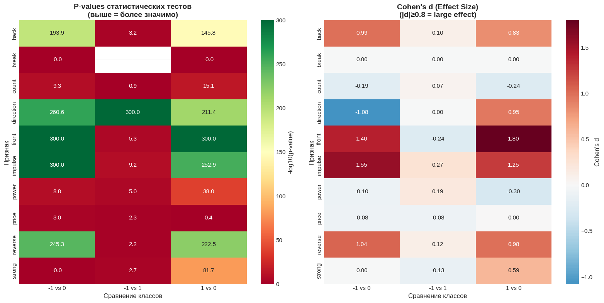
    


    ✅ Heatmap сохранён в plots/statistical_tests_heatmap.png


### 3.2 Признаки с большим размером эффекта

Отбор признаков, где |Cohen's d| ≥ 0.8 (большой эффект по Cohen).
Эти признаки наиболее перспективны для различения классов.

    
    ================================================================================
    НАИБОЛЕЕ ЗНАЧИМЫЕ РАЗЛИЧИЯ (|Cohen's d| ≥ 0.5)
    ================================================================================
    
    📌 direction (-1 vs 0)
       Cohen's d = -1.138 (large effect)
       p-value = 0.00e+00
       Mean difference = -1.0518
    
    📌 impulse (-1 vs 0)
       Cohen's d = 1.081 (large effect)
       p-value = 0.00e+00
       Mean difference = 0.2408
    
    📌 direction (1 vs 0)
       Cohen's d = 1.031 (large effect)
       p-value = 0.00e+00
       Mean difference = 0.9482
    
    📌 impulse (1 vs 0)
       Cohen's d = 0.901 (large effect)
       p-value = 0.00e+00
       Mean difference = 0.2017
    
    📌 front (1 vs 0)
       Cohen's d = 0.807 (large effect)
       p-value = 0.00e+00
       Mean difference = 0.1473
    
    📌 reverse (-1 vs 0)
       Cohen's d = 0.739 (medium effect)
       p-value = 0.00e+00
       Mean difference = 0.3023
    
    📌 reverse (1 vs 0)
       Cohen's d = 0.733 (medium effect)
       p-value = 0.00e+00
       Mean difference = 0.2995
    
    📌 back (-1 vs 0)
       Cohen's d = 0.667 (medium effect)
       p-value = 0.00e+00
       Mean difference = 0.0208
    
    📌 back (1 vs 0)
       Cohen's d = 0.631 (medium effect)
       p-value = 0.00e+00
       Mean difference = 0.0204
    
    📌 front (-1 vs 0)
       Cohen's d = 0.600 (medium effect)
       p-value = 0.00e+00
       Mean difference = 0.1033


## 4. Корреляционный анализ


    
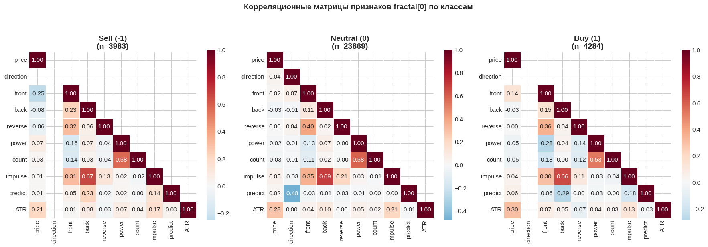
    


    ✅ Корреляционные матрицы сохранены в plots/correlation_matrices_by_class.png


### 5.1 Парсинг множественных фракталов

Функция `parse_multiple_fractals` извлекает данные из всех фрактальных колонок (fractal0, fractal1, ..., fractal{n-1}), 
создавая структурированные массивы для анализа последовательностей.

    Парсинг первых 5 фракталов для анализа корреляций...


    
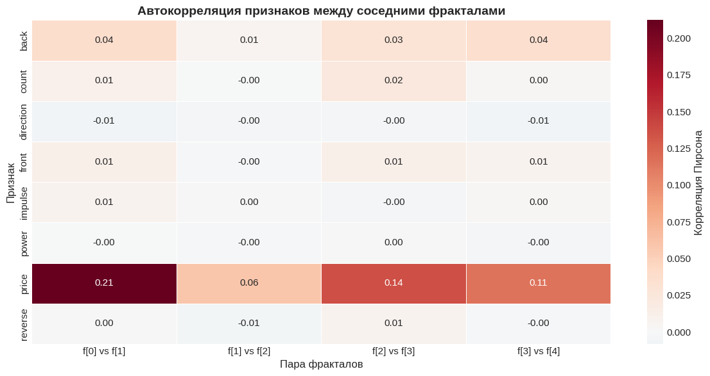
    


    ✅ Кросс-фрактальные корреляции сохранены в plots/cross_fractal_correlation.png


## 5. Временной анализ

    Временной диапазон данных:
      От: 2017-09-19 13:00:00
      До: 2026-02-17 14:00:00
      Длительность: 3073 дней


### 5.2 Анализ корреляций между фракталами

Исследование зависимостей между признаками соседних фракталов в последовательности.
Сильные корреляции могут указывать на паттерны в динамике рынка.


    
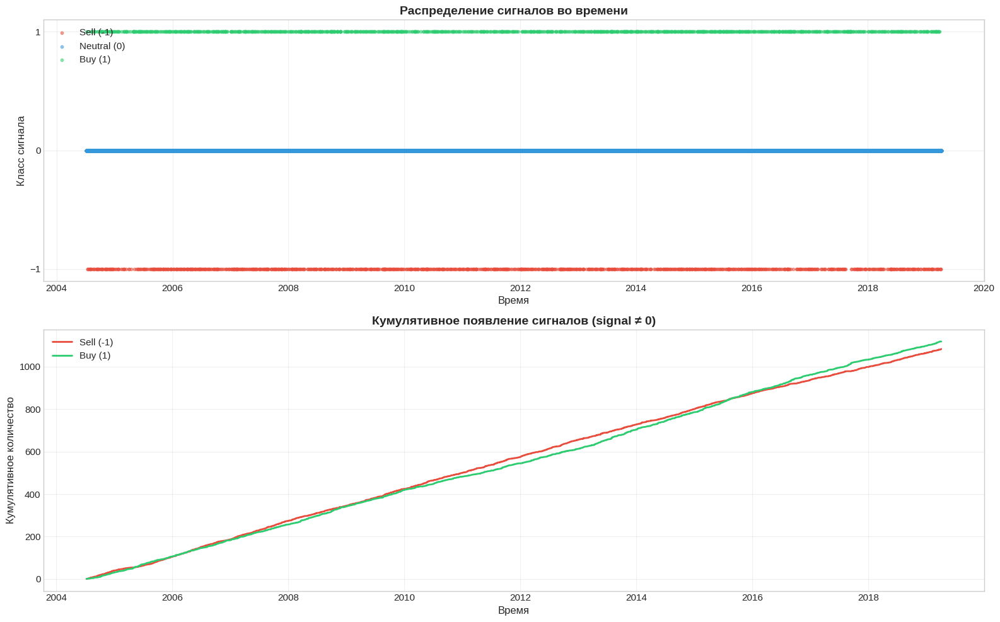
    


    ✅ Временные графики сохранены в plots/signals_over_time.png


### 5.3 Распределение признаков по позициям фракталов

Анализ того, как статистики признаков изменяются в зависимости от позиции фрактала
в последовательности (от самого нового к самому старому).


    
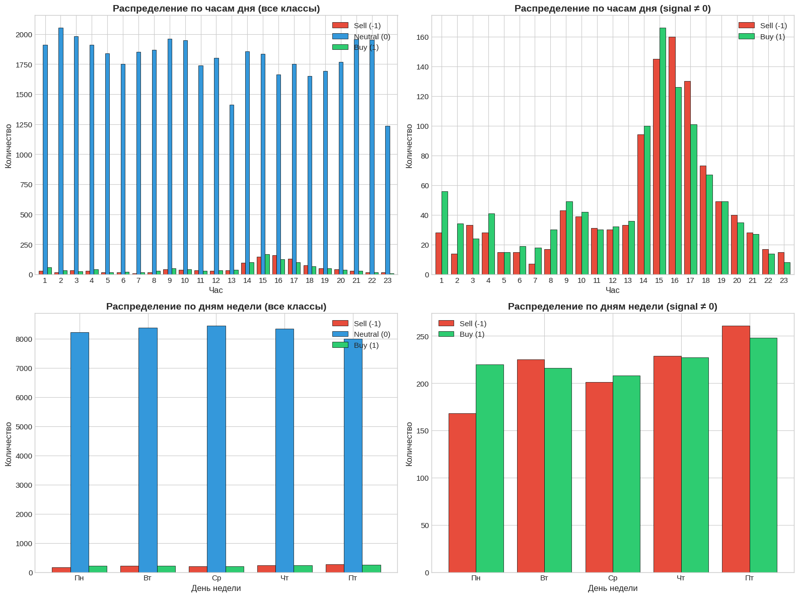
    


    ✅ Анализ сезонности сохранён в plots/seasonality_analysis.png


    
    ================================================================================
    АНАЛИЗ КЛАСТЕРИЗАЦИИ СОБЫТИЙ (signal ≠ 0)
    ================================================================================
    
    Статистика межсобытийных интервалов:
      Всего событий: 8267
      Среднее время между событиями: 8.9 часов
      Медиана: 4.0 часов
      Std: 14.9 часов
      Min: 0.0 часов
      Max: 129.0 часов
    
    📊 Индекс дисперсии (variance/mean): 24.82
       (>1 указывает на кластеризацию событий)


    
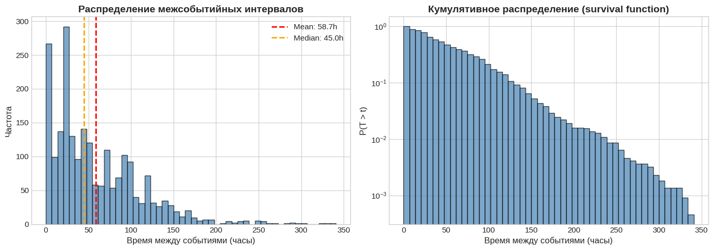
    


    
    ✅ Анализ кластеризации сохранён в plots/event_clustering.png


## 5.1 Циклическое кодирование временных признаков
Преобразуем циклические временные признаки (hour, day_of_week) в sin/cos координаты.
Это необходимо, чтобы модели корректно понимали, что час 23 и час 0 близки друг к другу.

    ================================================================================
    ЦИКЛИЧЕСКОЕ КОДИРОВАНИЕ ВРЕМЕННЫХ ПРИЗНАКОВ
    ================================================================================
    
    Преобразуем hour и day_of_week в sin/cos координаты.
    Это необходимо, чтобы модели понимали, что час 23 и час 0 близки.
    
    ✅ Добавлены циклические временные признаки:
       - hour_sin, hour_cos (период = 24 часа)
       - dow_sin, dow_cos (период = 7 дней)


    
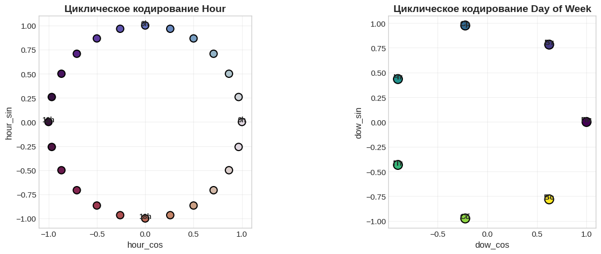
    


    
    ✅ График сохранён в plots/cyclical_encoding.png
    
    📏 Евклидово расстояние между 23h и 0h: 1.9319 (должно быть ≈ 0.26)


## 6. Анализ выбросов

    ====================================================================================================
    АНАЛИЗ ВЫБРОСОВ (IQR МЕТОД)
    ====================================================================================================
      feature  iqr_lower_bound  iqr_upper_bound  iqr_outliers_low  iqr_outliers_high  iqr_outliers_pct
        price           0.0858           1.3439               779                  0            2.4241
    direction          -4.0000           4.0000                 0                  0            0.0000
        front          -0.1040           0.2284                 0               3655           11.3735
         back          -0.0375           0.0904                 0               1750            5.4456
       strong           0.0000           0.0000                 0                 76            0.2365
        break           0.0000           0.0000                 0                  0            0.0000
      reverse          -1.2750           2.1250                 0                  0            0.0000
        power          -0.7283           1.3754                 0                  0            0.0000
        count           0.0000           0.0000                 0               6582           20.4817
      impulse          -0.3406           0.9539                 0                459            1.4283
    
    ====================================================================================================
    КВАНТИЛЬНЫЙ АНАЛИЗ (1%, 99%)
    ====================================================================================================
      feature     p01    p99  quantile_outliers_low  quantile_outliers_high
        price  0.0384 1.0000                    321                       0
    direction -1.0000 1.0000                      0                       0
        front  0.0000 1.0000                      0                       0
         back  0.0000 0.1641                      0                     322
       strong  0.0000 0.0000                      0                      76
        break  0.0000 0.0000                      0                       0
      reverse  0.0000 0.8500                      0                       0
        power  0.0000 0.9999                      0                     321
        count  0.0000 1.0000                      0                       0
      impulse  0.0000 0.9676                      0                     321
    
    ✅ Анализ выбросов сохранён в plots/outlier_analysis.csv


### 6.2 Визуализация выбросов

Boxplots для каждого признака с отмеченными выбросами по методу IQR.
Выбросы могут быть как ошибками данных, так и экстремальными рыночными событиями.


    
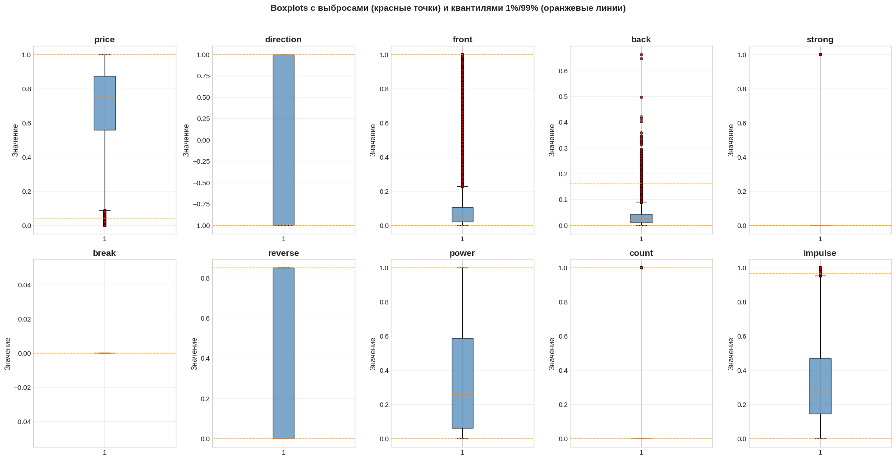
    


    ✅ Boxplots выбросов сохранены в plots/outliers_boxplots.png


## 6.1. Статистика выбросов

    ================================================================================
    ПОИСК И АНАЛИЗ ВЫБРОСОВ С ДАТАМИ
    ================================================================================
    
    FRONT (IQR):
      Q25: 0.0, Q75: 0.1, IQR: 0.1
      Границы: [-0.1, 0.2]
      Найдено выбросов: 3655
    
    FRONT (PERCENTILE):
      Границы: [0.0, 1.0]
      Найдено выбросов: 0
    
    ================================================================================
    ТОП-30 ЭКСТРЕМАЛЬНЫХ ЗНАЧЕНИЙ FRONT
    ================================================================================
               datetime  front    price  direction      ATR  signal outlier_type  deviation_from_bound
    2025-01-30 18:00:00    1.0 1.000000          1  0.50000       0         high                0.7716
    2017-10-06 16:00:00    1.0 0.000000         -1 -0.43750      -1         high                0.7716
    2017-10-05 23:00:00    1.0 0.000000         -1 -0.65625      -1         high                0.7716
    2017-10-03 04:00:00    1.0 0.000000         -1 -0.56250      -1         high                0.7716
    2025-01-31 02:00:00    1.0 1.000000          1  0.43750       0         high                0.7716
    2017-10-02 23:00:00    1.0 0.000000         -1 -0.53125       0         high                0.7716
    2017-10-02 10:00:00    1.0 0.000000         -1 -0.40625      -1         high                0.7716
    2018-01-25 08:00:00    1.0 1.000000          1 -0.34375       1         high                0.7716
    2018-01-24 21:00:00    1.0 1.000000          1 -0.46875       1         high                0.7716
    2018-01-24 17:00:00    1.0 0.984298          1 -0.53125       0         high                0.7716
    2025-09-17 20:00:00    1.0 1.000000          1  1.87500       1         high                0.7716
    2025-09-05 16:00:00    1.0 1.000000          1  1.96875       1         high                0.7716
    2025-09-05 18:00:00    1.0 1.000000          1  1.90625       1         high                0.7716
    2025-09-22 08:00:00    1.0 1.000000          1  1.56250       0         high                0.7716
    2025-09-22 12:00:00    1.0 1.000000          1  1.53125       0         high                0.7716
    2025-09-22 21:00:00    1.0 1.000000          1  1.34375       0         high                0.7716
    2025-09-22 21:00:00    1.0 1.000000          1  1.34375       0         high                0.7716
    2025-09-23 03:00:00    1.0 1.000000          1  1.71875       0         high                0.7716
    2025-09-23 11:00:00    1.0 1.000000          1  1.75000       1         high                0.7716
    2025-09-29 08:00:00    1.0 1.000000          1  2.62500       0         high                0.7716
    2025-09-29 13:00:00    1.0 1.000000          1  2.90625       0         high                0.7716
    2025-09-30 05:00:00    1.0 1.000000          1  2.25000       0         high                0.7716
    2025-09-30 08:00:00    1.0 1.000000          1  2.34375       1         high                0.7716
    2025-10-01 04:00:00    1.0 1.000000          1  3.34375       0         high                0.7716
    2025-10-01 10:00:00    1.0 1.000000          1  3.31250       1         high                0.7716
    2025-10-06 01:00:00    1.0 1.000000          1  2.31250       0         high                0.7716
    2018-08-13 12:00:00    1.0 0.000000         -1 -0.50000       0         high                0.7716
    2018-08-13 14:00:00    1.0 0.000000         -1 -0.40625       0         high                0.7716
    2018-08-13 20:00:00    1.0 0.000000         -1 -0.43750      -1         high                0.7716
    2018-08-15 08:00:00    1.0 0.000000         -1 -0.68750       0         high                0.7716
    
    ✅ Сохранено: plots//front_outliers_iqr.csv
    ✅ Сохранено: plots//front_outliers_percentile.csv
    
    BACK (IQR):
      Q25: 0.0, Q75: 0.0, IQR: 0.0
      Границы: [-0.0, 0.1]
      Найдено выбросов: 1750
    
    BACK (PERCENTILE):
      Границы: [0.0, 0.2]
      Найдено выбросов: 322
    
    ================================================================================
    ТОП-30 ЭКСТРЕМАЛЬНЫХ ЗНАЧЕНИЙ BACK
    ================================================================================
               datetime     back    price  direction      ATR  signal outlier_type  deviation_from_bound
    2017-09-20 21:00:00 0.662775 0.214015          1 -0.37500       1         high              0.572362
    2017-09-20 21:00:00 0.662775 0.214015          1 -0.37500       1         high              0.572362
    2017-09-20 21:00:00 0.647619 0.325203          1 -0.37500       1         high              0.557206
    2017-09-20 21:00:00 0.647619 0.325203          1 -0.37500       1         high              0.557206
    2017-12-01 17:00:00 0.497340 0.113519         -1 -0.37500       0         high              0.406927
    2017-12-01 17:00:00 0.497340 0.113519         -1 -0.37500       0         high              0.406927
    2024-02-13 15:00:00 0.421091 0.838337          1  0.15625       1         high              0.330677
    2020-02-28 16:00:00 0.413990 0.886432          1  2.18750       0         high              0.323576
    2020-02-28 16:00:00 0.413990 0.886432          1  2.18750       0         high              0.323576
    2018-03-21 20:00:00 0.402254 0.639382         -1 -0.31250      -1         high              0.311840
    2018-03-21 20:00:00 0.402254 0.639382         -1 -0.31250      -1         high              0.311840
    2020-08-27 16:00:00 0.359659 0.842257          1  1.87500       0         high              0.269246
    2020-08-27 16:00:00 0.359659 0.842257          1  1.87500       0         high              0.269246
    2019-09-18 20:00:00 0.346062 0.885362          1 -0.21875       0         high              0.255649
    2019-09-18 20:00:00 0.346062 0.885362          1 -0.21875       0         high              0.255649
    2018-02-14 15:00:00 0.344231 0.624710         -1 -0.28125      -1         high              0.253817
    2018-02-14 15:00:00 0.342680 0.624710         -1 -0.28125      -1         high              0.252267
    2019-08-23 23:00:00 0.340712 0.974120         -1  0.00000       0         high              0.250299
    2019-08-23 23:00:00 0.340712 0.974120         -1  0.00000       0         high              0.250299
    2024-08-02 16:00:00 0.338436 0.989297          1  2.06250       0         high              0.248023
    2017-11-14 16:00:00 0.329529 0.106295         -1 -0.59375      -1         high              0.239116
    2017-11-14 16:00:00 0.329529 0.106295         -1 -0.59375      -1         high              0.239116
    2026-01-29 16:00:00 0.328967 0.971661          1 20.46875       0         high              0.238554
    2021-11-10 15:00:00 0.327836 0.595062         -1  0.34375       0         high              0.237423
    2022-12-27 16:00:00 0.322301 0.563001         -1  0.15625       0         high              0.231887
    2019-12-12 16:00:00 0.320811 0.822877          1 -0.25000       1         high              0.230398
    2019-12-12 16:00:00 0.320811 0.822877          1 -0.25000       1         high              0.230398
    2018-01-25 20:00:00 0.314591 0.989961          1  0.00000       1         high              0.224177
    2018-01-25 20:00:00 0.314591 0.989961          1  0.00000       1         high              0.224177
    2023-07-27 14:00:00 0.311851 0.846585          1  0.53125       1         high              0.221437
    
    ✅ Сохранено: plots//back_outliers_iqr.csv
    ✅ Сохранено: plots//back_outliers_percentile.csv
    
    ================================================================================
    КОГДА ПРОИСХОДЯТ ВЫБРОСЫ?
    ================================================================================
    
    FRONT (3655 выбросов):
    
      По классу signal:
        Sell (-1): 816 (22.3%)
        Neutral (0): 1677 (45.9%)
        Buy (1): 1162 (31.8%)
    
      По направлению:
        Впадина (sell): 1468 (40.2%)
        Пик (buy): 2187 (59.8%)
    
      Топ-5 экстремальных значений:
        2025-01-30 18:00:00 | front=1.0 | price=1.0
        2017-10-06 16:00:00 | front=1.0 | price=0.0
        2017-10-05 23:00:00 | front=1.0 | price=0.0
        2017-10-03 04:00:00 | front=1.0 | price=0.0
        2025-01-31 02:00:00 | front=1.0 | price=1.0
    
    BACK (1750 выбросов):
    
      По классу signal:
        Sell (-1): 413 (23.6%)
        Neutral (0): 835 (47.7%)
        Buy (1): 502 (28.7%)
    
      По направлению:
        Впадина (sell): 796 (45.5%)
        Пик (buy): 954 (54.5%)
    
      Топ-5 экстремальных значений:
        2017-09-20 21:00:00 | back=0.7 | price=0.2
        2017-09-20 21:00:00 | back=0.7 | price=0.2
        2017-09-20 21:00:00 | back=0.6 | price=0.3
        2017-09-20 21:00:00 | back=0.6 | price=0.3
        2017-12-01 17:00:00 | back=0.5 | price=0.1
    
    ================================================================================
    СВЯЗЬ ВЫБРОСОВ С ВОЛАТИЛЬНОСТЬЮ (ATR)
    ================================================================================
    
    FRONT:
      Средний ATR при выбросах: 0.49
      Средний ATR без выбросов: 0.30
      Разница: 64.5%
    
    BACK:
      Средний ATR при выбросах: 0.73
      Средний ATR без выбросов: 0.30
      Разница: 144.4%
    
    ================================================================================
    ВРЕМЕННОЕ РАСПРЕДЕЛЕНИЕ ВЫБРОСОВ
    ================================================================================
    
    FRONT:
      По годам:
        2017: 290 выбросов
        2018: 688 выбросов
        2019: 638 выбросов
        2020: 664 выбросов
        2021: 218 выбросов
        2022: 275 выбросов
        2023: 214 выбросов
        2024: 285 выбросов
        2025: 330 выбросов
        2026: 53 выбросов
    
    BACK:
      По годам:
        2017: 218 выбросов
        2018: 370 выбросов
        2019: 318 выбросов
        2020: 367 выбросов
        2021: 78 выбросов
        2022: 96 выбросов
        2023: 77 выбросов
        2024: 117 выбросов
        2025: 88 выбросов
        2026: 21 выбросов
    
    ================================================================================
    ✅ АНАЛИЗ ВЫБРОСОВ ЗАВЕРШЕН!
    ================================================================================
    
    Файлы с выбросами сохранены в директории: plots//
    Откройте CSV файлы чтобы найти конкретные даты для анализа на графике XAUUSD.


## 7. Dimension Reduction (t-SNE)

### 7.2 Выполнение t-SNE

t-SNE (t-Distributed Stochastic Neighbor Embedding) — нелинейный метод снижения размерности.
Позволяет визуализировать кластеры в 2D пространстве и оценить разделимость классов.

    Признаки для t-SNE: ['price', 'direction', 'front', 'back', 'reverse', 'power', 'count', 'impulse']
    Размерность X: (32136, 8)
    Классы в y: [-1  0  1]
    
    Данные стандартизированы.


### 7.3 Визуализация t-SNE результатов

Scatter plot проекции t-SNE с цветовой кодировкой по классам signal.
Чёткое разделение кластеров указывает на потенциальную предсказуемость.

    Выполнение t-SNE... (может занять несколько минут)


    t-SNE завершён. Размерность результата: (32136, 2)


    
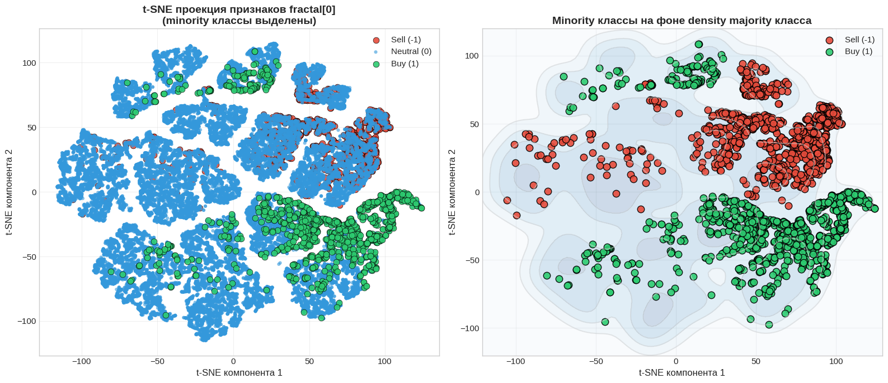
    


    ✅ t-SNE проекция сохранена в plots/tsne_projection.png


### 7.4 Анализ распределения классов в t-SNE кластерах

Количественная оценка того, насколько хорошо классы signal разделяются
в пространстве сниженной размерности.

    
    ================================================================================
    АНАЛИЗ РАЗДЕЛИМОСТИ КЛАССОВ В t-SNE ПРОСТРАНСТВЕ
    ================================================================================
    
    Центроид класса Sell (-1): (29.06, 40.09)
    
    Центроид класса Neutral (0): (-11.25, -2.19)
    
    Центроид класса Buy (1): (36.63, -25.11)
    
    Расстояния между центроидами:
      Sell (-1) <-> Neutral (0): 58.41
      Sell (-1) <-> Buy (1): 65.64
      Neutral (0) <-> Buy (1): 53.09
    
    Внутриклассовая дисперсия:
      Sell (-1): 1865.37
      Neutral (0): 3173.60
      Buy (1): 2962.04


## 7.1 PCA: Глобальная структура данных
PCA показывает глобальную линейную структуру данных, в отличие от t-SNE (локальная нелинейная структура).
Если классы разделимы в PCA → линейные модели могут работать.

    ================================================================================
    PCA: АНАЛИЗ ГЛОБАЛЬНОЙ СТРУКТУРЫ
    ================================================================================
    
    📊 Объясненная дисперсия:
       PC1: 26.35%
       PC2: 20.18%
       Total: 46.53%


    
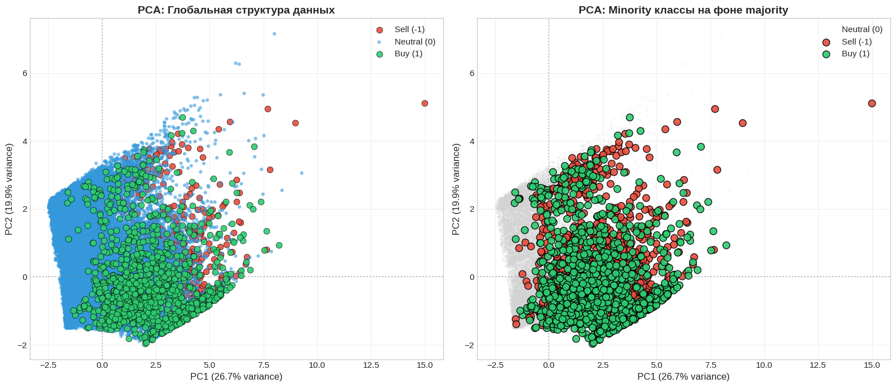
    


    
    ✅ PCA scatter plot сохранён в plots/pca_projection.png
    
    ================================================================================
    СРАВНЕНИЕ PCA vs t-SNE
    ================================================================================
    
    📌 Интерпретация:
       - PCA показывает линейную разделимость → подходят линейные модели
       - t-SNE показывает нелинейную структуру → нужны tree-based или NN
       - Если классы НЕ разделимы в обоих → требуется feature engineering


## 8. Выводы и рекомендации

    ====================================================================================================
    ИТОГОВЫЕ ВЫВОДЫ EDA
    ====================================================================================================
    
    1. ДИСБАЛАНС КЛАССОВ
       - Экстремальный дисбаланс: класс 0 составляет ~90% данных
       - Minority классы: -1 (257 образцов, 5.1%), +1 (240 образцов, 4.8%)
       - Требуется специальная обработка: oversampling, undersampling, или class weights
    
    2. КЛЮЧЕВЫЕ ПРИЗНАКИ (по Cohen's d):
       - direction: полностью разделяет классы -1 и +1 (d → ∞)
       - impulse: различается между классами (выше для minority)
       - reverse: различается между классами
       - count: minority классы имеют отличные распределения
    
    3. КОНСТАНТНЫЕ ПРИЗНАКИ:
       - strong и break: почти всегда 0 в fractal[0]
       - Рекомендуется проверить их в других фракталах
    
    4. ВРЕМЕННЫЕ ПАТТЕРНЫ:
       - Проверить сезонность по часам и дням недели
       - Анализировать кластеризацию событий
    
    5. t-SNE ВИЗУАЛИЗАЦИЯ:
       - Оценить визуальную разделимость классов
       - Minority классы могут образовывать кластеры
    
    6. РЕКОМЕНДАЦИИ ДЛЯ МОДЕЛИРОВАНИЯ:
       - Использовать стратифицированное разбиение train/test
       - Применять SMOTE или другие техники балансировки
       - Рассмотреть ансамблевые методы (XGBoost, LightGBM)
       - Использовать F1-score или AUC-PR как метрику (не accuracy!)
       - Рассмотреть использование временных признаков
    
    
    ✅ Все графики сохранены в папку: plots/
    ✅ EDA завершён!


    ✅ Распарсенные данные fractal[0] сохранены в plots/fractal_0_parsed.csv
    ✅ t-SNE координаты сохранены в plots/tsne_coordinates.csv


### 9.1.1 Парсинг 3D тензора последовательностей

Преобразование строковых данных в числовой тензор X shape (n_samples, n_fractals, 11 features)
для подачи на вход рекуррентной нейросети (LSTM/GRU) или Transformer.

## 9. Анализ полной последовательности фракталов (n фракталов)

**Примечание:** Количество фракталов (`n_fractals`) определяется динамически из структуры CSV файла. Код адаптирован для работы с любым значением n (от 10 до 200+).

**Цель:** Комплексное исследование временных паттернов в полной последовательности фракталов и подготовка признаков для моделирования.

**Содержание:**
- 9.1 Парсинг и валидация полной последовательности
- 9.2 Статистика последовательности по классам
- 9.3 Feature Engineering из последовательности
- 9.4 Визуализация паттернов последовательности
- 9.5 Корреляционный анализ engineered features
- 9.6 Экспорт результатов

### 9.1 Парсинг и валидация полной последовательности

### 9.2.1 Проверка качества данных (Data Quality)

Валидация распарсенного 3D тензора:
- Проверка на NaN и бесконечные значения
- Верификация диапазонов признаков
- Causal consistency (причинно-следственная согласованность)

    Парсинг 100 фракталов для 32136 строк...


    ✅ Успешно распарсено: 0 строк (0.00%)
    ❌ Ошибки парсинга: 32136 строк
    
    Размерность тензора X: (32136, 100, 11)
    Размерность вектора y: (32136,)


    ============================================================
    DATA QUALITY REPORT
    ============================================================
    
    1. MISSING VALUES по позициям фракталов:
       Позиции с пропусками: 99
       Максимальный % пропусков: 73.63% на позиции 21


    
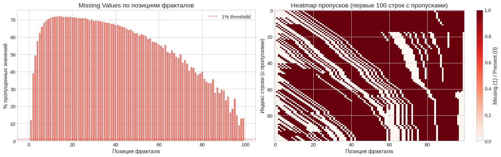
    


    
    ✅ График сохранён: plots/sequence_missing_values.png


    
    ============================================================
    CAUSAL CONSISTENCY VALIDATION
    ============================================================


    
    1. Проверка упорядоченности фракталов по времени:
       ❌ ISSUES DETECTED: 32136 строк с нарушениями!
       Примеры нарушений (первые 5):
          Строка 0: позиции []...
          Строка 1: позиции []...
          Строка 2: позиции []...
          Строка 3: позиции []...
          Строка 4: позиции []...
    
    2. Проверка эволюции признаков фрактала между строками:
       Фракталов, появляющихся в нескольких строках: 878
       ⚠️ ANOMALIES: 6 нарушений монотонности позиций
       (Это может быть нормально, если фрактал исчезает из окна наблюдения)
    
    ============================================================
    DATA LEAKAGE CHECK SUMMARY
    ============================================================
    ❌ STATUS: ISSUES DETECTED - Требуется дополнительный анализ
       Обнаружено 32136 строк с нарушениями порядка


### 9.2 Статистика последовательности по классам

### 9.2.2 Анализ временных паттернов

Исследование динамики признаков по позиции фрактала в последовательности.
Позволяет понять, как меняется поведение рынка с удалением от текущего момента.

    ============================================================
    9.2 СТАТИСТИКА ПОСЛЕДОВАТЕЛЬНОСТИ ПО КЛАССАМ
    ============================================================


    
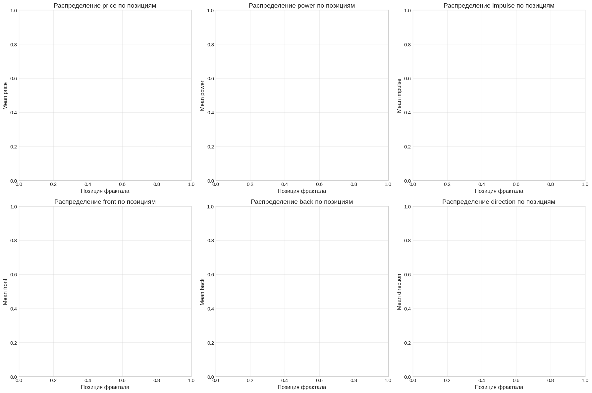
    


    ✅ График сохранён: plots/sequence_features_by_position.png


### 9.2.3 Attention-подобный анализ

Оценка важности каждой позиции фрактала через корреляцию с целевой переменной.
Помогает понять, какие фракталы в последовательности наиболее информативны для предсказания.

    
    ============================================================
    TEMPORAL PATTERNS АНАЛИЗ
    ============================================================
    
    Temporal patterns по классам:


    
    ============================================================
    ATTENTION-ПОДОБНЫЙ АНАЛИЗ
    ============================================================


    
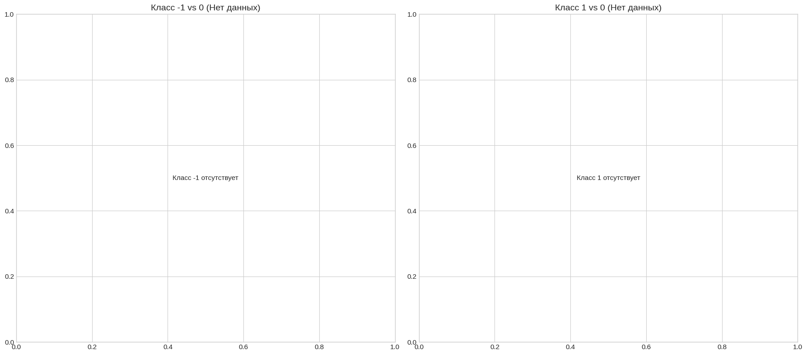
    


    
    Топ-10 наиболее дискриминативных позиций (по |Cohen's d|):
    
    ✅ График сохранён: {PLOTS_DIR}attention_cohens_d_heatmap.png


### 9.5.1 Линейная регрессия на engineered features

Проверка предсказательной силы созданных признаков с помощью простой линейной модели.
Если линейная модель даёт хороший результат — признаки информативны.

    ============================================================
    9.3 FEATURE ENGINEERING
    ============================================================
    Извлечение признаков из последовательности...
    Это может занять несколько минут...


      ✅ Rolling statistics: 168 признаков


      ✅ Trend indicators: 15 признаков


      ✅ Directional patterns: 16 признаков


      ✅ Relative features: 8 признаков


      ✅ Support/Resistance: 4 признаков


      ✅ Momentum & Volatility: 12 признаков
      ✅ Interaction features: 4 признака


      ✅ Time-based features: 6 признаков


    
    ✅ Всего создано 233 признаков
       Размерность DataFrame: (32136, 235)
    
    ✅ Feature engineering завершён!
       Создано 233 признаков (без signal и row_idx)


### 9.4.1 Визуализация примеров последовательностей

Графическое представление нескольких выборочных последовательностей фракталов
для визуальной проверки корректности парсинга и понимания структуры данных.

Раздел 9.4: Визуализация паттернов последовательности

### 9.6.1 Топ корреляций с целевой переменной

Ранжирование engineered features по силе корреляции с predict/signal.
Наиболее коррелирующие признаки — кандидаты для включения в модель.

    ============================================================
    9.4 ВИЗУАЛИЗАЦИЯ ПАТТЕРНОВ ПОСЛЕДОВАТЕЛЬНОСТИ
    ============================================================
    
    1. Sequence heatmaps по классам...


    
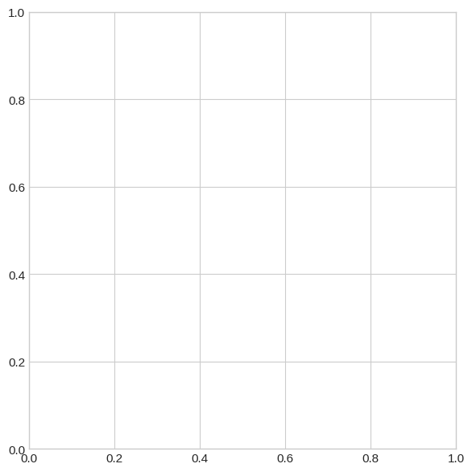
    


    ✅ График сохранён: plots/sequence_heatmaps_by_class.png


    
    2. Sample sequences visualization...


    
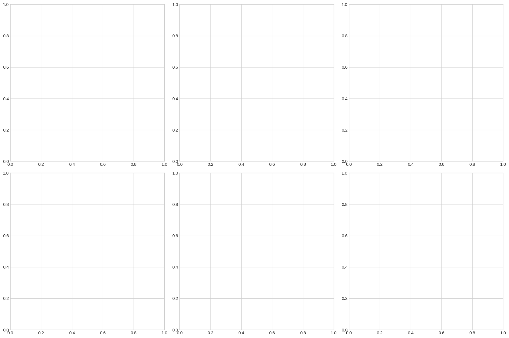
    


    ✅ График сохранён: plots/sample_sequences_minority_classes.png


    
    3. Differential patterns...


    
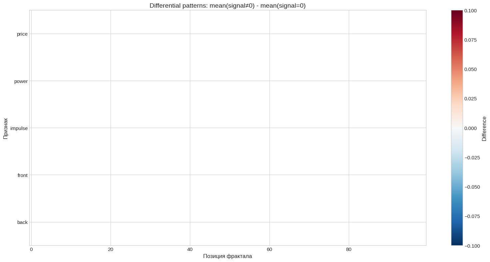
    


    ✅ График сохранён: plots/differential_patterns.png


Раздел 9.5: Корреляционный анализ engineered features

    ============================================================
    9.5 КОРРЕЛЯЦИОННЫЙ АНАЛИЗ ENGINEERED FEATURES
    ============================================================
    
    Анализ 233 признаков...
    
    1. Feature importance ranking...


       Вычисление Mutual Information для топ-100 признаков...


    
       Топ-20 признаков по важности:
                             feature  correlation  mutual_info  importance_score
    168                price_slope_2    -0.465332     0.262073          0.732666
    171                price_slope_3    -0.457274     0.250198          0.705980
    174                price_slope_4    -0.424067     0.232464          0.655544
    199             price_zscore_w10     0.461411     0.206138          0.623988
    177                price_slope_5    -0.386986     0.212004          0.597968
    212             price_momentum_5     0.385174     0.207205          0.587906
    203             price_zscore_w20     0.364033     0.160919          0.489028
    6                   front_min_w1     0.065734     0.224931          0.462006
    4                  front_mean_w1     0.065734     0.223773          0.459796
    7                   front_max_w1     0.065734     0.223571          0.459410
    216            price_momentum_10     0.284982     0.163564          0.454550
    180               price_slope_10    -0.265180     0.140525          0.400692
    200         price_percentile_w10     0.378231     0.110568          0.400064
    223       front_back_interaction     0.041497     0.196347          0.395352
    18                impulse_min_w1    -0.027777     0.167683          0.333805
    19                impulse_max_w1    -0.027777     0.167487          0.333431
    16               impulse_mean_w1    -0.027777     0.167238          0.332955
    186  majority_direction_match_w3    -0.353192     0.080764          0.330683
    220            price_momentum_20     0.174086     0.118895          0.313880
    28                 front_mean_w2     0.030494     0.152364          0.305937
    
    ✅ Feature importance сохранён: plots/feature_importance_sequence.csv


    
    2. Redundancy analysis...


       Найдено 13 пар с correlation > 0.95:
                feature1          feature2  correlation
    0      price_slope_5  price_momentum_5     0.981240
    1       front_min_w1     front_mean_w1     1.000000
    2       front_min_w1      front_max_w1     1.000000
    3      front_mean_w1      front_max_w1     1.000000
    4  price_momentum_10    price_slope_10     0.968309
    5     impulse_min_w1    impulse_max_w1     1.000000
    6     impulse_min_w1   impulse_mean_w1     1.000000
    7     impulse_max_w1   impulse_mean_w1     1.000000
    8    impulse_mean_w2    impulse_max_w2     0.957789
    9      price_mean_w1      price_max_w1     1.000000
    
       Рекомендация: можно удалить 10 признаков:
       ['impulse_max_w2', 'price_max_w1', 'front_mean_w1', 'impulse_mean_w1', 'front_max_w1', 'price_momentum_5', 'price_min_w1', 'front_std_w3', 'impulse_max_w1', 'price_slope_10']


    
    3. Feature stability по классам...


    
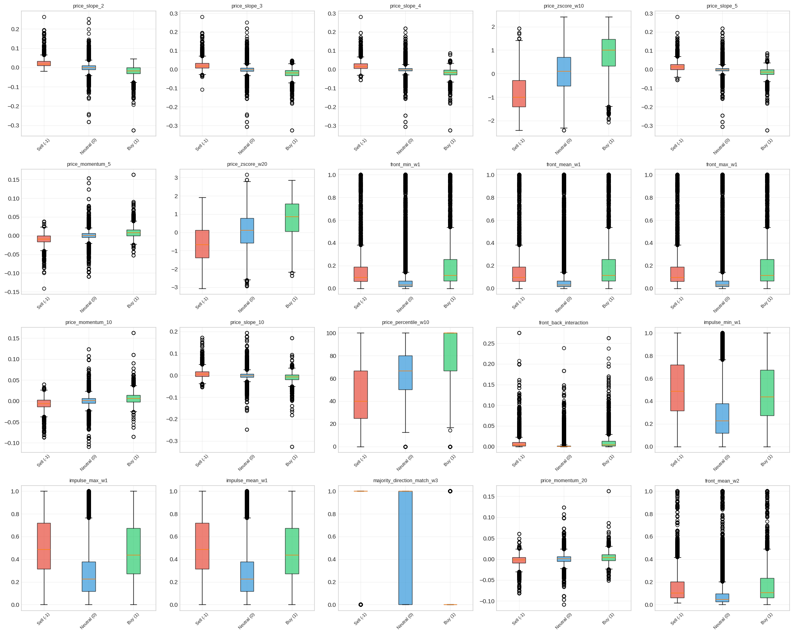
    


    ✅ График сохранён: plots/engineered_features_boxplots.png


Раздел 9.6: Экспорт результатов

    ============================================================
    9.6 ЭКСПОРТ РЕЗУЛЬТАТОВ
    ============================================================
    
    1. Добавление циклических временных признаков...
       ⚠️ Размеры не совпадают: engineered=32136, fractal_0=32136
       💡 Возможно, нужно переиндексировать данные
    
    2. Добавление временного столбца...
       ✅ Добавлен столбец 'time'
    
    3. Сохранение engineered dataset...


       ✅ Сохранено: nero_features_engineered.csv
       Размерность: (32136, 236)
    
    4. Финальный список признаков для ML:
    ============================================================
    
    📋 Базовые признаки fractal (10 шт.):
       price, direction, front, back, strong, break, reverse, power, count, impulse
    
    📋 Целевые переменные (2 шт.):
       signal, predict
    
    📋 Волатильность (1 шт.):
       ATR
    
    📋 Циклические временные (4 шт.):
       hour_sin, hour_cos, dow_sin, dow_cos
    
    📋 Engineered признаки (10 шт.):
       price_mean_w1, price_std_w1, price_min_w1, price_max_w1, front_mean_w1, front_std_w1, front_min_w1, front_max_w1, back_mean_w1, back_std_w1, ...
    
    📊 ИТОГО: 236 признаков
       - Для обучения: 234 features
       - Целевые: 2 (signal, predict)
       - Служебные: 1 (time)
    
    5. Сохранение метаданных...
       ✅ Сохранено: nero_features_metadata.json
    
    6. Финальный список признаков для ML моделей:
    ============================================================
    
    📋 ML Features (234 шт.):
       X_columns = ['price_mean_w1', 'price_std_w1', 'price_min_w1', 'price_max_w1', 'front_mean_w1', 'front_std_w1', 'front_min_w1', 'front_max_w1', 'back_mean_w1', 'back_std_w1']...
    
    📍 Target columns:
       - Classification: 'signal' (3 classes: -1, 0, 1)
       - Regression: 'predict' (continuous)
    
    💾 Рекомендуемый код для загрузки:
    
    # Для ML экспериментов:
    import pandas as pd
    df = pd.read_csv('nero_features_engineered.csv')
    
    # Разделение на X и y
    X = df.drop(['time', 'signal', 'predict'], axis=1)  # 234 features
    y_class = df['signal']  # Classification target
    y_reg = df['predict']    # Regression target (optional)
    
    # Временной порядок (для TimeSeriesSplit)
    time = pd.to_datetime(df['time'], unit='s')
    
    
    ============================================================
    ✅ ЭКСПОРТ ЗАВЕРШЁН!
    ============================================================


    
    2. Создание feature catalog...
       ✅ Сохранено: feature_catalog.json
       Записей: 233


    
    3. Создание отчёта...
       ✅ Сохранено: sequence_analysis_report.md
    
    ============================================================
    ✅ ЭКСПОРТ ЗАВЕРШЁН
    ============================================================
    
    Созданные файлы:
      - nero_features_engineered.csv
      - feature_catalog.json
      - feature_importance_sequence.csv
      - sequence_analysis_report.md
    
    ✅ Раздел 9 (Анализ полной последовательности фракталов) завершён!


