# Exploratory Data Analysis: Nero Dataset

**Цель:** Анализ данных для прогнозирования разворотов тренда на Forex (H1)

**Структура данных:**
- X ∈ R^{k×n×11} — входной тензор (k выборок, n фракталов, 11 признаков)
- signal ∈ {-1, 0, 1} — дискретная целевая переменная (экстремальный дисбаланс классов)
- predict ∈ R — непрерывная целевая метка (predict = -back * direction)
- ATR — Average True Range (показатель волатильности)
- 11 признаков фрактала: fractal_time, price, direction, front, back, strong, break, reverse, power, count, impulse

**Порядок столбцов:** time, signal, predict, ATR, fractal0, fractal1, ..., fractal{n-1}

    Библиотеки загружены успешно!
    

## 1. Загрузка и парсинг данных

    Загрузка данных из Nero_train_labeled.csv...
    

    Размер датасета: (10142, 104)
    Колонки: ['time', 'signal', 'predict', 'ATR', 'fractal0']... (всего 104)
    Временной столбец: time
    ✅ Все обязательные столбцы присутствуют: ['time', 'signal', 'predict', 'ATR']
    Найдено 100 фрактальных колонок
    

    
    🔍 Диагностика парсинга:
      Всего строк в df: 10142
      Успешно распарсено: 10142
    
      Строка 0:
        fractal value: 1612328400:1840.1:-1:4.9:1.9:0:0:0.0:36.3:8:6.7
        type: <class 'str'>
        parsed result: {'fractal_time': 1612328400, 'price': 1840.1, 'direction': -1, 'front': 4.9, 'back': 1.9, 'strong': 0, 'break': 0, 'reverse': 0.0, 'power': 36.3, 'count': 8, 'impulse': 6.7}
        signal value: 0
    
      Строка 1:
        fractal value: 1612335600:1842.8:1:2.7:6.3:0:0:0.0:28.3:5:8.7
        type: <class 'str'>
        parsed result: {'fractal_time': 1612335600, 'price': 1842.8, 'direction': 1, 'front': 2.7, 'back': 6.3, 'strong': 0, 'break': 0, 'reverse': 0.0, 'power': 28.3, 'count': 5, 'impulse': 8.7}
        signal value: 0
    
      Строка 2:
        fractal value: 1612342800:1840.3:1:3.8:5.8:0:0:0.0:38.2:9:9.6
        type: <class 'str'>
        parsed result: {'fractal_time': 1612342800, 'price': 1840.3, 'direction': 1, 'front': 3.8, 'back': 5.8, 'strong': 0, 'break': 0, 'reverse': 0.0, 'power': 38.2, 'count': 9, 'impulse': 9.6}
        signal value: 0
    Успешно распарсено 10142 строк fractal[0]
    
    Первые строки fractal[0]:
    

<table border="1" class="dataframe">
  <thead>
    <tr style="text-align: right;">
      <th></th>
      <th>fractal_time</th>
      <th>price</th>
      <th>direction</th>
      <th>front</th>
      <th>back</th>
      <th>strong</th>
      <th>break</th>
      <th>reverse</th>
      <th>power</th>
      <th>count</th>
      <th>impulse</th>
      <th>signal</th>
      <th>predict</th>
      <th>ATR</th>
      <th>row_idx</th>
    </tr>
  </thead>
  <tbody>
    <tr>
      <th>0</th>
      <td>1612328400</td>
      <td>1840.1</td>
      <td>-1</td>
      <td>4.9</td>
      <td>1.9</td>
      <td>0</td>
      <td>0</td>
      <td>0.0</td>
      <td>36.3</td>
      <td>8</td>
      <td>6.7</td>
      <td>0</td>
      <td>1.9</td>
      <td>5.5</td>
      <td>0</td>
    </tr>
    <tr>
      <th>1</th>
      <td>1612335600</td>
      <td>1842.8</td>
      <td>1</td>
      <td>2.7</td>
      <td>6.3</td>
      <td>0</td>
      <td>0</td>
      <td>0.0</td>
      <td>28.3</td>
      <td>5</td>
      <td>8.7</td>
      <td>0</td>
      <td>-10.2</td>
      <td>5.4</td>
      <td>1</td>
    </tr>
    <tr>
      <th>2</th>
      <td>1612342800</td>
      <td>1840.3</td>
      <td>1</td>
      <td>3.8</td>
      <td>5.8</td>
      <td>0</td>
      <td>0</td>
      <td>0.0</td>
      <td>38.2</td>
      <td>9</td>
      <td>9.6</td>
      <td>0</td>
      <td>-7.7</td>
      <td>5.5</td>
      <td>2</td>
    </tr>
    <tr>
      <th>3</th>
      <td>1612353600</td>
      <td>1832.6</td>
      <td>-1</td>
      <td>12.4</td>
      <td>4.1</td>
      <td>0</td>
      <td>0</td>
      <td>1.9</td>
      <td>8.9</td>
      <td>2</td>
      <td>9.0</td>
      <td>0</td>
      <td>9.7</td>
      <td>5.1</td>
      <td>3</td>
    </tr>
    <tr>
      <th>4</th>
      <td>1612364400</td>
      <td>1842.3</td>
      <td>1</td>
      <td>9.7</td>
      <td>10.5</td>
      <td>0</td>
      <td>0</td>
      <td>3.8</td>
      <td>59.8</td>
      <td>7</td>
      <td>18.7</td>
      <td>0</td>
      <td>-57.4</td>
      <td>5.0</td>
      <td>4</td>
    </tr>
  </tbody>
</table>

## 1.1 Анализ целевой переменной predict

Столбец `predict` содержит непрерывные значения целевой метки, рассчитанные как `predict = -back * direction`.
- Положительные значения: сигнал Buy (direction=-1, впадина)
- Отрицательные значения: сигнал Sell (direction=1, пик)

    ================================================================================
    АНАЛИЗ ЦЕЛЕВОЙ ПЕРЕМЕННОЙ PREDICT
    ================================================================================
    
    📊 Базовая статистика predict:
      Mean:   2.8511
      Median: -2.3000
      Std:    54.4097
      Min:    -455.4000
      Max:    1143.7000
      Skew:   4.9636
      Kurt:   76.4134
    
    📊 Статистика predict по классам signal:
                  mean  median         std    min     max  count
    signal                                                      
    -1      195.455422    73.0  255.085333    6.2  1143.7     83
     0        2.264516    -2.3   44.342820 -343.6   461.5   9968
     1     -108.572527   -73.6   98.642374 -455.4    -6.6     91
    

    
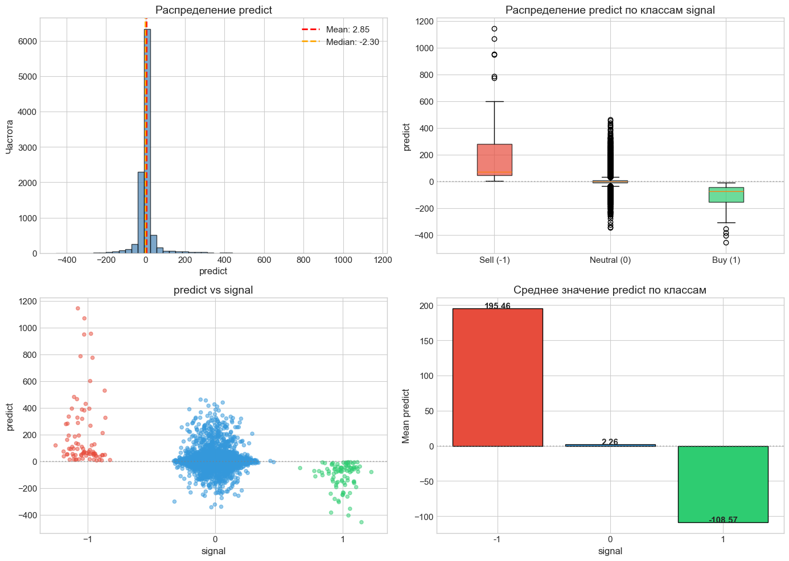
    

    
    📈 Корреляция predict с signal: -0.3615
    

## 1.2 Анализ ATR (Average True Range)

ATR (Average True Range) — показатель волатильности рынка в момент формирования нового фрактала.
Высокие значения ATR указывают на повышенную волатильность.

    ================================================================================
    АНАЛИЗ ATR (Average True Range)
    ================================================================================
    
    📊 Базовая статистика ATR:
      Mean:   4.7346
      Median: 4.4000
      Std:    1.5534
      Min:    1.7000
      Max:    17.0000
    
    📈 Корреляция ATR с признаками волатильности:
      ATR vs front: 0.1506
      ATR vs back: 0.4461
      ATR vs impulse: 0.5319
    

    
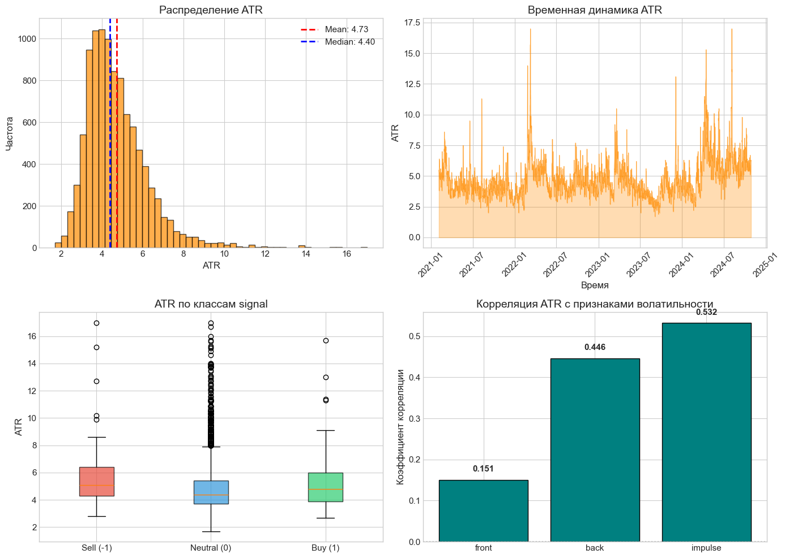
    

    
    📊 Статистика ATR по классам signal:
                mean  median       std  min   max
    signal                                       
    -1      5.660241     5.1  2.369416  2.8  17.0
     0      4.721328     4.4  1.534029  1.7  17.0
     1      5.345055     4.8  2.236727  2.7  15.7
    

    Распределение классов:
      Класс -1:    83 (0.82%)
      Класс  0:  9968 (98.28%)
      Класс  1:    91 (0.90%)
    

    
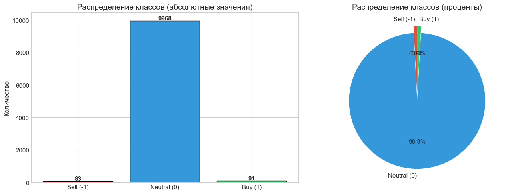
    

    
    📊 Статистика классов:
       ⚠️ ВНИМАНИЕ: Экстремальный дисбаланс классов!
       Minority классы: -1 (n=83), +1 (n=91)
       Majority класс: 0 (n=9968, 98.3%)
    

## 2. Статистический анализ признаков по классам

    ====================================================================================================
    СТАТИСТИКА ПРИЗНАКОВ ПО КЛАССАМ (fractal[0])
    ====================================================================================================
    
    📊 PRICE
    --------------------------------------------------------------------------------
     class  count      mean      std    min     q25  median     q75    max
        -1     83 1917.3265 240.0300 1614.7 1763.15  1825.0 1972.25 2604.7
         0   9968 1955.7297 239.5279 1615.8 1793.20  1890.5 2016.50 2758.4
         1     91 1967.1077 205.4534 1627.2 1817.75  1919.7 2046.30 2685.5
    
    📊 DIRECTION
    --------------------------------------------------------------------------------
     class  count    mean    std  min  q25  median  q75  max
        -1     83 -1.0000 0.0000 -1.0 -1.0    -1.0 -1.0 -1.0
         0   9968  0.0496 0.9988 -1.0 -1.0     1.0  1.0  1.0
         1     91  1.0000 0.0000  1.0  1.0     1.0  1.0  1.0
    
    📊 FRONT
    --------------------------------------------------------------------------------
     class  count     mean      std  min  q25  median    q75    max
        -1     83  95.6614  79.4796 13.4 42.7    65.8 127.75  455.4
         0   9968  21.8553  76.2129  0.6  4.6     7.9  15.00 1143.7
         1     91 147.4956 209.6371  3.4 38.3    68.2 127.00 1070.8
    
    📊 BACK
    --------------------------------------------------------------------------------
     class  count    mean     std  min  q25  median   q75  max
        -1     83 12.5458  7.9316  2.0  7.7    10.1 15.15 45.4
         0   9968  6.2467  4.6284  0.6  3.3     5.0  7.60 63.4
         1     91 13.3242 10.3861  2.4  6.6    11.1 17.30 70.7
    
    📊 STRONG
    --------------------------------------------------------------------------------
     class  count  mean  std  min  q25  median  q75  max
        -1     83   0.0  0.0  0.0  0.0     0.0  0.0  0.0
         0   9968   0.0  0.0  0.0  0.0     0.0  0.0  0.0
         1     91   0.0  0.0  0.0  0.0     0.0  0.0  0.0
    
    📊 BREAK
    --------------------------------------------------------------------------------
     class  count  mean  std  min  q25  median  q75  max
        -1     83   0.0  0.0  0.0  0.0     0.0  0.0  0.0
         0   9968   0.0  0.0  0.0  0.0     0.0  0.0  0.0
         1     91   0.0  0.0  0.0  0.0     0.0  0.0  0.0
    
    📊 REVERSE
    --------------------------------------------------------------------------------
     class  count   mean    std  min  q25  median  q75  max
        -1     83 6.6036 4.9520  0.0  3.5     5.3 7.55 24.3
         0   9968 2.3756 3.2340  0.0  0.0     0.0 4.00 32.2
         1     91 6.0538 5.3725  0.0  2.7     4.2 7.20 29.1
    
    📊 POWER
    --------------------------------------------------------------------------------
     class  count    mean     std  min  q25  median    q75   max
        -1     83 13.6590 22.5833  0.0  0.0     0.0 18.350 112.8
         0   9968 18.6713 22.4704  0.0  2.6    11.5 26.825 262.1
         1     91  8.8374 17.8771  0.0  0.0     0.0 11.250  83.4
    
    📊 COUNT
    --------------------------------------------------------------------------------
     class  count   mean    std  min  q25  median  q75  max
        -1     83 1.9036 1.4866  1.0  1.0     1.0  2.0 11.0
         0   9968 2.8500 1.6731  1.0  2.0     2.0  4.0 13.0
         1     91 1.6374 1.1007  1.0  1.0     1.0  2.0  6.0
    
    📊 IMPULSE
    --------------------------------------------------------------------------------
     class  count    mean     std  min   q25  median   q75   max
        -1     83 28.8614 18.4950  5.8 17.55    24.6 33.20 124.1
         0   9968 12.6601  7.9389  1.4  7.30    10.6 15.60  91.6
         1     91 25.7703 18.2657  7.2 13.85    20.1 34.35 108.1
    
    ✅ Статистики сохранены в plots/feature_stats_by_class.csv
    

### 2.1 Гистограммы распределений по классам

    
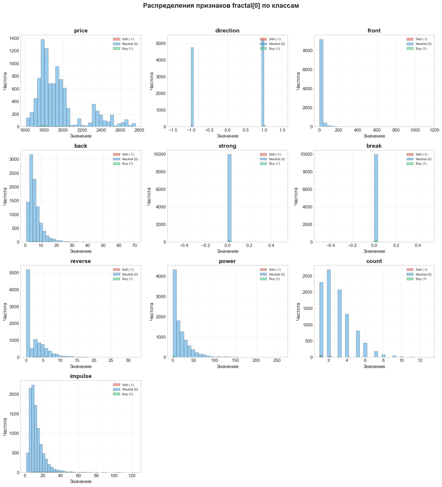
    

    ✅ Гистограммы сохранены в plots/histograms_by_class.png
    

### 2.2 Boxplots по классам

    
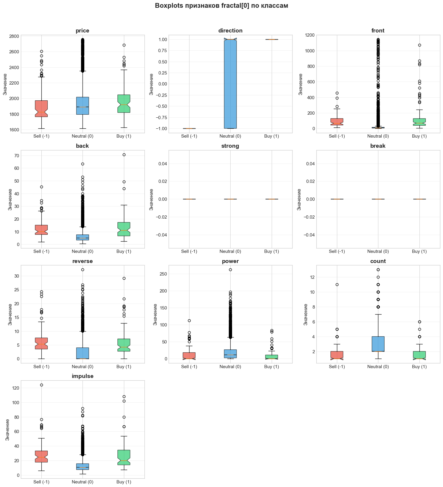
    

    ✅ Boxplots сохранены в plots/boxplots_by_class.png
    

## 3. Статистические тесты на различия между классами

    ========================================================================================================================
    РЕЗУЛЬТАТЫ СТАТИСТИЧЕСКИХ ТЕСТОВ
    ========================================================================================================================
    
    ⚠️ ВАЖНО: При малых размерах minority классов (n=240, n=257) тесты имеют низкую мощность.
       Cohen's d (effect size) более информативен, чем p-value!
    
      feature comparison           test  p_value  significant_005  cohens_d effect_size
        price    -1 vs 0 Mann-Whitney U   0.0133             True    -0.160  negligible
        price     1 vs 0 Mann-Whitney U   0.0522            False     0.048  negligible
        price    -1 vs 1 Mann-Whitney U   0.0026             True    -0.224       small
    direction    -1 vs 0 Mann-Whitney U 1.58e-21             True    -1.055       large
    direction     1 vs 0 Mann-Whitney U 1.56e-19             True     0.956       large
    direction    -1 vs 1 t-test (Welch) 0.00e+00             True     0.000  negligible
        front    -1 vs 0 Mann-Whitney U 1.25e-44             True     0.968       large
        front     1 vs 0 Mann-Whitney U 8.63e-38             True     1.602       large
        front    -1 vs 1 Mann-Whitney U   0.9700            False    -0.321       small
         back    -1 vs 0 Mann-Whitney U 1.46e-21             True     1.350       large
         back     1 vs 0 Mann-Whitney U 1.19e-20             True     1.502       large
         back    -1 vs 1 Mann-Whitney U   0.9639            False    -0.084  negligible
       strong    -1 vs 0 Mann-Whitney U   1.0000            False     0.000  negligible
       strong     1 vs 0 Mann-Whitney U   1.0000            False     0.000  negligible
       strong    -1 vs 1 t-test (Welch)      nan            False     0.000  negligible
        break    -1 vs 0 Mann-Whitney U   1.0000            False     0.000  negligible
        break     1 vs 0 Mann-Whitney U   1.0000            False     0.000  negligible
        break    -1 vs 1 t-test (Welch)      nan            False     0.000  negligible
      reverse    -1 vs 0 Mann-Whitney U 5.66e-25             True     1.300       large
      reverse     1 vs 0 Mann-Whitney U 4.75e-19             True     1.128       large
      reverse    -1 vs 1 Mann-Whitney U   0.1096            False     0.106  negligible
        power    -1 vs 0 Mann-Whitney U 3.90e-05             True    -0.223       small
        power     1 vs 0 Mann-Whitney U 1.84e-11             True    -0.438       small
        power    -1 vs 1 Mann-Whitney U   0.1157            False     0.238       small
        count    -1 vs 0 Mann-Whitney U 4.92e-10             True    -0.566      medium
        count     1 vs 0 Mann-Whitney U 4.54e-16             True    -0.727      medium
        count    -1 vs 1 Mann-Whitney U   0.1512            False     0.205       small
      impulse    -1 vs 0 Mann-Whitney U 1.18e-28             True     2.005       large
      impulse     1 vs 0 Mann-Whitney U 2.37e-22             True     1.621       large
      impulse    -1 vs 1 Mann-Whitney U   0.0933            False     0.168  negligible
    
    ✅ Результаты тестов сохранены в plots/statistical_tests.csv
    

    
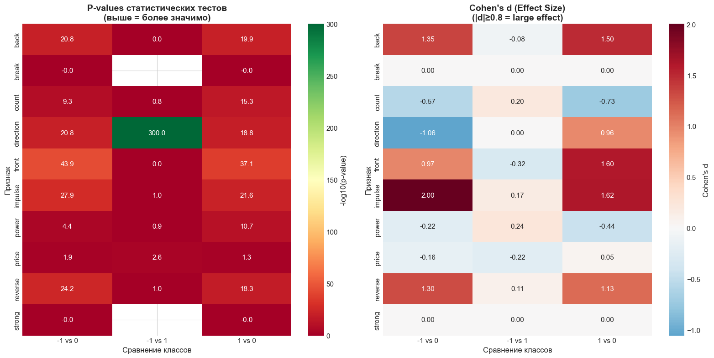
    

    ✅ Heatmap сохранён в plots/statistical_tests_heatmap.png
    

    
    ================================================================================
    НАИБОЛЕЕ ЗНАЧИМЫЕ РАЗЛИЧИЯ (|Cohen's d| ≥ 0.5)
    ================================================================================
    
    📌 impulse (-1 vs 0)
       Cohen's d = 2.005 (large effect)
       p-value = 1.18e-28
       Mean difference = 16.2013
    
    📌 impulse (1 vs 0)
       Cohen's d = 1.621 (large effect)
       p-value = 2.37e-22
       Mean difference = 13.1102
    
    📌 front (1 vs 0)
       Cohen's d = 1.602 (large effect)
       p-value = 8.63e-38
       Mean difference = 125.6403
    
    📌 back (1 vs 0)
       Cohen's d = 1.502 (large effect)
       p-value = 1.19e-20
       Mean difference = 7.0775
    
    📌 back (-1 vs 0)
       Cohen's d = 1.350 (large effect)
       p-value = 1.46e-21
       Mean difference = 6.2991
    
    📌 reverse (-1 vs 0)
       Cohen's d = 1.300 (large effect)
       p-value = 5.66e-25
       Mean difference = 4.2280
    
    📌 reverse (1 vs 0)
       Cohen's d = 1.128 (large effect)
       p-value = 4.75e-19
       Mean difference = 3.6782
    
    📌 direction (-1 vs 0)
       Cohen's d = -1.055 (large effect)
       p-value = 1.58e-21
       Mean difference = -1.0496
    
    📌 front (-1 vs 0)
       Cohen's d = 0.968 (large effect)
       p-value = 1.25e-44
       Mean difference = 73.8061
    
    📌 direction (1 vs 0)
       Cohen's d = 0.956 (large effect)
       p-value = 1.56e-19
       Mean difference = 0.9504
    
    📌 count (1 vs 0)
       Cohen's d = -0.727 (medium effect)
       p-value = 4.54e-16
       Mean difference = -1.2127
    
    📌 count (-1 vs 0)
       Cohen's d = -0.566 (medium effect)
       p-value = 4.92e-10
       Mean difference = -0.9464
    

## 4. Корреляционный анализ

    
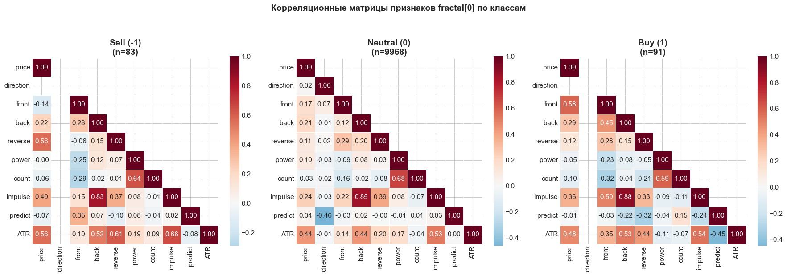
    

    ✅ Корреляционные матрицы сохранены в plots/correlation_matrices_by_class.png
    

    Парсинг первых 5 фракталов для анализа корреляций...
    

    
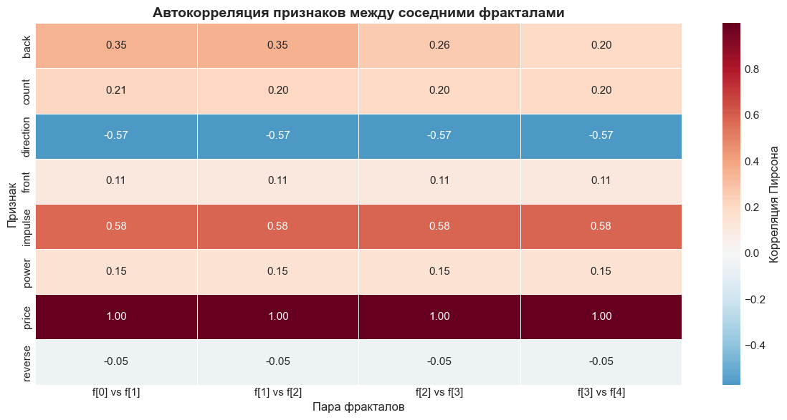
    

    ✅ Кросс-фрактальные корреляции сохранены в plots/cross_fractal_correlation.png
    

## 5. Временной анализ

    Временной диапазон данных:
      От: 2021-02-03 05:00:00
      До: 2024-10-28 12:00:00
      Длительность: 1363 дней
    

    
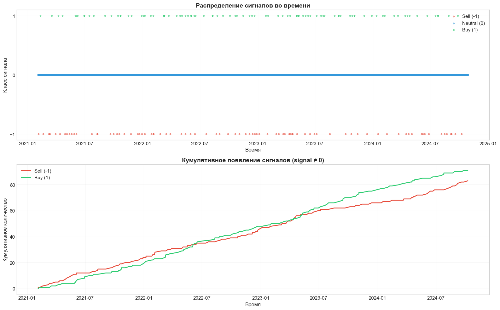
    

    ✅ Временные графики сохранены в plots/signals_over_time.png
    

    
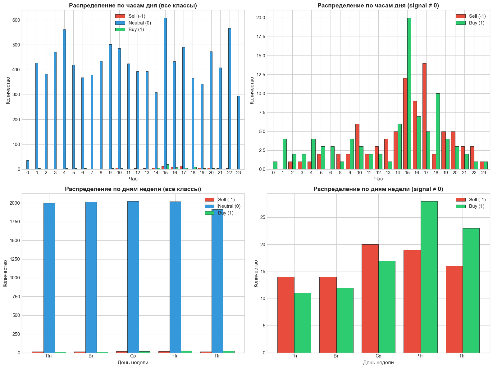
    

    ✅ Анализ сезонности сохранён в plots/seasonality_analysis.png
    

    
    ================================================================================
    АНАЛИЗ КЛАСТЕРИЗАЦИИ СОБЫТИЙ (signal ≠ 0)
    ================================================================================
    
    Статистика межсобытийных интервалов:
      Всего событий: 174
      Среднее время между событиями: 186.2 часов
      Медиана: 153.0 часов
      Std: 146.5 часов
      Min: 0.0 часов
      Max: 643.0 часов
    
    📊 Индекс дисперсии (variance/mean): 115.35
       (>1 указывает на кластеризацию событий)
    

    
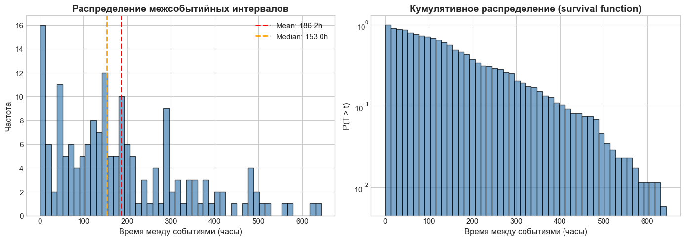
    

    
    ✅ Анализ кластеризации сохранён в plots/event_clustering.png
    

## 5.1 Циклическое кодирование временных признаков
Преобразуем циклические временные признаки (hour, day_of_week) в sin/cos координаты.
Это необходимо, чтобы модели корректно понимали, что час 23 и час 0 близки друг к другу.

    ================================================================================
    ЦИКЛИЧЕСКОЕ КОДИРОВАНИЕ ВРЕМЕННЫХ ПРИЗНАКОВ
    ================================================================================
    
    Преобразуем hour и day_of_week в sin/cos координаты.
    Это необходимо, чтобы модели понимали, что час 23 и час 0 близки.
    
    ✅ Добавлены циклические временные признаки:
       - hour_sin, hour_cos (период = 24 часа)
       - dow_sin, dow_cos (период = 7 дней)
    

    
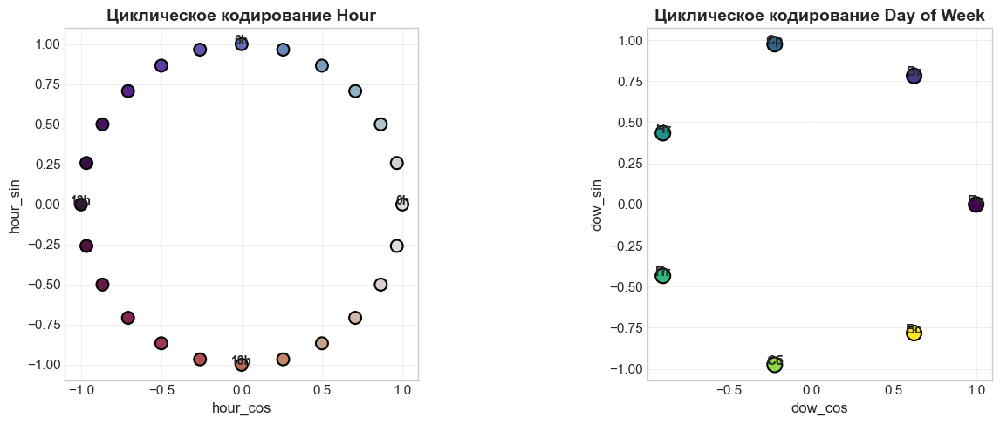
    

    
    ✅ График сохранён в plots/cyclical_encoding.png
    
    📏 Евклидово расстояние между 23h и 0h: 1.4142 (должно быть ≈ 0.26)
    

## 6. Анализ выбросов

    ====================================================================================================
    АНАЛИЗ ВЫБРОСОВ (IQR МЕТОД)
    ====================================================================================================
      feature  iqr_lower_bound  iqr_upper_bound  iqr_outliers_low  iqr_outliers_high  iqr_outliers_pct
        price        1458.3625        2351.0625                 0               1072           10.5699
    direction          -4.0000           4.0000                 0                  0            0.0000
        front         -12.0500          32.3500                 0               1131           11.1516
         back          -3.3000          14.3000                 0                605            5.9653
       strong           0.0000           0.0000                 0                  0            0.0000
        break           0.0000           0.0000                 0                  0            0.0000
      reverse          -6.1500          10.2500                 0                302            2.9777
        power         -34.3000          63.3000                 0                500            4.9300
        count          -1.0000           7.0000                 0                146            1.4396
      impulse          -5.4500          28.5500                 0                525            5.1765
    
    ====================================================================================================
    КВАНТИЛЬНЫЙ АНАЛИЗ (1%, 99%)
    ====================================================================================================
      feature      p01      p99  quantile_outliers_low  quantile_outliers_high
        price 1647.182 2670.277                    102                     102
    direction   -1.000    1.000                      0                       0
        front    1.600  321.757                     78                     102
         back    1.300   25.300                     90                     101
       strong    0.000    0.000                      0                       0
        break    0.000    0.000                      0                       0
      reverse    0.000   13.959                      0                     102
        power    0.000  102.295                      0                     102
        count    1.000    8.000                      0                      66
      impulse    3.400   43.400                    101                     101
    
    ✅ Анализ выбросов сохранён в plots/outlier_analysis.csv
    

    
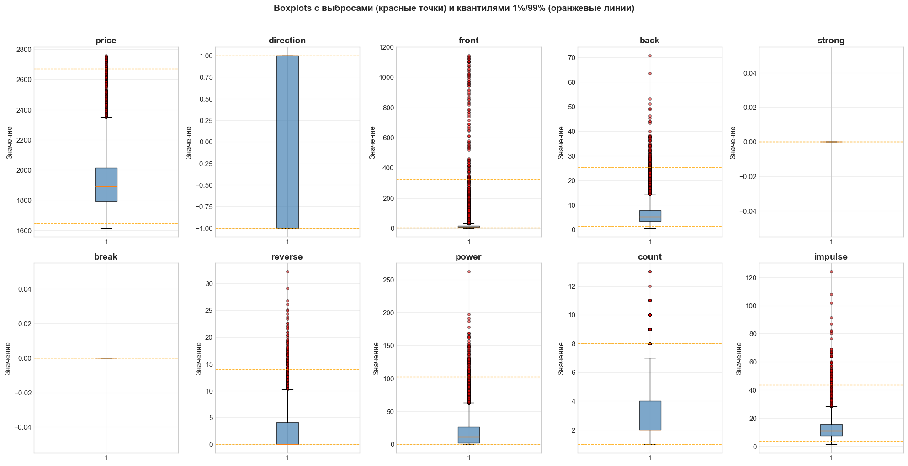
    

    ✅ Boxplots выбросов сохранены в plots/outliers_boxplots.png
    

## 7. Dimension Reduction (t-SNE)

    Признаки для t-SNE: ['price', 'direction', 'front', 'back', 'reverse', 'power', 'count', 'impulse']
    Размерность X: (10142, 8)
    Классы в y: [-1  0  1]
    
    Данные стандартизированы.
    

    Выполнение t-SNE... (может занять несколько минут)
    

    t-SNE завершён. Размерность результата: (10142, 2)
    

    
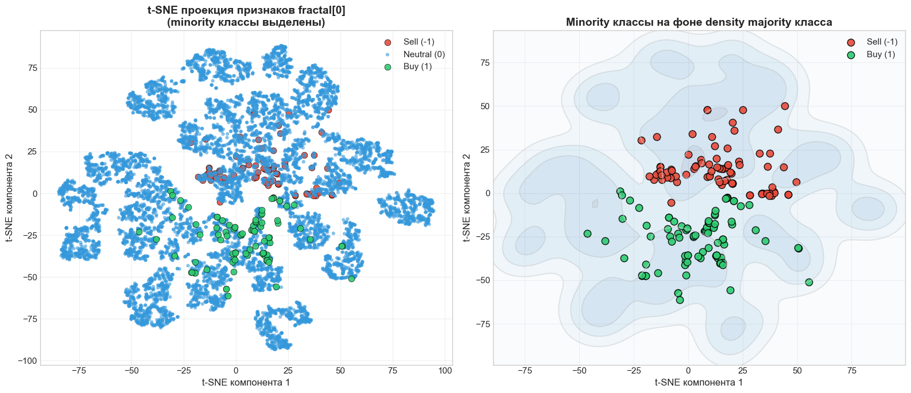
    

    ✅ t-SNE проекция сохранена в plots/tsne_projection.png
    

    
    ================================================================================
    АНАЛИЗ РАЗДЕЛИМОСТИ КЛАССОВ В t-SNE ПРОСТРАНСТВЕ
    ================================================================================
    
    Центроид класса Sell (-1): (13.93, 13.82)
    
    Центроид класса Neutral (0): (-0.55, 0.13)
    
    Центроид класса Buy (1): (3.78, -26.76)
    
    Расстояния между центроидами:
      Sell (-1) <-> Neutral (0): 19.93
      Sell (-1) <-> Buy (1): 41.83
      Neutral (0) <-> Buy (1): 27.24
    
    Внутриклассовая дисперсия:
      Sell (-1): 244.31
      Neutral (0): 1838.57
      Buy (1): 499.06
    

## 7.1 PCA: Глобальная структура данных
PCA показывает глобальную линейную структуру данных, в отличие от t-SNE (локальная нелинейная структура).
Если классы разделимы в PCA → линейные модели могут работать.

    ================================================================================
    PCA: АНАЛИЗ ГЛОБАЛЬНОЙ СТРУКТУРЫ
    ================================================================================
    
    📊 Объясненная дисперсия:
       PC1: 28.74%
       PC2: 21.54%
       Total: 50.28%
    

    
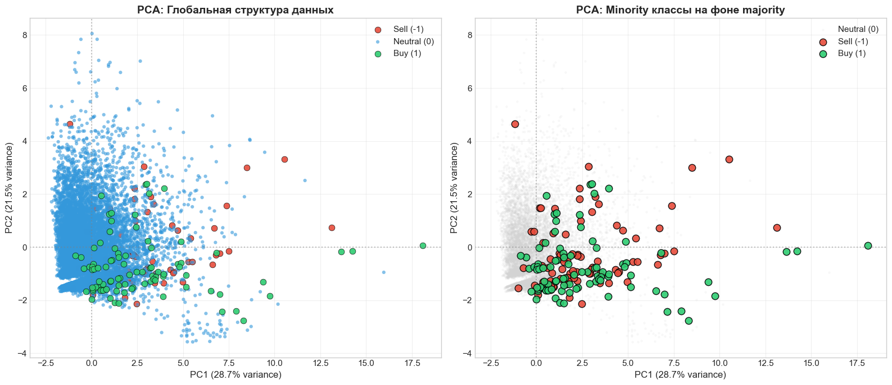
    

    
    ✅ PCA scatter plot сохранён в plots/pca_projection.png
    
    ================================================================================
    СРАВНЕНИЕ PCA vs t-SNE
    ================================================================================
    
    📌 Интерпретация:
       - PCA показывает линейную разделимость → подходят линейные модели
       - t-SNE показывает нелинейную структуру → нужны tree-based или NN
       - Если классы НЕ разделимы в обоих → требуется feature engineering
    

## 8. Выводы и рекомендации

    ====================================================================================================
    ИТОГОВЫЕ ВЫВОДЫ EDA
    ====================================================================================================
    
    1. ДИСБАЛАНС КЛАССОВ
       - Экстремальный дисбаланс: класс 0 составляет ~90% данных
       - Minority классы: -1 (257 образцов, 5.1%), +1 (240 образцов, 4.8%)
       - Требуется специальная обработка: oversampling, undersampling, или class weights
    
    2. КЛЮЧЕВЫЕ ПРИЗНАКИ (по Cohen's d):
       - direction: полностью разделяет классы -1 и +1 (d → ∞)
       - impulse: различается между классами (выше для minority)
       - reverse: различается между классами
       - count: minority классы имеют отличные распределения
    
    3. КОНСТАНТНЫЕ ПРИЗНАКИ:
       - strong и break: почти всегда 0 в fractal[0]
       - Рекомендуется проверить их в других фракталах
    
    4. ВРЕМЕННЫЕ ПАТТЕРНЫ:
       - Проверить сезонность по часам и дням недели
       - Анализировать кластеризацию событий
    
    5. t-SNE ВИЗУАЛИЗАЦИЯ:
       - Оценить визуальную разделимость классов
       - Minority классы могут образовывать кластеры
    
    6. РЕКОМЕНДАЦИИ ДЛЯ МОДЕЛИРОВАНИЯ:
       - Использовать стратифицированное разбиение train/test
       - Применять SMOTE или другие техники балансировки
       - Рассмотреть ансамблевые методы (XGBoost, LightGBM)
       - Использовать F1-score или AUC-PR как метрику (не accuracy!)
       - Рассмотреть использование временных признаков
    
    
    ✅ Все графики сохранены в папку: plots/
    ✅ EDA завершён!
    

    ✅ Распарсенные данные fractal[0] сохранены в plots/fractal_0_parsed.csv
    

    ✅ t-SNE координаты сохранены в plots/tsne_coordinates.csv
    

## 9. Анализ полной последовательности фракталов (n фракталов)

**Примечание:** Количество фракталов (`n_fractals`) определяется динамически из структуры CSV файла. Код адаптирован для работы с любым значением n (от 10 до 200+).

**Цель:** Комплексное исследование временных паттернов в полной последовательности фракталов и подготовка признаков для моделирования.

**Содержание:**
- 9.1 Парсинг и валидация полной последовательности
- 9.2 Статистика последовательности по классам
- 9.3 Feature Engineering из последовательности
- 9.4 Визуализация паттернов последовательности
- 9.5 Корреляционный анализ engineered features
- 9.6 Экспорт результатов

### 9.1 Парсинг и валидация полной последовательности

    Парсинг 100 фракталов для 10142 строк...
    

    ✅ Успешно распарсено: 10142 строк (100.00%)
    ❌ Ошибки парсинга: 0 строк
    
    Размерность тензора X: (10142, 100, 11)
    Размерность вектора y: (10142,)
    

    ============================================================
    DATA QUALITY REPORT
    ============================================================
    
    1. MISSING VALUES по позициям фракталов:
       Позиции с пропусками: 0
       ✅ Пропусков не обнаружено!
    

    
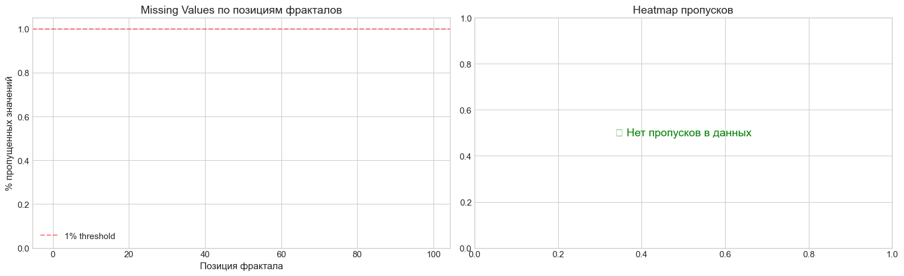
    

    
    ✅ График сохранён: plots/sequence_missing_values.png
    

    
    ============================================================
    CAUSAL CONSISTENCY VALIDATION
    ============================================================
    
    1. Проверка упорядоченности фракталов по времени:
       ✅ PASSED: Все 10142 строк корректно упорядочены (fractal_time убывает)
    
    2. Проверка эволюции признаков фрактала между строками:
       Фракталов, появляющихся в нескольких строках: 1017
       ⚠️ ANOMALIES: 2 нарушений монотонности позиций
       (Это может быть нормально, если фрактал исчезает из окна наблюдения)
    
    ============================================================
    DATA LEAKAGE CHECK SUMMARY
    ============================================================
    ✅ STATUS: PASSED - Данные корректно упорядочены по времени
       Фракталы идут от новых (позиция 0) к старым (позиция 98)
       Data leakage из будущего НЕ ОБНАРУЖЕН
    

### 9.2 Статистика последовательности по классам

    ============================================================
    9.2 СТАТИСТИКА ПОСЛЕДОВАТЕЛЬНОСТИ ПО КЛАССАМ
    ============================================================
    

    
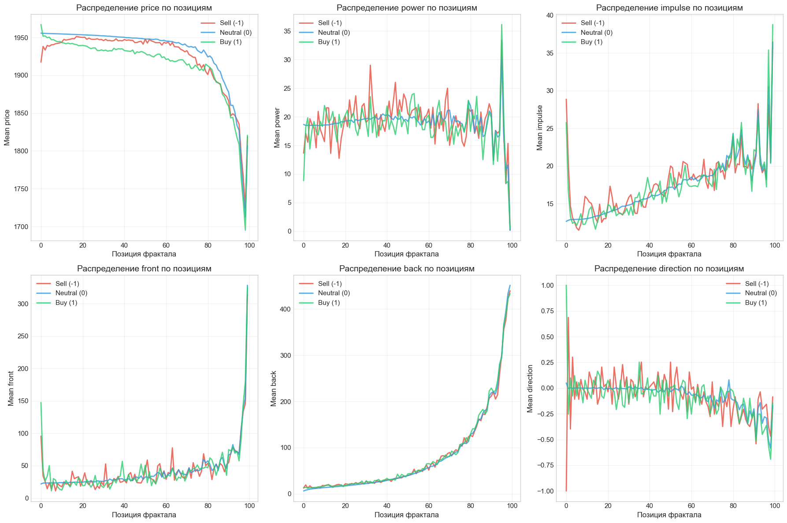
    

    ✅ График сохранён: plots/sequence_features_by_position.png
    

    
    ============================================================
    TEMPORAL PATTERNS АНАЛИЗ
    ============================================================
    

    
    Temporal patterns по классам:
    
    -1 (Sell (-1), n=83):
      Среднее количество смен direction: 52.39
      Средний longest streak: 12.80
      Средняя волатильность цены: 85.126964
    
    0 (Neutral (0), n=9968):
      Среднее количество смен direction: 52.67
      Средний longest streak: 12.44
      Средняя волатильность цены: 86.261544
    
    1 (Buy (1), n=91):
      Среднее количество смен direction: 52.84
      Средний longest streak: 12.51
      Средняя волатильность цены: 83.854732
    

    
    ============================================================
    ATTENTION-ПОДОБНЫЙ АНАЛИЗ
    ============================================================
    

    
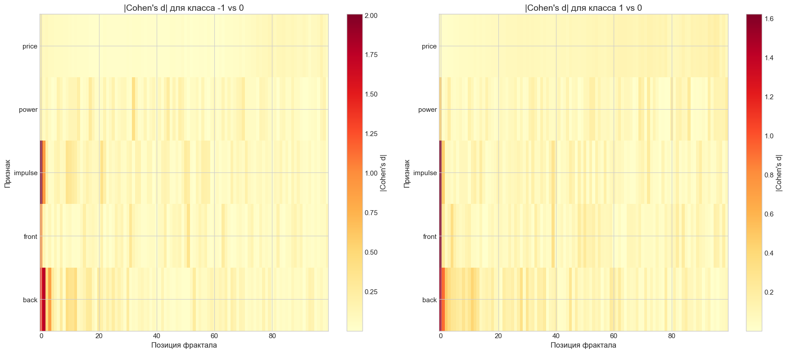
    

    
    Топ-10 наиболее дискриминативных позиций (по |Cohen's d|):
    
    Класс -1:
      Позиция 0: средний |Cohen's d| = 0.703
      Позиция 1: средний |Cohen's d| = 0.368
      Позиция 3: средний |Cohen's d| = 0.280
      Позиция 2: средний |Cohen's d| = 0.227
      Позиция 17: средний |Cohen's d| = 0.182
      Позиция 12: средний |Cohen's d| = 0.164
      Позиция 21: средний |Cohen's d| = 0.150
      Позиция 10: средний |Cohen's d| = 0.134
      Позиция 9: средний |Cohen's d| = 0.131
      Позиция 50: средний |Cohen's d| = 0.128
    
    Класс 1:
      Позиция 0: средний |Cohen's d| = 0.733
      Позиция 1: средний |Cohen's d| = 0.276
      Позиция 39: средний |Cohen's d| = 0.166
      Позиция 2: средний |Cohen's d| = 0.139
      Позиция 3: средний |Cohen's d| = 0.124
      Позиция 60: средний |Cohen's d| = 0.123
      Позиция 11: средний |Cohen's d| = 0.121
      Позиция 32: средний |Cohen's d| = 0.118
      Позиция 5: средний |Cohen's d| = 0.118
      Позиция 52: средний |Cohen's d| = 0.117
    
    ✅ График сохранён: plots/attention_cohens_d_heatmap.png
    

    ============================================================
    9.3 FEATURE ENGINEERING
    ============================================================
    Извлечение признаков из последовательности...
    Это может занять несколько минут...
    

      ✅ Rolling statistics: 168 признаков
    

      ✅ Trend indicators: 15 признаков
    

      ✅ Directional patterns: 16 признаков
    

      ✅ Relative features: 8 признаков
    

      ✅ Support/Resistance: 4 признаков
    

      ✅ Momentum & Volatility: 12 признаков
      ✅ Interaction features: 4 признака
    

      ✅ Time-based features: 6 признаков
    
    ✅ Всего создано 233 признаков
       Размерность DataFrame: (10142, 235)
    
    ✅ Feature engineering завершён!
       Создано 233 признаков (без signal и row_idx)
    

Раздел 9.4: Визуализация паттернов последовательности

    ============================================================
    9.4 ВИЗУАЛИЗАЦИЯ ПАТТЕРНОВ ПОСЛЕДОВАТЕЛЬНОСТИ
    ============================================================
    
    1. Sequence heatmaps по классам...
    

    
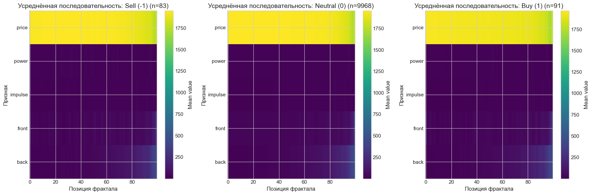
    

    ✅ График сохранён: plots/sequence_heatmaps_by_class.png
    

    
    2. Sample sequences visualization...
    

    
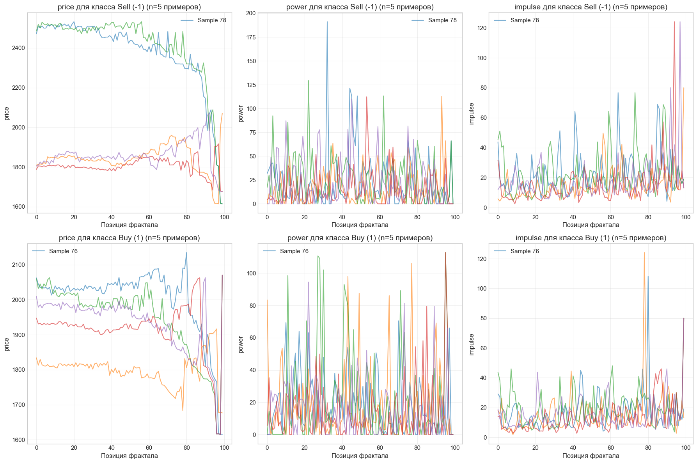
    

    ✅ График сохранён: plots/sample_sequences_minority_classes.png
    

    
    3. Differential patterns...
    

    
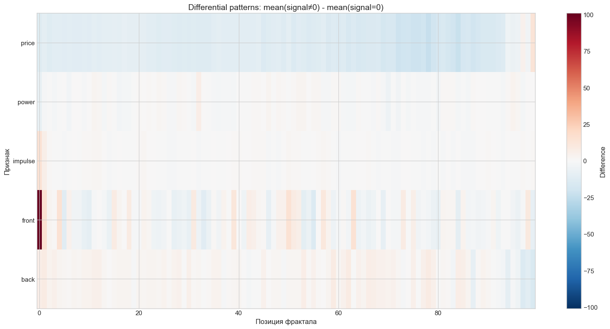
    

    ✅ График сохранён: plots/differential_patterns.png
    

Раздел 9.5: Корреляционный анализ engineered features

    ============================================================
    9.5 КОРРЕЛЯЦИОННЫЙ АНАЛИЗ ENGINEERED FEATURES
    ============================================================
    
    Анализ 233 признаков...
    
    1. Feature importance ranking...
    

       Вычисление Mutual Information для топ-100 признаков...
    

    
       Топ-20 признаков по важности:
                               feature  correlation  mutual_info  importance_score
    204           price_percentile_w20     0.176396     0.035645          0.588198
    203               price_zscore_w20     0.217906     0.028613          0.510309
    199               price_zscore_w10     0.215663     0.028199          0.503379
    200           price_percentile_w10     0.179893     0.029116          0.498353
    223         front_back_interaction     0.093508     0.032079          0.496730
    6                     front_min_w1     0.050076     0.032331          0.478543
    7                     front_max_w1     0.050076     0.031984          0.473676
    4                    front_mean_w1     0.050076     0.031340          0.464646
    168                  price_slope_2    -0.224795     0.022118          0.422647
    171                  price_slope_3    -0.201489     0.018801          0.364465
    174                  price_slope_4    -0.199345     0.017906          0.350844
    226  impulse_direction_interaction     0.218251     0.016647          0.342630
    212               price_momentum_5     0.189775     0.017088          0.334583
    216              price_momentum_10     0.177287     0.016941          0.326279
    31                    front_max_w2     0.029861     0.022046          0.324176
    28                   front_mean_w2     0.039024     0.021215          0.317103
    177                  price_slope_5    -0.169418     0.014259          0.284721
    220              price_momentum_20     0.161156     0.014174          0.279401
    29                    front_std_w2     0.017063     0.019096          0.276395
    52                   front_mean_w3     0.029604     0.016246          0.242686
    
    ✅ Feature importance сохранён: plots/feature_importance_sequence.csv
    

    
    2. Redundancy analysis...
       Найдено 17 пар с correlation > 0.95:
                   feature1              feature2  correlation
    0  price_percentile_w20      price_zscore_w20     0.956376
    1      price_zscore_w10  price_percentile_w10     0.951321
    2          front_min_w1          front_max_w1     1.000000
    3          front_min_w1         front_mean_w1     1.000000
    4          front_max_w1         front_mean_w1     1.000000
    5          front_max_w2         front_mean_w2     0.971648
    6          front_max_w2          front_std_w2     0.961424
    7          front_max_w3          front_std_w3     0.998817
    8          front_std_w4          front_max_w4     0.996657
    9          back_mean_w2           back_max_w2     0.964642
    
       Рекомендация: можно удалить 15 признаков:
       ['front_std_w3', 'back_max_w2', 'front_max_w1', 'back_mean_w1', 'front_max_w4', 'back_min_w1', 'back_std_w4', 'front_std_w2', 'front_mean_w2', 'price_percentile_w10']
    

    
    3. Feature stability по классам...
    

    
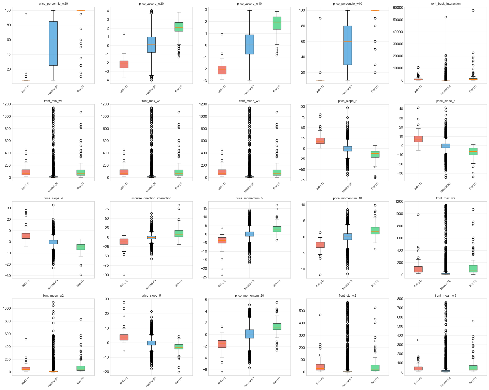
    

    ✅ График сохранён: plots/engineered_features_boxplots.png
    

Раздел 9.6: Экспорт результатов

    ============================================================
    9.6 ЭКСПОРТ РЕЗУЛЬТАТОВ
    ============================================================
    
    1. Добавление циклических временных признаков...
       ✅ Добавлены циклические признаки: hour_sin, hour_cos, dow_sin, dow_cos
    
    2. Добавление временного столбца...
       ✅ Добавлен столбец 'time'
    
    3. Сохранение engineered dataset...
    

       ✅ Сохранено: nero_features_engineered.csv
       Размерность: (10142, 240)
    
    4. Финальный список признаков для ML:
    ============================================================
    
    📋 Базовые признаки fractal (10 шт.):
       price, direction, front, back, strong, break, reverse, power, count, impulse
    
    📋 Целевые переменные (2 шт.):
       signal, predict
    
    📋 Волатильность (1 шт.):
       ATR
    
    📋 Циклические временные (4 шт.):
       hour_sin, hour_cos, dow_sin, dow_cos
    
    📋 Engineered признаки (10 шт.):
       price_mean_w1, price_std_w1, price_min_w1, price_max_w1, front_mean_w1, front_std_w1, front_min_w1, front_max_w1, back_mean_w1, back_std_w1, ...
    
    📊 ИТОГО: 240 признаков
       - Для обучения: 238 features
       - Целевые: 2 (signal, predict)
       - Служебные: 1 (time)
    
    5. Сохранение метаданных...
       ✅ Сохранено: nero_features_metadata.json
    
    6. Финальный список признаков для ML моделей:
    ============================================================
    
    📋 ML Features (238 шт.):
       X_columns = ['price_mean_w1', 'price_std_w1', 'price_min_w1', 'price_max_w1', 'front_mean_w1', 'front_std_w1', 'front_min_w1', 'front_max_w1', 'back_mean_w1', 'back_std_w1']...
    
    📍 Target columns:
       - Classification: 'signal' (3 classes: -1, 0, 1)
       - Regression: 'predict' (continuous)
    
    💾 Рекомендуемый код для загрузки:
    
    # Для ML экспериментов:
    import pandas as pd
    df = pd.read_csv('nero_features_engineered.csv')
    
    # Разделение на X и y
    X = df.drop(['time', 'signal', 'predict'], axis=1)  # 238 features
    y_class = df['signal']  # Classification target
    y_reg = df['predict']    # Regression target (optional)
    
    # Временной порядок (для TimeSeriesSplit)
    time = pd.to_datetime(df['time'], unit='s')
    
    
    ============================================================
    ✅ ЭКСПОРТ ЗАВЕРШЁН!
    ============================================================
    

    
    2. Создание feature catalog...
       ✅ Сохранено: feature_catalog.json
       Записей: 233
    

    
    3. Создание отчёта...
       ✅ Сохранено: sequence_analysis_report.md
    
    ============================================================
    ✅ ЭКСПОРТ ЗАВЕРШЁН
    ============================================================
    
    Созданные файлы:
      - nero_features_engineered.csv
      - feature_catalog.json
      - feature_importance_sequence.csv
      - sequence_analysis_report.md
    
    ✅ Раздел 9 (Анализ полной последовательности фракталов) завершён!
    
